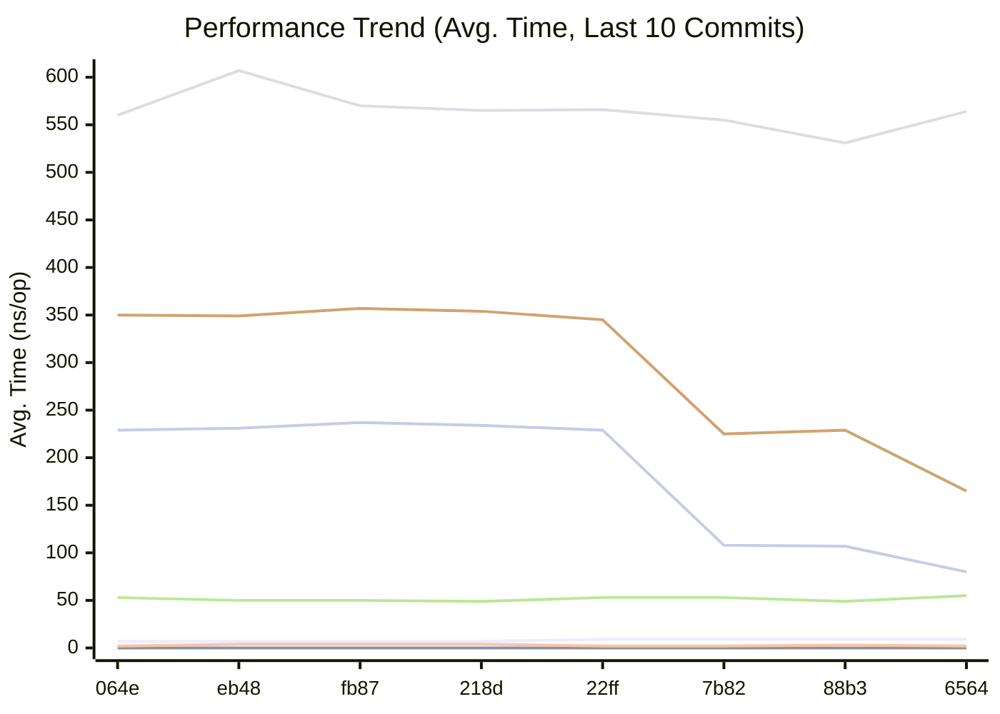
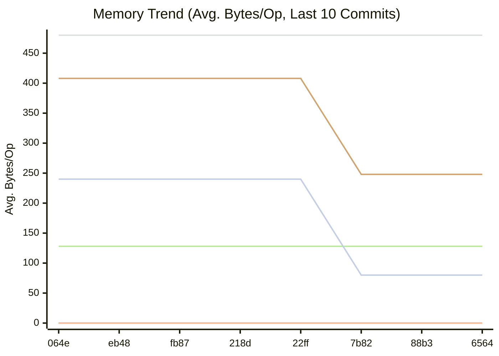
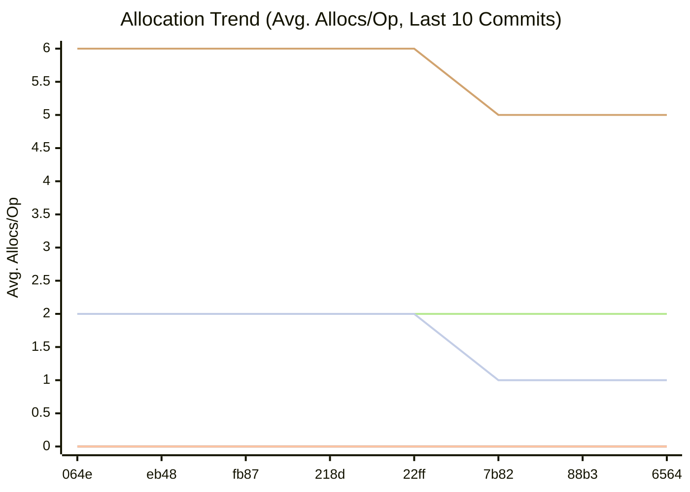

# Momo

Momo is a minimal TCP-based file replication playground written in Go. It demonstrates several replication strategies and a simple, metrics‑driven controller that can switch strategies at runtime (a “polymorphic” system).

This document explains the architecture, configuration, wire protocol, replication modes, and how to run the client and servers.


## Features

- File transfer over plain TCP with per‑chunk streaming.
- Four replication modes: none, chain, splay, and primary‑splay.
- Metrics‑driven mode changes (CPU/memory thresholds + fallback timer).
- Centralized change‑replication control with timestamped updates.
- Simple SHA-256 integrity logging on the receiver.


## Repository Layout

- `src/momo.go`: Entry point (client/server runner and metrics bootstrap).
- `src/common/`: Shared types, config loader, logging, helpers, constants.
  - `constants.go`: Wire/field lengths and replication constants.
  - `config.go`: INI configuration loader (`conf/momo.conf`).
  - `struct.go`: Config and metadata structs.
  - `hash.go`: File SHA-256 hash utility.
  - `log.go`: Toggle logging to stdout.
  - `contains.go`: Slice utility used by metrics.
- `src/server/`: Server daemon, file receive, and replication control server.
  - `server.go`: Main TCP server handling uploads and replication fan‑out.
  - `file.go`: Metadata parsing and file receive logic.
  - `replication.go`: Change‑replication mode server and fan‑out to peers.
- `src/metrics/`: Metrics loop and push of replication changes.
  - `metrics.go`: Samples CPU/mem and decides when to change mode.
  - `replication.go`: Pushes replication updates to the change‑mode server.
- `conf/momo.conf`: Example configuration.


## Runtime Roles

- Client (`-imp client`): Uploads a file to the cluster. Depending on negotiated replication mode, it may also connect to other servers for parallel uploads.
- Server (`-imp server -id N`): Accepts client connections, receives files, and may replicate them to peers depending on the mode and server ID. Server ID defines behavior/affinity.
- Metrics: Runs inside server ID 0 and pushes replication mode changes to all servers when thresholds or fallback timers trigger.


## Replication Modes

Constants (see `src/common/constants.go`):

- `1`: No Replication
- `2`: Chain Replication
- `3`: Splay Replication
- `4`: Primary-Splay Replication

Notes on affinity and selection:

- Server ID 0 is the authority that “chooses” the replication mode and timestamps changes.
- Server ID 1 looks back at the last change timestamp to decide whether to apply the NEW or OLD mode; if the mode is not CHAIN it falls back to NO_REPLICATION on server 1 to avoid undesired fan‑out.
- Server ID 2 always reports NO_REPLICATION during handshake and only receives files if replication is driven from server 0 (splay or primary‑splay) or from server 1 (chain).


## Data Flow

Handshake and transfer overview:

1. Client opens a TCP connection to the primary server (usually server 0) and sends a 19‑byte timestamp.
2. Server decides the effective replication mode for this connection and responds with a one‑digit ASCII mode code.
3. Client sends metadata: 64‑byte hex SHA-256 hash, 64‑byte file name (right‑padded with `:`), and 64‑byte decimal file size (right‑padded with `:`).
4. Client streams file bytes in `1024`‑byte chunks until EOF.
5. Server writes the file to disk, validates the hash, and replies with `ACK{serverId}`.
6. Depending on the negotiated mode, additional replication is performed:
   - Chain: receiving server acts as a client to the next server in the chain.
   - Splay: server 0 concurrently uploads to servers 1 and 2.
   - Primary‑splay: client concurrently uploads to servers 0, 1, and 2 concurrently.


## Wire Protocol Details

Lengths (see `src/common/constants.go`):

- Timestamp: `TimestampLength = 19` bytes (ASCII, e.g., `UnixNano`).
- Metadata: `Hash = 64`, `FileInfoLength = 64` for name and size (right‑padded with colons (`:`)).
- Payload: streamed in `BUFFERSIZE = 1024` bytes.

Order:

- Client → Server: `timestamp` → `fileHash` → `fileName` → `fileSize` → file bytes…
- Server → Client: `replicationMode` (single ASCII digit) → after receive, `ACK{serverId}`.

The server reads exactly `fileSize` bytes and discards any extra padding from the last fixed‑size chunk before validating the hash.


## Metrics‑Driven Mode Changes

- Only server ID 0 runs the metrics loop (`GetMetrics`). If `global.polymorphic_system=false`, metrics exit without changes.
- Sampling interval: `metrics.interval` (ms). Fallback timer: `metrics.fallback_interval` (ms).
- Thresholds: if `memUsed` or `cpuUsed` ≥ `max_threshold` then step “right” in `replication_order`; if `memFree` and `cpuFree` ≤ `min_threshold` then step “left”.
- `replication_order` is a CSV list of mode IDs, e.g., `1,2,3,4` means start at primary-splay, step to splay under pressure, and so on.
- Changes are published as JSON `{old,new,timestamp}` to the change‑replication server on daemon 0, which then fans out to daemon 1 and 2.


## Configuration

File: `conf/momo.conf` (loaded by `src/common/config.go`). Example:

```
[global]
debug=true
replication_order=1,2,3,4
polymorphic_system=true

[metrics]
interval=10
min_threshold=0.1
max_threshold=0.9
fallback_interval=30


[daemon.0]
host=localhost:8080
change_replication=localhost:9090
data=/data/0
drive=/dev/sda1

[daemon.1]
host=localhost:8081
change_replication=localhost:9091
data=/data/1
drive=/dev/sdb1

[daemon.2]
host=localhost:8082
change_replication=localhost:9092
data=/data/2
drive=/dev/sdc1
```

Key fields:

- `global.debug`: Enable verbose logging to stdout.
- `global.replication_order`: CSV ordering of allowed modes used by the metrics controller.
- `global.polymorphic_system`: Enable metrics‑driven mode changes.
- `metrics.*`: Sampling interval, fallback timer, and thresholds.
- `daemon.N.host`: TCP endpoint for client uploads.
- `daemon.N.change_replication`: TCP endpoint for replication control server.
- `daemon.N.data`: Directory where files are stored on that server.
- `daemon.N.drive`: The device identifier for the drive where the data directory resides.


## Building and Running

Dependencies (imported):

- `gopkg.in/ini.v1` for configuration.
- `github.com/shirou/gopsutil/v3/{mem,cpu}` for metrics.

Go modules (tailored to this repo layout):

- This repo includes a root `go.mod` using module path `github.com/alsotoes/momo`.
- Internal packages are imported with `github.com/alsotoes/momo/src/...` to match the current `src/` folder layout (no `replace` needed).
- Steps:
  - Ensure Go 1.20+ is installed.
  - From repo root, run: `go mod tidy` (downloads deps) or `go mod download`.
  - Build/run using the file path to `src/momo.go` (examples below).

Adjust `conf/momo.conf` hostnames/ports to match your environment (e.g., localhost ports) and ensure `data` directories exist and are writable on each server node.

Start servers (one per node):

- Server 0: `go run src/momo.go -imp server -id 0`
- Server 1: `go run src/momo.go -imp server -id 1`
- Server 2: `go run src/momo.go -imp server -id 2`

Upload a file as client:

- `go run src/momo.go -imp client -file /path/to/file`

Behavior by mode:

- NO_REPLICATION: only the primary receiver stores the file.
- CHAIN_REPLICATION: 0 stores, then uploads to 1; 1 stores, then uploads to 2.
- SPLAY_REPLICATION: 0 stores and concurrently uploads to 1 and 2.
- PRIMARY_SPLAY_REPLICATION: client uploads to 0, 1, and 2 concurrently.


## Makefile Shortcuts

- Build binary: `make build` (outputs `bin/momo`).
- Tidy deps: `make tidy` and vendor: `make vendor`.
- Run all tests: `make test`
- Run servers: `make run-server ID=0` (or `make server0`, `make server1`, `make server2`).
- Run client: `make run-client FILE=/path/to/file`.


## Docker Compose

- Build images: `docker compose build`
- Start servers: `docker compose up -d server0 server1 server2`
- Tail logs: `docker compose logs -f --tail=100`
- Send a file:
  - Place a file in `./files`, e.g., `echo hello > files/demo.txt`
  - Run client: `docker compose run --rm client -imp client -file /files/demo.txt`
- Check received files on host: `ls -R data/dir1 data/dir2 data/dir3`

Notes:

- Compose service names and container names match the config hostnames (`momo-server{0,1,2}`) used by `conf/momo.conf`.
- Data directories are volume‑mounted under `./data/dir{1,2,3}` to persist files.


## Troubleshooting

- Ports unreachable: verify `host` and `change_replication` endpoints, firewalls, and that servers are listening.
- Data path: ensure `daemon.N.data` directories exist; the server creates files but not parent directories.
- Module import path: if you use modules, initialize `go.mod` with path `github.com/alsotoes/momo` to satisfy imports.
- ACK not received: check that the receiver read exactly `fileSize` bytes; mismatched sizes or truncated sends will stall.
- Replication not changing: confirm `global.polymorphic_system=true`, thresholds, and that only server 0 runs metrics.


## Notes and Caveats

- No authentication or encryption; traffic is plain TCP.
- Error handling is minimal; some paths `os.Exit(1)` on errors.
- Change‑replication server decodes a fixed‑size buffer; ensure the JSON fits within `LENGTHINFO`.
- The hash is logged for integrity, but mismatches don’t block ACK in the current code.
- Affinity: server 0 leads replication changes and timestamps; server 1 constrains non‑chain modes to NO_REPLICATION during handshake.


## Future Improvements

- Stronger protocol framing with explicit lengths and errors.
- TLS and authentication.
- Backpressure and partial‑replication recovery.
- Structured logging and metrics export.
- Tests and tooling around config validation.

<!-- BENCHMARK_RESULTS_START -->
## Performance

This section is automatically updated by our GitHub Actions workflow.

### Comparison with previous commit

```
                      │ old_bench_filtered.txt │       new_bench_filtered.txt        │
                      │         sec/op         │    sec/op      vs base              │
LoadGlobalConfig-4                556.6n ± ∞ ¹    551.2n ± ∞ ¹       ~ (p=0.167 n=5)
PadString-4                       51.43n ± ∞ ¹    51.77n ± ∞ ¹       ~ (p=0.310 n=5)
CheckMetricsAndSwap-4             8.741n ± ∞ ¹    8.753n ± ∞ ¹       ~ (p=0.571 n=5)
IndexSearch-4                     2.185n ± ∞ ¹    2.203n ± ∞ ¹       ~ (p=0.246 n=5)
IndexDirectTracking-4            0.3123n ± ∞ ¹   0.3121n ± ∞ ¹       ~ (p=0.889 n=5)
geomean                           11.13n          11.14n        +0.12%
¹ need >= 6 samples for confidence interval at level 0.95

                      │ old_bench_filtered.txt │       new_bench_filtered.txt        │
                      │          B/op          │    B/op      vs base                │
LoadGlobalConfig-4                 480.0 ± ∞ ¹   480.0 ± ∞ ¹       ~ (p=1.000 n=5) ²
PadString-4                        128.0 ± ∞ ¹   128.0 ± ∞ ¹       ~ (p=1.000 n=5) ²
CheckMetricsAndSwap-4              0.000 ± ∞ ¹   0.000 ± ∞ ¹       ~ (p=1.000 n=5) ²
IndexSearch-4                      0.000 ± ∞ ¹   0.000 ± ∞ ¹       ~ (p=1.000 n=5) ²
IndexDirectTracking-4              0.000 ± ∞ ¹   0.000 ± ∞ ¹       ~ (p=1.000 n=5) ²
geomean                                      ³                +0.00%               ³
¹ need >= 6 samples for confidence interval at level 0.95
² all samples are equal
³ summaries must be >0 to compute geomean

                      │ old_bench_filtered.txt │       new_bench_filtered.txt        │
                      │       allocs/op        │  allocs/op   vs base                │
LoadGlobalConfig-4                 2.000 ± ∞ ¹   2.000 ± ∞ ¹       ~ (p=1.000 n=5) ²
PadString-4                        2.000 ± ∞ ¹   2.000 ± ∞ ¹       ~ (p=1.000 n=5) ²
CheckMetricsAndSwap-4              0.000 ± ∞ ¹   0.000 ± ∞ ¹       ~ (p=1.000 n=5) ²
IndexSearch-4                      0.000 ± ∞ ¹   0.000 ± ∞ ¹       ~ (p=1.000 n=5) ²
IndexDirectTracking-4              0.000 ± ∞ ¹   0.000 ± ∞ ¹       ~ (p=1.000 n=5) ²
geomean                                      ³                +0.00%               ³
¹ need >= 6 samples for confidence interval at level 0.95
² all samples are equal
³ summaries must be >0 to compute geomean
```

### Latest Benchmark Results


| Benchmark | Avg. Time/Op | Avg. Bytes/Op | Avg. Allocs/Op |
|-----------|--------------|---------------|----------------|
| BenchmarkCheckMetricsAndSwap-4 | 8.75 ns/op | 0.00 B/op | 0.00 allocs/op |\n| BenchmarkIndexDirectTracking-4 | 0.31 ns/op | 0.00 B/op | 0.00 allocs/op |\n| BenchmarkIndexSearch-4 | 2.28 ns/op | 0.00 B/op | 0.00 allocs/op |\n| BenchmarkLoadGlobalConfig-4 | 552.24 ns/op | 480.00 B/op | 2.00 allocs/op |\n| BenchmarkPadString-4 | 51.94 ns/op | 128.00 B/op | 2.00 allocs/op |\n

### Performance History

**Legend**

| Color | Benchmark |
|---|---|
| 🟢 | CheckMetricsAndSwap |
| 🔵 | IndexDirectTracking |
| 🔴 | IndexSearch |
| 🟠 | LoadGlobalConfig |






<!-- BENCHMARK_RESULTS_END -->
