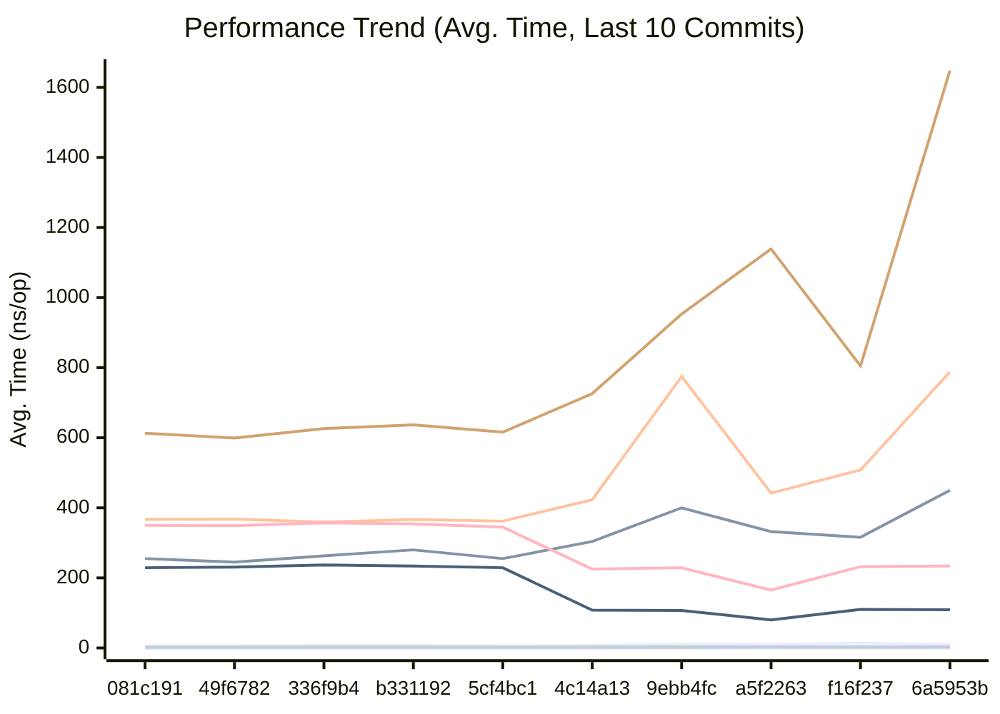
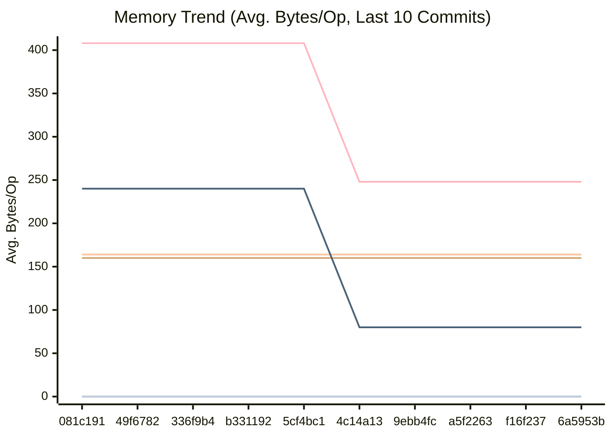
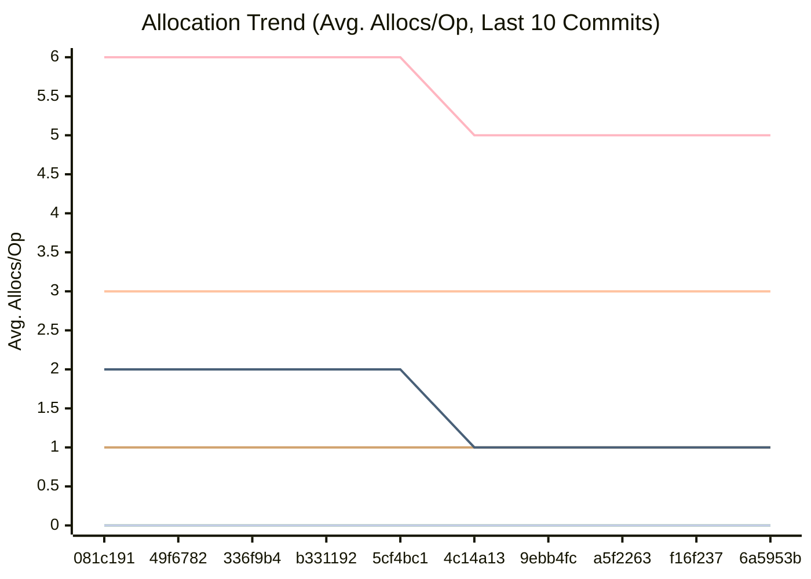

<!-- BENCHMARK_RESULTS_START -->
## Performance

This section is automatically updated by our GitHub Actions workflow.

### Comparison with previous commit

```
                      │ /tmp/old_bench_filtered.txt │      /tmp/new_bench_filtered.txt       │
                      │           sec/op            │    sec/op      vs base                 │
CrushOriginal-8                        442.4n ± ∞ ¹    787.9n ± ∞ ¹        ~ (p=1.000 n=1) ²
CrushOptimized-8                       332.2n ± ∞ ¹    450.0n ± ∞ ¹        ~ (p=1.000 n=1) ²
LoadGlobalConfig-8                     1.139µ ± ∞ ¹    1.648µ ± ∞ ¹        ~ (p=1.000 n=1) ²
PadString-8                            2.707n ± ∞ ¹    3.205n ± ∞ ¹        ~ (p=1.000 n=1) ²
CheckMetricsAndSwap-8                  10.22n ± ∞ ¹    10.27n ± ∞ ¹        ~ (p=1.000 n=1) ²
IndexSearch-8                          3.437n ± ∞ ¹    3.132n ± ∞ ¹        ~ (p=1.000 n=1) ²
IndexDirectTracking-8                 0.4188n ± ∞ ¹   0.4889n ± ∞ ¹        ~ (p=1.000 n=1) ²
geomean                                25.32n          31.30n        +23.64%
¹ need >= 6 samples for confidence interval at level 0.95
² need >= 4 samples to detect a difference at alpha level 0.05

                      │ /tmp/old_bench_filtered.txt │     /tmp/new_bench_filtered.txt     │
                      │            B/op             │    B/op      vs base                │
CrushOriginal-8                         164.0 ± ∞ ¹   164.0 ± ∞ ¹       ~ (p=1.000 n=1) ²
CrushOptimized-8                        0.000 ± ∞ ¹   0.000 ± ∞ ¹       ~ (p=1.000 n=1) ²
LoadGlobalConfig-8                      160.0 ± ∞ ¹   160.0 ± ∞ ¹       ~ (p=1.000 n=1) ²
PadString-8                             0.000 ± ∞ ¹   0.000 ± ∞ ¹       ~ (p=1.000 n=1) ²
CheckMetricsAndSwap-8                   0.000 ± ∞ ¹   0.000 ± ∞ ¹       ~ (p=1.000 n=1) ²
IndexSearch-8                           0.000 ± ∞ ¹   0.000 ± ∞ ¹       ~ (p=1.000 n=1) ²
IndexDirectTracking-8                   0.000 ± ∞ ¹   0.000 ± ∞ ¹       ~ (p=1.000 n=1) ²
geomean                                           ³                +0.00%               ³
¹ need >= 6 samples for confidence interval at level 0.95
² all samples are equal
³ summaries must be >0 to compute geomean

                      │ /tmp/old_bench_filtered.txt │     /tmp/new_bench_filtered.txt     │
                      │          allocs/op          │  allocs/op   vs base                │
CrushOriginal-8                         3.000 ± ∞ ¹   3.000 ± ∞ ¹       ~ (p=1.000 n=1) ²
CrushOptimized-8                        0.000 ± ∞ ¹   0.000 ± ∞ ¹       ~ (p=1.000 n=1) ²
LoadGlobalConfig-8                      1.000 ± ∞ ¹   1.000 ± ∞ ¹       ~ (p=1.000 n=1) ²
PadString-8                             0.000 ± ∞ ¹   0.000 ± ∞ ¹       ~ (p=1.000 n=1) ²
CheckMetricsAndSwap-8                   0.000 ± ∞ ¹   0.000 ± ∞ ¹       ~ (p=1.000 n=1) ²
IndexSearch-8                           0.000 ± ∞ ¹   0.000 ± ∞ ¹       ~ (p=1.000 n=1) ²
IndexDirectTracking-8                   0.000 ± ∞ ¹   0.000 ± ∞ ¹       ~ (p=1.000 n=1) ²
geomean                                           ³                +0.00%               ³
¹ need >= 6 samples for confidence interval at level 0.95
² all samples are equal
³ summaries must be >0 to compute geomean
```

### Latest Benchmark Results


| Benchmark | Avg. Time/Op | Avg. Bytes/Op | Avg. Allocs/Op |
|-----------|--------------|---------------|----------------|
| BenchmarkCheckMetricsAndSwap-8 | 10.27 ns/op | 0.00 B/op | 0.00 allocs/op |
| BenchmarkCrushOptimized-8 | 450.00 ns/op | 0.00 B/op | 0.00 allocs/op |
| BenchmarkCrushOriginal-8 | 787.90 ns/op | 164.00 B/op | 3.00 allocs/op |
| BenchmarkIndexDirectTracking-8 | 0.49 ns/op | 0.00 B/op | 0.00 allocs/op |
| BenchmarkIndexSearch-8 | 3.13 ns/op | 0.00 B/op | 0.00 allocs/op |
| BenchmarkLoadGlobalConfig-8 | 1648.00 ns/op | 160.00 B/op | 1.00 allocs/op |
| BenchmarkPadString-8 | 3.21 ns/op | 0.00 B/op | 0.00 allocs/op |


### Performance History

**Legend**

| Color | Benchmark | Description |
|---|---|---|
| 🟢 | CheckMetricsAndSwap | Evaluation of system metrics (CPU/Mem) and mode switching logic |
| 🟤 | CrushOriginal | Original Sage Weil's CRUSH placement algorithm using reflection and float math |
| ⚪ | CrushOptimized | Performance-tuned CRUSH-lite placement algorithm using bitwise shifts and integer math (Rule 19) |
| 🔵 | IndexDirectTracking | Accessing current replication mode via direct slice index (O(1)) |
| 🔴 | IndexSearch | Searching for current replication mode in the order slice using `slices.Index` |
| 🟠 | LoadGlobalConfig | Parsing and loading the `[global]` section from the INI configuration |
| 🟣 | PadString | Padding strings with null characters to a fixed protocol length |
| 🟡 | ParseReplicationOrder | Parsing the CSV-formatted replication order string into an integer slice |






<!-- BENCHMARK_RESULTS_END -->
