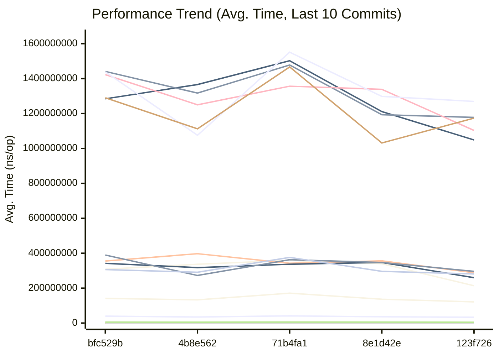
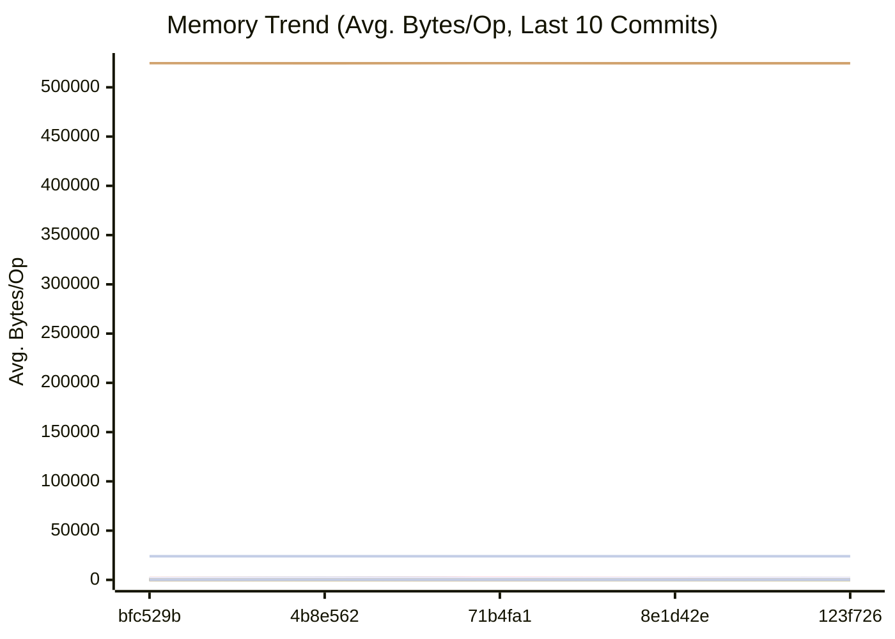
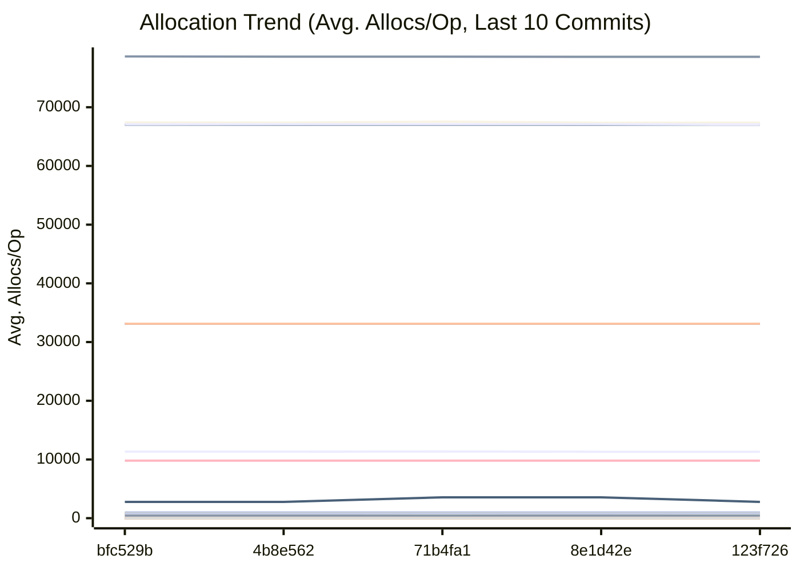

# Performance Benchmarks

This document tracks benchmark performance across commits. The section between
the `BENCHMARK_RESULTS_START/END` markers is auto-generated by the pre-commit
hook; the crypto/OPRF section below is manually maintained.

## How to Read This Document

- **Comparison with previous commit**: `benchstat` output comparing the current
  commit against the previous one. Three tables: **sec/op** (time per operation),
  **B/op** (bytes allocated), **allocs/op** (heap allocations). In each table,
  **lower is better**. `+X%` = regression, `-X%` = improvement, `~` = no
  statistically significant change. `p` is the p-value (p < 0.05 = significant).
- **Latest Benchmark Results**: Single-snapshot table of the current commit's
  averages. Lower values are better across all three columns.
- **Performance Trend plot**: X-axis = commit SHA (left = older, right = newer).
  Y-axis = avg time in ns/op. **Lower lines = faster.** Downward trends are
  improvements; upward spikes are regressions.
- **Memory Trend plot**: Same axes, but Y-axis = avg bytes allocated per op.
  **Lower lines = less memory.** Drops indicate allocation reductions.
- **Allocation Trend plot**: Same axes, but Y-axis = avg heap allocations per op.
  **Lower lines = fewer allocations.** Fewer allocs = less GC pressure.

<!-- BENCHMARK_RESULTS_START -->
## Performance

This section is automatically updated by the pre-commit hook (via .github/scripts/update_readme_with_benchmarks.sh).

### Comparison with previous commit

Each table compares the previous commit (left) to the current commit (right).
**Lower is better** in all three tables. `+X%` = regression, `-X%` = improvement,
`~` = no statistically significant change (p >= 0.05).

- **sec/op**: Time per operation (nanoseconds). Measures raw speed.
- **B/op**: Bytes allocated on the heap per operation. Measures memory usage.
- **allocs/op**: Number of heap allocations per operation. Measures GC pressure.

```
                                      │ /tmp/old_bench_filtered.txt │      /tmp/new_bench_filtered.txt       │
                                      │           sec/op            │    sec/op      vs base                 │
CrushOriginal-8                                        669.7n ± ∞ ¹    499.5n ± ∞ ¹        ~ (p=1.000 n=1) ²
Placement-8                                            6.310µ ± ∞ ¹    5.825µ ± ∞ ¹        ~ (p=1.000 n=1) ²
PlacementDomainSpread-8                                6.385µ ± ∞ ¹    6.405µ ± ∞ ¹        ~ (p=1.000 n=1) ²
CrushOptimized-8                                       371.7n ± ∞ ¹    348.5n ± ∞ ¹        ~ (p=1.000 n=1) ²
LoadGlobalConfig-8                                     13.00µ ± ∞ ¹    10.46µ ± ∞ ¹        ~ (p=1.000 n=1) ²
HashBytes/1MiB-8                                       5.002m ± ∞ ¹    3.553m ± ∞ ¹        ~ (p=1.000 n=1) ²
HashBytes/64MiB-8                                      277.8m ± ∞ ¹    225.3m ± ∞ ¹        ~ (p=1.000 n=1) ²
HashBytes/256MiB-8                                      1.185 ± ∞ ¹     1.045 ± ∞ ¹        ~ (p=1.000 n=1) ²
HashFile/1MiB-8                                        4.311m ± ∞ ¹    4.389m ± ∞ ¹        ~ (p=1.000 n=1) ²
HashFile/64MiB-8                                       287.3m ± ∞ ¹    248.8m ± ∞ ¹        ~ (p=1.000 n=1) ²
HashFile/256MiB-8                                       1.231 ± ∞ ¹     1.036 ± ∞ ¹        ~ (p=1.000 n=1) ²
PadString-8                                            62.50n ± ∞ ¹    58.48n ± ∞ ¹        ~ (p=1.000 n=1) ²
SanitizeLog/Safe-8                                     285.5n ± ∞ ¹    286.1n ± ∞ ¹        ~ (p=1.000 n=1) ²
SanitizeLog/Unsafe-8                                   1.036µ ± ∞ ¹    1.495µ ± ∞ ¹        ~ (p=1.000 n=1) ²
AWSChunkedReaderSigned-8                               564.4µ ± ∞ ¹    758.7µ ± ∞ ¹        ~ (p=1.000 n=1) ²
AWSChunkedReaderUnsigned-8                             593.2µ ± ∞ ¹    672.2µ ± ∞ ¹        ~ (p=1.000 n=1) ²
LastModifiedHeader_AppendFormat-8                      335.1n ± ∞ ¹    327.1n ± ∞ ¹        ~ (p=1.000 n=1) ²
LastModifiedHeader_Format-8                            374.9n ± ∞ ¹    539.7n ± ∞ ¹        ~ (p=1.000 n=1) ²
FormatListObjectsV2XML_AppendFormat-8                  927.0µ ± ∞ ¹    915.2µ ± ∞ ¹        ~ (p=1.000 n=1) ²
FormatListObjectsV2XML_OldFormat-8                     571.3µ ± ∞ ¹    678.6µ ± ∞ ¹        ~ (p=1.000 n=1) ²
CheckMetricsAndSwap-8                                  12.62n ± ∞ ¹    15.16n ± ∞ ¹        ~ (p=1.000 n=1) ²
IndexSearch-8                                          2.044n ± ∞ ¹    3.094n ± ∞ ¹        ~ (p=1.000 n=1) ²
IndexDirectTracking-8                                 0.5080n ± ∞ ¹   0.7993n ± ∞ ¹        ~ (p=1.000 n=1) ²
LocalWrite/1MiB-8                                      429.3µ ± ∞ ¹    817.7µ ± ∞ ¹        ~ (p=1.000 n=1) ²
LocalWrite/64MiB-8                                     30.97m ± ∞ ¹    34.83m ± ∞ ¹        ~ (p=1.000 n=1) ²
LocalWrite/256MiB-8                                    124.1m ± ∞ ¹    158.0m ± ∞ ¹        ~ (p=1.000 n=1) ²
ReadVerify/1MiB-8                                      4.903m ± ∞ ¹    6.082m ± ∞ ¹        ~ (p=1.000 n=1) ²
ReadVerify/64MiB-8                                     315.1m ± ∞ ¹    335.8m ± ∞ ¹        ~ (p=1.000 n=1) ²
ReadVerify/256MiB-8                                    955.4m ± ∞ ¹   1411.1m ± ∞ ¹        ~ (p=1.000 n=1) ²
TrustedRead/1MiB-8                                     4.495m ± ∞ ¹    3.670m ± ∞ ¹        ~ (p=1.000 n=1) ²
TrustedRead/64MiB-8                                    251.6m ± ∞ ¹    338.5m ± ∞ ¹        ~ (p=1.000 n=1) ²
TrustedRead/256MiB-8                                    1.013 ± ∞ ¹     1.649 ± ∞ ¹        ~ (p=1.000 n=1) ²
S3PutSpool/1MiB-8                                      4.750m ± ∞ ¹    6.562m ± ∞ ¹        ~ (p=1.000 n=1) ²
S3PutSpool/64MiB-8                                     271.2m ± ∞ ¹    378.2m ± ∞ ¹        ~ (p=1.000 n=1) ²
S3PutSpool/256MiB-8                                     1.227 ± ∞ ¹     1.141 ± ∞ ¹        ~ (p=1.000 n=1) ²
geomean                                                395.3µ          436.6µ        +10.46%
¹ need >= 6 samples for confidence interval at level 0.95
² need >= 4 samples to detect a difference at alpha level 0.05

                                      │ /tmp/old_bench_filtered.txt │      /tmp/new_bench_filtered.txt      │
                                      │            B/op             │     B/op       vs base                │
CrushOriginal-8                                         164.0 ± ∞ ¹     164.0 ± ∞ ¹       ~ (p=1.000 n=1) ²
Placement-8                                             352.0 ± ∞ ¹     352.0 ± ∞ ¹       ~ (p=1.000 n=1) ²
PlacementDomainSpread-8                                 352.0 ± ∞ ¹     352.0 ± ∞ ¹       ~ (p=1.000 n=1) ²
CrushOptimized-8                                        0.000 ± ∞ ¹     0.000 ± ∞ ¹       ~ (p=1.000 n=1) ²
LoadGlobalConfig-8                                    1.930Ki ± ∞ ¹   1.930Ki ± ∞ ¹       ~ (p=1.000 n=1) ²
HashBytes/1MiB-8                                        64.00 ± ∞ ¹     64.00 ± ∞ ¹       ~ (p=1.000 n=1) ²
HashBytes/64MiB-8                                       64.00 ± ∞ ¹     64.00 ± ∞ ¹       ~ (p=1.000 n=1) ²
HashBytes/256MiB-8                                      64.00 ± ∞ ¹     64.00 ± ∞ ¹       ~ (p=1.000 n=1) ²
HashFile/1MiB-8                                       32.35Ki ± ∞ ¹   32.35Ki ± ∞ ¹       ~ (p=1.000 n=1) ²
HashFile/64MiB-8                                      32.35Ki ± ∞ ¹   32.35Ki ± ∞ ¹       ~ (p=1.000 n=1) ²
HashFile/256MiB-8                                     32.35Ki ± ∞ ¹   32.35Ki ± ∞ ¹       ~ (p=1.000 n=1) ²
PadString-8                                             64.00 ± ∞ ¹     64.00 ± ∞ ¹       ~ (p=1.000 n=1) ²
SanitizeLog/Safe-8                                      0.000 ± ∞ ¹     0.000 ± ∞ ¹       ~ (p=1.000 n=1) ²
SanitizeLog/Unsafe-8                                    704.0 ± ∞ ¹     704.0 ± ∞ ¹       ~ (p=1.000 n=1) ²
AWSChunkedReaderSigned-8                              11.05Ki ± ∞ ¹   11.09Ki ± ∞ ¹       ~ (p=1.000 n=1) ³
AWSChunkedReaderUnsigned-8                            76.76Ki ± ∞ ¹   76.77Ki ± ∞ ¹       ~ (p=1.000 n=1) ³
LastModifiedHeader_AppendFormat-8                       0.000 ± ∞ ¹     0.000 ± ∞ ¹       ~ (p=1.000 n=1) ²
LastModifiedHeader_Format-8                             32.00 ± ∞ ¹     32.00 ± ∞ ¹       ~ (p=1.000 n=1) ²
FormatListObjectsV2XML_AppendFormat-8                 512.2Ki ± ∞ ¹   512.2Ki ± ∞ ¹       ~ (p=1.000 n=1) ³
FormatListObjectsV2XML_OldFormat-8                    23.44Ki ± ∞ ¹   23.44Ki ± ∞ ¹       ~ (p=1.000 n=1) ²
CheckMetricsAndSwap-8                                   0.000 ± ∞ ¹     0.000 ± ∞ ¹       ~ (p=1.000 n=1) ²
IndexSearch-8                                           0.000 ± ∞ ¹     0.000 ± ∞ ¹       ~ (p=1.000 n=1) ²
IndexDirectTracking-8                                   0.000 ± ∞ ¹     0.000 ± ∞ ¹       ~ (p=1.000 n=1) ²
LocalWrite/1MiB-8                                     65.46Ki ± ∞ ¹   65.46Ki ± ∞ ¹       ~ (p=1.000 n=1) ³
LocalWrite/64MiB-8                                    65.50Ki ± ∞ ¹   65.53Ki ± ∞ ¹       ~ (p=1.000 n=1) ³
LocalWrite/256MiB-8                                   65.75Ki ± ∞ ¹   65.88Ki ± ∞ ¹       ~ (p=1.000 n=1) ³
ReadVerify/1MiB-8                                       460.0 ± ∞ ¹     484.0 ± ∞ ¹       ~ (p=1.000 n=1) ³
ReadVerify/64MiB-8                                    2.711Ki ± ∞ ¹   2.711Ki ± ∞ ¹       ~ (p=1.000 n=1) ²
ReadVerify/256MiB-8                                   5.000Ki ± ∞ ¹   9.578Ki ± ∞ ¹       ~ (p=1.000 n=1) ³
TrustedRead/1MiB-8                                      830.0 ± ∞ ¹     800.0 ± ∞ ¹       ~ (p=1.000 n=1) ³
TrustedRead/64MiB-8                                     800.0 ± ∞ ¹     800.0 ± ∞ ¹       ~ (p=1.000 n=1) ²
TrustedRead/256MiB-8                                    800.0 ± ∞ ¹     800.0 ± ∞ ¹       ~ (p=1.000 n=1) ²
S3PutSpool/1MiB-8                                       447.0 ± ∞ ¹     447.0 ± ∞ ¹       ~ (p=1.000 n=1) ²
S3PutSpool/64MiB-8                                      448.0 ± ∞ ¹     448.0 ± ∞ ¹       ~ (p=1.000 n=1) ²
S3PutSpool/256MiB-8                                     448.0 ± ∞ ¹     448.0 ± ∞ ¹       ~ (p=1.000 n=1) ²
geomean                                                           ⁴                  +1.93%               ⁴
¹ need >= 6 samples for confidence interval at level 0.95
² all samples are equal
³ need >= 4 samples to detect a difference at alpha level 0.05
⁴ summaries must be >0 to compute geomean

                                      │ /tmp/old_bench_filtered.txt │     /tmp/new_bench_filtered.txt      │
                                      │          allocs/op          │  allocs/op    vs base                │
CrushOriginal-8                                         3.000 ± ∞ ¹    3.000 ± ∞ ¹       ~ (p=1.000 n=1) ²
Placement-8                                             6.000 ± ∞ ¹    6.000 ± ∞ ¹       ~ (p=1.000 n=1) ²
PlacementDomainSpread-8                                 6.000 ± ∞ ¹    6.000 ± ∞ ¹       ~ (p=1.000 n=1) ²
CrushOptimized-8                                        0.000 ± ∞ ¹    0.000 ± ∞ ¹       ~ (p=1.000 n=1) ²
LoadGlobalConfig-8                                      58.00 ± ∞ ¹    58.00 ± ∞ ¹       ~ (p=1.000 n=1) ²
HashBytes/1MiB-8                                        1.000 ± ∞ ¹    1.000 ± ∞ ¹       ~ (p=1.000 n=1) ²
HashBytes/64MiB-8                                       1.000 ± ∞ ¹    1.000 ± ∞ ¹       ~ (p=1.000 n=1) ²
HashBytes/256MiB-8                                      1.000 ± ∞ ¹    1.000 ± ∞ ¹       ~ (p=1.000 n=1) ²
HashFile/1MiB-8                                         6.000 ± ∞ ¹    6.000 ± ∞ ¹       ~ (p=1.000 n=1) ²
HashFile/64MiB-8                                        6.000 ± ∞ ¹    6.000 ± ∞ ¹       ~ (p=1.000 n=1) ²
HashFile/256MiB-8                                       6.000 ± ∞ ¹    6.000 ± ∞ ¹       ~ (p=1.000 n=1) ²
PadString-8                                             1.000 ± ∞ ¹    1.000 ± ∞ ¹       ~ (p=1.000 n=1) ²
SanitizeLog/Safe-8                                      0.000 ± ∞ ¹    0.000 ± ∞ ¹       ~ (p=1.000 n=1) ²
SanitizeLog/Unsafe-8                                    1.000 ± ∞ ¹    1.000 ± ∞ ¹       ~ (p=1.000 n=1) ²
AWSChunkedReaderSigned-8                                80.00 ± ∞ ¹    80.00 ± ∞ ¹       ~ (p=1.000 n=1) ²
AWSChunkedReaderUnsigned-8                              15.00 ± ∞ ¹    15.00 ± ∞ ¹       ~ (p=1.000 n=1) ²
LastModifiedHeader_AppendFormat-8                       0.000 ± ∞ ¹    0.000 ± ∞ ¹       ~ (p=1.000 n=1) ²
LastModifiedHeader_Format-8                             1.000 ± ∞ ¹    1.000 ± ∞ ¹       ~ (p=1.000 n=1) ²
FormatListObjectsV2XML_AppendFormat-8                   16.00 ± ∞ ¹    16.00 ± ∞ ¹       ~ (p=1.000 n=1) ²
FormatListObjectsV2XML_OldFormat-8                     1.000k ± ∞ ¹   1.000k ± ∞ ¹       ~ (p=1.000 n=1) ²
CheckMetricsAndSwap-8                                   0.000 ± ∞ ¹    0.000 ± ∞ ¹       ~ (p=1.000 n=1) ²
IndexSearch-8                                           0.000 ± ∞ ¹    0.000 ± ∞ ¹       ~ (p=1.000 n=1) ²
IndexDirectTracking-8                                   0.000 ± ∞ ¹    0.000 ± ∞ ¹       ~ (p=1.000 n=1) ²
LocalWrite/1MiB-8                                       19.00 ± ∞ ¹    18.00 ± ∞ ¹       ~ (p=1.000 n=1) ³
LocalWrite/64MiB-8                                      18.00 ± ∞ ¹    18.00 ± ∞ ¹       ~ (p=1.000 n=1) ²
LocalWrite/256MiB-8                                     20.00 ± ∞ ¹    21.00 ± ∞ ¹       ~ (p=1.000 n=1) ³
ReadVerify/1MiB-8                                       6.000 ± ∞ ¹    6.000 ± ∞ ¹       ~ (p=1.000 n=1) ²
ReadVerify/64MiB-8                                      7.000 ± ∞ ¹    7.000 ± ∞ ¹       ~ (p=1.000 n=1) ²
ReadVerify/256MiB-8                                     8.000 ± ∞ ¹   10.000 ± ∞ ¹       ~ (p=1.000 n=1) ³
TrustedRead/1MiB-8                                      11.00 ± ∞ ¹    11.00 ± ∞ ¹       ~ (p=1.000 n=1) ²
TrustedRead/64MiB-8                                     11.00 ± ∞ ¹    11.00 ± ∞ ¹       ~ (p=1.000 n=1) ²
TrustedRead/256MiB-8                                    11.00 ± ∞ ¹    11.00 ± ∞ ¹       ~ (p=1.000 n=1) ²
S3PutSpool/1MiB-8                                       10.00 ± ∞ ¹    10.00 ± ∞ ¹       ~ (p=1.000 n=1) ²
S3PutSpool/64MiB-8                                      10.00 ± ∞ ¹    10.00 ± ∞ ¹       ~ (p=1.000 n=1) ²
S3PutSpool/256MiB-8                                     10.00 ± ∞ ¹    10.00 ± ∞ ¹       ~ (p=1.000 n=1) ²
geomean                                                           ⁴                 +0.62%               ⁴
¹ need >= 6 samples for confidence interval at level 0.95
² all samples are equal
³ need >= 4 samples to detect a difference at alpha level 0.05
⁴ summaries must be >0 to compute geomean

                           │ /tmp/old_bench_filtered.txt │      /tmp/new_bench_filtered.txt       │
                           │             B/s             │      B/s       vs base                 │
HashBytes/1MiB-8                           199.9Mi ± ∞ ¹   281.4Mi ± ∞ ¹        ~ (p=1.000 n=1) ²
HashBytes/64MiB-8                          230.4Mi ± ∞ ¹   284.0Mi ± ∞ ¹        ~ (p=1.000 n=1) ²
HashBytes/256MiB-8                         216.1Mi ± ∞ ¹   245.1Mi ± ∞ ¹        ~ (p=1.000 n=1) ²
HashFile/1MiB-8                            232.0Mi ± ∞ ¹   227.8Mi ± ∞ ¹        ~ (p=1.000 n=1) ²
HashFile/64MiB-8                           222.8Mi ± ∞ ¹   257.2Mi ± ∞ ¹        ~ (p=1.000 n=1) ²
HashFile/256MiB-8                          208.0Mi ± ∞ ¹   247.2Mi ± ∞ ¹        ~ (p=1.000 n=1) ²
AWSChunkedReaderSigned-8                  112.47Mi ± ∞ ¹   83.67Mi ± ∞ ¹        ~ (p=1.000 n=1) ²
AWSChunkedReaderUnsigned-8                107.00Mi ± ∞ ¹   94.43Mi ± ∞ ¹        ~ (p=1.000 n=1) ²
LocalWrite/1MiB-8                          2.275Gi ± ∞ ¹   1.194Gi ± ∞ ¹        ~ (p=1.000 n=1) ²
LocalWrite/64MiB-8                         2.018Gi ± ∞ ¹   1.794Gi ± ∞ ¹        ~ (p=1.000 n=1) ²
LocalWrite/256MiB-8                        2.014Gi ± ∞ ¹   1.582Gi ± ∞ ¹        ~ (p=1.000 n=1) ²
ReadVerify/1MiB-8                          203.9Mi ± ∞ ¹   164.4Mi ± ∞ ¹        ~ (p=1.000 n=1) ²
ReadVerify/64MiB-8                         203.1Mi ± ∞ ¹   190.6Mi ± ∞ ¹        ~ (p=1.000 n=1) ²
ReadVerify/256MiB-8                        268.0Mi ± ∞ ¹   181.4Mi ± ∞ ¹        ~ (p=1.000 n=1) ²
TrustedRead/1MiB-8                         222.5Mi ± ∞ ¹   272.5Mi ± ∞ ¹        ~ (p=1.000 n=1) ²
TrustedRead/64MiB-8                        254.4Mi ± ∞ ¹   189.1Mi ± ∞ ¹        ~ (p=1.000 n=1) ²
TrustedRead/256MiB-8                       252.7Mi ± ∞ ¹   155.3Mi ± ∞ ¹        ~ (p=1.000 n=1) ²
S3PutSpool/1MiB-8                          210.5Mi ± ∞ ¹   152.4Mi ± ∞ ¹        ~ (p=1.000 n=1) ²
S3PutSpool/64MiB-8                         236.0Mi ± ∞ ¹   169.2Mi ± ∞ ¹        ~ (p=1.000 n=1) ²
S3PutSpool/256MiB-8                        208.7Mi ± ∞ ¹   224.4Mi ± ∞ ¹        ~ (p=1.000 n=1) ²
geomean                                    292.5Mi         261.0Mi        -10.78%
¹ need >= 6 samples for confidence interval at level 0.95
² need >= 4 samples to detect a difference at alpha level 0.05
```

### Latest Benchmark Results

Single-snapshot of the current commit's averages. **Lower is better** across all
three columns: time (speed), bytes (memory), allocs (GC pressure).


| Benchmark | Avg. Time/Op | Avg. Bytes/Op | Avg. Allocs/Op |
|-----------|--------------|---------------|----------------|
| BenchmarkAWSChunkedReaderSigned-8 | 758672.00 ns/op | 87.73 B/op | 11352.00 allocs/op |
| BenchmarkAWSChunkedReaderUnsigned-8 | 672192.00 ns/op | 99.02 B/op | 78609.00 allocs/op |
| BenchmarkCheckMetricsAndSwap-8 | 15.16 ns/op | 0.00 B/op | 0.00 allocs/op |
| BenchmarkCrushOptimized-8 | 348.50 ns/op | 0.00 B/op | 0.00 allocs/op |
| BenchmarkCrushOriginal-8 | 499.50 ns/op | 164.00 B/op | 3.00 allocs/op |
| BenchmarkFormatListObjectsV2XML_AppendFormat-8 | 915187.00 ns/op | 524455.00 B/op | 16.00 allocs/op |
| BenchmarkFormatListObjectsV2XML_OldFormat-8 | 678624.00 ns/op | 24000.00 B/op | 1000.00 allocs/op |
| BenchmarkHashBytes/1MiB-8 | 3553145.00 ns/op | 295.11 B/op | 64.00 allocs/op |
| BenchmarkHashBytes/256MiB-8 | 1044551719.00 ns/op | 256.99 B/op | 64.00 allocs/op |
| BenchmarkHashBytes/64MiB-8 | 225326458.00 ns/op | 297.83 B/op | 64.00 allocs/op |
| BenchmarkHashFile/1MiB-8 | 4389479.00 ns/op | 238.88 B/op | 33128.00 allocs/op |
| BenchmarkHashFile/256MiB-8 | 1035601414.00 ns/op | 259.21 B/op | 33128.00 allocs/op |
| BenchmarkHashFile/64MiB-8 | 248823362.00 ns/op | 269.70 B/op | 33128.00 allocs/op |
| BenchmarkIndexDirectTracking-8 | 0.80 ns/op | 0.00 B/op | 0.00 allocs/op |
| BenchmarkIndexSearch-8 | 3.09 ns/op | 0.00 B/op | 0.00 allocs/op |
| BenchmarkLastModifiedHeader_AppendFormat-8 | 327.10 ns/op | 0.00 B/op | 0.00 allocs/op |
| BenchmarkLastModifiedHeader_Format-8 | 539.70 ns/op | 32.00 B/op | 1.00 allocs/op |
| BenchmarkLoadGlobalConfig-8 | 10458.00 ns/op | 1976.00 B/op | 58.00 allocs/op |
| BenchmarkLocalWrite/1MiB-8 | 817681.00 ns/op | 1282.38 B/op | 67036.00 allocs/op |
| BenchmarkLocalWrite/256MiB-8 | 158044809.00 ns/op | 1698.48 B/op | 67465.00 allocs/op |
| BenchmarkLocalWrite/64MiB-8 | 34833751.00 ns/op | 1926.55 B/op | 67103.00 allocs/op |
| BenchmarkPadString-8 | 58.48 ns/op | 64.00 B/op | 1.00 allocs/op |
| BenchmarkPlacement-8 | 5825.00 ns/op | 352.00 B/op | 6.00 allocs/op |
| BenchmarkPlacementDomainSpread-8 | 6405.00 ns/op | 352.00 B/op | 6.00 allocs/op |
| BenchmarkReadVerify/1MiB-8 | 6081724.00 ns/op | 172.41 B/op | 484.00 allocs/op |
| BenchmarkReadVerify/256MiB-8 | 1411104961.00 ns/op | 190.23 B/op | 9808.00 allocs/op |
| BenchmarkReadVerify/64MiB-8 | 335838061.00 ns/op | 199.83 B/op | 2776.00 allocs/op |
| BenchmarkS3PutSpool/1MiB-8 | 6562486.00 ns/op | 159.78 B/op | 447.00 allocs/op |
| BenchmarkS3PutSpool/256MiB-8 | 1140637754.00 ns/op | 235.34 B/op | 448.00 allocs/op |
| BenchmarkS3PutSpool/64MiB-8 | 378241377.00 ns/op | 177.42 B/op | 448.00 allocs/op |
| BenchmarkSanitizeLog/Safe-8 | 286.10 ns/op | 0.00 B/op | 0.00 allocs/op |
| BenchmarkSanitizeLog/Unsafe-8 | 1495.00 ns/op | 704.00 B/op | 1.00 allocs/op |
| BenchmarkTrustedRead/1MiB-8 | 3669866.00 ns/op | 285.73 B/op | 800.00 allocs/op |
| BenchmarkTrustedRead/256MiB-8 | 1648511504.00 ns/op | 162.84 B/op | 800.00 allocs/op |
| BenchmarkTrustedRead/64MiB-8 | 338500502.00 ns/op | 198.25 B/op | 800.00 allocs/op |


### Performance History

**Legend**

| Color | Benchmark | Description |
|---|---|---|
| 🟢 | CheckMetricsAndSwap | Evaluation of system metrics (CPU/Mem) and mode switching logic |
| 🟤 | CrushOriginal | Original Sage Weil's CRUSH placement algorithm using reflection and float math |
| ⚪ | CrushOptimized | Performance-tuned CRUSH-lite placement algorithm using bitwise shifts and integer math (Rule 19) |
| 🔵 | IndexDirectTracking | Accessing current replication mode via direct slice index (O(1)) |
| 🔴 | IndexSearch | Searching for current replication mode in the order slice using `slices.Index` |
| 🟠 | LoadGlobalConfig | Parsing and loading the `[global]` section from the INI configuration |
| 🟣 | PadString | Padding strings with null characters to a fixed protocol length |
| 🟡 | ParseReplicationOrder | Parsing the CSV-formatted replication order string into an integer slice |

#### Time per Operation (ns/op)

X-axis: commit SHA (left = older, right = newer). Y-axis: avg time in ns/op.
**Lower lines = faster code.** Downward trends are improvements; upward spikes
are regressions to investigate.


```mermaid
xychart-beta
    title "Performance Trend (Avg. Time, Last 10 Commits)"
    x-axis "Commit"
    y-axis "Avg. Time (ns/op)"
    x-axis [bfc529b,4b8e562,71b4fa1,8e1d42e,123f726]
    line "AWSChunkedReaderSigned" [721946,582789,741042,596016,541759,554800,615254,528737,564386,758672]
    line "AWSChunkedReaderUnsigned" [695362,580668,721611,624951,521049,581740,507516,587797,593238,672192]
    line "CheckMetricsAndSwap" [14,9,14,13,11,12,11,10,13,15]
    line "CrushOptimized" [532,484,492,487,522,363,426,455,372,348]
    line "CrushOriginal" [715,641,734,697,658,647,700,629,670,500]
    line "FormatListObjectsV2XML_AppendFormat" [1080271,993577,1117129,928365,977381,898486,862695,851540,926975,915187]
    line "FormatListObjectsV2XML_OldFormat" [671030,530555,661534,521514,565611,503389,497195,517753,571332,678624]
    line "HashBytes/1MiB" [3995457,4596495,5621676,4965423,4315588,3618889,5475294,4458201,5002278,3553145]
    line "HashBytes/256MiB" [1284091050,1365990323,1502178110,1211052717,1048575116,1201286487,897333718,1207294588,1184745180,1044551719]
    line "HashBytes/64MiB" [308162718,336895373,359262045,339981640,213869807,301162837,301221390,345018440,277796866,225326458]
    line "HashFile/1MiB" [5430358,4960660,5725417,5039192,3960989,4760647,3647035,4734519,4310666,4389479]
    line "HashFile/256MiB" [1441073207,1316970291,1477907273,1193078064,1177833636,1006415705,1110450496,1224080744,1231037862,1035601414]
    line "HashFile/64MiB" [355303054,397283922,342325433,356293580,288277413,240359009,275852870,300686574,287252666,248823362]
    line "IndexDirectTracking" [1,1,1,0,0,0,0,1,1,1]
    line "IndexSearch" [3,2,3,2,2,2,2,2,2,3]
    line "LastModifiedHeader_AppendFormat" [0,273,377,411,306,291,280,241,335,327]
    line "LastModifiedHeader_Format" [0,359,474,418,381,345,360,407,375,540]
    line "LoadGlobalConfig" [16787,14343,16534,15639,12955,12190,11396,14415,13002,10458]
    line "LocalWrite/1MiB" [627788,515217,653242,620492,558337,524282,489792,546231,429345,817681]
    line "LocalWrite/256MiB" [141240477,133129249,171131397,136595670,121311016,122106179,129421555,120328176,124110973,158044809]
    line "LocalWrite/64MiB" [39561620,34587683,41271450,35901035,33613673,28590856,29289820,30438473,30969681,34833751]
    line "PadString" [97,85,78,64,59,66,60,55,62,58]
    line "ParseReplicationOrder_NoPrealloc" [350,349,357,354,345,225,229,165,232,234]
    line "ParseReplicationOrder_Prealloc" [229,231,237,234,229,108,107,80,110,109]
    line "Placement" [7421,7230,7696,7054,7086,6141,6119,7125,6310,5825]
    line "PlacementDomainSpread" [8867,7769,8677,7666,6917,6176,5740,6962,6385,6405]
    line "ReadVerify/1MiB" [5836051,3976066,5316396,4787467,3900770,3383659,5081549,5082713,4903321,6081724]
    line "ReadVerify/256MiB" [1422892660,1249941171,1356438969,1338425672,1103105249,1170100253,1034709963,1126615995,955370931,1411104961]
    line "ReadVerify/64MiB" [341875566,317667291,337069645,347180139,259882135,240879749,282446554,308997294,315121783,335838061]
    line "S3PutSpool/1MiB" [6588614,5572982,6149011,5304842,5592080,5587762,4022819,5065293,4750326,6562486]
    line "S3PutSpool/256MiB" [1438649885,1075603816,1551204244,1298058993,1269281522,1304442018,1243287804,1504779272,1226604254,1140637754]
    line "S3PutSpool/64MiB" [389689212,272526470,362667390,347153910,296132654,317372640,355710496,276642924,271159852,378241377]
    line "SanitizeLog/Safe" [388,301,419,341,309,277,263,246,286,286]
    line "SanitizeLog/Unsafe" [1274,1021,1210,1000,1005,1021,917,915,1036,1495]
    line "TrustedRead/1MiB" [5334409,5277115,5559663,5638483,4655498,3708543,3570428,4694929,4495398,3669866]
    line "TrustedRead/256MiB" [1290238092,1112381854,1466748131,1031346576,1173571296,1073394044,932638111,1071768789,1012880474,1648511504]
    line "TrustedRead/64MiB" [306360304,291068280,376225072,296255358,281349472,260468873,247394092,261716002,251602823,338500502]
```

#### Memory per Operation (B/op)

X-axis: commit SHA. Y-axis: avg bytes allocated per op.
**Lower lines = less memory.** Drops indicate allocation reductions.


```mermaid
xychart-beta
    title "Memory Trend (Avg. Bytes/Op, Last 10 Commits)"
    x-axis "Commit"
    y-axis "Avg. Bytes/Op"
    x-axis [bfc529b,4b8e562,71b4fa1,8e1d42e,123f726]
    line "AWSChunkedReaderSigned" [92,114,90,112,123,120,108,126,118,88]
    line "AWSChunkedReaderUnsigned" [96,115,92,106,128,114,131,113,112,99]
    line "CheckMetricsAndSwap" [0,0,0,0,0,0,0,0,0,0]
    line "CrushOptimized" [0,0,0,0,0,0,0,0,0,0]
    line "CrushOriginal" [164,164,164,164,164,164,164,164,164,164]
    line "FormatListObjectsV2XML_AppendFormat" [524497,524459,524497,524456,524462,524471,524446,524472,524454,524455]
    line "FormatListObjectsV2XML_OldFormat" [24000,24000,24000,24000,24000,24000,24000,24000,24000,24000]
    line "HashBytes/1MiB" [262,228,187,211,243,290,192,235,210,295]
    line "HashBytes/256MiB" [209,197,179,222,256,223,299,222,227,257]
    line "HashBytes/64MiB" [218,199,187,197,314,223,223,195,242,298]
    line "HashFile/1MiB" [193,211,183,208,265,220,288,221,243,239]
    line "HashFile/256MiB" [186,204,182,225,228,267,242,219,218,259]
    line "HashFile/64MiB" [189,169,196,188,233,279,243,223,234,270]
    line "IndexDirectTracking" [0,0,0,0,0,0,0,0,0,0]
    line "IndexSearch" [0,0,0,0,0,0,0,0,0,0]
    line "LastModifiedHeader_AppendFormat" [0,0,0,0,0,0,0,0,0,0]
    line "LastModifiedHeader_Format" [0,32,32,32,32,32,32,32,32,32]
    line "LoadGlobalConfig" [1976,1976,1976,1976,1976,1976,1976,1976,1976,1976]
    line "LocalWrite/1MiB" [1670,2035,1605,1690,1878,2000,2141,1920,2442,1282]
    line "LocalWrite/256MiB" [1901,2016,1569,1965,2213,2198,2074,2231,2163,1698]
    line "LocalWrite/64MiB" [1696,1940,1626,1869,1996,2347,2291,2205,2167,1927]
    line "PadString" [64,64,64,64,64,64,64,64,64,64]
    line "ParseReplicationOrder_NoPrealloc" [408,408,408,408,408,248,248,248,248,248]
    line "ParseReplicationOrder_Prealloc" [240,240,240,240,240,80,80,80,80,80]
    line "Placement" [352,352,352,352,352,352,352,352,352,352]
    line "PlacementDomainSpread" [352,352,352,352,352,352,352,352,352,352]
    line "ReadVerify/1MiB" [180,264,197,219,269,310,206,206,214,172]
    line "ReadVerify/256MiB" [189,215,198,201,243,229,259,238,281,190]
    line "ReadVerify/64MiB" [196,211,199,193,258,279,238,217,213,200]
    line "S3PutSpool/1MiB" [159,188,171,198,188,188,261,207,221,160]
    line "S3PutSpool/256MiB" [187,250,173,207,211,206,216,178,219,235]
    line "S3PutSpool/64MiB" [172,246,185,193,227,211,189,243,247,177]
    line "SanitizeLog/Safe" [0,0,0,0,0,0,0,0,0,0]
    line "SanitizeLog/Unsafe" [704,704,704,704,704,704,704,704,704,704]
    line "TrustedRead/1MiB" [197,199,189,186,225,283,294,223,233,286]
    line "TrustedRead/256MiB" [208,241,183,260,229,250,288,250,265,163]
    line "TrustedRead/64MiB" [219,231,178,227,239,258,271,256,267,198]
```

#### Allocations per Operation (allocs/op)

X-axis: commit SHA. Y-axis: avg heap allocations per op.
**Lower lines = fewer allocations.** Fewer allocs = less GC pressure.


```mermaid
xychart-beta
    title "Allocation Trend (Avg. Allocs/Op, Last 10 Commits)"
    x-axis "Commit"
    y-axis "Avg. Allocs/Op"
    x-axis [bfc529b,4b8e562,71b4fa1,8e1d42e,123f726]
    line "AWSChunkedReaderSigned" [11338,11329,11352,11316,11313,11300,11299,11305,11315,11352]
    line "AWSChunkedReaderUnsigned" [78651,78603,78618,78588,78582,78589,78575,78586,78603,78609]
    line "CheckMetricsAndSwap" [0,0,0,0,0,0,0,0,0,0]
    line "CrushOptimized" [0,0,0,0,0,0,0,0,0,0]
    line "CrushOriginal" [3,3,3,3,3,3,3,3,3,3]
    line "FormatListObjectsV2XML_AppendFormat" [16,16,16,16,16,16,16,16,16,16]
    line "FormatListObjectsV2XML_OldFormat" [1000,1000,1000,1000,1000,1000,1000,1000,1000,1000]
    line "HashBytes/1MiB" [64,64,64,64,64,64,64,64,64,64]
    line "HashBytes/256MiB" [64,64,64,64,64,64,64,64,64,64]
    line "HashBytes/64MiB" [64,64,64,64,64,64,64,64,64,64]
    line "HashFile/1MiB" [33128,33128,33128,33128,33128,33128,33128,33128,33128,33128]
    line "HashFile/256MiB" [33128,33128,33128,33128,33128,33128,33128,33128,33128,33128]
    line "HashFile/64MiB" [33128,33128,33128,33128,33128,33128,33128,33128,33128,33128]
    line "IndexDirectTracking" [0,0,0,0,0,0,0,0,0,0]
    line "IndexSearch" [0,0,0,0,0,0,0,0,0,0]
    line "LastModifiedHeader_AppendFormat" [0,0,0,0,0,0,0,0,0,0]
    line "LastModifiedHeader_Format" [0,1,1,1,1,1,1,1,1,1]
    line "LoadGlobalConfig" [58,58,58,58,58,58,58,58,58,58]
    line "LocalWrite/1MiB" [67031,67030,67036,67032,67034,67035,67028,67030,67029,67036]
    line "LocalWrite/256MiB" [67413,67386,67552,67369,67393,67386,67388,67358,67330,67465]
    line "LocalWrite/64MiB" [67096,67102,67105,67107,67056,67086,67077,67086,67071,67103]
    line "PadString" [1,1,1,1,1,1,1,1,1,1]
    line "ParseReplicationOrder_NoPrealloc" [6,6,6,6,6,5,5,5,5,5]
    line "ParseReplicationOrder_Prealloc" [2,2,2,2,2,1,1,1,1,1]
    line "Placement" [6,6,6,6,6,6,6,6,6,6]
    line "PlacementDomainSpread" [6,6,6,6,6,6,6,6,6,6]
    line "ReadVerify/1MiB" [473,468,479,467,465,462,461,460,460,484]
    line "ReadVerify/256MiB" [9808,9808,9808,9808,9808,9808,9808,5120,5120,9808]
    line "ReadVerify/64MiB" [2776,2776,3557,3557,2776,2307,2776,2776,2776,2776]
    line "S3PutSpool/1MiB" [447,447,447,447,447,447,447,447,447,447]
    line "S3PutSpool/256MiB" [448,448,448,448,448,448,448,448,448,448]
    line "S3PutSpool/64MiB" [448,448,448,448,448,448,446,448,448,448]
    line "SanitizeLog/Safe" [0,0,0,0,0,0,0,0,0,0]
    line "SanitizeLog/Unsafe" [1,1,1,1,1,1,1,1,1,1]
    line "TrustedRead/1MiB" [839,840,800,834,800,800,800,800,830,800]
    line "TrustedRead/256MiB" [800,800,800,800,800,800,800,800,800,800]
    line "TrustedRead/64MiB" [800,800,800,800,800,800,800,800,800,800]
```
<!-- BENCHMARK_RESULTS_END -->

### E2EE + OPRF overhead

The sections above are auto-generated and cover the hot-path benchmarks. The
crypto/OPRF work is measured separately; figures below are from `go test -bench`
on the crypto module and are intentionally placed outside the auto-managed block
so they persist.

**Lower is better** across all columns. These benchmarks run on `src/crypto` only
(not tracked in the auto-generated plots above).

| Benchmark | What it measures | Avg. Time/Op | Avg. Bytes/Op | Avg. Allocs/Op |
|-----------|------------------|--------------|---------------|----------------|
| EncryptStream | AES-GCM-256 chunked encryption (64KB input) | ~63 µs | 167 KB | 14 |
| DecryptStream | AES-GCM-256 chunked decryption (64KB input) | ~54 µs | 136 KB | 13 |
| DeriveKey | HKDF-SHA256 key derivation per tenant | ~3.5 µs | 1.3 KB | 18 |
| OPRFCombineThreshold3 | Threshold-3 OPRF combine + unblind (Ristretto255) | ~530 µs | 2.3 KB | 62 |

With `encryption_enabled`, every byte passes through AES-GCM-256 streaming at
~800-1200 MB/s (chunk-bounded memory). The streaming format is **StreamVersion
v4 (issue #824)** with a self-describing chunk size: the default 4096-byte
chunk preserves prior throughput, and the chunk size can be raised/lowered via
`SetStreamChunkSize` within `[512, 4128]` for latency/memory trade-offs without
a wire change in framing beyond the 2-byte header field (v3/v2 blobs still
decode). The threshold OPRF is evaluated **once per
upload/download**, on the dedup tag only (never per chunk):
`OPRFCombineThreshold3` measures a one-time ~0.53 ms client-side combine/unblind
for threshold-3, plus one round-trip per daemon share. This is negligible against
network/disk I/O and does not affect streaming throughput. When `oprf_enabled =
false`, the OPRF path is skipped entirely and behavior is identical to the
pre-OPRF encryption path (backward compatible).
