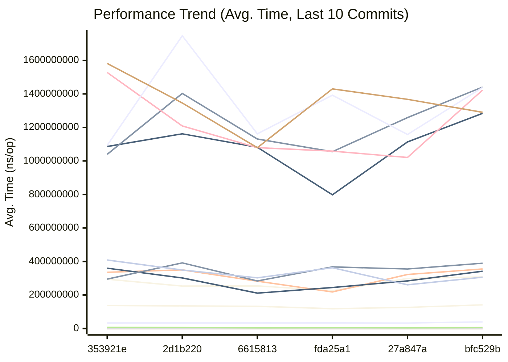
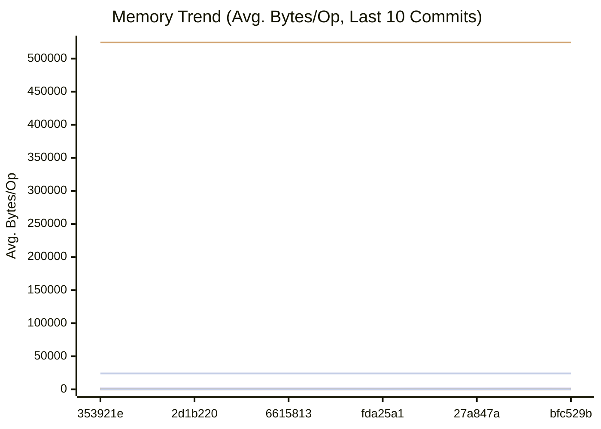
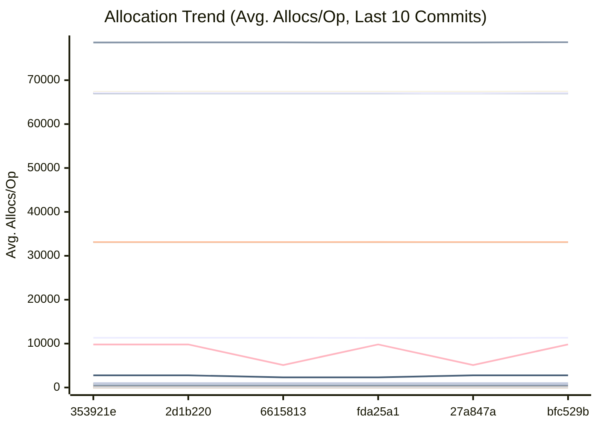

# Performance Benchmarks

This document tracks benchmark performance across commits. The section between
the `BENCHMARK_RESULTS_START/END` markers is auto-generated by the pre-commit
hook; the crypto/OPRF section below is manually maintained.

## How to Read This Document

- **Comparison with previous commit**: `benchstat` output comparing the current
  commit against the previous one. Three tables: **sec/op** (time per operation),
  **B/op** (bytes allocated), **allocs/op** (heap allocations). In each table,
  **lower is better**. `+X%` = regression, `-X%` = improvement, `~` = no
  statistically significant change. `p` is the p-value (p < 0.05 = significant).
- **Latest Benchmark Results**: Single-snapshot table of the current commit's
  averages. Lower values are better across all three columns.
- **Performance Trend plot**: X-axis = commit SHA (left = older, right = newer).
  Y-axis = avg time in ns/op. **Lower lines = faster.** Downward trends are
  improvements; upward spikes are regressions.
- **Memory Trend plot**: Same axes, but Y-axis = avg bytes allocated per op.
  **Lower lines = less memory.** Drops indicate allocation reductions.
- **Allocation Trend plot**: Same axes, but Y-axis = avg heap allocations per op.
  **Lower lines = fewer allocations.** Fewer allocs = less GC pressure.

<!-- BENCHMARK_RESULTS_START -->
## Performance

This section is automatically updated by the pre-commit hook (via .github/scripts/update_readme_with_benchmarks.sh).

### Comparison with previous commit

Each table compares the previous commit (left) to the current commit (right).
**Lower is better** in all three tables. `+X%` = regression, `-X%` = improvement,
`~` = no statistically significant change (p >= 0.05).

- **sec/op**: Time per operation (nanoseconds). Measures raw speed.
- **B/op**: Bytes allocated on the heap per operation. Measures memory usage.
- **allocs/op**: Number of heap allocations per operation. Measures GC pressure.

```
                                      │ /tmp/old_bench_filtered.txt │      /tmp/new_bench_filtered.txt       │
                                      │           sec/op            │    sec/op      vs base                 │
CrushOriginal-8                                        697.2n ± ∞ ¹    658.3n ± ∞ ¹        ~ (p=1.000 n=1) ²
Placement-8                                            7.054µ ± ∞ ¹    7.086µ ± ∞ ¹        ~ (p=1.000 n=1) ²
PlacementDomainSpread-8                                7.666µ ± ∞ ¹    6.917µ ± ∞ ¹        ~ (p=1.000 n=1) ²
CrushOptimized-8                                       487.0n ± ∞ ¹    521.7n ± ∞ ¹        ~ (p=1.000 n=1) ²
LoadGlobalConfig-8                                     15.64µ ± ∞ ¹    12.96µ ± ∞ ¹        ~ (p=1.000 n=1) ²
HashBytes/1MiB-8                                       4.965m ± ∞ ¹    4.316m ± ∞ ¹        ~ (p=1.000 n=1) ²
HashBytes/64MiB-8                                      340.0m ± ∞ ¹    213.9m ± ∞ ¹        ~ (p=1.000 n=1) ²
HashBytes/256MiB-8                                      1.211 ± ∞ ¹     1.049 ± ∞ ¹        ~ (p=1.000 n=1) ²
HashFile/1MiB-8                                        5.039m ± ∞ ¹    3.961m ± ∞ ¹        ~ (p=1.000 n=1) ²
HashFile/64MiB-8                                       356.3m ± ∞ ¹    288.3m ± ∞ ¹        ~ (p=1.000 n=1) ²
HashFile/256MiB-8                                       1.193 ± ∞ ¹     1.178 ± ∞ ¹        ~ (p=1.000 n=1) ²
PadString-8                                            64.37n ± ∞ ¹    58.87n ± ∞ ¹        ~ (p=1.000 n=1) ²
SanitizeLog/Safe-8                                     341.0n ± ∞ ¹    308.9n ± ∞ ¹        ~ (p=1.000 n=1) ²
SanitizeLog/Unsafe-8                                   999.9n ± ∞ ¹   1005.0n ± ∞ ¹        ~ (p=1.000 n=1) ²
AWSChunkedReaderSigned-8                               596.0µ ± ∞ ¹    541.8µ ± ∞ ¹        ~ (p=1.000 n=1) ²
AWSChunkedReaderUnsigned-8                             625.0µ ± ∞ ¹    521.0µ ± ∞ ¹        ~ (p=1.000 n=1) ²
LastModifiedHeader_AppendFormat-8                      410.8n ± ∞ ¹    306.1n ± ∞ ¹        ~ (p=1.000 n=1) ²
LastModifiedHeader_Format-8                            418.4n ± ∞ ¹    380.9n ± ∞ ¹        ~ (p=1.000 n=1) ²
FormatListObjectsV2XML_AppendFormat-8                  928.4µ ± ∞ ¹    977.4µ ± ∞ ¹        ~ (p=1.000 n=1) ²
FormatListObjectsV2XML_OldFormat-8                     521.5µ ± ∞ ¹    565.6µ ± ∞ ¹        ~ (p=1.000 n=1) ²
CheckMetricsAndSwap-8                                  12.80n ± ∞ ¹    10.69n ± ∞ ¹        ~ (p=1.000 n=1) ²
IndexSearch-8                                          2.248n ± ∞ ¹    2.235n ± ∞ ¹        ~ (p=1.000 n=1) ²
IndexDirectTracking-8                                 0.4985n ± ∞ ¹   0.4033n ± ∞ ¹        ~ (p=1.000 n=1) ²
LocalWrite/1MiB-8                                      620.5µ ± ∞ ¹    558.3µ ± ∞ ¹        ~ (p=1.000 n=1) ²
LocalWrite/64MiB-8                                     35.90m ± ∞ ¹    33.61m ± ∞ ¹        ~ (p=1.000 n=1) ²
LocalWrite/256MiB-8                                    136.6m ± ∞ ¹    121.3m ± ∞ ¹        ~ (p=1.000 n=1) ²
ReadVerify/1MiB-8                                      4.787m ± ∞ ¹    3.901m ± ∞ ¹        ~ (p=1.000 n=1) ²
ReadVerify/64MiB-8                                     347.2m ± ∞ ¹    259.9m ± ∞ ¹        ~ (p=1.000 n=1) ²
ReadVerify/256MiB-8                                     1.338 ± ∞ ¹     1.103 ± ∞ ¹        ~ (p=1.000 n=1) ²
TrustedRead/1MiB-8                                     5.638m ± ∞ ¹    4.655m ± ∞ ¹        ~ (p=1.000 n=1) ²
TrustedRead/64MiB-8                                    296.3m ± ∞ ¹    281.3m ± ∞ ¹        ~ (p=1.000 n=1) ²
TrustedRead/256MiB-8                                    1.031 ± ∞ ¹     1.174 ± ∞ ¹        ~ (p=1.000 n=1) ²
S3PutSpool/1MiB-8                                      5.305m ± ∞ ¹    5.592m ± ∞ ¹        ~ (p=1.000 n=1) ²
S3PutSpool/64MiB-8                                     347.2m ± ∞ ¹    296.1m ± ∞ ¹        ~ (p=1.000 n=1) ²
S3PutSpool/256MiB-8                                     1.298 ± ∞ ¹     1.269 ± ∞ ¹        ~ (p=1.000 n=1) ²
geomean                                                440.4µ          394.8µ        -10.35%
¹ need >= 6 samples for confidence interval at level 0.95
² need >= 4 samples to detect a difference at alpha level 0.05

                                      │ /tmp/old_bench_filtered.txt │      /tmp/new_bench_filtered.txt      │
                                      │            B/op             │     B/op       vs base                │
CrushOriginal-8                                         164.0 ± ∞ ¹     164.0 ± ∞ ¹       ~ (p=1.000 n=1) ²
Placement-8                                             352.0 ± ∞ ¹     352.0 ± ∞ ¹       ~ (p=1.000 n=1) ²
PlacementDomainSpread-8                                 352.0 ± ∞ ¹     352.0 ± ∞ ¹       ~ (p=1.000 n=1) ²
CrushOptimized-8                                        0.000 ± ∞ ¹     0.000 ± ∞ ¹       ~ (p=1.000 n=1) ²
LoadGlobalConfig-8                                    1.930Ki ± ∞ ¹   1.930Ki ± ∞ ¹       ~ (p=1.000 n=1) ²
HashBytes/1MiB-8                                        64.00 ± ∞ ¹     64.00 ± ∞ ¹       ~ (p=1.000 n=1) ²
HashBytes/64MiB-8                                       64.00 ± ∞ ¹     64.00 ± ∞ ¹       ~ (p=1.000 n=1) ²
HashBytes/256MiB-8                                      64.00 ± ∞ ¹     64.00 ± ∞ ¹       ~ (p=1.000 n=1) ²
HashFile/1MiB-8                                       32.35Ki ± ∞ ¹   32.35Ki ± ∞ ¹       ~ (p=1.000 n=1) ²
HashFile/64MiB-8                                      32.35Ki ± ∞ ¹   32.35Ki ± ∞ ¹       ~ (p=1.000 n=1) ²
HashFile/256MiB-8                                     32.35Ki ± ∞ ¹   32.35Ki ± ∞ ¹       ~ (p=1.000 n=1) ²
PadString-8                                             64.00 ± ∞ ¹     64.00 ± ∞ ¹       ~ (p=1.000 n=1) ²
SanitizeLog/Safe-8                                      0.000 ± ∞ ¹     0.000 ± ∞ ¹       ~ (p=1.000 n=1) ²
SanitizeLog/Unsafe-8                                    704.0 ± ∞ ¹     704.0 ± ∞ ¹       ~ (p=1.000 n=1) ²
AWSChunkedReaderSigned-8                              11.05Ki ± ∞ ¹   11.05Ki ± ∞ ¹       ~ (p=1.000 n=1) ³
AWSChunkedReaderUnsigned-8                            76.75Ki ± ∞ ¹   76.74Ki ± ∞ ¹       ~ (p=1.000 n=1) ³
LastModifiedHeader_AppendFormat-8                       0.000 ± ∞ ¹     0.000 ± ∞ ¹       ~ (p=1.000 n=1) ²
LastModifiedHeader_Format-8                             32.00 ± ∞ ¹     32.00 ± ∞ ¹       ~ (p=1.000 n=1) ²
FormatListObjectsV2XML_AppendFormat-8                 512.2Ki ± ∞ ¹   512.2Ki ± ∞ ¹       ~ (p=1.000 n=1) ³
FormatListObjectsV2XML_OldFormat-8                    23.44Ki ± ∞ ¹   23.44Ki ± ∞ ¹       ~ (p=1.000 n=1) ²
CheckMetricsAndSwap-8                                   0.000 ± ∞ ¹     0.000 ± ∞ ¹       ~ (p=1.000 n=1) ²
IndexSearch-8                                           0.000 ± ∞ ¹     0.000 ± ∞ ¹       ~ (p=1.000 n=1) ²
IndexDirectTracking-8                                   0.000 ± ∞ ¹     0.000 ± ∞ ¹       ~ (p=1.000 n=1) ²
LocalWrite/1MiB-8                                     65.46Ki ± ∞ ¹   65.46Ki ± ∞ ¹       ~ (p=1.000 n=1) ³
LocalWrite/64MiB-8                                    65.53Ki ± ∞ ¹   65.48Ki ± ∞ ¹       ~ (p=1.000 n=1) ³
LocalWrite/256MiB-8                                   65.79Ki ± ∞ ¹   65.81Ki ± ∞ ¹       ~ (p=1.000 n=1) ³
ReadVerify/1MiB-8                                       467.0 ± ∞ ¹     465.0 ± ∞ ¹       ~ (p=1.000 n=1) ³
ReadVerify/64MiB-8                                    3.474Ki ± ∞ ¹   2.711Ki ± ∞ ¹       ~ (p=1.000 n=1) ³
ReadVerify/256MiB-8                                   9.578Ki ± ∞ ¹   9.578Ki ± ∞ ¹       ~ (p=1.000 n=1) ²
TrustedRead/1MiB-8                                      834.0 ± ∞ ¹     800.0 ± ∞ ¹       ~ (p=1.000 n=1) ³
TrustedRead/64MiB-8                                     800.0 ± ∞ ¹     800.0 ± ∞ ¹       ~ (p=1.000 n=1) ²
TrustedRead/256MiB-8                                    800.0 ± ∞ ¹     800.0 ± ∞ ¹       ~ (p=1.000 n=1) ²
S3PutSpool/1MiB-8                                       447.0 ± ∞ ¹     447.0 ± ∞ ¹       ~ (p=1.000 n=1) ²
S3PutSpool/64MiB-8                                      448.0 ± ∞ ¹     448.0 ± ∞ ¹       ~ (p=1.000 n=1) ²
S3PutSpool/256MiB-8                                     448.0 ± ∞ ¹     448.0 ± ∞ ¹       ~ (p=1.000 n=1) ²
geomean                                                           ⁴                  -0.84%               ⁴
¹ need >= 6 samples for confidence interval at level 0.95
² all samples are equal
³ need >= 4 samples to detect a difference at alpha level 0.05
⁴ summaries must be >0 to compute geomean

                                      │ /tmp/old_bench_filtered.txt │     /tmp/new_bench_filtered.txt      │
                                      │          allocs/op          │  allocs/op    vs base                │
CrushOriginal-8                                         3.000 ± ∞ ¹    3.000 ± ∞ ¹       ~ (p=1.000 n=1) ²
Placement-8                                             6.000 ± ∞ ¹    6.000 ± ∞ ¹       ~ (p=1.000 n=1) ²
PlacementDomainSpread-8                                 6.000 ± ∞ ¹    6.000 ± ∞ ¹       ~ (p=1.000 n=1) ²
CrushOptimized-8                                        0.000 ± ∞ ¹    0.000 ± ∞ ¹       ~ (p=1.000 n=1) ²
LoadGlobalConfig-8                                      58.00 ± ∞ ¹    58.00 ± ∞ ¹       ~ (p=1.000 n=1) ²
HashBytes/1MiB-8                                        1.000 ± ∞ ¹    1.000 ± ∞ ¹       ~ (p=1.000 n=1) ²
HashBytes/64MiB-8                                       1.000 ± ∞ ¹    1.000 ± ∞ ¹       ~ (p=1.000 n=1) ²
HashBytes/256MiB-8                                      1.000 ± ∞ ¹    1.000 ± ∞ ¹       ~ (p=1.000 n=1) ²
HashFile/1MiB-8                                         6.000 ± ∞ ¹    6.000 ± ∞ ¹       ~ (p=1.000 n=1) ²
HashFile/64MiB-8                                        6.000 ± ∞ ¹    6.000 ± ∞ ¹       ~ (p=1.000 n=1) ²
HashFile/256MiB-8                                       6.000 ± ∞ ¹    6.000 ± ∞ ¹       ~ (p=1.000 n=1) ²
PadString-8                                             1.000 ± ∞ ¹    1.000 ± ∞ ¹       ~ (p=1.000 n=1) ²
SanitizeLog/Safe-8                                      0.000 ± ∞ ¹    0.000 ± ∞ ¹       ~ (p=1.000 n=1) ²
SanitizeLog/Unsafe-8                                    1.000 ± ∞ ¹    1.000 ± ∞ ¹       ~ (p=1.000 n=1) ²
AWSChunkedReaderSigned-8                                80.00 ± ∞ ¹    80.00 ± ∞ ¹       ~ (p=1.000 n=1) ²
AWSChunkedReaderUnsigned-8                              15.00 ± ∞ ¹    15.00 ± ∞ ¹       ~ (p=1.000 n=1) ²
LastModifiedHeader_AppendFormat-8                       0.000 ± ∞ ¹    0.000 ± ∞ ¹       ~ (p=1.000 n=1) ²
LastModifiedHeader_Format-8                             1.000 ± ∞ ¹    1.000 ± ∞ ¹       ~ (p=1.000 n=1) ²
FormatListObjectsV2XML_AppendFormat-8                   16.00 ± ∞ ¹    16.00 ± ∞ ¹       ~ (p=1.000 n=1) ²
FormatListObjectsV2XML_OldFormat-8                     1.000k ± ∞ ¹   1.000k ± ∞ ¹       ~ (p=1.000 n=1) ²
CheckMetricsAndSwap-8                                   0.000 ± ∞ ¹    0.000 ± ∞ ¹       ~ (p=1.000 n=1) ²
IndexSearch-8                                           0.000 ± ∞ ¹    0.000 ± ∞ ¹       ~ (p=1.000 n=1) ²
IndexDirectTracking-8                                   0.000 ± ∞ ¹    0.000 ± ∞ ¹       ~ (p=1.000 n=1) ²
LocalWrite/1MiB-8                                       19.00 ± ∞ ¹    18.00 ± ∞ ¹       ~ (p=1.000 n=1) ³
LocalWrite/64MiB-8                                      18.00 ± ∞ ¹    18.00 ± ∞ ¹       ~ (p=1.000 n=1) ²
LocalWrite/256MiB-8                                     20.00 ± ∞ ¹    20.00 ± ∞ ¹       ~ (p=1.000 n=1) ²
ReadVerify/1MiB-8                                       6.000 ± ∞ ¹    6.000 ± ∞ ¹       ~ (p=1.000 n=1) ²
ReadVerify/64MiB-8                                      7.000 ± ∞ ¹    7.000 ± ∞ ¹       ~ (p=1.000 n=1) ²
ReadVerify/256MiB-8                                     10.00 ± ∞ ¹    10.00 ± ∞ ¹       ~ (p=1.000 n=1) ²
TrustedRead/1MiB-8                                      11.00 ± ∞ ¹    11.00 ± ∞ ¹       ~ (p=1.000 n=1) ²
TrustedRead/64MiB-8                                     11.00 ± ∞ ¹    11.00 ± ∞ ¹       ~ (p=1.000 n=1) ²
TrustedRead/256MiB-8                                    11.00 ± ∞ ¹    11.00 ± ∞ ¹       ~ (p=1.000 n=1) ²
S3PutSpool/1MiB-8                                       10.00 ± ∞ ¹    10.00 ± ∞ ¹       ~ (p=1.000 n=1) ²
S3PutSpool/64MiB-8                                      10.00 ± ∞ ¹    10.00 ± ∞ ¹       ~ (p=1.000 n=1) ²
S3PutSpool/256MiB-8                                     10.00 ± ∞ ¹    10.00 ± ∞ ¹       ~ (p=1.000 n=1) ²
geomean                                                           ⁴                 -0.15%               ⁴
¹ need >= 6 samples for confidence interval at level 0.95
² all samples are equal
³ need >= 4 samples to detect a difference at alpha level 0.05
⁴ summaries must be >0 to compute geomean

                           │ /tmp/old_bench_filtered.txt │      /tmp/new_bench_filtered.txt       │
                           │             B/s             │      B/s       vs base                 │
HashBytes/1MiB-8                           201.4Mi ± ∞ ¹   231.7Mi ± ∞ ¹        ~ (p=1.000 n=1) ²
HashBytes/64MiB-8                          188.2Mi ± ∞ ¹   299.2Mi ± ∞ ¹        ~ (p=1.000 n=1) ²
HashBytes/256MiB-8                         211.4Mi ± ∞ ¹   244.1Mi ± ∞ ¹        ~ (p=1.000 n=1) ²
HashFile/1MiB-8                            198.4Mi ± ∞ ¹   252.5Mi ± ∞ ¹        ~ (p=1.000 n=1) ²
HashFile/64MiB-8                           179.6Mi ± ∞ ¹   222.0Mi ± ∞ ¹        ~ (p=1.000 n=1) ²
HashFile/256MiB-8                          214.6Mi ± ∞ ¹   217.4Mi ± ∞ ¹        ~ (p=1.000 n=1) ²
AWSChunkedReaderSigned-8                   106.5Mi ± ∞ ¹   117.2Mi ± ∞ ¹        ~ (p=1.000 n=1) ²
AWSChunkedReaderUnsigned-8                 101.6Mi ± ∞ ¹   121.8Mi ± ∞ ¹        ~ (p=1.000 n=1) ²
LocalWrite/1MiB-8                          1.574Gi ± ∞ ¹   1.749Gi ± ∞ ¹        ~ (p=1.000 n=1) ²
LocalWrite/64MiB-8                         1.741Gi ± ∞ ¹   1.859Gi ± ∞ ¹        ~ (p=1.000 n=1) ²
LocalWrite/256MiB-8                        1.830Gi ± ∞ ¹   2.061Gi ± ∞ ¹        ~ (p=1.000 n=1) ²
ReadVerify/1MiB-8                          208.9Mi ± ∞ ¹   256.4Mi ± ∞ ¹        ~ (p=1.000 n=1) ²
ReadVerify/64MiB-8                         184.3Mi ± ∞ ¹   246.3Mi ± ∞ ¹        ~ (p=1.000 n=1) ²
ReadVerify/256MiB-8                        191.3Mi ± ∞ ¹   232.1Mi ± ∞ ¹        ~ (p=1.000 n=1) ²
TrustedRead/1MiB-8                         177.4Mi ± ∞ ¹   214.8Mi ± ∞ ¹        ~ (p=1.000 n=1) ²
TrustedRead/64MiB-8                        216.0Mi ± ∞ ¹   227.5Mi ± ∞ ¹        ~ (p=1.000 n=1) ²
TrustedRead/256MiB-8                       248.2Mi ± ∞ ¹   218.1Mi ± ∞ ¹        ~ (p=1.000 n=1) ²
S3PutSpool/1MiB-8                          188.5Mi ± ∞ ¹   178.8Mi ± ∞ ¹        ~ (p=1.000 n=1) ²
S3PutSpool/64MiB-8                         184.4Mi ± ∞ ¹   216.1Mi ± ∞ ¹        ~ (p=1.000 n=1) ²
S3PutSpool/256MiB-8                        197.2Mi ± ∞ ¹   201.7Mi ± ∞ ¹        ~ (p=1.000 n=1) ²
geomean                                    258.0Mi         295.5Mi        +14.52%
¹ need >= 6 samples for confidence interval at level 0.95
² need >= 4 samples to detect a difference at alpha level 0.05
```

### Latest Benchmark Results

Single-snapshot of the current commit's averages. **Lower is better** across all
three columns: time (speed), bytes (memory), allocs (GC pressure).


| Benchmark | Avg. Time/Op | Avg. Bytes/Op | Avg. Allocs/Op |
|-----------|--------------|---------------|----------------|
| BenchmarkAWSChunkedReaderSigned-8 | 541759.00 ns/op | 122.86 B/op | 11313.00 allocs/op |
| BenchmarkAWSChunkedReaderUnsigned-8 | 521049.00 ns/op | 127.74 B/op | 78582.00 allocs/op |
| BenchmarkCheckMetricsAndSwap-8 | 10.69 ns/op | 0.00 B/op | 0.00 allocs/op |
| BenchmarkCrushOptimized-8 | 521.70 ns/op | 0.00 B/op | 0.00 allocs/op |
| BenchmarkCrushOriginal-8 | 658.30 ns/op | 164.00 B/op | 3.00 allocs/op |
| BenchmarkFormatListObjectsV2XML_AppendFormat-8 | 977381.00 ns/op | 524462.00 B/op | 16.00 allocs/op |
| BenchmarkFormatListObjectsV2XML_OldFormat-8 | 565611.00 ns/op | 24000.00 B/op | 1000.00 allocs/op |
| BenchmarkHashBytes/1MiB-8 | 4315588.00 ns/op | 242.97 B/op | 64.00 allocs/op |
| BenchmarkHashBytes/256MiB-8 | 1048575116.00 ns/op | 256.00 B/op | 64.00 allocs/op |
| BenchmarkHashBytes/64MiB-8 | 213869807.00 ns/op | 313.78 B/op | 64.00 allocs/op |
| BenchmarkHashFile/1MiB-8 | 3960989.00 ns/op | 264.73 B/op | 33128.00 allocs/op |
| BenchmarkHashFile/256MiB-8 | 1177833636.00 ns/op | 227.91 B/op | 33128.00 allocs/op |
| BenchmarkHashFile/64MiB-8 | 288277413.00 ns/op | 232.79 B/op | 33128.00 allocs/op |
| BenchmarkIndexDirectTracking-8 | 0.40 ns/op | 0.00 B/op | 0.00 allocs/op |
| BenchmarkIndexSearch-8 | 2.23 ns/op | 0.00 B/op | 0.00 allocs/op |
| BenchmarkLastModifiedHeader_AppendFormat-8 | 306.10 ns/op | 0.00 B/op | 0.00 allocs/op |
| BenchmarkLastModifiedHeader_Format-8 | 380.90 ns/op | 32.00 B/op | 1.00 allocs/op |
| BenchmarkLoadGlobalConfig-8 | 12955.00 ns/op | 1976.00 B/op | 58.00 allocs/op |
| BenchmarkLocalWrite/1MiB-8 | 558337.00 ns/op | 1878.03 B/op | 67034.00 allocs/op |
| BenchmarkLocalWrite/256MiB-8 | 121311016.00 ns/op | 2212.79 B/op | 67393.00 allocs/op |
| BenchmarkLocalWrite/64MiB-8 | 33613673.00 ns/op | 1996.48 B/op | 67056.00 allocs/op |
| BenchmarkPadString-8 | 58.87 ns/op | 64.00 B/op | 1.00 allocs/op |
| BenchmarkPlacement-8 | 7086.00 ns/op | 352.00 B/op | 6.00 allocs/op |
| BenchmarkPlacementDomainSpread-8 | 6917.00 ns/op | 352.00 B/op | 6.00 allocs/op |
| BenchmarkReadVerify/1MiB-8 | 3900770.00 ns/op | 268.81 B/op | 465.00 allocs/op |
| BenchmarkReadVerify/256MiB-8 | 1103105249.00 ns/op | 243.35 B/op | 9808.00 allocs/op |
| BenchmarkReadVerify/64MiB-8 | 259882135.00 ns/op | 258.23 B/op | 2776.00 allocs/op |
| BenchmarkS3PutSpool/1MiB-8 | 5592080.00 ns/op | 187.51 B/op | 447.00 allocs/op |
| BenchmarkS3PutSpool/256MiB-8 | 1269281522.00 ns/op | 211.49 B/op | 448.00 allocs/op |
| BenchmarkS3PutSpool/64MiB-8 | 296132654.00 ns/op | 226.62 B/op | 448.00 allocs/op |
| BenchmarkSanitizeLog/Safe-8 | 308.90 ns/op | 0.00 B/op | 0.00 allocs/op |
| BenchmarkSanitizeLog/Unsafe-8 | 1005.00 ns/op | 704.00 B/op | 1.00 allocs/op |
| BenchmarkTrustedRead/1MiB-8 | 4655498.00 ns/op | 225.23 B/op | 800.00 allocs/op |
| BenchmarkTrustedRead/256MiB-8 | 1173571296.00 ns/op | 228.73 B/op | 800.00 allocs/op |
| BenchmarkTrustedRead/64MiB-8 | 281349472.00 ns/op | 238.52 B/op | 800.00 allocs/op |


### Performance History

**Legend**

| Color | Benchmark | Description |
|---|---|---|
| 🟢 | CheckMetricsAndSwap | Evaluation of system metrics (CPU/Mem) and mode switching logic |
| 🟤 | CrushOriginal | Original Sage Weil's CRUSH placement algorithm using reflection and float math |
| ⚪ | CrushOptimized | Performance-tuned CRUSH-lite placement algorithm using bitwise shifts and integer math (Rule 19) |
| 🔵 | IndexDirectTracking | Accessing current replication mode via direct slice index (O(1)) |
| 🔴 | IndexSearch | Searching for current replication mode in the order slice using `slices.Index` |
| 🟠 | LoadGlobalConfig | Parsing and loading the `[global]` section from the INI configuration |
| 🟣 | PadString | Padding strings with null characters to a fixed protocol length |
| 🟡 | ParseReplicationOrder | Parsing the CSV-formatted replication order string into an integer slice |

#### Time per Operation (ns/op)

X-axis: commit SHA (left = older, right = newer). Y-axis: avg time in ns/op.
**Lower lines = faster code.** Downward trends are improvements; upward spikes
are regressions to investigate.


```mermaid
xychart-beta
    title "Performance Trend (Avg. Time, Last 10 Commits)"
    x-axis "Commit"
    y-axis "Avg. Time (ns/op)"
    x-axis [353921e,2d1b220,6615813,fda25a1,27a847a,bfc529b]
    line "AWSChunkedReaderSigned" [636346,690357,622918,512707,501241,721946,582789,741042,596016,541759]
    line "AWSChunkedReaderUnsigned" [613680,684347,616129,457742,556893,695362,580668,721611,624951,521049]
    line "CheckMetricsAndSwap" [13,14,14,10,10,14,9,14,13,11]
    line "CrushOptimized" [383,433,463,354,433,532,484,492,487,522]
    line "CrushOriginal" [678,598,642,502,597,715,641,734,697,658]
    line "FormatListObjectsV2XML_AppendFormat" [876655,1035620,900618,648718,775274,1080271,993577,1117129,928365,977381]
    line "FormatListObjectsV2XML_OldFormat" [499237,554225,498654,406141,479265,671030,530555,661534,521514,565611]
    line "HashBytes/1MiB" [3806841,4997033,4520322,3555390,4784039,3995457,4596495,5621676,4965423,4315588]
    line "HashBytes/256MiB" [1086104803,1161959394,1081431052,798133130,1113482493,1284091050,1365990323,1502178110,1211052717,1048575116]
    line "HashBytes/64MiB" [294324496,253497415,254442334,225124511,298951068,308162718,336895373,359262045,339981640,213869807]
    line "HashFile/1MiB" [4355866,5020414,4836717,3959247,3915050,5430358,4960660,5725417,5039192,3960989]
    line "HashFile/256MiB" [1039461142,1402967574,1130963414,1055197690,1258679744,1441073207,1316970291,1477907273,1193078064,1177833636]
    line "HashFile/64MiB" [335648128,350050718,282645449,218474314,322488540,355303054,397283922,342325433,356293580,288277413]
    line "IndexDirectTracking" [0,1,1,0,1,1,1,1,0,0]
    line "IndexSearch" [2,3,2,2,2,3,2,3,2,2]
    line "LastModifiedHeader_AppendFormat" [0,0,0,0,0,0,273,377,411,306]
    line "LastModifiedHeader_Format" [0,0,0,0,0,0,359,474,418,381]
    line "LoadGlobalConfig" [12586,12915,11283,9939,13465,16787,14343,16534,15639,12955]
    line "LocalWrite/1MiB" [533203,606315,575526,474416,479322,627788,515217,653242,620492,558337]
    line "LocalWrite/256MiB" [137014284,135157963,132539343,118094125,126110483,141240477,133129249,171131397,136595670,121311016]
    line "LocalWrite/64MiB" [32925149,33266024,33235605,33404598,32661319,39561620,34587683,41271450,35901035,33613673]
    line "PadString" [66,65,63,47,69,97,85,78,64,59]
    line "ParseReplicationOrder_NoPrealloc" [350,349,357,354,345,225,229,165,232,234]
    line "ParseReplicationOrder_Prealloc" [229,231,237,234,229,108,107,80,110,109]
    line "Placement" [6982,6435,6648,4864,6529,7421,7230,7696,7054,7086]
    line "PlacementDomainSpread" [6165,7125,6936,5246,8024,8867,7769,8677,7666,6917]
    line "ReadVerify/1MiB" [4349552,4844958,4821081,3882918,3731377,5836051,3976066,5316396,4787467,3900770]
    line "ReadVerify/256MiB" [1527966144,1208865206,1079520105,1058504265,1020754000,1422892660,1249941171,1356438969,1338425672,1103105249]
    line "ReadVerify/64MiB" [360046306,301883250,211152290,244603172,284251269,341875566,317667291,337069645,347180139,259882135]
    line "S3PutSpool/1MiB" [4040951,5594802,4971787,5964641,5931927,6588614,5572982,6149011,5304842,5592080]
    line "S3PutSpool/256MiB" [1093403586,1746985899,1161989262,1392397511,1157791795,1438649885,1075603816,1551204244,1298058993,1269281522]
    line "S3PutSpool/64MiB" [294844128,391765533,283817898,367879613,355148274,389689212,272526470,362667390,347153910,296132654]
    line "SanitizeLog/Safe" [277,365,264,226,242,388,301,419,341,309]
    line "SanitizeLog/Unsafe" [1098,1183,1013,768,930,1274,1021,1210,1000,1005]
    line "TrustedRead/1MiB" [6674262,5737318,4407789,4777459,4326085,5334409,5277115,5559663,5638483,4655498]
    line "TrustedRead/256MiB" [1581862210,1346158360,1079106743,1430194708,1367894050,1290238092,1112381854,1466748131,1031346576,1173571296]
    line "TrustedRead/64MiB" [408809763,349215436,302381501,362734452,260957497,306360304,291068280,376225072,296255358,281349472]
```

#### Memory per Operation (B/op)

X-axis: commit SHA. Y-axis: avg bytes allocated per op.
**Lower lines = less memory.** Drops indicate allocation reductions.


```mermaid
xychart-beta
    title "Memory Trend (Avg. Bytes/Op, Last 10 Commits)"
    x-axis "Commit"
    y-axis "Avg. Bytes/Op"
    x-axis [353921e,2d1b220,6615813,fda25a1,27a847a,bfc529b]
    line "AWSChunkedReaderSigned" [105,96,107,130,133,92,114,90,112,123]
    line "AWSChunkedReaderUnsigned" [108,97,108,145,120,96,115,92,106,128]
    line "CheckMetricsAndSwap" [0,0,0,0,0,0,0,0,0,0]
    line "CrushOptimized" [0,0,0,0,0,0,0,0,0,0]
    line "CrushOriginal" [164,164,164,164,164,164,164,164,164,164]
    line "FormatListObjectsV2XML_AppendFormat" [524470,524490,524474,524448,524456,524497,524459,524497,524456,524462]
    line "FormatListObjectsV2XML_OldFormat" [24000,24000,24000,24000,24000,24000,24000,24000,24000,24000]
    line "HashBytes/1MiB" [275,210,232,295,219,262,228,187,211,243]
    line "HashBytes/256MiB" [247,231,248,336,241,209,197,179,222,256]
    line "HashBytes/64MiB" [228,265,264,298,224,218,199,187,197,314]
    line "HashFile/1MiB" [241,209,217,265,268,193,211,183,208,265]
    line "HashFile/256MiB" [258,191,237,254,213,186,204,182,225,228]
    line "HashFile/64MiB" [200,192,237,307,208,189,169,196,188,233]
    line "IndexDirectTracking" [0,0,0,0,0,0,0,0,0,0]
    line "IndexSearch" [0,0,0,0,0,0,0,0,0,0]
    line "LastModifiedHeader_AppendFormat" [0,0,0,0,0,0,0,0,0,0]
    line "LastModifiedHeader_Format" [0,0,0,0,0,0,32,32,32,32]
    line "LoadGlobalConfig" [1976,1976,1976,1976,1976,1976,1976,1976,1976,1976]
    line "LocalWrite/1MiB" [1967,1729,1822,2210,2188,1670,2035,1605,1690,1878]
    line "LocalWrite/256MiB" [1959,1986,2025,2273,2129,1901,2016,1569,1965,2213]
    line "LocalWrite/64MiB" [2038,2017,2019,2009,2055,1696,1940,1626,1869,1996]
    line "PadString" [64,64,64,64,64,64,64,64,64,64]
    line "ParseReplicationOrder_NoPrealloc" [408,408,408,408,408,248,248,248,248,248]
    line "ParseReplicationOrder_Prealloc" [240,240,240,240,240,80,80,80,80,80]
    line "Placement" [352,352,352,352,352,352,352,352,352,352]
    line "PlacementDomainSpread" [352,352,352,352,352,352,352,352,352,352]
    line "ReadVerify/1MiB" [241,216,218,270,281,180,264,197,219,269]
    line "ReadVerify/256MiB" [176,222,249,254,263,189,215,198,201,243]
    line "ReadVerify/64MiB" [186,222,318,274,236,196,211,199,193,258]
    line "S3PutSpool/1MiB" [259,187,211,176,177,159,188,171,198,188]
    line "S3PutSpool/256MiB" [246,154,231,193,232,187,250,173,207,211]
    line "S3PutSpool/64MiB" [228,171,236,182,189,172,246,185,193,227]
    line "SanitizeLog/Safe" [0,0,0,0,0,0,0,0,0,0]
    line "SanitizeLog/Unsafe" [704,704,704,704,704,704,704,704,704,704]
    line "TrustedRead/1MiB" [157,183,238,219,242,197,199,189,186,225]
    line "TrustedRead/256MiB" [170,199,249,188,196,208,241,183,260,229]
    line "TrustedRead/64MiB" [164,192,222,185,257,219,231,178,227,239]
```

#### Allocations per Operation (allocs/op)

X-axis: commit SHA. Y-axis: avg heap allocations per op.
**Lower lines = fewer allocations.** Fewer allocs = less GC pressure.


```mermaid
xychart-beta
    title "Allocation Trend (Avg. Allocs/Op, Last 10 Commits)"
    x-axis "Commit"
    y-axis "Avg. Allocs/Op"
    x-axis [353921e,2d1b220,6615813,fda25a1,27a847a,bfc529b]
    line "AWSChunkedReaderSigned" [11317,11324,11331,11296,11287,11338,11329,11352,11316,11313]
    line "AWSChunkedReaderUnsigned" [78592,78605,78609,78579,78582,78651,78603,78618,78588,78582]
    line "CheckMetricsAndSwap" [0,0,0,0,0,0,0,0,0,0]
    line "CrushOptimized" [0,0,0,0,0,0,0,0,0,0]
    line "CrushOriginal" [3,3,3,3,3,3,3,3,3,3]
    line "FormatListObjectsV2XML_AppendFormat" [16,16,16,16,16,16,16,16,16,16]
    line "FormatListObjectsV2XML_OldFormat" [1000,1000,1000,1000,1000,1000,1000,1000,1000,1000]
    line "HashBytes/1MiB" [64,64,64,64,64,64,64,64,64,64]
    line "HashBytes/256MiB" [64,64,64,64,64,64,64,64,64,64]
    line "HashBytes/64MiB" [64,64,64,64,64,64,64,64,64,64]
    line "HashFile/1MiB" [33128,33128,33128,33128,33128,33128,33128,33128,33128,33128]
    line "HashFile/256MiB" [33128,33128,33128,33128,33128,33128,33128,33128,33128,33128]
    line "HashFile/64MiB" [33128,33128,33128,33137,33128,33128,33128,33128,33128,33128]
    line "IndexDirectTracking" [0,0,0,0,0,0,0,0,0,0]
    line "IndexSearch" [0,0,0,0,0,0,0,0,0,0]
    line "LastModifiedHeader_AppendFormat" [0,0,0,0,0,0,0,0,0,0]
    line "LastModifiedHeader_Format" [0,0,0,0,0,0,1,1,1,1]
    line "LoadGlobalConfig" [58,58,58,58,58,58,58,58,58,58]
    line "LocalWrite/1MiB" [67030,67036,67036,67029,67028,67031,67030,67036,67032,67034]
    line "LocalWrite/256MiB" [67349,67409,67379,67372,67383,67413,67386,67552,67369,67393]
    line "LocalWrite/64MiB" [67104,67086,67092,67077,67052,67096,67102,67105,67107,67056]
    line "PadString" [1,1,1,1,1,1,1,1,1,1]
    line "ParseReplicationOrder_NoPrealloc" [6,6,6,6,6,5,5,5,5,5]
    line "ParseReplicationOrder_Prealloc" [2,2,2,2,2,1,1,1,1,1]
    line "Placement" [6,6,6,6,6,6,6,6,6,6]
    line "PlacementDomainSpread" [6,6,6,6,6,6,6,6,6,6]
    line "ReadVerify/1MiB" [469,466,470,460,462,473,468,479,467,465]
    line "ReadVerify/256MiB" [9808,9808,5120,9808,5120,9808,9808,9808,9808,9808]
    line "ReadVerify/64MiB" [2776,2776,2307,2307,2776,2776,2776,3557,3557,2776]
    line "S3PutSpool/1MiB" [447,448,447,447,447,447,447,447,447,447]
    line "S3PutSpool/256MiB" [448,448,448,448,448,448,448,448,448,448]
    line "S3PutSpool/64MiB" [448,448,448,448,448,448,448,448,448,448]
    line "SanitizeLog/Safe" [0,0,0,0,0,0,0,0,0,0]
    line "SanitizeLog/Unsafe" [1,1,1,1,1,1,1,1,1,1]
    line "TrustedRead/1MiB" [800,800,800,800,800,839,840,800,834,800]
    line "TrustedRead/256MiB" [800,800,800,800,800,800,800,800,800,800]
    line "TrustedRead/64MiB" [800,800,800,800,800,800,800,800,800,800]
```
<!-- BENCHMARK_RESULTS_END -->

### E2EE + OPRF overhead

The sections above are auto-generated and cover the hot-path benchmarks. The
crypto/OPRF work is measured separately; figures below are from `go test -bench`
on the crypto module and are intentionally placed outside the auto-managed block
so they persist.

**Lower is better** across all columns. These benchmarks run on `src/crypto` only
(not tracked in the auto-generated plots above).

| Benchmark | What it measures | Avg. Time/Op | Avg. Bytes/Op | Avg. Allocs/Op |
|-----------|------------------|--------------|---------------|----------------|
| EncryptStream | AES-GCM-256 chunked encryption (64KB input) | ~63 µs | 167 KB | 14 |
| DecryptStream | AES-GCM-256 chunked decryption (64KB input) | ~54 µs | 136 KB | 13 |
| DeriveKey | HKDF-SHA256 key derivation per tenant | ~3.5 µs | 1.3 KB | 18 |
| OPRFCombineThreshold3 | Threshold-3 OPRF combine + unblind (Ristretto255) | ~530 µs | 2.3 KB | 62 |

With `encryption_enabled`, every byte passes through AES-GCM-256 streaming at
~800-1200 MB/s (chunk-bounded memory). The streaming format is **StreamVersion
v4 (issue #824)** with a self-describing chunk size: the default 4096-byte
chunk preserves prior throughput, and the chunk size can be raised/lowered via
`SetStreamChunkSize` within `[512, 4128]` for latency/memory trade-offs without
a wire change in framing beyond the 2-byte header field (v3/v2 blobs still
decode). The threshold OPRF is evaluated **once per
upload/download**, on the dedup tag only (never per chunk):
`OPRFCombineThreshold3` measures a one-time ~0.53 ms client-side combine/unblind
for threshold-3, plus one round-trip per daemon share. This is negligible against
network/disk I/O and does not affect streaming throughput. When `oprf_enabled =
false`, the OPRF path is skipped entirely and behavior is identical to the
pre-OPRF encryption path (backward compatible).
