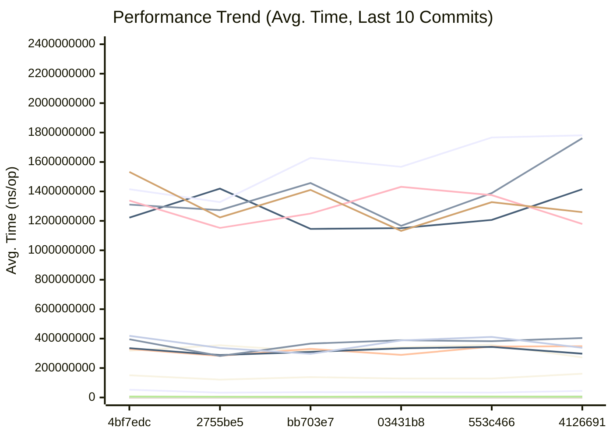
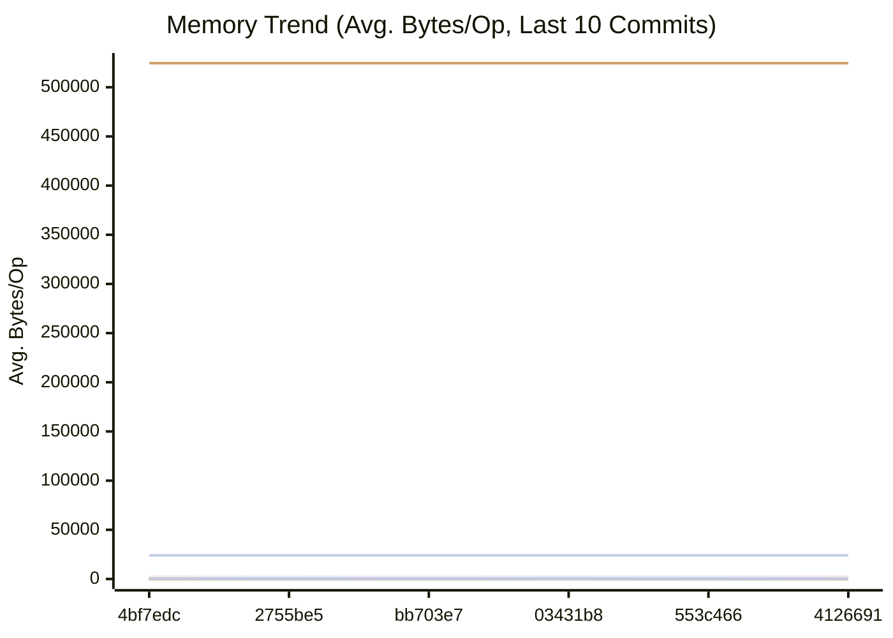
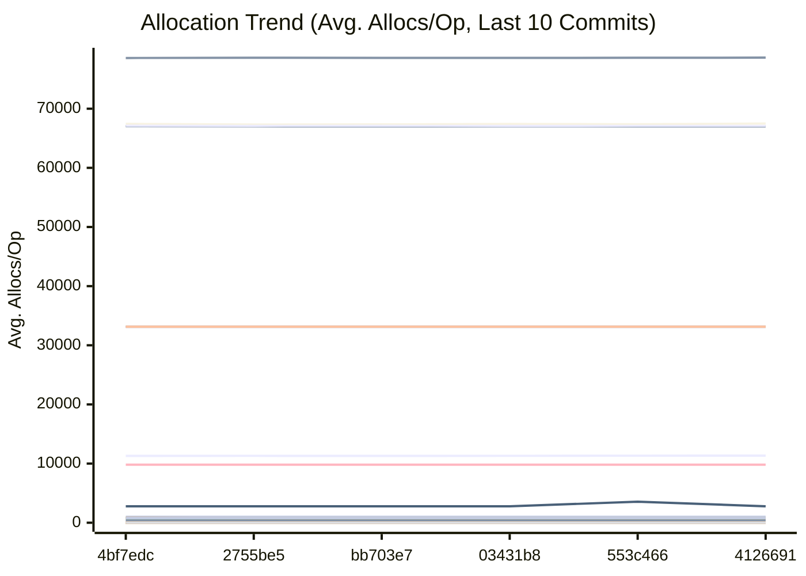

# Performance Benchmarks

This document tracks benchmark performance across commits. The section between
the `BENCHMARK_RESULTS_START/END` markers is auto-generated by the pre-commit
hook; the crypto/OPRF section below is manually maintained.

## How to Read This Document

- **Comparison with previous commit**: `benchstat` output comparing the current
  commit against the previous one. Three tables: **sec/op** (time per operation),
  **B/op** (bytes allocated), **allocs/op** (heap allocations). In each table,
  **lower is better**. `+X%` = regression, `-X%` = improvement, `~` = no
  statistically significant change. `p` is the p-value (p < 0.05 = significant).
- **Latest Benchmark Results**: Single-snapshot table of the current commit's
  averages. Lower values are better across all three columns.
- **Performance Trend plot**: X-axis = commit SHA (left = older, right = newer).
  Y-axis = avg time in ns/op. **Lower lines = faster.** Downward trends are
  improvements; upward spikes are regressions.
- **Memory Trend plot**: Same axes, but Y-axis = avg bytes allocated per op.
  **Lower lines = less memory.** Drops indicate allocation reductions.
- **Allocation Trend plot**: Same axes, but Y-axis = avg heap allocations per op.
  **Lower lines = fewer allocations.** Fewer allocs = less GC pressure.

<!-- BENCHMARK_RESULTS_START -->
## Performance

This section is automatically updated by the pre-commit hook (via .github/scripts/update_readme_with_benchmarks.sh).

### Comparison with previous commit

Each table compares the previous commit (left) to the current commit (right).
**Lower is better** in all three tables. `+X%` = regression, `-X%` = improvement,
`~` = no statistically significant change (p >= 0.05).

- **sec/op**: Time per operation (nanoseconds). Measures raw speed.
- **B/op**: Bytes allocated on the heap per operation. Measures memory usage.
- **allocs/op**: Number of heap allocations per operation. Measures GC pressure.

```
                                      │ /tmp/old_bench_filtered.txt │      /tmp/new_bench_filtered.txt       │
                                      │           sec/op            │    sec/op      vs base                 │
CrushOriginal-8                                        580.8n ± ∞ ¹    855.5n ± ∞ ¹        ~ (p=1.000 n=1) ²
Placement-8                                            6.933µ ± ∞ ¹    8.102µ ± ∞ ¹        ~ (p=1.000 n=1) ²
PlacementDomainSpread-8                                8.426µ ± ∞ ¹    8.684µ ± ∞ ¹        ~ (p=1.000 n=1) ²
CrushOptimized-8                                       489.3n ± ∞ ¹    593.3n ± ∞ ¹        ~ (p=1.000 n=1) ²
LoadGlobalConfig-8                                     12.91µ ± ∞ ¹    20.19µ ± ∞ ¹        ~ (p=1.000 n=1) ²
HashBytes/1MiB-8                                       5.124m ± ∞ ¹    7.576m ± ∞ ¹        ~ (p=1.000 n=1) ²
HashBytes/64MiB-8                                      289.8m ± ∞ ¹    509.9m ± ∞ ¹        ~ (p=1.000 n=1) ²
HashBytes/256MiB-8                                      1.285 ± ∞ ¹     2.088 ± ∞ ¹        ~ (p=1.000 n=1) ²
HashFile/1MiB-8                                        4.299m ± ∞ ¹    8.227m ± ∞ ¹        ~ (p=1.000 n=1) ²
HashFile/64MiB-8                                       260.2m ± ∞ ¹    558.6m ± ∞ ¹        ~ (p=1.000 n=1) ²
HashFile/256MiB-8                                       1.030 ± ∞ ¹     2.135 ± ∞ ¹        ~ (p=1.000 n=1) ²
PadString-8                                            60.98n ± ∞ ¹   211.10n ± ∞ ¹        ~ (p=1.000 n=1) ²
SanitizeLog/Safe-8                                     316.4n ± ∞ ¹    623.1n ± ∞ ¹        ~ (p=1.000 n=1) ²
SanitizeLog/Unsafe-8                                   1.076µ ± ∞ ¹    2.180µ ± ∞ ¹        ~ (p=1.000 n=1) ²
AWSChunkedReaderSigned-8                               606.5µ ± ∞ ¹   1043.2µ ± ∞ ¹        ~ (p=1.000 n=1) ²
AWSChunkedReaderUnsigned-8                             615.5µ ± ∞ ¹   1352.0µ ± ∞ ¹        ~ (p=1.000 n=1) ²
LastModifiedHeader_AppendFormat-8                      319.0n ± ∞ ¹    610.1n ± ∞ ¹        ~ (p=1.000 n=1) ²
LastModifiedHeader_Format-8                            405.6n ± ∞ ¹    811.5n ± ∞ ¹        ~ (p=1.000 n=1) ²
FormatListObjectsV2XML_AppendFormat-8                  962.7µ ± ∞ ¹   2255.1µ ± ∞ ¹        ~ (p=1.000 n=1) ²
FormatListObjectsV2XML_OldFormat-8                     488.6µ ± ∞ ¹   1103.4µ ± ∞ ¹        ~ (p=1.000 n=1) ²
CheckMetricsAndSwap-8                                  8.941n ± ∞ ¹   17.670n ± ∞ ¹        ~ (p=1.000 n=1) ²
IndexSearch-8                                          3.661n ± ∞ ¹    4.853n ± ∞ ¹        ~ (p=1.000 n=1) ²
IndexDirectTracking-8                                 0.3737n ± ∞ ¹   0.8869n ± ∞ ¹        ~ (p=1.000 n=1) ²
LocalWrite/1MiB-8                                      612.3µ ± ∞ ¹   1771.0µ ± ∞ ¹        ~ (p=1.000 n=1) ²
LocalWrite/64MiB-8                                     28.31m ± ∞ ¹    49.17m ± ∞ ¹        ~ (p=1.000 n=1) ²
LocalWrite/256MiB-8                                    107.4m ± ∞ ¹    160.4m ± ∞ ¹        ~ (p=1.000 n=1) ²
ReadVerify/1MiB-8                                      3.449m ± ∞ ¹    5.631m ± ∞ ¹        ~ (p=1.000 n=1) ²
ReadVerify/64MiB-8                                     281.0m ± ∞ ¹    374.2m ± ∞ ¹        ~ (p=1.000 n=1) ²
ReadVerify/256MiB-8                                     1.253 ± ∞ ¹     1.738 ± ∞ ¹        ~ (p=1.000 n=1) ²
TrustedRead/1MiB-8                                     4.742m ± ∞ ¹    8.368m ± ∞ ¹        ~ (p=1.000 n=1) ²
TrustedRead/64MiB-8                                    397.9m ± ∞ ¹    540.3m ± ∞ ¹        ~ (p=1.000 n=1) ²
TrustedRead/256MiB-8                                    1.463 ± ∞ ¹     2.174 ± ∞ ¹        ~ (p=1.000 n=1) ²
S3PutSpool/1MiB-8                                      6.431m ± ∞ ¹    9.117m ± ∞ ¹        ~ (p=1.000 n=1) ²
S3PutSpool/64MiB-8                                     354.1m ± ∞ ¹    528.5m ± ∞ ¹        ~ (p=1.000 n=1) ²
S3PutSpool/256MiB-8                                     1.304 ± ∞ ¹     2.406 ± ∞ ¹        ~ (p=1.000 n=1) ²
geomean                                                416.9µ          724.5µ        +73.76%
¹ need >= 6 samples for confidence interval at level 0.95
² need >= 4 samples to detect a difference at alpha level 0.05

                                      │ /tmp/old_bench_filtered.txt │      /tmp/new_bench_filtered.txt      │
                                      │            B/op             │     B/op       vs base                │
CrushOriginal-8                                         164.0 ± ∞ ¹     164.0 ± ∞ ¹       ~ (p=1.000 n=1) ²
Placement-8                                             352.0 ± ∞ ¹     352.0 ± ∞ ¹       ~ (p=1.000 n=1) ²
PlacementDomainSpread-8                                 352.0 ± ∞ ¹     352.0 ± ∞ ¹       ~ (p=1.000 n=1) ²
CrushOptimized-8                                        0.000 ± ∞ ¹     0.000 ± ∞ ¹       ~ (p=1.000 n=1) ²
LoadGlobalConfig-8                                    1.930Ki ± ∞ ¹   1.930Ki ± ∞ ¹       ~ (p=1.000 n=1) ²
HashBytes/1MiB-8                                        64.00 ± ∞ ¹     64.00 ± ∞ ¹       ~ (p=1.000 n=1) ²
HashBytes/64MiB-8                                       64.00 ± ∞ ¹     64.00 ± ∞ ¹       ~ (p=1.000 n=1) ²
HashBytes/256MiB-8                                      64.00 ± ∞ ¹     64.00 ± ∞ ¹       ~ (p=1.000 n=1) ²
HashFile/1MiB-8                                       32.35Ki ± ∞ ¹   32.35Ki ± ∞ ¹       ~ (p=1.000 n=1) ²
HashFile/64MiB-8                                      32.35Ki ± ∞ ¹   32.35Ki ± ∞ ¹       ~ (p=1.000 n=1) ²
HashFile/256MiB-8                                     32.35Ki ± ∞ ¹   32.35Ki ± ∞ ¹       ~ (p=1.000 n=1) ²
PadString-8                                             64.00 ± ∞ ¹     64.00 ± ∞ ¹       ~ (p=1.000 n=1) ²
SanitizeLog/Safe-8                                      0.000 ± ∞ ¹     0.000 ± ∞ ¹       ~ (p=1.000 n=1) ²
SanitizeLog/Unsafe-8                                    704.0 ± ∞ ¹     704.0 ± ∞ ¹       ~ (p=1.000 n=1) ²
AWSChunkedReaderSigned-8                              11.04Ki ± ∞ ¹   11.09Ki ± ∞ ¹       ~ (p=1.000 n=1) ³
AWSChunkedReaderUnsigned-8                            76.76Ki ± ∞ ¹   76.91Ki ± ∞ ¹       ~ (p=1.000 n=1) ³
LastModifiedHeader_AppendFormat-8                       0.000 ± ∞ ¹     0.000 ± ∞ ¹       ~ (p=1.000 n=1) ²
LastModifiedHeader_Format-8                             32.00 ± ∞ ¹     32.00 ± ∞ ¹       ~ (p=1.000 n=1) ²
FormatListObjectsV2XML_AppendFormat-8                 512.2Ki ± ∞ ¹   512.3Ki ± ∞ ¹       ~ (p=1.000 n=1) ³
FormatListObjectsV2XML_OldFormat-8                    23.44Ki ± ∞ ¹   23.44Ki ± ∞ ¹       ~ (p=1.000 n=1) ²
CheckMetricsAndSwap-8                                   0.000 ± ∞ ¹     0.000 ± ∞ ¹       ~ (p=1.000 n=1) ²
IndexSearch-8                                           0.000 ± ∞ ¹     0.000 ± ∞ ¹       ~ (p=1.000 n=1) ²
IndexDirectTracking-8                                   0.000 ± ∞ ¹     0.000 ± ∞ ¹       ~ (p=1.000 n=1) ²
LocalWrite/1MiB-8                                     65.46Ki ± ∞ ¹   65.47Ki ± ∞ ¹       ~ (p=1.000 n=1) ³
LocalWrite/64MiB-8                                    65.52Ki ± ∞ ¹   65.56Ki ± ∞ ¹       ~ (p=1.000 n=1) ³
LocalWrite/256MiB-8                                   65.76Ki ± ∞ ¹   65.87Ki ± ∞ ¹       ~ (p=1.000 n=1) ³
ReadVerify/1MiB-8                                       459.0 ± ∞ ¹     484.0 ± ∞ ¹       ~ (p=1.000 n=1) ³
ReadVerify/64MiB-8                                    2.253Ki ± ∞ ¹   2.711Ki ± ∞ ¹       ~ (p=1.000 n=1) ³
ReadVerify/256MiB-8                                   9.578Ki ± ∞ ¹   9.578Ki ± ∞ ¹       ~ (p=1.000 n=1) ²
TrustedRead/1MiB-8                                      837.0 ± ∞ ¹     800.0 ± ∞ ¹       ~ (p=1.000 n=1) ³
TrustedRead/64MiB-8                                     800.0 ± ∞ ¹     800.0 ± ∞ ¹       ~ (p=1.000 n=1) ²
TrustedRead/256MiB-8                                    800.0 ± ∞ ¹     800.0 ± ∞ ¹       ~ (p=1.000 n=1) ²
S3PutSpool/1MiB-8                                       447.0 ± ∞ ¹     448.0 ± ∞ ¹       ~ (p=1.000 n=1) ³
S3PutSpool/64MiB-8                                      448.0 ± ∞ ¹     448.0 ± ∞ ¹       ~ (p=1.000 n=1) ²
S3PutSpool/256MiB-8                                     448.0 ± ∞ ¹     448.0 ± ∞ ¹       ~ (p=1.000 n=1) ²
geomean                                                           ⁴                  +0.58%               ⁴
¹ need >= 6 samples for confidence interval at level 0.95
² all samples are equal
³ need >= 4 samples to detect a difference at alpha level 0.05
⁴ summaries must be >0 to compute geomean

                                      │ /tmp/old_bench_filtered.txt │     /tmp/new_bench_filtered.txt      │
                                      │          allocs/op          │  allocs/op    vs base                │
CrushOriginal-8                                         3.000 ± ∞ ¹    3.000 ± ∞ ¹       ~ (p=1.000 n=1) ²
Placement-8                                             6.000 ± ∞ ¹    6.000 ± ∞ ¹       ~ (p=1.000 n=1) ²
PlacementDomainSpread-8                                 6.000 ± ∞ ¹    6.000 ± ∞ ¹       ~ (p=1.000 n=1) ²
CrushOptimized-8                                        0.000 ± ∞ ¹    0.000 ± ∞ ¹       ~ (p=1.000 n=1) ²
LoadGlobalConfig-8                                      58.00 ± ∞ ¹    58.00 ± ∞ ¹       ~ (p=1.000 n=1) ²
HashBytes/1MiB-8                                        1.000 ± ∞ ¹    1.000 ± ∞ ¹       ~ (p=1.000 n=1) ²
HashBytes/64MiB-8                                       1.000 ± ∞ ¹    1.000 ± ∞ ¹       ~ (p=1.000 n=1) ²
HashBytes/256MiB-8                                      1.000 ± ∞ ¹    1.000 ± ∞ ¹       ~ (p=1.000 n=1) ²
HashFile/1MiB-8                                         6.000 ± ∞ ¹    6.000 ± ∞ ¹       ~ (p=1.000 n=1) ²
HashFile/64MiB-8                                        6.000 ± ∞ ¹    6.000 ± ∞ ¹       ~ (p=1.000 n=1) ²
HashFile/256MiB-8                                       6.000 ± ∞ ¹    6.000 ± ∞ ¹       ~ (p=1.000 n=1) ²
PadString-8                                             1.000 ± ∞ ¹    1.000 ± ∞ ¹       ~ (p=1.000 n=1) ²
SanitizeLog/Safe-8                                      0.000 ± ∞ ¹    0.000 ± ∞ ¹       ~ (p=1.000 n=1) ²
SanitizeLog/Unsafe-8                                    1.000 ± ∞ ¹    1.000 ± ∞ ¹       ~ (p=1.000 n=1) ²
AWSChunkedReaderSigned-8                                80.00 ± ∞ ¹    80.00 ± ∞ ¹       ~ (p=1.000 n=1) ²
AWSChunkedReaderUnsigned-8                              15.00 ± ∞ ¹    15.00 ± ∞ ¹       ~ (p=1.000 n=1) ²
LastModifiedHeader_AppendFormat-8                       0.000 ± ∞ ¹    0.000 ± ∞ ¹       ~ (p=1.000 n=1) ²
LastModifiedHeader_Format-8                             1.000 ± ∞ ¹    1.000 ± ∞ ¹       ~ (p=1.000 n=1) ²
FormatListObjectsV2XML_AppendFormat-8                   16.00 ± ∞ ¹    16.00 ± ∞ ¹       ~ (p=1.000 n=1) ²
FormatListObjectsV2XML_OldFormat-8                     1.000k ± ∞ ¹   1.000k ± ∞ ¹       ~ (p=1.000 n=1) ²
CheckMetricsAndSwap-8                                   0.000 ± ∞ ¹    0.000 ± ∞ ¹       ~ (p=1.000 n=1) ²
IndexSearch-8                                           0.000 ± ∞ ¹    0.000 ± ∞ ¹       ~ (p=1.000 n=1) ²
IndexDirectTracking-8                                   0.000 ± ∞ ¹    0.000 ± ∞ ¹       ~ (p=1.000 n=1) ²
LocalWrite/1MiB-8                                       19.00 ± ∞ ¹    18.00 ± ∞ ¹       ~ (p=1.000 n=1) ³
LocalWrite/64MiB-8                                      18.00 ± ∞ ¹    18.00 ± ∞ ¹       ~ (p=1.000 n=1) ²
LocalWrite/256MiB-8                                     20.00 ± ∞ ¹    20.00 ± ∞ ¹       ~ (p=1.000 n=1) ²
ReadVerify/1MiB-8                                       6.000 ± ∞ ¹    6.000 ± ∞ ¹       ~ (p=1.000 n=1) ²
ReadVerify/64MiB-8                                      6.000 ± ∞ ¹    7.000 ± ∞ ¹       ~ (p=1.000 n=1) ³
ReadVerify/256MiB-8                                     10.00 ± ∞ ¹    10.00 ± ∞ ¹       ~ (p=1.000 n=1) ²
TrustedRead/1MiB-8                                      11.00 ± ∞ ¹    11.00 ± ∞ ¹       ~ (p=1.000 n=1) ²
TrustedRead/64MiB-8                                     11.00 ± ∞ ¹    11.00 ± ∞ ¹       ~ (p=1.000 n=1) ²
TrustedRead/256MiB-8                                    11.00 ± ∞ ¹    11.00 ± ∞ ¹       ~ (p=1.000 n=1) ²
S3PutSpool/1MiB-8                                       10.00 ± ∞ ¹    10.00 ± ∞ ¹       ~ (p=1.000 n=1) ²
S3PutSpool/64MiB-8                                      10.00 ± ∞ ¹    10.00 ± ∞ ¹       ~ (p=1.000 n=1) ²
S3PutSpool/256MiB-8                                     10.00 ± ∞ ¹    10.00 ± ∞ ¹       ~ (p=1.000 n=1) ²
geomean                                                           ⁴                 +0.29%               ⁴
¹ need >= 6 samples for confidence interval at level 0.95
² all samples are equal
³ need >= 4 samples to detect a difference at alpha level 0.05
⁴ summaries must be >0 to compute geomean

                           │ /tmp/old_bench_filtered.txt │      /tmp/new_bench_filtered.txt       │
                           │             B/s             │      B/s       vs base                 │
HashBytes/1MiB-8                           195.2Mi ± ∞ ¹   132.0Mi ± ∞ ¹        ~ (p=1.000 n=1) ²
HashBytes/64MiB-8                          220.8Mi ± ∞ ¹   125.5Mi ± ∞ ¹        ~ (p=1.000 n=1) ²
HashBytes/256MiB-8                         199.3Mi ± ∞ ¹   122.6Mi ± ∞ ¹        ~ (p=1.000 n=1) ²
HashFile/1MiB-8                            232.6Mi ± ∞ ¹   121.5Mi ± ∞ ¹        ~ (p=1.000 n=1) ²
HashFile/64MiB-8                           245.9Mi ± ∞ ¹   114.6Mi ± ∞ ¹        ~ (p=1.000 n=1) ²
HashFile/256MiB-8                          248.5Mi ± ∞ ¹   119.9Mi ± ∞ ¹        ~ (p=1.000 n=1) ²
AWSChunkedReaderSigned-8                  104.66Mi ± ∞ ¹   60.84Mi ± ∞ ¹        ~ (p=1.000 n=1) ²
AWSChunkedReaderUnsigned-8                103.14Mi ± ∞ ¹   46.95Mi ± ∞ ¹        ~ (p=1.000 n=1) ²
LocalWrite/1MiB-8                         1633.1Mi ± ∞ ¹   564.7Mi ± ∞ ¹        ~ (p=1.000 n=1) ²
LocalWrite/64MiB-8                         2.208Gi ± ∞ ¹   1.271Gi ± ∞ ¹        ~ (p=1.000 n=1) ²
LocalWrite/256MiB-8                        2.328Gi ± ∞ ¹   1.559Gi ± ∞ ¹        ~ (p=1.000 n=1) ²
ReadVerify/1MiB-8                          290.0Mi ± ∞ ¹   177.6Mi ± ∞ ¹        ~ (p=1.000 n=1) ²
ReadVerify/64MiB-8                         227.8Mi ± ∞ ¹   171.0Mi ± ∞ ¹        ~ (p=1.000 n=1) ²
ReadVerify/256MiB-8                        204.3Mi ± ∞ ¹   147.3Mi ± ∞ ¹        ~ (p=1.000 n=1) ²
TrustedRead/1MiB-8                         210.9Mi ± ∞ ¹   119.5Mi ± ∞ ¹        ~ (p=1.000 n=1) ²
TrustedRead/64MiB-8                        160.9Mi ± ∞ ¹   118.5Mi ± ∞ ¹        ~ (p=1.000 n=1) ²
TrustedRead/256MiB-8                       175.0Mi ± ∞ ¹   117.8Mi ± ∞ ¹        ~ (p=1.000 n=1) ²
S3PutSpool/1MiB-8                          155.5Mi ± ∞ ¹   109.7Mi ± ∞ ¹        ~ (p=1.000 n=1) ²
S3PutSpool/64MiB-8                         180.7Mi ± ∞ ¹   121.1Mi ± ∞ ¹        ~ (p=1.000 n=1) ²
S3PutSpool/256MiB-8                        196.3Mi ± ∞ ¹   106.4Mi ± ∞ ¹        ~ (p=1.000 n=1) ²
geomean                                    272.6Mi         159.9Mi        -41.33%
¹ need >= 6 samples for confidence interval at level 0.95
² need >= 4 samples to detect a difference at alpha level 0.05
```

### Latest Benchmark Results

Single-snapshot of the current commit's averages. **Lower is better** across all
three columns: time (speed), bytes (memory), allocs (GC pressure).


| Benchmark | Avg. Time/Op | Avg. Bytes/Op | Avg. Allocs/Op |
|-----------|--------------|---------------|----------------|
| BenchmarkAWSChunkedReaderSigned-8 | 1043223.00 ns/op | 63.80 B/op | 11357.00 allocs/op |
| BenchmarkAWSChunkedReaderUnsigned-8 | 1351997.00 ns/op | 49.23 B/op | 78751.00 allocs/op |
| BenchmarkCheckMetricsAndSwap-8 | 17.67 ns/op | 0.00 B/op | 0.00 allocs/op |
| BenchmarkCrushOptimized-8 | 593.30 ns/op | 0.00 B/op | 0.00 allocs/op |
| BenchmarkCrushOriginal-8 | 855.50 ns/op | 164.00 B/op | 3.00 allocs/op |
| BenchmarkFormatListObjectsV2XML_AppendFormat-8 | 2255056.00 ns/op | 524580.00 B/op | 16.00 allocs/op |
| BenchmarkFormatListObjectsV2XML_OldFormat-8 | 1103444.00 ns/op | 24000.00 B/op | 1000.00 allocs/op |
| BenchmarkHashBytes/1MiB-8 | 7575501.00 ns/op | 138.42 B/op | 64.00 allocs/op |
| BenchmarkHashBytes/256MiB-8 | 2087994619.00 ns/op | 128.56 B/op | 64.00 allocs/op |
| BenchmarkHashBytes/64MiB-8 | 509860327.00 ns/op | 131.62 B/op | 64.00 allocs/op |
| BenchmarkHashFile/1MiB-8 | 8227082.00 ns/op | 127.45 B/op | 33128.00 allocs/op |
| BenchmarkHashFile/256MiB-8 | 2135226775.00 ns/op | 125.72 B/op | 33128.00 allocs/op |
| BenchmarkHashFile/64MiB-8 | 558613671.00 ns/op | 120.13 B/op | 33128.00 allocs/op |
| BenchmarkIndexDirectTracking-8 | 0.89 ns/op | 0.00 B/op | 0.00 allocs/op |
| BenchmarkIndexSearch-8 | 4.85 ns/op | 0.00 B/op | 0.00 allocs/op |
| BenchmarkLastModifiedHeader_AppendFormat-8 | 610.10 ns/op | 0.00 B/op | 0.00 allocs/op |
| BenchmarkLastModifiedHeader_Format-8 | 811.50 ns/op | 32.00 B/op | 1.00 allocs/op |
| BenchmarkLoadGlobalConfig-8 | 20187.00 ns/op | 1976.00 B/op | 58.00 allocs/op |
| BenchmarkLocalWrite/1MiB-8 | 1771010.00 ns/op | 592.08 B/op | 67046.00 allocs/op |
| BenchmarkLocalWrite/256MiB-8 | 160392504.00 ns/op | 1673.62 B/op | 67449.00 allocs/op |
| BenchmarkLocalWrite/64MiB-8 | 49166059.00 ns/op | 1364.94 B/op | 67134.00 allocs/op |
| BenchmarkPadString-8 | 211.10 ns/op | 64.00 B/op | 1.00 allocs/op |
| BenchmarkPlacement-8 | 8102.00 ns/op | 352.00 B/op | 6.00 allocs/op |
| BenchmarkPlacementDomainSpread-8 | 8684.00 ns/op | 352.00 B/op | 6.00 allocs/op |
| BenchmarkReadVerify/1MiB-8 | 5630820.00 ns/op | 186.22 B/op | 484.00 allocs/op |
| BenchmarkReadVerify/256MiB-8 | 1738129398.00 ns/op | 154.44 B/op | 9808.00 allocs/op |
| BenchmarkReadVerify/64MiB-8 | 374198113.00 ns/op | 179.34 B/op | 2776.00 allocs/op |
| BenchmarkS3PutSpool/1MiB-8 | 9117398.00 ns/op | 115.01 B/op | 448.00 allocs/op |
| BenchmarkS3PutSpool/256MiB-8 | 2406472426.00 ns/op | 111.55 B/op | 448.00 allocs/op |
| BenchmarkS3PutSpool/64MiB-8 | 528507413.00 ns/op | 126.98 B/op | 448.00 allocs/op |
| BenchmarkSanitizeLog/Safe-8 | 623.10 ns/op | 0.00 B/op | 0.00 allocs/op |
| BenchmarkSanitizeLog/Unsafe-8 | 2180.00 ns/op | 704.00 B/op | 1.00 allocs/op |
| BenchmarkTrustedRead/1MiB-8 | 8367879.00 ns/op | 125.31 B/op | 800.00 allocs/op |
| BenchmarkTrustedRead/256MiB-8 | 2173767229.00 ns/op | 123.49 B/op | 800.00 allocs/op |
| BenchmarkTrustedRead/64MiB-8 | 540269082.00 ns/op | 124.21 B/op | 800.00 allocs/op |


### Performance History

**Legend**

| Color | Benchmark | Description |
|---|---|---|
| 🟢 | CheckMetricsAndSwap | Evaluation of system metrics (CPU/Mem) and mode switching logic |
| 🟤 | CrushOriginal | Original Sage Weil's CRUSH placement algorithm using reflection and float math |
| ⚪ | CrushOptimized | Performance-tuned CRUSH-lite placement algorithm using bitwise shifts and integer math (Rule 19) |
| 🔵 | IndexDirectTracking | Accessing current replication mode via direct slice index (O(1)) |
| 🔴 | IndexSearch | Searching for current replication mode in the order slice using `slices.Index` |
| 🟠 | LoadGlobalConfig | Parsing and loading the `[global]` section from the INI configuration |
| 🟣 | PadString | Padding strings with null characters to a fixed protocol length |
| 🟡 | ParseReplicationOrder | Parsing the CSV-formatted replication order string into an integer slice |

#### Time per Operation (ns/op)

X-axis: commit SHA (left = older, right = newer). Y-axis: avg time in ns/op.
**Lower lines = faster code.** Downward trends are improvements; upward spikes
are regressions to investigate.


```mermaid
xychart-beta
    title "Performance Trend (Avg. Time, Last 10 Commits)"
    x-axis "Commit"
    y-axis "Avg. Time (ns/op)"
    x-axis [4bf7edc,2755be5,bb703e7,03431b8,553c466,4126691]
    line "AWSChunkedReaderSigned" [521824,584439,539275,522839,619200,756300,663569,620161,606537,1043223]
    line "AWSChunkedReaderUnsigned" [451522,611665,550355,604498,664009,703433,611889,631352,615450,1351997]
    line "CheckMetricsAndSwap" [17,10,11,10,10,12,13,11,9,18]
    line "CrushOptimized" [539,432,471,405,485,513,528,381,489,593]
    line "CrushOriginal" [730,712,650,699,646,673,697,599,581,856]
    line "FormatListObjectsV2XML_AppendFormat" [1046717,799795,1039816,911991,1056478,1286421,1165434,922011,962696,2255056]
    line "FormatListObjectsV2XML_OldFormat" [745142,464905,458449,554255,545961,720703,674915,518253,488621,1103444]
    line "HashBytes/1MiB" [4751175,5064237,4383380,5547571,5240058,5525510,5093044,3747347,5123782,7575501]
    line "HashBytes/256MiB" [1221858506,1419279092,1145420213,1150583944,1206314796,1415065243,1121544781,1441434671,1284521850,2087994619]
    line "HashBytes/64MiB" [317593619,355000134,315394868,341933076,357748084,272405322,277104353,321801782,289844742,509860327]
    line "HashFile/1MiB" [5129547,5747827,5999828,5183292,5520031,4909353,4510294,6901410,4299477,8227082]
    line "HashFile/256MiB" [1310601572,1273023822,1457159370,1166573869,1388569817,1761951053,1416186973,1274613971,1030231274,2135226775]
    line "HashFile/64MiB" [329592825,282613785,330397537,289173153,345945889,348425613,343417056,354037155,260223898,558613671]
    line "IndexDirectTracking" [1,0,0,1,1,1,1,1,0,1]
    line "IndexSearch" [5,4,3,3,4,4,4,4,4,5]
    line "LastModifiedHeader_AppendFormat" [252,340,415,345,364,441,320,312,319,610]
    line "LastModifiedHeader_Format" [350,398,514,394,431,520,582,394,406,812]
    line "LoadGlobalConfig" [14511,16366,13776,15095,13488,14097,14525,12164,12907,20187]
    line "LocalWrite/1MiB" [795470,552166,778898,525512,577002,644852,573249,584326,612314,1771010]
    line "LocalWrite/256MiB" [151118283,121284509,138380852,128601282,128702495,161190175,125958619,133440934,107404943,160392504]
    line "LocalWrite/64MiB" [53059327,32531111,36029215,35542782,33119476,44891953,35402077,33399170,28308935,49166059]
    line "PadString" [49,70,69,64,70,76,63,80,61,211]
    line "ParseReplicationOrder_NoPrealloc" [350,349,357,354,345,225,229,165,232,234]
    line "ParseReplicationOrder_Prealloc" [229,231,237,234,229,108,107,80,110,109]
    line "Placement" [8505,7344,6922,7453,7406,7040,7327,6313,6933,8102]
    line "PlacementDomainSpread" [8563,7236,7465,7811,7868,7303,7101,6619,8426,8684]
    line "ReadVerify/1MiB" [5088522,3970325,4753309,4723356,4600918,6614208,4999715,4807436,3448579,5630820]
    line "ReadVerify/256MiB" [1337973310,1152182050,1249327431,1431247520,1374887457,1179131329,1513480600,1025626350,1253185341,1738129398]
    line "ReadVerify/64MiB" [335223998,288365836,309264832,334268234,343492740,297878657,337113294,296627981,281005831,374198113]
    line "S3PutSpool/1MiB" [6486611,5066289,6659391,6179992,6697030,5335678,5117449,4156487,6430516,9117398]
    line "S3PutSpool/256MiB" [1414994967,1327631659,1627622695,1567298391,1766547568,1781197744,1337418784,1086529024,1304364707,2406472426]
    line "S3PutSpool/64MiB" [395378107,282251478,366146558,388891982,382189999,404192768,401720115,306669378,354128133,528507413]
    line "SanitizeLog/Safe" [256,386,270,283,316,423,332,390,316,623]
    line "SanitizeLog/Unsafe" [801,1163,1016,1039,1170,1356,1050,1036,1076,2180]
    line "TrustedRead/1MiB" [5688219,4848751,4607932,6032847,6124228,5111302,5878450,3751975,4741810,8367879]
    line "TrustedRead/256MiB" [1532603475,1223453299,1410403058,1131933188,1326976357,1259207320,1168045663,1223117446,1462605918,2173767229]
    line "TrustedRead/64MiB" [418960245,336501521,296487000,387555406,411444369,337664579,350083685,287609190,397868130,540269082]
```

#### Memory per Operation (B/op)

X-axis: commit SHA. Y-axis: avg bytes allocated per op.
**Lower lines = less memory.** Drops indicate allocation reductions.


```mermaid
xychart-beta
    title "Memory Trend (Avg. Bytes/Op, Last 10 Commits)"
    x-axis "Commit"
    y-axis "Avg. Bytes/Op"
    x-axis [4bf7edc,2755be5,bb703e7,03431b8,553c466,4126691]
    line "AWSChunkedReaderSigned" [128,114,123,127,107,88,100,107,110,64]
    line "AWSChunkedReaderUnsigned" [147,109,121,110,100,95,109,105,108,49]
    line "CheckMetricsAndSwap" [0,0,0,0,0,0,0,0,0,0]
    line "CrushOptimized" [0,0,0,0,0,0,0,0,0,0]
    line "CrushOriginal" [164,164,164,164,164,164,164,164,164,164]
    line "FormatListObjectsV2XML_AppendFormat" [524483,524463,524491,524477,524500,524483,524504,524463,524460,524580]
    line "FormatListObjectsV2XML_OldFormat" [24000,24000,24000,24000,24000,24000,24000,24000,24000,24000]
    line "HashBytes/1MiB" [221,207,239,189,200,190,206,280,205,138]
    line "HashBytes/256MiB" [220,189,234,233,223,190,239,186,209,129]
    line "HashBytes/64MiB" [211,189,213,196,188,246,242,209,232,132]
    line "HashFile/1MiB" [204,182,175,202,190,214,232,152,244,127]
    line "HashFile/256MiB" [205,211,184,230,193,152,190,211,261,126]
    line "HashFile/64MiB" [204,237,203,232,194,193,195,190,258,120]
    line "IndexDirectTracking" [0,0,0,0,0,0,0,0,0,0]
    line "IndexSearch" [0,0,0,0,0,0,0,0,0,0]
    line "LastModifiedHeader_AppendFormat" [0,0,0,0,0,0,0,0,0,0]
    line "LastModifiedHeader_Format" [32,32,32,32,32,32,32,32,32,32]
    line "LoadGlobalConfig" [1976,1976,1976,1976,1976,1976,1976,1976,1976,1976]
    line "LocalWrite/1MiB" [1318,1899,1346,1995,1817,1626,1829,1794,1712,592]
    line "LocalWrite/256MiB" [1776,2213,1940,2087,2086,1665,2131,2012,2499,1674]
    line "LocalWrite/64MiB" [1265,2063,1863,1888,2026,1495,1896,2009,2371,1365]
    line "PadString" [64,64,64,64,64,64,64,64,64,64]
    line "ParseReplicationOrder_NoPrealloc" [408,408,408,408,408,248,248,248,248,248]
    line "ParseReplicationOrder_Prealloc" [240,240,240,240,240,80,80,80,80,80]
    line "Placement" [352,352,352,352,352,352,352,352,352,352]
    line "PlacementDomainSpread" [352,352,352,352,352,352,352,352,352,352]
    line "ReadVerify/1MiB" [206,264,221,222,228,159,210,218,304,186]
    line "ReadVerify/256MiB" [201,233,215,188,195,228,177,262,214,154]
    line "ReadVerify/64MiB" [200,233,217,201,195,225,199,226,239,179]
    line "S3PutSpool/1MiB" [162,207,157,170,157,197,205,252,163,115]
    line "S3PutSpool/256MiB" [190,202,165,171,152,151,201,247,206,112]
    line "S3PutSpool/64MiB" [170,238,183,173,176,166,167,219,190,127]
    line "SanitizeLog/Safe" [0,0,0,0,0,0,0,0,0,0]
    line "SanitizeLog/Unsafe" [704,704,704,704,704,704,704,704,704,704]
    line "TrustedRead/1MiB" [184,216,228,174,171,205,178,279,221,125]
    line "TrustedRead/256MiB" [175,219,190,237,202,213,230,219,184,123]
    line "TrustedRead/64MiB" [160,199,226,173,163,199,192,233,169,124]
```

#### Allocations per Operation (allocs/op)

X-axis: commit SHA. Y-axis: avg heap allocations per op.
**Lower lines = fewer allocations.** Fewer allocs = less GC pressure.


```mermaid
xychart-beta
    title "Allocation Trend (Avg. Allocs/Op, Last 10 Commits)"
    x-axis "Commit"
    y-axis "Avg. Allocs/Op"
    x-axis [4bf7edc,2755be5,bb703e7,03431b8,553c466,4126691]
    line "AWSChunkedReaderSigned" [11300,11307,11302,11307,11334,11352,11308,11331,11309,11357]
    line "AWSChunkedReaderUnsigned" [78576,78613,78584,78583,78611,78631,78600,78609,78603,78751]
    line "CheckMetricsAndSwap" [0,0,0,0,0,0,0,0,0,0]
    line "CrushOptimized" [0,0,0,0,0,0,0,0,0,0]
    line "CrushOriginal" [3,3,3,3,3,3,3,3,3,3]
    line "FormatListObjectsV2XML_AppendFormat" [16,16,16,16,16,16,16,16,16,16]
    line "FormatListObjectsV2XML_OldFormat" [1000,1000,1000,1000,1000,1000,1000,1000,1000,1000]
    line "HashBytes/1MiB" [64,64,64,64,64,64,64,64,64,64]
    line "HashBytes/256MiB" [64,64,64,64,64,64,64,64,64,64]
    line "HashBytes/64MiB" [64,64,64,64,64,64,64,64,64,64]
    line "HashFile/1MiB" [33128,33128,33128,33128,33128,33128,33128,33128,33128,33128]
    line "HashFile/256MiB" [33128,33128,33128,33128,33128,33128,33128,33128,33128,33128]
    line "HashFile/64MiB" [33128,33128,33128,33128,33128,33128,33128,33128,33128,33128]
    line "IndexDirectTracking" [0,0,0,0,0,0,0,0,0,0]
    line "IndexSearch" [0,0,0,0,0,0,0,0,0,0]
    line "LastModifiedHeader_AppendFormat" [0,0,0,0,0,0,0,0,0,0]
    line "LastModifiedHeader_Format" [1,1,1,1,1,1,1,1,1,1]
    line "LoadGlobalConfig" [58,58,58,58,58,58,58,58,58,58]
    line "LocalWrite/1MiB" [67040,67026,67032,67028,67034,67036,67032,67028,67031,67046]
    line "LocalWrite/256MiB" [67435,67322,67349,67419,67379,67488,67427,67403,67338,67449]
    line "LocalWrite/64MiB" [67097,67084,67096,67074,67087,67088,67081,67097,67088,67134]
    line "PadString" [1,1,1,1,1,1,1,1,1,1]
    line "ParseReplicationOrder_NoPrealloc" [6,6,6,6,6,5,5,5,5,5]
    line "ParseReplicationOrder_Prealloc" [2,2,2,2,2,1,1,1,1,1]
    line "Placement" [6,6,6,6,6,6,6,6,6,6]
    line "PlacementDomainSpread" [6,6,6,6,6,6,6,6,6,6]
    line "ReadVerify/1MiB" [471,463,468,467,468,486,478,467,459,484]
    line "ReadVerify/256MiB" [9808,9808,9808,9808,9808,9808,9808,5120,9808,9808]
    line "ReadVerify/64MiB" [2776,2776,2776,2776,3557,2776,2776,2776,2307,2776]
    line "S3PutSpool/1MiB" [447,447,447,447,447,447,447,448,447,448]
    line "S3PutSpool/256MiB" [448,448,448,448,448,448,448,448,448,448]
    line "S3PutSpool/64MiB" [448,448,448,448,448,448,448,448,448,448]
    line "SanitizeLog/Safe" [0,0,0,0,0,0,0,0,0,0]
    line "SanitizeLog/Unsafe" [1,1,1,1,1,1,1,1,1,1]
    line "TrustedRead/1MiB" [800,800,800,800,800,800,800,800,837,800]
    line "TrustedRead/256MiB" [848,800,800,800,800,800,800,800,800,800]
    line "TrustedRead/64MiB" [800,800,800,800,800,800,800,800,800,800]
```
<!-- BENCHMARK_RESULTS_END -->

### E2EE + OPRF overhead

The sections above are auto-generated and cover the hot-path benchmarks. The
crypto/OPRF work is measured separately; figures below are from `go test -bench`
on the crypto module and are intentionally placed outside the auto-managed block
so they persist.

**Lower is better** across all columns. These benchmarks run on `src/crypto` only
(not tracked in the auto-generated plots above).

| Benchmark | What it measures | Avg. Time/Op | Avg. Bytes/Op | Avg. Allocs/Op |
|-----------|------------------|--------------|---------------|----------------|
| EncryptStream | AES-GCM-256 chunked encryption (64KB input) | ~63 µs | 167 KB | 14 |
| DecryptStream | AES-GCM-256 chunked decryption (64KB input) | ~54 µs | 136 KB | 13 |
| DeriveKey | HKDF-SHA256 key derivation per tenant | ~3.5 µs | 1.3 KB | 18 |
| OPRFCombineThreshold3 | Threshold-3 OPRF combine + unblind (Ristretto255) | ~530 µs | 2.3 KB | 62 |

With `encryption_enabled`, every byte passes through AES-GCM-256 streaming at
~800-1200 MB/s (chunk-bounded memory). The streaming format is **StreamVersion
v4 (issue #824)** with a self-describing chunk size: the default 4096-byte
chunk preserves prior throughput, and the chunk size can be raised/lowered via
`SetStreamChunkSize` within `[512, 4128]` for latency/memory trade-offs without
a wire change in framing beyond the 2-byte header field (v3/v2 blobs still
decode). The threshold OPRF is evaluated **once per
upload/download**, on the dedup tag only (never per chunk):
`OPRFCombineThreshold3` measures a one-time ~0.53 ms client-side combine/unblind
for threshold-3, plus one round-trip per daemon share. This is negligible against
network/disk I/O and does not affect streaming throughput. When `oprf_enabled =
false`, the OPRF path is skipped entirely and behavior is identical to the
pre-OPRF encryption path (backward compatible).
