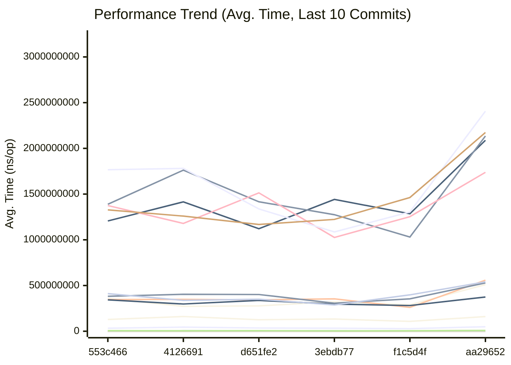
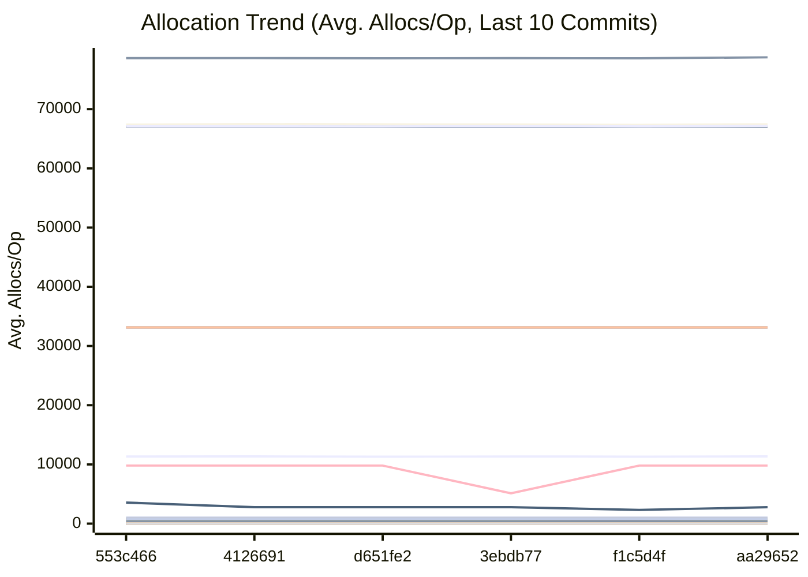

# Performance Benchmarks

This document tracks benchmark performance across commits. The section between
the `BENCHMARK_RESULTS_START/END` markers is auto-generated by the pre-commit
hook; the crypto/OPRF section below is manually maintained.

## How to Read This Document

- **Comparison with previous commit**: `benchstat` output comparing the current
  commit against the previous one. Three tables: **sec/op** (time per operation),
  **B/op** (bytes allocated), **allocs/op** (heap allocations). In each table,
  **lower is better**. `+X%` = regression, `-X%` = improvement, `~` = no
  statistically significant change. `p` is the p-value (p < 0.05 = significant).
- **Latest Benchmark Results**: Single-snapshot table of the current commit's
  averages. Lower values are better across all three columns.
- **Performance Trend plot**: X-axis = commit SHA (left = older, right = newer).
  Y-axis = avg time in ns/op. **Lower lines = faster.** Downward trends are
  improvements; upward spikes are regressions.
- **Memory Trend plot**: Same axes, but Y-axis = avg bytes allocated per op.
  **Lower lines = less memory.** Drops indicate allocation reductions.
- **Allocation Trend plot**: Same axes, but Y-axis = avg heap allocations per op.
  **Lower lines = fewer allocations.** Fewer allocs = less GC pressure.

<!-- BENCHMARK_RESULTS_START -->
## Performance

This section is automatically updated by the pre-commit hook (via .github/scripts/update_readme_with_benchmarks.sh).

### Comparison with previous commit

Each table compares the previous commit (left) to the current commit (right).
**Lower is better** in all three tables. `+X%` = regression, `-X%` = improvement,
`~` = no statistically significant change (p >= 0.05).

- **sec/op**: Time per operation (nanoseconds). Measures raw speed.
- **B/op**: Bytes allocated on the heap per operation. Measures memory usage.
- **allocs/op**: Number of heap allocations per operation. Measures GC pressure.

```
                                      │ /tmp/old_bench_filtered.txt │      /tmp/new_bench_filtered.txt      │
                                      │           sec/op            │    sec/op      vs base                │
CrushOriginal-8                                        855.1n ± ∞ ¹   1268.0n ± ∞ ¹       ~ (p=1.000 n=1) ²
Placement-8                                            11.32µ ± ∞ ¹    10.38µ ± ∞ ¹       ~ (p=1.000 n=1) ²
PlacementDomainSpread-8                               11.792µ ± ∞ ¹    9.468µ ± ∞ ¹       ~ (p=1.000 n=1) ²
CrushOptimized-8                                       684.7n ± ∞ ¹    797.7n ± ∞ ¹       ~ (p=1.000 n=1) ²
LoadGlobalConfig-8                                     21.40µ ± ∞ ¹    21.46µ ± ∞ ¹       ~ (p=1.000 n=1) ²
HashBytes/1MiB-8                                       5.384m ± ∞ ¹    7.555m ± ∞ ¹       ~ (p=1.000 n=1) ²
HashBytes/64MiB-8                                      507.6m ± ∞ ¹    422.7m ± ∞ ¹       ~ (p=1.000 n=1) ²
HashBytes/256MiB-8                                      1.405 ± ∞ ¹     1.788 ± ∞ ¹       ~ (p=1.000 n=1) ²
HashFile/1MiB-8                                        5.619m ± ∞ ¹    6.533m ± ∞ ¹       ~ (p=1.000 n=1) ²
HashFile/64MiB-8                                       397.8m ± ∞ ¹    323.6m ± ∞ ¹       ~ (p=1.000 n=1) ²
HashFile/256MiB-8                                       1.518 ± ∞ ¹     1.561 ± ∞ ¹       ~ (p=1.000 n=1) ²
PadString-8                                            86.39n ± ∞ ¹    67.07n ± ∞ ¹       ~ (p=1.000 n=1) ²
SanitizeLog/Safe-8                                     428.0n ± ∞ ¹    331.1n ± ∞ ¹       ~ (p=1.000 n=1) ²
SanitizeLog/Unsafe-8                                   1.405µ ± ∞ ¹    1.260µ ± ∞ ¹       ~ (p=1.000 n=1) ²
AWSChunkedReaderSigned-8                               680.3µ ± ∞ ¹    833.5µ ± ∞ ¹       ~ (p=1.000 n=1) ²
AWSChunkedReaderUnsigned-8                             889.1µ ± ∞ ¹    730.9µ ± ∞ ¹       ~ (p=1.000 n=1) ²
LastModifiedHeader_AppendFormat-8                      453.0n ± ∞ ¹    384.8n ± ∞ ¹       ~ (p=1.000 n=1) ²
LastModifiedHeader_Format-8                            634.7n ± ∞ ¹    525.5n ± ∞ ¹       ~ (p=1.000 n=1) ²
FormatListObjectsV2XML_AppendFormat-8                  1.782m ± ∞ ¹    1.061m ± ∞ ¹       ~ (p=1.000 n=1) ²
FormatListObjectsV2XML_OldFormat-8                     907.1µ ± ∞ ¹    473.9µ ± ∞ ¹       ~ (p=1.000 n=1) ²
CheckMetricsAndSwap-8                                  17.23n ± ∞ ¹    10.25n ± ∞ ¹       ~ (p=1.000 n=1) ²
IndexSearch-8                                          4.602n ± ∞ ¹    4.065n ± ∞ ¹       ~ (p=1.000 n=1) ²
IndexDirectTracking-8                                 0.8262n ± ∞ ¹   0.5656n ± ∞ ¹       ~ (p=1.000 n=1) ²
LocalWrite/1MiB-8                                      782.9µ ± ∞ ¹    673.5µ ± ∞ ¹       ~ (p=1.000 n=1) ²
LocalWrite/64MiB-8                                     42.01m ± ∞ ¹    37.65m ± ∞ ¹       ~ (p=1.000 n=1) ²
LocalWrite/256MiB-8                                    175.2m ± ∞ ¹    179.5m ± ∞ ¹       ~ (p=1.000 n=1) ²
ReadVerify/1MiB-8                                      5.670m ± ∞ ¹    7.713m ± ∞ ¹       ~ (p=1.000 n=1) ²
ReadVerify/64MiB-8                                     383.8m ± ∞ ¹    451.9m ± ∞ ¹       ~ (p=1.000 n=1) ²
ReadVerify/256MiB-8                                     1.518 ± ∞ ¹     1.317 ± ∞ ¹       ~ (p=1.000 n=1) ²
TrustedRead/1MiB-8                                     5.650m ± ∞ ¹    4.830m ± ∞ ¹       ~ (p=1.000 n=1) ²
TrustedRead/64MiB-8                                    465.0m ± ∞ ¹    305.3m ± ∞ ¹       ~ (p=1.000 n=1) ²
TrustedRead/256MiB-8                                    1.678 ± ∞ ¹     2.100 ± ∞ ¹       ~ (p=1.000 n=1) ²
S3PutSpool/1MiB-8                                      7.822m ± ∞ ¹    8.408m ± ∞ ¹       ~ (p=1.000 n=1) ²
S3PutSpool/64MiB-8                                     429.2m ± ∞ ¹    399.6m ± ∞ ¹       ~ (p=1.000 n=1) ²
S3PutSpool/256MiB-8                                     1.804 ± ∞ ¹     2.178 ± ∞ ¹       ~ (p=1.000 n=1) ²
geomean                                                591.8µ          549.2µ        -7.19%
¹ need >= 6 samples for confidence interval at level 0.95
² need >= 4 samples to detect a difference at alpha level 0.05

                                      │ /tmp/old_bench_filtered.txt │      /tmp/new_bench_filtered.txt      │
                                      │            B/op             │     B/op       vs base                │
CrushOriginal-8                                         164.0 ± ∞ ¹     164.0 ± ∞ ¹       ~ (p=1.000 n=1) ²
Placement-8                                             352.0 ± ∞ ¹     352.0 ± ∞ ¹       ~ (p=1.000 n=1) ²
PlacementDomainSpread-8                                 352.0 ± ∞ ¹     352.0 ± ∞ ¹       ~ (p=1.000 n=1) ²
CrushOptimized-8                                        0.000 ± ∞ ¹     0.000 ± ∞ ¹       ~ (p=1.000 n=1) ²
LoadGlobalConfig-8                                    1.930Ki ± ∞ ¹   1.930Ki ± ∞ ¹       ~ (p=1.000 n=1) ²
HashBytes/1MiB-8                                        64.00 ± ∞ ¹     64.00 ± ∞ ¹       ~ (p=1.000 n=1) ²
HashBytes/64MiB-8                                       64.00 ± ∞ ¹     64.00 ± ∞ ¹       ~ (p=1.000 n=1) ²
HashBytes/256MiB-8                                      64.00 ± ∞ ¹     64.00 ± ∞ ¹       ~ (p=1.000 n=1) ²
HashFile/1MiB-8                                       32.35Ki ± ∞ ¹   32.35Ki ± ∞ ¹       ~ (p=1.000 n=1) ²
HashFile/64MiB-8                                      32.35Ki ± ∞ ¹   32.35Ki ± ∞ ¹       ~ (p=1.000 n=1) ²
HashFile/256MiB-8                                     32.35Ki ± ∞ ¹   32.35Ki ± ∞ ¹       ~ (p=1.000 n=1) ²
PadString-8                                             64.00 ± ∞ ¹     64.00 ± ∞ ¹       ~ (p=1.000 n=1) ²
SanitizeLog/Safe-8                                      0.000 ± ∞ ¹     0.000 ± ∞ ¹       ~ (p=1.000 n=1) ²
SanitizeLog/Unsafe-8                                    704.0 ± ∞ ¹     704.0 ± ∞ ¹       ~ (p=1.000 n=1) ²
AWSChunkedReaderSigned-8                              11.08Ki ± ∞ ¹   11.10Ki ± ∞ ¹       ~ (p=1.000 n=1) ³
AWSChunkedReaderUnsigned-8                            76.85Ki ± ∞ ¹   76.78Ki ± ∞ ¹       ~ (p=1.000 n=1) ³
LastModifiedHeader_AppendFormat-8                       0.000 ± ∞ ¹     0.000 ± ∞ ¹       ~ (p=1.000 n=1) ²
LastModifiedHeader_Format-8                             32.00 ± ∞ ¹     32.00 ± ∞ ¹       ~ (p=1.000 n=1) ²
FormatListObjectsV2XML_AppendFormat-8                 512.3Ki ± ∞ ¹   512.2Ki ± ∞ ¹       ~ (p=1.000 n=1) ³
FormatListObjectsV2XML_OldFormat-8                    23.44Ki ± ∞ ¹   23.44Ki ± ∞ ¹       ~ (p=1.000 n=1) ²
CheckMetricsAndSwap-8                                   0.000 ± ∞ ¹     0.000 ± ∞ ¹       ~ (p=1.000 n=1) ²
IndexSearch-8                                           0.000 ± ∞ ¹     0.000 ± ∞ ¹       ~ (p=1.000 n=1) ²
IndexDirectTracking-8                                   0.000 ± ∞ ¹     0.000 ± ∞ ¹       ~ (p=1.000 n=1) ²
LocalWrite/1MiB-8                                     65.46Ki ± ∞ ¹   65.46Ki ± ∞ ¹       ~ (p=1.000 n=1) ³
LocalWrite/64MiB-8                                    65.56Ki ± ∞ ¹   65.53Ki ± ∞ ¹       ~ (p=1.000 n=1) ³
LocalWrite/256MiB-8                                   66.01Ki ± ∞ ¹   65.77Ki ± ∞ ¹       ~ (p=1.000 n=1) ³
ReadVerify/1MiB-8                                       438.0 ± ∞ ¹     437.0 ± ∞ ¹       ~ (p=1.000 n=1) ³
ReadVerify/64MiB-8                                    3.474Ki ± ∞ ¹   2.711Ki ± ∞ ¹       ~ (p=1.000 n=1) ³
ReadVerify/256MiB-8                                   9.578Ki ± ∞ ¹   9.578Ki ± ∞ ¹       ~ (p=1.000 n=1) ²
TrustedRead/1MiB-8                                      800.0 ± ∞ ¹     800.0 ± ∞ ¹       ~ (p=1.000 n=1) ²
TrustedRead/64MiB-8                                     800.0 ± ∞ ¹     800.0 ± ∞ ¹       ~ (p=1.000 n=1) ²
TrustedRead/256MiB-8                                    800.0 ± ∞ ¹     800.0 ± ∞ ¹       ~ (p=1.000 n=1) ²
S3PutSpool/1MiB-8                                       448.0 ± ∞ ¹     447.0 ± ∞ ¹       ~ (p=1.000 n=1) ³
S3PutSpool/64MiB-8                                      448.0 ± ∞ ¹     448.0 ± ∞ ¹       ~ (p=1.000 n=1) ²
S3PutSpool/256MiB-8                                     448.0 ± ∞ ¹     448.0 ± ∞ ¹       ~ (p=1.000 n=1) ²
geomean                                                           ⁴                  -0.73%               ⁴
¹ need >= 6 samples for confidence interval at level 0.95
² all samples are equal
³ need >= 4 samples to detect a difference at alpha level 0.05
⁴ summaries must be >0 to compute geomean

                                      │ /tmp/old_bench_filtered.txt │     /tmp/new_bench_filtered.txt      │
                                      │          allocs/op          │  allocs/op    vs base                │
CrushOriginal-8                                         3.000 ± ∞ ¹    3.000 ± ∞ ¹       ~ (p=1.000 n=1) ²
Placement-8                                             6.000 ± ∞ ¹    6.000 ± ∞ ¹       ~ (p=1.000 n=1) ²
PlacementDomainSpread-8                                 6.000 ± ∞ ¹    6.000 ± ∞ ¹       ~ (p=1.000 n=1) ²
CrushOptimized-8                                        0.000 ± ∞ ¹    0.000 ± ∞ ¹       ~ (p=1.000 n=1) ²
LoadGlobalConfig-8                                      58.00 ± ∞ ¹    58.00 ± ∞ ¹       ~ (p=1.000 n=1) ²
HashBytes/1MiB-8                                        1.000 ± ∞ ¹    1.000 ± ∞ ¹       ~ (p=1.000 n=1) ²
HashBytes/64MiB-8                                       1.000 ± ∞ ¹    1.000 ± ∞ ¹       ~ (p=1.000 n=1) ²
HashBytes/256MiB-8                                      1.000 ± ∞ ¹    1.000 ± ∞ ¹       ~ (p=1.000 n=1) ²
HashFile/1MiB-8                                         6.000 ± ∞ ¹    6.000 ± ∞ ¹       ~ (p=1.000 n=1) ²
HashFile/64MiB-8                                        6.000 ± ∞ ¹    6.000 ± ∞ ¹       ~ (p=1.000 n=1) ²
HashFile/256MiB-8                                       6.000 ± ∞ ¹    6.000 ± ∞ ¹       ~ (p=1.000 n=1) ²
PadString-8                                             1.000 ± ∞ ¹    1.000 ± ∞ ¹       ~ (p=1.000 n=1) ²
SanitizeLog/Safe-8                                      0.000 ± ∞ ¹    0.000 ± ∞ ¹       ~ (p=1.000 n=1) ²
SanitizeLog/Unsafe-8                                    1.000 ± ∞ ¹    1.000 ± ∞ ¹       ~ (p=1.000 n=1) ²
AWSChunkedReaderSigned-8                                80.00 ± ∞ ¹    80.00 ± ∞ ¹       ~ (p=1.000 n=1) ²
AWSChunkedReaderUnsigned-8                              15.00 ± ∞ ¹    15.00 ± ∞ ¹       ~ (p=1.000 n=1) ²
LastModifiedHeader_AppendFormat-8                       0.000 ± ∞ ¹    0.000 ± ∞ ¹       ~ (p=1.000 n=1) ²
LastModifiedHeader_Format-8                             1.000 ± ∞ ¹    1.000 ± ∞ ¹       ~ (p=1.000 n=1) ²
FormatListObjectsV2XML_AppendFormat-8                   16.00 ± ∞ ¹    16.00 ± ∞ ¹       ~ (p=1.000 n=1) ²
FormatListObjectsV2XML_OldFormat-8                     1.000k ± ∞ ¹   1.000k ± ∞ ¹       ~ (p=1.000 n=1) ²
CheckMetricsAndSwap-8                                   0.000 ± ∞ ¹    0.000 ± ∞ ¹       ~ (p=1.000 n=1) ²
IndexSearch-8                                           0.000 ± ∞ ¹    0.000 ± ∞ ¹       ~ (p=1.000 n=1) ²
IndexDirectTracking-8                                   0.000 ± ∞ ¹    0.000 ± ∞ ¹       ~ (p=1.000 n=1) ²
LocalWrite/1MiB-8                                       18.00 ± ∞ ¹    19.00 ± ∞ ¹       ~ (p=1.000 n=1) ³
LocalWrite/64MiB-8                                      19.00 ± ∞ ¹    18.00 ± ∞ ¹       ~ (p=1.000 n=1) ³
LocalWrite/256MiB-8                                     22.00 ± ∞ ¹    20.00 ± ∞ ¹       ~ (p=1.000 n=1) ³
ReadVerify/1MiB-8                                       6.000 ± ∞ ¹    6.000 ± ∞ ¹       ~ (p=1.000 n=1) ²
ReadVerify/64MiB-8                                      7.000 ± ∞ ¹    7.000 ± ∞ ¹       ~ (p=1.000 n=1) ²
ReadVerify/256MiB-8                                     10.00 ± ∞ ¹    10.00 ± ∞ ¹       ~ (p=1.000 n=1) ²
TrustedRead/1MiB-8                                      11.00 ± ∞ ¹    11.00 ± ∞ ¹       ~ (p=1.000 n=1) ²
TrustedRead/64MiB-8                                     11.00 ± ∞ ¹    11.00 ± ∞ ¹       ~ (p=1.000 n=1) ²
TrustedRead/256MiB-8                                    11.00 ± ∞ ¹    11.00 ± ∞ ¹       ~ (p=1.000 n=1) ²
S3PutSpool/1MiB-8                                       10.00 ± ∞ ¹    10.00 ± ∞ ¹       ~ (p=1.000 n=1) ²
S3PutSpool/64MiB-8                                      10.00 ± ∞ ¹    10.00 ± ∞ ¹       ~ (p=1.000 n=1) ²
S3PutSpool/256MiB-8                                     10.00 ± ∞ ¹    10.00 ± ∞ ¹       ~ (p=1.000 n=1) ²
geomean                                                           ⁴                 -0.27%               ⁴
¹ need >= 6 samples for confidence interval at level 0.95
² all samples are equal
³ need >= 4 samples to detect a difference at alpha level 0.05
⁴ summaries must be >0 to compute geomean

                           │ /tmp/old_bench_filtered.txt │      /tmp/new_bench_filtered.txt      │
                           │             B/s             │      B/s       vs base                │
HashBytes/1MiB-8                           185.7Mi ± ∞ ¹   132.4Mi ± ∞ ¹       ~ (p=1.000 n=1) ²
HashBytes/64MiB-8                          126.1Mi ± ∞ ¹   151.4Mi ± ∞ ¹       ~ (p=1.000 n=1) ²
HashBytes/256MiB-8                         182.2Mi ± ∞ ¹   143.2Mi ± ∞ ¹       ~ (p=1.000 n=1) ²
HashFile/1MiB-8                            178.0Mi ± ∞ ¹   153.1Mi ± ∞ ¹       ~ (p=1.000 n=1) ²
HashFile/64MiB-8                           160.9Mi ± ∞ ¹   197.8Mi ± ∞ ¹       ~ (p=1.000 n=1) ²
HashFile/256MiB-8                          168.6Mi ± ∞ ¹   164.0Mi ± ∞ ¹       ~ (p=1.000 n=1) ²
AWSChunkedReaderSigned-8                   93.32Mi ± ∞ ¹   76.16Mi ± ∞ ¹       ~ (p=1.000 n=1) ²
AWSChunkedReaderUnsigned-8                 71.39Mi ± ∞ ¹   86.85Mi ± ∞ ¹       ~ (p=1.000 n=1) ²
LocalWrite/1MiB-8                          1.247Gi ± ∞ ¹   1.450Gi ± ∞ ¹       ~ (p=1.000 n=1) ²
LocalWrite/64MiB-8                         1.488Gi ± ∞ ¹   1.660Gi ± ∞ ¹       ~ (p=1.000 n=1) ²
LocalWrite/256MiB-8                        1.427Gi ± ∞ ¹   1.393Gi ± ∞ ¹       ~ (p=1.000 n=1) ²
ReadVerify/1MiB-8                          176.4Mi ± ∞ ¹   129.7Mi ± ∞ ¹       ~ (p=1.000 n=1) ²
ReadVerify/64MiB-8                         166.7Mi ± ∞ ¹   141.6Mi ± ∞ ¹       ~ (p=1.000 n=1) ²
ReadVerify/256MiB-8                        168.7Mi ± ∞ ¹   194.4Mi ± ∞ ¹       ~ (p=1.000 n=1) ²
TrustedRead/1MiB-8                         177.0Mi ± ∞ ¹   207.0Mi ± ∞ ¹       ~ (p=1.000 n=1) ²
TrustedRead/64MiB-8                        137.6Mi ± ∞ ¹   209.6Mi ± ∞ ¹       ~ (p=1.000 n=1) ²
TrustedRead/256MiB-8                       152.6Mi ± ∞ ¹   121.9Mi ± ∞ ¹       ~ (p=1.000 n=1) ²
S3PutSpool/1MiB-8                          127.8Mi ± ∞ ¹   118.9Mi ± ∞ ¹       ~ (p=1.000 n=1) ²
S3PutSpool/64MiB-8                         149.1Mi ± ∞ ¹   160.2Mi ± ∞ ¹       ~ (p=1.000 n=1) ²
S3PutSpool/256MiB-8                        141.9Mi ± ∞ ¹   117.6Mi ± ∞ ¹       ~ (p=1.000 n=1) ²
geomean                                    206.3Mi         203.2Mi        -1.51%
¹ need >= 6 samples for confidence interval at level 0.95
² need >= 4 samples to detect a difference at alpha level 0.05
```

### Latest Benchmark Results

Single-snapshot of the current commit's averages. **Lower is better** across all
three columns: time (speed), bytes (memory), allocs (GC pressure).


| Benchmark | Avg. Time/Op | Avg. Bytes/Op | Avg. Allocs/Op |
|-----------|--------------|---------------|----------------|
| BenchmarkAWSChunkedReaderSigned-8 | 833482.00 ns/op | 79.86 B/op | 11370.00 allocs/op |
| BenchmarkAWSChunkedReaderUnsigned-8 | 730853.00 ns/op | 91.07 B/op | 78621.00 allocs/op |
| BenchmarkCheckMetricsAndSwap-8 | 10.25 ns/op | 0.00 B/op | 0.00 allocs/op |
| BenchmarkCrushOptimized-8 | 797.70 ns/op | 0.00 B/op | 0.00 allocs/op |
| BenchmarkCrushOriginal-8 | 1268.00 ns/op | 164.00 B/op | 3.00 allocs/op |
| BenchmarkFormatListObjectsV2XML_AppendFormat-8 | 1061116.00 ns/op | 524474.00 B/op | 16.00 allocs/op |
| BenchmarkFormatListObjectsV2XML_OldFormat-8 | 473930.00 ns/op | 24000.00 B/op | 1000.00 allocs/op |
| BenchmarkHashBytes/1MiB-8 | 7555000.00 ns/op | 138.79 B/op | 64.00 allocs/op |
| BenchmarkHashBytes/256MiB-8 | 1788061102.00 ns/op | 150.13 B/op | 64.00 allocs/op |
| BenchmarkHashBytes/64MiB-8 | 422715939.00 ns/op | 158.76 B/op | 64.00 allocs/op |
| BenchmarkHashFile/1MiB-8 | 6533318.00 ns/op | 160.50 B/op | 33128.00 allocs/op |
| BenchmarkHashFile/256MiB-8 | 1560936348.00 ns/op | 171.97 B/op | 33128.00 allocs/op |
| BenchmarkHashFile/64MiB-8 | 323633746.00 ns/op | 207.36 B/op | 33128.00 allocs/op |
| BenchmarkIndexDirectTracking-8 | 0.57 ns/op | 0.00 B/op | 0.00 allocs/op |
| BenchmarkIndexSearch-8 | 4.07 ns/op | 0.00 B/op | 0.00 allocs/op |
| BenchmarkLastModifiedHeader_AppendFormat-8 | 384.80 ns/op | 0.00 B/op | 0.00 allocs/op |
| BenchmarkLastModifiedHeader_Format-8 | 525.50 ns/op | 32.00 B/op | 1.00 allocs/op |
| BenchmarkLoadGlobalConfig-8 | 21459.00 ns/op | 1976.00 B/op | 58.00 allocs/op |
| BenchmarkLocalWrite/1MiB-8 | 673496.00 ns/op | 1556.91 B/op | 67031.00 allocs/op |
| BenchmarkLocalWrite/256MiB-8 | 179514948.00 ns/op | 1495.34 B/op | 67348.00 allocs/op |
| BenchmarkLocalWrite/64MiB-8 | 37648886.00 ns/op | 1782.49 B/op | 67099.00 allocs/op |
| BenchmarkPadString-8 | 67.07 ns/op | 64.00 B/op | 1.00 allocs/op |
| BenchmarkPlacement-8 | 10377.00 ns/op | 352.00 B/op | 6.00 allocs/op |
| BenchmarkPlacementDomainSpread-8 | 9468.00 ns/op | 352.00 B/op | 6.00 allocs/op |
| BenchmarkReadVerify/1MiB-8 | 7713170.00 ns/op | 135.95 B/op | 437.00 allocs/op |
| BenchmarkReadVerify/256MiB-8 | 1316685724.00 ns/op | 203.87 B/op | 9808.00 allocs/op |
| BenchmarkReadVerify/64MiB-8 | 451931212.00 ns/op | 148.49 B/op | 2776.00 allocs/op |
| BenchmarkS3PutSpool/1MiB-8 | 8408058.00 ns/op | 124.71 B/op | 447.00 allocs/op |
| BenchmarkS3PutSpool/256MiB-8 | 2177507350.00 ns/op | 123.28 B/op | 448.00 allocs/op |
| BenchmarkS3PutSpool/64MiB-8 | 399626051.00 ns/op | 167.93 B/op | 448.00 allocs/op |
| BenchmarkSanitizeLog/Safe-8 | 331.10 ns/op | 0.00 B/op | 0.00 allocs/op |
| BenchmarkSanitizeLog/Unsafe-8 | 1260.00 ns/op | 704.00 B/op | 1.00 allocs/op |
| BenchmarkTrustedRead/1MiB-8 | 4830214.00 ns/op | 217.09 B/op | 800.00 allocs/op |
| BenchmarkTrustedRead/256MiB-8 | 2100324369.00 ns/op | 127.81 B/op | 800.00 allocs/op |
| BenchmarkTrustedRead/64MiB-8 | 305338723.00 ns/op | 219.78 B/op | 800.00 allocs/op |


### Performance History

**Legend**

| Color | Benchmark | Description |
|---|---|---|
| 🟢 | CheckMetricsAndSwap | Evaluation of system metrics (CPU/Mem) and mode switching logic |
| 🟤 | CrushOriginal | Original Sage Weil's CRUSH placement algorithm using reflection and float math |
| ⚪ | CrushOptimized | Performance-tuned CRUSH-lite placement algorithm using bitwise shifts and integer math (Rule 19) |
| 🔵 | IndexDirectTracking | Accessing current replication mode via direct slice index (O(1)) |
| 🔴 | IndexSearch | Searching for current replication mode in the order slice using `slices.Index` |
| 🟠 | LoadGlobalConfig | Parsing and loading the `[global]` section from the INI configuration |
| 🟣 | PadString | Padding strings with null characters to a fixed protocol length |
| 🟡 | ParseReplicationOrder | Parsing the CSV-formatted replication order string into an integer slice |

#### Time per Operation (ns/op)

X-axis: commit SHA (left = older, right = newer). Y-axis: avg time in ns/op.
**Lower lines = faster code.** Downward trends are improvements; upward spikes
are regressions to investigate.


```mermaid
xychart-beta
    title "Performance Trend (Avg. Time, Last 10 Commits)"
    x-axis "Commit"
    y-axis "Avg. Time (ns/op)"
    x-axis [553c466,4126691,d651fe2,3ebdb77,f1c5d4f,aa29652]
    line "AWSChunkedReaderSigned" [619200,756300,663569,620161,606537,1043223,973548,1455699,680259,833482]
    line "AWSChunkedReaderUnsigned" [664009,703433,611889,631352,615450,1351997,1054695,1128789,889133,730853]
    line "CheckMetricsAndSwap" [10,12,13,11,9,18,19,38,17,10]
    line "CrushOptimized" [485,513,528,381,489,593,643,1042,685,798]
    line "CrushOriginal" [646,673,697,599,581,856,1307,2029,855,1268]
    line "FormatListObjectsV2XML_AppendFormat" [1056478,1286421,1165434,922011,962696,2255056,1630321,4600271,1782191,1061116]
    line "FormatListObjectsV2XML_OldFormat" [545961,720703,674915,518253,488621,1103444,888288,1357791,907084,473930]
    line "HashBytes/1MiB" [5240058,5525510,5093044,3747347,5123782,7575501,6664907,7640824,5383828,7555000]
    line "HashBytes/256MiB" [1206314796,1415065243,1121544781,1441434671,1284521850,2087994619,1563281181,2308810918,1405443275,1788061102]
    line "HashBytes/64MiB" [357748084,272405322,277104353,321801782,289844742,509860327,389285110,629622654,507641214,422715939]
    line "HashFile/1MiB" [5520031,4909353,4510294,6901410,4299477,8227082,7078150,8690518,5618671,6533318]
    line "HashFile/256MiB" [1388569817,1761951053,1416186973,1274613971,1030231274,2135226775,1716532942,2281655194,1518211227,1560936348]
    line "HashFile/64MiB" [345945889,348425613,343417056,354037155,260223898,558613671,471436906,655531538,397822488,323633746]
    line "IndexDirectTracking" [1,1,1,1,0,1,1,1,1,1]
    line "IndexSearch" [4,4,4,4,4,5,4,5,5,4]
    line "LastModifiedHeader_AppendFormat" [364,441,320,312,319,610,638,744,453,385]
    line "LastModifiedHeader_Format" [431,520,582,394,406,812,695,1046,635,526]
    line "LoadGlobalConfig" [13488,14097,14525,12164,12907,20187,22438,33068,21404,21459]
    line "LocalWrite/1MiB" [577002,644852,573249,584326,612314,1771010,1395534,1103659,782921,673496]
    line "LocalWrite/256MiB" [128702495,161190175,125958619,133440934,107404943,160392504,197917420,272351029,175219427,179514948]
    line "LocalWrite/64MiB" [33119476,44891953,35402077,33399170,28308935,49166059,52341255,56218123,42014368,37648886]
    line "PadString" [70,76,63,80,61,211,165,205,86,67]
    line "ParseReplicationOrder_NoPrealloc" [350,349,357,354,345,225,229,165,232,234]
    line "ParseReplicationOrder_Prealloc" [229,231,237,234,229,108,107,80,110,109]
    line "Placement" [7406,7040,7327,6313,6933,8102,10527,25580,11321,10377]
    line "PlacementDomainSpread" [7868,7303,7101,6619,8426,8684,11049,18437,11792,9468]
    line "ReadVerify/1MiB" [4600918,6614208,4999715,4807436,3448579,5630820,6689386,12183182,5670392,7713170]
    line "ReadVerify/256MiB" [1374887457,1179131329,1513480600,1025626350,1253185341,1738129398,1830120119,2276631953,1517577657,1316685724]
    line "ReadVerify/64MiB" [343492740,297878657,337113294,296627981,281005831,374198113,432795151,533889680,383828668,451931212]
    line "S3PutSpool/1MiB" [6697030,5335678,5117449,4156487,6430516,9117398,9491833,12330195,7822144,8408058]
    line "S3PutSpool/256MiB" [1766547568,1781197744,1337418784,1086529024,1304364707,2406472426,2428268969,2647654672,1803968295,2177507350]
    line "S3PutSpool/64MiB" [382189999,404192768,401720115,306669378,354128133,528507413,651666227,681227498,429216770,399626051]
    line "SanitizeLog/Safe" [316,423,332,390,316,623,639,645,428,331]
    line "SanitizeLog/Unsafe" [1170,1356,1050,1036,1076,2180,2105,3077,1405,1260]
    line "TrustedRead/1MiB" [6124228,5111302,5878450,3751975,4741810,8367879,7463250,9671314,5650216,4830214]
    line "TrustedRead/256MiB" [1326976357,1259207320,1168045663,1223117446,1462605918,2173767229,2433008029,3228071339,1677679418,2100324369]
    line "TrustedRead/64MiB" [411444369,337664579,350083685,287609190,397868130,540269082,591536062,961059323,465018339,305338723]
```

#### Memory per Operation (B/op)

X-axis: commit SHA. Y-axis: avg bytes allocated per op.
**Lower lines = less memory.** Drops indicate allocation reductions.


```mermaid
xychart-beta
    title "Memory Trend (Avg. Bytes/Op, Last 10 Commits)"
    x-axis "Commit"
    y-axis "Avg. Bytes/Op"
    x-axis [553c466,4126691,d651fe2,3ebdb77,f1c5d4f,aa29652]
    line "AWSChunkedReaderSigned" [107,88,100,107,110,64,68,46,98,80]
    line "AWSChunkedReaderUnsigned" [100,95,109,105,108,49,63,59,75,91]
    line "CheckMetricsAndSwap" [0,0,0,0,0,0,0,0,0,0]
    line "CrushOptimized" [0,0,0,0,0,0,0,0,0,0]
    line "CrushOriginal" [164,164,164,164,164,164,164,164,164,164]
    line "FormatListObjectsV2XML_AppendFormat" [524500,524483,524504,524463,524460,524580,524552,524871,524558,524474]
    line "FormatListObjectsV2XML_OldFormat" [24000,24000,24000,24000,24000,24000,24000,24000,24000,24000]
    line "HashBytes/1MiB" [200,190,206,280,205,138,157,137,195,139]
    line "HashBytes/256MiB" [223,190,239,186,209,129,172,116,191,150]
    line "HashBytes/64MiB" [188,246,242,209,232,132,172,107,132,159]
    line "HashFile/1MiB" [190,214,232,152,244,127,148,121,187,160]
    line "HashFile/256MiB" [193,152,190,211,261,126,156,118,177,172]
    line "HashFile/64MiB" [194,193,195,190,258,120,142,102,169,207]
    line "IndexDirectTracking" [0,0,0,0,0,0,0,0,0,0]
    line "IndexSearch" [0,0,0,0,0,0,0,0,0,0]
    line "LastModifiedHeader_AppendFormat" [0,0,0,0,0,0,0,0,0,0]
    line "LastModifiedHeader_Format" [32,32,32,32,32,32,32,32,32,32]
    line "LoadGlobalConfig" [1976,1976,1976,1976,1976,1976,1976,1976,1976,1976]
    line "LocalWrite/1MiB" [1817,1626,1829,1794,1712,592,751,950,1339,1557]
    line "LocalWrite/256MiB" [2086,1665,2131,2012,2499,1674,1356,986,1532,1495]
    line "LocalWrite/64MiB" [2026,1495,1896,2009,2371,1365,1282,1194,1597,1782]
    line "PadString" [64,64,64,64,64,64,64,64,64,64]
    line "ParseReplicationOrder_NoPrealloc" [408,408,408,408,408,248,248,248,248,248]
    line "ParseReplicationOrder_Prealloc" [240,240,240,240,240,80,80,80,80,80]
    line "Placement" [352,352,352,352,352,352,352,352,352,352]
    line "PlacementDomainSpread" [352,352,352,352,352,352,352,352,352,352]
    line "ReadVerify/1MiB" [228,159,210,218,304,186,157,86,185,136]
    line "ReadVerify/256MiB" [195,228,177,262,214,154,147,118,177,204]
    line "ReadVerify/64MiB" [195,225,199,226,239,179,155,126,175,148]
    line "S3PutSpool/1MiB" [157,197,205,252,163,115,110,85,134,125]
    line "S3PutSpool/256MiB" [152,151,201,247,206,112,111,101,149,123]
    line "S3PutSpool/64MiB" [176,166,167,219,190,127,103,99,156,168]
    line "SanitizeLog/Safe" [0,0,0,0,0,0,0,0,0,0]
    line "SanitizeLog/Unsafe" [704,704,704,704,704,704,704,704,704,704]
    line "TrustedRead/1MiB" [171,205,178,279,221,125,140,108,186,217]
    line "TrustedRead/256MiB" [202,213,230,219,184,123,110,83,160,128]
    line "TrustedRead/64MiB" [163,199,192,233,169,124,113,70,144,220]
```

#### Allocations per Operation (allocs/op)

X-axis: commit SHA. Y-axis: avg heap allocations per op.
**Lower lines = fewer allocations.** Fewer allocs = less GC pressure.


```mermaid
xychart-beta
    title "Allocation Trend (Avg. Allocs/Op, Last 10 Commits)"
    x-axis "Commit"
    y-axis "Avg. Allocs/Op"
    x-axis [553c466,4126691,d651fe2,3ebdb77,f1c5d4f,aa29652]
    line "AWSChunkedReaderSigned" [11334,11352,11308,11331,11309,11357,11392,11480,11346,11370]
    line "AWSChunkedReaderUnsigned" [78611,78631,78600,78609,78603,78751,78742,78802,78690,78621]
    line "CheckMetricsAndSwap" [0,0,0,0,0,0,0,0,0,0]
    line "CrushOptimized" [0,0,0,0,0,0,0,0,0,0]
    line "CrushOriginal" [3,3,3,3,3,3,3,3,3,3]
    line "FormatListObjectsV2XML_AppendFormat" [16,16,16,16,16,16,16,16,16,16]
    line "FormatListObjectsV2XML_OldFormat" [1000,1000,1000,1000,1000,1000,1000,1000,1000,1000]
    line "HashBytes/1MiB" [64,64,64,64,64,64,64,64,64,64]
    line "HashBytes/256MiB" [64,64,64,64,64,64,64,64,64,64]
    line "HashBytes/64MiB" [64,64,64,64,64,64,64,64,64,64]
    line "HashFile/1MiB" [33128,33128,33128,33128,33128,33128,33128,33128,33128,33128]
    line "HashFile/256MiB" [33128,33128,33128,33128,33128,33128,33128,33128,33128,33128]
    line "HashFile/64MiB" [33128,33128,33128,33128,33128,33128,33128,33128,33128,33128]
    line "IndexDirectTracking" [0,0,0,0,0,0,0,0,0,0]
    line "IndexSearch" [0,0,0,0,0,0,0,0,0,0]
    line "LastModifiedHeader_AppendFormat" [0,0,0,0,0,0,0,0,0,0]
    line "LastModifiedHeader_Format" [1,1,1,1,1,1,1,1,1,1]
    line "LoadGlobalConfig" [58,58,58,58,58,58,58,58,58,58]
    line "LocalWrite/1MiB" [67034,67036,67032,67028,67031,67046,67042,67042,67033,67031]
    line "LocalWrite/256MiB" [67379,67488,67427,67403,67338,67449,67537,67838,67598,67348]
    line "LocalWrite/64MiB" [67087,67088,67081,67097,67088,67134,67134,67169,67134,67099]
    line "PadString" [1,1,1,1,1,1,1,1,1,1]
    line "ParseReplicationOrder_NoPrealloc" [6,6,6,6,6,5,5,5,5,5]
    line "ParseReplicationOrder_Prealloc" [2,2,2,2,2,1,1,1,1,1]
    line "Placement" [6,6,6,6,6,6,6,6,6,6]
    line "PlacementDomainSpread" [6,6,6,6,6,6,6,6,6,6]
    line "ReadVerify/1MiB" [468,486,478,467,459,484,493,526,438,437]
    line "ReadVerify/256MiB" [9808,9808,9808,5120,9808,9808,9808,9808,9808,9808]
    line "ReadVerify/64MiB" [3557,2776,2776,2776,2307,2776,3557,5120,3557,2776]
    line "S3PutSpool/1MiB" [447,447,447,448,447,448,448,448,448,447]
    line "S3PutSpool/256MiB" [448,448,448,448,448,448,448,448,448,448]
    line "S3PutSpool/64MiB" [448,448,448,448,448,448,448,448,448,448]
    line "SanitizeLog/Safe" [0,0,0,0,0,0,0,0,0,0]
    line "SanitizeLog/Unsafe" [1,1,1,1,1,1,1,1,1,1]
    line "TrustedRead/1MiB" [800,800,800,800,837,800,800,800,800,800]
    line "TrustedRead/256MiB" [800,800,800,800,800,800,800,800,800,800]
    line "TrustedRead/64MiB" [800,800,800,800,800,800,800,800,800,800]
```
<!-- BENCHMARK_RESULTS_END -->

### E2EE + OPRF overhead

The sections above are auto-generated and cover the hot-path benchmarks. The
crypto/OPRF work is measured separately; figures below are from `go test -bench`
on the crypto module and are intentionally placed outside the auto-managed block
so they persist.

**Lower is better** across all columns. These benchmarks run on `src/crypto` only
(not tracked in the auto-generated plots above).

| Benchmark | What it measures | Avg. Time/Op | Avg. Bytes/Op | Avg. Allocs/Op |
|-----------|------------------|--------------|---------------|----------------|
| EncryptStream | AES-GCM-256 chunked encryption (64KB input) | ~63 µs | 167 KB | 14 |
| DecryptStream | AES-GCM-256 chunked decryption (64KB input) | ~54 µs | 136 KB | 13 |
| DeriveKey | HKDF-SHA256 key derivation per tenant | ~3.5 µs | 1.3 KB | 18 |
| OPRFCombineThreshold3 | Threshold-3 OPRF combine + unblind (Ristretto255) | ~530 µs | 2.3 KB | 62 |

With `encryption_enabled`, every byte passes through AES-GCM-256 streaming at
~800-1200 MB/s (chunk-bounded memory). The streaming format is **StreamVersion
v4 (issue #824)** with a self-describing chunk size: the default 4096-byte
chunk preserves prior throughput, and the chunk size can be raised/lowered via
`SetStreamChunkSize` within `[512, 4128]` for latency/memory trade-offs without
a wire change in framing beyond the 2-byte header field (v3/v2 blobs still
decode). The threshold OPRF is evaluated **once per
upload/download**, on the dedup tag only (never per chunk):
`OPRFCombineThreshold3` measures a one-time ~0.53 ms client-side combine/unblind
for threshold-3, plus one round-trip per daemon share. This is negligible against
network/disk I/O and does not affect streaming throughput. When `oprf_enabled =
false`, the OPRF path is skipped entirely and behavior is identical to the
pre-OPRF encryption path (backward compatible).
