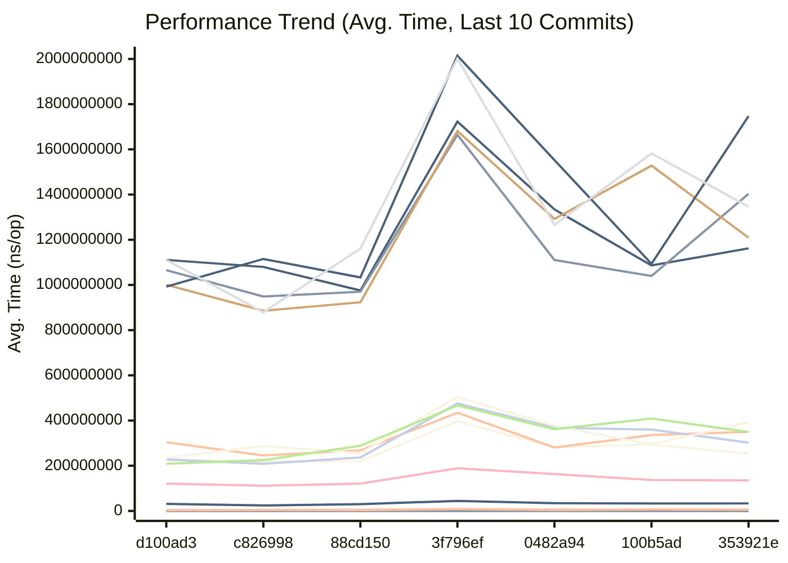
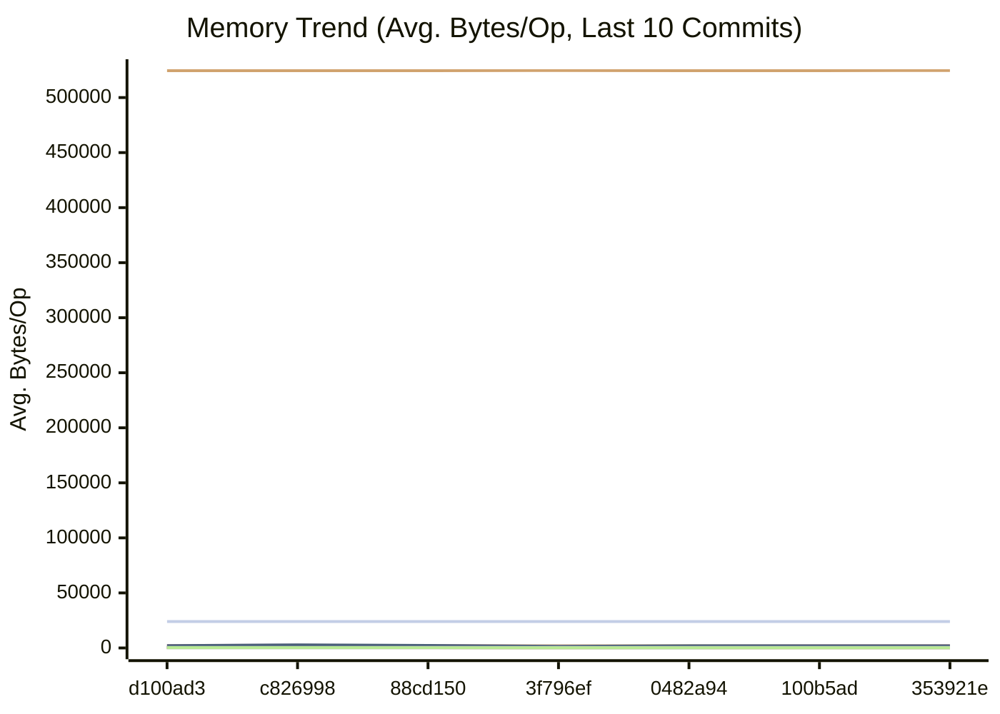
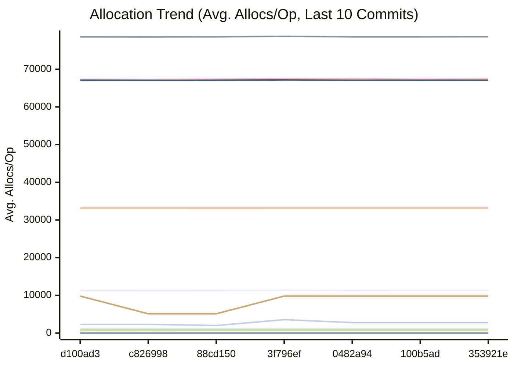

# Performance Benchmarks

This document tracks benchmark performance across commits. The section between
the `BENCHMARK_RESULTS_START/END` markers is auto-generated by the pre-commit
hook; the crypto/OPRF section below is manually maintained.

## How to Read This Document

- **Comparison with previous commit**: `benchstat` output comparing the current
  commit against the previous one. Three tables: **sec/op** (time per operation),
  **B/op** (bytes allocated), **allocs/op** (heap allocations). In each table,
  **lower is better**. `+X%` = regression, `-X%` = improvement, `~` = no
  statistically significant change. `p` is the p-value (p < 0.05 = significant).
- **Latest Benchmark Results**: Single-snapshot table of the current commit's
  averages. Lower values are better across all three columns.
- **Performance Trend plot**: X-axis = commit SHA (left = older, right = newer).
  Y-axis = avg time in ns/op. **Lower lines = faster.** Downward trends are
  improvements; upward spikes are regressions.
- **Memory Trend plot**: Same axes, but Y-axis = avg bytes allocated per op.
  **Lower lines = less memory.** Drops indicate allocation reductions.
- **Allocation Trend plot**: Same axes, but Y-axis = avg heap allocations per op.
  **Lower lines = fewer allocations.** Fewer allocs = less GC pressure.

<!-- BENCHMARK_RESULTS_START -->
## Performance

This section is automatically updated by the pre-commit hook (via .github/scripts/update_readme_with_benchmarks.sh).

### Comparison with previous commit

Each table compares the previous commit (left) to the current commit (right).
**Lower is better** in all three tables. `+X%` = regression, `-X%` = improvement,
`~` = no statistically significant change (p >= 0.05).

- **sec/op**: Time per operation (nanoseconds). Measures raw speed.
- **B/op**: Bytes allocated on the heap per operation. Measures memory usage.
- **allocs/op**: Number of heap allocations per operation. Measures GC pressure.

```
                                      │ /tmp/old_bench_filtered.txt │      /tmp/new_bench_filtered.txt       │
                                      │           sec/op            │    sec/op      vs base                 │
CrushOriginal-8                                        502.3n ± ∞ ¹    597.4n ± ∞ ¹        ~ (p=1.000 n=1) ²
Placement-8                                            4.864µ ± ∞ ¹    6.529µ ± ∞ ¹        ~ (p=1.000 n=1) ²
PlacementDomainSpread-8                                5.246µ ± ∞ ¹    8.024µ ± ∞ ¹        ~ (p=1.000 n=1) ²
CrushOptimized-8                                       353.9n ± ∞ ¹    433.0n ± ∞ ¹        ~ (p=1.000 n=1) ²
LoadGlobalConfig-8                                     9.939µ ± ∞ ¹   13.465µ ± ∞ ¹        ~ (p=1.000 n=1) ²
HashBytes/1MiB-8                                       3.555m ± ∞ ¹    4.784m ± ∞ ¹        ~ (p=1.000 n=1) ²
HashBytes/64MiB-8                                      225.1m ± ∞ ¹    299.0m ± ∞ ¹        ~ (p=1.000 n=1) ²
HashBytes/256MiB-8                                     798.1m ± ∞ ¹   1113.5m ± ∞ ¹        ~ (p=1.000 n=1) ²
HashFile/1MiB-8                                        3.959m ± ∞ ¹    3.915m ± ∞ ¹        ~ (p=1.000 n=1) ²
HashFile/64MiB-8                                       218.5m ± ∞ ¹    322.5m ± ∞ ¹        ~ (p=1.000 n=1) ²
HashFile/256MiB-8                                       1.055 ± ∞ ¹     1.259 ± ∞ ¹        ~ (p=1.000 n=1) ²
PadString-8                                            47.44n ± ∞ ¹    69.23n ± ∞ ¹        ~ (p=1.000 n=1) ²
SanitizeLog/Safe-8                                     225.6n ± ∞ ¹    242.2n ± ∞ ¹        ~ (p=1.000 n=1) ²
SanitizeLog/Unsafe-8                                   768.4n ± ∞ ¹    929.5n ± ∞ ¹        ~ (p=1.000 n=1) ²
AWSChunkedReaderSigned-8                               512.7µ ± ∞ ¹    501.2µ ± ∞ ¹        ~ (p=1.000 n=1) ²
AWSChunkedReaderUnsigned-8                             457.7µ ± ∞ ¹    556.9µ ± ∞ ¹        ~ (p=1.000 n=1) ²
FormatListObjectsV2XML_AppendFormat-8                  648.7µ ± ∞ ¹    775.3µ ± ∞ ¹        ~ (p=1.000 n=1) ²
FormatListObjectsV2XML_OldFormat-8                     406.1µ ± ∞ ¹    479.3µ ± ∞ ¹        ~ (p=1.000 n=1) ²
CheckMetricsAndSwap-8                                  10.40n ± ∞ ¹    10.16n ± ∞ ¹        ~ (p=1.000 n=1) ²
IndexSearch-8                                          1.628n ± ∞ ¹    1.974n ± ∞ ¹        ~ (p=1.000 n=1) ²
IndexDirectTracking-8                                 0.3494n ± ∞ ¹   0.5068n ± ∞ ¹        ~ (p=1.000 n=1) ²
LocalWrite/1MiB-8                                      474.4µ ± ∞ ¹    479.3µ ± ∞ ¹        ~ (p=1.000 n=1) ²
LocalWrite/64MiB-8                                     33.40m ± ∞ ¹    32.66m ± ∞ ¹        ~ (p=1.000 n=1) ²
LocalWrite/256MiB-8                                    118.1m ± ∞ ¹    126.1m ± ∞ ¹        ~ (p=1.000 n=1) ²
ReadVerify/1MiB-8                                      3.883m ± ∞ ¹    3.731m ± ∞ ¹        ~ (p=1.000 n=1) ²
ReadVerify/64MiB-8                                     244.6m ± ∞ ¹    284.3m ± ∞ ¹        ~ (p=1.000 n=1) ²
ReadVerify/256MiB-8                                     1.059 ± ∞ ¹     1.021 ± ∞ ¹        ~ (p=1.000 n=1) ²
TrustedRead/1MiB-8                                     4.777m ± ∞ ¹    4.326m ± ∞ ¹        ~ (p=1.000 n=1) ²
TrustedRead/64MiB-8                                    362.7m ± ∞ ¹    261.0m ± ∞ ¹        ~ (p=1.000 n=1) ²
TrustedRead/256MiB-8                                    1.430 ± ∞ ¹     1.368 ± ∞ ¹        ~ (p=1.000 n=1) ²
S3PutSpool/1MiB-8                                      5.965m ± ∞ ¹    5.932m ± ∞ ¹        ~ (p=1.000 n=1) ²
S3PutSpool/64MiB-8                                     367.9m ± ∞ ¹    355.1m ± ∞ ¹        ~ (p=1.000 n=1) ²
S3PutSpool/256MiB-8                                     1.392 ± ∞ ¹     1.158 ± ∞ ¹        ~ (p=1.000 n=1) ²
geomean                                                535.6µ          604.5µ        +12.86%
¹ need >= 6 samples for confidence interval at level 0.95
² need >= 4 samples to detect a difference at alpha level 0.05

                                      │ /tmp/old_bench_filtered.txt │      /tmp/new_bench_filtered.txt      │
                                      │            B/op             │     B/op       vs base                │
CrushOriginal-8                                         164.0 ± ∞ ¹     164.0 ± ∞ ¹       ~ (p=1.000 n=1) ²
Placement-8                                             352.0 ± ∞ ¹     352.0 ± ∞ ¹       ~ (p=1.000 n=1) ²
PlacementDomainSpread-8                                 352.0 ± ∞ ¹     352.0 ± ∞ ¹       ~ (p=1.000 n=1) ²
CrushOptimized-8                                        0.000 ± ∞ ¹     0.000 ± ∞ ¹       ~ (p=1.000 n=1) ²
LoadGlobalConfig-8                                    1.930Ki ± ∞ ¹   1.930Ki ± ∞ ¹       ~ (p=1.000 n=1) ²
HashBytes/1MiB-8                                        64.00 ± ∞ ¹     64.00 ± ∞ ¹       ~ (p=1.000 n=1) ²
HashBytes/64MiB-8                                       64.00 ± ∞ ¹     64.00 ± ∞ ¹       ~ (p=1.000 n=1) ²
HashBytes/256MiB-8                                      64.00 ± ∞ ¹     64.00 ± ∞ ¹       ~ (p=1.000 n=1) ²
HashFile/1MiB-8                                       32.35Ki ± ∞ ¹   32.35Ki ± ∞ ¹       ~ (p=1.000 n=1) ²
HashFile/64MiB-8                                      32.36Ki ± ∞ ¹   32.35Ki ± ∞ ¹       ~ (p=1.000 n=1) ³
HashFile/256MiB-8                                     32.35Ki ± ∞ ¹   32.35Ki ± ∞ ¹       ~ (p=1.000 n=1) ²
PadString-8                                             64.00 ± ∞ ¹     64.00 ± ∞ ¹       ~ (p=1.000 n=1) ²
SanitizeLog/Safe-8                                      0.000 ± ∞ ¹     0.000 ± ∞ ¹       ~ (p=1.000 n=1) ²
SanitizeLog/Unsafe-8                                    704.0 ± ∞ ¹     704.0 ± ∞ ¹       ~ (p=1.000 n=1) ²
AWSChunkedReaderSigned-8                              11.03Ki ± ∞ ¹   11.02Ki ± ∞ ¹       ~ (p=1.000 n=1) ³
AWSChunkedReaderUnsigned-8                            76.74Ki ± ∞ ¹   76.74Ki ± ∞ ¹       ~ (p=1.000 n=1) ³
FormatListObjectsV2XML_AppendFormat-8                 512.2Ki ± ∞ ¹   512.2Ki ± ∞ ¹       ~ (p=1.000 n=1) ³
FormatListObjectsV2XML_OldFormat-8                    23.44Ki ± ∞ ¹   23.44Ki ± ∞ ¹       ~ (p=1.000 n=1) ²
CheckMetricsAndSwap-8                                   0.000 ± ∞ ¹     0.000 ± ∞ ¹       ~ (p=1.000 n=1) ²
IndexSearch-8                                           0.000 ± ∞ ¹     0.000 ± ∞ ¹       ~ (p=1.000 n=1) ²
IndexDirectTracking-8                                   0.000 ± ∞ ¹     0.000 ± ∞ ¹       ~ (p=1.000 n=1) ²
LocalWrite/1MiB-8                                     65.46Ki ± ∞ ¹   65.46Ki ± ∞ ¹       ~ (p=1.000 n=1) ³
LocalWrite/64MiB-8                                    65.50Ki ± ∞ ¹   65.48Ki ± ∞ ¹       ~ (p=1.000 n=1) ³
LocalWrite/256MiB-8                                   65.79Ki ± ∞ ¹   65.80Ki ± ∞ ¹       ~ (p=1.000 n=1) ³
ReadVerify/1MiB-8                                       460.0 ± ∞ ¹     462.0 ± ∞ ¹       ~ (p=1.000 n=1) ³
ReadVerify/64MiB-8                                    2.253Ki ± ∞ ¹   2.711Ki ± ∞ ¹       ~ (p=1.000 n=1) ³
ReadVerify/256MiB-8                                   9.578Ki ± ∞ ¹   5.000Ki ± ∞ ¹       ~ (p=1.000 n=1) ³
TrustedRead/1MiB-8                                      800.0 ± ∞ ¹     800.0 ± ∞ ¹       ~ (p=1.000 n=1) ²
TrustedRead/64MiB-8                                     800.0 ± ∞ ¹     800.0 ± ∞ ¹       ~ (p=1.000 n=1) ²
TrustedRead/256MiB-8                                    800.0 ± ∞ ¹     800.0 ± ∞ ¹       ~ (p=1.000 n=1) ²
S3PutSpool/1MiB-8                                       447.0 ± ∞ ¹     447.0 ± ∞ ¹       ~ (p=1.000 n=1) ²
S3PutSpool/64MiB-8                                      448.0 ± ∞ ¹     448.0 ± ∞ ¹       ~ (p=1.000 n=1) ²
S3PutSpool/256MiB-8                                     448.0 ± ∞ ¹     448.0 ± ∞ ¹       ~ (p=1.000 n=1) ²
geomean                                                           ⁴                  -1.39%               ⁴
¹ need >= 6 samples for confidence interval at level 0.95
² all samples are equal
³ need >= 4 samples to detect a difference at alpha level 0.05
⁴ summaries must be >0 to compute geomean

                                      │ /tmp/old_bench_filtered.txt │     /tmp/new_bench_filtered.txt      │
                                      │          allocs/op          │  allocs/op    vs base                │
CrushOriginal-8                                         3.000 ± ∞ ¹    3.000 ± ∞ ¹       ~ (p=1.000 n=1) ²
Placement-8                                             6.000 ± ∞ ¹    6.000 ± ∞ ¹       ~ (p=1.000 n=1) ²
PlacementDomainSpread-8                                 6.000 ± ∞ ¹    6.000 ± ∞ ¹       ~ (p=1.000 n=1) ²
CrushOptimized-8                                        0.000 ± ∞ ¹    0.000 ± ∞ ¹       ~ (p=1.000 n=1) ²
LoadGlobalConfig-8                                      58.00 ± ∞ ¹    58.00 ± ∞ ¹       ~ (p=1.000 n=1) ²
HashBytes/1MiB-8                                        1.000 ± ∞ ¹    1.000 ± ∞ ¹       ~ (p=1.000 n=1) ²
HashBytes/64MiB-8                                       1.000 ± ∞ ¹    1.000 ± ∞ ¹       ~ (p=1.000 n=1) ²
HashBytes/256MiB-8                                      1.000 ± ∞ ¹    1.000 ± ∞ ¹       ~ (p=1.000 n=1) ²
HashFile/1MiB-8                                         6.000 ± ∞ ¹    6.000 ± ∞ ¹       ~ (p=1.000 n=1) ²
HashFile/64MiB-8                                        6.000 ± ∞ ¹    6.000 ± ∞ ¹       ~ (p=1.000 n=1) ²
HashFile/256MiB-8                                       6.000 ± ∞ ¹    6.000 ± ∞ ¹       ~ (p=1.000 n=1) ²
PadString-8                                             1.000 ± ∞ ¹    1.000 ± ∞ ¹       ~ (p=1.000 n=1) ²
SanitizeLog/Safe-8                                      0.000 ± ∞ ¹    0.000 ± ∞ ¹       ~ (p=1.000 n=1) ²
SanitizeLog/Unsafe-8                                    1.000 ± ∞ ¹    1.000 ± ∞ ¹       ~ (p=1.000 n=1) ²
AWSChunkedReaderSigned-8                                80.00 ± ∞ ¹    80.00 ± ∞ ¹       ~ (p=1.000 n=1) ²
AWSChunkedReaderUnsigned-8                              15.00 ± ∞ ¹    15.00 ± ∞ ¹       ~ (p=1.000 n=1) ²
FormatListObjectsV2XML_AppendFormat-8                   16.00 ± ∞ ¹    16.00 ± ∞ ¹       ~ (p=1.000 n=1) ²
FormatListObjectsV2XML_OldFormat-8                     1.000k ± ∞ ¹   1.000k ± ∞ ¹       ~ (p=1.000 n=1) ²
CheckMetricsAndSwap-8                                   0.000 ± ∞ ¹    0.000 ± ∞ ¹       ~ (p=1.000 n=1) ²
IndexSearch-8                                           0.000 ± ∞ ¹    0.000 ± ∞ ¹       ~ (p=1.000 n=1) ²
IndexDirectTracking-8                                   0.000 ± ∞ ¹    0.000 ± ∞ ¹       ~ (p=1.000 n=1) ²
LocalWrite/1MiB-8                                       19.00 ± ∞ ¹    18.00 ± ∞ ¹       ~ (p=1.000 n=1) ³
LocalWrite/64MiB-8                                      18.00 ± ∞ ¹    18.00 ± ∞ ¹       ~ (p=1.000 n=1) ²
LocalWrite/256MiB-8                                     20.00 ± ∞ ¹    20.00 ± ∞ ¹       ~ (p=1.000 n=1) ²
ReadVerify/1MiB-8                                       6.000 ± ∞ ¹    6.000 ± ∞ ¹       ~ (p=1.000 n=1) ²
ReadVerify/64MiB-8                                      6.000 ± ∞ ¹    7.000 ± ∞ ¹       ~ (p=1.000 n=1) ³
ReadVerify/256MiB-8                                    10.000 ± ∞ ¹    8.000 ± ∞ ¹       ~ (p=1.000 n=1) ³
TrustedRead/1MiB-8                                      11.00 ± ∞ ¹    11.00 ± ∞ ¹       ~ (p=1.000 n=1) ²
TrustedRead/64MiB-8                                     11.00 ± ∞ ¹    11.00 ± ∞ ¹       ~ (p=1.000 n=1) ²
TrustedRead/256MiB-8                                    11.00 ± ∞ ¹    11.00 ± ∞ ¹       ~ (p=1.000 n=1) ²
S3PutSpool/1MiB-8                                       10.00 ± ∞ ¹    10.00 ± ∞ ¹       ~ (p=1.000 n=1) ²
S3PutSpool/64MiB-8                                      10.00 ± ∞ ¹    10.00 ± ∞ ¹       ~ (p=1.000 n=1) ²
S3PutSpool/256MiB-8                                     10.00 ± ∞ ¹    10.00 ± ∞ ¹       ~ (p=1.000 n=1) ²
geomean                                                           ⁴                 -0.37%               ⁴
¹ need >= 6 samples for confidence interval at level 0.95
² all samples are equal
³ need >= 4 samples to detect a difference at alpha level 0.05
⁴ summaries must be >0 to compute geomean

                           │ /tmp/old_bench_filtered.txt │      /tmp/new_bench_filtered.txt      │
                           │             B/s             │      B/s       vs base                │
HashBytes/1MiB-8                           281.3Mi ± ∞ ¹   209.0Mi ± ∞ ¹       ~ (p=1.000 n=1) ²
HashBytes/64MiB-8                          284.3Mi ± ∞ ¹   214.1Mi ± ∞ ¹       ~ (p=1.000 n=1) ²
HashBytes/256MiB-8                         320.7Mi ± ∞ ¹   229.9Mi ± ∞ ¹       ~ (p=1.000 n=1) ²
HashFile/1MiB-8                            252.6Mi ± ∞ ¹   255.4Mi ± ∞ ¹       ~ (p=1.000 n=1) ²
HashFile/64MiB-8                           292.9Mi ± ∞ ¹   198.5Mi ± ∞ ¹       ~ (p=1.000 n=1) ²
HashFile/256MiB-8                          242.6Mi ± ∞ ¹   203.4Mi ± ∞ ¹       ~ (p=1.000 n=1) ²
AWSChunkedReaderSigned-8                   123.8Mi ± ∞ ¹   126.6Mi ± ∞ ¹       ~ (p=1.000 n=1) ²
AWSChunkedReaderUnsigned-8                 138.7Mi ± ∞ ¹   114.0Mi ± ∞ ¹       ~ (p=1.000 n=1) ²
LocalWrite/1MiB-8                          2.058Gi ± ∞ ¹   2.037Gi ± ∞ ¹       ~ (p=1.000 n=1) ²
LocalWrite/64MiB-8                         1.871Gi ± ∞ ¹   1.914Gi ± ∞ ¹       ~ (p=1.000 n=1) ²
LocalWrite/256MiB-8                        2.117Gi ± ∞ ¹   1.982Gi ± ∞ ¹       ~ (p=1.000 n=1) ²
ReadVerify/1MiB-8                          257.5Mi ± ∞ ¹   268.0Mi ± ∞ ¹       ~ (p=1.000 n=1) ²
ReadVerify/64MiB-8                         261.7Mi ± ∞ ¹   225.2Mi ± ∞ ¹       ~ (p=1.000 n=1) ²
ReadVerify/256MiB-8                        241.9Mi ± ∞ ¹   250.8Mi ± ∞ ¹       ~ (p=1.000 n=1) ²
TrustedRead/1MiB-8                         209.3Mi ± ∞ ¹   231.2Mi ± ∞ ¹       ~ (p=1.000 n=1) ²
TrustedRead/64MiB-8                        176.4Mi ± ∞ ¹   245.2Mi ± ∞ ¹       ~ (p=1.000 n=1) ²
TrustedRead/256MiB-8                       179.0Mi ± ∞ ¹   187.1Mi ± ∞ ¹       ~ (p=1.000 n=1) ²
S3PutSpool/1MiB-8                          167.7Mi ± ∞ ¹   168.6Mi ± ∞ ¹       ~ (p=1.000 n=1) ²
S3PutSpool/64MiB-8                         174.0Mi ± ∞ ¹   180.2Mi ± ∞ ¹       ~ (p=1.000 n=1) ²
S3PutSpool/256MiB-8                        183.9Mi ± ∞ ¹   221.1Mi ± ∞ ¹       ~ (p=1.000 n=1) ²
geomean                                    302.1Mi         286.3Mi        -5.21%
¹ need >= 6 samples for confidence interval at level 0.95
² need >= 4 samples to detect a difference at alpha level 0.05
```

### Latest Benchmark Results

Single-snapshot of the current commit's averages. **Lower is better** across all
three columns: time (speed), bytes (memory), allocs (GC pressure).


| Benchmark | Avg. Time/Op | Avg. Bytes/Op | Avg. Allocs/Op |
|-----------|--------------|---------------|----------------|
| BenchmarkAWSChunkedReaderSigned-8 | 501241.00 ns/op | 132.79 B/op | 11287.00 allocs/op |
| BenchmarkAWSChunkedReaderUnsigned-8 | 556893.00 ns/op | 119.52 B/op | 78582.00 allocs/op |
| BenchmarkCheckMetricsAndSwap-8 | 10.16 ns/op | 0.00 B/op | 0.00 allocs/op |
| BenchmarkCrushOptimized-8 | 433.00 ns/op | 0.00 B/op | 0.00 allocs/op |
| BenchmarkCrushOriginal-8 | 597.40 ns/op | 164.00 B/op | 3.00 allocs/op |
| BenchmarkFormatListObjectsV2XML_AppendFormat-8 | 775274.00 ns/op | 524456.00 B/op | 16.00 allocs/op |
| BenchmarkFormatListObjectsV2XML_OldFormat-8 | 479265.00 ns/op | 24000.00 B/op | 1000.00 allocs/op |
| BenchmarkHashBytes/1MiB-8 | 4784039.00 ns/op | 219.18 B/op | 64.00 allocs/op |
| BenchmarkHashBytes/256MiB-8 | 1113482493.00 ns/op | 241.08 B/op | 64.00 allocs/op |
| BenchmarkHashBytes/64MiB-8 | 298951068.00 ns/op | 224.48 B/op | 64.00 allocs/op |
| BenchmarkHashFile/1MiB-8 | 3915050.00 ns/op | 267.83 B/op | 33128.00 allocs/op |
| BenchmarkHashFile/256MiB-8 | 1258679744.00 ns/op | 213.27 B/op | 33128.00 allocs/op |
| BenchmarkHashFile/64MiB-8 | 322488540.00 ns/op | 208.10 B/op | 33128.00 allocs/op |
| BenchmarkIndexDirectTracking-8 | 0.51 ns/op | 0.00 B/op | 0.00 allocs/op |
| BenchmarkIndexSearch-8 | 1.97 ns/op | 0.00 B/op | 0.00 allocs/op |
| BenchmarkLoadGlobalConfig-8 | 13465.00 ns/op | 1976.00 B/op | 58.00 allocs/op |
| BenchmarkLocalWrite/1MiB-8 | 479322.00 ns/op | 2187.62 B/op | 67028.00 allocs/op |
| BenchmarkLocalWrite/256MiB-8 | 126110483.00 ns/op | 2128.57 B/op | 67383.00 allocs/op |
| BenchmarkLocalWrite/64MiB-8 | 32661319.00 ns/op | 2054.69 B/op | 67052.00 allocs/op |
| BenchmarkPadString-8 | 69.23 ns/op | 64.00 B/op | 1.00 allocs/op |
| BenchmarkPlacement-8 | 6529.00 ns/op | 352.00 B/op | 6.00 allocs/op |
| BenchmarkPlacementDomainSpread-8 | 8024.00 ns/op | 352.00 B/op | 6.00 allocs/op |
| BenchmarkReadVerify/1MiB-8 | 3731377.00 ns/op | 281.02 B/op | 462.00 allocs/op |
| BenchmarkReadVerify/256MiB-8 | 1020754000.00 ns/op | 262.98 B/op | 5120.00 allocs/op |
| BenchmarkReadVerify/64MiB-8 | 284251269.00 ns/op | 236.09 B/op | 2776.00 allocs/op |
| BenchmarkS3PutSpool/1MiB-8 | 5931927.00 ns/op | 176.77 B/op | 447.00 allocs/op |
| BenchmarkS3PutSpool/256MiB-8 | 1157791795.00 ns/op | 231.85 B/op | 448.00 allocs/op |
| BenchmarkS3PutSpool/64MiB-8 | 355148274.00 ns/op | 188.96 B/op | 448.00 allocs/op |
| BenchmarkSanitizeLog/Safe-8 | 242.20 ns/op | 0.00 B/op | 0.00 allocs/op |
| BenchmarkSanitizeLog/Unsafe-8 | 929.50 ns/op | 704.00 B/op | 1.00 allocs/op |
| BenchmarkTrustedRead/1MiB-8 | 4326085.00 ns/op | 242.38 B/op | 800.00 allocs/op |
| BenchmarkTrustedRead/256MiB-8 | 1367894050.00 ns/op | 196.24 B/op | 800.00 allocs/op |
| BenchmarkTrustedRead/64MiB-8 | 260957497.00 ns/op | 257.16 B/op | 800.00 allocs/op |


### Performance History

**Legend**

| Color | Benchmark | Description |
|---|---|---|
| 🟢 | CheckMetricsAndSwap | Evaluation of system metrics (CPU/Mem) and mode switching logic |
| 🟤 | CrushOriginal | Original Sage Weil's CRUSH placement algorithm using reflection and float math |
| ⚪ | CrushOptimized | Performance-tuned CRUSH-lite placement algorithm using bitwise shifts and integer math (Rule 19) |
| 🔵 | IndexDirectTracking | Accessing current replication mode via direct slice index (O(1)) |
| 🔴 | IndexSearch | Searching for current replication mode in the order slice using `slices.Index` |
| 🟠 | LoadGlobalConfig | Parsing and loading the `[global]` section from the INI configuration |
| 🟣 | PadString | Padding strings with null characters to a fixed protocol length |
| 🟡 | ParseReplicationOrder | Parsing the CSV-formatted replication order string into an integer slice |

#### Time per Operation (ns/op)

X-axis: commit SHA (left = older, right = newer). Y-axis: avg time in ns/op.
**Lower lines = faster code.** Downward trends are improvements; upward spikes
are regressions to investigate.


```mermaid
xychart-beta
    title "Performance Trend (Avg. Time, Last 10 Commits)"
    x-axis "Commit"
    y-axis "Avg. Time (ns/op)"
    x-axis [d100ad3,c826998,88cd150,3f796ef,0482a94,100b5ad,353921e]
    line "AWSChunkedReaderSigned" [513734,453907,508785,905557,534318,636346,690357,622918,512707,501241]
    line "AWSChunkedReaderUnsigned" [555370,434075,493616,894454,593403,613680,684347,616129,457742,556893]
    line "CheckMetricsAndSwap" [10,10,9,15,11,13,14,14,10,10]
    line "CrushOptimized" [388,377,359,624,439,383,433,463,354,433]
    line "CrushOriginal" [510,457,482,891,591,678,598,642,502,597]
    line "FormatListObjectsV2XML_AppendFormat" [825885,607733,755798,1466071,913648,876655,1035620,900618,648718,775274]
    line "FormatListObjectsV2XML_OldFormat" [457438,384420,452349,876006,527726,499237,554225,498654,406141,479265]
    line "HashBytes/1MiB" [3234966,3413080,3456264,5810430,3924626,3806841,4997033,4520322,3555390,4784039]
    line "HashBytes/256MiB" [1110812216,1079738977,975610814,1722861401,1334138916,1086104803,1161959394,1081431052,798133130,1113482493]
    line "HashBytes/64MiB" [223678991,219197938,219466744,396388379,282406448,294324496,253497415,254442334,225124511,298951068]
    line "HashFile/1MiB" [4016890,4018511,4015638,6883319,4730225,4355866,5020414,4836717,3959247,3915050]
    line "HashFile/256MiB" [1065256239,948781835,970019312,1664168720,1110334520,1039461142,1402967574,1130963414,1055197690,1258679744]
    line "HashFile/64MiB" [304125965,245379512,268034657,434196622,280320210,335648128,350050718,282645449,218474314,322488540]
    line "IndexDirectTracking" [1,0,0,1,1,0,1,1,0,1]
    line "IndexSearch" [3,2,2,4,2,2,3,2,2,2]
    line "LoadGlobalConfig" [10521,10213,10358,20717,13477,12586,12915,11283,9939,13465]
    line "LocalWrite/1MiB" [523182,386063,1014308,861821,620083,533203,606315,575526,474416,479322]
    line "LocalWrite/256MiB" [120742842,111644085,120805038,188719012,163107200,137014284,135157963,132539343,118094125,126110483]
    line "LocalWrite/64MiB" [31091015,24172266,30061816,44391316,34009604,32925149,33266024,33235605,33404598,32661319]
    line "PadString" [57,43,54,108,74,66,65,63,47,69]
    line "ParseReplicationOrder_NoPrealloc" [350,349,357,354,345,225,229,165,232,234]
    line "ParseReplicationOrder_Prealloc" [229,231,237,234,229,108,107,80,110,109]
    line "Placement" [5565,5457,4982,9769,7169,6982,6435,6648,4864,6529]
    line "PlacementDomainSpread" [5726,5715,5363,10254,7367,6165,7125,6936,5246,8024]
    line "ReadVerify/1MiB" [3880705,3695998,3063023,6669899,5893653,4349552,4844958,4821081,3882918,3731377]
    line "ReadVerify/256MiB" [1000480549,885690851,923410779,1681161525,1292102083,1527966144,1208865206,1079520105,1058504265,1020754000]
    line "ReadVerify/64MiB" [227817182,208677144,236746582,475503443,368423405,360046306,301883250,211152290,244603172,284251269]
    line "S3PutSpool/1MiB" [4130137,3968364,5120338,8098804,5792248,4040951,5594802,4971787,5964641,5931927]
    line "S3PutSpool/256MiB" [992342042,1114984906,1033132692,2014620633,1552306291,1093403586,1746985899,1161989262,1392397511,1157791795]
    line "S3PutSpool/64MiB" [234949006,287125834,255515959,504549456,376146327,294844128,391765533,283817898,367879613,355148274]
    line "SanitizeLog/Safe" [286,222,310,494,332,277,365,264,226,242]
    line "SanitizeLog/Unsafe" [848,591,715,1256,854,1098,1183,1013,768,930]
    line "TrustedRead/1MiB" [3222989,4353885,3601064,7771585,4314592,6674262,5737318,4407789,4777459,4326085]
    line "TrustedRead/256MiB" [1110598924,879089092,1160948664,2001362379,1265914846,1581862210,1346158360,1079106743,1430194708,1367894050]
    line "TrustedRead/64MiB" [208613545,224760418,288480214,466675929,361331755,408809763,349215436,302381501,362734452,260957497]
```

#### Memory per Operation (B/op)

X-axis: commit SHA. Y-axis: avg bytes allocated per op.
**Lower lines = less memory.** Drops indicate allocation reductions.


```mermaid
xychart-beta
    title "Memory Trend (Avg. Bytes/Op, Last 10 Commits)"
    x-axis "Commit"
    y-axis "Avg. Bytes/Op"
    x-axis [d100ad3,c826998,88cd150,3f796ef,0482a94,100b5ad,353921e]
    line "AWSChunkedReaderSigned" [130,147,131,74,125,105,96,107,130,133]
    line "AWSChunkedReaderUnsigned" [120,153,135,74,112,108,97,108,145,120]
    line "CheckMetricsAndSwap" [0,0,0,0,0,0,0,0,0,0]
    line "CrushOptimized" [0,0,0,0,0,0,0,0,0,0]
    line "CrushOriginal" [164,164,164,164,164,164,164,164,164,164]
    line "FormatListObjectsV2XML_AppendFormat" [524463,524446,524454,524505,524477,524470,524490,524474,524448,524456]
    line "FormatListObjectsV2XML_OldFormat" [24000,24000,24000,24000,24000,24000,24000,24000,24000,24000]
    line "HashBytes/1MiB" [324,307,303,180,267,275,210,232,295,219]
    line "HashBytes/256MiB" [242,249,275,156,201,247,231,248,336,241]
    line "HashBytes/64MiB" [300,306,306,169,238,228,265,264,298,224]
    line "HashFile/1MiB" [261,261,261,152,222,241,209,217,265,268]
    line "HashFile/256MiB" [252,283,277,161,242,258,191,237,254,213]
    line "HashFile/64MiB" [221,273,250,155,239,200,192,237,307,208]
    line "IndexDirectTracking" [0,0,0,0,0,0,0,0,0,0]
    line "IndexSearch" [0,0,0,0,0,0,0,0,0,0]
    line "LoadGlobalConfig" [1976,1976,1976,1976,1976,1976,1976,1976,1976,1976]
    line "LocalWrite/1MiB" [2004,2716,1034,1217,1691,1967,1729,1822,2210,2188]
    line "LocalWrite/256MiB" [2223,2404,2222,1422,1646,1959,1986,2025,2273,2129]
    line "LocalWrite/64MiB" [2158,2776,2232,1512,1973,2038,2017,2019,2009,2055]
    line "PadString" [64,64,64,64,64,64,64,64,64,64]
    line "ParseReplicationOrder_NoPrealloc" [408,408,408,408,408,248,248,248,248,248]
    line "ParseReplicationOrder_Prealloc" [240,240,240,240,240,80,80,80,80,80]
    line "Placement" [352,352,352,352,352,352,352,352,352,352]
    line "PlacementDomainSpread" [352,352,352,352,352,352,352,352,352,352]
    line "ReadVerify/1MiB" [270,284,342,157,178,241,216,218,270,281]
    line "ReadVerify/256MiB" [268,303,291,160,208,176,222,249,254,263]
    line "ReadVerify/64MiB" [295,322,283,141,182,186,222,318,274,236]
    line "S3PutSpool/1MiB" [254,264,205,129,181,259,187,211,176,177]
    line "S3PutSpool/256MiB" [271,241,260,133,173,246,154,231,193,232]
    line "S3PutSpool/64MiB" [286,234,263,133,178,228,171,236,182,189]
    line "SanitizeLog/Safe" [0,0,0,0,0,0,0,0,0,0]
    line "SanitizeLog/Unsafe" [704,704,704,704,704,704,704,704,704,704]
    line "TrustedRead/1MiB" [325,241,291,135,243,157,183,238,219,242]
    line "TrustedRead/256MiB" [242,305,231,134,212,170,199,249,188,196]
    line "TrustedRead/64MiB" [322,299,233,144,186,164,192,222,185,257]
```

#### Allocations per Operation (allocs/op)

X-axis: commit SHA. Y-axis: avg heap allocations per op.
**Lower lines = fewer allocations.** Fewer allocs = less GC pressure.


```mermaid
xychart-beta
    title "Allocation Trend (Avg. Allocs/Op, Last 10 Commits)"
    x-axis "Commit"
    y-axis "Avg. Allocs/Op"
    x-axis [d100ad3,c826998,88cd150,3f796ef,0482a94,100b5ad,353921e]
    line "AWSChunkedReaderSigned" [11299,11270,11296,11367,11304,11317,11324,11331,11296,11287]
    line "AWSChunkedReaderUnsigned" [78586,78564,78579,78745,78578,78592,78605,78609,78579,78582]
    line "CheckMetricsAndSwap" [0,0,0,0,0,0,0,0,0,0]
    line "CrushOptimized" [0,0,0,0,0,0,0,0,0,0]
    line "CrushOriginal" [3,3,3,3,3,3,3,3,3,3]
    line "FormatListObjectsV2XML_AppendFormat" [16,16,16,16,16,16,16,16,16,16]
    line "FormatListObjectsV2XML_OldFormat" [1000,1000,1000,1000,1000,1000,1000,1000,1000,1000]
    line "HashBytes/1MiB" [64,64,64,64,64,64,64,64,64,64]
    line "HashBytes/256MiB" [64,64,64,64,64,64,64,64,64,64]
    line "HashBytes/64MiB" [64,64,64,64,64,64,64,64,64,64]
    line "HashFile/1MiB" [33128,33128,33112,33128,33128,33128,33128,33128,33128,33128]
    line "HashFile/256MiB" [33128,33128,33128,33128,33128,33128,33128,33128,33128,33128]
    line "HashFile/64MiB" [33128,33128,33128,33128,33128,33128,33128,33128,33137,33128]
    line "IndexDirectTracking" [0,0,0,0,0,0,0,0,0,0]
    line "IndexSearch" [0,0,0,0,0,0,0,0,0,0]
    line "LoadGlobalConfig" [58,58,58,58,58,58,58,58,58,58]
    line "LocalWrite/1MiB" [67030,67028,67031,67037,67034,67030,67036,67036,67029,67028]
    line "LocalWrite/256MiB" [67317,67268,67358,67518,67492,67349,67409,67379,67372,67383]
    line "LocalWrite/64MiB" [67097,67071,67089,67157,67097,67104,67086,67092,67077,67052]
    line "PadString" [1,1,1,1,1,1,1,1,1,1]
    line "ParseReplicationOrder_NoPrealloc" [6,6,6,6,6,5,5,5,5,5]
    line "ParseReplicationOrder_Prealloc" [2,2,2,2,2,1,1,1,1,1]
    line "Placement" [6,6,6,6,6,6,6,6,6,6]
    line "PlacementDomainSpread" [6,6,6,6,6,6,6,6,6,6]
    line "ReadVerify/1MiB" [459,457,458,483,437,469,466,470,460,462]
    line "ReadVerify/256MiB" [9808,5120,5120,9808,9808,9808,9808,5120,9808,5120]
    line "ReadVerify/64MiB" [2307,2307,1994,3557,2776,2776,2776,2307,2307,2776]
    line "S3PutSpool/1MiB" [447,447,448,448,447,447,448,447,447,447]
    line "S3PutSpool/256MiB" [448,448,448,448,448,448,448,448,448,448]
    line "S3PutSpool/64MiB" [448,448,448,448,448,448,448,448,448,448]
    line "SanitizeLog/Safe" [0,0,0,0,0,0,0,0,0,0]
    line "SanitizeLog/Unsafe" [1,1,1,1,1,1,1,1,1,1]
    line "TrustedRead/1MiB" [800,825,800,800,800,800,800,800,800,800]
    line "TrustedRead/256MiB" [800,800,800,800,800,800,800,800,800,800]
    line "TrustedRead/64MiB" [800,800,800,800,800,800,800,800,800,800]
```
<!-- BENCHMARK_RESULTS_END -->

### E2EE + OPRF overhead

The sections above are auto-generated and cover the hot-path benchmarks. The
crypto/OPRF work is measured separately; figures below are from `go test -bench`
on the crypto module and are intentionally placed outside the auto-managed block
so they persist.

**Lower is better** across all columns. These benchmarks run on `src/crypto` only
(not tracked in the auto-generated plots above).

| Benchmark | What it measures | Avg. Time/Op | Avg. Bytes/Op | Avg. Allocs/Op |
|-----------|------------------|--------------|---------------|----------------|
| EncryptStream | AES-GCM-256 chunked encryption (64KB input) | ~63 µs | 167 KB | 14 |
| DecryptStream | AES-GCM-256 chunked decryption (64KB input) | ~54 µs | 136 KB | 13 |
| DeriveKey | HKDF-SHA256 key derivation per tenant | ~3.5 µs | 1.3 KB | 18 |
| OPRFCombineThreshold3 | Threshold-3 OPRF combine + unblind (Ristretto255) | ~530 µs | 2.3 KB | 62 |

With `encryption_enabled`, every byte passes through AES-GCM-256 streaming at
~800-1200 MB/s (chunk-bounded memory). The streaming format is **StreamVersion
v4 (issue #824)** with a self-describing chunk size: the default 4096-byte
chunk preserves prior throughput, and the chunk size can be raised/lowered via
`SetStreamChunkSize` within `[512, 4128]` for latency/memory trade-offs without
a wire change in framing beyond the 2-byte header field (v3/v2 blobs still
decode). The threshold OPRF is evaluated **once per
upload/download**, on the dedup tag only (never per chunk):
`OPRFCombineThreshold3` measures a one-time ~0.53 ms client-side combine/unblind
for threshold-3, plus one round-trip per daemon share. This is negligible against
network/disk I/O and does not affect streaming throughput. When `oprf_enabled =
false`, the OPRF path is skipped entirely and behavior is identical to the
pre-OPRF encryption path (backward compatible).
