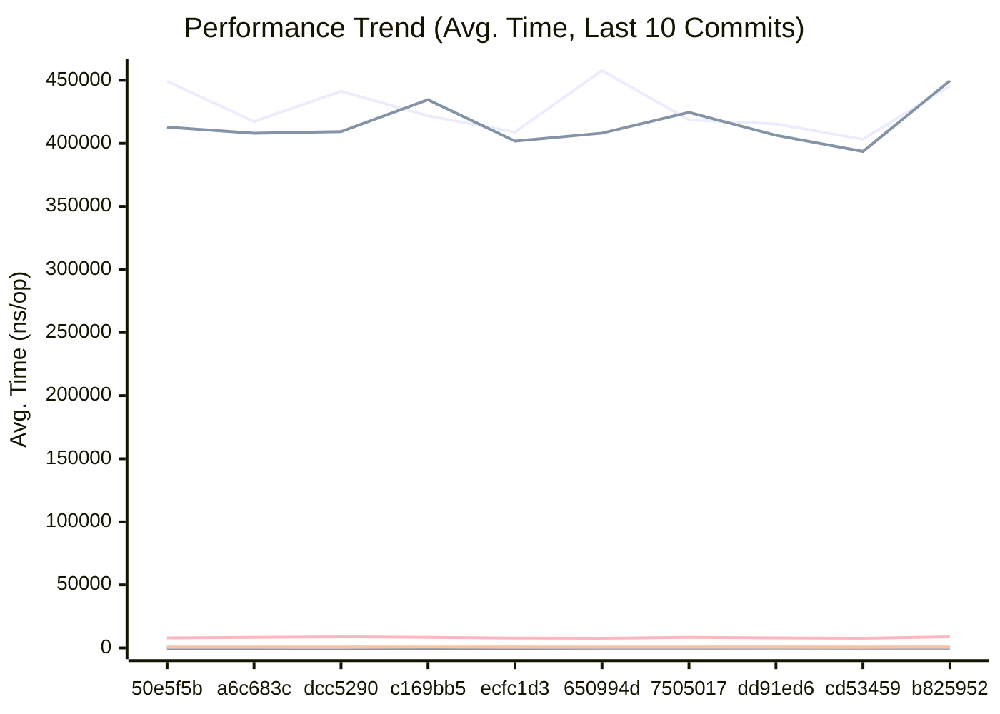
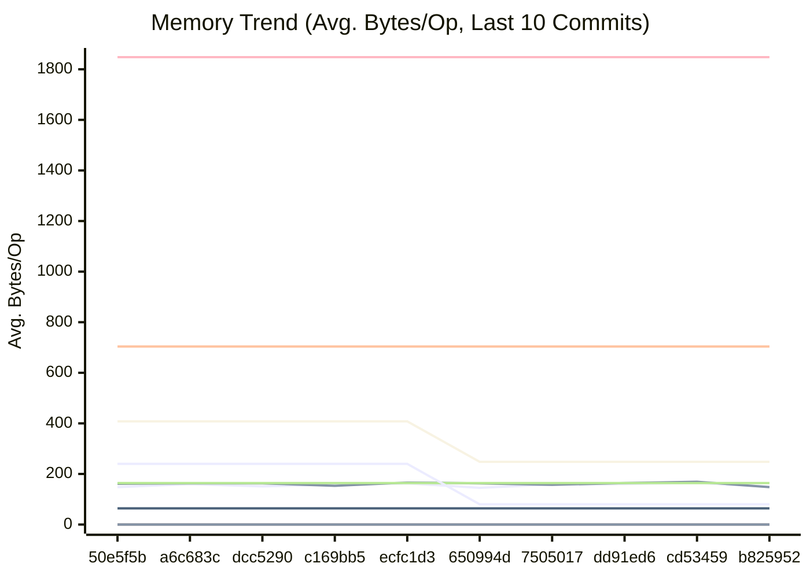
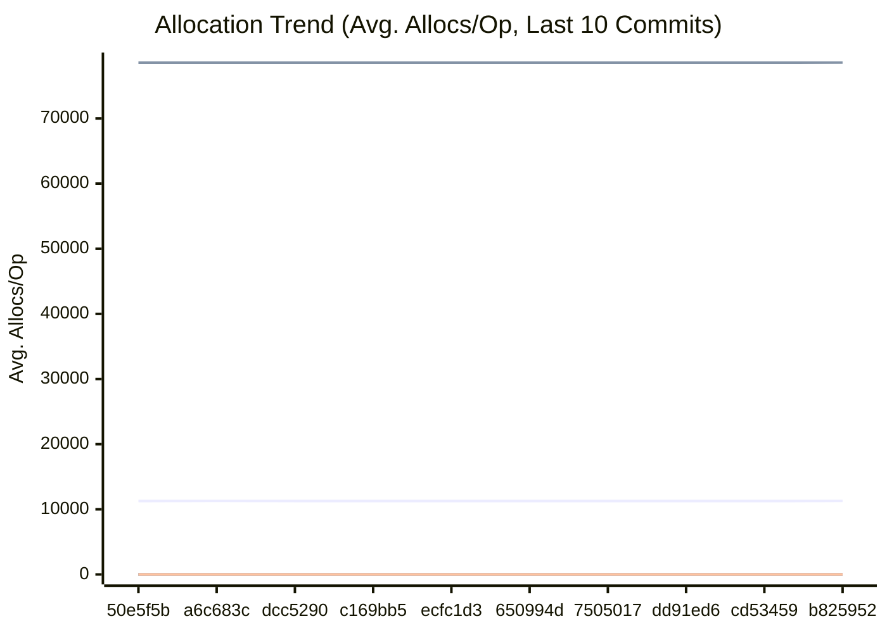

# Performance Benchmarks

This document tracks benchmark performance across commits. The section between
the `BENCHMARK_RESULTS_START/END` markers is auto-generated by the pre-commit
hook; the crypto/OPRF section below is manually maintained.

## How to Read This Document

- **Comparison with previous commit**: `benchstat` output comparing the current
  commit against the previous one. Three tables: **sec/op** (time per operation),
  **B/op** (bytes allocated), **allocs/op** (heap allocations). In each table,
  **lower is better**. `+X%` = regression, `-X%` = improvement, `~` = no
  statistically significant change. `p` is the p-value (p < 0.05 = significant).
- **Latest Benchmark Results**: Single-snapshot table of the current commit's
  averages. Lower values are better across all three columns.
- **Performance Trend plot**: X-axis = commit SHA (left = older, right = newer).
  Y-axis = avg time in ns/op. **Lower lines = faster.** Downward trends are
  improvements; upward spikes are regressions.
- **Memory Trend plot**: Same axes, but Y-axis = avg bytes allocated per op.
  **Lower lines = less memory.** Drops indicate allocation reductions.
- **Allocation Trend plot**: Same axes, but Y-axis = avg heap allocations per op.
  **Lower lines = fewer allocations.** Fewer allocs = less GC pressure.

<!-- BENCHMARK_RESULTS_START -->
## Performance

This section is automatically updated by our GitHub Actions workflow.

### Comparison with previous commit

Each table compares the previous commit (left) to the current commit (right).
**Lower is better** in all three tables. `+X%` = regression, `-X%` = improvement,
`~` = no statistically significant change (p >= 0.05).

- **sec/op**: Time per operation (nanoseconds). Measures raw speed.
- **B/op**: Bytes allocated on the heap per operation. Measures memory usage.
- **allocs/op**: Number of heap allocations per operation. Measures GC pressure.

```
                           │ /tmp/old_bench_filtered.txt │      /tmp/new_bench_filtered.txt      │
                           │           sec/op            │    sec/op      vs base                │
CrushOriginal-8                             399.4n ± ∞ ¹    440.9n ± ∞ ¹       ~ (p=1.000 n=1) ²
CrushOptimized-8                            315.3n ± ∞ ¹    357.9n ± ∞ ¹       ~ (p=1.000 n=1) ²
LoadGlobalConfig-8                          7.670µ ± ∞ ¹    8.718µ ± ∞ ¹       ~ (p=1.000 n=1) ²
PadString-8                                 38.56n ± ∞ ¹    44.19n ± ∞ ¹       ~ (p=1.000 n=1) ²
SanitizeLog/Safe-8                          437.3n ± ∞ ¹    419.4n ± ∞ ¹       ~ (p=1.000 n=1) ²
SanitizeLog/Unsafe-8                        501.6n ± ∞ ¹    602.1n ± ∞ ¹       ~ (p=1.000 n=1) ²
AWSChunkedReaderSigned-8                    433.3µ ± ∞ ¹    445.6µ ± ∞ ¹       ~ (p=1.000 n=1) ²
AWSChunkedReaderUnsigned-8                  407.6µ ± ∞ ¹    449.6µ ± ∞ ¹       ~ (p=1.000 n=1) ²
CheckMetricsAndSwap-8                       8.160n ± ∞ ¹    8.229n ± ∞ ¹       ~ (p=1.000 n=1) ²
IndexSearch-8                               1.756n ± ∞ ¹    1.491n ± ∞ ¹       ~ (p=1.000 n=1) ²
IndexDirectTracking-8                      0.3457n ± ∞ ¹   0.3480n ± ∞ ¹       ~ (p=1.000 n=1) ²
geomean                                     340.6n          359.9n        +5.69%
¹ need >= 6 samples for confidence interval at level 0.95
² need >= 4 samples to detect a difference at alpha level 0.05

                           │ /tmp/old_bench_filtered.txt │      /tmp/new_bench_filtered.txt      │
                           │            B/op             │     B/op       vs base                │
CrushOriginal-8                              164.0 ± ∞ ¹     164.0 ± ∞ ¹       ~ (p=1.000 n=1) ²
CrushOptimized-8                             0.000 ± ∞ ¹     0.000 ± ∞ ¹       ~ (p=1.000 n=1) ²
LoadGlobalConfig-8                         1.805Ki ± ∞ ¹   1.805Ki ± ∞ ¹       ~ (p=1.000 n=1) ²
PadString-8                                  64.00 ± ∞ ¹     64.00 ± ∞ ¹       ~ (p=1.000 n=1) ²
SanitizeLog/Safe-8                           0.000 ± ∞ ¹     0.000 ± ∞ ¹       ~ (p=1.000 n=1) ²
SanitizeLog/Unsafe-8                         704.0 ± ∞ ¹     704.0 ± ∞ ¹       ~ (p=1.000 n=1) ²
AWSChunkedReaderSigned-8                   11.02Ki ± ∞ ¹   11.02Ki ± ∞ ¹       ~ (p=1.000 n=1) ³
AWSChunkedReaderUnsigned-8                 76.72Ki ± ∞ ¹   76.74Ki ± ∞ ¹       ~ (p=1.000 n=1) ³
CheckMetricsAndSwap-8                        0.000 ± ∞ ¹     0.000 ± ∞ ¹       ~ (p=1.000 n=1) ²
IndexSearch-8                                0.000 ± ∞ ¹     0.000 ± ∞ ¹       ~ (p=1.000 n=1) ²
IndexDirectTracking-8                        0.000 ± ∞ ¹     0.000 ± ∞ ¹       ~ (p=1.000 n=1) ²
geomean                                                ⁴                  +0.00%               ⁴
¹ need >= 6 samples for confidence interval at level 0.95
² all samples are equal
³ need >= 4 samples to detect a difference at alpha level 0.05
⁴ summaries must be >0 to compute geomean

                           │ /tmp/old_bench_filtered.txt │     /tmp/new_bench_filtered.txt     │
                           │          allocs/op          │  allocs/op   vs base                │
CrushOriginal-8                              3.000 ± ∞ ¹   3.000 ± ∞ ¹       ~ (p=1.000 n=1) ²
CrushOptimized-8                             0.000 ± ∞ ¹   0.000 ± ∞ ¹       ~ (p=1.000 n=1) ²
LoadGlobalConfig-8                           54.00 ± ∞ ¹   54.00 ± ∞ ¹       ~ (p=1.000 n=1) ²
PadString-8                                  1.000 ± ∞ ¹   1.000 ± ∞ ¹       ~ (p=1.000 n=1) ²
SanitizeLog/Safe-8                           0.000 ± ∞ ¹   0.000 ± ∞ ¹       ~ (p=1.000 n=1) ²
SanitizeLog/Unsafe-8                         1.000 ± ∞ ¹   1.000 ± ∞ ¹       ~ (p=1.000 n=1) ²
AWSChunkedReaderSigned-8                     80.00 ± ∞ ¹   80.00 ± ∞ ¹       ~ (p=1.000 n=1) ²
AWSChunkedReaderUnsigned-8                   15.00 ± ∞ ¹   15.00 ± ∞ ¹       ~ (p=1.000 n=1) ²
CheckMetricsAndSwap-8                        0.000 ± ∞ ¹   0.000 ± ∞ ¹       ~ (p=1.000 n=1) ²
IndexSearch-8                                0.000 ± ∞ ¹   0.000 ± ∞ ¹       ~ (p=1.000 n=1) ²
IndexDirectTracking-8                        0.000 ± ∞ ¹   0.000 ± ∞ ¹       ~ (p=1.000 n=1) ²
geomean                                                ³                +0.00%               ³
¹ need >= 6 samples for confidence interval at level 0.95
² all samples are equal
³ summaries must be >0 to compute geomean

                           │ /tmp/old_bench_filtered.txt │      /tmp/new_bench_filtered.txt      │
                           │             B/s             │      B/s       vs base                │
AWSChunkedReaderSigned-8                   146.5Mi ± ∞ ¹   142.5Mi ± ∞ ¹       ~ (p=1.000 n=1) ²
AWSChunkedReaderUnsigned-8                 155.7Mi ± ∞ ¹   141.2Mi ± ∞ ¹       ~ (p=1.000 n=1) ²
geomean                                    151.0Mi         141.8Mi        -6.11%
¹ need >= 6 samples for confidence interval at level 0.95
² need >= 4 samples to detect a difference at alpha level 0.05
```

### Latest Benchmark Results

Single-snapshot of the current commit's averages. **Lower is better** across all
three columns: time (speed), bytes (memory), allocs (GC pressure).


| Benchmark | Avg. Time/Op | Avg. Bytes/Op | Avg. Allocs/Op |
|-----------|--------------|---------------|----------------|
| BenchmarkAWSChunkedReaderSigned-8 | 445617.00 ns/op | 149.37 B/op | 11282.00 allocs/op |
| BenchmarkAWSChunkedReaderUnsigned-8 | 449617.00 ns/op | 148.04 B/op | 78577.00 allocs/op |
| BenchmarkCheckMetricsAndSwap-8 | 8.23 ns/op | 0.00 B/op | 0.00 allocs/op |
| BenchmarkCrushOptimized-8 | 357.90 ns/op | 0.00 B/op | 0.00 allocs/op |
| BenchmarkCrushOriginal-8 | 440.90 ns/op | 164.00 B/op | 3.00 allocs/op |
| BenchmarkIndexDirectTracking-8 | 0.35 ns/op | 0.00 B/op | 0.00 allocs/op |
| BenchmarkIndexSearch-8 | 1.49 ns/op | 0.00 B/op | 0.00 allocs/op |
| BenchmarkLoadGlobalConfig-8 | 8718.00 ns/op | 1848.00 B/op | 54.00 allocs/op |
| BenchmarkPadString-8 | 44.19 ns/op | 64.00 B/op | 1.00 allocs/op |
| BenchmarkSanitizeLog/Safe-8 | 419.40 ns/op | 0.00 B/op | 0.00 allocs/op |
| BenchmarkSanitizeLog/Unsafe-8 | 602.10 ns/op | 704.00 B/op | 1.00 allocs/op |


### Performance History

**Legend**

| Color | Benchmark | Description |
|---|---|---|
| 🟢 | CheckMetricsAndSwap | Evaluation of system metrics (CPU/Mem) and mode switching logic |
| 🟤 | CrushOriginal | Original Sage Weil's CRUSH placement algorithm using reflection and float math |
| ⚪ | CrushOptimized | Performance-tuned CRUSH-lite placement algorithm using bitwise shifts and integer math (Rule 19) |
| 🔵 | IndexDirectTracking | Accessing current replication mode via direct slice index (O(1)) |
| 🔴 | IndexSearch | Searching for current replication mode in the order slice using `slices.Index` |
| 🟠 | LoadGlobalConfig | Parsing and loading the `[global]` section from the INI configuration |
| 🟣 | PadString | Padding strings with null characters to a fixed protocol length |
| 🟡 | ParseReplicationOrder | Parsing the CSV-formatted replication order string into an integer slice |

#### Time per Operation (ns/op)

X-axis: commit SHA (left = older, right = newer). Y-axis: avg time in ns/op.
**Lower lines = faster code.** Downward trends are improvements; upward spikes
are regressions to investigate.


```mermaid
xychart-beta
    title "Performance Trend (Avg. Time, Last 10 Commits)"
    x-axis "Commit"
    y-axis "Avg. Time (ns/op)"
    x-axis [50e5f5b,a6c683c,dcc5290,c169bb5,ecfc1d3,650994d,7505017,dd91ed6,cd53459,b825952]
    line "AWSChunkedReaderSigned" [449225,417284,441285,421825,408990,457655,418649,415373,403249,445617]
    line "AWSChunkedReaderUnsigned" [412879,408069,409317,434524,401783,408115,424530,406436,393596,449617]
    line "CheckMetricsAndSwap" [8,8,8,8,8,8,8,7,8,8]
    line "CrushOptimized" [304,305,316,338,304,306,309,294,287,358]
    line "CrushOriginal" [434,425,445,417,407,394,422,407,389,441]
    line "IndexDirectTracking" [0,0,0,0,0,0,0,0,0,0]
    line "IndexSearch" [2,2,2,2,2,2,2,2,1,1]
    line "LoadGlobalConfig" [7890,8368,8771,8344,7742,7670,8319,7911,7590,8718]
    line "PadString" [39,40,45,41,40,38,40,39,36,44]
    line "ParseReplicationOrder_NoPrealloc" [350,349,357,354,345,225,229,165,232,234]
    line "ParseReplicationOrder_Prealloc" [229,231,237,234,229,108,107,80,110,109]
    line "SanitizeLog/Safe" [390,419,504,229,396,398,416,401,396,419]
    line "SanitizeLog/Unsafe" [504,506,501,678,514,487,506,541,482,602]
```

#### Memory per Operation (B/op)

X-axis: commit SHA. Y-axis: avg bytes allocated per op.
**Lower lines = less memory.** Drops indicate allocation reductions.


```mermaid
xychart-beta
    title "Memory Trend (Avg. Bytes/Op, Last 10 Commits)"
    x-axis "Commit"
    y-axis "Avg. Bytes/Op"
    x-axis [50e5f5b,a6c683c,dcc5290,c169bb5,ecfc1d3,650994d,7505017,dd91ed6,cd53459,b825952]
    line "AWSChunkedReaderSigned" [148,160,151,158,163,145,159,160,165,149]
    line "AWSChunkedReaderUnsigned" [161,163,163,153,166,163,157,164,169,148]
    line "CheckMetricsAndSwap" [0,0,0,0,0,0,0,0,0,0]
    line "CrushOptimized" [0,0,0,0,0,0,0,0,0,0]
    line "CrushOriginal" [164,164,164,164,164,164,164,164,164,164]
    line "IndexDirectTracking" [0,0,0,0,0,0,0,0,0,0]
    line "IndexSearch" [0,0,0,0,0,0,0,0,0,0]
    line "LoadGlobalConfig" [1848,1848,1848,1848,1848,1848,1848,1848,1848,1848]
    line "PadString" [64,64,64,64,64,64,64,64,64,64]
    line "ParseReplicationOrder_NoPrealloc" [408,408,408,408,408,248,248,248,248,248]
    line "ParseReplicationOrder_Prealloc" [240,240,240,240,240,80,80,80,80,80]
    line "SanitizeLog/Safe" [0,0,0,0,0,0,0,0,0,0]
    line "SanitizeLog/Unsafe" [704,704,704,704,704,704,704,704,704,704]
```

#### Allocations per Operation (allocs/op)

X-axis: commit SHA. Y-axis: avg heap allocations per op.
**Lower lines = fewer allocations.** Fewer allocs = less GC pressure.


```mermaid
xychart-beta
    title "Allocation Trend (Avg. Allocs/Op, Last 10 Commits)"
    x-axis "Commit"
    y-axis "Avg. Allocs/Op"
    x-axis [50e5f5b,a6c683c,dcc5290,c169bb5,ecfc1d3,650994d,7505017,dd91ed6,cd53459,b825952]
    line "AWSChunkedReaderSigned" [11274,11284,11270,11276,11273,11274,11278,11271,11265,11282]
    line "AWSChunkedReaderUnsigned" [78566,78561,78559,78564,78563,78571,78563,78564,78564,78577]
    line "CheckMetricsAndSwap" [0,0,0,0,0,0,0,0,0,0]
    line "CrushOptimized" [0,0,0,0,0,0,0,0,0,0]
    line "CrushOriginal" [3,3,3,3,3,3,3,3,3,3]
    line "IndexDirectTracking" [0,0,0,0,0,0,0,0,0,0]
    line "IndexSearch" [0,0,0,0,0,0,0,0,0,0]
    line "LoadGlobalConfig" [54,54,54,54,54,54,54,54,54,54]
    line "PadString" [1,1,1,1,1,1,1,1,1,1]
    line "ParseReplicationOrder_NoPrealloc" [6,6,6,6,6,5,5,5,5,5]
    line "ParseReplicationOrder_Prealloc" [2,2,2,2,2,1,1,1,1,1]
    line "SanitizeLog/Safe" [0,0,0,0,0,0,0,0,0,0]
    line "SanitizeLog/Unsafe" [1,1,1,1,1,1,1,1,1,1]
```
<!-- BENCHMARK_RESULTS_END -->

### E2EE + OPRF overhead

The sections above are auto-generated and cover the hot-path benchmarks. The
crypto/OPRF work is measured separately; figures below are from `go test -bench`
on the crypto module and are intentionally placed outside the auto-managed block
so they persist.

**Lower is better** across all columns. These benchmarks run on `src/crypto` only
(not tracked in the auto-generated plots above).

| Benchmark | What it measures | Avg. Time/Op | Avg. Bytes/Op | Avg. Allocs/Op |
|-----------|------------------|--------------|---------------|----------------|
| EncryptStream | AES-GCM-256 chunked encryption (64KB input) | ~63 µs | 167 KB | 14 |
| DecryptStream | AES-GCM-256 chunked decryption (64KB input) | ~54 µs | 136 KB | 13 |
| DeriveKey | HKDF-SHA256 key derivation per tenant | ~3.5 µs | 1.3 KB | 18 |
| OPRFCombineThreshold3 | Threshold-3 OPRF combine + unblind (Ristretto255) | ~530 µs | 2.3 KB | 62 |

With `encryption_enabled`, every byte passes through AES-GCM-256 streaming at
~800-1200 MB/s (chunk-bounded memory). The streaming format is **StreamVersion
v4 (issue #824)** with a self-describing chunk size: the default 4096-byte
chunk preserves prior throughput, and the chunk size can be raised/lowered via
`SetStreamChunkSize` within `[512, 4096]` for latency/memory trade-offs without
a wire change in framing beyond the 2-byte header field (v3/v2 blobs still
decode). The threshold OPRF is evaluated **once per
upload/download**, on the dedup tag only (never per chunk):
`OPRFCombineThreshold3` measures a one-time ~0.53 ms client-side combine/unblind
for threshold-3, plus one round-trip per daemon share. This is negligible against
network/disk I/O and does not affect streaming throughput. When `oprf_enabled =
false`, the OPRF path is skipped entirely and behavior is identical to the
pre-OPRF encryption path (backward compatible).
