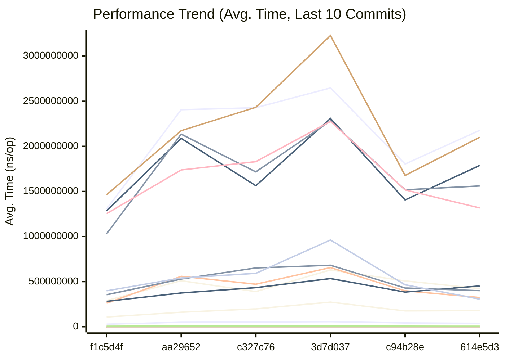
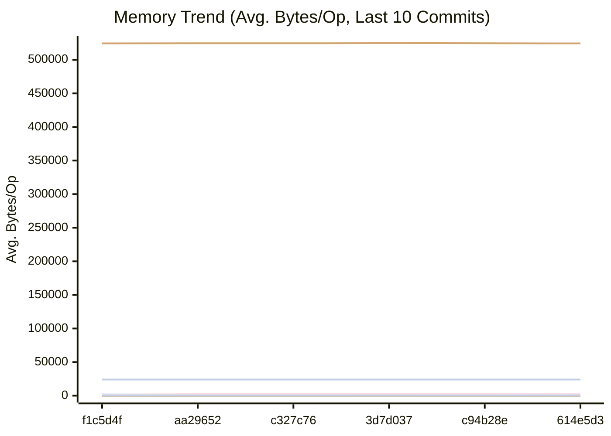
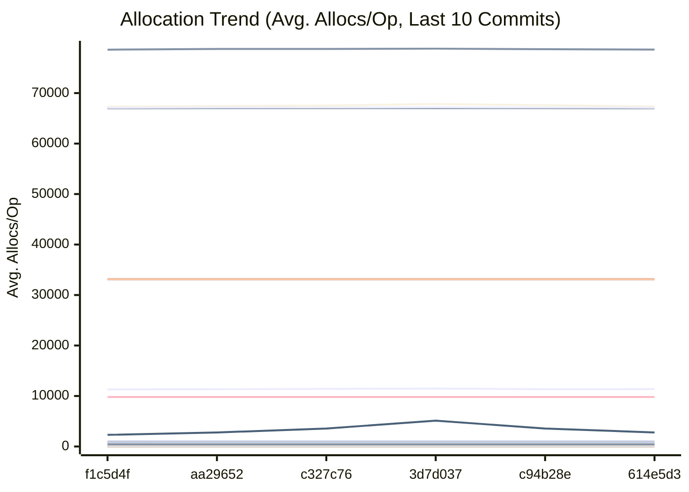

# Performance Benchmarks

This document tracks benchmark performance across commits. The section between
the `BENCHMARK_RESULTS_START/END` markers is auto-generated by the pre-commit
hook; the crypto/OPRF section below is manually maintained.

## How to Read This Document

- **Comparison with previous commit**: `benchstat` output comparing the current
  commit against the previous one. Three tables: **sec/op** (time per operation),
  **B/op** (bytes allocated), **allocs/op** (heap allocations). In each table,
  **lower is better**. `+X%` = regression, `-X%` = improvement, `~` = no
  statistically significant change. `p` is the p-value (p < 0.05 = significant).
- **Latest Benchmark Results**: Single-snapshot table of the current commit's
  averages. Lower values are better across all three columns.
- **Performance Trend plot**: X-axis = commit SHA (left = older, right = newer).
  Y-axis = avg time in ns/op. **Lower lines = faster.** Downward trends are
  improvements; upward spikes are regressions.
- **Memory Trend plot**: Same axes, but Y-axis = avg bytes allocated per op.
  **Lower lines = less memory.** Drops indicate allocation reductions.
- **Allocation Trend plot**: Same axes, but Y-axis = avg heap allocations per op.
  **Lower lines = fewer allocations.** Fewer allocs = less GC pressure.

<!-- BENCHMARK_RESULTS_START -->
## Performance

This section is automatically updated by the pre-commit hook (via .github/scripts/update_readme_with_benchmarks.sh).

### Comparison with previous commit

Each table compares the previous commit (left) to the current commit (right).
**Lower is better** in all three tables. `+X%` = regression, `-X%` = improvement,
`~` = no statistically significant change (p >= 0.05).

- **sec/op**: Time per operation (nanoseconds). Measures raw speed.
- **B/op**: Bytes allocated on the heap per operation. Measures memory usage.
- **allocs/op**: Number of heap allocations per operation. Measures GC pressure.

```
                                      │ /tmp/old_bench_filtered.txt │      /tmp/new_bench_filtered.txt       │
                                      │           sec/op            │    sec/op      vs base                 │
CrushOriginal-8                                        795.2n ± ∞ ¹   4070.0n ± ∞ ¹        ~ (p=1.000 n=1) ²
Placement-8                                            8.100µ ± ∞ ¹   27.755µ ± ∞ ¹        ~ (p=1.000 n=1) ²
PlacementDomainSpread-8                                8.934µ ± ∞ ¹   18.491µ ± ∞ ¹        ~ (p=1.000 n=1) ²
CrushOptimized-8                                       465.3n ± ∞ ¹   1105.0n ± ∞ ¹        ~ (p=1.000 n=1) ²
LoadGlobalConfig-8                                     18.55µ ± ∞ ¹    33.10µ ± ∞ ¹        ~ (p=1.000 n=1) ²
HashBytes/1MiB-8                                       5.880m ± ∞ ¹    7.763m ± ∞ ¹        ~ (p=1.000 n=1) ²
HashBytes/64MiB-8                                      373.0m ± ∞ ¹    500.2m ± ∞ ¹        ~ (p=1.000 n=1) ²
HashBytes/256MiB-8                                      1.293 ± ∞ ¹     1.912 ± ∞ ¹        ~ (p=1.000 n=1) ²
HashFile/1MiB-8                                        5.169m ± ∞ ¹    7.926m ± ∞ ¹        ~ (p=1.000 n=1) ²
HashFile/64MiB-8                                       407.2m ± ∞ ¹    631.8m ± ∞ ¹        ~ (p=1.000 n=1) ²
HashFile/256MiB-8                                       1.432 ± ∞ ¹     2.277 ± ∞ ¹        ~ (p=1.000 n=1) ²
PadString-8                                            88.08n ± ∞ ¹   253.50n ± ∞ ¹        ~ (p=1.000 n=1) ²
SanitizeLog/Safe-8                                     464.4n ± ∞ ¹    721.4n ± ∞ ¹        ~ (p=1.000 n=1) ²
SanitizeLog/Unsafe-8                                   1.310µ ± ∞ ¹    2.660µ ± ∞ ¹        ~ (p=1.000 n=1) ²
AWSChunkedReaderSigned-8                               786.0µ ± ∞ ¹   1067.7µ ± ∞ ¹        ~ (p=1.000 n=1) ²
AWSChunkedReaderUnsigned-8                             977.6µ ± ∞ ¹   1009.9µ ± ∞ ¹        ~ (p=1.000 n=1) ²
LastModifiedHeader_AppendFormat-8                      542.1n ± ∞ ¹    691.7n ± ∞ ¹        ~ (p=1.000 n=1) ²
LastModifiedHeader_Format-8                            574.1n ± ∞ ¹    945.4n ± ∞ ¹        ~ (p=1.000 n=1) ²
FormatListObjectsV2XML_AppendFormat-8                  1.275m ± ∞ ¹    2.945m ± ∞ ¹        ~ (p=1.000 n=1) ²
FormatListObjectsV2XML_OldFormat-8                     871.0µ ± ∞ ¹   1231.7µ ± ∞ ¹        ~ (p=1.000 n=1) ²
CheckMetricsAndSwap-8                                  17.16n ± ∞ ¹    18.77n ± ∞ ¹        ~ (p=1.000 n=1) ²
IndexSearch-8                                          4.770n ± ∞ ¹    4.593n ± ∞ ¹        ~ (p=1.000 n=1) ²
IndexDirectTracking-8                                 0.7180n ± ∞ ¹   1.0040n ± ∞ ¹        ~ (p=1.000 n=1) ²
LocalWrite/1MiB-8                                      1.116m ± ∞ ¹    1.102m ± ∞ ¹        ~ (p=1.000 n=1) ²
LocalWrite/64MiB-8                                     61.14m ± ∞ ¹    51.24m ± ∞ ¹        ~ (p=1.000 n=1) ²
LocalWrite/256MiB-8                                    185.7m ± ∞ ¹    237.7m ± ∞ ¹        ~ (p=1.000 n=1) ²
ReadVerify/1MiB-8                                      8.481m ± ∞ ¹    7.559m ± ∞ ¹        ~ (p=1.000 n=1) ²
ReadVerify/64MiB-8                                     518.4m ± ∞ ¹    545.0m ± ∞ ¹        ~ (p=1.000 n=1) ²
ReadVerify/256MiB-8                                     1.782 ± ∞ ¹     2.200 ± ∞ ¹        ~ (p=1.000 n=1) ²
TrustedRead/1MiB-8                                     7.358m ± ∞ ¹    9.625m ± ∞ ¹        ~ (p=1.000 n=1) ²
TrustedRead/64MiB-8                                    464.7m ± ∞ ¹    569.9m ± ∞ ¹        ~ (p=1.000 n=1) ²
TrustedRead/256MiB-8                                    1.481 ± ∞ ¹     2.120 ± ∞ ¹        ~ (p=1.000 n=1) ²
S3PutSpool/1MiB-8                                      6.499m ± ∞ ¹    9.328m ± ∞ ¹        ~ (p=1.000 n=1) ²
S3PutSpool/64MiB-8                                     433.8m ± ∞ ¹    576.1m ± ∞ ¹        ~ (p=1.000 n=1) ²
S3PutSpool/256MiB-8                                     1.869 ± ∞ ¹     2.351 ± ∞ ¹        ~ (p=1.000 n=1) ²
geomean                                                589.7µ          882.2µ        +49.59%
¹ need >= 6 samples for confidence interval at level 0.95
² need >= 4 samples to detect a difference at alpha level 0.05

                                      │ /tmp/old_bench_filtered.txt │      /tmp/new_bench_filtered.txt      │
                                      │            B/op             │     B/op       vs base                │
CrushOriginal-8                                         164.0 ± ∞ ¹     164.0 ± ∞ ¹       ~ (p=1.000 n=1) ²
Placement-8                                             352.0 ± ∞ ¹     352.0 ± ∞ ¹       ~ (p=1.000 n=1) ²
PlacementDomainSpread-8                                 352.0 ± ∞ ¹     352.0 ± ∞ ¹       ~ (p=1.000 n=1) ²
CrushOptimized-8                                        0.000 ± ∞ ¹     0.000 ± ∞ ¹       ~ (p=1.000 n=1) ²
LoadGlobalConfig-8                                    1.930Ki ± ∞ ¹   1.930Ki ± ∞ ¹       ~ (p=1.000 n=1) ²
HashBytes/1MiB-8                                        64.00 ± ∞ ¹     64.00 ± ∞ ¹       ~ (p=1.000 n=1) ²
HashBytes/64MiB-8                                       64.00 ± ∞ ¹     64.00 ± ∞ ¹       ~ (p=1.000 n=1) ²
HashBytes/256MiB-8                                      64.00 ± ∞ ¹     64.00 ± ∞ ¹       ~ (p=1.000 n=1) ²
HashFile/1MiB-8                                       32.35Ki ± ∞ ¹   32.35Ki ± ∞ ¹       ~ (p=1.000 n=1) ²
HashFile/64MiB-8                                      32.35Ki ± ∞ ¹   32.35Ki ± ∞ ¹       ~ (p=1.000 n=1) ²
HashFile/256MiB-8                                     32.35Ki ± ∞ ¹   32.35Ki ± ∞ ¹       ~ (p=1.000 n=1) ²
PadString-8                                             64.00 ± ∞ ¹     64.00 ± ∞ ¹       ~ (p=1.000 n=1) ²
SanitizeLog/Safe-8                                      0.000 ± ∞ ¹     0.000 ± ∞ ¹       ~ (p=1.000 n=1) ²
SanitizeLog/Unsafe-8                                    704.0 ± ∞ ¹     704.0 ± ∞ ¹       ~ (p=1.000 n=1) ²
AWSChunkedReaderSigned-8                              11.08Ki ± ∞ ¹   11.12Ki ± ∞ ¹       ~ (p=1.000 n=1) ³
AWSChunkedReaderUnsigned-8                            76.93Ki ± ∞ ¹   76.96Ki ± ∞ ¹       ~ (p=1.000 n=1) ³
LastModifiedHeader_AppendFormat-8                       0.000 ± ∞ ¹     0.000 ± ∞ ¹       ~ (p=1.000 n=1) ²
LastModifiedHeader_Format-8                             32.00 ± ∞ ¹     32.00 ± ∞ ¹       ~ (p=1.000 n=1) ²
FormatListObjectsV2XML_AppendFormat-8                 512.2Ki ± ∞ ¹   512.3Ki ± ∞ ¹       ~ (p=1.000 n=1) ³
FormatListObjectsV2XML_OldFormat-8                    23.44Ki ± ∞ ¹   23.44Ki ± ∞ ¹       ~ (p=1.000 n=1) ²
CheckMetricsAndSwap-8                                   0.000 ± ∞ ¹     0.000 ± ∞ ¹       ~ (p=1.000 n=1) ²
IndexSearch-8                                           0.000 ± ∞ ¹     0.000 ± ∞ ¹       ~ (p=1.000 n=1) ²
IndexDirectTracking-8                                   0.000 ± ∞ ¹     0.000 ± ∞ ¹       ~ (p=1.000 n=1) ²
LocalWrite/1MiB-8                                     65.47Ki ± ∞ ¹   65.48Ki ± ∞ ¹       ~ (p=1.000 n=1) ³
LocalWrite/64MiB-8                                    65.51Ki ± ∞ ¹   65.58Ki ± ∞ ¹       ~ (p=1.000 n=1) ³
LocalWrite/256MiB-8                                   65.98Ki ± ∞ ¹   65.99Ki ± ∞ ¹       ~ (p=1.000 n=1) ³
ReadVerify/1MiB-8                                       490.0 ± ∞ ¹     440.0 ± ∞ ¹       ~ (p=1.000 n=1) ³
ReadVerify/64MiB-8                                    3.474Ki ± ∞ ¹   5.000Ki ± ∞ ¹       ~ (p=1.000 n=1) ³
ReadVerify/256MiB-8                                   9.578Ki ± ∞ ¹   9.578Ki ± ∞ ¹       ~ (p=1.000 n=1) ²
TrustedRead/1MiB-8                                      800.0 ± ∞ ¹     800.0 ± ∞ ¹       ~ (p=1.000 n=1) ²
TrustedRead/64MiB-8                                     800.0 ± ∞ ¹     800.0 ± ∞ ¹       ~ (p=1.000 n=1) ²
TrustedRead/256MiB-8                                    800.0 ± ∞ ¹     800.0 ± ∞ ¹       ~ (p=1.000 n=1) ²
S3PutSpool/1MiB-8                                       447.0 ± ∞ ¹     447.0 ± ∞ ¹       ~ (p=1.000 n=1) ²
S3PutSpool/64MiB-8                                      448.0 ± ∞ ¹     448.0 ± ∞ ¹       ~ (p=1.000 n=1) ²
S3PutSpool/256MiB-8                                     448.0 ± ∞ ¹     448.0 ± ∞ ¹       ~ (p=1.000 n=1) ²
geomean                                                           ⁴                  +0.75%               ⁴
¹ need >= 6 samples for confidence interval at level 0.95
² all samples are equal
³ need >= 4 samples to detect a difference at alpha level 0.05
⁴ summaries must be >0 to compute geomean

                                      │ /tmp/old_bench_filtered.txt │     /tmp/new_bench_filtered.txt      │
                                      │          allocs/op          │  allocs/op    vs base                │
CrushOriginal-8                                         3.000 ± ∞ ¹    3.000 ± ∞ ¹       ~ (p=1.000 n=1) ²
Placement-8                                             6.000 ± ∞ ¹    6.000 ± ∞ ¹       ~ (p=1.000 n=1) ²
PlacementDomainSpread-8                                 6.000 ± ∞ ¹    6.000 ± ∞ ¹       ~ (p=1.000 n=1) ²
CrushOptimized-8                                        0.000 ± ∞ ¹    0.000 ± ∞ ¹       ~ (p=1.000 n=1) ²
LoadGlobalConfig-8                                      58.00 ± ∞ ¹    58.00 ± ∞ ¹       ~ (p=1.000 n=1) ²
HashBytes/1MiB-8                                        1.000 ± ∞ ¹    1.000 ± ∞ ¹       ~ (p=1.000 n=1) ²
HashBytes/64MiB-8                                       1.000 ± ∞ ¹    1.000 ± ∞ ¹       ~ (p=1.000 n=1) ²
HashBytes/256MiB-8                                      1.000 ± ∞ ¹    1.000 ± ∞ ¹       ~ (p=1.000 n=1) ²
HashFile/1MiB-8                                         6.000 ± ∞ ¹    6.000 ± ∞ ¹       ~ (p=1.000 n=1) ²
HashFile/64MiB-8                                        6.000 ± ∞ ¹    6.000 ± ∞ ¹       ~ (p=1.000 n=1) ²
HashFile/256MiB-8                                       6.000 ± ∞ ¹    6.000 ± ∞ ¹       ~ (p=1.000 n=1) ²
PadString-8                                             1.000 ± ∞ ¹    1.000 ± ∞ ¹       ~ (p=1.000 n=1) ²
SanitizeLog/Safe-8                                      0.000 ± ∞ ¹    0.000 ± ∞ ¹       ~ (p=1.000 n=1) ²
SanitizeLog/Unsafe-8                                    1.000 ± ∞ ¹    1.000 ± ∞ ¹       ~ (p=1.000 n=1) ²
AWSChunkedReaderSigned-8                                80.00 ± ∞ ¹    80.00 ± ∞ ¹       ~ (p=1.000 n=1) ²
AWSChunkedReaderUnsigned-8                              15.00 ± ∞ ¹    15.00 ± ∞ ¹       ~ (p=1.000 n=1) ²
LastModifiedHeader_AppendFormat-8                       0.000 ± ∞ ¹    0.000 ± ∞ ¹       ~ (p=1.000 n=1) ²
LastModifiedHeader_Format-8                             1.000 ± ∞ ¹    1.000 ± ∞ ¹       ~ (p=1.000 n=1) ²
FormatListObjectsV2XML_AppendFormat-8                   16.00 ± ∞ ¹    16.00 ± ∞ ¹       ~ (p=1.000 n=1) ²
FormatListObjectsV2XML_OldFormat-8                     1.000k ± ∞ ¹   1.000k ± ∞ ¹       ~ (p=1.000 n=1) ²
CheckMetricsAndSwap-8                                   0.000 ± ∞ ¹    0.000 ± ∞ ¹       ~ (p=1.000 n=1) ²
IndexSearch-8                                           0.000 ± ∞ ¹    0.000 ± ∞ ¹       ~ (p=1.000 n=1) ²
IndexDirectTracking-8                                   0.000 ± ∞ ¹    0.000 ± ∞ ¹       ~ (p=1.000 n=1) ²
LocalWrite/1MiB-8                                       19.00 ± ∞ ¹    18.00 ± ∞ ¹       ~ (p=1.000 n=1) ³
LocalWrite/64MiB-8                                      18.00 ± ∞ ¹    19.00 ± ∞ ¹       ~ (p=1.000 n=1) ³
LocalWrite/256MiB-8                                     21.00 ± ∞ ¹    21.00 ± ∞ ¹       ~ (p=1.000 n=1) ²
ReadVerify/1MiB-8                                       6.000 ± ∞ ¹    6.000 ± ∞ ¹       ~ (p=1.000 n=1) ²
ReadVerify/64MiB-8                                      7.000 ± ∞ ¹    8.000 ± ∞ ¹       ~ (p=1.000 n=1) ³
ReadVerify/256MiB-8                                     10.00 ± ∞ ¹    10.00 ± ∞ ¹       ~ (p=1.000 n=1) ²
TrustedRead/1MiB-8                                      11.00 ± ∞ ¹    11.00 ± ∞ ¹       ~ (p=1.000 n=1) ²
TrustedRead/64MiB-8                                     11.00 ± ∞ ¹    11.00 ± ∞ ¹       ~ (p=1.000 n=1) ²
TrustedRead/256MiB-8                                    11.00 ± ∞ ¹    11.00 ± ∞ ¹       ~ (p=1.000 n=1) ²
S3PutSpool/1MiB-8                                       10.00 ± ∞ ¹    10.00 ± ∞ ¹       ~ (p=1.000 n=1) ²
S3PutSpool/64MiB-8                                      10.00 ± ∞ ¹    10.00 ± ∞ ¹       ~ (p=1.000 n=1) ²
S3PutSpool/256MiB-8                                     10.00 ± ∞ ¹    10.00 ± ∞ ¹       ~ (p=1.000 n=1) ²
geomean                                                           ⁴                 +0.38%               ⁴
¹ need >= 6 samples for confidence interval at level 0.95
² all samples are equal
³ need >= 4 samples to detect a difference at alpha level 0.05
⁴ summaries must be >0 to compute geomean

                           │ /tmp/old_bench_filtered.txt │      /tmp/new_bench_filtered.txt       │
                           │             B/s             │      B/s       vs base                 │
HashBytes/1MiB-8                           170.1Mi ± ∞ ¹   128.8Mi ± ∞ ¹        ~ (p=1.000 n=1) ²
HashBytes/64MiB-8                          171.6Mi ± ∞ ¹   127.9Mi ± ∞ ¹        ~ (p=1.000 n=1) ²
HashBytes/256MiB-8                         198.0Mi ± ∞ ¹   133.9Mi ± ∞ ¹        ~ (p=1.000 n=1) ²
HashFile/1MiB-8                            193.5Mi ± ∞ ¹   126.2Mi ± ∞ ¹        ~ (p=1.000 n=1) ²
HashFile/64MiB-8                           157.2Mi ± ∞ ¹   101.3Mi ± ∞ ¹        ~ (p=1.000 n=1) ²
HashFile/256MiB-8                          178.7Mi ± ∞ ¹   112.4Mi ± ∞ ¹        ~ (p=1.000 n=1) ²
AWSChunkedReaderSigned-8                   80.76Mi ± ∞ ¹   59.45Mi ± ∞ ¹        ~ (p=1.000 n=1) ²
AWSChunkedReaderUnsigned-8                 64.94Mi ± ∞ ¹   62.86Mi ± ∞ ¹        ~ (p=1.000 n=1) ²
LocalWrite/1MiB-8                          896.0Mi ± ∞ ¹   907.5Mi ± ∞ ¹        ~ (p=1.000 n=1) ²
LocalWrite/64MiB-8                         1.022Gi ± ∞ ¹   1.220Gi ± ∞ ¹        ~ (p=1.000 n=1) ²
LocalWrite/256MiB-8                        1.346Gi ± ∞ ¹   1.052Gi ± ∞ ¹        ~ (p=1.000 n=1) ²
ReadVerify/1MiB-8                          117.9Mi ± ∞ ¹   132.3Mi ± ∞ ¹        ~ (p=1.000 n=1) ²
ReadVerify/64MiB-8                         123.5Mi ± ∞ ¹   117.4Mi ± ∞ ¹        ~ (p=1.000 n=1) ²
ReadVerify/256MiB-8                        143.7Mi ± ∞ ¹   116.3Mi ± ∞ ¹        ~ (p=1.000 n=1) ²
TrustedRead/1MiB-8                         135.9Mi ± ∞ ¹   103.9Mi ± ∞ ¹        ~ (p=1.000 n=1) ²
TrustedRead/64MiB-8                        137.7Mi ± ∞ ¹   112.3Mi ± ∞ ¹        ~ (p=1.000 n=1) ²
TrustedRead/256MiB-8                       172.9Mi ± ∞ ¹   120.7Mi ± ∞ ¹        ~ (p=1.000 n=1) ²
S3PutSpool/1MiB-8                          153.9Mi ± ∞ ¹   107.2Mi ± ∞ ¹        ~ (p=1.000 n=1) ²
S3PutSpool/64MiB-8                         147.5Mi ± ∞ ¹   111.1Mi ± ∞ ¹        ~ (p=1.000 n=1) ²
S3PutSpool/256MiB-8                        137.0Mi ± ∞ ¹   108.9Mi ± ∞ ¹        ~ (p=1.000 n=1) ²
geomean                                    191.7Mi         152.7Mi        -20.31%
¹ need >= 6 samples for confidence interval at level 0.95
² need >= 4 samples to detect a difference at alpha level 0.05
```

### Latest Benchmark Results

Single-snapshot of the current commit's averages. **Lower is better** across all
three columns: time (speed), bytes (memory), allocs (GC pressure).


| Benchmark | Avg. Time/Op | Avg. Bytes/Op | Avg. Allocs/Op |
|-----------|--------------|---------------|----------------|
| BenchmarkAWSChunkedReaderSigned-8 | 1067684.00 ns/op | 62.34 B/op | 11392.00 allocs/op |
| BenchmarkAWSChunkedReaderUnsigned-8 | 1009938.00 ns/op | 65.91 B/op | 78804.00 allocs/op |
| BenchmarkCheckMetricsAndSwap-8 | 18.77 ns/op | 0.00 B/op | 0.00 allocs/op |
| BenchmarkCrushOptimized-8 | 1105.00 ns/op | 0.00 B/op | 0.00 allocs/op |
| BenchmarkCrushOriginal-8 | 4070.00 ns/op | 164.00 B/op | 3.00 allocs/op |
| BenchmarkFormatListObjectsV2XML_AppendFormat-8 | 2945065.00 ns/op | 524618.00 B/op | 16.00 allocs/op |
| BenchmarkFormatListObjectsV2XML_OldFormat-8 | 1231705.00 ns/op | 24000.00 B/op | 1000.00 allocs/op |
| BenchmarkHashBytes/1MiB-8 | 7762528.00 ns/op | 135.08 B/op | 64.00 allocs/op |
| BenchmarkHashBytes/256MiB-8 | 1911922639.00 ns/op | 140.40 B/op | 64.00 allocs/op |
| BenchmarkHashBytes/64MiB-8 | 500199690.00 ns/op | 134.16 B/op | 64.00 allocs/op |
| BenchmarkHashFile/1MiB-8 | 7925836.00 ns/op | 132.30 B/op | 33128.00 allocs/op |
| BenchmarkHashFile/256MiB-8 | 2277372507.00 ns/op | 117.87 B/op | 33128.00 allocs/op |
| BenchmarkHashFile/64MiB-8 | 631755332.00 ns/op | 106.23 B/op | 33128.00 allocs/op |
| BenchmarkIndexDirectTracking-8 | 1.00 ns/op | 0.00 B/op | 0.00 allocs/op |
| BenchmarkIndexSearch-8 | 4.59 ns/op | 0.00 B/op | 0.00 allocs/op |
| BenchmarkLastModifiedHeader_AppendFormat-8 | 691.70 ns/op | 0.00 B/op | 0.00 allocs/op |
| BenchmarkLastModifiedHeader_Format-8 | 945.40 ns/op | 32.00 B/op | 1.00 allocs/op |
| BenchmarkLoadGlobalConfig-8 | 33096.00 ns/op | 1976.00 B/op | 58.00 allocs/op |
| BenchmarkLocalWrite/1MiB-8 | 1101952.00 ns/op | 951.56 B/op | 67048.00 allocs/op |
| BenchmarkLocalWrite/256MiB-8 | 237694458.00 ns/op | 1129.33 B/op | 67569.00 allocs/op |
| BenchmarkLocalWrite/64MiB-8 | 51244002.00 ns/op | 1309.59 B/op | 67158.00 allocs/op |
| BenchmarkPadString-8 | 253.50 ns/op | 64.00 B/op | 1.00 allocs/op |
| BenchmarkPlacement-8 | 27755.00 ns/op | 352.00 B/op | 6.00 allocs/op |
| BenchmarkPlacementDomainSpread-8 | 18491.00 ns/op | 352.00 B/op | 6.00 allocs/op |
| BenchmarkReadVerify/1MiB-8 | 7559053.00 ns/op | 138.72 B/op | 440.00 allocs/op |
| BenchmarkReadVerify/256MiB-8 | 2200381287.00 ns/op | 121.99 B/op | 9808.00 allocs/op |
| BenchmarkReadVerify/64MiB-8 | 545034562.00 ns/op | 123.13 B/op | 5120.00 allocs/op |
| BenchmarkS3PutSpool/1MiB-8 | 9327955.00 ns/op | 112.41 B/op | 447.00 allocs/op |
| BenchmarkS3PutSpool/256MiB-8 | 2351294741.00 ns/op | 114.16 B/op | 448.00 allocs/op |
| BenchmarkS3PutSpool/64MiB-8 | 576056595.00 ns/op | 116.50 B/op | 448.00 allocs/op |
| BenchmarkSanitizeLog/Safe-8 | 721.40 ns/op | 0.00 B/op | 0.00 allocs/op |
| BenchmarkSanitizeLog/Unsafe-8 | 2660.00 ns/op | 704.00 B/op | 1.00 allocs/op |
| BenchmarkTrustedRead/1MiB-8 | 9625274.00 ns/op | 108.94 B/op | 800.00 allocs/op |
| BenchmarkTrustedRead/256MiB-8 | 2120164443.00 ns/op | 126.61 B/op | 800.00 allocs/op |
| BenchmarkTrustedRead/64MiB-8 | 569925858.00 ns/op | 117.75 B/op | 800.00 allocs/op |


### Performance History

**Legend**

| Color | Benchmark | Description |
|---|---|---|
| 🟢 | CheckMetricsAndSwap | Evaluation of system metrics (CPU/Mem) and mode switching logic |
| 🟤 | CrushOriginal | Original Sage Weil's CRUSH placement algorithm using reflection and float math |
| ⚪ | CrushOptimized | Performance-tuned CRUSH-lite placement algorithm using bitwise shifts and integer math (Rule 19) |
| 🔵 | IndexDirectTracking | Accessing current replication mode via direct slice index (O(1)) |
| 🔴 | IndexSearch | Searching for current replication mode in the order slice using `slices.Index` |
| 🟠 | LoadGlobalConfig | Parsing and loading the `[global]` section from the INI configuration |
| 🟣 | PadString | Padding strings with null characters to a fixed protocol length |
| 🟡 | ParseReplicationOrder | Parsing the CSV-formatted replication order string into an integer slice |

#### Time per Operation (ns/op)

X-axis: commit SHA (left = older, right = newer). Y-axis: avg time in ns/op.
**Lower lines = faster code.** Downward trends are improvements; upward spikes
are regressions to investigate.


```mermaid
xychart-beta
    title "Performance Trend (Avg. Time, Last 10 Commits)"
    x-axis "Commit"
    y-axis "Avg. Time (ns/op)"
    x-axis [f1c5d4f,aa29652,c327c76,3d7d037,c94b28e,614e5d3]
    line "AWSChunkedReaderSigned" [606537,1043223,973548,1455699,680259,833482,953309,627888,785988,1067684]
    line "AWSChunkedReaderUnsigned" [615450,1351997,1054695,1128789,889133,730853,858757,790951,977586,1009938]
    line "CheckMetricsAndSwap" [9,18,19,38,17,10,13,15,17,19]
    line "CrushOptimized" [489,593,643,1042,685,798,468,532,465,1105]
    line "CrushOriginal" [581,856,1307,2029,855,1268,698,834,795,4070]
    line "FormatListObjectsV2XML_AppendFormat" [962696,2255056,1630321,4600271,1782191,1061116,1008647,1406590,1275364,2945065]
    line "FormatListObjectsV2XML_OldFormat" [488621,1103444,888288,1357791,907084,473930,533866,813796,870950,1231705]
    line "HashBytes/1MiB" [5123782,7575501,6664907,7640824,5383828,7555000,5598473,4921734,5879995,7762528]
    line "HashBytes/256MiB" [1284521850,2087994619,1563281181,2308810918,1405443275,1788061102,1074265335,1131266592,1293022873,1911922639]
    line "HashBytes/64MiB" [289844742,509860327,389285110,629622654,507641214,422715939,338237103,382860244,372987075,500199690]
    line "HashFile/1MiB" [4299477,8227082,7078150,8690518,5618671,6533318,4172609,6261739,5169082,7925836]
    line "HashFile/256MiB" [1030231274,2135226775,1716532942,2281655194,1518211227,1560936348,1431277931,1624300639,1432425639,2277372507]
    line "HashFile/64MiB" [260223898,558613671,471436906,655531538,397822488,323633746,347435470,383484634,407202955,631755332]
    line "IndexDirectTracking" [0,1,1,1,1,1,1,1,1,1]
    line "IndexSearch" [4,5,4,5,5,4,4,4,5,5]
    line "LastModifiedHeader_AppendFormat" [319,610,638,744,453,385,315,376,542,692]
    line "LastModifiedHeader_Format" [406,812,695,1046,635,526,444,488,574,945]
    line "LoadGlobalConfig" [12907,20187,22438,33068,21404,21459,15616,14400,18548,33096]
    line "LocalWrite/1MiB" [612314,1771010,1395534,1103659,782921,673496,973167,928144,1116026,1101952]
    line "LocalWrite/256MiB" [107404943,160392504,197917420,272351029,175219427,179514948,167743774,160436947,185677716,237694458]
    line "LocalWrite/64MiB" [28308935,49166059,52341255,56218123,42014368,37648886,40720206,46095057,61144515,51244002]
    line "PadString" [61,211,165,205,86,67,85,80,88,254]
    line "ParseReplicationOrder_NoPrealloc" [350,349,357,354,345,225,229,165,232,234]
    line "ParseReplicationOrder_Prealloc" [229,231,237,234,229,108,107,80,110,109]
    line "Placement" [6933,8102,10527,25580,11321,10377,7200,8789,8100,27755]
    line "PlacementDomainSpread" [8426,8684,11049,18437,11792,9468,8229,9655,8934,18491]
    line "ReadVerify/1MiB" [3448579,5630820,6689386,12183182,5670392,7713170,4757418,5869903,8481402,7559053]
    line "ReadVerify/256MiB" [1253185341,1738129398,1830120119,2276631953,1517577657,1316685724,1223335569,2116170500,1781612989,2200381287]
    line "ReadVerify/64MiB" [281005831,374198113,432795151,533889680,383828668,451931212,213251291,512922822,518387680,545034562]
    line "S3PutSpool/1MiB" [6430516,9117398,9491833,12330195,7822144,8408058,8591213,6157166,6498512,9327955]
    line "S3PutSpool/256MiB" [1304364707,2406472426,2428268969,2647654672,1803968295,2177507350,1816522977,1227464198,1869122530,2351294741]
    line "S3PutSpool/64MiB" [354128133,528507413,651666227,681227498,429216770,399626051,367182715,399702230,433842837,576056595]
    line "SanitizeLog/Safe" [316,623,639,645,428,331,547,453,464,721]
    line "SanitizeLog/Unsafe" [1076,2180,2105,3077,1405,1260,1471,1234,1310,2660]
    line "TrustedRead/1MiB" [4741810,8367879,7463250,9671314,5650216,4830214,4254033,7751297,7357692,9625274]
    line "TrustedRead/256MiB" [1462605918,2173767229,2433008029,3228071339,1677679418,2100324369,1186508654,1267006234,1480761171,2120164443]
    line "TrustedRead/64MiB" [397868130,540269082,591536062,961059323,465018339,305338723,298647819,415837736,464687610,569925858]
```

#### Memory per Operation (B/op)

X-axis: commit SHA. Y-axis: avg bytes allocated per op.
**Lower lines = less memory.** Drops indicate allocation reductions.


```mermaid
xychart-beta
    title "Memory Trend (Avg. Bytes/Op, Last 10 Commits)"
    x-axis "Commit"
    y-axis "Avg. Bytes/Op"
    x-axis [f1c5d4f,aa29652,c327c76,3d7d037,c94b28e,614e5d3]
    line "AWSChunkedReaderSigned" [110,64,68,46,98,80,70,106,85,62]
    line "AWSChunkedReaderUnsigned" [108,49,63,59,75,91,78,84,68,66]
    line "CheckMetricsAndSwap" [0,0,0,0,0,0,0,0,0,0]
    line "CrushOptimized" [0,0,0,0,0,0,0,0,0,0]
    line "CrushOriginal" [164,164,164,164,164,164,164,164,164,164]
    line "FormatListObjectsV2XML_AppendFormat" [524460,524580,524552,524871,524558,524474,524487,524493,524491,524618]
    line "FormatListObjectsV2XML_OldFormat" [24000,24000,24000,24000,24000,24000,24000,24000,24000,24000]
    line "HashBytes/1MiB" [205,138,157,137,195,139,187,213,178,135]
    line "HashBytes/256MiB" [209,129,172,116,191,150,250,237,208,140]
    line "HashBytes/64MiB" [232,132,172,107,132,159,198,175,180,134]
    line "HashFile/1MiB" [244,127,148,121,187,160,251,167,203,132]
    line "HashFile/256MiB" [261,126,156,118,177,172,188,165,187,118]
    line "HashFile/64MiB" [258,120,142,102,169,207,193,175,165,106]
    line "IndexDirectTracking" [0,0,0,0,0,0,0,0,0,0]
    line "IndexSearch" [0,0,0,0,0,0,0,0,0,0]
    line "LastModifiedHeader_AppendFormat" [0,0,0,0,0,0,0,0,0,0]
    line "LastModifiedHeader_Format" [32,32,32,32,32,32,32,32,32,32]
    line "LoadGlobalConfig" [1976,1976,1976,1976,1976,1976,1976,1976,1976,1976]
    line "LocalWrite/1MiB" [1712,592,751,950,1339,1557,1077,1130,940,952]
    line "LocalWrite/256MiB" [2499,1674,1356,986,1532,1495,1600,1673,1446,1129]
    line "LocalWrite/64MiB" [2371,1365,1282,1194,1597,1782,1648,1456,1098,1310]
    line "PadString" [64,64,64,64,64,64,64,64,64,64]
    line "ParseReplicationOrder_NoPrealloc" [408,408,408,408,408,248,248,248,248,248]
    line "ParseReplicationOrder_Prealloc" [240,240,240,240,240,80,80,80,80,80]
    line "Placement" [352,352,352,352,352,352,352,352,352,352]
    line "PlacementDomainSpread" [352,352,352,352,352,352,352,352,352,352]
    line "ReadVerify/1MiB" [304,186,157,86,185,136,220,179,124,139]
    line "ReadVerify/256MiB" [214,154,147,118,177,204,219,127,151,122]
    line "ReadVerify/64MiB" [239,179,155,126,175,148,315,131,129,123]
    line "S3PutSpool/1MiB" [163,115,110,85,134,125,122,170,161,112]
    line "S3PutSpool/256MiB" [206,112,111,101,149,123,148,219,144,114]
    line "S3PutSpool/64MiB" [190,127,103,99,156,168,183,168,155,116]
    line "SanitizeLog/Safe" [0,0,0,0,0,0,0,0,0,0]
    line "SanitizeLog/Unsafe" [704,704,704,704,704,704,704,704,704,704]
    line "TrustedRead/1MiB" [221,125,140,108,186,217,246,135,143,109]
    line "TrustedRead/256MiB" [184,123,110,83,160,128,226,212,181,127]
    line "TrustedRead/64MiB" [169,124,113,70,144,220,225,161,144,118]
```

#### Allocations per Operation (allocs/op)

X-axis: commit SHA. Y-axis: avg heap allocations per op.
**Lower lines = fewer allocations.** Fewer allocs = less GC pressure.


```mermaid
xychart-beta
    title "Allocation Trend (Avg. Allocs/Op, Last 10 Commits)"
    x-axis "Commit"
    y-axis "Avg. Allocs/Op"
    x-axis [f1c5d4f,aa29652,c327c76,3d7d037,c94b28e,614e5d3]
    line "AWSChunkedReaderSigned" [11309,11357,11392,11480,11346,11370,11345,11319,11351,11392]
    line "AWSChunkedReaderUnsigned" [78603,78751,78742,78802,78690,78621,78704,78640,78777,78804]
    line "CheckMetricsAndSwap" [0,0,0,0,0,0,0,0,0,0]
    line "CrushOptimized" [0,0,0,0,0,0,0,0,0,0]
    line "CrushOriginal" [3,3,3,3,3,3,3,3,3,3]
    line "FormatListObjectsV2XML_AppendFormat" [16,16,16,16,16,16,16,16,16,16]
    line "FormatListObjectsV2XML_OldFormat" [1000,1000,1000,1000,1000,1000,1000,1000,1000,1000]
    line "HashBytes/1MiB" [64,64,64,64,64,64,64,64,64,64]
    line "HashBytes/256MiB" [64,64,64,64,64,64,64,64,64,64]
    line "HashBytes/64MiB" [64,64,64,64,64,64,64,64,64,64]
    line "HashFile/1MiB" [33128,33128,33128,33128,33128,33128,33128,33128,33128,33128]
    line "HashFile/256MiB" [33128,33128,33128,33128,33128,33128,33128,33128,33128,33128]
    line "HashFile/64MiB" [33128,33128,33128,33128,33128,33128,33128,33128,33128,33128]
    line "IndexDirectTracking" [0,0,0,0,0,0,0,0,0,0]
    line "IndexSearch" [0,0,0,0,0,0,0,0,0,0]
    line "LastModifiedHeader_AppendFormat" [0,0,0,0,0,0,0,0,0,0]
    line "LastModifiedHeader_Format" [1,1,1,1,1,1,1,1,1,1]
    line "LoadGlobalConfig" [58,58,58,58,58,58,58,58,58,58]
    line "LocalWrite/1MiB" [67031,67046,67042,67042,67033,67031,67039,67040,67044,67048]
    line "LocalWrite/256MiB" [67338,67449,67537,67838,67598,67348,67405,67488,67564,67569]
    line "LocalWrite/64MiB" [67088,67134,67134,67169,67134,67099,67099,67127,67078,67158]
    line "PadString" [1,1,1,1,1,1,1,1,1,1]
    line "ParseReplicationOrder_NoPrealloc" [6,6,6,6,6,5,5,5,5,5]
    line "ParseReplicationOrder_Prealloc" [2,2,2,2,2,1,1,1,1,1]
    line "Placement" [6,6,6,6,6,6,6,6,6,6]
    line "PlacementDomainSpread" [6,6,6,6,6,6,6,6,6,6]
    line "ReadVerify/1MiB" [459,484,493,526,438,437,474,439,490,440]
    line "ReadVerify/256MiB" [9808,9808,9808,9808,9808,9808,9808,9808,9808,9808]
    line "ReadVerify/64MiB" [2307,2776,3557,5120,3557,2776,2307,5120,3557,5120]
    line "S3PutSpool/1MiB" [447,448,448,448,448,447,448,447,447,447]
    line "S3PutSpool/256MiB" [448,448,448,448,448,448,448,448,448,448]
    line "S3PutSpool/64MiB" [448,448,448,448,448,448,448,448,448,448]
    line "SanitizeLog/Safe" [0,0,0,0,0,0,0,0,0,0]
    line "SanitizeLog/Unsafe" [1,1,1,1,1,1,1,1,1,1]
    line "TrustedRead/1MiB" [837,800,800,800,800,800,800,858,800,800]
    line "TrustedRead/256MiB" [800,800,800,800,800,800,800,800,800,800]
    line "TrustedRead/64MiB" [800,800,800,800,800,800,800,800,800,800]
```
<!-- BENCHMARK_RESULTS_END -->

### E2EE + OPRF overhead

The sections above are auto-generated and cover the hot-path benchmarks. The
crypto/OPRF work is measured separately; figures below are from `go test -bench`
on the crypto module and are intentionally placed outside the auto-managed block
so they persist.

**Lower is better** across all columns. These benchmarks run on `src/crypto` only
(not tracked in the auto-generated plots above).

| Benchmark | What it measures | Avg. Time/Op | Avg. Bytes/Op | Avg. Allocs/Op |
|-----------|------------------|--------------|---------------|----------------|
| EncryptStream | AES-GCM-256 chunked encryption (64KB input) | ~63 µs | 167 KB | 14 |
| DecryptStream | AES-GCM-256 chunked decryption (64KB input) | ~54 µs | 136 KB | 13 |
| DeriveKey | HKDF-SHA256 key derivation per tenant | ~3.5 µs | 1.3 KB | 18 |
| OPRFCombineThreshold3 | Threshold-3 OPRF combine + unblind (Ristretto255) | ~530 µs | 2.3 KB | 62 |

With `encryption_enabled`, every byte passes through AES-GCM-256 streaming at
~800-1200 MB/s (chunk-bounded memory). The streaming format is **StreamVersion
v4 (issue #824)** with a self-describing chunk size: the default 4096-byte
chunk preserves prior throughput, and the chunk size can be raised/lowered via
`SetStreamChunkSize` within `[512, 4128]` for latency/memory trade-offs without
a wire change in framing beyond the 2-byte header field (v3/v2 blobs still
decode). The threshold OPRF is evaluated **once per
upload/download**, on the dedup tag only (never per chunk):
`OPRFCombineThreshold3` measures a one-time ~0.53 ms client-side combine/unblind
for threshold-3, plus one round-trip per daemon share. This is negligible against
network/disk I/O and does not affect streaming throughput. When `oprf_enabled =
false`, the OPRF path is skipped entirely and behavior is identical to the
pre-OPRF encryption path (backward compatible).
