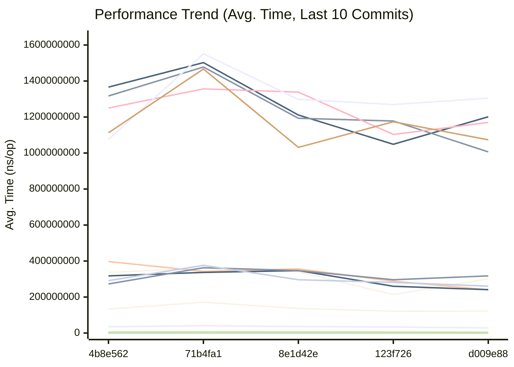
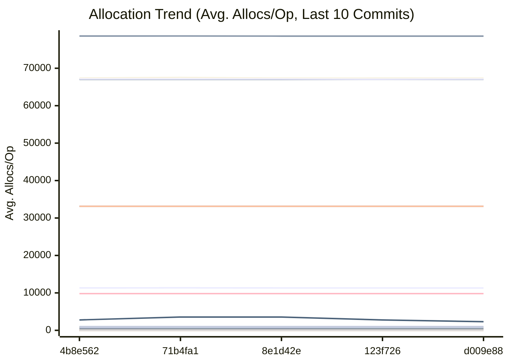

# Performance Benchmarks

This document tracks benchmark performance across commits. The section between
the `BENCHMARK_RESULTS_START/END` markers is auto-generated by the pre-commit
hook; the crypto/OPRF section below is manually maintained.

## How to Read This Document

- **Comparison with previous commit**: `benchstat` output comparing the current
  commit against the previous one. Three tables: **sec/op** (time per operation),
  **B/op** (bytes allocated), **allocs/op** (heap allocations). In each table,
  **lower is better**. `+X%` = regression, `-X%` = improvement, `~` = no
  statistically significant change. `p` is the p-value (p < 0.05 = significant).
- **Latest Benchmark Results**: Single-snapshot table of the current commit's
  averages. Lower values are better across all three columns.
- **Performance Trend plot**: X-axis = commit SHA (left = older, right = newer).
  Y-axis = avg time in ns/op. **Lower lines = faster.** Downward trends are
  improvements; upward spikes are regressions.
- **Memory Trend plot**: Same axes, but Y-axis = avg bytes allocated per op.
  **Lower lines = less memory.** Drops indicate allocation reductions.
- **Allocation Trend plot**: Same axes, but Y-axis = avg heap allocations per op.
  **Lower lines = fewer allocations.** Fewer allocs = less GC pressure.

<!-- BENCHMARK_RESULTS_START -->
## Performance

This section is automatically updated by the pre-commit hook (via .github/scripts/update_readme_with_benchmarks.sh).

### Comparison with previous commit

Each table compares the previous commit (left) to the current commit (right).
**Lower is better** in all three tables. `+X%` = regression, `-X%` = improvement,
`~` = no statistically significant change (p >= 0.05).

- **sec/op**: Time per operation (nanoseconds). Measures raw speed.
- **B/op**: Bytes allocated on the heap per operation. Measures memory usage.
- **allocs/op**: Number of heap allocations per operation. Measures GC pressure.

```
                                      │ /tmp/old_bench_filtered.txt │      /tmp/new_bench_filtered.txt       │
                                      │           sec/op            │    sec/op      vs base                 │
CrushOriginal-8                                        499.5n ± ∞ ¹    425.1n ± ∞ ¹        ~ (p=1.000 n=1) ²
Placement-8                                            5.825µ ± ∞ ¹    4.876µ ± ∞ ¹        ~ (p=1.000 n=1) ²
PlacementDomainSpread-8                                6.405µ ± ∞ ¹    5.139µ ± ∞ ¹        ~ (p=1.000 n=1) ²
CrushOptimized-8                                       348.5n ± ∞ ¹    300.1n ± ∞ ¹        ~ (p=1.000 n=1) ²
LoadGlobalConfig-8                                    10.458µ ± ∞ ¹    9.205µ ± ∞ ¹        ~ (p=1.000 n=1) ²
HashBytes/1MiB-8                                       3.553m ± ∞ ¹    3.950m ± ∞ ¹        ~ (p=1.000 n=1) ²
HashBytes/64MiB-8                                      225.3m ± ∞ ¹    239.3m ± ∞ ¹        ~ (p=1.000 n=1) ²
HashBytes/256MiB-8                                    1044.6m ± ∞ ¹    953.6m ± ∞ ¹        ~ (p=1.000 n=1) ²
HashFile/1MiB-8                                        4.389m ± ∞ ¹    3.364m ± ∞ ¹        ~ (p=1.000 n=1) ²
HashFile/64MiB-8                                       248.8m ± ∞ ¹    200.0m ± ∞ ¹        ~ (p=1.000 n=1) ²
HashFile/256MiB-8                                     1035.6m ± ∞ ¹    793.0m ± ∞ ¹        ~ (p=1.000 n=1) ²
PadString-8                                            58.48n ± ∞ ¹    41.07n ± ∞ ¹        ~ (p=1.000 n=1) ²
SanitizeLog/Safe-8                                     286.1n ± ∞ ¹    227.2n ± ∞ ¹        ~ (p=1.000 n=1) ²
SanitizeLog/Unsafe-8                                  1495.0n ± ∞ ¹    680.7n ± ∞ ¹        ~ (p=1.000 n=1) ²
AWSChunkedReaderSigned-8                               758.7µ ± ∞ ¹    413.1µ ± ∞ ¹        ~ (p=1.000 n=1) ²
AWSChunkedReaderUnsigned-8                             672.2µ ± ∞ ¹    414.1µ ± ∞ ¹        ~ (p=1.000 n=1) ²
LastModifiedHeader_AppendFormat-8                      327.1n ± ∞ ¹    200.2n ± ∞ ¹        ~ (p=1.000 n=1) ²
LastModifiedHeader_Format-8                            539.7n ± ∞ ¹    279.2n ± ∞ ¹        ~ (p=1.000 n=1) ²
FormatListObjectsV2XML_AppendFormat-8                  915.2µ ± ∞ ¹    583.0µ ± ∞ ¹        ~ (p=1.000 n=1) ²
FormatListObjectsV2XML_OldFormat-8                     678.6µ ± ∞ ¹    365.9µ ± ∞ ¹        ~ (p=1.000 n=1) ²
CheckMetricsAndSwap-8                                 15.160n ± ∞ ¹    7.574n ± ∞ ¹        ~ (p=1.000 n=1) ²
IndexSearch-8                                          3.094n ± ∞ ¹    1.777n ± ∞ ¹        ~ (p=1.000 n=1) ²
IndexDirectTracking-8                                 0.7993n ± ∞ ¹   0.4176n ± ∞ ¹        ~ (p=1.000 n=1) ²
LocalWrite/1MiB-8                                      817.7µ ± ∞ ¹    719.4µ ± ∞ ¹        ~ (p=1.000 n=1) ²
LocalWrite/64MiB-8                                     34.83m ± ∞ ¹    27.95m ± ∞ ¹        ~ (p=1.000 n=1) ²
LocalWrite/256MiB-8                                    158.0m ± ∞ ¹    120.3m ± ∞ ¹        ~ (p=1.000 n=1) ²
ReadVerify/1MiB-8                                      6.082m ± ∞ ¹    3.136m ± ∞ ¹        ~ (p=1.000 n=1) ²
ReadVerify/64MiB-8                                     335.8m ± ∞ ¹    214.3m ± ∞ ¹        ~ (p=1.000 n=1) ²
ReadVerify/256MiB-8                                     1.411 ± ∞ ¹     1.001 ± ∞ ¹        ~ (p=1.000 n=1) ²
TrustedRead/1MiB-8                                     3.670m ± ∞ ¹    3.528m ± ∞ ¹        ~ (p=1.000 n=1) ²
TrustedRead/64MiB-8                                    338.5m ± ∞ ¹    217.7m ± ∞ ¹        ~ (p=1.000 n=1) ²
TrustedRead/256MiB-8                                  1648.5m ± ∞ ¹    887.1m ± ∞ ¹        ~ (p=1.000 n=1) ²
S3PutSpool/1MiB-8                                      6.562m ± ∞ ¹    3.791m ± ∞ ¹        ~ (p=1.000 n=1) ²
S3PutSpool/64MiB-8                                     378.2m ± ∞ ¹    245.5m ± ∞ ¹        ~ (p=1.000 n=1) ²
S3PutSpool/256MiB-8                                     1.141 ± ∞ ¹     1.085 ± ∞ ¹        ~ (p=1.000 n=1) ²
geomean                                                436.6µ          307.3µ        -29.63%
¹ need >= 6 samples for confidence interval at level 0.95
² need >= 4 samples to detect a difference at alpha level 0.05

                                      │ /tmp/old_bench_filtered.txt │      /tmp/new_bench_filtered.txt      │
                                      │            B/op             │     B/op       vs base                │
CrushOriginal-8                                         164.0 ± ∞ ¹     164.0 ± ∞ ¹       ~ (p=1.000 n=1) ²
Placement-8                                             352.0 ± ∞ ¹     352.0 ± ∞ ¹       ~ (p=1.000 n=1) ²
PlacementDomainSpread-8                                 352.0 ± ∞ ¹     352.0 ± ∞ ¹       ~ (p=1.000 n=1) ²
CrushOptimized-8                                        0.000 ± ∞ ¹     0.000 ± ∞ ¹       ~ (p=1.000 n=1) ²
LoadGlobalConfig-8                                    1.930Ki ± ∞ ¹   1.930Ki ± ∞ ¹       ~ (p=1.000 n=1) ²
HashBytes/1MiB-8                                        64.00 ± ∞ ¹     64.00 ± ∞ ¹       ~ (p=1.000 n=1) ²
HashBytes/64MiB-8                                       64.00 ± ∞ ¹     64.00 ± ∞ ¹       ~ (p=1.000 n=1) ²
HashBytes/256MiB-8                                      64.00 ± ∞ ¹     64.00 ± ∞ ¹       ~ (p=1.000 n=1) ²
HashFile/1MiB-8                                       32.35Ki ± ∞ ¹   32.35Ki ± ∞ ¹       ~ (p=1.000 n=1) ²
HashFile/64MiB-8                                      32.35Ki ± ∞ ¹   32.35Ki ± ∞ ¹       ~ (p=1.000 n=1) ²
HashFile/256MiB-8                                     32.35Ki ± ∞ ¹   32.35Ki ± ∞ ¹       ~ (p=1.000 n=1) ²
PadString-8                                             64.00 ± ∞ ¹     64.00 ± ∞ ¹       ~ (p=1.000 n=1) ²
SanitizeLog/Safe-8                                      0.000 ± ∞ ¹     0.000 ± ∞ ¹       ~ (p=1.000 n=1) ²
SanitizeLog/Unsafe-8                                    704.0 ± ∞ ¹     704.0 ± ∞ ¹       ~ (p=1.000 n=1) ²
AWSChunkedReaderSigned-8                              11.09Ki ± ∞ ¹   11.02Ki ± ∞ ¹       ~ (p=1.000 n=1) ³
AWSChunkedReaderUnsigned-8                            76.77Ki ± ∞ ¹   76.72Ki ± ∞ ¹       ~ (p=1.000 n=1) ³
LastModifiedHeader_AppendFormat-8                       0.000 ± ∞ ¹     0.000 ± ∞ ¹       ~ (p=1.000 n=1) ²
LastModifiedHeader_Format-8                             32.00 ± ∞ ¹     32.00 ± ∞ ¹       ~ (p=1.000 n=1) ²
FormatListObjectsV2XML_AppendFormat-8                 512.2Ki ± ∞ ¹   512.1Ki ± ∞ ¹       ~ (p=1.000 n=1) ³
FormatListObjectsV2XML_OldFormat-8                    23.44Ki ± ∞ ¹   23.44Ki ± ∞ ¹       ~ (p=1.000 n=1) ²
CheckMetricsAndSwap-8                                   0.000 ± ∞ ¹     0.000 ± ∞ ¹       ~ (p=1.000 n=1) ²
IndexSearch-8                                           0.000 ± ∞ ¹     0.000 ± ∞ ¹       ~ (p=1.000 n=1) ²
IndexDirectTracking-8                                   0.000 ± ∞ ¹     0.000 ± ∞ ¹       ~ (p=1.000 n=1) ²
LocalWrite/1MiB-8                                     65.46Ki ± ∞ ¹   65.46Ki ± ∞ ¹       ~ (p=1.000 n=1) ³
LocalWrite/64MiB-8                                    65.53Ki ± ∞ ¹   65.50Ki ± ∞ ¹       ~ (p=1.000 n=1) ³
LocalWrite/256MiB-8                                   65.88Ki ± ∞ ¹   65.70Ki ± ∞ ¹       ~ (p=1.000 n=1) ³
ReadVerify/1MiB-8                                       484.0 ± ∞ ¹     458.0 ± ∞ ¹       ~ (p=1.000 n=1) ³
ReadVerify/64MiB-8                                    2.711Ki ± ∞ ¹   2.253Ki ± ∞ ¹       ~ (p=1.000 n=1) ³
ReadVerify/256MiB-8                                   9.578Ki ± ∞ ¹   9.578Ki ± ∞ ¹       ~ (p=1.000 n=1) ²
TrustedRead/1MiB-8                                      800.0 ± ∞ ¹     827.0 ± ∞ ¹       ~ (p=1.000 n=1) ³
TrustedRead/64MiB-8                                     800.0 ± ∞ ¹     800.0 ± ∞ ¹       ~ (p=1.000 n=1) ²
TrustedRead/256MiB-8                                    800.0 ± ∞ ¹     800.0 ± ∞ ¹       ~ (p=1.000 n=1) ²
S3PutSpool/1MiB-8                                       447.0 ± ∞ ¹     447.0 ± ∞ ¹       ~ (p=1.000 n=1) ²
S3PutSpool/64MiB-8                                      448.0 ± ∞ ¹     448.0 ± ∞ ¹       ~ (p=1.000 n=1) ²
S3PutSpool/256MiB-8                                     448.0 ± ∞ ¹     448.0 ± ∞ ¹       ~ (p=1.000 n=1) ²
geomean                                                           ⁴                  -0.62%               ⁴
¹ need >= 6 samples for confidence interval at level 0.95
² all samples are equal
³ need >= 4 samples to detect a difference at alpha level 0.05
⁴ summaries must be >0 to compute geomean

                                      │ /tmp/old_bench_filtered.txt │     /tmp/new_bench_filtered.txt      │
                                      │          allocs/op          │  allocs/op    vs base                │
CrushOriginal-8                                         3.000 ± ∞ ¹    3.000 ± ∞ ¹       ~ (p=1.000 n=1) ²
Placement-8                                             6.000 ± ∞ ¹    6.000 ± ∞ ¹       ~ (p=1.000 n=1) ²
PlacementDomainSpread-8                                 6.000 ± ∞ ¹    6.000 ± ∞ ¹       ~ (p=1.000 n=1) ²
CrushOptimized-8                                        0.000 ± ∞ ¹    0.000 ± ∞ ¹       ~ (p=1.000 n=1) ²
LoadGlobalConfig-8                                      58.00 ± ∞ ¹    58.00 ± ∞ ¹       ~ (p=1.000 n=1) ²
HashBytes/1MiB-8                                        1.000 ± ∞ ¹    1.000 ± ∞ ¹       ~ (p=1.000 n=1) ²
HashBytes/64MiB-8                                       1.000 ± ∞ ¹    1.000 ± ∞ ¹       ~ (p=1.000 n=1) ²
HashBytes/256MiB-8                                      1.000 ± ∞ ¹    1.000 ± ∞ ¹       ~ (p=1.000 n=1) ²
HashFile/1MiB-8                                         6.000 ± ∞ ¹    6.000 ± ∞ ¹       ~ (p=1.000 n=1) ²
HashFile/64MiB-8                                        6.000 ± ∞ ¹    6.000 ± ∞ ¹       ~ (p=1.000 n=1) ²
HashFile/256MiB-8                                       6.000 ± ∞ ¹    6.000 ± ∞ ¹       ~ (p=1.000 n=1) ²
PadString-8                                             1.000 ± ∞ ¹    1.000 ± ∞ ¹       ~ (p=1.000 n=1) ²
SanitizeLog/Safe-8                                      0.000 ± ∞ ¹    0.000 ± ∞ ¹       ~ (p=1.000 n=1) ²
SanitizeLog/Unsafe-8                                    1.000 ± ∞ ¹    1.000 ± ∞ ¹       ~ (p=1.000 n=1) ²
AWSChunkedReaderSigned-8                                80.00 ± ∞ ¹    80.00 ± ∞ ¹       ~ (p=1.000 n=1) ²
AWSChunkedReaderUnsigned-8                              15.00 ± ∞ ¹    15.00 ± ∞ ¹       ~ (p=1.000 n=1) ²
LastModifiedHeader_AppendFormat-8                       0.000 ± ∞ ¹    0.000 ± ∞ ¹       ~ (p=1.000 n=1) ²
LastModifiedHeader_Format-8                             1.000 ± ∞ ¹    1.000 ± ∞ ¹       ~ (p=1.000 n=1) ²
FormatListObjectsV2XML_AppendFormat-8                   16.00 ± ∞ ¹    16.00 ± ∞ ¹       ~ (p=1.000 n=1) ²
FormatListObjectsV2XML_OldFormat-8                     1.000k ± ∞ ¹   1.000k ± ∞ ¹       ~ (p=1.000 n=1) ²
CheckMetricsAndSwap-8                                   0.000 ± ∞ ¹    0.000 ± ∞ ¹       ~ (p=1.000 n=1) ²
IndexSearch-8                                           0.000 ± ∞ ¹    0.000 ± ∞ ¹       ~ (p=1.000 n=1) ²
IndexDirectTracking-8                                   0.000 ± ∞ ¹    0.000 ± ∞ ¹       ~ (p=1.000 n=1) ²
LocalWrite/1MiB-8                                       18.00 ± ∞ ¹    19.00 ± ∞ ¹       ~ (p=1.000 n=1) ³
LocalWrite/64MiB-8                                      18.00 ± ∞ ¹    18.00 ± ∞ ¹       ~ (p=1.000 n=1) ²
LocalWrite/256MiB-8                                     21.00 ± ∞ ¹    19.00 ± ∞ ¹       ~ (p=1.000 n=1) ³
ReadVerify/1MiB-8                                       6.000 ± ∞ ¹    6.000 ± ∞ ¹       ~ (p=1.000 n=1) ²
ReadVerify/64MiB-8                                      7.000 ± ∞ ¹    6.000 ± ∞ ¹       ~ (p=1.000 n=1) ³
ReadVerify/256MiB-8                                     10.00 ± ∞ ¹    10.00 ± ∞ ¹       ~ (p=1.000 n=1) ²
TrustedRead/1MiB-8                                      11.00 ± ∞ ¹    11.00 ± ∞ ¹       ~ (p=1.000 n=1) ²
TrustedRead/64MiB-8                                     11.00 ± ∞ ¹    11.00 ± ∞ ¹       ~ (p=1.000 n=1) ²
TrustedRead/256MiB-8                                    11.00 ± ∞ ¹    11.00 ± ∞ ¹       ~ (p=1.000 n=1) ²
S3PutSpool/1MiB-8                                       10.00 ± ∞ ¹    10.00 ± ∞ ¹       ~ (p=1.000 n=1) ²
S3PutSpool/64MiB-8                                      10.00 ± ∞ ¹    10.00 ± ∞ ¹       ~ (p=1.000 n=1) ²
S3PutSpool/256MiB-8                                     10.00 ± ∞ ¹    10.00 ± ∞ ¹       ~ (p=1.000 n=1) ²
geomean                                                           ⁴                 -0.57%               ⁴
¹ need >= 6 samples for confidence interval at level 0.95
² all samples are equal
³ need >= 4 samples to detect a difference at alpha level 0.05
⁴ summaries must be >0 to compute geomean

                           │ /tmp/old_bench_filtered.txt │       /tmp/new_bench_filtered.txt       │
                           │             B/s             │      B/s        vs base                 │
HashBytes/1MiB-8                           281.4Mi ± ∞ ¹    253.2Mi ± ∞ ¹        ~ (p=1.000 n=1) ²
HashBytes/64MiB-8                          284.0Mi ± ∞ ¹    267.4Mi ± ∞ ¹        ~ (p=1.000 n=1) ²
HashBytes/256MiB-8                         245.1Mi ± ∞ ¹    268.5Mi ± ∞ ¹        ~ (p=1.000 n=1) ²
HashFile/1MiB-8                            227.8Mi ± ∞ ¹    297.2Mi ± ∞ ¹        ~ (p=1.000 n=1) ²
HashFile/64MiB-8                           257.2Mi ± ∞ ¹    320.0Mi ± ∞ ¹        ~ (p=1.000 n=1) ²
HashFile/256MiB-8                          247.2Mi ± ∞ ¹    322.8Mi ± ∞ ¹        ~ (p=1.000 n=1) ²
AWSChunkedReaderSigned-8                   83.67Mi ± ∞ ¹   153.67Mi ± ∞ ¹        ~ (p=1.000 n=1) ²
AWSChunkedReaderUnsigned-8                 94.43Mi ± ∞ ¹   153.30Mi ± ∞ ¹        ~ (p=1.000 n=1) ²
LocalWrite/1MiB-8                          1.194Gi ± ∞ ¹    1.358Gi ± ∞ ¹        ~ (p=1.000 n=1) ²
LocalWrite/64MiB-8                         1.794Gi ± ∞ ¹    2.236Gi ± ∞ ¹        ~ (p=1.000 n=1) ²
LocalWrite/256MiB-8                        1.582Gi ± ∞ ¹    2.078Gi ± ∞ ¹        ~ (p=1.000 n=1) ²
ReadVerify/1MiB-8                          164.4Mi ± ∞ ¹    318.9Mi ± ∞ ¹        ~ (p=1.000 n=1) ²
ReadVerify/64MiB-8                         190.6Mi ± ∞ ¹    298.6Mi ± ∞ ¹        ~ (p=1.000 n=1) ²
ReadVerify/256MiB-8                        181.4Mi ± ∞ ¹    255.8Mi ± ∞ ¹        ~ (p=1.000 n=1) ²
TrustedRead/1MiB-8                         272.5Mi ± ∞ ¹    283.5Mi ± ∞ ¹        ~ (p=1.000 n=1) ²
TrustedRead/64MiB-8                        189.1Mi ± ∞ ¹    293.9Mi ± ∞ ¹        ~ (p=1.000 n=1) ²
TrustedRead/256MiB-8                       155.3Mi ± ∞ ¹    288.6Mi ± ∞ ¹        ~ (p=1.000 n=1) ²
S3PutSpool/1MiB-8                          152.4Mi ± ∞ ¹    263.8Mi ± ∞ ¹        ~ (p=1.000 n=1) ²
S3PutSpool/64MiB-8                         169.2Mi ± ∞ ¹    260.7Mi ± ∞ ¹        ~ (p=1.000 n=1) ²
S3PutSpool/256MiB-8                        224.4Mi ± ∞ ¹    235.8Mi ± ∞ ¹        ~ (p=1.000 n=1) ²
geomean                                    261.0Mi          351.9Mi        +34.82%
¹ need >= 6 samples for confidence interval at level 0.95
² need >= 4 samples to detect a difference at alpha level 0.05
```

### Latest Benchmark Results

Single-snapshot of the current commit's averages. **Lower is better** across all
three columns: time (speed), bytes (memory), allocs (GC pressure).


| Benchmark | Avg. Time/Op | Avg. Bytes/Op | Avg. Allocs/Op |
|-----------|--------------|---------------|----------------|
| BenchmarkAWSChunkedReaderSigned-8 | 413086.00 ns/op | 161.13 B/op | 11288.00 allocs/op |
| BenchmarkAWSChunkedReaderUnsigned-8 | 414070.00 ns/op | 160.75 B/op | 78561.00 allocs/op |
| BenchmarkCheckMetricsAndSwap-8 | 7.57 ns/op | 0.00 B/op | 0.00 allocs/op |
| BenchmarkCrushOptimized-8 | 300.10 ns/op | 0.00 B/op | 0.00 allocs/op |
| BenchmarkCrushOriginal-8 | 425.10 ns/op | 164.00 B/op | 3.00 allocs/op |
| BenchmarkFormatListObjectsV2XML_AppendFormat-8 | 583023.00 ns/op | 524439.00 B/op | 16.00 allocs/op |
| BenchmarkFormatListObjectsV2XML_OldFormat-8 | 365879.00 ns/op | 24000.00 B/op | 1000.00 allocs/op |
| BenchmarkHashBytes/1MiB-8 | 3949669.00 ns/op | 265.48 B/op | 64.00 allocs/op |
| BenchmarkHashBytes/256MiB-8 | 953557308.00 ns/op | 281.51 B/op | 64.00 allocs/op |
| BenchmarkHashBytes/64MiB-8 | 239330627.00 ns/op | 280.40 B/op | 64.00 allocs/op |
| BenchmarkHashFile/1MiB-8 | 3364281.00 ns/op | 311.68 B/op | 33128.00 allocs/op |
| BenchmarkHashFile/256MiB-8 | 793044431.00 ns/op | 338.49 B/op | 33128.00 allocs/op |
| BenchmarkHashFile/64MiB-8 | 200009250.00 ns/op | 335.53 B/op | 33128.00 allocs/op |
| BenchmarkIndexDirectTracking-8 | 0.42 ns/op | 0.00 B/op | 0.00 allocs/op |
| BenchmarkIndexSearch-8 | 1.78 ns/op | 0.00 B/op | 0.00 allocs/op |
| BenchmarkLastModifiedHeader_AppendFormat-8 | 200.20 ns/op | 0.00 B/op | 0.00 allocs/op |
| BenchmarkLastModifiedHeader_Format-8 | 279.20 ns/op | 32.00 B/op | 1.00 allocs/op |
| BenchmarkLoadGlobalConfig-8 | 9205.00 ns/op | 1976.00 B/op | 58.00 allocs/op |
| BenchmarkLocalWrite/1MiB-8 | 719361.00 ns/op | 1457.65 B/op | 67031.00 allocs/op |
| BenchmarkLocalWrite/256MiB-8 | 120298309.00 ns/op | 2231.42 B/op | 67275.00 allocs/op |
| BenchmarkLocalWrite/64MiB-8 | 27951923.00 ns/op | 2400.87 B/op | 67070.00 allocs/op |
| BenchmarkPadString-8 | 41.07 ns/op | 64.00 B/op | 1.00 allocs/op |
| BenchmarkPlacement-8 | 4876.00 ns/op | 352.00 B/op | 6.00 allocs/op |
| BenchmarkPlacementDomainSpread-8 | 5139.00 ns/op | 352.00 B/op | 6.00 allocs/op |
| BenchmarkReadVerify/1MiB-8 | 3136229.00 ns/op | 334.34 B/op | 458.00 allocs/op |
| BenchmarkReadVerify/256MiB-8 | 1000738329.00 ns/op | 268.24 B/op | 9808.00 allocs/op |
| BenchmarkReadVerify/64MiB-8 | 214326196.00 ns/op | 313.12 B/op | 2307.00 allocs/op |
| BenchmarkS3PutSpool/1MiB-8 | 3791252.00 ns/op | 276.58 B/op | 447.00 allocs/op |
| BenchmarkS3PutSpool/256MiB-8 | 1085496919.00 ns/op | 247.29 B/op | 448.00 allocs/op |
| BenchmarkS3PutSpool/64MiB-8 | 245496530.00 ns/op | 273.36 B/op | 448.00 allocs/op |
| BenchmarkSanitizeLog/Safe-8 | 227.20 ns/op | 0.00 B/op | 0.00 allocs/op |
| BenchmarkSanitizeLog/Unsafe-8 | 680.70 ns/op | 704.00 B/op | 1.00 allocs/op |
| BenchmarkTrustedRead/1MiB-8 | 3527534.00 ns/op | 297.25 B/op | 827.00 allocs/op |
| BenchmarkTrustedRead/256MiB-8 | 887056660.00 ns/op | 302.61 B/op | 800.00 allocs/op |
| BenchmarkTrustedRead/64MiB-8 | 217741152.00 ns/op | 308.20 B/op | 800.00 allocs/op |


### Performance History

**Legend**

| Color | Benchmark | Description |
|---|---|---|
| 🟢 | CheckMetricsAndSwap | Evaluation of system metrics (CPU/Mem) and mode switching logic |
| 🟤 | CrushOriginal | Original Sage Weil's CRUSH placement algorithm using reflection and float math |
| ⚪ | CrushOptimized | Performance-tuned CRUSH-lite placement algorithm using bitwise shifts and integer math (Rule 19) |
| 🔵 | IndexDirectTracking | Accessing current replication mode via direct slice index (O(1)) |
| 🔴 | IndexSearch | Searching for current replication mode in the order slice using `slices.Index` |
| 🟠 | LoadGlobalConfig | Parsing and loading the `[global]` section from the INI configuration |
| 🟣 | PadString | Padding strings with null characters to a fixed protocol length |
| 🟡 | ParseReplicationOrder | Parsing the CSV-formatted replication order string into an integer slice |

#### Time per Operation (ns/op)

X-axis: commit SHA (left = older, right = newer). Y-axis: avg time in ns/op.
**Lower lines = faster code.** Downward trends are improvements; upward spikes
are regressions to investigate.


```mermaid
xychart-beta
    title "Performance Trend (Avg. Time, Last 10 Commits)"
    x-axis "Commit"
    y-axis "Avg. Time (ns/op)"
    x-axis [4b8e562,71b4fa1,8e1d42e,123f726,d009e88]
    line "AWSChunkedReaderSigned" [582789,741042,596016,541759,554800,615254,528737,564386,758672,413086]
    line "AWSChunkedReaderUnsigned" [580668,721611,624951,521049,581740,507516,587797,593238,672192,414070]
    line "CheckMetricsAndSwap" [9,14,13,11,12,11,10,13,15,8]
    line "CrushOptimized" [484,492,487,522,363,426,455,372,348,300]
    line "CrushOriginal" [641,734,697,658,647,700,629,670,500,425]
    line "FormatListObjectsV2XML_AppendFormat" [993577,1117129,928365,977381,898486,862695,851540,926975,915187,583023]
    line "FormatListObjectsV2XML_OldFormat" [530555,661534,521514,565611,503389,497195,517753,571332,678624,365879]
    line "HashBytes/1MiB" [4596495,5621676,4965423,4315588,3618889,5475294,4458201,5002278,3553145,3949669]
    line "HashBytes/256MiB" [1365990323,1502178110,1211052717,1048575116,1201286487,897333718,1207294588,1184745180,1044551719,953557308]
    line "HashBytes/64MiB" [336895373,359262045,339981640,213869807,301162837,301221390,345018440,277796866,225326458,239330627]
    line "HashFile/1MiB" [4960660,5725417,5039192,3960989,4760647,3647035,4734519,4310666,4389479,3364281]
    line "HashFile/256MiB" [1316970291,1477907273,1193078064,1177833636,1006415705,1110450496,1224080744,1231037862,1035601414,793044431]
    line "HashFile/64MiB" [397283922,342325433,356293580,288277413,240359009,275852870,300686574,287252666,248823362,200009250]
    line "IndexDirectTracking" [1,1,0,0,0,0,1,1,1,0]
    line "IndexSearch" [2,3,2,2,2,2,2,2,3,2]
    line "LastModifiedHeader_AppendFormat" [273,377,411,306,291,280,241,335,327,200]
    line "LastModifiedHeader_Format" [359,474,418,381,345,360,407,375,540,279]
    line "LoadGlobalConfig" [14343,16534,15639,12955,12190,11396,14415,13002,10458,9205]
    line "LocalWrite/1MiB" [515217,653242,620492,558337,524282,489792,546231,429345,817681,719361]
    line "LocalWrite/256MiB" [133129249,171131397,136595670,121311016,122106179,129421555,120328176,124110973,158044809,120298309]
    line "LocalWrite/64MiB" [34587683,41271450,35901035,33613673,28590856,29289820,30438473,30969681,34833751,27951923]
    line "PadString" [85,78,64,59,66,60,55,62,58,41]
    line "ParseReplicationOrder_NoPrealloc" [350,349,357,354,345,225,229,165,232,234]
    line "ParseReplicationOrder_Prealloc" [229,231,237,234,229,108,107,80,110,109]
    line "Placement" [7230,7696,7054,7086,6141,6119,7125,6310,5825,4876]
    line "PlacementDomainSpread" [7769,8677,7666,6917,6176,5740,6962,6385,6405,5139]
    line "ReadVerify/1MiB" [3976066,5316396,4787467,3900770,3383659,5081549,5082713,4903321,6081724,3136229]
    line "ReadVerify/256MiB" [1249941171,1356438969,1338425672,1103105249,1170100253,1034709963,1126615995,955370931,1411104961,1000738329]
    line "ReadVerify/64MiB" [317667291,337069645,347180139,259882135,240879749,282446554,308997294,315121783,335838061,214326196]
    line "S3PutSpool/1MiB" [5572982,6149011,5304842,5592080,5587762,4022819,5065293,4750326,6562486,3791252]
    line "S3PutSpool/256MiB" [1075603816,1551204244,1298058993,1269281522,1304442018,1243287804,1504779272,1226604254,1140637754,1085496919]
    line "S3PutSpool/64MiB" [272526470,362667390,347153910,296132654,317372640,355710496,276642924,271159852,378241377,245496530]
    line "SanitizeLog/Safe" [301,419,341,309,277,263,246,286,286,227]
    line "SanitizeLog/Unsafe" [1021,1210,1000,1005,1021,917,915,1036,1495,681]
    line "TrustedRead/1MiB" [5277115,5559663,5638483,4655498,3708543,3570428,4694929,4495398,3669866,3527534]
    line "TrustedRead/256MiB" [1112381854,1466748131,1031346576,1173571296,1073394044,932638111,1071768789,1012880474,1648511504,887056660]
    line "TrustedRead/64MiB" [291068280,376225072,296255358,281349472,260468873,247394092,261716002,251602823,338500502,217741152]
```

#### Memory per Operation (B/op)

X-axis: commit SHA. Y-axis: avg bytes allocated per op.
**Lower lines = less memory.** Drops indicate allocation reductions.


```mermaid
xychart-beta
    title "Memory Trend (Avg. Bytes/Op, Last 10 Commits)"
    x-axis "Commit"
    y-axis "Avg. Bytes/Op"
    x-axis [4b8e562,71b4fa1,8e1d42e,123f726,d009e88]
    line "AWSChunkedReaderSigned" [114,90,112,123,120,108,126,118,88,161]
    line "AWSChunkedReaderUnsigned" [115,92,106,128,114,131,113,112,99,161]
    line "CheckMetricsAndSwap" [0,0,0,0,0,0,0,0,0,0]
    line "CrushOptimized" [0,0,0,0,0,0,0,0,0,0]
    line "CrushOriginal" [164,164,164,164,164,164,164,164,164,164]
    line "FormatListObjectsV2XML_AppendFormat" [524459,524497,524456,524462,524471,524446,524472,524454,524455,524439]
    line "FormatListObjectsV2XML_OldFormat" [24000,24000,24000,24000,24000,24000,24000,24000,24000,24000]
    line "HashBytes/1MiB" [228,187,211,243,290,192,235,210,295,265]
    line "HashBytes/256MiB" [197,179,222,256,223,299,222,227,257,282]
    line "HashBytes/64MiB" [199,187,197,314,223,223,195,242,298,280]
    line "HashFile/1MiB" [211,183,208,265,220,288,221,243,239,312]
    line "HashFile/256MiB" [204,182,225,228,267,242,219,218,259,338]
    line "HashFile/64MiB" [169,196,188,233,279,243,223,234,270,336]
    line "IndexDirectTracking" [0,0,0,0,0,0,0,0,0,0]
    line "IndexSearch" [0,0,0,0,0,0,0,0,0,0]
    line "LastModifiedHeader_AppendFormat" [0,0,0,0,0,0,0,0,0,0]
    line "LastModifiedHeader_Format" [32,32,32,32,32,32,32,32,32,32]
    line "LoadGlobalConfig" [1976,1976,1976,1976,1976,1976,1976,1976,1976,1976]
    line "LocalWrite/1MiB" [2035,1605,1690,1878,2000,2141,1920,2442,1282,1458]
    line "LocalWrite/256MiB" [2016,1569,1965,2213,2198,2074,2231,2163,1698,2231]
    line "LocalWrite/64MiB" [1940,1626,1869,1996,2347,2291,2205,2167,1927,2401]
    line "PadString" [64,64,64,64,64,64,64,64,64,64]
    line "ParseReplicationOrder_NoPrealloc" [408,408,408,408,408,248,248,248,248,248]
    line "ParseReplicationOrder_Prealloc" [240,240,240,240,240,80,80,80,80,80]
    line "Placement" [352,352,352,352,352,352,352,352,352,352]
    line "PlacementDomainSpread" [352,352,352,352,352,352,352,352,352,352]
    line "ReadVerify/1MiB" [264,197,219,269,310,206,206,214,172,334]
    line "ReadVerify/256MiB" [215,198,201,243,229,259,238,281,190,268]
    line "ReadVerify/64MiB" [211,199,193,258,279,238,217,213,200,313]
    line "S3PutSpool/1MiB" [188,171,198,188,188,261,207,221,160,277]
    line "S3PutSpool/256MiB" [250,173,207,211,206,216,178,219,235,247]
    line "S3PutSpool/64MiB" [246,185,193,227,211,189,243,247,177,273]
    line "SanitizeLog/Safe" [0,0,0,0,0,0,0,0,0,0]
    line "SanitizeLog/Unsafe" [704,704,704,704,704,704,704,704,704,704]
    line "TrustedRead/1MiB" [199,189,186,225,283,294,223,233,286,297]
    line "TrustedRead/256MiB" [241,183,260,229,250,288,250,265,163,303]
    line "TrustedRead/64MiB" [231,178,227,239,258,271,256,267,198,308]
```

#### Allocations per Operation (allocs/op)

X-axis: commit SHA. Y-axis: avg heap allocations per op.
**Lower lines = fewer allocations.** Fewer allocs = less GC pressure.


```mermaid
xychart-beta
    title "Allocation Trend (Avg. Allocs/Op, Last 10 Commits)"
    x-axis "Commit"
    y-axis "Avg. Allocs/Op"
    x-axis [4b8e562,71b4fa1,8e1d42e,123f726,d009e88]
    line "AWSChunkedReaderSigned" [11329,11352,11316,11313,11300,11299,11305,11315,11352,11288]
    line "AWSChunkedReaderUnsigned" [78603,78618,78588,78582,78589,78575,78586,78603,78609,78561]
    line "CheckMetricsAndSwap" [0,0,0,0,0,0,0,0,0,0]
    line "CrushOptimized" [0,0,0,0,0,0,0,0,0,0]
    line "CrushOriginal" [3,3,3,3,3,3,3,3,3,3]
    line "FormatListObjectsV2XML_AppendFormat" [16,16,16,16,16,16,16,16,16,16]
    line "FormatListObjectsV2XML_OldFormat" [1000,1000,1000,1000,1000,1000,1000,1000,1000,1000]
    line "HashBytes/1MiB" [64,64,64,64,64,64,64,64,64,64]
    line "HashBytes/256MiB" [64,64,64,64,64,64,64,64,64,64]
    line "HashBytes/64MiB" [64,64,64,64,64,64,64,64,64,64]
    line "HashFile/1MiB" [33128,33128,33128,33128,33128,33128,33128,33128,33128,33128]
    line "HashFile/256MiB" [33128,33128,33128,33128,33128,33128,33128,33128,33128,33128]
    line "HashFile/64MiB" [33128,33128,33128,33128,33128,33128,33128,33128,33128,33128]
    line "IndexDirectTracking" [0,0,0,0,0,0,0,0,0,0]
    line "IndexSearch" [0,0,0,0,0,0,0,0,0,0]
    line "LastModifiedHeader_AppendFormat" [0,0,0,0,0,0,0,0,0,0]
    line "LastModifiedHeader_Format" [1,1,1,1,1,1,1,1,1,1]
    line "LoadGlobalConfig" [58,58,58,58,58,58,58,58,58,58]
    line "LocalWrite/1MiB" [67030,67036,67032,67034,67035,67028,67030,67029,67036,67031]
    line "LocalWrite/256MiB" [67386,67552,67369,67393,67386,67388,67358,67330,67465,67275]
    line "LocalWrite/64MiB" [67102,67105,67107,67056,67086,67077,67086,67071,67103,67070]
    line "PadString" [1,1,1,1,1,1,1,1,1,1]
    line "ParseReplicationOrder_NoPrealloc" [6,6,6,6,6,5,5,5,5,5]
    line "ParseReplicationOrder_Prealloc" [2,2,2,2,2,1,1,1,1,1]
    line "Placement" [6,6,6,6,6,6,6,6,6,6]
    line "PlacementDomainSpread" [6,6,6,6,6,6,6,6,6,6]
    line "ReadVerify/1MiB" [468,479,467,465,462,461,460,460,484,458]
    line "ReadVerify/256MiB" [9808,9808,9808,9808,9808,9808,5120,5120,9808,9808]
    line "ReadVerify/64MiB" [2776,3557,3557,2776,2307,2776,2776,2776,2776,2307]
    line "S3PutSpool/1MiB" [447,447,447,447,447,447,447,447,447,447]
    line "S3PutSpool/256MiB" [448,448,448,448,448,448,448,448,448,448]
    line "S3PutSpool/64MiB" [448,448,448,448,448,446,448,448,448,448]
    line "SanitizeLog/Safe" [0,0,0,0,0,0,0,0,0,0]
    line "SanitizeLog/Unsafe" [1,1,1,1,1,1,1,1,1,1]
    line "TrustedRead/1MiB" [840,800,834,800,800,800,800,830,800,827]
    line "TrustedRead/256MiB" [800,800,800,800,800,800,800,800,800,800]
    line "TrustedRead/64MiB" [800,800,800,800,800,800,800,800,800,800]
```
<!-- BENCHMARK_RESULTS_END -->

### E2EE + OPRF overhead

The sections above are auto-generated and cover the hot-path benchmarks. The
crypto/OPRF work is measured separately; figures below are from `go test -bench`
on the crypto module and are intentionally placed outside the auto-managed block
so they persist.

**Lower is better** across all columns. These benchmarks run on `src/crypto` only
(not tracked in the auto-generated plots above).

| Benchmark | What it measures | Avg. Time/Op | Avg. Bytes/Op | Avg. Allocs/Op |
|-----------|------------------|--------------|---------------|----------------|
| EncryptStream | AES-GCM-256 chunked encryption (64KB input) | ~63 µs | 167 KB | 14 |
| DecryptStream | AES-GCM-256 chunked decryption (64KB input) | ~54 µs | 136 KB | 13 |
| DeriveKey | HKDF-SHA256 key derivation per tenant | ~3.5 µs | 1.3 KB | 18 |
| OPRFCombineThreshold3 | Threshold-3 OPRF combine + unblind (Ristretto255) | ~530 µs | 2.3 KB | 62 |

With `encryption_enabled`, every byte passes through AES-GCM-256 streaming at
~800-1200 MB/s (chunk-bounded memory). The streaming format is **StreamVersion
v4 (issue #824)** with a self-describing chunk size: the default 4096-byte
chunk preserves prior throughput, and the chunk size can be raised/lowered via
`SetStreamChunkSize` within `[512, 4128]` for latency/memory trade-offs without
a wire change in framing beyond the 2-byte header field (v3/v2 blobs still
decode). The threshold OPRF is evaluated **once per
upload/download**, on the dedup tag only (never per chunk):
`OPRFCombineThreshold3` measures a one-time ~0.53 ms client-side combine/unblind
for threshold-3, plus one round-trip per daemon share. This is negligible against
network/disk I/O and does not affect streaming throughput. When `oprf_enabled =
false`, the OPRF path is skipped entirely and behavior is identical to the
pre-OPRF encryption path (backward compatible).
