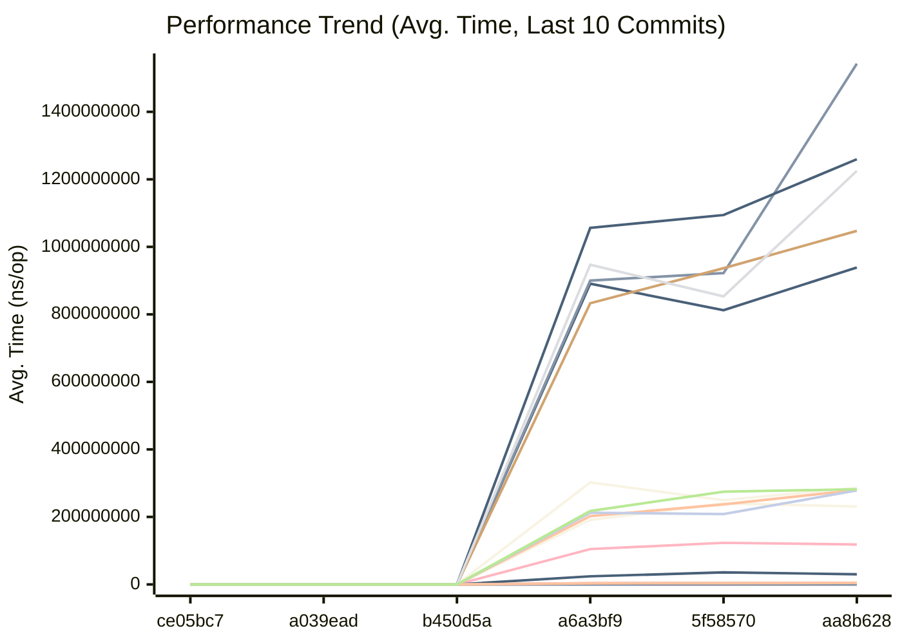
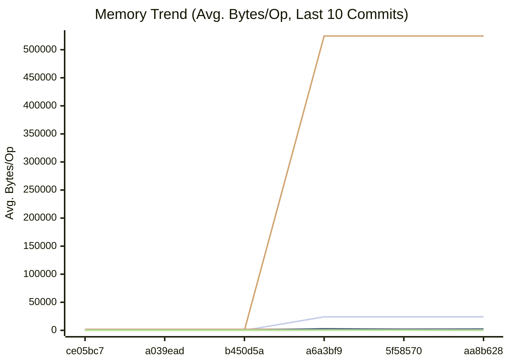
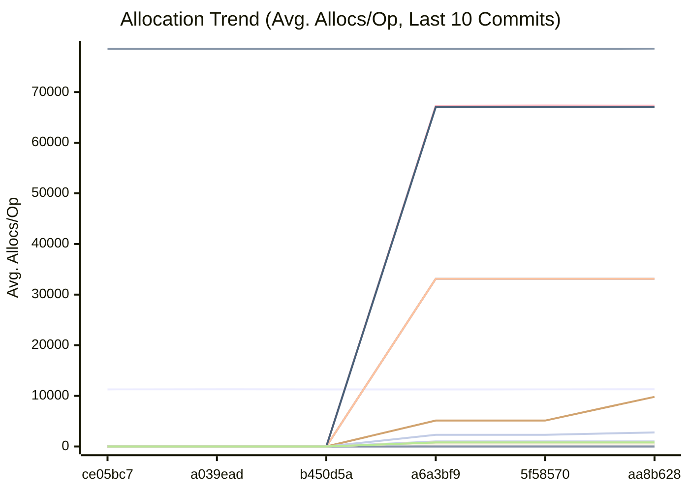

# Performance Benchmarks

This document tracks benchmark performance across commits. The section between
the `BENCHMARK_RESULTS_START/END` markers is auto-generated by the pre-commit
hook; the crypto/OPRF section below is manually maintained.

## How to Read This Document

- **Comparison with previous commit**: `benchstat` output comparing the current
  commit against the previous one. Three tables: **sec/op** (time per operation),
  **B/op** (bytes allocated), **allocs/op** (heap allocations). In each table,
  **lower is better**. `+X%` = regression, `-X%` = improvement, `~` = no
  statistically significant change. `p` is the p-value (p < 0.05 = significant).
- **Latest Benchmark Results**: Single-snapshot table of the current commit's
  averages. Lower values are better across all three columns.
- **Performance Trend plot**: X-axis = commit SHA (left = older, right = newer).
  Y-axis = avg time in ns/op. **Lower lines = faster.** Downward trends are
  improvements; upward spikes are regressions.
- **Memory Trend plot**: Same axes, but Y-axis = avg bytes allocated per op.
  **Lower lines = less memory.** Drops indicate allocation reductions.
- **Allocation Trend plot**: Same axes, but Y-axis = avg heap allocations per op.
  **Lower lines = fewer allocations.** Fewer allocs = less GC pressure.

<!-- BENCHMARK_RESULTS_START -->
## Performance

This section is automatically updated by the pre-commit hook (via .github/scripts/update_readme_with_benchmarks.sh).

### Comparison with previous commit

Each table compares the previous commit (left) to the current commit (right).
**Lower is better** in all three tables. `+X%` = regression, `-X%` = improvement,
`~` = no statistically significant change (p >= 0.05).

- **sec/op**: Time per operation (nanoseconds). Measures raw speed.
- **B/op**: Bytes allocated on the heap per operation. Measures memory usage.
- **allocs/op**: Number of heap allocations per operation. Measures GC pressure.

```
                                      │ /tmp/old_bench_filtered.txt │      /tmp/new_bench_filtered.txt      │
                                      │           sec/op            │    sec/op      vs base                │
CrushOriginal-8                                        481.5n ± ∞ ¹    563.6n ± ∞ ¹       ~ (p=1.000 n=1) ²
Placement-8                                            4.982µ ± ∞ ¹    6.536µ ± ∞ ¹       ~ (p=1.000 n=1) ²
PlacementDomainSpread-8                                5.363µ ± ∞ ¹    5.481µ ± ∞ ¹       ~ (p=1.000 n=1) ²
CrushOptimized-8                                       358.8n ± ∞ ¹    335.7n ± ∞ ¹       ~ (p=1.000 n=1) ²
LoadGlobalConfig-8                                     10.36µ ± ∞ ¹    12.31µ ± ∞ ¹       ~ (p=1.000 n=1) ²
HashBytes/1MiB-8                                       3.456m ± ∞ ¹    3.164m ± ∞ ¹       ~ (p=1.000 n=1) ²
HashBytes/64MiB-8                                      219.5m ± ∞ ¹    193.2m ± ∞ ¹       ~ (p=1.000 n=1) ²
HashBytes/256MiB-8                                     975.6m ± ∞ ¹    775.7m ± ∞ ¹       ~ (p=1.000 n=1) ²
HashFile/1MiB-8                                        4.016m ± ∞ ¹    3.354m ± ∞ ¹       ~ (p=1.000 n=1) ²
HashFile/64MiB-8                                       268.0m ± ∞ ¹    296.9m ± ∞ ¹       ~ (p=1.000 n=1) ²
HashFile/256MiB-8                                      970.0m ± ∞ ¹   1077.6m ± ∞ ¹       ~ (p=1.000 n=1) ²
PadString-8                                            54.50n ± ∞ ¹    46.63n ± ∞ ¹       ~ (p=1.000 n=1) ²
SanitizeLog/Safe-8                                     310.5n ± ∞ ¹    254.3n ± ∞ ¹       ~ (p=1.000 n=1) ²
SanitizeLog/Unsafe-8                                   714.9n ± ∞ ¹    718.1n ± ∞ ¹       ~ (p=1.000 n=1) ²
AWSChunkedReaderSigned-8                               508.8µ ± ∞ ¹    438.9µ ± ∞ ¹       ~ (p=1.000 n=1) ²
AWSChunkedReaderUnsigned-8                             493.6µ ± ∞ ¹    452.5µ ± ∞ ¹       ~ (p=1.000 n=1) ²
FormatListObjectsV2XML_AppendFormat-8                  755.8µ ± ∞ ¹    641.1µ ± ∞ ¹       ~ (p=1.000 n=1) ²
FormatListObjectsV2XML_OldFormat-8                     452.3µ ± ∞ ¹    422.3µ ± ∞ ¹       ~ (p=1.000 n=1) ²
CheckMetricsAndSwap-8                                  9.107n ± ∞ ¹    9.392n ± ∞ ¹       ~ (p=1.000 n=1) ²
IndexSearch-8                                          1.873n ± ∞ ¹    1.766n ± ∞ ¹       ~ (p=1.000 n=1) ²
IndexDirectTracking-8                                 0.4490n ± ∞ ¹   0.3937n ± ∞ ¹       ~ (p=1.000 n=1) ²
LocalWrite/1MiB-8                                     1014.3µ ± ∞ ¹    495.6µ ± ∞ ¹       ~ (p=1.000 n=1) ²
LocalWrite/64MiB-8                                     30.06m ± ∞ ¹    28.52m ± ∞ ¹       ~ (p=1.000 n=1) ²
LocalWrite/256MiB-8                                    120.8m ± ∞ ¹    123.2m ± ∞ ¹       ~ (p=1.000 n=1) ²
ReadVerify/1MiB-8                                      3.063m ± ∞ ¹    3.984m ± ∞ ¹       ~ (p=1.000 n=1) ²
ReadVerify/64MiB-8                                     236.7m ± ∞ ¹    250.4m ± ∞ ¹       ~ (p=1.000 n=1) ²
ReadVerify/256MiB-8                                    923.4m ± ∞ ¹   1100.4m ± ∞ ¹       ~ (p=1.000 n=1) ²
TrustedRead/1MiB-8                                     3.601m ± ∞ ¹    3.975m ± ∞ ¹       ~ (p=1.000 n=1) ²
TrustedRead/64MiB-8                                    288.5m ± ∞ ¹    313.3m ± ∞ ¹       ~ (p=1.000 n=1) ²
TrustedRead/256MiB-8                                    1.161 ± ∞ ¹     1.059 ± ∞ ¹       ~ (p=1.000 n=1) ²
S3PutSpool/1MiB-8                                      5.120m ± ∞ ¹    3.651m ± ∞ ¹       ~ (p=1.000 n=1) ²
S3PutSpool/64MiB-8                                     255.5m ± ∞ ¹    308.6m ± ∞ ¹       ~ (p=1.000 n=1) ²
S3PutSpool/256MiB-8                                     1.033 ± ∞ ¹     1.124 ± ∞ ¹       ~ (p=1.000 n=1) ²
geomean                                                536.4µ          519.3µ        -3.19%
¹ need >= 6 samples for confidence interval at level 0.95
² need >= 4 samples to detect a difference at alpha level 0.05

                                      │ /tmp/old_bench_filtered.txt │      /tmp/new_bench_filtered.txt      │
                                      │            B/op             │     B/op       vs base                │
CrushOriginal-8                                         164.0 ± ∞ ¹     164.0 ± ∞ ¹       ~ (p=1.000 n=1) ²
Placement-8                                             352.0 ± ∞ ¹     352.0 ± ∞ ¹       ~ (p=1.000 n=1) ²
PlacementDomainSpread-8                                 352.0 ± ∞ ¹     352.0 ± ∞ ¹       ~ (p=1.000 n=1) ²
CrushOptimized-8                                        0.000 ± ∞ ¹     0.000 ± ∞ ¹       ~ (p=1.000 n=1) ²
LoadGlobalConfig-8                                    1.930Ki ± ∞ ¹   1.930Ki ± ∞ ¹       ~ (p=1.000 n=1) ²
HashBytes/1MiB-8                                        64.00 ± ∞ ¹     64.00 ± ∞ ¹       ~ (p=1.000 n=1) ²
HashBytes/64MiB-8                                       64.00 ± ∞ ¹     64.00 ± ∞ ¹       ~ (p=1.000 n=1) ²
HashBytes/256MiB-8                                      64.00 ± ∞ ¹     64.00 ± ∞ ¹       ~ (p=1.000 n=1) ²
HashFile/1MiB-8                                       32.34Ki ± ∞ ¹   32.35Ki ± ∞ ¹       ~ (p=1.000 n=1) ³
HashFile/64MiB-8                                      32.35Ki ± ∞ ¹   32.35Ki ± ∞ ¹       ~ (p=1.000 n=1) ²
HashFile/256MiB-8                                     32.35Ki ± ∞ ¹   32.35Ki ± ∞ ¹       ~ (p=1.000 n=1) ²
PadString-8                                             64.00 ± ∞ ¹     64.00 ± ∞ ¹       ~ (p=1.000 n=1) ²
SanitizeLog/Safe-8                                      0.000 ± ∞ ¹     0.000 ± ∞ ¹       ~ (p=1.000 n=1) ²
SanitizeLog/Unsafe-8                                    704.0 ± ∞ ¹     704.0 ± ∞ ¹       ~ (p=1.000 n=1) ²
AWSChunkedReaderSigned-8                              11.03Ki ± ∞ ¹   11.03Ki ± ∞ ¹       ~ (p=1.000 n=1) ³
AWSChunkedReaderUnsigned-8                            76.74Ki ± ∞ ¹   76.74Ki ± ∞ ¹       ~ (p=1.000 n=1) ³
FormatListObjectsV2XML_AppendFormat-8                 512.2Ki ± ∞ ¹   512.1Ki ± ∞ ¹       ~ (p=1.000 n=1) ³
FormatListObjectsV2XML_OldFormat-8                    23.44Ki ± ∞ ¹   23.44Ki ± ∞ ¹       ~ (p=1.000 n=1) ²
CheckMetricsAndSwap-8                                   0.000 ± ∞ ¹     0.000 ± ∞ ¹       ~ (p=1.000 n=1) ²
IndexSearch-8                                           0.000 ± ∞ ¹     0.000 ± ∞ ¹       ~ (p=1.000 n=1) ²
IndexDirectTracking-8                                   0.000 ± ∞ ¹     0.000 ± ∞ ¹       ~ (p=1.000 n=1) ²
LocalWrite/1MiB-8                                     65.46Ki ± ∞ ¹   65.46Ki ± ∞ ¹       ~ (p=1.000 n=1) ³
LocalWrite/64MiB-8                                    65.52Ki ± ∞ ¹   65.51Ki ± ∞ ¹       ~ (p=1.000 n=1) ³
LocalWrite/256MiB-8                                   65.78Ki ± ∞ ¹   65.75Ki ± ∞ ¹       ~ (p=1.000 n=1) ³
ReadVerify/1MiB-8                                       458.0 ± ∞ ¹     466.0 ± ∞ ¹       ~ (p=1.000 n=1) ³
ReadVerify/64MiB-8                                    1.947Ki ± ∞ ¹   2.711Ki ± ∞ ¹       ~ (p=1.000 n=1) ³
ReadVerify/256MiB-8                                   5.000Ki ± ∞ ¹   5.000Ki ± ∞ ¹       ~ (p=1.000 n=1) ²
TrustedRead/1MiB-8                                      800.0 ± ∞ ¹     800.0 ± ∞ ¹       ~ (p=1.000 n=1) ²
TrustedRead/64MiB-8                                     800.0 ± ∞ ¹     800.0 ± ∞ ¹       ~ (p=1.000 n=1) ²
TrustedRead/256MiB-8                                    800.0 ± ∞ ¹     800.0 ± ∞ ¹       ~ (p=1.000 n=1) ²
S3PutSpool/1MiB-8                                       448.0 ± ∞ ¹     447.0 ± ∞ ¹       ~ (p=1.000 n=1) ³
S3PutSpool/64MiB-8                                      448.0 ± ∞ ¹     448.0 ± ∞ ¹       ~ (p=1.000 n=1) ²
S3PutSpool/256MiB-8                                     448.0 ± ∞ ¹     448.0 ± ∞ ¹       ~ (p=1.000 n=1) ²
geomean                                                           ⁴                  +1.05%               ⁴
¹ need >= 6 samples for confidence interval at level 0.95
² all samples are equal
³ need >= 4 samples to detect a difference at alpha level 0.05
⁴ summaries must be >0 to compute geomean

                                      │ /tmp/old_bench_filtered.txt │     /tmp/new_bench_filtered.txt      │
                                      │          allocs/op          │  allocs/op    vs base                │
CrushOriginal-8                                         3.000 ± ∞ ¹    3.000 ± ∞ ¹       ~ (p=1.000 n=1) ²
Placement-8                                             6.000 ± ∞ ¹    6.000 ± ∞ ¹       ~ (p=1.000 n=1) ²
PlacementDomainSpread-8                                 6.000 ± ∞ ¹    6.000 ± ∞ ¹       ~ (p=1.000 n=1) ²
CrushOptimized-8                                        0.000 ± ∞ ¹    0.000 ± ∞ ¹       ~ (p=1.000 n=1) ²
LoadGlobalConfig-8                                      58.00 ± ∞ ¹    58.00 ± ∞ ¹       ~ (p=1.000 n=1) ²
HashBytes/1MiB-8                                        1.000 ± ∞ ¹    1.000 ± ∞ ¹       ~ (p=1.000 n=1) ²
HashBytes/64MiB-8                                       1.000 ± ∞ ¹    1.000 ± ∞ ¹       ~ (p=1.000 n=1) ²
HashBytes/256MiB-8                                      1.000 ± ∞ ¹    1.000 ± ∞ ¹       ~ (p=1.000 n=1) ²
HashFile/1MiB-8                                         6.000 ± ∞ ¹    6.000 ± ∞ ¹       ~ (p=1.000 n=1) ²
HashFile/64MiB-8                                        6.000 ± ∞ ¹    6.000 ± ∞ ¹       ~ (p=1.000 n=1) ²
HashFile/256MiB-8                                       6.000 ± ∞ ¹    6.000 ± ∞ ¹       ~ (p=1.000 n=1) ²
PadString-8                                             1.000 ± ∞ ¹    1.000 ± ∞ ¹       ~ (p=1.000 n=1) ²
SanitizeLog/Safe-8                                      0.000 ± ∞ ¹    0.000 ± ∞ ¹       ~ (p=1.000 n=1) ²
SanitizeLog/Unsafe-8                                    1.000 ± ∞ ¹    1.000 ± ∞ ¹       ~ (p=1.000 n=1) ²
AWSChunkedReaderSigned-8                                80.00 ± ∞ ¹    80.00 ± ∞ ¹       ~ (p=1.000 n=1) ²
AWSChunkedReaderUnsigned-8                              15.00 ± ∞ ¹    15.00 ± ∞ ¹       ~ (p=1.000 n=1) ²
FormatListObjectsV2XML_AppendFormat-8                   16.00 ± ∞ ¹    16.00 ± ∞ ¹       ~ (p=1.000 n=1) ²
FormatListObjectsV2XML_OldFormat-8                     1.000k ± ∞ ¹   1.000k ± ∞ ¹       ~ (p=1.000 n=1) ²
CheckMetricsAndSwap-8                                   0.000 ± ∞ ¹    0.000 ± ∞ ¹       ~ (p=1.000 n=1) ²
IndexSearch-8                                           0.000 ± ∞ ¹    0.000 ± ∞ ¹       ~ (p=1.000 n=1) ²
IndexDirectTracking-8                                   0.000 ± ∞ ¹    0.000 ± ∞ ¹       ~ (p=1.000 n=1) ²
LocalWrite/1MiB-8                                       19.00 ± ∞ ¹    18.00 ± ∞ ¹       ~ (p=1.000 n=1) ³
LocalWrite/64MiB-8                                      18.00 ± ∞ ¹    18.00 ± ∞ ¹       ~ (p=1.000 n=1) ²
LocalWrite/256MiB-8                                     20.00 ± ∞ ¹    20.00 ± ∞ ¹       ~ (p=1.000 n=1) ²
ReadVerify/1MiB-8                                       6.000 ± ∞ ¹    6.000 ± ∞ ¹       ~ (p=1.000 n=1) ²
ReadVerify/64MiB-8                                      6.000 ± ∞ ¹    7.000 ± ∞ ¹       ~ (p=1.000 n=1) ³
ReadVerify/256MiB-8                                     8.000 ± ∞ ¹    8.000 ± ∞ ¹       ~ (p=1.000 n=1) ²
TrustedRead/1MiB-8                                      11.00 ± ∞ ¹    11.00 ± ∞ ¹       ~ (p=1.000 n=1) ²
TrustedRead/64MiB-8                                     11.00 ± ∞ ¹    11.00 ± ∞ ¹       ~ (p=1.000 n=1) ²
TrustedRead/256MiB-8                                    11.00 ± ∞ ¹    11.00 ± ∞ ¹       ~ (p=1.000 n=1) ²
S3PutSpool/1MiB-8                                       10.00 ± ∞ ¹    10.00 ± ∞ ¹       ~ (p=1.000 n=1) ²
S3PutSpool/64MiB-8                                      10.00 ± ∞ ¹    10.00 ± ∞ ¹       ~ (p=1.000 n=1) ²
S3PutSpool/256MiB-8                                     10.00 ± ∞ ¹    10.00 ± ∞ ¹       ~ (p=1.000 n=1) ²
geomean                                                           ⁴                 +0.30%               ⁴
¹ need >= 6 samples for confidence interval at level 0.95
² all samples are equal
³ need >= 4 samples to detect a difference at alpha level 0.05
⁴ summaries must be >0 to compute geomean

                           │ /tmp/old_bench_filtered.txt │      /tmp/new_bench_filtered.txt       │
                           │             B/s             │      B/s        vs base                │
HashBytes/1MiB-8                           289.3Mi ± ∞ ¹    316.1Mi ± ∞ ¹       ~ (p=1.000 n=1) ²
HashBytes/64MiB-8                          291.6Mi ± ∞ ¹    331.2Mi ± ∞ ¹       ~ (p=1.000 n=1) ²
HashBytes/256MiB-8                         262.4Mi ± ∞ ¹    330.0Mi ± ∞ ¹       ~ (p=1.000 n=1) ²
HashFile/1MiB-8                            249.0Mi ± ∞ ¹    298.2Mi ± ∞ ¹       ~ (p=1.000 n=1) ²
HashFile/64MiB-8                           238.8Mi ± ∞ ¹    215.6Mi ± ∞ ¹       ~ (p=1.000 n=1) ²
HashFile/256MiB-8                          263.9Mi ± ∞ ¹    237.6Mi ± ∞ ¹       ~ (p=1.000 n=1) ²
AWSChunkedReaderSigned-8                   124.8Mi ± ∞ ¹    144.6Mi ± ∞ ¹       ~ (p=1.000 n=1) ²
AWSChunkedReaderUnsigned-8                 128.6Mi ± ∞ ¹    140.3Mi ± ∞ ¹       ~ (p=1.000 n=1) ²
LocalWrite/1MiB-8                          985.9Mi ± ∞ ¹   2017.9Mi ± ∞ ¹       ~ (p=1.000 n=1) ²
LocalWrite/64MiB-8                         2.079Gi ± ∞ ¹    2.191Gi ± ∞ ¹       ~ (p=1.000 n=1) ²
LocalWrite/256MiB-8                        2.069Gi ± ∞ ¹    2.029Gi ± ∞ ¹       ~ (p=1.000 n=1) ²
ReadVerify/1MiB-8                          326.5Mi ± ∞ ¹    251.0Mi ± ∞ ¹       ~ (p=1.000 n=1) ²
ReadVerify/64MiB-8                         270.3Mi ± ∞ ¹    255.6Mi ± ∞ ¹       ~ (p=1.000 n=1) ²
ReadVerify/256MiB-8                        277.2Mi ± ∞ ¹    232.6Mi ± ∞ ¹       ~ (p=1.000 n=1) ²
TrustedRead/1MiB-8                         277.7Mi ± ∞ ¹    251.6Mi ± ∞ ¹       ~ (p=1.000 n=1) ²
TrustedRead/64MiB-8                        221.9Mi ± ∞ ¹    204.3Mi ± ∞ ¹       ~ (p=1.000 n=1) ²
TrustedRead/256MiB-8                       220.5Mi ± ∞ ¹    241.8Mi ± ∞ ¹       ~ (p=1.000 n=1) ²
S3PutSpool/1MiB-8                          195.3Mi ± ∞ ¹    273.9Mi ± ∞ ¹       ~ (p=1.000 n=1) ²
S3PutSpool/64MiB-8                         250.5Mi ± ∞ ¹    207.4Mi ± ∞ ¹       ~ (p=1.000 n=1) ²
S3PutSpool/256MiB-8                        247.8Mi ± ∞ ¹    227.7Mi ± ∞ ¹       ~ (p=1.000 n=1) ²
geomean                                    316.2Mi          330.5Mi        +4.52%
¹ need >= 6 samples for confidence interval at level 0.95
² need >= 4 samples to detect a difference at alpha level 0.05
```

### Latest Benchmark Results

Single-snapshot of the current commit's averages. **Lower is better** across all
three columns: time (speed), bytes (memory), allocs (GC pressure).


| Benchmark | Avg. Time/Op | Avg. Bytes/Op | Avg. Allocs/Op |
|-----------|--------------|---------------|----------------|
| BenchmarkAWSChunkedReaderSigned-8 | 438904.00 ns/op | 151.65 B/op | 11298.00 allocs/op |
| BenchmarkAWSChunkedReaderUnsigned-8 | 452490.00 ns/op | 147.10 B/op | 78585.00 allocs/op |
| BenchmarkCheckMetricsAndSwap-8 | 9.39 ns/op | 0.00 B/op | 0.00 allocs/op |
| BenchmarkCrushOptimized-8 | 335.70 ns/op | 0.00 B/op | 0.00 allocs/op |
| BenchmarkCrushOriginal-8 | 563.60 ns/op | 164.00 B/op | 3.00 allocs/op |
| BenchmarkFormatListObjectsV2XML_AppendFormat-8 | 641060.00 ns/op | 524440.00 B/op | 16.00 allocs/op |
| BenchmarkFormatListObjectsV2XML_OldFormat-8 | 422273.00 ns/op | 24000.00 B/op | 1000.00 allocs/op |
| BenchmarkHashBytes/1MiB-8 | 3163701.00 ns/op | 331.44 B/op | 64.00 allocs/op |
| BenchmarkHashBytes/256MiB-8 | 775687070.00 ns/op | 346.06 B/op | 64.00 allocs/op |
| BenchmarkHashBytes/64MiB-8 | 193218904.00 ns/op | 347.32 B/op | 64.00 allocs/op |
| BenchmarkHashFile/1MiB-8 | 3353870.00 ns/op | 312.65 B/op | 33128.00 allocs/op |
| BenchmarkHashFile/256MiB-8 | 1077613896.00 ns/op | 249.10 B/op | 33128.00 allocs/op |
| BenchmarkHashFile/64MiB-8 | 296897974.00 ns/op | 226.03 B/op | 33128.00 allocs/op |
| BenchmarkIndexDirectTracking-8 | 0.39 ns/op | 0.00 B/op | 0.00 allocs/op |
| BenchmarkIndexSearch-8 | 1.77 ns/op | 0.00 B/op | 0.00 allocs/op |
| BenchmarkLoadGlobalConfig-8 | 12306.00 ns/op | 1976.00 B/op | 58.00 allocs/op |
| BenchmarkLocalWrite/1MiB-8 | 495566.00 ns/op | 2115.91 B/op | 67030.00 allocs/op |
| BenchmarkLocalWrite/256MiB-8 | 123214909.00 ns/op | 2178.60 B/op | 67333.00 allocs/op |
| BenchmarkLocalWrite/64MiB-8 | 28520680.00 ns/op | 2352.99 B/op | 67087.00 allocs/op |
| BenchmarkPadString-8 | 46.63 ns/op | 64.00 B/op | 1.00 allocs/op |
| BenchmarkPlacement-8 | 6536.00 ns/op | 352.00 B/op | 6.00 allocs/op |
| BenchmarkPlacementDomainSpread-8 | 5481.00 ns/op | 352.00 B/op | 6.00 allocs/op |
| BenchmarkReadVerify/1MiB-8 | 3984205.00 ns/op | 263.18 B/op | 466.00 allocs/op |
| BenchmarkReadVerify/256MiB-8 | 1100413248.00 ns/op | 243.94 B/op | 5120.00 allocs/op |
| BenchmarkReadVerify/64MiB-8 | 250377464.00 ns/op | 268.03 B/op | 2776.00 allocs/op |
| BenchmarkS3PutSpool/1MiB-8 | 3650820.00 ns/op | 287.22 B/op | 447.00 allocs/op |
| BenchmarkS3PutSpool/256MiB-8 | 1124236868.00 ns/op | 238.77 B/op | 448.00 allocs/op |
| BenchmarkS3PutSpool/64MiB-8 | 308609029.00 ns/op | 217.46 B/op | 448.00 allocs/op |
| BenchmarkSanitizeLog/Safe-8 | 254.30 ns/op | 0.00 B/op | 0.00 allocs/op |
| BenchmarkSanitizeLog/Unsafe-8 | 718.10 ns/op | 704.00 B/op | 1.00 allocs/op |
| BenchmarkTrustedRead/1MiB-8 | 3974984.00 ns/op | 263.79 B/op | 800.00 allocs/op |
| BenchmarkTrustedRead/256MiB-8 | 1058653542.00 ns/op | 253.56 B/op | 800.00 allocs/op |
| BenchmarkTrustedRead/64MiB-8 | 313281107.00 ns/op | 214.21 B/op | 800.00 allocs/op |


### Performance History

**Legend**

| Color | Benchmark | Description |
|---|---|---|
| 🟢 | CheckMetricsAndSwap | Evaluation of system metrics (CPU/Mem) and mode switching logic |
| 🟤 | CrushOriginal | Original Sage Weil's CRUSH placement algorithm using reflection and float math |
| ⚪ | CrushOptimized | Performance-tuned CRUSH-lite placement algorithm using bitwise shifts and integer math (Rule 19) |
| 🔵 | IndexDirectTracking | Accessing current replication mode via direct slice index (O(1)) |
| 🔴 | IndexSearch | Searching for current replication mode in the order slice using `slices.Index` |
| 🟠 | LoadGlobalConfig | Parsing and loading the `[global]` section from the INI configuration |
| 🟣 | PadString | Padding strings with null characters to a fixed protocol length |
| 🟡 | ParseReplicationOrder | Parsing the CSV-formatted replication order string into an integer slice |

#### Time per Operation (ns/op)

X-axis: commit SHA (left = older, right = newer). Y-axis: avg time in ns/op.
**Lower lines = faster code.** Downward trends are improvements; upward spikes
are regressions to investigate.


```mermaid
xychart-beta
    title "Performance Trend (Avg. Time, Last 10 Commits)"
    x-axis "Commit"
    y-axis "Avg. Time (ns/op)"
    x-axis [ce05bc7,a039ead,b450d5a,a6a3bf9,5f58570,aa8b628]
    line "AWSChunkedReaderSigned" [488574,498069,465911,433775,468904,508062,513734,453907,508785,438904]
    line "AWSChunkedReaderUnsigned" [429659,468690,435995,410570,459580,513068,555370,434075,493616,452490]
    line "CheckMetricsAndSwap" [8,11,8,8,8,10,10,10,9,9]
    line "CrushOptimized" [363,314,313,296,324,395,388,377,359,336]
    line "CrushOriginal" [434,468,438,389,424,500,510,457,482,564]
    line "FormatListObjectsV2XML_AppendFormat" [0,0,0,585500,632895,781453,825885,607733,755798,641060]
    line "FormatListObjectsV2XML_OldFormat" [0,0,0,385936,392685,437988,457438,384420,452349,422273]
    line "HashBytes/1MiB" [0,0,0,2943044,3455198,4083758,3234966,3413080,3456264,3163701]
    line "HashBytes/256MiB" [0,0,0,890920045,812286372,938923522,1110812216,1079738977,975610814,775687070]
    line "HashBytes/64MiB" [0,0,0,191159849,239861268,230821474,223678991,219197938,219466744,193218904]
    line "HashFile/1MiB" [0,0,0,3438255,3866812,3929226,4016890,4018511,4015638,3353870]
    line "HashFile/256MiB" [0,0,0,900152012,922386758,1542681975,1065256239,948781835,970019312,1077613896]
    line "HashFile/64MiB" [0,0,0,202378726,236988193,279832912,304125965,245379512,268034657,296897974]
    line "IndexDirectTracking" [0,0,0,0,0,0,1,0,0,0]
    line "IndexSearch" [2,2,2,3,3,3,3,2,2,2]
    line "LoadGlobalConfig" [8353,9052,8987,8373,9135,11430,10521,10213,10358,12306]
    line "LocalWrite/1MiB" [0,0,0,386344,535333,623012,523182,386063,1014308,495566]
    line "LocalWrite/256MiB" [0,0,0,104739454,123322682,118227363,120742842,111644085,120805038,123214909]
    line "LocalWrite/64MiB" [0,0,0,24065226,35686954,30222165,31091015,24172266,30061816,28520680]
    line "PadString" [42,47,44,41,47,91,57,43,54,47]
    line "ParseReplicationOrder_NoPrealloc" [350,349,357,354,345,225,229,165,232,234]
    line "ParseReplicationOrder_Prealloc" [229,231,237,234,229,108,107,80,110,109]
    line "Placement" [0,0,0,4402,4818,5406,5565,5457,4982,6536]
    line "PlacementDomainSpread" [0,0,0,4713,5072,5712,5726,5715,5363,5481]
    line "ReadVerify/1MiB" [0,0,0,3322226,4158622,4423216,3880705,3695998,3063023,3984205]
    line "ReadVerify/256MiB" [0,0,0,833047448,936726754,1047336519,1000480549,885690851,923410779,1100413248]
    line "ReadVerify/64MiB" [0,0,0,212456699,208430448,278276063,227817182,208677144,236746582,250377464]
    line "S3PutSpool/1MiB" [0,0,0,3659136,3725511,4622411,4130137,3968364,5120338,3650820]
    line "S3PutSpool/256MiB" [0,0,0,1056311038,1094320670,1259669614,992342042,1114984906,1033132692,1124236868]
    line "S3PutSpool/64MiB" [0,0,0,302092155,249542876,286259711,234949006,287125834,255515959,308609029]
    line "SanitizeLog/Safe" [243,248,275,222,246,264,286,222,310,254]
    line "SanitizeLog/Unsafe" [698,749,710,674,741,900,848,591,715,718]
    line "TrustedRead/1MiB" [0,0,0,3530931,3629261,4639890,3222989,4353885,3601064,3974984]
    line "TrustedRead/256MiB" [0,0,0,947127786,853259220,1225064259,1110598924,879089092,1160948664,1058653542]
    line "TrustedRead/64MiB" [0,0,0,217573714,274674598,281874202,208613545,224760418,288480214,313281107]
```

#### Memory per Operation (B/op)

X-axis: commit SHA. Y-axis: avg bytes allocated per op.
**Lower lines = less memory.** Drops indicate allocation reductions.


```mermaid
xychart-beta
    title "Memory Trend (Avg. Bytes/Op, Last 10 Commits)"
    x-axis "Commit"
    y-axis "Avg. Bytes/Op"
    x-axis [ce05bc7,a039ead,b450d5a,a6a3bf9,5f58570,aa8b628]
    line "AWSChunkedReaderSigned" [136,134,143,153,142,131,130,147,131,152]
    line "AWSChunkedReaderUnsigned" [155,142,153,162,145,130,120,153,135,147]
    line "CheckMetricsAndSwap" [0,0,0,0,0,0,0,0,0,0]
    line "CrushOptimized" [0,0,0,0,0,0,0,0,0,0]
    line "CrushOriginal" [164,164,164,164,164,164,164,164,164,164]
    line "FormatListObjectsV2XML_AppendFormat" [0,0,0,524440,524442,524457,524463,524446,524454,524440]
    line "FormatListObjectsV2XML_OldFormat" [0,0,0,24000,24000,24000,24000,24000,24000,24000]
    line "HashBytes/1MiB" [0,0,0,356,303,257,324,307,303,331]
    line "HashBytes/256MiB" [0,0,0,301,330,286,242,249,275,346]
    line "HashBytes/64MiB" [0,0,0,351,280,291,300,306,306,347]
    line "HashFile/1MiB" [0,0,0,305,271,267,261,261,261,313]
    line "HashFile/256MiB" [0,0,0,298,291,174,252,283,277,249]
    line "HashFile/64MiB" [0,0,0,332,283,240,221,273,250,226]
    line "IndexDirectTracking" [0,0,0,0,0,0,0,0,0,0]
    line "IndexSearch" [0,0,0,0,0,0,0,0,0,0]
    line "LoadGlobalConfig" [1848,1848,1848,1976,1976,1976,1976,1976,1976,1976]
    line "LocalWrite/1MiB" [0,0,0,2714,1959,1683,2004,2716,1034,2116]
    line "LocalWrite/256MiB" [0,0,0,2563,2177,2270,2223,2404,2222,2179]
    line "LocalWrite/64MiB" [0,0,0,2789,1880,2221,2158,2776,2232,2353]
    line "PadString" [64,64,64,64,64,64,64,64,64,64]
    line "ParseReplicationOrder_NoPrealloc" [408,408,408,408,408,248,248,248,248,248]
    line "ParseReplicationOrder_Prealloc" [240,240,240,240,240,80,80,80,80,80]
    line "Placement" [0,0,0,352,352,352,352,352,352,352]
    line "PlacementDomainSpread" [0,0,0,352,352,352,352,352,352,352]
    line "ReadVerify/1MiB" [0,0,0,316,252,237,270,284,342,263]
    line "ReadVerify/256MiB" [0,0,0,322,287,256,268,303,291,244]
    line "ReadVerify/64MiB" [0,0,0,316,322,241,295,322,283,268]
    line "S3PutSpool/1MiB" [0,0,0,287,281,227,254,264,205,287]
    line "S3PutSpool/256MiB" [0,0,0,254,245,213,271,241,260,239]
    line "S3PutSpool/64MiB" [0,0,0,222,269,234,286,234,263,217]
    line "SanitizeLog/Safe" [0,0,0,0,0,0,0,0,0,0]
    line "SanitizeLog/Unsafe" [704,704,704,704,704,704,704,704,704,704]
    line "TrustedRead/1MiB" [0,0,0,297,289,226,325,241,291,264]
    line "TrustedRead/256MiB" [0,0,0,283,315,219,242,305,231,254]
    line "TrustedRead/64MiB" [0,0,0,308,244,238,322,299,233,214]
```

#### Allocations per Operation (allocs/op)

X-axis: commit SHA. Y-axis: avg heap allocations per op.
**Lower lines = fewer allocations.** Fewer allocs = less GC pressure.


```mermaid
xychart-beta
    title "Allocation Trend (Avg. Allocs/Op, Last 10 Commits)"
    x-axis "Commit"
    y-axis "Avg. Allocs/Op"
    x-axis [ce05bc7,a039ead,b450d5a,a6a3bf9,5f58570,aa8b628]
    line "AWSChunkedReaderSigned" [11282,11296,11273,11277,11286,11294,11299,11270,11296,11298]
    line "AWSChunkedReaderUnsigned" [78563,78568,78577,78572,78577,78583,78586,78564,78579,78585]
    line "CheckMetricsAndSwap" [0,0,0,0,0,0,0,0,0,0]
    line "CrushOptimized" [0,0,0,0,0,0,0,0,0,0]
    line "CrushOriginal" [3,3,3,3,3,3,3,3,3,3]
    line "FormatListObjectsV2XML_AppendFormat" [0,0,0,16,16,16,16,16,16,16]
    line "FormatListObjectsV2XML_OldFormat" [0,0,0,1000,1000,1000,1000,1000,1000,1000]
    line "HashBytes/1MiB" [0,0,0,64,64,64,64,64,64,64]
    line "HashBytes/256MiB" [0,0,0,64,64,64,64,64,64,64]
    line "HashBytes/64MiB" [0,0,0,64,64,64,64,64,64,64]
    line "HashFile/1MiB" [0,0,0,33128,33128,33128,33128,33128,33112,33128]
    line "HashFile/256MiB" [0,0,0,33128,33128,33128,33128,33128,33128,33128]
    line "HashFile/64MiB" [0,0,0,33128,33128,33128,33128,33128,33128,33128]
    line "IndexDirectTracking" [0,0,0,0,0,0,0,0,0,0]
    line "IndexSearch" [0,0,0,0,0,0,0,0,0,0]
    line "LoadGlobalConfig" [54,54,54,58,58,58,58,58,58,58]
    line "LocalWrite/1MiB" [0,0,0,67030,67032,67032,67030,67028,67031,67030]
    line "LocalWrite/256MiB" [0,0,0,67292,67348,67326,67317,67268,67358,67333]
    line "LocalWrite/64MiB" [0,0,0,67046,67073,67085,67097,67071,67089,67087]
    line "PadString" [1,1,1,1,1,1,1,1,1,1]
    line "ParseReplicationOrder_NoPrealloc" [6,6,6,6,6,5,5,5,5,5]
    line "ParseReplicationOrder_Prealloc" [2,2,2,2,2,1,1,1,1,1]
    line "Placement" [0,0,0,6,6,6,6,6,6,6]
    line "PlacementDomainSpread" [0,0,0,6,6,6,6,6,6,6]
    line "ReadVerify/1MiB" [0,0,0,435,464,436,459,457,458,466]
    line "ReadVerify/256MiB" [0,0,0,5120,5120,9808,9808,5120,5120,5120]
    line "ReadVerify/64MiB" [0,0,0,2307,2307,2776,2307,2307,1994,2776]
    line "S3PutSpool/1MiB" [0,0,0,447,447,447,447,447,448,447]
    line "S3PutSpool/256MiB" [0,0,0,448,448,448,448,448,448,448]
    line "S3PutSpool/64MiB" [0,0,0,448,448,448,448,448,448,448]
    line "SanitizeLog/Safe" [0,0,0,0,0,0,0,0,0,0]
    line "SanitizeLog/Unsafe" [1,1,1,1,1,1,1,1,1,1]
    line "TrustedRead/1MiB" [0,0,0,800,800,800,800,825,800,800]
    line "TrustedRead/256MiB" [0,0,0,800,800,800,800,800,800,800]
    line "TrustedRead/64MiB" [0,0,0,800,800,800,800,800,800,800]
```
<!-- BENCHMARK_RESULTS_END -->

### E2EE + OPRF overhead

The sections above are auto-generated and cover the hot-path benchmarks. The
crypto/OPRF work is measured separately; figures below are from `go test -bench`
on the crypto module and are intentionally placed outside the auto-managed block
so they persist.

**Lower is better** across all columns. These benchmarks run on `src/crypto` only
(not tracked in the auto-generated plots above).

| Benchmark | What it measures | Avg. Time/Op | Avg. Bytes/Op | Avg. Allocs/Op |
|-----------|------------------|--------------|---------------|----------------|
| EncryptStream | AES-GCM-256 chunked encryption (64KB input) | ~63 µs | 167 KB | 14 |
| DecryptStream | AES-GCM-256 chunked decryption (64KB input) | ~54 µs | 136 KB | 13 |
| DeriveKey | HKDF-SHA256 key derivation per tenant | ~3.5 µs | 1.3 KB | 18 |
| OPRFCombineThreshold3 | Threshold-3 OPRF combine + unblind (Ristretto255) | ~530 µs | 2.3 KB | 62 |

With `encryption_enabled`, every byte passes through AES-GCM-256 streaming at
~800-1200 MB/s (chunk-bounded memory). The streaming format is **StreamVersion
v4 (issue #824)** with a self-describing chunk size: the default 4096-byte
chunk preserves prior throughput, and the chunk size can be raised/lowered via
`SetStreamChunkSize` within `[512, 4128]` for latency/memory trade-offs without
a wire change in framing beyond the 2-byte header field (v3/v2 blobs still
decode). The threshold OPRF is evaluated **once per
upload/download**, on the dedup tag only (never per chunk):
`OPRFCombineThreshold3` measures a one-time ~0.53 ms client-side combine/unblind
for threshold-3, plus one round-trip per daemon share. This is negligible against
network/disk I/O and does not affect streaming throughput. When `oprf_enabled =
false`, the OPRF path is skipped entirely and behavior is identical to the
pre-OPRF encryption path (backward compatible).
