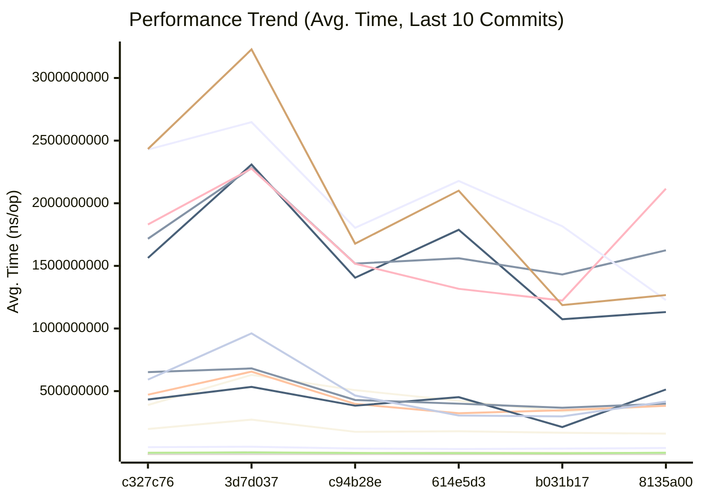
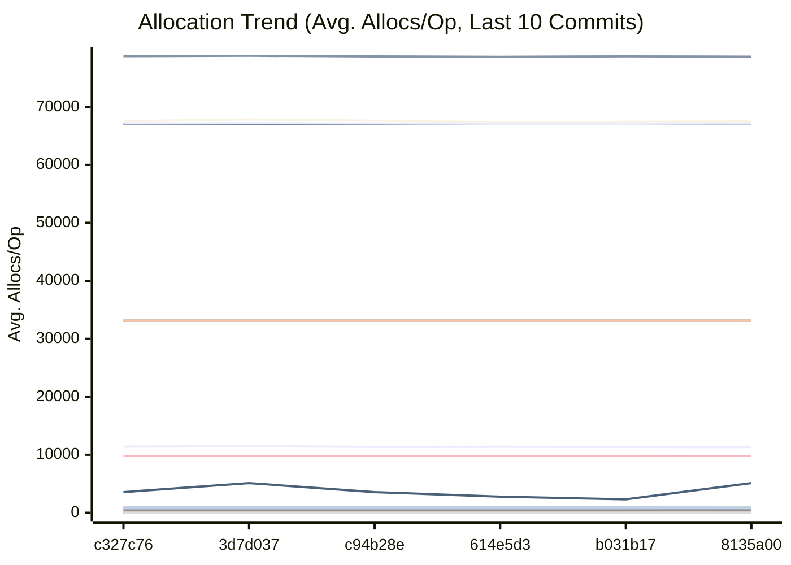

# Performance Benchmarks

This document tracks benchmark performance across commits. The section between
the `BENCHMARK_RESULTS_START/END` markers is auto-generated by the pre-commit
hook; the crypto/OPRF section below is manually maintained.

## How to Read This Document

- **Comparison with previous commit**: `benchstat` output comparing the current
  commit against the previous one. Three tables: **sec/op** (time per operation),
  **B/op** (bytes allocated), **allocs/op** (heap allocations). In each table,
  **lower is better**. `+X%` = regression, `-X%` = improvement, `~` = no
  statistically significant change. `p` is the p-value (p < 0.05 = significant).
- **Latest Benchmark Results**: Single-snapshot table of the current commit's
  averages. Lower values are better across all three columns.
- **Performance Trend plot**: X-axis = commit SHA (left = older, right = newer).
  Y-axis = avg time in ns/op. **Lower lines = faster.** Downward trends are
  improvements; upward spikes are regressions.
- **Memory Trend plot**: Same axes, but Y-axis = avg bytes allocated per op.
  **Lower lines = less memory.** Drops indicate allocation reductions.
- **Allocation Trend plot**: Same axes, but Y-axis = avg heap allocations per op.
  **Lower lines = fewer allocations.** Fewer allocs = less GC pressure.

<!-- BENCHMARK_RESULTS_START -->
## Performance

This section is automatically updated by the pre-commit hook (via .github/scripts/update_readme_with_benchmarks.sh).

### Comparison with previous commit

Each table compares the previous commit (left) to the current commit (right).
**Lower is better** in all three tables. `+X%` = regression, `-X%` = improvement,
`~` = no statistically significant change (p >= 0.05).

- **sec/op**: Time per operation (nanoseconds). Measures raw speed.
- **B/op**: Bytes allocated on the heap per operation. Measures memory usage.
- **allocs/op**: Number of heap allocations per operation. Measures GC pressure.

```
                                      │ /tmp/old_bench_filtered.txt │      /tmp/new_bench_filtered.txt       │
                                      │           sec/op            │    sec/op      vs base                 │
CrushOriginal-8                                        915.7n ± ∞ ¹   1020.0n ± ∞ ¹        ~ (p=1.000 n=1) ²
Placement-8                                            9.688µ ± ∞ ¹   11.354µ ± ∞ ¹        ~ (p=1.000 n=1) ²
PlacementDomainSpread-8                                11.30µ ± ∞ ¹    11.20µ ± ∞ ¹        ~ (p=1.000 n=1) ²
CrushOptimized-8                                       686.2n ± ∞ ¹    633.9n ± ∞ ¹        ~ (p=1.000 n=1) ²
LoadGlobalConfig-8                                     27.40µ ± ∞ ¹    21.24µ ± ∞ ¹        ~ (p=1.000 n=1) ²
HashBytes/1MiB-8                                       6.633m ± ∞ ¹    6.072m ± ∞ ¹        ~ (p=1.000 n=1) ²
HashBytes/64MiB-8                                      515.4m ± ∞ ¹    464.7m ± ∞ ¹        ~ (p=1.000 n=1) ²
HashBytes/256MiB-8                                      1.865 ± ∞ ¹     1.601 ± ∞ ¹        ~ (p=1.000 n=1) ²
HashFile/1MiB-8                                        7.985m ± ∞ ¹    6.073m ± ∞ ¹        ~ (p=1.000 n=1) ²
HashFile/64MiB-8                                       457.0m ± ∞ ¹    336.2m ± ∞ ¹        ~ (p=1.000 n=1) ²
HashFile/256MiB-8                                       1.808 ± ∞ ¹     1.557 ± ∞ ¹        ~ (p=1.000 n=1) ²
PadString-8                                            129.6n ± ∞ ¹    105.3n ± ∞ ¹        ~ (p=1.000 n=1) ²
SanitizeLog/Safe-8                                     569.8n ± ∞ ¹    551.9n ± ∞ ¹        ~ (p=1.000 n=1) ²
SanitizeLog/Unsafe-8                                   1.976µ ± ∞ ¹    1.462µ ± ∞ ¹        ~ (p=1.000 n=1) ²
AWSChunkedReaderSigned-8                               922.6µ ± ∞ ¹    835.6µ ± ∞ ¹        ~ (p=1.000 n=1) ²
AWSChunkedReaderUnsigned-8                             957.2µ ± ∞ ¹    977.7µ ± ∞ ¹        ~ (p=1.000 n=1) ²
LastModifiedHeader_AppendFormat-8                      554.0n ± ∞ ¹    476.8n ± ∞ ¹        ~ (p=1.000 n=1) ²
LastModifiedHeader_Format-8                            739.8n ± ∞ ¹    530.7n ± ∞ ¹        ~ (p=1.000 n=1) ²
FormatListObjectsV2XML_AppendFormat-8                  1.883m ± ∞ ¹    1.270m ± ∞ ¹        ~ (p=1.000 n=1) ²
FormatListObjectsV2XML_OldFormat-8                     951.7µ ± ∞ ¹    744.6µ ± ∞ ¹        ~ (p=1.000 n=1) ²
CheckMetricsAndSwap-8                                  18.73n ± ∞ ¹    15.09n ± ∞ ¹        ~ (p=1.000 n=1) ²
IndexSearch-8                                          4.544n ± ∞ ¹    4.480n ± ∞ ¹        ~ (p=1.000 n=1) ²
IndexDirectTracking-8                                 0.9374n ± ∞ ¹   0.6772n ± ∞ ¹        ~ (p=1.000 n=1) ²
LocalWrite/1MiB-8                                      948.9µ ± ∞ ¹    944.3µ ± ∞ ¹        ~ (p=1.000 n=1) ²
LocalWrite/64MiB-8                                     47.74m ± ∞ ¹    44.14m ± ∞ ¹        ~ (p=1.000 n=1) ²
LocalWrite/256MiB-8                                    202.0m ± ∞ ¹    186.5m ± ∞ ¹        ~ (p=1.000 n=1) ²
ReadVerify/1MiB-8                                      7.811m ± ∞ ¹    5.645m ± ∞ ¹        ~ (p=1.000 n=1) ²
ReadVerify/64MiB-8                                     507.5m ± ∞ ¹    385.0m ± ∞ ¹        ~ (p=1.000 n=1) ²
ReadVerify/256MiB-8                                     1.884 ± ∞ ¹     1.695 ± ∞ ¹        ~ (p=1.000 n=1) ²
TrustedRead/1MiB-8                                     8.252m ± ∞ ¹    7.395m ± ∞ ¹        ~ (p=1.000 n=1) ²
TrustedRead/64MiB-8                                    539.8m ± ∞ ¹    397.5m ± ∞ ¹        ~ (p=1.000 n=1) ²
TrustedRead/256MiB-8                                    2.079 ± ∞ ¹     1.607 ± ∞ ¹        ~ (p=1.000 n=1) ²
S3PutSpool/1MiB-8                                      8.641m ± ∞ ¹    6.831m ± ∞ ¹        ~ (p=1.000 n=1) ²
S3PutSpool/64MiB-8                                     569.8m ± ∞ ¹    490.0m ± ∞ ¹        ~ (p=1.000 n=1) ²
S3PutSpool/256MiB-8                                     2.169 ± ∞ ¹     1.810 ± ∞ ¹        ~ (p=1.000 n=1) ²
geomean                                                701.3µ          598.4µ        -14.68%
¹ need >= 6 samples for confidence interval at level 0.95
² need >= 4 samples to detect a difference at alpha level 0.05

                                      │ /tmp/old_bench_filtered.txt │      /tmp/new_bench_filtered.txt      │
                                      │            B/op             │     B/op       vs base                │
CrushOriginal-8                                         164.0 ± ∞ ¹     164.0 ± ∞ ¹       ~ (p=1.000 n=1) ²
Placement-8                                             352.0 ± ∞ ¹     352.0 ± ∞ ¹       ~ (p=1.000 n=1) ²
PlacementDomainSpread-8                                 352.0 ± ∞ ¹     352.0 ± ∞ ¹       ~ (p=1.000 n=1) ²
CrushOptimized-8                                        0.000 ± ∞ ¹     0.000 ± ∞ ¹       ~ (p=1.000 n=1) ²
LoadGlobalConfig-8                                    1.930Ki ± ∞ ¹   1.930Ki ± ∞ ¹       ~ (p=1.000 n=1) ²
HashBytes/1MiB-8                                        64.00 ± ∞ ¹     64.00 ± ∞ ¹       ~ (p=1.000 n=1) ²
HashBytes/64MiB-8                                       64.00 ± ∞ ¹     64.00 ± ∞ ¹       ~ (p=1.000 n=1) ²
HashBytes/256MiB-8                                      64.00 ± ∞ ¹     64.00 ± ∞ ¹       ~ (p=1.000 n=1) ²
HashFile/1MiB-8                                       32.35Ki ± ∞ ¹   32.35Ki ± ∞ ¹       ~ (p=1.000 n=1) ²
HashFile/64MiB-8                                      32.35Ki ± ∞ ¹   32.35Ki ± ∞ ¹       ~ (p=1.000 n=1) ²
HashFile/256MiB-8                                     32.35Ki ± ∞ ¹   32.35Ki ± ∞ ¹       ~ (p=1.000 n=1) ²
PadString-8                                             64.00 ± ∞ ¹     64.00 ± ∞ ¹       ~ (p=1.000 n=1) ²
SanitizeLog/Safe-8                                      0.000 ± ∞ ¹     0.000 ± ∞ ¹       ~ (p=1.000 n=1) ²
SanitizeLog/Unsafe-8                                    704.0 ± ∞ ¹     704.0 ± ∞ ¹       ~ (p=1.000 n=1) ²
AWSChunkedReaderSigned-8                              11.13Ki ± ∞ ¹   11.08Ki ± ∞ ¹       ~ (p=1.000 n=1) ³
AWSChunkedReaderUnsigned-8                            76.90Ki ± ∞ ¹   76.89Ki ± ∞ ¹       ~ (p=1.000 n=1) ³
LastModifiedHeader_AppendFormat-8                       0.000 ± ∞ ¹     0.000 ± ∞ ¹       ~ (p=1.000 n=1) ²
LastModifiedHeader_Format-8                             32.00 ± ∞ ¹     32.00 ± ∞ ¹       ~ (p=1.000 n=1) ²
FormatListObjectsV2XML_AppendFormat-8                 512.2Ki ± ∞ ¹   512.2Ki ± ∞ ¹       ~ (p=1.000 n=1) ³
FormatListObjectsV2XML_OldFormat-8                    23.44Ki ± ∞ ¹   23.44Ki ± ∞ ¹       ~ (p=1.000 n=1) ²
CheckMetricsAndSwap-8                                   0.000 ± ∞ ¹     0.000 ± ∞ ¹       ~ (p=1.000 n=1) ²
IndexSearch-8                                           0.000 ± ∞ ¹     0.000 ± ∞ ¹       ~ (p=1.000 n=1) ²
IndexDirectTracking-8                                   0.000 ± ∞ ¹     0.000 ± ∞ ¹       ~ (p=1.000 n=1) ²
LocalWrite/1MiB-8                                     65.47Ki ± ∞ ¹   65.47Ki ± ∞ ¹       ~ (p=1.000 n=1) ²
LocalWrite/64MiB-8                                    65.58Ki ± ∞ ¹   65.57Ki ± ∞ ¹       ~ (p=1.000 n=1) ³
LocalWrite/256MiB-8                                   66.06Ki ± ∞ ¹   65.97Ki ± ∞ ¹       ~ (p=1.000 n=1) ³
ReadVerify/1MiB-8                                       496.0 ± ∞ ¹     437.0 ± ∞ ¹       ~ (p=1.000 n=1) ³
ReadVerify/64MiB-8                                    3.474Ki ± ∞ ¹   3.474Ki ± ∞ ¹       ~ (p=1.000 n=1) ²
ReadVerify/256MiB-8                                   9.578Ki ± ∞ ¹   9.578Ki ± ∞ ¹       ~ (p=1.000 n=1) ²
TrustedRead/1MiB-8                                      800.0 ± ∞ ¹     800.0 ± ∞ ¹       ~ (p=1.000 n=1) ²
TrustedRead/64MiB-8                                     800.0 ± ∞ ¹     800.0 ± ∞ ¹       ~ (p=1.000 n=1) ²
TrustedRead/256MiB-8                                    800.0 ± ∞ ¹     800.0 ± ∞ ¹       ~ (p=1.000 n=1) ²
S3PutSpool/1MiB-8                                       447.0 ± ∞ ¹     447.0 ± ∞ ¹       ~ (p=1.000 n=1) ²
S3PutSpool/64MiB-8                                      448.0 ± ∞ ¹     448.0 ± ∞ ¹       ~ (p=1.000 n=1) ²
S3PutSpool/256MiB-8                                     448.0 ± ∞ ¹     448.0 ± ∞ ¹       ~ (p=1.000 n=1) ²
geomean                                                           ⁴                  -0.38%               ⁴
¹ need >= 6 samples for confidence interval at level 0.95
² all samples are equal
³ need >= 4 samples to detect a difference at alpha level 0.05
⁴ summaries must be >0 to compute geomean

                                      │ /tmp/old_bench_filtered.txt │     /tmp/new_bench_filtered.txt      │
                                      │          allocs/op          │  allocs/op    vs base                │
CrushOriginal-8                                         3.000 ± ∞ ¹    3.000 ± ∞ ¹       ~ (p=1.000 n=1) ²
Placement-8                                             6.000 ± ∞ ¹    6.000 ± ∞ ¹       ~ (p=1.000 n=1) ²
PlacementDomainSpread-8                                 6.000 ± ∞ ¹    6.000 ± ∞ ¹       ~ (p=1.000 n=1) ²
CrushOptimized-8                                        0.000 ± ∞ ¹    0.000 ± ∞ ¹       ~ (p=1.000 n=1) ²
LoadGlobalConfig-8                                      58.00 ± ∞ ¹    58.00 ± ∞ ¹       ~ (p=1.000 n=1) ²
HashBytes/1MiB-8                                        1.000 ± ∞ ¹    1.000 ± ∞ ¹       ~ (p=1.000 n=1) ²
HashBytes/64MiB-8                                       1.000 ± ∞ ¹    1.000 ± ∞ ¹       ~ (p=1.000 n=1) ²
HashBytes/256MiB-8                                      1.000 ± ∞ ¹    1.000 ± ∞ ¹       ~ (p=1.000 n=1) ²
HashFile/1MiB-8                                         6.000 ± ∞ ¹    6.000 ± ∞ ¹       ~ (p=1.000 n=1) ²
HashFile/64MiB-8                                        6.000 ± ∞ ¹    6.000 ± ∞ ¹       ~ (p=1.000 n=1) ²
HashFile/256MiB-8                                       6.000 ± ∞ ¹    6.000 ± ∞ ¹       ~ (p=1.000 n=1) ²
PadString-8                                             1.000 ± ∞ ¹    1.000 ± ∞ ¹       ~ (p=1.000 n=1) ²
SanitizeLog/Safe-8                                      0.000 ± ∞ ¹    0.000 ± ∞ ¹       ~ (p=1.000 n=1) ²
SanitizeLog/Unsafe-8                                    1.000 ± ∞ ¹    1.000 ± ∞ ¹       ~ (p=1.000 n=1) ²
AWSChunkedReaderSigned-8                                80.00 ± ∞ ¹    80.00 ± ∞ ¹       ~ (p=1.000 n=1) ²
AWSChunkedReaderUnsigned-8                              15.00 ± ∞ ¹    15.00 ± ∞ ¹       ~ (p=1.000 n=1) ²
LastModifiedHeader_AppendFormat-8                       0.000 ± ∞ ¹    0.000 ± ∞ ¹       ~ (p=1.000 n=1) ²
LastModifiedHeader_Format-8                             1.000 ± ∞ ¹    1.000 ± ∞ ¹       ~ (p=1.000 n=1) ²
FormatListObjectsV2XML_AppendFormat-8                   16.00 ± ∞ ¹    16.00 ± ∞ ¹       ~ (p=1.000 n=1) ²
FormatListObjectsV2XML_OldFormat-8                     1.000k ± ∞ ¹   1.000k ± ∞ ¹       ~ (p=1.000 n=1) ²
CheckMetricsAndSwap-8                                   0.000 ± ∞ ¹    0.000 ± ∞ ¹       ~ (p=1.000 n=1) ²
IndexSearch-8                                           0.000 ± ∞ ¹    0.000 ± ∞ ¹       ~ (p=1.000 n=1) ²
IndexDirectTracking-8                                   0.000 ± ∞ ¹    0.000 ± ∞ ¹       ~ (p=1.000 n=1) ²
LocalWrite/1MiB-8                                       18.00 ± ∞ ¹    18.00 ± ∞ ¹       ~ (p=1.000 n=1) ²
LocalWrite/64MiB-8                                      19.00 ± ∞ ¹    18.00 ± ∞ ¹       ~ (p=1.000 n=1) ³
LocalWrite/256MiB-8                                     22.00 ± ∞ ¹    21.00 ± ∞ ¹       ~ (p=1.000 n=1) ³
ReadVerify/1MiB-8                                       6.000 ± ∞ ¹    6.000 ± ∞ ¹       ~ (p=1.000 n=1) ²
ReadVerify/64MiB-8                                      7.000 ± ∞ ¹    7.000 ± ∞ ¹       ~ (p=1.000 n=1) ²
ReadVerify/256MiB-8                                     10.00 ± ∞ ¹    10.00 ± ∞ ¹       ~ (p=1.000 n=1) ²
TrustedRead/1MiB-8                                      11.00 ± ∞ ¹    11.00 ± ∞ ¹       ~ (p=1.000 n=1) ²
TrustedRead/64MiB-8                                     11.00 ± ∞ ¹    11.00 ± ∞ ¹       ~ (p=1.000 n=1) ²
TrustedRead/256MiB-8                                    11.00 ± ∞ ¹    11.00 ± ∞ ¹       ~ (p=1.000 n=1) ²
S3PutSpool/1MiB-8                                       10.00 ± ∞ ¹    10.00 ± ∞ ¹       ~ (p=1.000 n=1) ²
S3PutSpool/64MiB-8                                      10.00 ± ∞ ¹    10.00 ± ∞ ¹       ~ (p=1.000 n=1) ²
S3PutSpool/256MiB-8                                     10.00 ± ∞ ¹    10.00 ± ∞ ¹       ~ (p=1.000 n=1) ²
geomean                                                           ⁴                 -0.29%               ⁴
¹ need >= 6 samples for confidence interval at level 0.95
² all samples are equal
³ need >= 4 samples to detect a difference at alpha level 0.05
⁴ summaries must be >0 to compute geomean

                           │ /tmp/old_bench_filtered.txt │      /tmp/new_bench_filtered.txt       │
                           │             B/s             │      B/s       vs base                 │
HashBytes/1MiB-8                           150.8Mi ± ∞ ¹   164.7Mi ± ∞ ¹        ~ (p=1.000 n=1) ²
HashBytes/64MiB-8                          124.2Mi ± ∞ ¹   137.7Mi ± ∞ ¹        ~ (p=1.000 n=1) ²
HashBytes/256MiB-8                         137.3Mi ± ∞ ¹   159.9Mi ± ∞ ¹        ~ (p=1.000 n=1) ²
HashFile/1MiB-8                            125.2Mi ± ∞ ¹   164.7Mi ± ∞ ¹        ~ (p=1.000 n=1) ²
HashFile/64MiB-8                           140.0Mi ± ∞ ¹   190.4Mi ± ∞ ¹        ~ (p=1.000 n=1) ²
HashFile/256MiB-8                          141.6Mi ± ∞ ¹   164.4Mi ± ∞ ¹        ~ (p=1.000 n=1) ²
AWSChunkedReaderSigned-8                   68.80Mi ± ∞ ¹   75.97Mi ± ∞ ¹        ~ (p=1.000 n=1) ²
AWSChunkedReaderUnsigned-8                 66.31Mi ± ∞ ¹   64.93Mi ± ∞ ¹        ~ (p=1.000 n=1) ²
LocalWrite/1MiB-8                          1.029Gi ± ∞ ¹   1.034Gi ± ∞ ¹        ~ (p=1.000 n=1) ²
LocalWrite/64MiB-8                         1.309Gi ± ∞ ¹   1.416Gi ± ∞ ¹        ~ (p=1.000 n=1) ²
LocalWrite/256MiB-8                        1.238Gi ± ∞ ¹   1.341Gi ± ∞ ¹        ~ (p=1.000 n=1) ²
ReadVerify/1MiB-8                          128.0Mi ± ∞ ¹   177.2Mi ± ∞ ¹        ~ (p=1.000 n=1) ²
ReadVerify/64MiB-8                         126.1Mi ± ∞ ¹   166.2Mi ± ∞ ¹        ~ (p=1.000 n=1) ²
ReadVerify/256MiB-8                        135.9Mi ± ∞ ¹   151.0Mi ± ∞ ¹        ~ (p=1.000 n=1) ²
TrustedRead/1MiB-8                         121.2Mi ± ∞ ¹   135.2Mi ± ∞ ¹        ~ (p=1.000 n=1) ²
TrustedRead/64MiB-8                        118.6Mi ± ∞ ¹   161.0Mi ± ∞ ¹        ~ (p=1.000 n=1) ²
TrustedRead/256MiB-8                       123.1Mi ± ∞ ¹   159.3Mi ± ∞ ¹        ~ (p=1.000 n=1) ²
S3PutSpool/1MiB-8                          115.7Mi ± ∞ ¹   146.4Mi ± ∞ ¹        ~ (p=1.000 n=1) ²
S3PutSpool/64MiB-8                         112.3Mi ± ∞ ¹   130.6Mi ± ∞ ¹        ~ (p=1.000 n=1) ²
S3PutSpool/256MiB-8                        118.0Mi ± ∞ ¹   141.5Mi ± ∞ ¹        ~ (p=1.000 n=1) ²
geomean                                    167.7Mi         197.4Mi        +17.72%
¹ need >= 6 samples for confidence interval at level 0.95
² need >= 4 samples to detect a difference at alpha level 0.05
```

### Latest Benchmark Results

Single-snapshot of the current commit's averages. **Lower is better** across all
three columns: time (speed), bytes (memory), allocs (GC pressure).


| Benchmark | Avg. Time/Op | Avg. Bytes/Op | Avg. Allocs/Op |
|-----------|--------------|---------------|----------------|
| BenchmarkAWSChunkedReaderSigned-8 | 835570.00 ns/op | 79.66 B/op | 11341.00 allocs/op |
| BenchmarkAWSChunkedReaderUnsigned-8 | 977699.00 ns/op | 68.08 B/op | 78733.00 allocs/op |
| BenchmarkCheckMetricsAndSwap-8 | 15.09 ns/op | 0.00 B/op | 0.00 allocs/op |
| BenchmarkCrushOptimized-8 | 633.90 ns/op | 0.00 B/op | 0.00 allocs/op |
| BenchmarkCrushOriginal-8 | 1020.00 ns/op | 164.00 B/op | 3.00 allocs/op |
| BenchmarkFormatListObjectsV2XML_AppendFormat-8 | 1270213.00 ns/op | 524495.00 B/op | 16.00 allocs/op |
| BenchmarkFormatListObjectsV2XML_OldFormat-8 | 744615.00 ns/op | 24000.00 B/op | 1000.00 allocs/op |
| BenchmarkHashBytes/1MiB-8 | 6072494.00 ns/op | 172.68 B/op | 64.00 allocs/op |
| BenchmarkHashBytes/256MiB-8 | 1600838236.00 ns/op | 167.68 B/op | 64.00 allocs/op |
| BenchmarkHashBytes/64MiB-8 | 464721050.00 ns/op | 144.41 B/op | 64.00 allocs/op |
| BenchmarkHashFile/1MiB-8 | 6072545.00 ns/op | 172.67 B/op | 33128.00 allocs/op |
| BenchmarkHashFile/256MiB-8 | 1557151244.00 ns/op | 172.39 B/op | 33128.00 allocs/op |
| BenchmarkHashFile/64MiB-8 | 336180629.00 ns/op | 199.62 B/op | 33128.00 allocs/op |
| BenchmarkIndexDirectTracking-8 | 0.68 ns/op | 0.00 B/op | 0.00 allocs/op |
| BenchmarkIndexSearch-8 | 4.48 ns/op | 0.00 B/op | 0.00 allocs/op |
| BenchmarkLastModifiedHeader_AppendFormat-8 | 476.80 ns/op | 0.00 B/op | 0.00 allocs/op |
| BenchmarkLastModifiedHeader_Format-8 | 530.70 ns/op | 32.00 B/op | 1.00 allocs/op |
| BenchmarkLoadGlobalConfig-8 | 21243.00 ns/op | 1976.00 B/op | 58.00 allocs/op |
| BenchmarkLocalWrite/1MiB-8 | 944282.00 ns/op | 1110.45 B/op | 67040.00 allocs/op |
| BenchmarkLocalWrite/256MiB-8 | 186460606.00 ns/op | 1439.64 B/op | 67553.00 allocs/op |
| BenchmarkLocalWrite/64MiB-8 | 44142497.00 ns/op | 1520.28 B/op | 67139.00 allocs/op |
| BenchmarkPadString-8 | 105.30 ns/op | 64.00 B/op | 1.00 allocs/op |
| BenchmarkPlacement-8 | 11354.00 ns/op | 352.00 B/op | 6.00 allocs/op |
| BenchmarkPlacementDomainSpread-8 | 11204.00 ns/op | 352.00 B/op | 6.00 allocs/op |
| BenchmarkReadVerify/1MiB-8 | 5644733.00 ns/op | 185.76 B/op | 437.00 allocs/op |
| BenchmarkReadVerify/256MiB-8 | 1695229855.00 ns/op | 158.35 B/op | 9808.00 allocs/op |
| BenchmarkReadVerify/64MiB-8 | 384974247.00 ns/op | 174.32 B/op | 3557.00 allocs/op |
| BenchmarkS3PutSpool/1MiB-8 | 6831278.00 ns/op | 153.50 B/op | 447.00 allocs/op |
| BenchmarkS3PutSpool/256MiB-8 | 1809657163.00 ns/op | 148.33 B/op | 448.00 allocs/op |
| BenchmarkS3PutSpool/64MiB-8 | 490049884.00 ns/op | 136.94 B/op | 448.00 allocs/op |
| BenchmarkSanitizeLog/Safe-8 | 551.90 ns/op | 0.00 B/op | 0.00 allocs/op |
| BenchmarkSanitizeLog/Unsafe-8 | 1462.00 ns/op | 704.00 B/op | 1.00 allocs/op |
| BenchmarkTrustedRead/1MiB-8 | 7395052.00 ns/op | 141.79 B/op | 800.00 allocs/op |
| BenchmarkTrustedRead/256MiB-8 | 1606816652.00 ns/op | 167.06 B/op | 800.00 allocs/op |
| BenchmarkTrustedRead/64MiB-8 | 397487249.00 ns/op | 168.83 B/op | 800.00 allocs/op |


### Performance History

**Legend**

| Color | Benchmark | Description |
|---|---|---|
| 🟢 | CheckMetricsAndSwap | Evaluation of system metrics (CPU/Mem) and mode switching logic |
| 🟤 | CrushOriginal | Original Sage Weil's CRUSH placement algorithm using reflection and float math |
| ⚪ | CrushOptimized | Performance-tuned CRUSH-lite placement algorithm using bitwise shifts and integer math (Rule 19) |
| 🔵 | IndexDirectTracking | Accessing current replication mode via direct slice index (O(1)) |
| 🔴 | IndexSearch | Searching for current replication mode in the order slice using `slices.Index` |
| 🟠 | LoadGlobalConfig | Parsing and loading the `[global]` section from the INI configuration |
| 🟣 | PadString | Padding strings with null characters to a fixed protocol length |
| 🟡 | ParseReplicationOrder | Parsing the CSV-formatted replication order string into an integer slice |

#### Time per Operation (ns/op)

X-axis: commit SHA (left = older, right = newer). Y-axis: avg time in ns/op.
**Lower lines = faster code.** Downward trends are improvements; upward spikes
are regressions to investigate.


```mermaid
xychart-beta
    title "Performance Trend (Avg. Time, Last 10 Commits)"
    x-axis "Commit"
    y-axis "Avg. Time (ns/op)"
    x-axis [c327c76,3d7d037,c94b28e,614e5d3,b031b17,8135a00]
    line "AWSChunkedReaderSigned" [973548,1455699,680259,833482,953309,627888,785988,1067684,922629,835570]
    line "AWSChunkedReaderUnsigned" [1054695,1128789,889133,730853,858757,790951,977586,1009938,957235,977699]
    line "CheckMetricsAndSwap" [19,38,17,10,13,15,17,19,19,15]
    line "CrushOptimized" [643,1042,685,798,468,532,465,1105,686,634]
    line "CrushOriginal" [1307,2029,855,1268,698,834,795,4070,916,1020]
    line "FormatListObjectsV2XML_AppendFormat" [1630321,4600271,1782191,1061116,1008647,1406590,1275364,2945065,1883129,1270213]
    line "FormatListObjectsV2XML_OldFormat" [888288,1357791,907084,473930,533866,813796,870950,1231705,951687,744615]
    line "HashBytes/1MiB" [6664907,7640824,5383828,7555000,5598473,4921734,5879995,7762528,6632796,6072494]
    line "HashBytes/256MiB" [1563281181,2308810918,1405443275,1788061102,1074265335,1131266592,1293022873,1911922639,1864794800,1600838236]
    line "HashBytes/64MiB" [389285110,629622654,507641214,422715939,338237103,382860244,372987075,500199690,515415655,464721050]
    line "HashFile/1MiB" [7078150,8690518,5618671,6533318,4172609,6261739,5169082,7925836,7984742,6072545]
    line "HashFile/256MiB" [1716532942,2281655194,1518211227,1560936348,1431277931,1624300639,1432425639,2277372507,1808278202,1557151244]
    line "HashFile/64MiB" [471436906,655531538,397822488,323633746,347435470,383484634,407202955,631755332,456982643,336180629]
    line "IndexDirectTracking" [1,1,1,1,1,1,1,1,1,1]
    line "IndexSearch" [4,5,5,4,4,4,5,5,5,4]
    line "LastModifiedHeader_AppendFormat" [638,744,453,385,315,376,542,692,554,477]
    line "LastModifiedHeader_Format" [695,1046,635,526,444,488,574,945,740,531]
    line "LoadGlobalConfig" [22438,33068,21404,21459,15616,14400,18548,33096,27395,21243]
    line "LocalWrite/1MiB" [1395534,1103659,782921,673496,973167,928144,1116026,1101952,948941,944282]
    line "LocalWrite/256MiB" [197917420,272351029,175219427,179514948,167743774,160436947,185677716,237694458,201951766,186460606]
    line "LocalWrite/64MiB" [52341255,56218123,42014368,37648886,40720206,46095057,61144515,51244002,47739884,44142497]
    line "PadString" [165,205,86,67,85,80,88,254,130,105]
    line "ParseReplicationOrder_NoPrealloc" [350,349,357,354,345,225,229,165,232,234]
    line "ParseReplicationOrder_Prealloc" [229,231,237,234,229,108,107,80,110,109]
    line "Placement" [10527,25580,11321,10377,7200,8789,8100,27755,9688,11354]
    line "PlacementDomainSpread" [11049,18437,11792,9468,8229,9655,8934,18491,11295,11204]
    line "ReadVerify/1MiB" [6689386,12183182,5670392,7713170,4757418,5869903,8481402,7559053,7811454,5644733]
    line "ReadVerify/256MiB" [1830120119,2276631953,1517577657,1316685724,1223335569,2116170500,1781612989,2200381287,1884111924,1695229855]
    line "ReadVerify/64MiB" [432795151,533889680,383828668,451931212,213251291,512922822,518387680,545034562,507474576,384974247]
    line "S3PutSpool/1MiB" [9491833,12330195,7822144,8408058,8591213,6157166,6498512,9327955,8640777,6831278]
    line "S3PutSpool/256MiB" [2428268969,2647654672,1803968295,2177507350,1816522977,1227464198,1869122530,2351294741,2169231306,1809657163]
    line "S3PutSpool/64MiB" [651666227,681227498,429216770,399626051,367182715,399702230,433842837,576056595,569773006,490049884]
    line "SanitizeLog/Safe" [639,645,428,331,547,453,464,721,570,552]
    line "SanitizeLog/Unsafe" [2105,3077,1405,1260,1471,1234,1310,2660,1976,1462]
    line "TrustedRead/1MiB" [7463250,9671314,5650216,4830214,4254033,7751297,7357692,9625274,8251662,7395052]
    line "TrustedRead/256MiB" [2433008029,3228071339,1677679418,2100324369,1186508654,1267006234,1480761171,2120164443,2079407950,1606816652]
    line "TrustedRead/64MiB" [591536062,961059323,465018339,305338723,298647819,415837736,464687610,569925858,539820546,397487249]
```

#### Memory per Operation (B/op)

X-axis: commit SHA. Y-axis: avg bytes allocated per op.
**Lower lines = less memory.** Drops indicate allocation reductions.


```mermaid
xychart-beta
    title "Memory Trend (Avg. Bytes/Op, Last 10 Commits)"
    x-axis "Commit"
    y-axis "Avg. Bytes/Op"
    x-axis [c327c76,3d7d037,c94b28e,614e5d3,b031b17,8135a00]
    line "AWSChunkedReaderSigned" [68,46,98,80,70,106,85,62,72,80]
    line "AWSChunkedReaderUnsigned" [63,59,75,91,78,84,68,66,70,68]
    line "CheckMetricsAndSwap" [0,0,0,0,0,0,0,0,0,0]
    line "CrushOptimized" [0,0,0,0,0,0,0,0,0,0]
    line "CrushOriginal" [164,164,164,164,164,164,164,164,164,164]
    line "FormatListObjectsV2XML_AppendFormat" [524552,524871,524558,524474,524487,524493,524491,524618,524521,524495]
    line "FormatListObjectsV2XML_OldFormat" [24000,24000,24000,24000,24000,24000,24000,24000,24000,24000]
    line "HashBytes/1MiB" [157,137,195,139,187,213,178,135,158,173]
    line "HashBytes/256MiB" [172,116,191,150,250,237,208,140,144,168]
    line "HashBytes/64MiB" [172,107,132,159,198,175,180,134,130,144]
    line "HashFile/1MiB" [148,121,187,160,251,167,203,132,131,173]
    line "HashFile/256MiB" [156,118,177,172,188,165,187,118,148,172]
    line "HashFile/64MiB" [142,102,169,207,193,175,165,106,147,200]
    line "IndexDirectTracking" [0,0,0,0,0,0,0,0,0,0]
    line "IndexSearch" [0,0,0,0,0,0,0,0,0,0]
    line "LastModifiedHeader_AppendFormat" [0,0,0,0,0,0,0,0,0,0]
    line "LastModifiedHeader_Format" [32,32,32,32,32,32,32,32,32,32]
    line "LoadGlobalConfig" [1976,1976,1976,1976,1976,1976,1976,1976,1976,1976]
    line "LocalWrite/1MiB" [751,950,1339,1557,1077,1130,940,952,1105,1110]
    line "LocalWrite/256MiB" [1356,986,1532,1495,1600,1673,1446,1129,1329,1440]
    line "LocalWrite/64MiB" [1282,1194,1597,1782,1648,1456,1098,1310,1406,1520]
    line "PadString" [64,64,64,64,64,64,64,64,64,64]
    line "ParseReplicationOrder_NoPrealloc" [408,408,408,408,408,248,248,248,248,248]
    line "ParseReplicationOrder_Prealloc" [240,240,240,240,240,80,80,80,80,80]
    line "Placement" [352,352,352,352,352,352,352,352,352,352]
    line "PlacementDomainSpread" [352,352,352,352,352,352,352,352,352,352]
    line "ReadVerify/1MiB" [157,86,185,136,220,179,124,139,134,186]
    line "ReadVerify/256MiB" [147,118,177,204,219,127,151,122,142,158]
    line "ReadVerify/64MiB" [155,126,175,148,315,131,129,123,132,174]
    line "S3PutSpool/1MiB" [110,85,134,125,122,170,161,112,121,154]
    line "S3PutSpool/256MiB" [111,101,149,123,148,219,144,114,124,148]
    line "S3PutSpool/64MiB" [103,99,156,168,183,168,155,116,118,137]
    line "SanitizeLog/Safe" [0,0,0,0,0,0,0,0,0,0]
    line "SanitizeLog/Unsafe" [704,704,704,704,704,704,704,704,704,704]
    line "TrustedRead/1MiB" [140,108,186,217,246,135,143,109,127,142]
    line "TrustedRead/256MiB" [110,83,160,128,226,212,181,127,129,167]
    line "TrustedRead/64MiB" [113,70,144,220,225,161,144,118,124,169]
```

#### Allocations per Operation (allocs/op)

X-axis: commit SHA. Y-axis: avg heap allocations per op.
**Lower lines = fewer allocations.** Fewer allocs = less GC pressure.


```mermaid
xychart-beta
    title "Allocation Trend (Avg. Allocs/Op, Last 10 Commits)"
    x-axis "Commit"
    y-axis "Avg. Allocs/Op"
    x-axis [c327c76,3d7d037,c94b28e,614e5d3,b031b17,8135a00]
    line "AWSChunkedReaderSigned" [11392,11480,11346,11370,11345,11319,11351,11392,11401,11341]
    line "AWSChunkedReaderUnsigned" [78742,78802,78690,78621,78704,78640,78777,78804,78750,78733]
    line "CheckMetricsAndSwap" [0,0,0,0,0,0,0,0,0,0]
    line "CrushOptimized" [0,0,0,0,0,0,0,0,0,0]
    line "CrushOriginal" [3,3,3,3,3,3,3,3,3,3]
    line "FormatListObjectsV2XML_AppendFormat" [16,16,16,16,16,16,16,16,16,16]
    line "FormatListObjectsV2XML_OldFormat" [1000,1000,1000,1000,1000,1000,1000,1000,1000,1000]
    line "HashBytes/1MiB" [64,64,64,64,64,64,64,64,64,64]
    line "HashBytes/256MiB" [64,64,64,64,64,64,64,64,64,64]
    line "HashBytes/64MiB" [64,64,64,64,64,64,64,64,64,64]
    line "HashFile/1MiB" [33128,33128,33128,33128,33128,33128,33128,33128,33128,33128]
    line "HashFile/256MiB" [33128,33128,33128,33128,33128,33128,33128,33128,33128,33128]
    line "HashFile/64MiB" [33128,33128,33128,33128,33128,33128,33128,33128,33128,33128]
    line "IndexDirectTracking" [0,0,0,0,0,0,0,0,0,0]
    line "IndexSearch" [0,0,0,0,0,0,0,0,0,0]
    line "LastModifiedHeader_AppendFormat" [0,0,0,0,0,0,0,0,0,0]
    line "LastModifiedHeader_Format" [1,1,1,1,1,1,1,1,1,1]
    line "LoadGlobalConfig" [58,58,58,58,58,58,58,58,58,58]
    line "LocalWrite/1MiB" [67042,67042,67033,67031,67039,67040,67044,67048,67040,67040]
    line "LocalWrite/256MiB" [67537,67838,67598,67348,67405,67488,67564,67569,67644,67553]
    line "LocalWrite/64MiB" [67134,67169,67134,67099,67099,67127,67078,67158,67158,67139]
    line "PadString" [1,1,1,1,1,1,1,1,1,1]
    line "ParseReplicationOrder_NoPrealloc" [6,6,6,6,6,5,5,5,5,5]
    line "ParseReplicationOrder_Prealloc" [2,2,2,2,2,1,1,1,1,1]
    line "Placement" [6,6,6,6,6,6,6,6,6,6]
    line "PlacementDomainSpread" [6,6,6,6,6,6,6,6,6,6]
    line "ReadVerify/1MiB" [493,526,438,437,474,439,490,440,496,437]
    line "ReadVerify/256MiB" [9808,9808,9808,9808,9808,9808,9808,9808,9808,9808]
    line "ReadVerify/64MiB" [3557,5120,3557,2776,2307,5120,3557,5120,3557,3557]
    line "S3PutSpool/1MiB" [448,448,448,447,448,447,447,447,447,447]
    line "S3PutSpool/256MiB" [448,448,448,448,448,448,448,448,448,448]
    line "S3PutSpool/64MiB" [448,448,448,448,448,448,448,448,448,448]
    line "SanitizeLog/Safe" [0,0,0,0,0,0,0,0,0,0]
    line "SanitizeLog/Unsafe" [1,1,1,1,1,1,1,1,1,1]
    line "TrustedRead/1MiB" [800,800,800,800,800,858,800,800,800,800]
    line "TrustedRead/256MiB" [800,800,800,800,800,800,800,800,800,800]
    line "TrustedRead/64MiB" [800,800,800,800,800,800,800,800,800,800]
```
<!-- BENCHMARK_RESULTS_END -->

### E2EE + OPRF overhead

The sections above are auto-generated and cover the hot-path benchmarks. The
crypto/OPRF work is measured separately; figures below are from `go test -bench`
on the crypto module and are intentionally placed outside the auto-managed block
so they persist.

**Lower is better** across all columns. These benchmarks run on `src/crypto` only
(not tracked in the auto-generated plots above).

| Benchmark | What it measures | Avg. Time/Op | Avg. Bytes/Op | Avg. Allocs/Op |
|-----------|------------------|--------------|---------------|----------------|
| EncryptStream | AES-GCM-256 chunked encryption (64KB input) | ~63 µs | 167 KB | 14 |
| DecryptStream | AES-GCM-256 chunked decryption (64KB input) | ~54 µs | 136 KB | 13 |
| DeriveKey | HKDF-SHA256 key derivation per tenant | ~3.5 µs | 1.3 KB | 18 |
| OPRFCombineThreshold3 | Threshold-3 OPRF combine + unblind (Ristretto255) | ~530 µs | 2.3 KB | 62 |

With `encryption_enabled`, every byte passes through AES-GCM-256 streaming at
~800-1200 MB/s (chunk-bounded memory). The streaming format is **StreamVersion
v4 (issue #824)** with a self-describing chunk size: the default 4096-byte
chunk preserves prior throughput, and the chunk size can be raised/lowered via
`SetStreamChunkSize` within `[512, 4128]` for latency/memory trade-offs without
a wire change in framing beyond the 2-byte header field (v3/v2 blobs still
decode). The threshold OPRF is evaluated **once per
upload/download**, on the dedup tag only (never per chunk):
`OPRFCombineThreshold3` measures a one-time ~0.53 ms client-side combine/unblind
for threshold-3, plus one round-trip per daemon share. This is negligible against
network/disk I/O and does not affect streaming throughput. When `oprf_enabled =
false`, the OPRF path is skipped entirely and behavior is identical to the
pre-OPRF encryption path (backward compatible).
