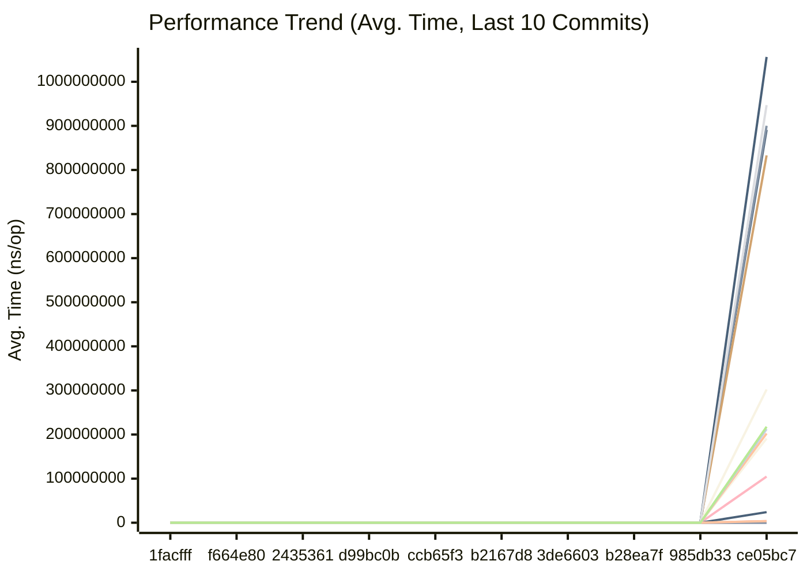
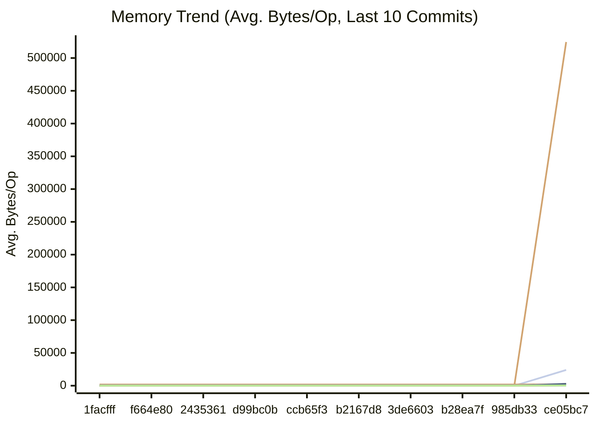
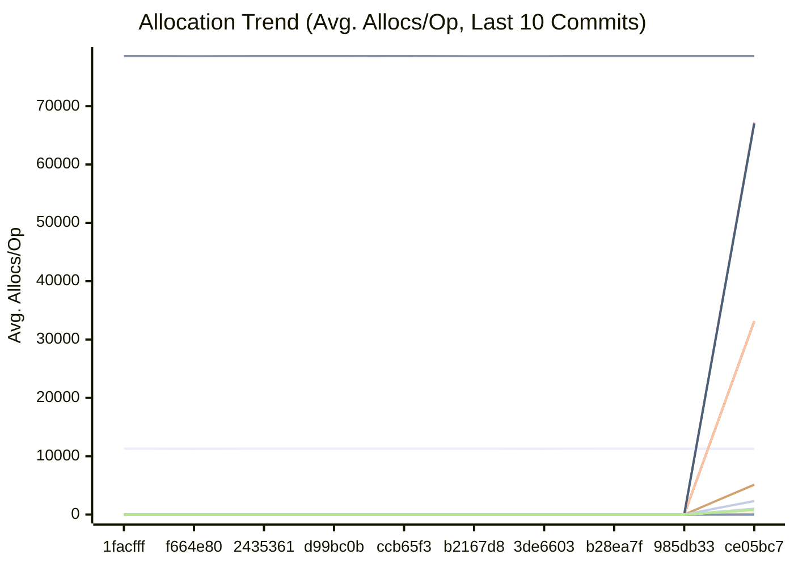

# Performance Benchmarks

This document tracks benchmark performance across commits. The section between
the `BENCHMARK_RESULTS_START/END` markers is auto-generated by the pre-commit
hook; the crypto/OPRF section below is manually maintained.

## How to Read This Document

- **Comparison with previous commit**: `benchstat` output comparing the current
  commit against the previous one. Three tables: **sec/op** (time per operation),
  **B/op** (bytes allocated), **allocs/op** (heap allocations). In each table,
  **lower is better**. `+X%` = regression, `-X%` = improvement, `~` = no
  statistically significant change. `p` is the p-value (p < 0.05 = significant).
- **Latest Benchmark Results**: Single-snapshot table of the current commit's
  averages. Lower values are better across all three columns.
- **Performance Trend plot**: X-axis = commit SHA (left = older, right = newer).
  Y-axis = avg time in ns/op. **Lower lines = faster.** Downward trends are
  improvements; upward spikes are regressions.
- **Memory Trend plot**: Same axes, but Y-axis = avg bytes allocated per op.
  **Lower lines = less memory.** Drops indicate allocation reductions.
- **Allocation Trend plot**: Same axes, but Y-axis = avg heap allocations per op.
  **Lower lines = fewer allocations.** Fewer allocs = less GC pressure.

<!-- BENCHMARK_RESULTS_START -->
## Performance

This section is automatically updated by our GitHub Actions workflow.

### Comparison with previous commit

Each table compares the previous commit (left) to the current commit (right).
**Lower is better** in all three tables. `+X%` = regression, `-X%` = improvement,
`~` = no statistically significant change (p >= 0.05).

- **sec/op**: Time per operation (nanoseconds). Measures raw speed.
- **B/op**: Bytes allocated on the heap per operation. Measures memory usage.
- **allocs/op**: Number of heap allocations per operation. Measures GC pressure.

```
                                      │ /tmp/old_bench_filtered.txt │      /tmp/new_bench_filtered.txt      │
                                      │           sec/op            │    sec/op      vs base                │
CrushOriginal-8                                        487.9n ± ∞ ¹    388.6n ± ∞ ¹       ~ (p=1.000 n=1) ²
CrushOptimized-8                                       309.6n ± ∞ ¹    295.9n ± ∞ ¹       ~ (p=1.000 n=1) ²
LoadGlobalConfig-8                                     9.116µ ± ∞ ¹    8.373µ ± ∞ ¹       ~ (p=1.000 n=1) ²
PadString-8                                            43.07n ± ∞ ¹    40.92n ± ∞ ¹       ~ (p=1.000 n=1) ²
SanitizeLog/Safe-8                                     260.8n ± ∞ ¹    221.8n ± ∞ ¹       ~ (p=1.000 n=1) ²
SanitizeLog/Unsafe-8                                   770.3n ± ∞ ¹    673.9n ± ∞ ¹       ~ (p=1.000 n=1) ²
AWSChunkedReaderSigned-8                               456.2µ ± ∞ ¹    433.8µ ± ∞ ¹       ~ (p=1.000 n=1) ²
AWSChunkedReaderUnsigned-8                             436.7µ ± ∞ ¹    410.6µ ± ∞ ¹       ~ (p=1.000 n=1) ²
CheckMetricsAndSwap-8                                  9.409n ± ∞ ¹    7.989n ± ∞ ¹       ~ (p=1.000 n=1) ²
IndexSearch-8                                          1.613n ± ∞ ¹    2.699n ± ∞ ¹       ~ (p=1.000 n=1) ²
IndexDirectTracking-8                                 0.3882n ± ∞ ¹   0.3306n ± ∞ ¹       ~ (p=1.000 n=1) ²
Placement-8                                                            4.402µ ± ∞ ¹
PlacementDomainSpread-8                                                4.713µ ± ∞ ¹
HashBytes/1MiB-8                                                       2.943m ± ∞ ¹
HashBytes/64MiB-8                                                      191.2m ± ∞ ¹
HashBytes/256MiB-8                                                     890.9m ± ∞ ¹
HashFile/1MiB-8                                                        3.438m ± ∞ ¹
HashFile/64MiB-8                                                       202.4m ± ∞ ¹
HashFile/256MiB-8                                                      900.2m ± ∞ ¹
FormatListObjectsV2XML_AppendFormat-8                                  585.5µ ± ∞ ¹
FormatListObjectsV2XML_OldFormat-8                                     385.9µ ± ∞ ¹
LocalWrite/1MiB-8                                                      386.3µ ± ∞ ¹
LocalWrite/64MiB-8                                                     24.07m ± ∞ ¹
LocalWrite/256MiB-8                                                    104.7m ± ∞ ¹
ReadVerify/1MiB-8                                                      3.322m ± ∞ ¹
ReadVerify/64MiB-8                                                     212.5m ± ∞ ¹
ReadVerify/256MiB-8                                                    833.0m ± ∞ ¹
TrustedRead/1MiB-8                                                     3.531m ± ∞ ¹
TrustedRead/64MiB-8                                                    217.6m ± ∞ ¹
TrustedRead/256MiB-8                                                   947.1m ± ∞ ¹
S3PutSpool/1MiB-8                                                      3.659m ± ∞ ¹
S3PutSpool/64MiB-8                                                     302.1m ± ∞ ¹
S3PutSpool/256MiB-8                                                     1.056 ± ∞ ¹
geomean                                                362.0n          455.5µ        -5.53%
¹ need >= 6 samples for confidence interval at level 0.95
² need >= 4 samples to detect a difference at alpha level 0.05

                                      │ /tmp/old_bench_filtered.txt │      /tmp/new_bench_filtered.txt      │
                                      │            B/op             │     B/op       vs base                │
CrushOriginal-8                                         164.0 ± ∞ ¹     164.0 ± ∞ ¹       ~ (p=1.000 n=1) ²
CrushOptimized-8                                        0.000 ± ∞ ¹     0.000 ± ∞ ¹       ~ (p=1.000 n=1) ²
LoadGlobalConfig-8                                    1.805Ki ± ∞ ¹   1.930Ki ± ∞ ¹       ~ (p=1.000 n=1) ³
PadString-8                                             64.00 ± ∞ ¹     64.00 ± ∞ ¹       ~ (p=1.000 n=1) ²
SanitizeLog/Safe-8                                      0.000 ± ∞ ¹     0.000 ± ∞ ¹       ~ (p=1.000 n=1) ²
SanitizeLog/Unsafe-8                                    704.0 ± ∞ ¹     704.0 ± ∞ ¹       ~ (p=1.000 n=1) ²
AWSChunkedReaderSigned-8                              11.02Ki ± ∞ ¹   11.01Ki ± ∞ ¹       ~ (p=1.000 n=1) ³
AWSChunkedReaderUnsigned-8                            76.73Ki ± ∞ ¹   76.73Ki ± ∞ ¹       ~ (p=1.000 n=1) ³
CheckMetricsAndSwap-8                                   0.000 ± ∞ ¹     0.000 ± ∞ ¹       ~ (p=1.000 n=1) ²
IndexSearch-8                                           0.000 ± ∞ ¹     0.000 ± ∞ ¹       ~ (p=1.000 n=1) ²
IndexDirectTracking-8                                   0.000 ± ∞ ¹     0.000 ± ∞ ¹       ~ (p=1.000 n=1) ²
Placement-8                                                             352.0 ± ∞ ¹
PlacementDomainSpread-8                                                 352.0 ± ∞ ¹
HashBytes/1MiB-8                                                        64.00 ± ∞ ¹
HashBytes/64MiB-8                                                       64.00 ± ∞ ¹
HashBytes/256MiB-8                                                      64.00 ± ∞ ¹
HashFile/1MiB-8                                                       32.35Ki ± ∞ ¹
HashFile/64MiB-8                                                      32.35Ki ± ∞ ¹
HashFile/256MiB-8                                                     32.35Ki ± ∞ ¹
FormatListObjectsV2XML_AppendFormat-8                                 512.1Ki ± ∞ ¹
FormatListObjectsV2XML_OldFormat-8                                    23.44Ki ± ∞ ¹
LocalWrite/1MiB-8                                                     65.46Ki ± ∞ ¹
LocalWrite/64MiB-8                                                    65.47Ki ± ∞ ¹
LocalWrite/256MiB-8                                                   65.71Ki ± ∞ ¹
ReadVerify/1MiB-8                                                       435.0 ± ∞ ¹
ReadVerify/64MiB-8                                                    2.253Ki ± ∞ ¹
ReadVerify/256MiB-8                                                   5.000Ki ± ∞ ¹
TrustedRead/1MiB-8                                                      800.0 ± ∞ ¹
TrustedRead/64MiB-8                                                     800.0 ± ∞ ¹
TrustedRead/256MiB-8                                                    800.0 ± ∞ ¹
S3PutSpool/1MiB-8                                                       447.0 ± ∞ ¹
S3PutSpool/64MiB-8                                                      448.0 ± ∞ ¹
S3PutSpool/256MiB-8                                                     448.0 ± ∞ ¹
geomean                                                           ⁴                  +0.60%               ⁴
¹ need >= 6 samples for confidence interval at level 0.95
² all samples are equal
³ need >= 4 samples to detect a difference at alpha level 0.05
⁴ summaries must be >0 to compute geomean

                                      │ /tmp/old_bench_filtered.txt │     /tmp/new_bench_filtered.txt      │
                                      │          allocs/op          │  allocs/op    vs base                │
CrushOriginal-8                                         3.000 ± ∞ ¹    3.000 ± ∞ ¹       ~ (p=1.000 n=1) ²
CrushOptimized-8                                        0.000 ± ∞ ¹    0.000 ± ∞ ¹       ~ (p=1.000 n=1) ²
LoadGlobalConfig-8                                      54.00 ± ∞ ¹    58.00 ± ∞ ¹       ~ (p=1.000 n=1) ³
PadString-8                                             1.000 ± ∞ ¹    1.000 ± ∞ ¹       ~ (p=1.000 n=1) ²
SanitizeLog/Safe-8                                      0.000 ± ∞ ¹    0.000 ± ∞ ¹       ~ (p=1.000 n=1) ²
SanitizeLog/Unsafe-8                                    1.000 ± ∞ ¹    1.000 ± ∞ ¹       ~ (p=1.000 n=1) ²
AWSChunkedReaderSigned-8                                80.00 ± ∞ ¹    80.00 ± ∞ ¹       ~ (p=1.000 n=1) ²
AWSChunkedReaderUnsigned-8                              15.00 ± ∞ ¹    15.00 ± ∞ ¹       ~ (p=1.000 n=1) ²
CheckMetricsAndSwap-8                                   0.000 ± ∞ ¹    0.000 ± ∞ ¹       ~ (p=1.000 n=1) ²
IndexSearch-8                                           0.000 ± ∞ ¹    0.000 ± ∞ ¹       ~ (p=1.000 n=1) ²
IndexDirectTracking-8                                   0.000 ± ∞ ¹    0.000 ± ∞ ¹       ~ (p=1.000 n=1) ²
Placement-8                                                            6.000 ± ∞ ¹
PlacementDomainSpread-8                                                6.000 ± ∞ ¹
HashBytes/1MiB-8                                                       1.000 ± ∞ ¹
HashBytes/64MiB-8                                                      1.000 ± ∞ ¹
HashBytes/256MiB-8                                                     1.000 ± ∞ ¹
HashFile/1MiB-8                                                        6.000 ± ∞ ¹
HashFile/64MiB-8                                                       6.000 ± ∞ ¹
HashFile/256MiB-8                                                      6.000 ± ∞ ¹
FormatListObjectsV2XML_AppendFormat-8                                  16.00 ± ∞ ¹
FormatListObjectsV2XML_OldFormat-8                                    1.000k ± ∞ ¹
LocalWrite/1MiB-8                                                      19.00 ± ∞ ¹
LocalWrite/64MiB-8                                                     18.00 ± ∞ ¹
LocalWrite/256MiB-8                                                    19.00 ± ∞ ¹
ReadVerify/1MiB-8                                                      6.000 ± ∞ ¹
ReadVerify/64MiB-8                                                     6.000 ± ∞ ¹
ReadVerify/256MiB-8                                                    8.000 ± ∞ ¹
TrustedRead/1MiB-8                                                     11.00 ± ∞ ¹
TrustedRead/64MiB-8                                                    11.00 ± ∞ ¹
TrustedRead/256MiB-8                                                   11.00 ± ∞ ¹
S3PutSpool/1MiB-8                                                      10.00 ± ∞ ¹
S3PutSpool/64MiB-8                                                     10.00 ± ∞ ¹
S3PutSpool/256MiB-8                                                    10.00 ± ∞ ¹
geomean                                                           ⁴                 +0.65%               ⁴
¹ need >= 6 samples for confidence interval at level 0.95
² all samples are equal
³ need >= 4 samples to detect a difference at alpha level 0.05
⁴ summaries must be >0 to compute geomean

                           │ /tmp/old_bench_filtered.txt │      /tmp/new_bench_filtered.txt      │
                           │             B/s             │      B/s       vs base                │
AWSChunkedReaderSigned-8                   139.1Mi ± ∞ ¹   146.3Mi ± ∞ ¹       ~ (p=1.000 n=1) ²
AWSChunkedReaderUnsigned-8                 145.3Mi ± ∞ ¹   154.6Mi ± ∞ ¹       ~ (p=1.000 n=1) ²
HashBytes/1MiB-8                                           339.8Mi ± ∞ ¹
HashBytes/64MiB-8                                          334.8Mi ± ∞ ¹
HashBytes/256MiB-8                                         287.3Mi ± ∞ ¹
HashFile/1MiB-8                                            290.8Mi ± ∞ ¹
HashFile/64MiB-8                                           316.2Mi ± ∞ ¹
HashFile/256MiB-8                                          284.4Mi ± ∞ ¹
LocalWrite/1MiB-8                                          2.528Gi ± ∞ ¹
LocalWrite/64MiB-8                                         2.597Gi ± ∞ ¹
LocalWrite/256MiB-8                                        2.387Gi ± ∞ ¹
ReadVerify/1MiB-8                                          301.0Mi ± ∞ ¹
ReadVerify/64MiB-8                                         301.2Mi ± ∞ ¹
ReadVerify/256MiB-8                                        307.3Mi ± ∞ ¹
TrustedRead/1MiB-8                                         283.2Mi ± ∞ ¹
TrustedRead/64MiB-8                                        294.2Mi ± ∞ ¹
TrustedRead/256MiB-8                                       270.3Mi ± ∞ ¹
S3PutSpool/1MiB-8                                          273.3Mi ± ∞ ¹
S3PutSpool/64MiB-8                                         211.9Mi ± ∞ ¹
S3PutSpool/256MiB-8                                        242.4Mi ± ∞ ¹
geomean                                    142.2Mi         374.0Mi        +5.77%
¹ need >= 6 samples for confidence interval at level 0.95
² need >= 4 samples to detect a difference at alpha level 0.05
```

### Latest Benchmark Results

Single-snapshot of the current commit's averages. **Lower is better** across all
three columns: time (speed), bytes (memory), allocs (GC pressure).


| Benchmark | Avg. Time/Op | Avg. Bytes/Op | Avg. Allocs/Op |
|-----------|--------------|---------------|----------------|
| BenchmarkAWSChunkedReaderSigned-8 | 433775.00 ns/op | 153.44 B/op | 11277.00 allocs/op |
| BenchmarkAWSChunkedReaderUnsigned-8 | 410570.00 ns/op | 162.12 B/op | 78572.00 allocs/op |
| BenchmarkCheckMetricsAndSwap-8 | 7.99 ns/op | 0.00 B/op | 0.00 allocs/op |
| BenchmarkCrushOptimized-8 | 295.90 ns/op | 0.00 B/op | 0.00 allocs/op |
| BenchmarkCrushOriginal-8 | 388.60 ns/op | 164.00 B/op | 3.00 allocs/op |
| BenchmarkFormatListObjectsV2XML_AppendFormat-8 | 585500.00 ns/op | 524440.00 B/op | 16.00 allocs/op |
| BenchmarkFormatListObjectsV2XML_OldFormat-8 | 385936.00 ns/op | 24000.00 B/op | 1000.00 allocs/op |
| BenchmarkHashBytes/1MiB-8 | 2943044.00 ns/op | 356.29 B/op | 64.00 allocs/op |
| BenchmarkHashBytes/256MiB-8 | 890920045.00 ns/op | 301.30 B/op | 64.00 allocs/op |
| BenchmarkHashBytes/64MiB-8 | 191159849.00 ns/op | 351.06 B/op | 64.00 allocs/op |
| BenchmarkHashFile/1MiB-8 | 3438255.00 ns/op | 304.97 B/op | 33128.00 allocs/op |
| BenchmarkHashFile/256MiB-8 | 900152012.00 ns/op | 298.21 B/op | 33128.00 allocs/op |
| BenchmarkHashFile/64MiB-8 | 202378726.00 ns/op | 331.60 B/op | 33128.00 allocs/op |
| BenchmarkIndexDirectTracking-8 | 0.33 ns/op | 0.00 B/op | 0.00 allocs/op |
| BenchmarkIndexSearch-8 | 2.70 ns/op | 0.00 B/op | 0.00 allocs/op |
| BenchmarkLoadGlobalConfig-8 | 8373.00 ns/op | 1976.00 B/op | 58.00 allocs/op |
| BenchmarkLocalWrite/1MiB-8 | 386344.00 ns/op | 2714.10 B/op | 67030.00 allocs/op |
| BenchmarkLocalWrite/256MiB-8 | 104739454.00 ns/op | 2562.89 B/op | 67292.00 allocs/op |
| BenchmarkLocalWrite/64MiB-8 | 24065226.00 ns/op | 2788.62 B/op | 67046.00 allocs/op |
| BenchmarkPadString-8 | 40.92 ns/op | 64.00 B/op | 1.00 allocs/op |
| BenchmarkPlacement-8 | 4402.00 ns/op | 352.00 B/op | 6.00 allocs/op |
| BenchmarkPlacementDomainSpread-8 | 4713.00 ns/op | 352.00 B/op | 6.00 allocs/op |
| BenchmarkReadVerify/1MiB-8 | 3322226.00 ns/op | 315.62 B/op | 435.00 allocs/op |
| BenchmarkReadVerify/256MiB-8 | 833047448.00 ns/op | 322.23 B/op | 5120.00 allocs/op |
| BenchmarkReadVerify/64MiB-8 | 212456699.00 ns/op | 315.87 B/op | 2307.00 allocs/op |
| BenchmarkS3PutSpool/1MiB-8 | 3659136.00 ns/op | 286.56 B/op | 447.00 allocs/op |
| BenchmarkS3PutSpool/256MiB-8 | 1056311038.00 ns/op | 254.13 B/op | 448.00 allocs/op |
| BenchmarkS3PutSpool/64MiB-8 | 302092155.00 ns/op | 222.15 B/op | 448.00 allocs/op |
| BenchmarkSanitizeLog/Safe-8 | 221.80 ns/op | 0.00 B/op | 0.00 allocs/op |
| BenchmarkSanitizeLog/Unsafe-8 | 673.90 ns/op | 704.00 B/op | 1.00 allocs/op |
| BenchmarkTrustedRead/1MiB-8 | 3530931.00 ns/op | 296.97 B/op | 800.00 allocs/op |
| BenchmarkTrustedRead/256MiB-8 | 947127786.00 ns/op | 283.42 B/op | 800.00 allocs/op |
| BenchmarkTrustedRead/64MiB-8 | 217573714.00 ns/op | 308.44 B/op | 800.00 allocs/op |


### Performance History

**Legend**

| Color | Benchmark | Description |
|---|---|---|
| 🟢 | CheckMetricsAndSwap | Evaluation of system metrics (CPU/Mem) and mode switching logic |
| 🟤 | CrushOriginal | Original Sage Weil's CRUSH placement algorithm using reflection and float math |
| ⚪ | CrushOptimized | Performance-tuned CRUSH-lite placement algorithm using bitwise shifts and integer math (Rule 19) |
| 🔵 | IndexDirectTracking | Accessing current replication mode via direct slice index (O(1)) |
| 🔴 | IndexSearch | Searching for current replication mode in the order slice using `slices.Index` |
| 🟠 | LoadGlobalConfig | Parsing and loading the `[global]` section from the INI configuration |
| 🟣 | PadString | Padding strings with null characters to a fixed protocol length |
| 🟡 | ParseReplicationOrder | Parsing the CSV-formatted replication order string into an integer slice |

#### Time per Operation (ns/op)

X-axis: commit SHA (left = older, right = newer). Y-axis: avg time in ns/op.
**Lower lines = faster code.** Downward trends are improvements; upward spikes
are regressions to investigate.


```mermaid
xychart-beta
    title "Performance Trend (Avg. Time, Last 10 Commits)"
    x-axis "Commit"
    y-axis "Avg. Time (ns/op)"
    x-axis [1facfff,f664e80,2435361,d99bc0b,ccb65f3,b2167d8,3de6603,b28ea7f,985db33,ce05bc7]
    line "AWSChunkedReaderSigned" [489981,418132,447933,454201,498260,437140,488574,498069,465911,433775]
    line "AWSChunkedReaderUnsigned" [502752,400163,434167,472936,515178,422333,429659,468690,435995,410570]
    line "CheckMetricsAndSwap" [10,7,8,11,10,8,8,11,8,8]
    line "CrushOptimized" [313,300,360,327,392,318,363,314,313,296]
    line "CrushOriginal" [474,395,414,473,508,433,434,468,438,389]
    line "FormatListObjectsV2XML_AppendFormat" [0,0,0,0,0,0,0,0,0,585500]
    line "FormatListObjectsV2XML_OldFormat" [0,0,0,0,0,0,0,0,0,385936]
    line "HashBytes/1MiB" [0,0,0,0,0,0,0,0,0,2943044]
    line "HashBytes/256MiB" [0,0,0,0,0,0,0,0,0,890920045]
    line "HashBytes/64MiB" [0,0,0,0,0,0,0,0,0,191159849]
    line "HashFile/1MiB" [0,0,0,0,0,0,0,0,0,3438255]
    line "HashFile/256MiB" [0,0,0,0,0,0,0,0,0,900152012]
    line "HashFile/64MiB" [0,0,0,0,0,0,0,0,0,202378726]
    line "IndexDirectTracking" [0,0,0,0,0,0,0,0,0,0]
    line "IndexSearch" [3,3,3,3,3,3,2,2,2,3]
    line "LoadGlobalConfig" [9546,7608,8267,9369,9892,8516,8353,9052,8987,8373]
    line "LocalWrite/1MiB" [0,0,0,0,0,0,0,0,0,386344]
    line "LocalWrite/256MiB" [0,0,0,0,0,0,0,0,0,104739454]
    line "LocalWrite/64MiB" [0,0,0,0,0,0,0,0,0,24065226]
    line "PadString" [49,39,40,55,47,40,42,47,44,41]
    line "ParseReplicationOrder_NoPrealloc" [350,349,357,354,345,225,229,165,232,234]
    line "ParseReplicationOrder_Prealloc" [229,231,237,234,229,108,107,80,110,109]
    line "Placement" [0,0,0,0,0,0,0,0,0,4402]
    line "PlacementDomainSpread" [0,0,0,0,0,0,0,0,0,4713]
    line "ReadVerify/1MiB" [0,0,0,0,0,0,0,0,0,3322226]
    line "ReadVerify/256MiB" [0,0,0,0,0,0,0,0,0,833047448]
    line "ReadVerify/64MiB" [0,0,0,0,0,0,0,0,0,212456699]
    line "S3PutSpool/1MiB" [0,0,0,0,0,0,0,0,0,3659136]
    line "S3PutSpool/256MiB" [0,0,0,0,0,0,0,0,0,1056311038]
    line "S3PutSpool/64MiB" [0,0,0,0,0,0,0,0,0,302092155]
    line "SanitizeLog/Safe" [240,224,240,236,244,225,243,248,275,222]
    line "SanitizeLog/Unsafe" [861,650,706,809,898,695,698,749,710,674]
    line "TrustedRead/1MiB" [0,0,0,0,0,0,0,0,0,3530931]
    line "TrustedRead/256MiB" [0,0,0,0,0,0,0,0,0,947127786]
    line "TrustedRead/64MiB" [0,0,0,0,0,0,0,0,0,217573714]
```

#### Memory per Operation (B/op)

X-axis: commit SHA. Y-axis: avg bytes allocated per op.
**Lower lines = less memory.** Drops indicate allocation reductions.


```mermaid
xychart-beta
    title "Memory Trend (Avg. Bytes/Op, Last 10 Commits)"
    x-axis "Commit"
    y-axis "Avg. Bytes/Op"
    x-axis [1facfff,f664e80,2435361,d99bc0b,ccb65f3,b2167d8,3de6603,b28ea7f,985db33,ce05bc7]
    line "AWSChunkedReaderSigned" [136,159,149,147,134,152,136,134,143,153]
    line "AWSChunkedReaderUnsigned" [132,166,153,141,129,158,155,142,153,162]
    line "CheckMetricsAndSwap" [0,0,0,0,0,0,0,0,0,0]
    line "CrushOptimized" [0,0,0,0,0,0,0,0,0,0]
    line "CrushOriginal" [164,164,164,164,164,164,164,164,164,164]
    line "FormatListObjectsV2XML_AppendFormat" [0,0,0,0,0,0,0,0,0,524440]
    line "FormatListObjectsV2XML_OldFormat" [0,0,0,0,0,0,0,0,0,24000]
    line "HashBytes/1MiB" [0,0,0,0,0,0,0,0,0,356]
    line "HashBytes/256MiB" [0,0,0,0,0,0,0,0,0,301]
    line "HashBytes/64MiB" [0,0,0,0,0,0,0,0,0,351]
    line "HashFile/1MiB" [0,0,0,0,0,0,0,0,0,305]
    line "HashFile/256MiB" [0,0,0,0,0,0,0,0,0,298]
    line "HashFile/64MiB" [0,0,0,0,0,0,0,0,0,332]
    line "IndexDirectTracking" [0,0,0,0,0,0,0,0,0,0]
    line "IndexSearch" [0,0,0,0,0,0,0,0,0,0]
    line "LoadGlobalConfig" [1848,1848,1848,1848,1848,1848,1848,1848,1848,1976]
    line "LocalWrite/1MiB" [0,0,0,0,0,0,0,0,0,2714]
    line "LocalWrite/256MiB" [0,0,0,0,0,0,0,0,0,2563]
    line "LocalWrite/64MiB" [0,0,0,0,0,0,0,0,0,2789]
    line "PadString" [64,64,64,64,64,64,64,64,64,64]
    line "ParseReplicationOrder_NoPrealloc" [408,408,408,408,408,248,248,248,248,248]
    line "ParseReplicationOrder_Prealloc" [240,240,240,240,240,80,80,80,80,80]
    line "Placement" [0,0,0,0,0,0,0,0,0,352]
    line "PlacementDomainSpread" [0,0,0,0,0,0,0,0,0,352]
    line "ReadVerify/1MiB" [0,0,0,0,0,0,0,0,0,316]
    line "ReadVerify/256MiB" [0,0,0,0,0,0,0,0,0,322]
    line "ReadVerify/64MiB" [0,0,0,0,0,0,0,0,0,316]
    line "S3PutSpool/1MiB" [0,0,0,0,0,0,0,0,0,287]
    line "S3PutSpool/256MiB" [0,0,0,0,0,0,0,0,0,254]
    line "S3PutSpool/64MiB" [0,0,0,0,0,0,0,0,0,222]
    line "SanitizeLog/Safe" [0,0,0,0,0,0,0,0,0,0]
    line "SanitizeLog/Unsafe" [704,704,704,704,704,704,704,704,704,704]
    line "TrustedRead/1MiB" [0,0,0,0,0,0,0,0,0,297]
    line "TrustedRead/256MiB" [0,0,0,0,0,0,0,0,0,283]
    line "TrustedRead/64MiB" [0,0,0,0,0,0,0,0,0,308]
```

#### Allocations per Operation (allocs/op)

X-axis: commit SHA. Y-axis: avg heap allocations per op.
**Lower lines = fewer allocations.** Fewer allocs = less GC pressure.


```mermaid
xychart-beta
    title "Allocation Trend (Avg. Allocs/Op, Last 10 Commits)"
    x-axis "Commit"
    y-axis "Avg. Allocs/Op"
    x-axis [1facfff,f664e80,2435361,d99bc0b,ccb65f3,b2167d8,3de6603,b28ea7f,985db33,ce05bc7]
    line "AWSChunkedReaderSigned" [11308,11270,11298,11294,11296,11294,11282,11296,11273,11277]
    line "AWSChunkedReaderUnsigned" [78579,78560,78566,78574,78587,78561,78563,78568,78577,78572]
    line "CheckMetricsAndSwap" [0,0,0,0,0,0,0,0,0,0]
    line "CrushOptimized" [0,0,0,0,0,0,0,0,0,0]
    line "CrushOriginal" [3,3,3,3,3,3,3,3,3,3]
    line "FormatListObjectsV2XML_AppendFormat" [0,0,0,0,0,0,0,0,0,16]
    line "FormatListObjectsV2XML_OldFormat" [0,0,0,0,0,0,0,0,0,1000]
    line "HashBytes/1MiB" [0,0,0,0,0,0,0,0,0,64]
    line "HashBytes/256MiB" [0,0,0,0,0,0,0,0,0,64]
    line "HashBytes/64MiB" [0,0,0,0,0,0,0,0,0,64]
    line "HashFile/1MiB" [0,0,0,0,0,0,0,0,0,33128]
    line "HashFile/256MiB" [0,0,0,0,0,0,0,0,0,33128]
    line "HashFile/64MiB" [0,0,0,0,0,0,0,0,0,33128]
    line "IndexDirectTracking" [0,0,0,0,0,0,0,0,0,0]
    line "IndexSearch" [0,0,0,0,0,0,0,0,0,0]
    line "LoadGlobalConfig" [54,54,54,54,54,54,54,54,54,58]
    line "LocalWrite/1MiB" [0,0,0,0,0,0,0,0,0,67030]
    line "LocalWrite/256MiB" [0,0,0,0,0,0,0,0,0,67292]
    line "LocalWrite/64MiB" [0,0,0,0,0,0,0,0,0,67046]
    line "PadString" [1,1,1,1,1,1,1,1,1,1]
    line "ParseReplicationOrder_NoPrealloc" [6,6,6,6,6,5,5,5,5,5]
    line "ParseReplicationOrder_Prealloc" [2,2,2,2,2,1,1,1,1,1]
    line "Placement" [0,0,0,0,0,0,0,0,0,6]
    line "PlacementDomainSpread" [0,0,0,0,0,0,0,0,0,6]
    line "ReadVerify/1MiB" [0,0,0,0,0,0,0,0,0,435]
    line "ReadVerify/256MiB" [0,0,0,0,0,0,0,0,0,5120]
    line "ReadVerify/64MiB" [0,0,0,0,0,0,0,0,0,2307]
    line "S3PutSpool/1MiB" [0,0,0,0,0,0,0,0,0,447]
    line "S3PutSpool/256MiB" [0,0,0,0,0,0,0,0,0,448]
    line "S3PutSpool/64MiB" [0,0,0,0,0,0,0,0,0,448]
    line "SanitizeLog/Safe" [0,0,0,0,0,0,0,0,0,0]
    line "SanitizeLog/Unsafe" [1,1,1,1,1,1,1,1,1,1]
    line "TrustedRead/1MiB" [0,0,0,0,0,0,0,0,0,800]
    line "TrustedRead/256MiB" [0,0,0,0,0,0,0,0,0,800]
    line "TrustedRead/64MiB" [0,0,0,0,0,0,0,0,0,800]
```
<!-- BENCHMARK_RESULTS_END -->

### E2EE + OPRF overhead

The sections above are auto-generated and cover the hot-path benchmarks. The
crypto/OPRF work is measured separately; figures below are from `go test -bench`
on the crypto module and are intentionally placed outside the auto-managed block
so they persist.

**Lower is better** across all columns. These benchmarks run on `src/crypto` only
(not tracked in the auto-generated plots above).

| Benchmark | What it measures | Avg. Time/Op | Avg. Bytes/Op | Avg. Allocs/Op |
|-----------|------------------|--------------|---------------|----------------|
| EncryptStream | AES-GCM-256 chunked encryption (64KB input) | ~63 µs | 167 KB | 14 |
| DecryptStream | AES-GCM-256 chunked decryption (64KB input) | ~54 µs | 136 KB | 13 |
| DeriveKey | HKDF-SHA256 key derivation per tenant | ~3.5 µs | 1.3 KB | 18 |
| OPRFCombineThreshold3 | Threshold-3 OPRF combine + unblind (Ristretto255) | ~530 µs | 2.3 KB | 62 |

With `encryption_enabled`, every byte passes through AES-GCM-256 streaming at
~800-1200 MB/s (chunk-bounded memory). The streaming format is **StreamVersion
v4 (issue #824)** with a self-describing chunk size: the default 4096-byte
chunk preserves prior throughput, and the chunk size can be raised/lowered via
`SetStreamChunkSize` within `[512, 4096]` for latency/memory trade-offs without
a wire change in framing beyond the 2-byte header field (v3/v2 blobs still
decode). The threshold OPRF is evaluated **once per
upload/download**, on the dedup tag only (never per chunk):
`OPRFCombineThreshold3` measures a one-time ~0.53 ms client-side combine/unblind
for threshold-3, plus one round-trip per daemon share. This is negligible against
network/disk I/O and does not affect streaming throughput. When `oprf_enabled =
false`, the OPRF path is skipped entirely and behavior is identical to the
pre-OPRF encryption path (backward compatible).
