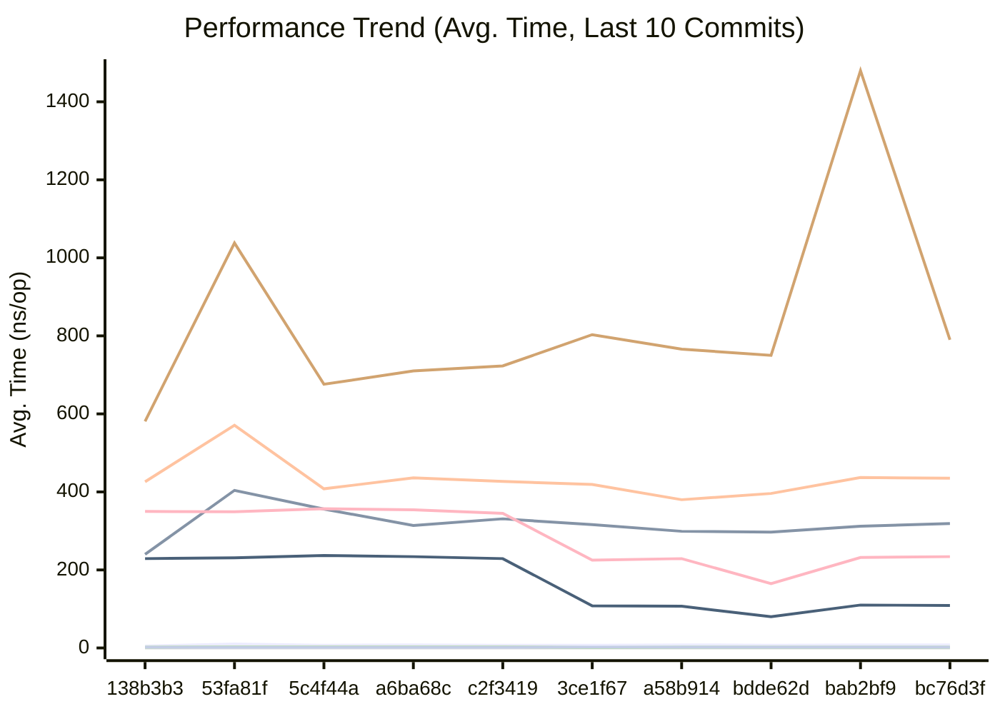
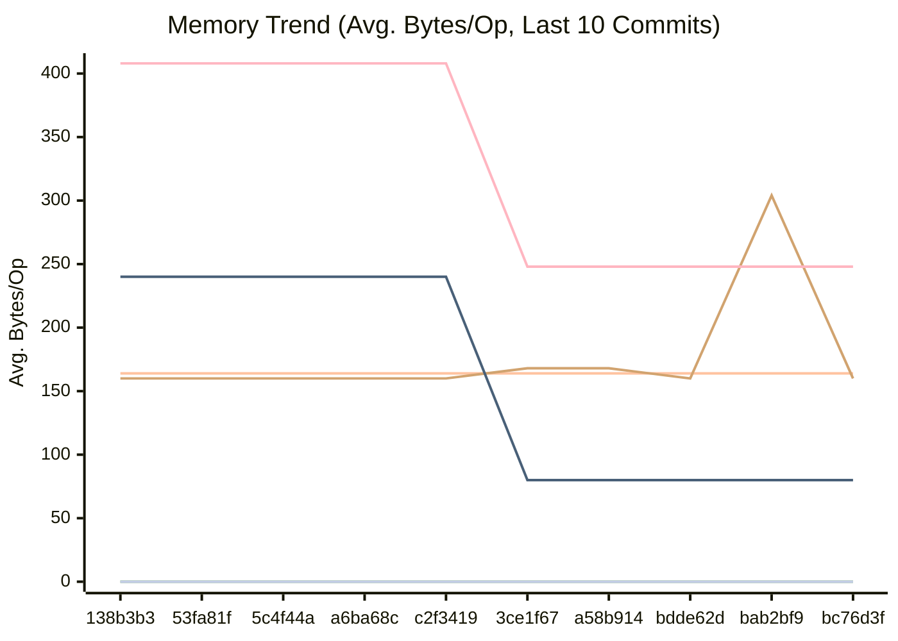
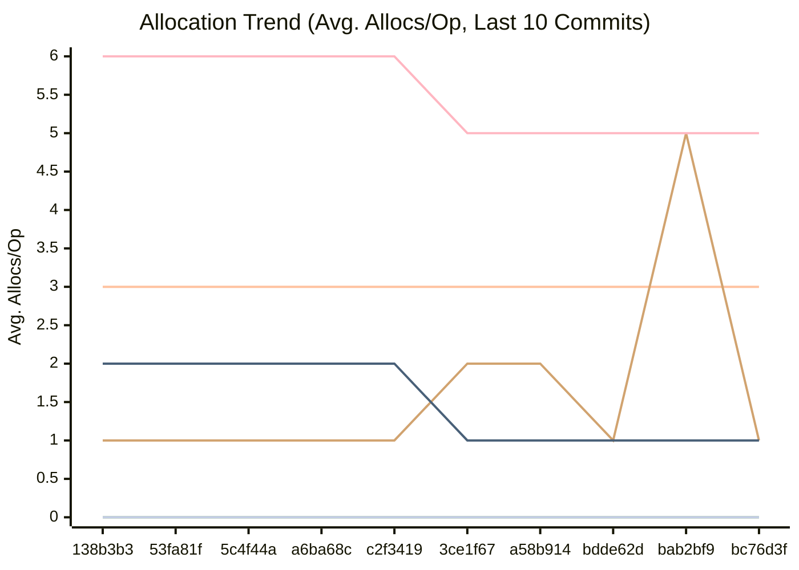

<!-- BENCHMARK_RESULTS_START -->
## Performance

This section is automatically updated by our GitHub Actions workflow.

### Comparison with previous commit

```
                      │ /tmp/old_bench_filtered.txt │      /tmp/new_bench_filtered.txt       │
                      │           sec/op            │    sec/op      vs base                 │
CrushOriginal-8                        437.4n ± ∞ ¹    435.3n ± ∞ ¹        ~ (p=1.000 n=1) ²
CrushOptimized-8                       312.1n ± ∞ ¹    319.2n ± ∞ ¹        ~ (p=1.000 n=1) ²
LoadGlobalConfig-8                    1480.0n ± ∞ ¹    789.6n ± ∞ ¹        ~ (p=1.000 n=1) ²
PadString-8                            1.891n ± ∞ ¹    2.344n ± ∞ ¹        ~ (p=1.000 n=1) ²
CheckMetricsAndSwap-8                  8.344n ± ∞ ¹    7.602n ± ∞ ¹        ~ (p=1.000 n=1) ²
IndexSearch-8                          1.671n ± ∞ ¹    1.560n ± ∞ ¹        ~ (p=1.000 n=1) ²
IndexDirectTracking-8                 0.4372n ± ∞ ¹   0.3454n ± ∞ ¹        ~ (p=1.000 n=1) ²
geomean                                21.79n          19.45n        -10.72%
¹ need >= 6 samples for confidence interval at level 0.95
² need >= 4 samples to detect a difference at alpha level 0.05

                      │ /tmp/old_bench_filtered.txt │     /tmp/new_bench_filtered.txt     │
                      │            B/op             │    B/op      vs base                │
CrushOriginal-8                         164.0 ± ∞ ¹   164.0 ± ∞ ¹       ~ (p=1.000 n=1) ²
CrushOptimized-8                        0.000 ± ∞ ¹   0.000 ± ∞ ¹       ~ (p=1.000 n=1) ²
LoadGlobalConfig-8                      304.0 ± ∞ ¹   160.0 ± ∞ ¹       ~ (p=1.000 n=1) ³
PadString-8                             0.000 ± ∞ ¹   0.000 ± ∞ ¹       ~ (p=1.000 n=1) ²
CheckMetricsAndSwap-8                   0.000 ± ∞ ¹   0.000 ± ∞ ¹       ~ (p=1.000 n=1) ²
IndexSearch-8                           0.000 ± ∞ ¹   0.000 ± ∞ ¹       ~ (p=1.000 n=1) ²
IndexDirectTracking-8                   0.000 ± ∞ ¹   0.000 ± ∞ ¹       ~ (p=1.000 n=1) ²
geomean                                           ⁴                -8.76%               ⁴
¹ need >= 6 samples for confidence interval at level 0.95
² all samples are equal
³ need >= 4 samples to detect a difference at alpha level 0.05
⁴ summaries must be >0 to compute geomean

                      │ /tmp/old_bench_filtered.txt │     /tmp/new_bench_filtered.txt      │
                      │          allocs/op          │  allocs/op   vs base                 │
CrushOriginal-8                         3.000 ± ∞ ¹   3.000 ± ∞ ¹        ~ (p=1.000 n=1) ²
CrushOptimized-8                        0.000 ± ∞ ¹   0.000 ± ∞ ¹        ~ (p=1.000 n=1) ²
LoadGlobalConfig-8                      5.000 ± ∞ ¹   1.000 ± ∞ ¹        ~ (p=1.000 n=1) ³
PadString-8                             0.000 ± ∞ ¹   0.000 ± ∞ ¹        ~ (p=1.000 n=1) ²
CheckMetricsAndSwap-8                   0.000 ± ∞ ¹   0.000 ± ∞ ¹        ~ (p=1.000 n=1) ²
IndexSearch-8                           0.000 ± ∞ ¹   0.000 ± ∞ ¹        ~ (p=1.000 n=1) ²
IndexDirectTracking-8                   0.000 ± ∞ ¹   0.000 ± ∞ ¹        ~ (p=1.000 n=1) ²
geomean                                           ⁴                -20.54%               ⁴
¹ need >= 6 samples for confidence interval at level 0.95
² all samples are equal
³ need >= 4 samples to detect a difference at alpha level 0.05
⁴ summaries must be >0 to compute geomean
```

### Latest Benchmark Results


| Benchmark | Avg. Time/Op | Avg. Bytes/Op | Avg. Allocs/Op |
|-----------|--------------|---------------|----------------|
| BenchmarkCheckMetricsAndSwap-8 | 7.60 ns/op | 0.00 B/op | 0.00 allocs/op |
| BenchmarkCrushOptimized-8 | 319.20 ns/op | 0.00 B/op | 0.00 allocs/op |
| BenchmarkCrushOriginal-8 | 435.30 ns/op | 164.00 B/op | 3.00 allocs/op |
| BenchmarkIndexDirectTracking-8 | 0.35 ns/op | 0.00 B/op | 0.00 allocs/op |
| BenchmarkIndexSearch-8 | 1.56 ns/op | 0.00 B/op | 0.00 allocs/op |
| BenchmarkLoadGlobalConfig-8 | 789.60 ns/op | 160.00 B/op | 1.00 allocs/op |
| BenchmarkPadString-8 | 2.34 ns/op | 0.00 B/op | 0.00 allocs/op |


### Performance History

**Legend**

| Color | Benchmark | Description |
|---|---|---|
| 🟢 | CheckMetricsAndSwap | Evaluation of system metrics (CPU/Mem) and mode switching logic |
| 🟤 | CrushOriginal | Original Sage Weil's CRUSH placement algorithm using reflection and float math |
| ⚪ | CrushOptimized | Performance-tuned CRUSH-lite placement algorithm using bitwise shifts and integer math (Rule 19) |
| 🔵 | IndexDirectTracking | Accessing current replication mode via direct slice index (O(1)) |
| 🔴 | IndexSearch | Searching for current replication mode in the order slice using `slices.Index` |
| 🟠 | LoadGlobalConfig | Parsing and loading the `[global]` section from the INI configuration |
| 🟣 | PadString | Padding strings with null characters to a fixed protocol length |
| 🟡 | ParseReplicationOrder | Parsing the CSV-formatted replication order string into an integer slice |


```mermaid
xychart-beta
    title "Performance Trend (Avg. Time, Last 10 Commits)"
    x-axis "Commit"
    y-axis "Avg. Time (ns/op)"
    x-axis [138b3b3,53fa81f,5c4f44a,a6ba68c,c2f3419,3ce1f67,a58b914,bdde62d,bab2bf9,bc76d3f]
    line "CheckMetricsAndSwap" [5,10,7,8,7,7,8,7,8,8]
    line "CrushOptimized" [240,404,356,314,331,316,299,297,312,319]
    line "CrushOriginal" [426,571,408,436,427,419,380,396,437,435]
    line "IndexDirectTracking" [0,0,0,0,0,0,0,0,0,0]
    line "IndexSearch" [2,3,3,3,3,1,2,2,2,2]
    line "LoadGlobalConfig" [581,1038,676,710,723,803,766,750,1480,790]
    line "PadString" [2,2,2,2,2,2,2,2,2,2]
    line "ParseReplicationOrder_NoPrealloc" [350,349,357,354,345,225,229,165,232,234]
    line "ParseReplicationOrder_Prealloc" [229,231,237,234,229,108,107,80,110,109]
```


```mermaid
xychart-beta
    title "Memory Trend (Avg. Bytes/Op, Last 10 Commits)"
    x-axis "Commit"
    y-axis "Avg. Bytes/Op"
    x-axis [138b3b3,53fa81f,5c4f44a,a6ba68c,c2f3419,3ce1f67,a58b914,bdde62d,bab2bf9,bc76d3f]
    line "CheckMetricsAndSwap" [0,0,0,0,0,0,0,0,0,0]
    line "CrushOptimized" [0,0,0,0,0,0,0,0,0,0]
    line "CrushOriginal" [164,164,164,164,164,164,164,164,164,164]
    line "IndexDirectTracking" [0,0,0,0,0,0,0,0,0,0]
    line "IndexSearch" [0,0,0,0,0,0,0,0,0,0]
    line "LoadGlobalConfig" [160,160,160,160,160,168,168,160,304,160]
    line "PadString" [0,0,0,0,0,0,0,0,0,0]
    line "ParseReplicationOrder_NoPrealloc" [408,408,408,408,408,248,248,248,248,248]
    line "ParseReplicationOrder_Prealloc" [240,240,240,240,240,80,80,80,80,80]
```


```mermaid
xychart-beta
    title "Allocation Trend (Avg. Allocs/Op, Last 10 Commits)"
    x-axis "Commit"
    y-axis "Avg. Allocs/Op"
    x-axis [138b3b3,53fa81f,5c4f44a,a6ba68c,c2f3419,3ce1f67,a58b914,bdde62d,bab2bf9,bc76d3f]
    line "CheckMetricsAndSwap" [0,0,0,0,0,0,0,0,0,0]
    line "CrushOptimized" [0,0,0,0,0,0,0,0,0,0]
    line "CrushOriginal" [3,3,3,3,3,3,3,3,3,3]
    line "IndexDirectTracking" [0,0,0,0,0,0,0,0,0,0]
    line "IndexSearch" [0,0,0,0,0,0,0,0,0,0]
    line "LoadGlobalConfig" [1,1,1,1,1,2,2,1,5,1]
    line "PadString" [0,0,0,0,0,0,0,0,0,0]
    line "ParseReplicationOrder_NoPrealloc" [6,6,6,6,6,5,5,5,5,5]
    line "ParseReplicationOrder_Prealloc" [2,2,2,2,2,1,1,1,1,1]
```
<!-- BENCHMARK_RESULTS_END -->
