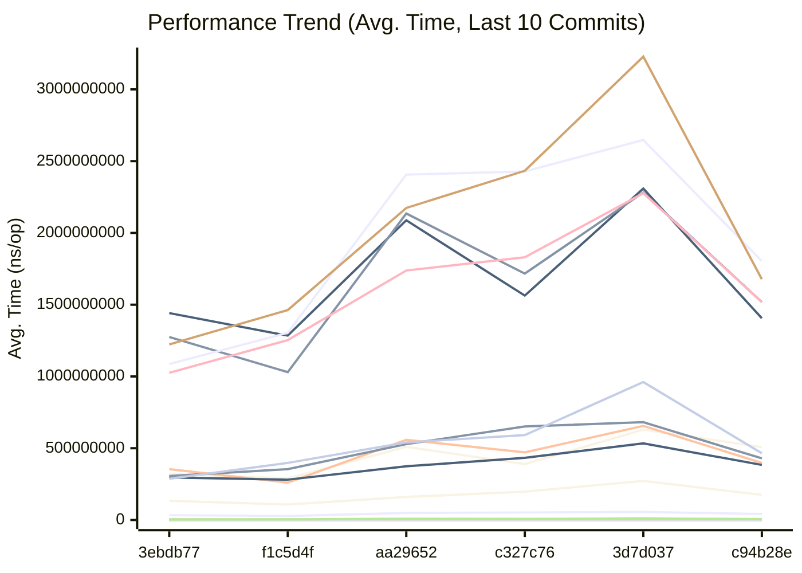
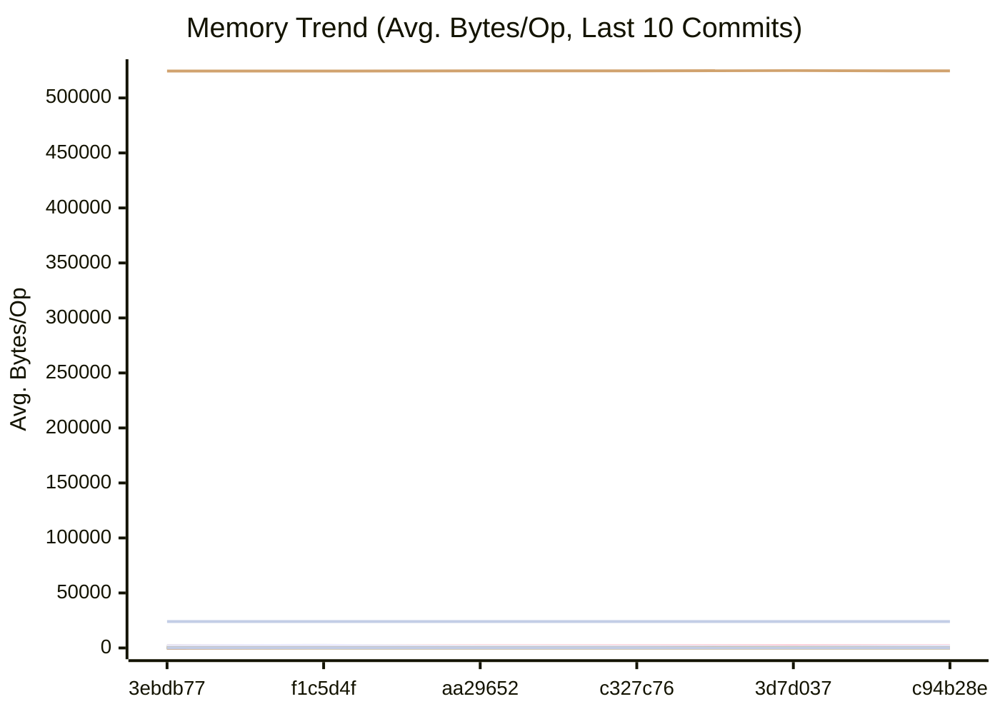
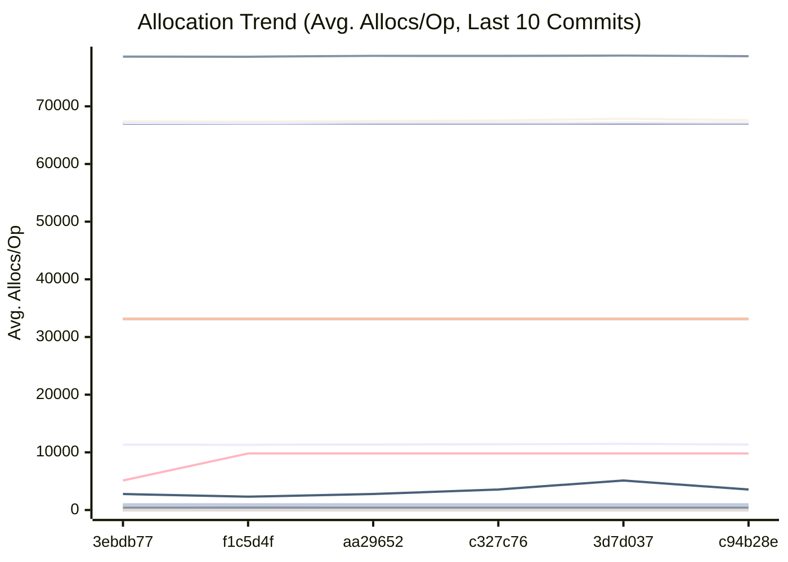

# Performance Benchmarks

This document tracks benchmark performance across commits. The section between
the `BENCHMARK_RESULTS_START/END` markers is auto-generated by the pre-commit
hook; the crypto/OPRF section below is manually maintained.

## How to Read This Document

- **Comparison with previous commit**: `benchstat` output comparing the current
  commit against the previous one. Three tables: **sec/op** (time per operation),
  **B/op** (bytes allocated), **allocs/op** (heap allocations). In each table,
  **lower is better**. `+X%` = regression, `-X%` = improvement, `~` = no
  statistically significant change. `p` is the p-value (p < 0.05 = significant).
- **Latest Benchmark Results**: Single-snapshot table of the current commit's
  averages. Lower values are better across all three columns.
- **Performance Trend plot**: X-axis = commit SHA (left = older, right = newer).
  Y-axis = avg time in ns/op. **Lower lines = faster.** Downward trends are
  improvements; upward spikes are regressions.
- **Memory Trend plot**: Same axes, but Y-axis = avg bytes allocated per op.
  **Lower lines = less memory.** Drops indicate allocation reductions.
- **Allocation Trend plot**: Same axes, but Y-axis = avg heap allocations per op.
  **Lower lines = fewer allocations.** Fewer allocs = less GC pressure.

<!-- BENCHMARK_RESULTS_START -->
## Performance

This section is automatically updated by the pre-commit hook (via .github/scripts/update_readme_with_benchmarks.sh).

### Comparison with previous commit

Each table compares the previous commit (left) to the current commit (right).
**Lower is better** in all three tables. `+X%` = regression, `-X%` = improvement,
`~` = no statistically significant change (p >= 0.05).

- **sec/op**: Time per operation (nanoseconds). Measures raw speed.
- **B/op**: Bytes allocated on the heap per operation. Measures memory usage.
- **allocs/op**: Number of heap allocations per operation. Measures GC pressure.

```
                                      │ /tmp/old_bench_filtered.txt │      /tmp/new_bench_filtered.txt      │
                                      │           sec/op            │    sec/op      vs base                │
CrushOriginal-8                                        833.9n ± ∞ ¹    795.2n ± ∞ ¹       ~ (p=1.000 n=1) ²
Placement-8                                            8.789µ ± ∞ ¹    8.100µ ± ∞ ¹       ~ (p=1.000 n=1) ²
PlacementDomainSpread-8                                9.655µ ± ∞ ¹    8.934µ ± ∞ ¹       ~ (p=1.000 n=1) ²
CrushOptimized-8                                       531.6n ± ∞ ¹    465.3n ± ∞ ¹       ~ (p=1.000 n=1) ²
LoadGlobalConfig-8                                     14.40µ ± ∞ ¹    18.55µ ± ∞ ¹       ~ (p=1.000 n=1) ²
HashBytes/1MiB-8                                       4.922m ± ∞ ¹    5.880m ± ∞ ¹       ~ (p=1.000 n=1) ²
HashBytes/64MiB-8                                      382.9m ± ∞ ¹    373.0m ± ∞ ¹       ~ (p=1.000 n=1) ²
HashBytes/256MiB-8                                      1.131 ± ∞ ¹     1.293 ± ∞ ¹       ~ (p=1.000 n=1) ²
HashFile/1MiB-8                                        6.262m ± ∞ ¹    5.169m ± ∞ ¹       ~ (p=1.000 n=1) ²
HashFile/64MiB-8                                       383.5m ± ∞ ¹    407.2m ± ∞ ¹       ~ (p=1.000 n=1) ²
HashFile/256MiB-8                                       1.624 ± ∞ ¹     1.432 ± ∞ ¹       ~ (p=1.000 n=1) ²
PadString-8                                            80.26n ± ∞ ¹    88.08n ± ∞ ¹       ~ (p=1.000 n=1) ²
SanitizeLog/Safe-8                                     452.6n ± ∞ ¹    464.4n ± ∞ ¹       ~ (p=1.000 n=1) ²
SanitizeLog/Unsafe-8                                   1.234µ ± ∞ ¹    1.310µ ± ∞ ¹       ~ (p=1.000 n=1) ²
AWSChunkedReaderSigned-8                               627.9µ ± ∞ ¹    786.0µ ± ∞ ¹       ~ (p=1.000 n=1) ²
AWSChunkedReaderUnsigned-8                             791.0µ ± ∞ ¹    977.6µ ± ∞ ¹       ~ (p=1.000 n=1) ²
LastModifiedHeader_AppendFormat-8                      376.2n ± ∞ ¹    542.1n ± ∞ ¹       ~ (p=1.000 n=1) ²
LastModifiedHeader_Format-8                            488.3n ± ∞ ¹    574.1n ± ∞ ¹       ~ (p=1.000 n=1) ²
FormatListObjectsV2XML_AppendFormat-8                  1.407m ± ∞ ¹    1.275m ± ∞ ¹       ~ (p=1.000 n=1) ²
FormatListObjectsV2XML_OldFormat-8                     813.8µ ± ∞ ¹    871.0µ ± ∞ ¹       ~ (p=1.000 n=1) ²
CheckMetricsAndSwap-8                                  14.98n ± ∞ ¹    17.16n ± ∞ ¹       ~ (p=1.000 n=1) ²
IndexSearch-8                                          3.921n ± ∞ ¹    4.770n ± ∞ ¹       ~ (p=1.000 n=1) ²
IndexDirectTracking-8                                 0.6966n ± ∞ ¹   0.7180n ± ∞ ¹       ~ (p=1.000 n=1) ²
LocalWrite/1MiB-8                                      928.1µ ± ∞ ¹   1116.0µ ± ∞ ¹       ~ (p=1.000 n=1) ²
LocalWrite/64MiB-8                                     46.10m ± ∞ ¹    61.14m ± ∞ ¹       ~ (p=1.000 n=1) ²
LocalWrite/256MiB-8                                    160.4m ± ∞ ¹    185.7m ± ∞ ¹       ~ (p=1.000 n=1) ²
ReadVerify/1MiB-8                                      5.870m ± ∞ ¹    8.481m ± ∞ ¹       ~ (p=1.000 n=1) ²
ReadVerify/64MiB-8                                     512.9m ± ∞ ¹    518.4m ± ∞ ¹       ~ (p=1.000 n=1) ²
ReadVerify/256MiB-8                                     2.116 ± ∞ ¹     1.782 ± ∞ ¹       ~ (p=1.000 n=1) ²
TrustedRead/1MiB-8                                     7.751m ± ∞ ¹    7.358m ± ∞ ¹       ~ (p=1.000 n=1) ²
TrustedRead/64MiB-8                                    415.8m ± ∞ ¹    464.7m ± ∞ ¹       ~ (p=1.000 n=1) ²
TrustedRead/256MiB-8                                    1.267 ± ∞ ¹     1.481 ± ∞ ¹       ~ (p=1.000 n=1) ²
S3PutSpool/1MiB-8                                      6.157m ± ∞ ¹    6.499m ± ∞ ¹       ~ (p=1.000 n=1) ²
S3PutSpool/64MiB-8                                     399.7m ± ∞ ¹    433.8m ± ∞ ¹       ~ (p=1.000 n=1) ²
S3PutSpool/256MiB-8                                     1.227 ± ∞ ¹     1.869 ± ∞ ¹       ~ (p=1.000 n=1) ²
geomean                                                541.2µ          589.7µ        +8.97%
¹ need >= 6 samples for confidence interval at level 0.95
² need >= 4 samples to detect a difference at alpha level 0.05

                                      │ /tmp/old_bench_filtered.txt │      /tmp/new_bench_filtered.txt      │
                                      │            B/op             │     B/op       vs base                │
CrushOriginal-8                                         164.0 ± ∞ ¹     164.0 ± ∞ ¹       ~ (p=1.000 n=1) ²
Placement-8                                             352.0 ± ∞ ¹     352.0 ± ∞ ¹       ~ (p=1.000 n=1) ²
PlacementDomainSpread-8                                 352.0 ± ∞ ¹     352.0 ± ∞ ¹       ~ (p=1.000 n=1) ²
CrushOptimized-8                                        0.000 ± ∞ ¹     0.000 ± ∞ ¹       ~ (p=1.000 n=1) ²
LoadGlobalConfig-8                                    1.930Ki ± ∞ ¹   1.930Ki ± ∞ ¹       ~ (p=1.000 n=1) ²
HashBytes/1MiB-8                                        64.00 ± ∞ ¹     64.00 ± ∞ ¹       ~ (p=1.000 n=1) ²
HashBytes/64MiB-8                                       64.00 ± ∞ ¹     64.00 ± ∞ ¹       ~ (p=1.000 n=1) ²
HashBytes/256MiB-8                                      64.00 ± ∞ ¹     64.00 ± ∞ ¹       ~ (p=1.000 n=1) ²
HashFile/1MiB-8                                       32.35Ki ± ∞ ¹   32.35Ki ± ∞ ¹       ~ (p=1.000 n=1) ²
HashFile/64MiB-8                                      32.35Ki ± ∞ ¹   32.35Ki ± ∞ ¹       ~ (p=1.000 n=1) ²
HashFile/256MiB-8                                     32.35Ki ± ∞ ¹   32.35Ki ± ∞ ¹       ~ (p=1.000 n=1) ²
PadString-8                                             64.00 ± ∞ ¹     64.00 ± ∞ ¹       ~ (p=1.000 n=1) ²
SanitizeLog/Safe-8                                      0.000 ± ∞ ¹     0.000 ± ∞ ¹       ~ (p=1.000 n=1) ²
SanitizeLog/Unsafe-8                                    704.0 ± ∞ ¹     704.0 ± ∞ ¹       ~ (p=1.000 n=1) ²
AWSChunkedReaderSigned-8                              11.05Ki ± ∞ ¹   11.08Ki ± ∞ ¹       ~ (p=1.000 n=1) ³
AWSChunkedReaderUnsigned-8                            76.80Ki ± ∞ ¹   76.93Ki ± ∞ ¹       ~ (p=1.000 n=1) ³
LastModifiedHeader_AppendFormat-8                       0.000 ± ∞ ¹     0.000 ± ∞ ¹       ~ (p=1.000 n=1) ²
LastModifiedHeader_Format-8                             32.00 ± ∞ ¹     32.00 ± ∞ ¹       ~ (p=1.000 n=1) ²
FormatListObjectsV2XML_AppendFormat-8                 512.2Ki ± ∞ ¹   512.2Ki ± ∞ ¹       ~ (p=1.000 n=1) ³
FormatListObjectsV2XML_OldFormat-8                    23.44Ki ± ∞ ¹   23.44Ki ± ∞ ¹       ~ (p=1.000 n=1) ²
CheckMetricsAndSwap-8                                   0.000 ± ∞ ¹     0.000 ± ∞ ¹       ~ (p=1.000 n=1) ²
IndexSearch-8                                           0.000 ± ∞ ¹     0.000 ± ∞ ¹       ~ (p=1.000 n=1) ²
IndexDirectTracking-8                                   0.000 ± ∞ ¹     0.000 ± ∞ ¹       ~ (p=1.000 n=1) ²
LocalWrite/1MiB-8                                     65.47Ki ± ∞ ¹   65.47Ki ± ∞ ¹       ~ (p=1.000 n=1) ³
LocalWrite/64MiB-8                                    65.55Ki ± ∞ ¹   65.51Ki ± ∞ ¹       ~ (p=1.000 n=1) ³
LocalWrite/256MiB-8                                   65.91Ki ± ∞ ¹   65.98Ki ± ∞ ¹       ~ (p=1.000 n=1) ³
ReadVerify/1MiB-8                                       439.0 ± ∞ ¹     490.0 ± ∞ ¹       ~ (p=1.000 n=1) ³
ReadVerify/64MiB-8                                    5.000Ki ± ∞ ¹   3.474Ki ± ∞ ¹       ~ (p=1.000 n=1) ³
ReadVerify/256MiB-8                                   9.578Ki ± ∞ ¹   9.578Ki ± ∞ ¹       ~ (p=1.000 n=1) ²
TrustedRead/1MiB-8                                      858.0 ± ∞ ¹     800.0 ± ∞ ¹       ~ (p=1.000 n=1) ³
TrustedRead/64MiB-8                                     800.0 ± ∞ ¹     800.0 ± ∞ ¹       ~ (p=1.000 n=1) ²
TrustedRead/256MiB-8                                    800.0 ± ∞ ¹     800.0 ± ∞ ¹       ~ (p=1.000 n=1) ²
S3PutSpool/1MiB-8                                       447.0 ± ∞ ¹     447.0 ± ∞ ¹       ~ (p=1.000 n=1) ²
S3PutSpool/64MiB-8                                      448.0 ± ∞ ¹     448.0 ± ∞ ¹       ~ (p=1.000 n=1) ²
S3PutSpool/256MiB-8                                     448.0 ± ∞ ¹     448.0 ± ∞ ¹       ~ (p=1.000 n=1) ²
geomean                                                           ⁴                  -0.91%               ⁴
¹ need >= 6 samples for confidence interval at level 0.95
² all samples are equal
³ need >= 4 samples to detect a difference at alpha level 0.05
⁴ summaries must be >0 to compute geomean

                                      │ /tmp/old_bench_filtered.txt │     /tmp/new_bench_filtered.txt      │
                                      │          allocs/op          │  allocs/op    vs base                │
CrushOriginal-8                                         3.000 ± ∞ ¹    3.000 ± ∞ ¹       ~ (p=1.000 n=1) ²
Placement-8                                             6.000 ± ∞ ¹    6.000 ± ∞ ¹       ~ (p=1.000 n=1) ²
PlacementDomainSpread-8                                 6.000 ± ∞ ¹    6.000 ± ∞ ¹       ~ (p=1.000 n=1) ²
CrushOptimized-8                                        0.000 ± ∞ ¹    0.000 ± ∞ ¹       ~ (p=1.000 n=1) ²
LoadGlobalConfig-8                                      58.00 ± ∞ ¹    58.00 ± ∞ ¹       ~ (p=1.000 n=1) ²
HashBytes/1MiB-8                                        1.000 ± ∞ ¹    1.000 ± ∞ ¹       ~ (p=1.000 n=1) ²
HashBytes/64MiB-8                                       1.000 ± ∞ ¹    1.000 ± ∞ ¹       ~ (p=1.000 n=1) ²
HashBytes/256MiB-8                                      1.000 ± ∞ ¹    1.000 ± ∞ ¹       ~ (p=1.000 n=1) ²
HashFile/1MiB-8                                         6.000 ± ∞ ¹    6.000 ± ∞ ¹       ~ (p=1.000 n=1) ²
HashFile/64MiB-8                                        6.000 ± ∞ ¹    6.000 ± ∞ ¹       ~ (p=1.000 n=1) ²
HashFile/256MiB-8                                       6.000 ± ∞ ¹    6.000 ± ∞ ¹       ~ (p=1.000 n=1) ²
PadString-8                                             1.000 ± ∞ ¹    1.000 ± ∞ ¹       ~ (p=1.000 n=1) ²
SanitizeLog/Safe-8                                      0.000 ± ∞ ¹    0.000 ± ∞ ¹       ~ (p=1.000 n=1) ²
SanitizeLog/Unsafe-8                                    1.000 ± ∞ ¹    1.000 ± ∞ ¹       ~ (p=1.000 n=1) ²
AWSChunkedReaderSigned-8                                80.00 ± ∞ ¹    80.00 ± ∞ ¹       ~ (p=1.000 n=1) ²
AWSChunkedReaderUnsigned-8                              15.00 ± ∞ ¹    15.00 ± ∞ ¹       ~ (p=1.000 n=1) ²
LastModifiedHeader_AppendFormat-8                       0.000 ± ∞ ¹    0.000 ± ∞ ¹       ~ (p=1.000 n=1) ²
LastModifiedHeader_Format-8                             1.000 ± ∞ ¹    1.000 ± ∞ ¹       ~ (p=1.000 n=1) ²
FormatListObjectsV2XML_AppendFormat-8                   16.00 ± ∞ ¹    16.00 ± ∞ ¹       ~ (p=1.000 n=1) ²
FormatListObjectsV2XML_OldFormat-8                     1.000k ± ∞ ¹   1.000k ± ∞ ¹       ~ (p=1.000 n=1) ²
CheckMetricsAndSwap-8                                   0.000 ± ∞ ¹    0.000 ± ∞ ¹       ~ (p=1.000 n=1) ²
IndexSearch-8                                           0.000 ± ∞ ¹    0.000 ± ∞ ¹       ~ (p=1.000 n=1) ²
IndexDirectTracking-8                                   0.000 ± ∞ ¹    0.000 ± ∞ ¹       ~ (p=1.000 n=1) ²
LocalWrite/1MiB-8                                       18.00 ± ∞ ¹    19.00 ± ∞ ¹       ~ (p=1.000 n=1) ³
LocalWrite/64MiB-8                                      18.00 ± ∞ ¹    18.00 ± ∞ ¹       ~ (p=1.000 n=1) ²
LocalWrite/256MiB-8                                     21.00 ± ∞ ¹    21.00 ± ∞ ¹       ~ (p=1.000 n=1) ²
ReadVerify/1MiB-8                                       6.000 ± ∞ ¹    6.000 ± ∞ ¹       ~ (p=1.000 n=1) ²
ReadVerify/64MiB-8                                      8.000 ± ∞ ¹    7.000 ± ∞ ¹       ~ (p=1.000 n=1) ³
ReadVerify/256MiB-8                                     10.00 ± ∞ ¹    10.00 ± ∞ ¹       ~ (p=1.000 n=1) ²
TrustedRead/1MiB-8                                      11.00 ± ∞ ¹    11.00 ± ∞ ¹       ~ (p=1.000 n=1) ²
TrustedRead/64MiB-8                                     11.00 ± ∞ ¹    11.00 ± ∞ ¹       ~ (p=1.000 n=1) ²
TrustedRead/256MiB-8                                    11.00 ± ∞ ¹    11.00 ± ∞ ¹       ~ (p=1.000 n=1) ²
S3PutSpool/1MiB-8                                       10.00 ± ∞ ¹    10.00 ± ∞ ¹       ~ (p=1.000 n=1) ²
S3PutSpool/64MiB-8                                      10.00 ± ∞ ¹    10.00 ± ∞ ¹       ~ (p=1.000 n=1) ²
S3PutSpool/256MiB-8                                     10.00 ± ∞ ¹    10.00 ± ∞ ¹       ~ (p=1.000 n=1) ²
geomean                                                           ⁴                 -0.23%               ⁴
¹ need >= 6 samples for confidence interval at level 0.95
² all samples are equal
³ need >= 4 samples to detect a difference at alpha level 0.05
⁴ summaries must be >0 to compute geomean

                           │ /tmp/old_bench_filtered.txt │      /tmp/new_bench_filtered.txt      │
                           │             B/s             │      B/s       vs base                │
HashBytes/1MiB-8                           203.2Mi ± ∞ ¹   170.1Mi ± ∞ ¹       ~ (p=1.000 n=1) ²
HashBytes/64MiB-8                          167.2Mi ± ∞ ¹   171.6Mi ± ∞ ¹       ~ (p=1.000 n=1) ²
HashBytes/256MiB-8                         226.3Mi ± ∞ ¹   198.0Mi ± ∞ ¹       ~ (p=1.000 n=1) ²
HashFile/1MiB-8                            159.7Mi ± ∞ ¹   193.5Mi ± ∞ ¹       ~ (p=1.000 n=1) ²
HashFile/64MiB-8                           166.9Mi ± ∞ ¹   157.2Mi ± ∞ ¹       ~ (p=1.000 n=1) ²
HashFile/256MiB-8                          157.6Mi ± ∞ ¹   178.7Mi ± ∞ ¹       ~ (p=1.000 n=1) ²
AWSChunkedReaderSigned-8                  101.10Mi ± ∞ ¹   80.76Mi ± ∞ ¹       ~ (p=1.000 n=1) ²
AWSChunkedReaderUnsigned-8                 80.25Mi ± ∞ ¹   64.94Mi ± ∞ ¹       ~ (p=1.000 n=1) ²
LocalWrite/1MiB-8                         1077.4Mi ± ∞ ¹   896.0Mi ± ∞ ¹       ~ (p=1.000 n=1) ²
LocalWrite/64MiB-8                         1.356Gi ± ∞ ¹   1.022Gi ± ∞ ¹       ~ (p=1.000 n=1) ²
LocalWrite/256MiB-8                        1.558Gi ± ∞ ¹   1.346Gi ± ∞ ¹       ~ (p=1.000 n=1) ²
ReadVerify/1MiB-8                          170.4Mi ± ∞ ¹   117.9Mi ± ∞ ¹       ~ (p=1.000 n=1) ²
ReadVerify/64MiB-8                         124.8Mi ± ∞ ¹   123.5Mi ± ∞ ¹       ~ (p=1.000 n=1) ²
ReadVerify/256MiB-8                        121.0Mi ± ∞ ¹   143.7Mi ± ∞ ¹       ~ (p=1.000 n=1) ²
TrustedRead/1MiB-8                         129.0Mi ± ∞ ¹   135.9Mi ± ∞ ¹       ~ (p=1.000 n=1) ²
TrustedRead/64MiB-8                        153.9Mi ± ∞ ¹   137.7Mi ± ∞ ¹       ~ (p=1.000 n=1) ²
TrustedRead/256MiB-8                       202.1Mi ± ∞ ¹   172.9Mi ± ∞ ¹       ~ (p=1.000 n=1) ²
S3PutSpool/1MiB-8                          162.4Mi ± ∞ ¹   153.9Mi ± ∞ ¹       ~ (p=1.000 n=1) ²
S3PutSpool/64MiB-8                         160.1Mi ± ∞ ¹   147.5Mi ± ∞ ¹       ~ (p=1.000 n=1) ²
S3PutSpool/256MiB-8                        208.6Mi ± ∞ ¹   137.0Mi ± ∞ ¹       ~ (p=1.000 n=1) ²
geomean                                    212.4Mi         191.7Mi        -9.77%
¹ need >= 6 samples for confidence interval at level 0.95
² need >= 4 samples to detect a difference at alpha level 0.05
```

### Latest Benchmark Results

Single-snapshot of the current commit's averages. **Lower is better** across all
three columns: time (speed), bytes (memory), allocs (GC pressure).


| Benchmark | Avg. Time/Op | Avg. Bytes/Op | Avg. Allocs/Op |
|-----------|--------------|---------------|----------------|
| BenchmarkAWSChunkedReaderSigned-8 | 785988.00 ns/op | 84.68 B/op | 11351.00 allocs/op |
| BenchmarkAWSChunkedReaderUnsigned-8 | 977586.00 ns/op | 68.09 B/op | 78777.00 allocs/op |
| BenchmarkCheckMetricsAndSwap-8 | 17.16 ns/op | 0.00 B/op | 0.00 allocs/op |
| BenchmarkCrushOptimized-8 | 465.30 ns/op | 0.00 B/op | 0.00 allocs/op |
| BenchmarkCrushOriginal-8 | 795.20 ns/op | 164.00 B/op | 3.00 allocs/op |
| BenchmarkFormatListObjectsV2XML_AppendFormat-8 | 1275364.00 ns/op | 524491.00 B/op | 16.00 allocs/op |
| BenchmarkFormatListObjectsV2XML_OldFormat-8 | 870950.00 ns/op | 24000.00 B/op | 1000.00 allocs/op |
| BenchmarkHashBytes/1MiB-8 | 5879995.00 ns/op | 178.33 B/op | 64.00 allocs/op |
| BenchmarkHashBytes/256MiB-8 | 1293022873.00 ns/op | 207.60 B/op | 64.00 allocs/op |
| BenchmarkHashBytes/64MiB-8 | 372987075.00 ns/op | 179.92 B/op | 64.00 allocs/op |
| BenchmarkHashFile/1MiB-8 | 5169082.00 ns/op | 202.86 B/op | 33128.00 allocs/op |
| BenchmarkHashFile/256MiB-8 | 1432425639.00 ns/op | 187.40 B/op | 33128.00 allocs/op |
| BenchmarkHashFile/64MiB-8 | 407202955.00 ns/op | 164.80 B/op | 33128.00 allocs/op |
| BenchmarkIndexDirectTracking-8 | 0.72 ns/op | 0.00 B/op | 0.00 allocs/op |
| BenchmarkIndexSearch-8 | 4.77 ns/op | 0.00 B/op | 0.00 allocs/op |
| BenchmarkLastModifiedHeader_AppendFormat-8 | 542.10 ns/op | 0.00 B/op | 0.00 allocs/op |
| BenchmarkLastModifiedHeader_Format-8 | 574.10 ns/op | 32.00 B/op | 1.00 allocs/op |
| BenchmarkLoadGlobalConfig-8 | 18548.00 ns/op | 1976.00 B/op | 58.00 allocs/op |
| BenchmarkLocalWrite/1MiB-8 | 1116026.00 ns/op | 939.56 B/op | 67044.00 allocs/op |
| BenchmarkLocalWrite/256MiB-8 | 185677716.00 ns/op | 1445.71 B/op | 67564.00 allocs/op |
| BenchmarkLocalWrite/64MiB-8 | 61144515.00 ns/op | 1097.55 B/op | 67078.00 allocs/op |
| BenchmarkPadString-8 | 88.08 ns/op | 64.00 B/op | 1.00 allocs/op |
| BenchmarkPlacement-8 | 8100.00 ns/op | 352.00 B/op | 6.00 allocs/op |
| BenchmarkPlacementDomainSpread-8 | 8934.00 ns/op | 352.00 B/op | 6.00 allocs/op |
| BenchmarkReadVerify/1MiB-8 | 8481402.00 ns/op | 123.63 B/op | 490.00 allocs/op |
| BenchmarkReadVerify/256MiB-8 | 1781612989.00 ns/op | 150.67 B/op | 9808.00 allocs/op |
| BenchmarkReadVerify/64MiB-8 | 518387680.00 ns/op | 129.46 B/op | 3557.00 allocs/op |
| BenchmarkS3PutSpool/1MiB-8 | 6498512.00 ns/op | 161.36 B/op | 447.00 allocs/op |
| BenchmarkS3PutSpool/256MiB-8 | 1869122530.00 ns/op | 143.62 B/op | 448.00 allocs/op |
| BenchmarkS3PutSpool/64MiB-8 | 433842837.00 ns/op | 154.68 B/op | 448.00 allocs/op |
| BenchmarkSanitizeLog/Safe-8 | 464.40 ns/op | 0.00 B/op | 0.00 allocs/op |
| BenchmarkSanitizeLog/Unsafe-8 | 1310.00 ns/op | 704.00 B/op | 1.00 allocs/op |
| BenchmarkTrustedRead/1MiB-8 | 7357692.00 ns/op | 142.51 B/op | 800.00 allocs/op |
| BenchmarkTrustedRead/256MiB-8 | 1480761171.00 ns/op | 181.28 B/op | 800.00 allocs/op |
| BenchmarkTrustedRead/64MiB-8 | 464687610.00 ns/op | 144.42 B/op | 800.00 allocs/op |


### Performance History

**Legend**

| Color | Benchmark | Description |
|---|---|---|
| 🟢 | CheckMetricsAndSwap | Evaluation of system metrics (CPU/Mem) and mode switching logic |
| 🟤 | CrushOriginal | Original Sage Weil's CRUSH placement algorithm using reflection and float math |
| ⚪ | CrushOptimized | Performance-tuned CRUSH-lite placement algorithm using bitwise shifts and integer math (Rule 19) |
| 🔵 | IndexDirectTracking | Accessing current replication mode via direct slice index (O(1)) |
| 🔴 | IndexSearch | Searching for current replication mode in the order slice using `slices.Index` |
| 🟠 | LoadGlobalConfig | Parsing and loading the `[global]` section from the INI configuration |
| 🟣 | PadString | Padding strings with null characters to a fixed protocol length |
| 🟡 | ParseReplicationOrder | Parsing the CSV-formatted replication order string into an integer slice |

#### Time per Operation (ns/op)

X-axis: commit SHA (left = older, right = newer). Y-axis: avg time in ns/op.
**Lower lines = faster code.** Downward trends are improvements; upward spikes
are regressions to investigate.


```mermaid
xychart-beta
    title "Performance Trend (Avg. Time, Last 10 Commits)"
    x-axis "Commit"
    y-axis "Avg. Time (ns/op)"
    x-axis [3ebdb77,f1c5d4f,aa29652,c327c76,3d7d037,c94b28e]
    line "AWSChunkedReaderSigned" [620161,606537,1043223,973548,1455699,680259,833482,953309,627888,785988]
    line "AWSChunkedReaderUnsigned" [631352,615450,1351997,1054695,1128789,889133,730853,858757,790951,977586]
    line "CheckMetricsAndSwap" [11,9,18,19,38,17,10,13,15,17]
    line "CrushOptimized" [381,489,593,643,1042,685,798,468,532,465]
    line "CrushOriginal" [599,581,856,1307,2029,855,1268,698,834,795]
    line "FormatListObjectsV2XML_AppendFormat" [922011,962696,2255056,1630321,4600271,1782191,1061116,1008647,1406590,1275364]
    line "FormatListObjectsV2XML_OldFormat" [518253,488621,1103444,888288,1357791,907084,473930,533866,813796,870950]
    line "HashBytes/1MiB" [3747347,5123782,7575501,6664907,7640824,5383828,7555000,5598473,4921734,5879995]
    line "HashBytes/256MiB" [1441434671,1284521850,2087994619,1563281181,2308810918,1405443275,1788061102,1074265335,1131266592,1293022873]
    line "HashBytes/64MiB" [321801782,289844742,509860327,389285110,629622654,507641214,422715939,338237103,382860244,372987075]
    line "HashFile/1MiB" [6901410,4299477,8227082,7078150,8690518,5618671,6533318,4172609,6261739,5169082]
    line "HashFile/256MiB" [1274613971,1030231274,2135226775,1716532942,2281655194,1518211227,1560936348,1431277931,1624300639,1432425639]
    line "HashFile/64MiB" [354037155,260223898,558613671,471436906,655531538,397822488,323633746,347435470,383484634,407202955]
    line "IndexDirectTracking" [1,0,1,1,1,1,1,1,1,1]
    line "IndexSearch" [4,4,5,4,5,5,4,4,4,5]
    line "LastModifiedHeader_AppendFormat" [312,319,610,638,744,453,385,315,376,542]
    line "LastModifiedHeader_Format" [394,406,812,695,1046,635,526,444,488,574]
    line "LoadGlobalConfig" [12164,12907,20187,22438,33068,21404,21459,15616,14400,18548]
    line "LocalWrite/1MiB" [584326,612314,1771010,1395534,1103659,782921,673496,973167,928144,1116026]
    line "LocalWrite/256MiB" [133440934,107404943,160392504,197917420,272351029,175219427,179514948,167743774,160436947,185677716]
    line "LocalWrite/64MiB" [33399170,28308935,49166059,52341255,56218123,42014368,37648886,40720206,46095057,61144515]
    line "PadString" [80,61,211,165,205,86,67,85,80,88]
    line "ParseReplicationOrder_NoPrealloc" [350,349,357,354,345,225,229,165,232,234]
    line "ParseReplicationOrder_Prealloc" [229,231,237,234,229,108,107,80,110,109]
    line "Placement" [6313,6933,8102,10527,25580,11321,10377,7200,8789,8100]
    line "PlacementDomainSpread" [6619,8426,8684,11049,18437,11792,9468,8229,9655,8934]
    line "ReadVerify/1MiB" [4807436,3448579,5630820,6689386,12183182,5670392,7713170,4757418,5869903,8481402]
    line "ReadVerify/256MiB" [1025626350,1253185341,1738129398,1830120119,2276631953,1517577657,1316685724,1223335569,2116170500,1781612989]
    line "ReadVerify/64MiB" [296627981,281005831,374198113,432795151,533889680,383828668,451931212,213251291,512922822,518387680]
    line "S3PutSpool/1MiB" [4156487,6430516,9117398,9491833,12330195,7822144,8408058,8591213,6157166,6498512]
    line "S3PutSpool/256MiB" [1086529024,1304364707,2406472426,2428268969,2647654672,1803968295,2177507350,1816522977,1227464198,1869122530]
    line "S3PutSpool/64MiB" [306669378,354128133,528507413,651666227,681227498,429216770,399626051,367182715,399702230,433842837]
    line "SanitizeLog/Safe" [390,316,623,639,645,428,331,547,453,464]
    line "SanitizeLog/Unsafe" [1036,1076,2180,2105,3077,1405,1260,1471,1234,1310]
    line "TrustedRead/1MiB" [3751975,4741810,8367879,7463250,9671314,5650216,4830214,4254033,7751297,7357692]
    line "TrustedRead/256MiB" [1223117446,1462605918,2173767229,2433008029,3228071339,1677679418,2100324369,1186508654,1267006234,1480761171]
    line "TrustedRead/64MiB" [287609190,397868130,540269082,591536062,961059323,465018339,305338723,298647819,415837736,464687610]
```

#### Memory per Operation (B/op)

X-axis: commit SHA. Y-axis: avg bytes allocated per op.
**Lower lines = less memory.** Drops indicate allocation reductions.


```mermaid
xychart-beta
    title "Memory Trend (Avg. Bytes/Op, Last 10 Commits)"
    x-axis "Commit"
    y-axis "Avg. Bytes/Op"
    x-axis [3ebdb77,f1c5d4f,aa29652,c327c76,3d7d037,c94b28e]
    line "AWSChunkedReaderSigned" [107,110,64,68,46,98,80,70,106,85]
    line "AWSChunkedReaderUnsigned" [105,108,49,63,59,75,91,78,84,68]
    line "CheckMetricsAndSwap" [0,0,0,0,0,0,0,0,0,0]
    line "CrushOptimized" [0,0,0,0,0,0,0,0,0,0]
    line "CrushOriginal" [164,164,164,164,164,164,164,164,164,164]
    line "FormatListObjectsV2XML_AppendFormat" [524463,524460,524580,524552,524871,524558,524474,524487,524493,524491]
    line "FormatListObjectsV2XML_OldFormat" [24000,24000,24000,24000,24000,24000,24000,24000,24000,24000]
    line "HashBytes/1MiB" [280,205,138,157,137,195,139,187,213,178]
    line "HashBytes/256MiB" [186,209,129,172,116,191,150,250,237,208]
    line "HashBytes/64MiB" [209,232,132,172,107,132,159,198,175,180]
    line "HashFile/1MiB" [152,244,127,148,121,187,160,251,167,203]
    line "HashFile/256MiB" [211,261,126,156,118,177,172,188,165,187]
    line "HashFile/64MiB" [190,258,120,142,102,169,207,193,175,165]
    line "IndexDirectTracking" [0,0,0,0,0,0,0,0,0,0]
    line "IndexSearch" [0,0,0,0,0,0,0,0,0,0]
    line "LastModifiedHeader_AppendFormat" [0,0,0,0,0,0,0,0,0,0]
    line "LastModifiedHeader_Format" [32,32,32,32,32,32,32,32,32,32]
    line "LoadGlobalConfig" [1976,1976,1976,1976,1976,1976,1976,1976,1976,1976]
    line "LocalWrite/1MiB" [1794,1712,592,751,950,1339,1557,1077,1130,940]
    line "LocalWrite/256MiB" [2012,2499,1674,1356,986,1532,1495,1600,1673,1446]
    line "LocalWrite/64MiB" [2009,2371,1365,1282,1194,1597,1782,1648,1456,1098]
    line "PadString" [64,64,64,64,64,64,64,64,64,64]
    line "ParseReplicationOrder_NoPrealloc" [408,408,408,408,408,248,248,248,248,248]
    line "ParseReplicationOrder_Prealloc" [240,240,240,240,240,80,80,80,80,80]
    line "Placement" [352,352,352,352,352,352,352,352,352,352]
    line "PlacementDomainSpread" [352,352,352,352,352,352,352,352,352,352]
    line "ReadVerify/1MiB" [218,304,186,157,86,185,136,220,179,124]
    line "ReadVerify/256MiB" [262,214,154,147,118,177,204,219,127,151]
    line "ReadVerify/64MiB" [226,239,179,155,126,175,148,315,131,129]
    line "S3PutSpool/1MiB" [252,163,115,110,85,134,125,122,170,161]
    line "S3PutSpool/256MiB" [247,206,112,111,101,149,123,148,219,144]
    line "S3PutSpool/64MiB" [219,190,127,103,99,156,168,183,168,155]
    line "SanitizeLog/Safe" [0,0,0,0,0,0,0,0,0,0]
    line "SanitizeLog/Unsafe" [704,704,704,704,704,704,704,704,704,704]
    line "TrustedRead/1MiB" [279,221,125,140,108,186,217,246,135,143]
    line "TrustedRead/256MiB" [219,184,123,110,83,160,128,226,212,181]
    line "TrustedRead/64MiB" [233,169,124,113,70,144,220,225,161,144]
```

#### Allocations per Operation (allocs/op)

X-axis: commit SHA. Y-axis: avg heap allocations per op.
**Lower lines = fewer allocations.** Fewer allocs = less GC pressure.


```mermaid
xychart-beta
    title "Allocation Trend (Avg. Allocs/Op, Last 10 Commits)"
    x-axis "Commit"
    y-axis "Avg. Allocs/Op"
    x-axis [3ebdb77,f1c5d4f,aa29652,c327c76,3d7d037,c94b28e]
    line "AWSChunkedReaderSigned" [11331,11309,11357,11392,11480,11346,11370,11345,11319,11351]
    line "AWSChunkedReaderUnsigned" [78609,78603,78751,78742,78802,78690,78621,78704,78640,78777]
    line "CheckMetricsAndSwap" [0,0,0,0,0,0,0,0,0,0]
    line "CrushOptimized" [0,0,0,0,0,0,0,0,0,0]
    line "CrushOriginal" [3,3,3,3,3,3,3,3,3,3]
    line "FormatListObjectsV2XML_AppendFormat" [16,16,16,16,16,16,16,16,16,16]
    line "FormatListObjectsV2XML_OldFormat" [1000,1000,1000,1000,1000,1000,1000,1000,1000,1000]
    line "HashBytes/1MiB" [64,64,64,64,64,64,64,64,64,64]
    line "HashBytes/256MiB" [64,64,64,64,64,64,64,64,64,64]
    line "HashBytes/64MiB" [64,64,64,64,64,64,64,64,64,64]
    line "HashFile/1MiB" [33128,33128,33128,33128,33128,33128,33128,33128,33128,33128]
    line "HashFile/256MiB" [33128,33128,33128,33128,33128,33128,33128,33128,33128,33128]
    line "HashFile/64MiB" [33128,33128,33128,33128,33128,33128,33128,33128,33128,33128]
    line "IndexDirectTracking" [0,0,0,0,0,0,0,0,0,0]
    line "IndexSearch" [0,0,0,0,0,0,0,0,0,0]
    line "LastModifiedHeader_AppendFormat" [0,0,0,0,0,0,0,0,0,0]
    line "LastModifiedHeader_Format" [1,1,1,1,1,1,1,1,1,1]
    line "LoadGlobalConfig" [58,58,58,58,58,58,58,58,58,58]
    line "LocalWrite/1MiB" [67028,67031,67046,67042,67042,67033,67031,67039,67040,67044]
    line "LocalWrite/256MiB" [67403,67338,67449,67537,67838,67598,67348,67405,67488,67564]
    line "LocalWrite/64MiB" [67097,67088,67134,67134,67169,67134,67099,67099,67127,67078]
    line "PadString" [1,1,1,1,1,1,1,1,1,1]
    line "ParseReplicationOrder_NoPrealloc" [6,6,6,6,6,5,5,5,5,5]
    line "ParseReplicationOrder_Prealloc" [2,2,2,2,2,1,1,1,1,1]
    line "Placement" [6,6,6,6,6,6,6,6,6,6]
    line "PlacementDomainSpread" [6,6,6,6,6,6,6,6,6,6]
    line "ReadVerify/1MiB" [467,459,484,493,526,438,437,474,439,490]
    line "ReadVerify/256MiB" [5120,9808,9808,9808,9808,9808,9808,9808,9808,9808]
    line "ReadVerify/64MiB" [2776,2307,2776,3557,5120,3557,2776,2307,5120,3557]
    line "S3PutSpool/1MiB" [448,447,448,448,448,448,447,448,447,447]
    line "S3PutSpool/256MiB" [448,448,448,448,448,448,448,448,448,448]
    line "S3PutSpool/64MiB" [448,448,448,448,448,448,448,448,448,448]
    line "SanitizeLog/Safe" [0,0,0,0,0,0,0,0,0,0]
    line "SanitizeLog/Unsafe" [1,1,1,1,1,1,1,1,1,1]
    line "TrustedRead/1MiB" [800,837,800,800,800,800,800,800,858,800]
    line "TrustedRead/256MiB" [800,800,800,800,800,800,800,800,800,800]
    line "TrustedRead/64MiB" [800,800,800,800,800,800,800,800,800,800]
```
<!-- BENCHMARK_RESULTS_END -->

### E2EE + OPRF overhead

The sections above are auto-generated and cover the hot-path benchmarks. The
crypto/OPRF work is measured separately; figures below are from `go test -bench`
on the crypto module and are intentionally placed outside the auto-managed block
so they persist.

**Lower is better** across all columns. These benchmarks run on `src/crypto` only
(not tracked in the auto-generated plots above).

| Benchmark | What it measures | Avg. Time/Op | Avg. Bytes/Op | Avg. Allocs/Op |
|-----------|------------------|--------------|---------------|----------------|
| EncryptStream | AES-GCM-256 chunked encryption (64KB input) | ~63 µs | 167 KB | 14 |
| DecryptStream | AES-GCM-256 chunked decryption (64KB input) | ~54 µs | 136 KB | 13 |
| DeriveKey | HKDF-SHA256 key derivation per tenant | ~3.5 µs | 1.3 KB | 18 |
| OPRFCombineThreshold3 | Threshold-3 OPRF combine + unblind (Ristretto255) | ~530 µs | 2.3 KB | 62 |

With `encryption_enabled`, every byte passes through AES-GCM-256 streaming at
~800-1200 MB/s (chunk-bounded memory). The streaming format is **StreamVersion
v4 (issue #824)** with a self-describing chunk size: the default 4096-byte
chunk preserves prior throughput, and the chunk size can be raised/lowered via
`SetStreamChunkSize` within `[512, 4128]` for latency/memory trade-offs without
a wire change in framing beyond the 2-byte header field (v3/v2 blobs still
decode). The threshold OPRF is evaluated **once per
upload/download**, on the dedup tag only (never per chunk):
`OPRFCombineThreshold3` measures a one-time ~0.53 ms client-side combine/unblind
for threshold-3, plus one round-trip per daemon share. This is negligible against
network/disk I/O and does not affect streaming throughput. When `oprf_enabled =
false`, the OPRF path is skipped entirely and behavior is identical to the
pre-OPRF encryption path (backward compatible).
