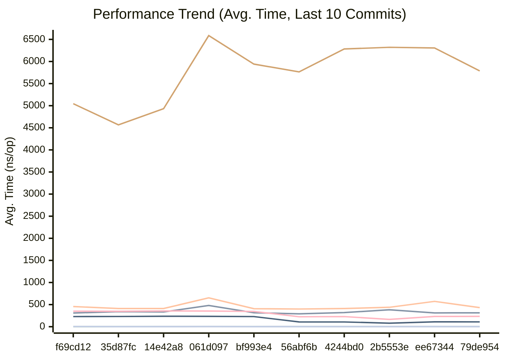
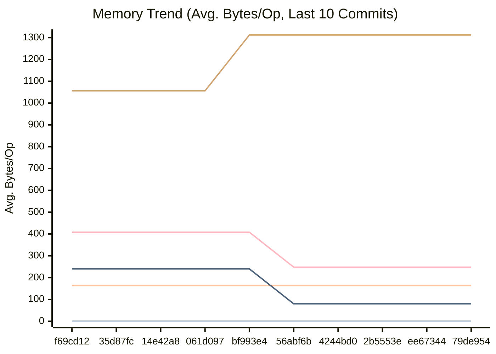
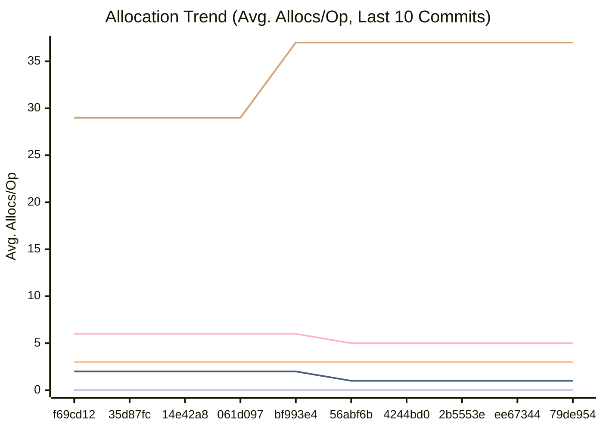

<!-- BENCHMARK_RESULTS_START -->
## Performance

This section is automatically updated by our GitHub Actions workflow.

### Comparison with previous commit

```
                      │ /tmp/old_bench_filtered.txt │      /tmp/new_bench_filtered.txt       │
                      │           sec/op            │    sec/op      vs base                 │
CrushOriginal-8                        573.2n ± ∞ ¹    430.9n ± ∞ ¹        ~ (p=1.000 n=1) ²
CrushOptimized-8                       312.4n ± ∞ ¹    313.8n ± ∞ ¹        ~ (p=1.000 n=1) ²
LoadGlobalConfig-8                     6.306µ ± ∞ ¹    5.787µ ± ∞ ¹        ~ (p=1.000 n=1) ²
PadString-8                            2.019n ± ∞ ¹    2.002n ± ∞ ¹        ~ (p=1.000 n=1) ²
CheckMetricsAndSwap-8                 10.020n ± ∞ ¹    7.709n ± ∞ ¹        ~ (p=1.000 n=1) ²
IndexSearch-8                          2.792n ± ∞ ¹    2.978n ± ∞ ¹        ~ (p=1.000 n=1) ²
IndexDirectTracking-8                 0.4950n ± ∞ ¹   0.3503n ± ∞ ¹        ~ (p=1.000 n=1) ²
geomean                                31.62n          27.73n        -12.30%
¹ need >= 6 samples for confidence interval at level 0.95
² need >= 4 samples to detect a difference at alpha level 0.05

                      │ /tmp/old_bench_filtered.txt │      /tmp/new_bench_filtered.txt      │
                      │            B/op             │     B/op       vs base                │
CrushOriginal-8                         164.0 ± ∞ ¹     164.0 ± ∞ ¹       ~ (p=1.000 n=1) ²
CrushOptimized-8                        0.000 ± ∞ ¹     0.000 ± ∞ ¹       ~ (p=1.000 n=1) ²
LoadGlobalConfig-8                    1.281Ki ± ∞ ¹   1.281Ki ± ∞ ¹       ~ (p=1.000 n=1) ²
PadString-8                             0.000 ± ∞ ¹     0.000 ± ∞ ¹       ~ (p=1.000 n=1) ²
CheckMetricsAndSwap-8                   0.000 ± ∞ ¹     0.000 ± ∞ ¹       ~ (p=1.000 n=1) ²
IndexSearch-8                           0.000 ± ∞ ¹     0.000 ± ∞ ¹       ~ (p=1.000 n=1) ²
IndexDirectTracking-8                   0.000 ± ∞ ¹     0.000 ± ∞ ¹       ~ (p=1.000 n=1) ²
geomean                                           ³                  +0.00%               ³
¹ need >= 6 samples for confidence interval at level 0.95
² all samples are equal
³ summaries must be >0 to compute geomean

                      │ /tmp/old_bench_filtered.txt │     /tmp/new_bench_filtered.txt     │
                      │          allocs/op          │  allocs/op   vs base                │
CrushOriginal-8                         3.000 ± ∞ ¹   3.000 ± ∞ ¹       ~ (p=1.000 n=1) ²
CrushOptimized-8                        0.000 ± ∞ ¹   0.000 ± ∞ ¹       ~ (p=1.000 n=1) ²
LoadGlobalConfig-8                      37.00 ± ∞ ¹   37.00 ± ∞ ¹       ~ (p=1.000 n=1) ²
PadString-8                             0.000 ± ∞ ¹   0.000 ± ∞ ¹       ~ (p=1.000 n=1) ²
CheckMetricsAndSwap-8                   0.000 ± ∞ ¹   0.000 ± ∞ ¹       ~ (p=1.000 n=1) ²
IndexSearch-8                           0.000 ± ∞ ¹   0.000 ± ∞ ¹       ~ (p=1.000 n=1) ²
IndexDirectTracking-8                   0.000 ± ∞ ¹   0.000 ± ∞ ¹       ~ (p=1.000 n=1) ²
geomean                                           ³                +0.00%               ³
¹ need >= 6 samples for confidence interval at level 0.95
² all samples are equal
³ summaries must be >0 to compute geomean
```

### Latest Benchmark Results


| Benchmark | Avg. Time/Op | Avg. Bytes/Op | Avg. Allocs/Op |
|-----------|--------------|---------------|----------------|
| BenchmarkCheckMetricsAndSwap-8 | 7.71 ns/op | 0.00 B/op | 0.00 allocs/op |
| BenchmarkCrushOptimized-8 | 313.80 ns/op | 0.00 B/op | 0.00 allocs/op |
| BenchmarkCrushOriginal-8 | 430.90 ns/op | 164.00 B/op | 3.00 allocs/op |
| BenchmarkIndexDirectTracking-8 | 0.35 ns/op | 0.00 B/op | 0.00 allocs/op |
| BenchmarkIndexSearch-8 | 2.98 ns/op | 0.00 B/op | 0.00 allocs/op |
| BenchmarkLoadGlobalConfig-8 | 5787.00 ns/op | 1312.00 B/op | 37.00 allocs/op |
| BenchmarkPadString-8 | 2.00 ns/op | 0.00 B/op | 0.00 allocs/op |


### Performance History

**Legend**

| Color | Benchmark | Description |
|---|---|---|
| 🟢 | CheckMetricsAndSwap | Evaluation of system metrics (CPU/Mem) and mode switching logic |
| 🟤 | CrushOriginal | Original Sage Weil's CRUSH placement algorithm using reflection and float math |
| ⚪ | CrushOptimized | Performance-tuned CRUSH-lite placement algorithm using bitwise shifts and integer math (Rule 19) |
| 🔵 | IndexDirectTracking | Accessing current replication mode via direct slice index (O(1)) |
| 🔴 | IndexSearch | Searching for current replication mode in the order slice using `slices.Index` |
| 🟠 | LoadGlobalConfig | Parsing and loading the `[global]` section from the INI configuration |
| 🟣 | PadString | Padding strings with null characters to a fixed protocol length |
| 🟡 | ParseReplicationOrder | Parsing the CSV-formatted replication order string into an integer slice |


```mermaid
xychart-beta
    title "Performance Trend (Avg. Time, Last 10 Commits)"
    x-axis "Commit"
    y-axis "Avg. Time (ns/op)"
    x-axis [f69cd12,35d87fc,14e42a8,061d097,bf993e4,56abf6b,4244bd0,2b5553e,ee67344,79de954]
    line "CheckMetricsAndSwap" [9,7,8,11,7,9,8,8,10,8]
    line "CrushOptimized" [310,340,334,480,316,291,320,382,312,314]
    line "CrushOriginal" [456,411,411,653,408,400,411,439,573,431]
    line "IndexDirectTracking" [0,0,0,0,0,0,0,0,0,0]
    line "IndexSearch" [2,3,3,3,3,3,3,3,3,3]
    line "LoadGlobalConfig" [5045,4567,4932,6586,5941,5764,6283,6321,6306,5787]
    line "PadString" [2,2,2,3,2,2,2,2,2,2]
    line "ParseReplicationOrder_NoPrealloc" [350,349,357,354,345,225,229,165,232,234]
    line "ParseReplicationOrder_Prealloc" [229,231,237,234,229,108,107,80,110,109]
```


```mermaid
xychart-beta
    title "Memory Trend (Avg. Bytes/Op, Last 10 Commits)"
    x-axis "Commit"
    y-axis "Avg. Bytes/Op"
    x-axis [f69cd12,35d87fc,14e42a8,061d097,bf993e4,56abf6b,4244bd0,2b5553e,ee67344,79de954]
    line "CheckMetricsAndSwap" [0,0,0,0,0,0,0,0,0,0]
    line "CrushOptimized" [0,0,0,0,0,0,0,0,0,0]
    line "CrushOriginal" [164,164,164,164,164,164,164,164,164,164]
    line "IndexDirectTracking" [0,0,0,0,0,0,0,0,0,0]
    line "IndexSearch" [0,0,0,0,0,0,0,0,0,0]
    line "LoadGlobalConfig" [1056,1056,1056,1056,1312,1312,1312,1312,1312,1312]
    line "PadString" [0,0,0,0,0,0,0,0,0,0]
    line "ParseReplicationOrder_NoPrealloc" [408,408,408,408,408,248,248,248,248,248]
    line "ParseReplicationOrder_Prealloc" [240,240,240,240,240,80,80,80,80,80]
```


```mermaid
xychart-beta
    title "Allocation Trend (Avg. Allocs/Op, Last 10 Commits)"
    x-axis "Commit"
    y-axis "Avg. Allocs/Op"
    x-axis [f69cd12,35d87fc,14e42a8,061d097,bf993e4,56abf6b,4244bd0,2b5553e,ee67344,79de954]
    line "CheckMetricsAndSwap" [0,0,0,0,0,0,0,0,0,0]
    line "CrushOptimized" [0,0,0,0,0,0,0,0,0,0]
    line "CrushOriginal" [3,3,3,3,3,3,3,3,3,3]
    line "IndexDirectTracking" [0,0,0,0,0,0,0,0,0,0]
    line "IndexSearch" [0,0,0,0,0,0,0,0,0,0]
    line "LoadGlobalConfig" [29,29,29,29,37,37,37,37,37,37]
    line "PadString" [0,0,0,0,0,0,0,0,0,0]
    line "ParseReplicationOrder_NoPrealloc" [6,6,6,6,6,5,5,5,5,5]
    line "ParseReplicationOrder_Prealloc" [2,2,2,2,2,1,1,1,1,1]
```
<!-- BENCHMARK_RESULTS_END -->

### E2EE + OPRF overhead

The sections above are auto-generated and cover the hot-path benchmarks. The crypto/OPRF work is measured separately; figures below are from `go test -bench` on the crypto module and are intentionally placed outside the auto-managed block so they persist:

| Benchmark | Avg. Time/Op | Avg. Bytes/Op | Avg. Allocs/Op |
|-----------|--------------|---------------|----------------|
| BenchmarkEncryptStream-8 | 82405 ns/op | 240306 B/op | 59 allocs/op |
| BenchmarkDecryptStream-8 | 92644 ns/op | 270706 B/op | 74 allocs/op |
| BenchmarkDeriveKey-8 | 3539 ns/op | 1361 B/op | 18 allocs/op |
| BenchmarkOPRFCombineThreshold3-8 | 770891 ns/op | 6408 B/op | 196 allocs/op |

With `encryption_enabled`, every byte passes through AES-GCM-256 streaming at ~700-800 MB/s (chunk-bounded memory). The threshold OPRF is evaluated **once per upload/download**, on the dedup tag only (never per chunk): `BenchmarkOPRFCombineThreshold3` measures a one-time ~0.77 ms client-side combine/unblind for threshold-3, plus one round-trip per daemon share. This is negligible against network/disk I/O and does not affect streaming throughput. When `oprf_enabled = false`, the OPRF path is skipped entirely and behavior is identical to the pre-OPRF encryption path (backward compatible).
