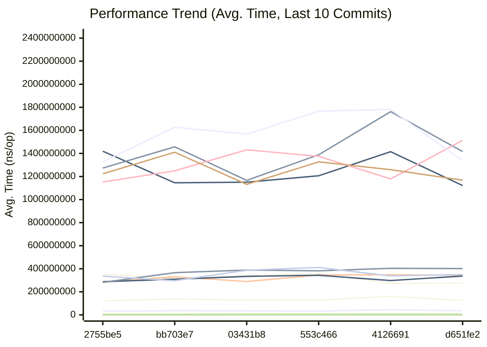
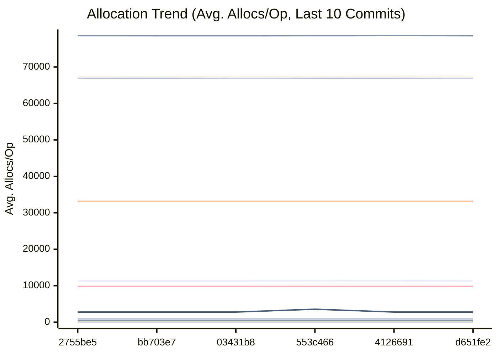

# Performance Benchmarks

This document tracks benchmark performance across commits. The section between
the `BENCHMARK_RESULTS_START/END` markers is auto-generated by the pre-commit
hook; the crypto/OPRF section below is manually maintained.

## How to Read This Document

- **Comparison with previous commit**: `benchstat` output comparing the current
  commit against the previous one. Three tables: **sec/op** (time per operation),
  **B/op** (bytes allocated), **allocs/op** (heap allocations). In each table,
  **lower is better**. `+X%` = regression, `-X%` = improvement, `~` = no
  statistically significant change. `p` is the p-value (p < 0.05 = significant).
- **Latest Benchmark Results**: Single-snapshot table of the current commit's
  averages. Lower values are better across all three columns.
- **Performance Trend plot**: X-axis = commit SHA (left = older, right = newer).
  Y-axis = avg time in ns/op. **Lower lines = faster.** Downward trends are
  improvements; upward spikes are regressions.
- **Memory Trend plot**: Same axes, but Y-axis = avg bytes allocated per op.
  **Lower lines = less memory.** Drops indicate allocation reductions.
- **Allocation Trend plot**: Same axes, but Y-axis = avg heap allocations per op.
  **Lower lines = fewer allocations.** Fewer allocs = less GC pressure.

<!-- BENCHMARK_RESULTS_START -->
## Performance

This section is automatically updated by the pre-commit hook (via .github/scripts/update_readme_with_benchmarks.sh).

### Comparison with previous commit

Each table compares the previous commit (left) to the current commit (right).
**Lower is better** in all three tables. `+X%` = regression, `-X%` = improvement,
`~` = no statistically significant change (p >= 0.05).

- **sec/op**: Time per operation (nanoseconds). Measures raw speed.
- **B/op**: Bytes allocated on the heap per operation. Measures memory usage.
- **allocs/op**: Number of heap allocations per operation. Measures GC pressure.

```
                                      │ /tmp/old_bench_filtered.txt │      /tmp/new_bench_filtered.txt      │
                                      │           sec/op            │    sec/op      vs base                │
CrushOriginal-8                                        855.5n ± ∞ ¹   1307.0n ± ∞ ¹       ~ (p=1.000 n=1) ²
Placement-8                                            8.102µ ± ∞ ¹   10.527µ ± ∞ ¹       ~ (p=1.000 n=1) ²
PlacementDomainSpread-8                                8.684µ ± ∞ ¹   11.049µ ± ∞ ¹       ~ (p=1.000 n=1) ²
CrushOptimized-8                                       593.3n ± ∞ ¹    642.8n ± ∞ ¹       ~ (p=1.000 n=1) ²
LoadGlobalConfig-8                                     20.19µ ± ∞ ¹    22.44µ ± ∞ ¹       ~ (p=1.000 n=1) ²
HashBytes/1MiB-8                                       7.576m ± ∞ ¹    6.665m ± ∞ ¹       ~ (p=1.000 n=1) ²
HashBytes/64MiB-8                                      509.9m ± ∞ ¹    389.3m ± ∞ ¹       ~ (p=1.000 n=1) ²
HashBytes/256MiB-8                                      2.088 ± ∞ ¹     1.563 ± ∞ ¹       ~ (p=1.000 n=1) ²
HashFile/1MiB-8                                        8.227m ± ∞ ¹    7.078m ± ∞ ¹       ~ (p=1.000 n=1) ²
HashFile/64MiB-8                                       558.6m ± ∞ ¹    471.4m ± ∞ ¹       ~ (p=1.000 n=1) ²
HashFile/256MiB-8                                       2.135 ± ∞ ¹     1.717 ± ∞ ¹       ~ (p=1.000 n=1) ²
PadString-8                                            211.1n ± ∞ ¹    164.9n ± ∞ ¹       ~ (p=1.000 n=1) ²
SanitizeLog/Safe-8                                     623.1n ± ∞ ¹    639.2n ± ∞ ¹       ~ (p=1.000 n=1) ²
SanitizeLog/Unsafe-8                                   2.180µ ± ∞ ¹    2.105µ ± ∞ ¹       ~ (p=1.000 n=1) ²
AWSChunkedReaderSigned-8                              1043.2µ ± ∞ ¹    973.5µ ± ∞ ¹       ~ (p=1.000 n=1) ²
AWSChunkedReaderUnsigned-8                             1.352m ± ∞ ¹    1.055m ± ∞ ¹       ~ (p=1.000 n=1) ²
LastModifiedHeader_AppendFormat-8                      610.1n ± ∞ ¹    637.8n ± ∞ ¹       ~ (p=1.000 n=1) ²
LastModifiedHeader_Format-8                            811.5n ± ∞ ¹    694.6n ± ∞ ¹       ~ (p=1.000 n=1) ²
FormatListObjectsV2XML_AppendFormat-8                  2.255m ± ∞ ¹    1.630m ± ∞ ¹       ~ (p=1.000 n=1) ²
FormatListObjectsV2XML_OldFormat-8                    1103.4µ ± ∞ ¹    888.3µ ± ∞ ¹       ~ (p=1.000 n=1) ²
CheckMetricsAndSwap-8                                  17.67n ± ∞ ¹    18.60n ± ∞ ¹       ~ (p=1.000 n=1) ²
IndexSearch-8                                          4.853n ± ∞ ¹    4.366n ± ∞ ¹       ~ (p=1.000 n=1) ²
IndexDirectTracking-8                                 0.8869n ± ∞ ¹   0.8176n ± ∞ ¹       ~ (p=1.000 n=1) ²
LocalWrite/1MiB-8                                      1.771m ± ∞ ¹    1.396m ± ∞ ¹       ~ (p=1.000 n=1) ²
LocalWrite/64MiB-8                                     49.17m ± ∞ ¹    52.34m ± ∞ ¹       ~ (p=1.000 n=1) ²
LocalWrite/256MiB-8                                    160.4m ± ∞ ¹    197.9m ± ∞ ¹       ~ (p=1.000 n=1) ²
ReadVerify/1MiB-8                                      5.631m ± ∞ ¹    6.689m ± ∞ ¹       ~ (p=1.000 n=1) ²
ReadVerify/64MiB-8                                     374.2m ± ∞ ¹    432.8m ± ∞ ¹       ~ (p=1.000 n=1) ²
ReadVerify/256MiB-8                                     1.738 ± ∞ ¹     1.830 ± ∞ ¹       ~ (p=1.000 n=1) ²
TrustedRead/1MiB-8                                     8.368m ± ∞ ¹    7.463m ± ∞ ¹       ~ (p=1.000 n=1) ²
TrustedRead/64MiB-8                                    540.3m ± ∞ ¹    591.5m ± ∞ ¹       ~ (p=1.000 n=1) ²
TrustedRead/256MiB-8                                    2.174 ± ∞ ¹     2.433 ± ∞ ¹       ~ (p=1.000 n=1) ²
S3PutSpool/1MiB-8                                      9.117m ± ∞ ¹    9.492m ± ∞ ¹       ~ (p=1.000 n=1) ²
S3PutSpool/64MiB-8                                     528.5m ± ∞ ¹    651.7m ± ∞ ¹       ~ (p=1.000 n=1) ²
S3PutSpool/256MiB-8                                     2.406 ± ∞ ¹     2.428 ± ∞ ¹       ~ (p=1.000 n=1) ²
geomean                                                724.5µ          709.6µ        -2.05%
¹ need >= 6 samples for confidence interval at level 0.95
² need >= 4 samples to detect a difference at alpha level 0.05

                                      │ /tmp/old_bench_filtered.txt │      /tmp/new_bench_filtered.txt      │
                                      │            B/op             │     B/op       vs base                │
CrushOriginal-8                                         164.0 ± ∞ ¹     164.0 ± ∞ ¹       ~ (p=1.000 n=1) ²
Placement-8                                             352.0 ± ∞ ¹     352.0 ± ∞ ¹       ~ (p=1.000 n=1) ²
PlacementDomainSpread-8                                 352.0 ± ∞ ¹     352.0 ± ∞ ¹       ~ (p=1.000 n=1) ²
CrushOptimized-8                                        0.000 ± ∞ ¹     0.000 ± ∞ ¹       ~ (p=1.000 n=1) ²
LoadGlobalConfig-8                                    1.930Ki ± ∞ ¹   1.930Ki ± ∞ ¹       ~ (p=1.000 n=1) ²
HashBytes/1MiB-8                                        64.00 ± ∞ ¹     64.00 ± ∞ ¹       ~ (p=1.000 n=1) ²
HashBytes/64MiB-8                                       64.00 ± ∞ ¹     64.00 ± ∞ ¹       ~ (p=1.000 n=1) ²
HashBytes/256MiB-8                                      64.00 ± ∞ ¹     64.00 ± ∞ ¹       ~ (p=1.000 n=1) ²
HashFile/1MiB-8                                       32.35Ki ± ∞ ¹   32.35Ki ± ∞ ¹       ~ (p=1.000 n=1) ²
HashFile/64MiB-8                                      32.35Ki ± ∞ ¹   32.35Ki ± ∞ ¹       ~ (p=1.000 n=1) ²
HashFile/256MiB-8                                     32.35Ki ± ∞ ¹   32.35Ki ± ∞ ¹       ~ (p=1.000 n=1) ²
PadString-8                                             64.00 ± ∞ ¹     64.00 ± ∞ ¹       ~ (p=1.000 n=1) ²
SanitizeLog/Safe-8                                      0.000 ± ∞ ¹     0.000 ± ∞ ¹       ~ (p=1.000 n=1) ²
SanitizeLog/Unsafe-8                                    704.0 ± ∞ ¹     704.0 ± ∞ ¹       ~ (p=1.000 n=1) ²
AWSChunkedReaderSigned-8                              11.09Ki ± ∞ ¹   11.12Ki ± ∞ ¹       ~ (p=1.000 n=1) ³
AWSChunkedReaderUnsigned-8                            76.91Ki ± ∞ ¹   76.90Ki ± ∞ ¹       ~ (p=1.000 n=1) ³
LastModifiedHeader_AppendFormat-8                       0.000 ± ∞ ¹     0.000 ± ∞ ¹       ~ (p=1.000 n=1) ²
LastModifiedHeader_Format-8                             32.00 ± ∞ ¹     32.00 ± ∞ ¹       ~ (p=1.000 n=1) ²
FormatListObjectsV2XML_AppendFormat-8                 512.3Ki ± ∞ ¹   512.3Ki ± ∞ ¹       ~ (p=1.000 n=1) ³
FormatListObjectsV2XML_OldFormat-8                    23.44Ki ± ∞ ¹   23.44Ki ± ∞ ¹       ~ (p=1.000 n=1) ²
CheckMetricsAndSwap-8                                   0.000 ± ∞ ¹     0.000 ± ∞ ¹       ~ (p=1.000 n=1) ²
IndexSearch-8                                           0.000 ± ∞ ¹     0.000 ± ∞ ¹       ~ (p=1.000 n=1) ²
IndexDirectTracking-8                                   0.000 ± ∞ ¹     0.000 ± ∞ ¹       ~ (p=1.000 n=1) ²
LocalWrite/1MiB-8                                     65.47Ki ± ∞ ¹   65.47Ki ± ∞ ¹       ~ (p=1.000 n=1) ³
LocalWrite/64MiB-8                                    65.56Ki ± ∞ ¹   65.56Ki ± ∞ ¹       ~ (p=1.000 n=1) ²
LocalWrite/256MiB-8                                   65.87Ki ± ∞ ¹   65.95Ki ± ∞ ¹       ~ (p=1.000 n=1) ³
ReadVerify/1MiB-8                                       484.0 ± ∞ ¹     493.0 ± ∞ ¹       ~ (p=1.000 n=1) ³
ReadVerify/64MiB-8                                    2.711Ki ± ∞ ¹   3.474Ki ± ∞ ¹       ~ (p=1.000 n=1) ³
ReadVerify/256MiB-8                                   9.578Ki ± ∞ ¹   9.578Ki ± ∞ ¹       ~ (p=1.000 n=1) ²
TrustedRead/1MiB-8                                      800.0 ± ∞ ¹     800.0 ± ∞ ¹       ~ (p=1.000 n=1) ²
TrustedRead/64MiB-8                                     800.0 ± ∞ ¹     800.0 ± ∞ ¹       ~ (p=1.000 n=1) ²
TrustedRead/256MiB-8                                    800.0 ± ∞ ¹     800.0 ± ∞ ¹       ~ (p=1.000 n=1) ²
S3PutSpool/1MiB-8                                       448.0 ± ∞ ¹     448.0 ± ∞ ¹       ~ (p=1.000 n=1) ²
S3PutSpool/64MiB-8                                      448.0 ± ∞ ¹     448.0 ± ∞ ¹       ~ (p=1.000 n=1) ²
S3PutSpool/256MiB-8                                     448.0 ± ∞ ¹     448.0 ± ∞ ¹       ~ (p=1.000 n=1) ²
geomean                                                           ⁴                  +0.78%               ⁴
¹ need >= 6 samples for confidence interval at level 0.95
² all samples are equal
³ need >= 4 samples to detect a difference at alpha level 0.05
⁴ summaries must be >0 to compute geomean

                                      │ /tmp/old_bench_filtered.txt │     /tmp/new_bench_filtered.txt      │
                                      │          allocs/op          │  allocs/op    vs base                │
CrushOriginal-8                                         3.000 ± ∞ ¹    3.000 ± ∞ ¹       ~ (p=1.000 n=1) ²
Placement-8                                             6.000 ± ∞ ¹    6.000 ± ∞ ¹       ~ (p=1.000 n=1) ²
PlacementDomainSpread-8                                 6.000 ± ∞ ¹    6.000 ± ∞ ¹       ~ (p=1.000 n=1) ²
CrushOptimized-8                                        0.000 ± ∞ ¹    0.000 ± ∞ ¹       ~ (p=1.000 n=1) ²
LoadGlobalConfig-8                                      58.00 ± ∞ ¹    58.00 ± ∞ ¹       ~ (p=1.000 n=1) ²
HashBytes/1MiB-8                                        1.000 ± ∞ ¹    1.000 ± ∞ ¹       ~ (p=1.000 n=1) ²
HashBytes/64MiB-8                                       1.000 ± ∞ ¹    1.000 ± ∞ ¹       ~ (p=1.000 n=1) ²
HashBytes/256MiB-8                                      1.000 ± ∞ ¹    1.000 ± ∞ ¹       ~ (p=1.000 n=1) ²
HashFile/1MiB-8                                         6.000 ± ∞ ¹    6.000 ± ∞ ¹       ~ (p=1.000 n=1) ²
HashFile/64MiB-8                                        6.000 ± ∞ ¹    6.000 ± ∞ ¹       ~ (p=1.000 n=1) ²
HashFile/256MiB-8                                       6.000 ± ∞ ¹    6.000 ± ∞ ¹       ~ (p=1.000 n=1) ²
PadString-8                                             1.000 ± ∞ ¹    1.000 ± ∞ ¹       ~ (p=1.000 n=1) ²
SanitizeLog/Safe-8                                      0.000 ± ∞ ¹    0.000 ± ∞ ¹       ~ (p=1.000 n=1) ²
SanitizeLog/Unsafe-8                                    1.000 ± ∞ ¹    1.000 ± ∞ ¹       ~ (p=1.000 n=1) ²
AWSChunkedReaderSigned-8                                80.00 ± ∞ ¹    80.00 ± ∞ ¹       ~ (p=1.000 n=1) ²
AWSChunkedReaderUnsigned-8                              15.00 ± ∞ ¹    15.00 ± ∞ ¹       ~ (p=1.000 n=1) ²
LastModifiedHeader_AppendFormat-8                       0.000 ± ∞ ¹    0.000 ± ∞ ¹       ~ (p=1.000 n=1) ²
LastModifiedHeader_Format-8                             1.000 ± ∞ ¹    1.000 ± ∞ ¹       ~ (p=1.000 n=1) ²
FormatListObjectsV2XML_AppendFormat-8                   16.00 ± ∞ ¹    16.00 ± ∞ ¹       ~ (p=1.000 n=1) ²
FormatListObjectsV2XML_OldFormat-8                     1.000k ± ∞ ¹   1.000k ± ∞ ¹       ~ (p=1.000 n=1) ²
CheckMetricsAndSwap-8                                   0.000 ± ∞ ¹    0.000 ± ∞ ¹       ~ (p=1.000 n=1) ²
IndexSearch-8                                           0.000 ± ∞ ¹    0.000 ± ∞ ¹       ~ (p=1.000 n=1) ²
IndexDirectTracking-8                                   0.000 ± ∞ ¹    0.000 ± ∞ ¹       ~ (p=1.000 n=1) ²
LocalWrite/1MiB-8                                       18.00 ± ∞ ¹    18.00 ± ∞ ¹       ~ (p=1.000 n=1) ²
LocalWrite/64MiB-8                                      18.00 ± ∞ ¹    18.00 ± ∞ ¹       ~ (p=1.000 n=1) ²
LocalWrite/256MiB-8                                     20.00 ± ∞ ¹    21.00 ± ∞ ¹       ~ (p=1.000 n=1) ³
ReadVerify/1MiB-8                                       6.000 ± ∞ ¹    6.000 ± ∞ ¹       ~ (p=1.000 n=1) ²
ReadVerify/64MiB-8                                      7.000 ± ∞ ¹    7.000 ± ∞ ¹       ~ (p=1.000 n=1) ²
ReadVerify/256MiB-8                                     10.00 ± ∞ ¹    10.00 ± ∞ ¹       ~ (p=1.000 n=1) ²
TrustedRead/1MiB-8                                      11.00 ± ∞ ¹    11.00 ± ∞ ¹       ~ (p=1.000 n=1) ²
TrustedRead/64MiB-8                                     11.00 ± ∞ ¹    11.00 ± ∞ ¹       ~ (p=1.000 n=1) ²
TrustedRead/256MiB-8                                    11.00 ± ∞ ¹    11.00 ± ∞ ¹       ~ (p=1.000 n=1) ²
S3PutSpool/1MiB-8                                       10.00 ± ∞ ¹    10.00 ± ∞ ¹       ~ (p=1.000 n=1) ²
S3PutSpool/64MiB-8                                      10.00 ± ∞ ¹    10.00 ± ∞ ¹       ~ (p=1.000 n=1) ²
S3PutSpool/256MiB-8                                     10.00 ± ∞ ¹    10.00 ± ∞ ¹       ~ (p=1.000 n=1) ²
geomean                                                           ⁴                 +0.14%               ⁴
¹ need >= 6 samples for confidence interval at level 0.95
² all samples are equal
³ need >= 4 samples to detect a difference at alpha level 0.05
⁴ summaries must be >0 to compute geomean

                           │ /tmp/old_bench_filtered.txt │      /tmp/new_bench_filtered.txt      │
                           │             B/s             │      B/s       vs base                │
HashBytes/1MiB-8                           132.0Mi ± ∞ ¹   150.0Mi ± ∞ ¹       ~ (p=1.000 n=1) ²
HashBytes/64MiB-8                          125.5Mi ± ∞ ¹   164.4Mi ± ∞ ¹       ~ (p=1.000 n=1) ²
HashBytes/256MiB-8                         122.6Mi ± ∞ ¹   163.8Mi ± ∞ ¹       ~ (p=1.000 n=1) ²
HashFile/1MiB-8                            121.5Mi ± ∞ ¹   141.3Mi ± ∞ ¹       ~ (p=1.000 n=1) ²
HashFile/64MiB-8                           114.6Mi ± ∞ ¹   135.8Mi ± ∞ ¹       ~ (p=1.000 n=1) ²
HashFile/256MiB-8                          119.9Mi ± ∞ ¹   149.1Mi ± ∞ ¹       ~ (p=1.000 n=1) ²
AWSChunkedReaderSigned-8                   60.84Mi ± ∞ ¹   65.20Mi ± ∞ ¹       ~ (p=1.000 n=1) ²
AWSChunkedReaderUnsigned-8                 46.95Mi ± ∞ ¹   60.19Mi ± ∞ ¹       ~ (p=1.000 n=1) ²
LocalWrite/1MiB-8                          564.7Mi ± ∞ ¹   716.6Mi ± ∞ ¹       ~ (p=1.000 n=1) ²
LocalWrite/64MiB-8                         1.271Gi ± ∞ ¹   1.194Gi ± ∞ ¹       ~ (p=1.000 n=1) ²
LocalWrite/256MiB-8                        1.559Gi ± ∞ ¹   1.263Gi ± ∞ ¹       ~ (p=1.000 n=1) ²
ReadVerify/1MiB-8                          177.6Mi ± ∞ ¹   149.5Mi ± ∞ ¹       ~ (p=1.000 n=1) ²
ReadVerify/64MiB-8                         171.0Mi ± ∞ ¹   147.9Mi ± ∞ ¹       ~ (p=1.000 n=1) ²
ReadVerify/256MiB-8                        147.3Mi ± ∞ ¹   139.9Mi ± ∞ ¹       ~ (p=1.000 n=1) ²
TrustedRead/1MiB-8                         119.5Mi ± ∞ ¹   134.0Mi ± ∞ ¹       ~ (p=1.000 n=1) ²
TrustedRead/64MiB-8                        118.5Mi ± ∞ ¹   108.2Mi ± ∞ ¹       ~ (p=1.000 n=1) ²
TrustedRead/256MiB-8                       117.8Mi ± ∞ ¹   105.2Mi ± ∞ ¹       ~ (p=1.000 n=1) ²
S3PutSpool/1MiB-8                          109.7Mi ± ∞ ¹   105.4Mi ± ∞ ¹       ~ (p=1.000 n=1) ²
S3PutSpool/64MiB-8                        121.10Mi ± ∞ ¹   98.21Mi ± ∞ ¹       ~ (p=1.000 n=1) ²
S3PutSpool/256MiB-8                        106.4Mi ± ∞ ¹   105.4Mi ± ∞ ¹       ~ (p=1.000 n=1) ²
geomean                                    159.9Mi         166.4Mi        +4.04%
¹ need >= 6 samples for confidence interval at level 0.95
² need >= 4 samples to detect a difference at alpha level 0.05
```

### Latest Benchmark Results

Single-snapshot of the current commit's averages. **Lower is better** across all
three columns: time (speed), bytes (memory), allocs (GC pressure).


| Benchmark | Avg. Time/Op | Avg. Bytes/Op | Avg. Allocs/Op |
|-----------|--------------|---------------|----------------|
| BenchmarkAWSChunkedReaderSigned-8 | 973548.00 ns/op | 68.37 B/op | 11392.00 allocs/op |
| BenchmarkAWSChunkedReaderUnsigned-8 | 1054695.00 ns/op | 63.11 B/op | 78742.00 allocs/op |
| BenchmarkCheckMetricsAndSwap-8 | 18.60 ns/op | 0.00 B/op | 0.00 allocs/op |
| BenchmarkCrushOptimized-8 | 642.80 ns/op | 0.00 B/op | 0.00 allocs/op |
| BenchmarkCrushOriginal-8 | 1307.00 ns/op | 164.00 B/op | 3.00 allocs/op |
| BenchmarkFormatListObjectsV2XML_AppendFormat-8 | 1630321.00 ns/op | 524552.00 B/op | 16.00 allocs/op |
| BenchmarkFormatListObjectsV2XML_OldFormat-8 | 888288.00 ns/op | 24000.00 B/op | 1000.00 allocs/op |
| BenchmarkHashBytes/1MiB-8 | 6664907.00 ns/op | 157.33 B/op | 64.00 allocs/op |
| BenchmarkHashBytes/256MiB-8 | 1563281181.00 ns/op | 171.71 B/op | 64.00 allocs/op |
| BenchmarkHashBytes/64MiB-8 | 389285110.00 ns/op | 172.39 B/op | 64.00 allocs/op |
| BenchmarkHashFile/1MiB-8 | 7078150.00 ns/op | 148.14 B/op | 33128.00 allocs/op |
| BenchmarkHashFile/256MiB-8 | 1716532942.00 ns/op | 156.38 B/op | 33128.00 allocs/op |
| BenchmarkHashFile/64MiB-8 | 471436906.00 ns/op | 142.35 B/op | 33128.00 allocs/op |
| BenchmarkIndexDirectTracking-8 | 0.82 ns/op | 0.00 B/op | 0.00 allocs/op |
| BenchmarkIndexSearch-8 | 4.37 ns/op | 0.00 B/op | 0.00 allocs/op |
| BenchmarkLastModifiedHeader_AppendFormat-8 | 637.80 ns/op | 0.00 B/op | 0.00 allocs/op |
| BenchmarkLastModifiedHeader_Format-8 | 694.60 ns/op | 32.00 B/op | 1.00 allocs/op |
| BenchmarkLoadGlobalConfig-8 | 22438.00 ns/op | 1976.00 B/op | 58.00 allocs/op |
| BenchmarkLocalWrite/1MiB-8 | 1395534.00 ns/op | 751.38 B/op | 67042.00 allocs/op |
| BenchmarkLocalWrite/256MiB-8 | 197917420.00 ns/op | 1356.30 B/op | 67537.00 allocs/op |
| BenchmarkLocalWrite/64MiB-8 | 52341255.00 ns/op | 1282.14 B/op | 67134.00 allocs/op |
| BenchmarkPadString-8 | 164.90 ns/op | 64.00 B/op | 1.00 allocs/op |
| BenchmarkPlacement-8 | 10527.00 ns/op | 352.00 B/op | 6.00 allocs/op |
| BenchmarkPlacementDomainSpread-8 | 11049.00 ns/op | 352.00 B/op | 6.00 allocs/op |
| BenchmarkReadVerify/1MiB-8 | 6689386.00 ns/op | 156.75 B/op | 493.00 allocs/op |
| BenchmarkReadVerify/256MiB-8 | 1830120119.00 ns/op | 146.68 B/op | 9808.00 allocs/op |
| BenchmarkReadVerify/64MiB-8 | 432795151.00 ns/op | 155.06 B/op | 3557.00 allocs/op |
| BenchmarkS3PutSpool/1MiB-8 | 9491833.00 ns/op | 110.47 B/op | 448.00 allocs/op |
| BenchmarkS3PutSpool/256MiB-8 | 2428268969.00 ns/op | 110.55 B/op | 448.00 allocs/op |
| BenchmarkS3PutSpool/64MiB-8 | 651666227.00 ns/op | 102.98 B/op | 448.00 allocs/op |
| BenchmarkSanitizeLog/Safe-8 | 639.20 ns/op | 0.00 B/op | 0.00 allocs/op |
| BenchmarkSanitizeLog/Unsafe-8 | 2105.00 ns/op | 704.00 B/op | 1.00 allocs/op |
| BenchmarkTrustedRead/1MiB-8 | 7463250.00 ns/op | 140.50 B/op | 800.00 allocs/op |
| BenchmarkTrustedRead/256MiB-8 | 2433008029.00 ns/op | 110.33 B/op | 800.00 allocs/op |
| BenchmarkTrustedRead/64MiB-8 | 591536062.00 ns/op | 113.45 B/op | 800.00 allocs/op |


### Performance History

**Legend**

| Color | Benchmark | Description |
|---|---|---|
| 🟢 | CheckMetricsAndSwap | Evaluation of system metrics (CPU/Mem) and mode switching logic |
| 🟤 | CrushOriginal | Original Sage Weil's CRUSH placement algorithm using reflection and float math |
| ⚪ | CrushOptimized | Performance-tuned CRUSH-lite placement algorithm using bitwise shifts and integer math (Rule 19) |
| 🔵 | IndexDirectTracking | Accessing current replication mode via direct slice index (O(1)) |
| 🔴 | IndexSearch | Searching for current replication mode in the order slice using `slices.Index` |
| 🟠 | LoadGlobalConfig | Parsing and loading the `[global]` section from the INI configuration |
| 🟣 | PadString | Padding strings with null characters to a fixed protocol length |
| 🟡 | ParseReplicationOrder | Parsing the CSV-formatted replication order string into an integer slice |

#### Time per Operation (ns/op)

X-axis: commit SHA (left = older, right = newer). Y-axis: avg time in ns/op.
**Lower lines = faster code.** Downward trends are improvements; upward spikes
are regressions to investigate.


```mermaid
xychart-beta
    title "Performance Trend (Avg. Time, Last 10 Commits)"
    x-axis "Commit"
    y-axis "Avg. Time (ns/op)"
    x-axis [2755be5,bb703e7,03431b8,553c466,4126691,d651fe2]
    line "AWSChunkedReaderSigned" [584439,539275,522839,619200,756300,663569,620161,606537,1043223,973548]
    line "AWSChunkedReaderUnsigned" [611665,550355,604498,664009,703433,611889,631352,615450,1351997,1054695]
    line "CheckMetricsAndSwap" [10,11,10,10,12,13,11,9,18,19]
    line "CrushOptimized" [432,471,405,485,513,528,381,489,593,643]
    line "CrushOriginal" [712,650,699,646,673,697,599,581,856,1307]
    line "FormatListObjectsV2XML_AppendFormat" [799795,1039816,911991,1056478,1286421,1165434,922011,962696,2255056,1630321]
    line "FormatListObjectsV2XML_OldFormat" [464905,458449,554255,545961,720703,674915,518253,488621,1103444,888288]
    line "HashBytes/1MiB" [5064237,4383380,5547571,5240058,5525510,5093044,3747347,5123782,7575501,6664907]
    line "HashBytes/256MiB" [1419279092,1145420213,1150583944,1206314796,1415065243,1121544781,1441434671,1284521850,2087994619,1563281181]
    line "HashBytes/64MiB" [355000134,315394868,341933076,357748084,272405322,277104353,321801782,289844742,509860327,389285110]
    line "HashFile/1MiB" [5747827,5999828,5183292,5520031,4909353,4510294,6901410,4299477,8227082,7078150]
    line "HashFile/256MiB" [1273023822,1457159370,1166573869,1388569817,1761951053,1416186973,1274613971,1030231274,2135226775,1716532942]
    line "HashFile/64MiB" [282613785,330397537,289173153,345945889,348425613,343417056,354037155,260223898,558613671,471436906]
    line "IndexDirectTracking" [0,0,1,1,1,1,1,0,1,1]
    line "IndexSearch" [4,3,3,4,4,4,4,4,5,4]
    line "LastModifiedHeader_AppendFormat" [340,415,345,364,441,320,312,319,610,638]
    line "LastModifiedHeader_Format" [398,514,394,431,520,582,394,406,812,695]
    line "LoadGlobalConfig" [16366,13776,15095,13488,14097,14525,12164,12907,20187,22438]
    line "LocalWrite/1MiB" [552166,778898,525512,577002,644852,573249,584326,612314,1771010,1395534]
    line "LocalWrite/256MiB" [121284509,138380852,128601282,128702495,161190175,125958619,133440934,107404943,160392504,197917420]
    line "LocalWrite/64MiB" [32531111,36029215,35542782,33119476,44891953,35402077,33399170,28308935,49166059,52341255]
    line "PadString" [70,69,64,70,76,63,80,61,211,165]
    line "ParseReplicationOrder_NoPrealloc" [350,349,357,354,345,225,229,165,232,234]
    line "ParseReplicationOrder_Prealloc" [229,231,237,234,229,108,107,80,110,109]
    line "Placement" [7344,6922,7453,7406,7040,7327,6313,6933,8102,10527]
    line "PlacementDomainSpread" [7236,7465,7811,7868,7303,7101,6619,8426,8684,11049]
    line "ReadVerify/1MiB" [3970325,4753309,4723356,4600918,6614208,4999715,4807436,3448579,5630820,6689386]
    line "ReadVerify/256MiB" [1152182050,1249327431,1431247520,1374887457,1179131329,1513480600,1025626350,1253185341,1738129398,1830120119]
    line "ReadVerify/64MiB" [288365836,309264832,334268234,343492740,297878657,337113294,296627981,281005831,374198113,432795151]
    line "S3PutSpool/1MiB" [5066289,6659391,6179992,6697030,5335678,5117449,4156487,6430516,9117398,9491833]
    line "S3PutSpool/256MiB" [1327631659,1627622695,1567298391,1766547568,1781197744,1337418784,1086529024,1304364707,2406472426,2428268969]
    line "S3PutSpool/64MiB" [282251478,366146558,388891982,382189999,404192768,401720115,306669378,354128133,528507413,651666227]
    line "SanitizeLog/Safe" [386,270,283,316,423,332,390,316,623,639]
    line "SanitizeLog/Unsafe" [1163,1016,1039,1170,1356,1050,1036,1076,2180,2105]
    line "TrustedRead/1MiB" [4848751,4607932,6032847,6124228,5111302,5878450,3751975,4741810,8367879,7463250]
    line "TrustedRead/256MiB" [1223453299,1410403058,1131933188,1326976357,1259207320,1168045663,1223117446,1462605918,2173767229,2433008029]
    line "TrustedRead/64MiB" [336501521,296487000,387555406,411444369,337664579,350083685,287609190,397868130,540269082,591536062]
```

#### Memory per Operation (B/op)

X-axis: commit SHA. Y-axis: avg bytes allocated per op.
**Lower lines = less memory.** Drops indicate allocation reductions.


```mermaid
xychart-beta
    title "Memory Trend (Avg. Bytes/Op, Last 10 Commits)"
    x-axis "Commit"
    y-axis "Avg. Bytes/Op"
    x-axis [2755be5,bb703e7,03431b8,553c466,4126691,d651fe2]
    line "AWSChunkedReaderSigned" [114,123,127,107,88,100,107,110,64,68]
    line "AWSChunkedReaderUnsigned" [109,121,110,100,95,109,105,108,49,63]
    line "CheckMetricsAndSwap" [0,0,0,0,0,0,0,0,0,0]
    line "CrushOptimized" [0,0,0,0,0,0,0,0,0,0]
    line "CrushOriginal" [164,164,164,164,164,164,164,164,164,164]
    line "FormatListObjectsV2XML_AppendFormat" [524463,524491,524477,524500,524483,524504,524463,524460,524580,524552]
    line "FormatListObjectsV2XML_OldFormat" [24000,24000,24000,24000,24000,24000,24000,24000,24000,24000]
    line "HashBytes/1MiB" [207,239,189,200,190,206,280,205,138,157]
    line "HashBytes/256MiB" [189,234,233,223,190,239,186,209,129,172]
    line "HashBytes/64MiB" [189,213,196,188,246,242,209,232,132,172]
    line "HashFile/1MiB" [182,175,202,190,214,232,152,244,127,148]
    line "HashFile/256MiB" [211,184,230,193,152,190,211,261,126,156]
    line "HashFile/64MiB" [237,203,232,194,193,195,190,258,120,142]
    line "IndexDirectTracking" [0,0,0,0,0,0,0,0,0,0]
    line "IndexSearch" [0,0,0,0,0,0,0,0,0,0]
    line "LastModifiedHeader_AppendFormat" [0,0,0,0,0,0,0,0,0,0]
    line "LastModifiedHeader_Format" [32,32,32,32,32,32,32,32,32,32]
    line "LoadGlobalConfig" [1976,1976,1976,1976,1976,1976,1976,1976,1976,1976]
    line "LocalWrite/1MiB" [1899,1346,1995,1817,1626,1829,1794,1712,592,751]
    line "LocalWrite/256MiB" [2213,1940,2087,2086,1665,2131,2012,2499,1674,1356]
    line "LocalWrite/64MiB" [2063,1863,1888,2026,1495,1896,2009,2371,1365,1282]
    line "PadString" [64,64,64,64,64,64,64,64,64,64]
    line "ParseReplicationOrder_NoPrealloc" [408,408,408,408,408,248,248,248,248,248]
    line "ParseReplicationOrder_Prealloc" [240,240,240,240,240,80,80,80,80,80]
    line "Placement" [352,352,352,352,352,352,352,352,352,352]
    line "PlacementDomainSpread" [352,352,352,352,352,352,352,352,352,352]
    line "ReadVerify/1MiB" [264,221,222,228,159,210,218,304,186,157]
    line "ReadVerify/256MiB" [233,215,188,195,228,177,262,214,154,147]
    line "ReadVerify/64MiB" [233,217,201,195,225,199,226,239,179,155]
    line "S3PutSpool/1MiB" [207,157,170,157,197,205,252,163,115,110]
    line "S3PutSpool/256MiB" [202,165,171,152,151,201,247,206,112,111]
    line "S3PutSpool/64MiB" [238,183,173,176,166,167,219,190,127,103]
    line "SanitizeLog/Safe" [0,0,0,0,0,0,0,0,0,0]
    line "SanitizeLog/Unsafe" [704,704,704,704,704,704,704,704,704,704]
    line "TrustedRead/1MiB" [216,228,174,171,205,178,279,221,125,140]
    line "TrustedRead/256MiB" [219,190,237,202,213,230,219,184,123,110]
    line "TrustedRead/64MiB" [199,226,173,163,199,192,233,169,124,113]
```

#### Allocations per Operation (allocs/op)

X-axis: commit SHA. Y-axis: avg heap allocations per op.
**Lower lines = fewer allocations.** Fewer allocs = less GC pressure.


```mermaid
xychart-beta
    title "Allocation Trend (Avg. Allocs/Op, Last 10 Commits)"
    x-axis "Commit"
    y-axis "Avg. Allocs/Op"
    x-axis [2755be5,bb703e7,03431b8,553c466,4126691,d651fe2]
    line "AWSChunkedReaderSigned" [11307,11302,11307,11334,11352,11308,11331,11309,11357,11392]
    line "AWSChunkedReaderUnsigned" [78613,78584,78583,78611,78631,78600,78609,78603,78751,78742]
    line "CheckMetricsAndSwap" [0,0,0,0,0,0,0,0,0,0]
    line "CrushOptimized" [0,0,0,0,0,0,0,0,0,0]
    line "CrushOriginal" [3,3,3,3,3,3,3,3,3,3]
    line "FormatListObjectsV2XML_AppendFormat" [16,16,16,16,16,16,16,16,16,16]
    line "FormatListObjectsV2XML_OldFormat" [1000,1000,1000,1000,1000,1000,1000,1000,1000,1000]
    line "HashBytes/1MiB" [64,64,64,64,64,64,64,64,64,64]
    line "HashBytes/256MiB" [64,64,64,64,64,64,64,64,64,64]
    line "HashBytes/64MiB" [64,64,64,64,64,64,64,64,64,64]
    line "HashFile/1MiB" [33128,33128,33128,33128,33128,33128,33128,33128,33128,33128]
    line "HashFile/256MiB" [33128,33128,33128,33128,33128,33128,33128,33128,33128,33128]
    line "HashFile/64MiB" [33128,33128,33128,33128,33128,33128,33128,33128,33128,33128]
    line "IndexDirectTracking" [0,0,0,0,0,0,0,0,0,0]
    line "IndexSearch" [0,0,0,0,0,0,0,0,0,0]
    line "LastModifiedHeader_AppendFormat" [0,0,0,0,0,0,0,0,0,0]
    line "LastModifiedHeader_Format" [1,1,1,1,1,1,1,1,1,1]
    line "LoadGlobalConfig" [58,58,58,58,58,58,58,58,58,58]
    line "LocalWrite/1MiB" [67026,67032,67028,67034,67036,67032,67028,67031,67046,67042]
    line "LocalWrite/256MiB" [67322,67349,67419,67379,67488,67427,67403,67338,67449,67537]
    line "LocalWrite/64MiB" [67084,67096,67074,67087,67088,67081,67097,67088,67134,67134]
    line "PadString" [1,1,1,1,1,1,1,1,1,1]
    line "ParseReplicationOrder_NoPrealloc" [6,6,6,6,6,5,5,5,5,5]
    line "ParseReplicationOrder_Prealloc" [2,2,2,2,2,1,1,1,1,1]
    line "Placement" [6,6,6,6,6,6,6,6,6,6]
    line "PlacementDomainSpread" [6,6,6,6,6,6,6,6,6,6]
    line "ReadVerify/1MiB" [463,468,467,468,486,478,467,459,484,493]
    line "ReadVerify/256MiB" [9808,9808,9808,9808,9808,9808,5120,9808,9808,9808]
    line "ReadVerify/64MiB" [2776,2776,2776,3557,2776,2776,2776,2307,2776,3557]
    line "S3PutSpool/1MiB" [447,447,447,447,447,447,448,447,448,448]
    line "S3PutSpool/256MiB" [448,448,448,448,448,448,448,448,448,448]
    line "S3PutSpool/64MiB" [448,448,448,448,448,448,448,448,448,448]
    line "SanitizeLog/Safe" [0,0,0,0,0,0,0,0,0,0]
    line "SanitizeLog/Unsafe" [1,1,1,1,1,1,1,1,1,1]
    line "TrustedRead/1MiB" [800,800,800,800,800,800,800,837,800,800]
    line "TrustedRead/256MiB" [800,800,800,800,800,800,800,800,800,800]
    line "TrustedRead/64MiB" [800,800,800,800,800,800,800,800,800,800]
```
<!-- BENCHMARK_RESULTS_END -->

### E2EE + OPRF overhead

The sections above are auto-generated and cover the hot-path benchmarks. The
crypto/OPRF work is measured separately; figures below are from `go test -bench`
on the crypto module and are intentionally placed outside the auto-managed block
so they persist.

**Lower is better** across all columns. These benchmarks run on `src/crypto` only
(not tracked in the auto-generated plots above).

| Benchmark | What it measures | Avg. Time/Op | Avg. Bytes/Op | Avg. Allocs/Op |
|-----------|------------------|--------------|---------------|----------------|
| EncryptStream | AES-GCM-256 chunked encryption (64KB input) | ~63 µs | 167 KB | 14 |
| DecryptStream | AES-GCM-256 chunked decryption (64KB input) | ~54 µs | 136 KB | 13 |
| DeriveKey | HKDF-SHA256 key derivation per tenant | ~3.5 µs | 1.3 KB | 18 |
| OPRFCombineThreshold3 | Threshold-3 OPRF combine + unblind (Ristretto255) | ~530 µs | 2.3 KB | 62 |

With `encryption_enabled`, every byte passes through AES-GCM-256 streaming at
~800-1200 MB/s (chunk-bounded memory). The streaming format is **StreamVersion
v4 (issue #824)** with a self-describing chunk size: the default 4096-byte
chunk preserves prior throughput, and the chunk size can be raised/lowered via
`SetStreamChunkSize` within `[512, 4128]` for latency/memory trade-offs without
a wire change in framing beyond the 2-byte header field (v3/v2 blobs still
decode). The threshold OPRF is evaluated **once per
upload/download**, on the dedup tag only (never per chunk):
`OPRFCombineThreshold3` measures a one-time ~0.53 ms client-side combine/unblind
for threshold-3, plus one round-trip per daemon share. This is negligible against
network/disk I/O and does not affect streaming throughput. When `oprf_enabled =
false`, the OPRF path is skipped entirely and behavior is identical to the
pre-OPRF encryption path (backward compatible).
