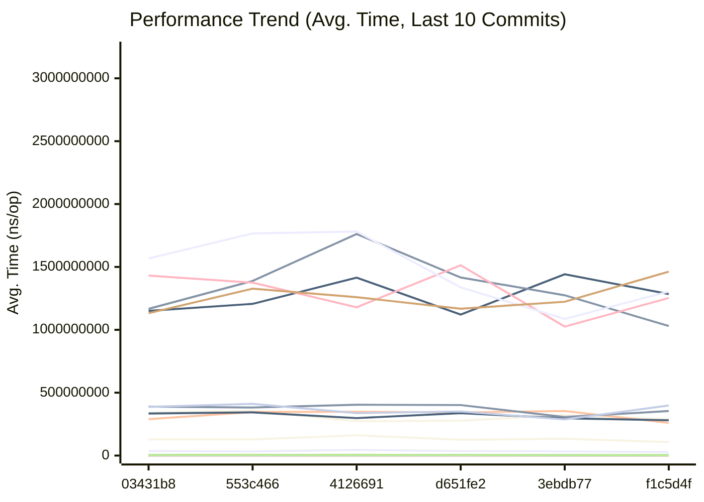
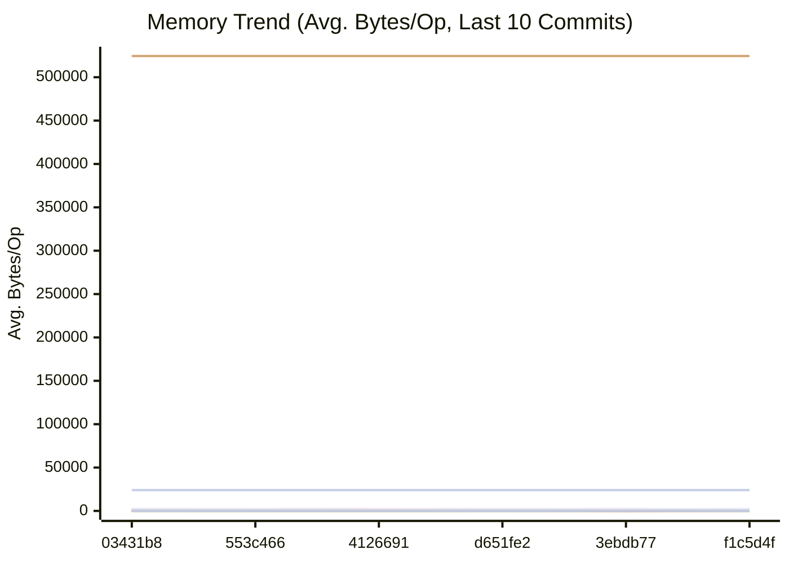
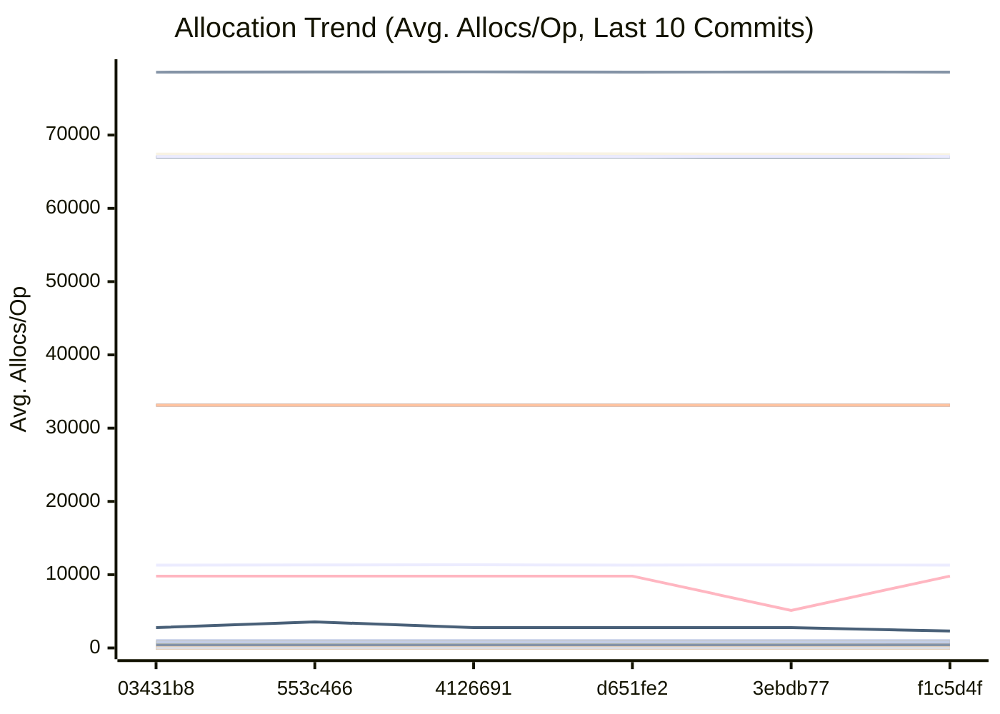

# Performance Benchmarks

This document tracks benchmark performance across commits. The section between
the `BENCHMARK_RESULTS_START/END` markers is auto-generated by the pre-commit
hook; the crypto/OPRF section below is manually maintained.

## How to Read This Document

- **Comparison with previous commit**: `benchstat` output comparing the current
  commit against the previous one. Three tables: **sec/op** (time per operation),
  **B/op** (bytes allocated), **allocs/op** (heap allocations). In each table,
  **lower is better**. `+X%` = regression, `-X%` = improvement, `~` = no
  statistically significant change. `p` is the p-value (p < 0.05 = significant).
- **Latest Benchmark Results**: Single-snapshot table of the current commit's
  averages. Lower values are better across all three columns.
- **Performance Trend plot**: X-axis = commit SHA (left = older, right = newer).
  Y-axis = avg time in ns/op. **Lower lines = faster.** Downward trends are
  improvements; upward spikes are regressions.
- **Memory Trend plot**: Same axes, but Y-axis = avg bytes allocated per op.
  **Lower lines = less memory.** Drops indicate allocation reductions.
- **Allocation Trend plot**: Same axes, but Y-axis = avg heap allocations per op.
  **Lower lines = fewer allocations.** Fewer allocs = less GC pressure.

<!-- BENCHMARK_RESULTS_START -->
## Performance

This section is automatically updated by the pre-commit hook (via .github/scripts/update_readme_with_benchmarks.sh).

### Comparison with previous commit

Each table compares the previous commit (left) to the current commit (right).
**Lower is better** in all three tables. `+X%` = regression, `-X%` = improvement,
`~` = no statistically significant change (p >= 0.05).

- **sec/op**: Time per operation (nanoseconds). Measures raw speed.
- **B/op**: Bytes allocated on the heap per operation. Measures memory usage.
- **allocs/op**: Number of heap allocations per operation. Measures GC pressure.

```
                                      │ /tmp/old_bench_filtered.txt │      /tmp/new_bench_filtered.txt       │
                                      │           sec/op            │    sec/op      vs base                 │
CrushOriginal-8                                       2029.0n ± ∞ ¹    855.1n ± ∞ ¹        ~ (p=1.000 n=1) ²
Placement-8                                            25.58µ ± ∞ ¹    11.32µ ± ∞ ¹        ~ (p=1.000 n=1) ²
PlacementDomainSpread-8                                18.44µ ± ∞ ¹    11.79µ ± ∞ ¹        ~ (p=1.000 n=1) ²
CrushOptimized-8                                      1042.0n ± ∞ ¹    684.7n ± ∞ ¹        ~ (p=1.000 n=1) ²
LoadGlobalConfig-8                                     33.07µ ± ∞ ¹    21.40µ ± ∞ ¹        ~ (p=1.000 n=1) ²
HashBytes/1MiB-8                                       7.641m ± ∞ ¹    5.384m ± ∞ ¹        ~ (p=1.000 n=1) ²
HashBytes/64MiB-8                                      629.6m ± ∞ ¹    507.6m ± ∞ ¹        ~ (p=1.000 n=1) ²
HashBytes/256MiB-8                                      2.309 ± ∞ ¹     1.405 ± ∞ ¹        ~ (p=1.000 n=1) ²
HashFile/1MiB-8                                        8.691m ± ∞ ¹    5.619m ± ∞ ¹        ~ (p=1.000 n=1) ²
HashFile/64MiB-8                                       655.5m ± ∞ ¹    397.8m ± ∞ ¹        ~ (p=1.000 n=1) ²
HashFile/256MiB-8                                       2.282 ± ∞ ¹     1.518 ± ∞ ¹        ~ (p=1.000 n=1) ²
PadString-8                                           204.60n ± ∞ ¹    86.39n ± ∞ ¹        ~ (p=1.000 n=1) ²
SanitizeLog/Safe-8                                     645.0n ± ∞ ¹    428.0n ± ∞ ¹        ~ (p=1.000 n=1) ²
SanitizeLog/Unsafe-8                                   3.077µ ± ∞ ¹    1.405µ ± ∞ ¹        ~ (p=1.000 n=1) ²
AWSChunkedReaderSigned-8                              1455.7µ ± ∞ ¹    680.3µ ± ∞ ¹        ~ (p=1.000 n=1) ²
AWSChunkedReaderUnsigned-8                            1128.8µ ± ∞ ¹    889.1µ ± ∞ ¹        ~ (p=1.000 n=1) ²
LastModifiedHeader_AppendFormat-8                      744.1n ± ∞ ¹    453.0n ± ∞ ¹        ~ (p=1.000 n=1) ²
LastModifiedHeader_Format-8                           1046.0n ± ∞ ¹    634.7n ± ∞ ¹        ~ (p=1.000 n=1) ²
FormatListObjectsV2XML_AppendFormat-8                  4.600m ± ∞ ¹    1.782m ± ∞ ¹        ~ (p=1.000 n=1) ²
FormatListObjectsV2XML_OldFormat-8                    1357.8µ ± ∞ ¹    907.1µ ± ∞ ¹        ~ (p=1.000 n=1) ²
CheckMetricsAndSwap-8                                  37.58n ± ∞ ¹    17.23n ± ∞ ¹        ~ (p=1.000 n=1) ²
IndexSearch-8                                          5.015n ± ∞ ¹    4.602n ± ∞ ¹        ~ (p=1.000 n=1) ²
IndexDirectTracking-8                                 1.2070n ± ∞ ¹   0.8262n ± ∞ ¹        ~ (p=1.000 n=1) ²
LocalWrite/1MiB-8                                     1103.7µ ± ∞ ¹    782.9µ ± ∞ ¹        ~ (p=1.000 n=1) ²
LocalWrite/64MiB-8                                     56.22m ± ∞ ¹    42.01m ± ∞ ¹        ~ (p=1.000 n=1) ²
LocalWrite/256MiB-8                                    272.4m ± ∞ ¹    175.2m ± ∞ ¹        ~ (p=1.000 n=1) ²
ReadVerify/1MiB-8                                     12.183m ± ∞ ¹    5.670m ± ∞ ¹        ~ (p=1.000 n=1) ²
ReadVerify/64MiB-8                                     533.9m ± ∞ ¹    383.8m ± ∞ ¹        ~ (p=1.000 n=1) ²
ReadVerify/256MiB-8                                     2.277 ± ∞ ¹     1.518 ± ∞ ¹        ~ (p=1.000 n=1) ²
TrustedRead/1MiB-8                                     9.671m ± ∞ ¹    5.650m ± ∞ ¹        ~ (p=1.000 n=1) ²
TrustedRead/64MiB-8                                    961.1m ± ∞ ¹    465.0m ± ∞ ¹        ~ (p=1.000 n=1) ²
TrustedRead/256MiB-8                                    3.228 ± ∞ ¹     1.678 ± ∞ ¹        ~ (p=1.000 n=1) ²
S3PutSpool/1MiB-8                                     12.330m ± ∞ ¹    7.822m ± ∞ ¹        ~ (p=1.000 n=1) ²
S3PutSpool/64MiB-8                                     681.2m ± ∞ ¹    429.2m ± ∞ ¹        ~ (p=1.000 n=1) ²
S3PutSpool/256MiB-8                                     2.648 ± ∞ ¹     1.804 ± ∞ ¹        ~ (p=1.000 n=1) ²
geomean                                                984.9µ          591.8µ        -39.91%
¹ need >= 6 samples for confidence interval at level 0.95
² need >= 4 samples to detect a difference at alpha level 0.05

                                      │ /tmp/old_bench_filtered.txt │      /tmp/new_bench_filtered.txt      │
                                      │            B/op             │     B/op       vs base                │
CrushOriginal-8                                         164.0 ± ∞ ¹     164.0 ± ∞ ¹       ~ (p=1.000 n=1) ²
Placement-8                                             352.0 ± ∞ ¹     352.0 ± ∞ ¹       ~ (p=1.000 n=1) ²
PlacementDomainSpread-8                                 352.0 ± ∞ ¹     352.0 ± ∞ ¹       ~ (p=1.000 n=1) ²
CrushOptimized-8                                        0.000 ± ∞ ¹     0.000 ± ∞ ¹       ~ (p=1.000 n=1) ²
LoadGlobalConfig-8                                    1.930Ki ± ∞ ¹   1.930Ki ± ∞ ¹       ~ (p=1.000 n=1) ²
HashBytes/1MiB-8                                        64.00 ± ∞ ¹     64.00 ± ∞ ¹       ~ (p=1.000 n=1) ²
HashBytes/64MiB-8                                       64.00 ± ∞ ¹     64.00 ± ∞ ¹       ~ (p=1.000 n=1) ²
HashBytes/256MiB-8                                      64.00 ± ∞ ¹     64.00 ± ∞ ¹       ~ (p=1.000 n=1) ²
HashFile/1MiB-8                                       32.35Ki ± ∞ ¹   32.35Ki ± ∞ ¹       ~ (p=1.000 n=1) ²
HashFile/64MiB-8                                      32.35Ki ± ∞ ¹   32.35Ki ± ∞ ¹       ~ (p=1.000 n=1) ²
HashFile/256MiB-8                                     32.35Ki ± ∞ ¹   32.35Ki ± ∞ ¹       ~ (p=1.000 n=1) ²
PadString-8                                             64.00 ± ∞ ¹     64.00 ± ∞ ¹       ~ (p=1.000 n=1) ²
SanitizeLog/Safe-8                                      0.000 ± ∞ ¹     0.000 ± ∞ ¹       ~ (p=1.000 n=1) ²
SanitizeLog/Unsafe-8                                    704.0 ± ∞ ¹     704.0 ± ∞ ¹       ~ (p=1.000 n=1) ²
AWSChunkedReaderSigned-8                              11.21Ki ± ∞ ¹   11.08Ki ± ∞ ¹       ~ (p=1.000 n=1) ³
AWSChunkedReaderUnsigned-8                            76.96Ki ± ∞ ¹   76.85Ki ± ∞ ¹       ~ (p=1.000 n=1) ³
LastModifiedHeader_AppendFormat-8                       0.000 ± ∞ ¹     0.000 ± ∞ ¹       ~ (p=1.000 n=1) ²
LastModifiedHeader_Format-8                             32.00 ± ∞ ¹     32.00 ± ∞ ¹       ~ (p=1.000 n=1) ²
FormatListObjectsV2XML_AppendFormat-8                 512.6Ki ± ∞ ¹   512.3Ki ± ∞ ¹       ~ (p=1.000 n=1) ³
FormatListObjectsV2XML_OldFormat-8                    23.44Ki ± ∞ ¹   23.44Ki ± ∞ ¹       ~ (p=1.000 n=1) ²
CheckMetricsAndSwap-8                                   0.000 ± ∞ ¹     0.000 ± ∞ ¹       ~ (p=1.000 n=1) ²
IndexSearch-8                                           0.000 ± ∞ ¹     0.000 ± ∞ ¹       ~ (p=1.000 n=1) ²
IndexDirectTracking-8                                   0.000 ± ∞ ¹     0.000 ± ∞ ¹       ~ (p=1.000 n=1) ²
LocalWrite/1MiB-8                                     65.47Ki ± ∞ ¹   65.46Ki ± ∞ ¹       ~ (p=1.000 n=1) ³
LocalWrite/64MiB-8                                    65.59Ki ± ∞ ¹   65.56Ki ± ∞ ¹       ~ (p=1.000 n=1) ³
LocalWrite/256MiB-8                                   66.25Ki ± ∞ ¹   66.01Ki ± ∞ ¹       ~ (p=1.000 n=1) ³
ReadVerify/1MiB-8                                       526.0 ± ∞ ¹     438.0 ± ∞ ¹       ~ (p=1.000 n=1) ³
ReadVerify/64MiB-8                                    5.000Ki ± ∞ ¹   3.474Ki ± ∞ ¹       ~ (p=1.000 n=1) ³
ReadVerify/256MiB-8                                   9.578Ki ± ∞ ¹   9.578Ki ± ∞ ¹       ~ (p=1.000 n=1) ²
TrustedRead/1MiB-8                                      800.0 ± ∞ ¹     800.0 ± ∞ ¹       ~ (p=1.000 n=1) ²
TrustedRead/64MiB-8                                     800.0 ± ∞ ¹     800.0 ± ∞ ¹       ~ (p=1.000 n=1) ²
TrustedRead/256MiB-8                                    800.0 ± ∞ ¹     800.0 ± ∞ ¹       ~ (p=1.000 n=1) ²
S3PutSpool/1MiB-8                                       448.0 ± ∞ ¹     448.0 ± ∞ ¹       ~ (p=1.000 n=1) ²
S3PutSpool/64MiB-8                                      448.0 ± ∞ ¹     448.0 ± ∞ ¹       ~ (p=1.000 n=1) ²
S3PutSpool/256MiB-8                                     448.0 ± ∞ ¹     448.0 ± ∞ ¹       ~ (p=1.000 n=1) ²
geomean                                                           ⁴                  -1.60%               ⁴
¹ need >= 6 samples for confidence interval at level 0.95
² all samples are equal
³ need >= 4 samples to detect a difference at alpha level 0.05
⁴ summaries must be >0 to compute geomean

                                      │ /tmp/old_bench_filtered.txt │     /tmp/new_bench_filtered.txt      │
                                      │          allocs/op          │  allocs/op    vs base                │
CrushOriginal-8                                         3.000 ± ∞ ¹    3.000 ± ∞ ¹       ~ (p=1.000 n=1) ²
Placement-8                                             6.000 ± ∞ ¹    6.000 ± ∞ ¹       ~ (p=1.000 n=1) ²
PlacementDomainSpread-8                                 6.000 ± ∞ ¹    6.000 ± ∞ ¹       ~ (p=1.000 n=1) ²
CrushOptimized-8                                        0.000 ± ∞ ¹    0.000 ± ∞ ¹       ~ (p=1.000 n=1) ²
LoadGlobalConfig-8                                      58.00 ± ∞ ¹    58.00 ± ∞ ¹       ~ (p=1.000 n=1) ²
HashBytes/1MiB-8                                        1.000 ± ∞ ¹    1.000 ± ∞ ¹       ~ (p=1.000 n=1) ²
HashBytes/64MiB-8                                       1.000 ± ∞ ¹    1.000 ± ∞ ¹       ~ (p=1.000 n=1) ²
HashBytes/256MiB-8                                      1.000 ± ∞ ¹    1.000 ± ∞ ¹       ~ (p=1.000 n=1) ²
HashFile/1MiB-8                                         6.000 ± ∞ ¹    6.000 ± ∞ ¹       ~ (p=1.000 n=1) ²
HashFile/64MiB-8                                        6.000 ± ∞ ¹    6.000 ± ∞ ¹       ~ (p=1.000 n=1) ²
HashFile/256MiB-8                                       6.000 ± ∞ ¹    6.000 ± ∞ ¹       ~ (p=1.000 n=1) ²
PadString-8                                             1.000 ± ∞ ¹    1.000 ± ∞ ¹       ~ (p=1.000 n=1) ²
SanitizeLog/Safe-8                                      0.000 ± ∞ ¹    0.000 ± ∞ ¹       ~ (p=1.000 n=1) ²
SanitizeLog/Unsafe-8                                    1.000 ± ∞ ¹    1.000 ± ∞ ¹       ~ (p=1.000 n=1) ²
AWSChunkedReaderSigned-8                                80.00 ± ∞ ¹    80.00 ± ∞ ¹       ~ (p=1.000 n=1) ²
AWSChunkedReaderUnsigned-8                              15.00 ± ∞ ¹    15.00 ± ∞ ¹       ~ (p=1.000 n=1) ²
LastModifiedHeader_AppendFormat-8                       0.000 ± ∞ ¹    0.000 ± ∞ ¹       ~ (p=1.000 n=1) ²
LastModifiedHeader_Format-8                             1.000 ± ∞ ¹    1.000 ± ∞ ¹       ~ (p=1.000 n=1) ²
FormatListObjectsV2XML_AppendFormat-8                   16.00 ± ∞ ¹    16.00 ± ∞ ¹       ~ (p=1.000 n=1) ²
FormatListObjectsV2XML_OldFormat-8                     1.000k ± ∞ ¹   1.000k ± ∞ ¹       ~ (p=1.000 n=1) ²
CheckMetricsAndSwap-8                                   0.000 ± ∞ ¹    0.000 ± ∞ ¹       ~ (p=1.000 n=1) ²
IndexSearch-8                                           0.000 ± ∞ ¹    0.000 ± ∞ ¹       ~ (p=1.000 n=1) ²
IndexDirectTracking-8                                   0.000 ± ∞ ¹    0.000 ± ∞ ¹       ~ (p=1.000 n=1) ²
LocalWrite/1MiB-8                                       18.00 ± ∞ ¹    18.00 ± ∞ ¹       ~ (p=1.000 n=1) ²
LocalWrite/64MiB-8                                      19.00 ± ∞ ¹    19.00 ± ∞ ¹       ~ (p=1.000 n=1) ²
LocalWrite/256MiB-8                                     23.00 ± ∞ ¹    22.00 ± ∞ ¹       ~ (p=1.000 n=1) ³
ReadVerify/1MiB-8                                       6.000 ± ∞ ¹    6.000 ± ∞ ¹       ~ (p=1.000 n=1) ²
ReadVerify/64MiB-8                                      8.000 ± ∞ ¹    7.000 ± ∞ ¹       ~ (p=1.000 n=1) ³
ReadVerify/256MiB-8                                     10.00 ± ∞ ¹    10.00 ± ∞ ¹       ~ (p=1.000 n=1) ²
TrustedRead/1MiB-8                                      11.00 ± ∞ ¹    11.00 ± ∞ ¹       ~ (p=1.000 n=1) ²
TrustedRead/64MiB-8                                     11.00 ± ∞ ¹    11.00 ± ∞ ¹       ~ (p=1.000 n=1) ²
TrustedRead/256MiB-8                                    11.00 ± ∞ ¹    11.00 ± ∞ ¹       ~ (p=1.000 n=1) ²
S3PutSpool/1MiB-8                                       10.00 ± ∞ ¹    10.00 ± ∞ ¹       ~ (p=1.000 n=1) ²
S3PutSpool/64MiB-8                                      10.00 ± ∞ ¹    10.00 ± ∞ ¹       ~ (p=1.000 n=1) ²
S3PutSpool/256MiB-8                                     10.00 ± ∞ ¹    10.00 ± ∞ ¹       ~ (p=1.000 n=1) ²
geomean                                                           ⁴                 -0.51%               ⁴
¹ need >= 6 samples for confidence interval at level 0.95
² all samples are equal
³ need >= 4 samples to detect a difference at alpha level 0.05
⁴ summaries must be >0 to compute geomean

                           │ /tmp/old_bench_filtered.txt │       /tmp/new_bench_filtered.txt       │
                           │             B/s             │      B/s        vs base                 │
HashBytes/1MiB-8                           130.9Mi ± ∞ ¹    185.7Mi ± ∞ ¹        ~ (p=1.000 n=1) ²
HashBytes/64MiB-8                          101.7Mi ± ∞ ¹    126.1Mi ± ∞ ¹        ~ (p=1.000 n=1) ²
HashBytes/256MiB-8                         110.9Mi ± ∞ ¹    182.2Mi ± ∞ ¹        ~ (p=1.000 n=1) ²
HashFile/1MiB-8                            115.1Mi ± ∞ ¹    178.0Mi ± ∞ ¹        ~ (p=1.000 n=1) ²
HashFile/64MiB-8                           97.63Mi ± ∞ ¹   160.88Mi ± ∞ ¹        ~ (p=1.000 n=1) ²
HashFile/256MiB-8                          112.2Mi ± ∞ ¹    168.6Mi ± ∞ ¹        ~ (p=1.000 n=1) ²
AWSChunkedReaderSigned-8                   43.60Mi ± ∞ ¹    93.32Mi ± ∞ ¹        ~ (p=1.000 n=1) ²
AWSChunkedReaderUnsigned-8                 56.24Mi ± ∞ ¹    71.39Mi ± ∞ ¹        ~ (p=1.000 n=1) ²
LocalWrite/1MiB-8                          906.1Mi ± ∞ ¹   1277.3Mi ± ∞ ¹        ~ (p=1.000 n=1) ²
LocalWrite/64MiB-8                         1.112Gi ± ∞ ¹    1.488Gi ± ∞ ¹        ~ (p=1.000 n=1) ²
LocalWrite/256MiB-8                        940.0Mi ± ∞ ¹   1461.0Mi ± ∞ ¹        ~ (p=1.000 n=1) ²
ReadVerify/1MiB-8                          82.08Mi ± ∞ ¹   176.35Mi ± ∞ ¹        ~ (p=1.000 n=1) ²
ReadVerify/64MiB-8                         119.9Mi ± ∞ ¹    166.7Mi ± ∞ ¹        ~ (p=1.000 n=1) ²
ReadVerify/256MiB-8                        112.4Mi ± ∞ ¹    168.7Mi ± ∞ ¹        ~ (p=1.000 n=1) ²
TrustedRead/1MiB-8                         103.4Mi ± ∞ ¹    177.0Mi ± ∞ ¹        ~ (p=1.000 n=1) ²
TrustedRead/64MiB-8                        66.60Mi ± ∞ ¹   137.62Mi ± ∞ ¹        ~ (p=1.000 n=1) ²
TrustedRead/256MiB-8                       79.31Mi ± ∞ ¹   152.59Mi ± ∞ ¹        ~ (p=1.000 n=1) ²
S3PutSpool/1MiB-8                          81.10Mi ± ∞ ¹   127.84Mi ± ∞ ¹        ~ (p=1.000 n=1) ²
S3PutSpool/64MiB-8                         93.95Mi ± ∞ ¹   149.11Mi ± ∞ ¹        ~ (p=1.000 n=1) ²
S3PutSpool/256MiB-8                        96.69Mi ± ∞ ¹   141.91Mi ± ∞ ¹        ~ (p=1.000 n=1) ²
geomean                                    130.2Mi          206.3Mi        +58.40%
¹ need >= 6 samples for confidence interval at level 0.95
² need >= 4 samples to detect a difference at alpha level 0.05
```

### Latest Benchmark Results

Single-snapshot of the current commit's averages. **Lower is better** across all
three columns: time (speed), bytes (memory), allocs (GC pressure).


| Benchmark | Avg. Time/Op | Avg. Bytes/Op | Avg. Allocs/Op |
|-----------|--------------|---------------|----------------|
| BenchmarkAWSChunkedReaderSigned-8 | 680259.00 ns/op | 97.85 B/op | 11346.00 allocs/op |
| BenchmarkAWSChunkedReaderUnsigned-8 | 889133.00 ns/op | 74.86 B/op | 78690.00 allocs/op |
| BenchmarkCheckMetricsAndSwap-8 | 17.23 ns/op | 0.00 B/op | 0.00 allocs/op |
| BenchmarkCrushOptimized-8 | 684.70 ns/op | 0.00 B/op | 0.00 allocs/op |
| BenchmarkCrushOriginal-8 | 855.10 ns/op | 164.00 B/op | 3.00 allocs/op |
| BenchmarkFormatListObjectsV2XML_AppendFormat-8 | 1782191.00 ns/op | 524558.00 B/op | 16.00 allocs/op |
| BenchmarkFormatListObjectsV2XML_OldFormat-8 | 907084.00 ns/op | 24000.00 B/op | 1000.00 allocs/op |
| BenchmarkHashBytes/1MiB-8 | 5383828.00 ns/op | 194.76 B/op | 64.00 allocs/op |
| BenchmarkHashBytes/256MiB-8 | 1405443275.00 ns/op | 191.00 B/op | 64.00 allocs/op |
| BenchmarkHashBytes/64MiB-8 | 507641214.00 ns/op | 132.20 B/op | 64.00 allocs/op |
| BenchmarkHashFile/1MiB-8 | 5618671.00 ns/op | 186.62 B/op | 33128.00 allocs/op |
| BenchmarkHashFile/256MiB-8 | 1518211227.00 ns/op | 176.81 B/op | 33128.00 allocs/op |
| BenchmarkHashFile/64MiB-8 | 397822488.00 ns/op | 168.69 B/op | 33128.00 allocs/op |
| BenchmarkIndexDirectTracking-8 | 0.83 ns/op | 0.00 B/op | 0.00 allocs/op |
| BenchmarkIndexSearch-8 | 4.60 ns/op | 0.00 B/op | 0.00 allocs/op |
| BenchmarkLastModifiedHeader_AppendFormat-8 | 453.00 ns/op | 0.00 B/op | 0.00 allocs/op |
| BenchmarkLastModifiedHeader_Format-8 | 634.70 ns/op | 32.00 B/op | 1.00 allocs/op |
| BenchmarkLoadGlobalConfig-8 | 21404.00 ns/op | 1976.00 B/op | 58.00 allocs/op |
| BenchmarkLocalWrite/1MiB-8 | 782921.00 ns/op | 1339.31 B/op | 67033.00 allocs/op |
| BenchmarkLocalWrite/256MiB-8 | 175219427.00 ns/op | 1532.00 B/op | 67598.00 allocs/op |
| BenchmarkLocalWrite/64MiB-8 | 42014368.00 ns/op | 1597.28 B/op | 67134.00 allocs/op |
| BenchmarkPadString-8 | 86.39 ns/op | 64.00 B/op | 1.00 allocs/op |
| BenchmarkPlacement-8 | 11321.00 ns/op | 352.00 B/op | 6.00 allocs/op |
| BenchmarkPlacementDomainSpread-8 | 11792.00 ns/op | 352.00 B/op | 6.00 allocs/op |
| BenchmarkReadVerify/1MiB-8 | 5670392.00 ns/op | 184.92 B/op | 438.00 allocs/op |
| BenchmarkReadVerify/256MiB-8 | 1517577657.00 ns/op | 176.88 B/op | 9808.00 allocs/op |
| BenchmarkReadVerify/64MiB-8 | 383828668.00 ns/op | 174.84 B/op | 3557.00 allocs/op |
| BenchmarkS3PutSpool/1MiB-8 | 7822144.00 ns/op | 134.05 B/op | 448.00 allocs/op |
| BenchmarkS3PutSpool/256MiB-8 | 1803968295.00 ns/op | 148.80 B/op | 448.00 allocs/op |
| BenchmarkS3PutSpool/64MiB-8 | 429216770.00 ns/op | 156.35 B/op | 448.00 allocs/op |
| BenchmarkSanitizeLog/Safe-8 | 428.00 ns/op | 0.00 B/op | 0.00 allocs/op |
| BenchmarkSanitizeLog/Unsafe-8 | 1405.00 ns/op | 704.00 B/op | 1.00 allocs/op |
| BenchmarkTrustedRead/1MiB-8 | 5650216.00 ns/op | 185.58 B/op | 800.00 allocs/op |
| BenchmarkTrustedRead/256MiB-8 | 1677679418.00 ns/op | 160.00 B/op | 800.00 allocs/op |
| BenchmarkTrustedRead/64MiB-8 | 465018339.00 ns/op | 144.31 B/op | 800.00 allocs/op |


### Performance History

**Legend**

| Color | Benchmark | Description |
|---|---|---|
| 🟢 | CheckMetricsAndSwap | Evaluation of system metrics (CPU/Mem) and mode switching logic |
| 🟤 | CrushOriginal | Original Sage Weil's CRUSH placement algorithm using reflection and float math |
| ⚪ | CrushOptimized | Performance-tuned CRUSH-lite placement algorithm using bitwise shifts and integer math (Rule 19) |
| 🔵 | IndexDirectTracking | Accessing current replication mode via direct slice index (O(1)) |
| 🔴 | IndexSearch | Searching for current replication mode in the order slice using `slices.Index` |
| 🟠 | LoadGlobalConfig | Parsing and loading the `[global]` section from the INI configuration |
| 🟣 | PadString | Padding strings with null characters to a fixed protocol length |
| 🟡 | ParseReplicationOrder | Parsing the CSV-formatted replication order string into an integer slice |

#### Time per Operation (ns/op)

X-axis: commit SHA (left = older, right = newer). Y-axis: avg time in ns/op.
**Lower lines = faster code.** Downward trends are improvements; upward spikes
are regressions to investigate.


```mermaid
xychart-beta
    title "Performance Trend (Avg. Time, Last 10 Commits)"
    x-axis "Commit"
    y-axis "Avg. Time (ns/op)"
    x-axis [03431b8,553c466,4126691,d651fe2,3ebdb77,f1c5d4f]
    line "AWSChunkedReaderSigned" [522839,619200,756300,663569,620161,606537,1043223,973548,1455699,680259]
    line "AWSChunkedReaderUnsigned" [604498,664009,703433,611889,631352,615450,1351997,1054695,1128789,889133]
    line "CheckMetricsAndSwap" [10,10,12,13,11,9,18,19,38,17]
    line "CrushOptimized" [405,485,513,528,381,489,593,643,1042,685]
    line "CrushOriginal" [699,646,673,697,599,581,856,1307,2029,855]
    line "FormatListObjectsV2XML_AppendFormat" [911991,1056478,1286421,1165434,922011,962696,2255056,1630321,4600271,1782191]
    line "FormatListObjectsV2XML_OldFormat" [554255,545961,720703,674915,518253,488621,1103444,888288,1357791,907084]
    line "HashBytes/1MiB" [5547571,5240058,5525510,5093044,3747347,5123782,7575501,6664907,7640824,5383828]
    line "HashBytes/256MiB" [1150583944,1206314796,1415065243,1121544781,1441434671,1284521850,2087994619,1563281181,2308810918,1405443275]
    line "HashBytes/64MiB" [341933076,357748084,272405322,277104353,321801782,289844742,509860327,389285110,629622654,507641214]
    line "HashFile/1MiB" [5183292,5520031,4909353,4510294,6901410,4299477,8227082,7078150,8690518,5618671]
    line "HashFile/256MiB" [1166573869,1388569817,1761951053,1416186973,1274613971,1030231274,2135226775,1716532942,2281655194,1518211227]
    line "HashFile/64MiB" [289173153,345945889,348425613,343417056,354037155,260223898,558613671,471436906,655531538,397822488]
    line "IndexDirectTracking" [1,1,1,1,1,0,1,1,1,1]
    line "IndexSearch" [3,4,4,4,4,4,5,4,5,5]
    line "LastModifiedHeader_AppendFormat" [345,364,441,320,312,319,610,638,744,453]
    line "LastModifiedHeader_Format" [394,431,520,582,394,406,812,695,1046,635]
    line "LoadGlobalConfig" [15095,13488,14097,14525,12164,12907,20187,22438,33068,21404]
    line "LocalWrite/1MiB" [525512,577002,644852,573249,584326,612314,1771010,1395534,1103659,782921]
    line "LocalWrite/256MiB" [128601282,128702495,161190175,125958619,133440934,107404943,160392504,197917420,272351029,175219427]
    line "LocalWrite/64MiB" [35542782,33119476,44891953,35402077,33399170,28308935,49166059,52341255,56218123,42014368]
    line "PadString" [64,70,76,63,80,61,211,165,205,86]
    line "ParseReplicationOrder_NoPrealloc" [350,349,357,354,345,225,229,165,232,234]
    line "ParseReplicationOrder_Prealloc" [229,231,237,234,229,108,107,80,110,109]
    line "Placement" [7453,7406,7040,7327,6313,6933,8102,10527,25580,11321]
    line "PlacementDomainSpread" [7811,7868,7303,7101,6619,8426,8684,11049,18437,11792]
    line "ReadVerify/1MiB" [4723356,4600918,6614208,4999715,4807436,3448579,5630820,6689386,12183182,5670392]
    line "ReadVerify/256MiB" [1431247520,1374887457,1179131329,1513480600,1025626350,1253185341,1738129398,1830120119,2276631953,1517577657]
    line "ReadVerify/64MiB" [334268234,343492740,297878657,337113294,296627981,281005831,374198113,432795151,533889680,383828668]
    line "S3PutSpool/1MiB" [6179992,6697030,5335678,5117449,4156487,6430516,9117398,9491833,12330195,7822144]
    line "S3PutSpool/256MiB" [1567298391,1766547568,1781197744,1337418784,1086529024,1304364707,2406472426,2428268969,2647654672,1803968295]
    line "S3PutSpool/64MiB" [388891982,382189999,404192768,401720115,306669378,354128133,528507413,651666227,681227498,429216770]
    line "SanitizeLog/Safe" [283,316,423,332,390,316,623,639,645,428]
    line "SanitizeLog/Unsafe" [1039,1170,1356,1050,1036,1076,2180,2105,3077,1405]
    line "TrustedRead/1MiB" [6032847,6124228,5111302,5878450,3751975,4741810,8367879,7463250,9671314,5650216]
    line "TrustedRead/256MiB" [1131933188,1326976357,1259207320,1168045663,1223117446,1462605918,2173767229,2433008029,3228071339,1677679418]
    line "TrustedRead/64MiB" [387555406,411444369,337664579,350083685,287609190,397868130,540269082,591536062,961059323,465018339]
```

#### Memory per Operation (B/op)

X-axis: commit SHA. Y-axis: avg bytes allocated per op.
**Lower lines = less memory.** Drops indicate allocation reductions.


```mermaid
xychart-beta
    title "Memory Trend (Avg. Bytes/Op, Last 10 Commits)"
    x-axis "Commit"
    y-axis "Avg. Bytes/Op"
    x-axis [03431b8,553c466,4126691,d651fe2,3ebdb77,f1c5d4f]
    line "AWSChunkedReaderSigned" [127,107,88,100,107,110,64,68,46,98]
    line "AWSChunkedReaderUnsigned" [110,100,95,109,105,108,49,63,59,75]
    line "CheckMetricsAndSwap" [0,0,0,0,0,0,0,0,0,0]
    line "CrushOptimized" [0,0,0,0,0,0,0,0,0,0]
    line "CrushOriginal" [164,164,164,164,164,164,164,164,164,164]
    line "FormatListObjectsV2XML_AppendFormat" [524477,524500,524483,524504,524463,524460,524580,524552,524871,524558]
    line "FormatListObjectsV2XML_OldFormat" [24000,24000,24000,24000,24000,24000,24000,24000,24000,24000]
    line "HashBytes/1MiB" [189,200,190,206,280,205,138,157,137,195]
    line "HashBytes/256MiB" [233,223,190,239,186,209,129,172,116,191]
    line "HashBytes/64MiB" [196,188,246,242,209,232,132,172,107,132]
    line "HashFile/1MiB" [202,190,214,232,152,244,127,148,121,187]
    line "HashFile/256MiB" [230,193,152,190,211,261,126,156,118,177]
    line "HashFile/64MiB" [232,194,193,195,190,258,120,142,102,169]
    line "IndexDirectTracking" [0,0,0,0,0,0,0,0,0,0]
    line "IndexSearch" [0,0,0,0,0,0,0,0,0,0]
    line "LastModifiedHeader_AppendFormat" [0,0,0,0,0,0,0,0,0,0]
    line "LastModifiedHeader_Format" [32,32,32,32,32,32,32,32,32,32]
    line "LoadGlobalConfig" [1976,1976,1976,1976,1976,1976,1976,1976,1976,1976]
    line "LocalWrite/1MiB" [1995,1817,1626,1829,1794,1712,592,751,950,1339]
    line "LocalWrite/256MiB" [2087,2086,1665,2131,2012,2499,1674,1356,986,1532]
    line "LocalWrite/64MiB" [1888,2026,1495,1896,2009,2371,1365,1282,1194,1597]
    line "PadString" [64,64,64,64,64,64,64,64,64,64]
    line "ParseReplicationOrder_NoPrealloc" [408,408,408,408,408,248,248,248,248,248]
    line "ParseReplicationOrder_Prealloc" [240,240,240,240,240,80,80,80,80,80]
    line "Placement" [352,352,352,352,352,352,352,352,352,352]
    line "PlacementDomainSpread" [352,352,352,352,352,352,352,352,352,352]
    line "ReadVerify/1MiB" [222,228,159,210,218,304,186,157,86,185]
    line "ReadVerify/256MiB" [188,195,228,177,262,214,154,147,118,177]
    line "ReadVerify/64MiB" [201,195,225,199,226,239,179,155,126,175]
    line "S3PutSpool/1MiB" [170,157,197,205,252,163,115,110,85,134]
    line "S3PutSpool/256MiB" [171,152,151,201,247,206,112,111,101,149]
    line "S3PutSpool/64MiB" [173,176,166,167,219,190,127,103,99,156]
    line "SanitizeLog/Safe" [0,0,0,0,0,0,0,0,0,0]
    line "SanitizeLog/Unsafe" [704,704,704,704,704,704,704,704,704,704]
    line "TrustedRead/1MiB" [174,171,205,178,279,221,125,140,108,186]
    line "TrustedRead/256MiB" [237,202,213,230,219,184,123,110,83,160]
    line "TrustedRead/64MiB" [173,163,199,192,233,169,124,113,70,144]
```

#### Allocations per Operation (allocs/op)

X-axis: commit SHA. Y-axis: avg heap allocations per op.
**Lower lines = fewer allocations.** Fewer allocs = less GC pressure.


```mermaid
xychart-beta
    title "Allocation Trend (Avg. Allocs/Op, Last 10 Commits)"
    x-axis "Commit"
    y-axis "Avg. Allocs/Op"
    x-axis [03431b8,553c466,4126691,d651fe2,3ebdb77,f1c5d4f]
    line "AWSChunkedReaderSigned" [11307,11334,11352,11308,11331,11309,11357,11392,11480,11346]
    line "AWSChunkedReaderUnsigned" [78583,78611,78631,78600,78609,78603,78751,78742,78802,78690]
    line "CheckMetricsAndSwap" [0,0,0,0,0,0,0,0,0,0]
    line "CrushOptimized" [0,0,0,0,0,0,0,0,0,0]
    line "CrushOriginal" [3,3,3,3,3,3,3,3,3,3]
    line "FormatListObjectsV2XML_AppendFormat" [16,16,16,16,16,16,16,16,16,16]
    line "FormatListObjectsV2XML_OldFormat" [1000,1000,1000,1000,1000,1000,1000,1000,1000,1000]
    line "HashBytes/1MiB" [64,64,64,64,64,64,64,64,64,64]
    line "HashBytes/256MiB" [64,64,64,64,64,64,64,64,64,64]
    line "HashBytes/64MiB" [64,64,64,64,64,64,64,64,64,64]
    line "HashFile/1MiB" [33128,33128,33128,33128,33128,33128,33128,33128,33128,33128]
    line "HashFile/256MiB" [33128,33128,33128,33128,33128,33128,33128,33128,33128,33128]
    line "HashFile/64MiB" [33128,33128,33128,33128,33128,33128,33128,33128,33128,33128]
    line "IndexDirectTracking" [0,0,0,0,0,0,0,0,0,0]
    line "IndexSearch" [0,0,0,0,0,0,0,0,0,0]
    line "LastModifiedHeader_AppendFormat" [0,0,0,0,0,0,0,0,0,0]
    line "LastModifiedHeader_Format" [1,1,1,1,1,1,1,1,1,1]
    line "LoadGlobalConfig" [58,58,58,58,58,58,58,58,58,58]
    line "LocalWrite/1MiB" [67028,67034,67036,67032,67028,67031,67046,67042,67042,67033]
    line "LocalWrite/256MiB" [67419,67379,67488,67427,67403,67338,67449,67537,67838,67598]
    line "LocalWrite/64MiB" [67074,67087,67088,67081,67097,67088,67134,67134,67169,67134]
    line "PadString" [1,1,1,1,1,1,1,1,1,1]
    line "ParseReplicationOrder_NoPrealloc" [6,6,6,6,6,5,5,5,5,5]
    line "ParseReplicationOrder_Prealloc" [2,2,2,2,2,1,1,1,1,1]
    line "Placement" [6,6,6,6,6,6,6,6,6,6]
    line "PlacementDomainSpread" [6,6,6,6,6,6,6,6,6,6]
    line "ReadVerify/1MiB" [467,468,486,478,467,459,484,493,526,438]
    line "ReadVerify/256MiB" [9808,9808,9808,9808,5120,9808,9808,9808,9808,9808]
    line "ReadVerify/64MiB" [2776,3557,2776,2776,2776,2307,2776,3557,5120,3557]
    line "S3PutSpool/1MiB" [447,447,447,447,448,447,448,448,448,448]
    line "S3PutSpool/256MiB" [448,448,448,448,448,448,448,448,448,448]
    line "S3PutSpool/64MiB" [448,448,448,448,448,448,448,448,448,448]
    line "SanitizeLog/Safe" [0,0,0,0,0,0,0,0,0,0]
    line "SanitizeLog/Unsafe" [1,1,1,1,1,1,1,1,1,1]
    line "TrustedRead/1MiB" [800,800,800,800,800,837,800,800,800,800]
    line "TrustedRead/256MiB" [800,800,800,800,800,800,800,800,800,800]
    line "TrustedRead/64MiB" [800,800,800,800,800,800,800,800,800,800]
```
<!-- BENCHMARK_RESULTS_END -->

### E2EE + OPRF overhead

The sections above are auto-generated and cover the hot-path benchmarks. The
crypto/OPRF work is measured separately; figures below are from `go test -bench`
on the crypto module and are intentionally placed outside the auto-managed block
so they persist.

**Lower is better** across all columns. These benchmarks run on `src/crypto` only
(not tracked in the auto-generated plots above).

| Benchmark | What it measures | Avg. Time/Op | Avg. Bytes/Op | Avg. Allocs/Op |
|-----------|------------------|--------------|---------------|----------------|
| EncryptStream | AES-GCM-256 chunked encryption (64KB input) | ~63 µs | 167 KB | 14 |
| DecryptStream | AES-GCM-256 chunked decryption (64KB input) | ~54 µs | 136 KB | 13 |
| DeriveKey | HKDF-SHA256 key derivation per tenant | ~3.5 µs | 1.3 KB | 18 |
| OPRFCombineThreshold3 | Threshold-3 OPRF combine + unblind (Ristretto255) | ~530 µs | 2.3 KB | 62 |

With `encryption_enabled`, every byte passes through AES-GCM-256 streaming at
~800-1200 MB/s (chunk-bounded memory). The streaming format is **StreamVersion
v4 (issue #824)** with a self-describing chunk size: the default 4096-byte
chunk preserves prior throughput, and the chunk size can be raised/lowered via
`SetStreamChunkSize` within `[512, 4128]` for latency/memory trade-offs without
a wire change in framing beyond the 2-byte header field (v3/v2 blobs still
decode). The threshold OPRF is evaluated **once per
upload/download**, on the dedup tag only (never per chunk):
`OPRFCombineThreshold3` measures a one-time ~0.53 ms client-side combine/unblind
for threshold-3, plus one round-trip per daemon share. This is negligible against
network/disk I/O and does not affect streaming throughput. When `oprf_enabled =
false`, the OPRF path is skipped entirely and behavior is identical to the
pre-OPRF encryption path (backward compatible).
