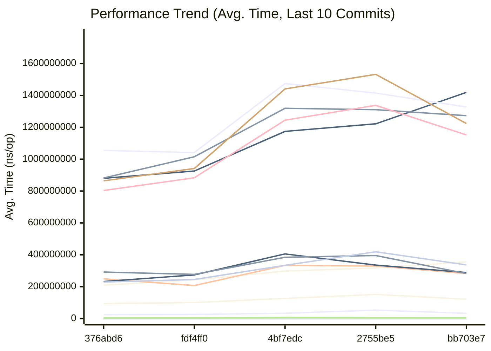
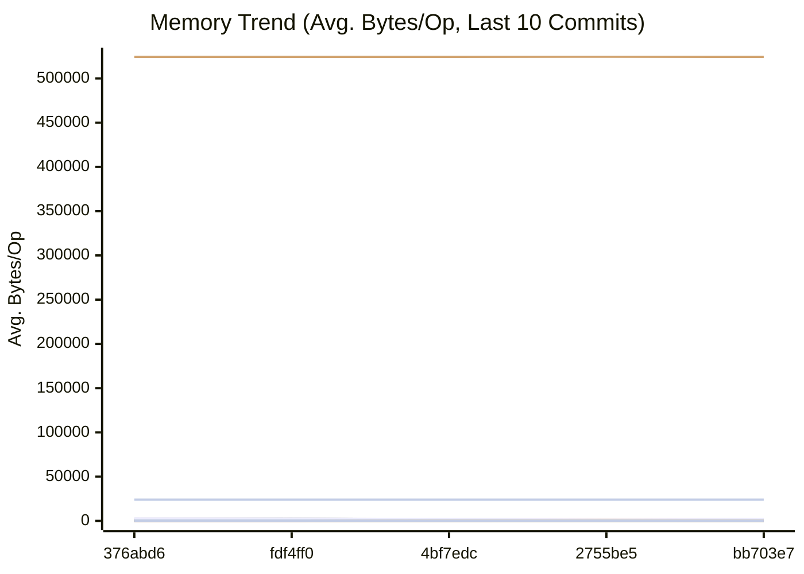
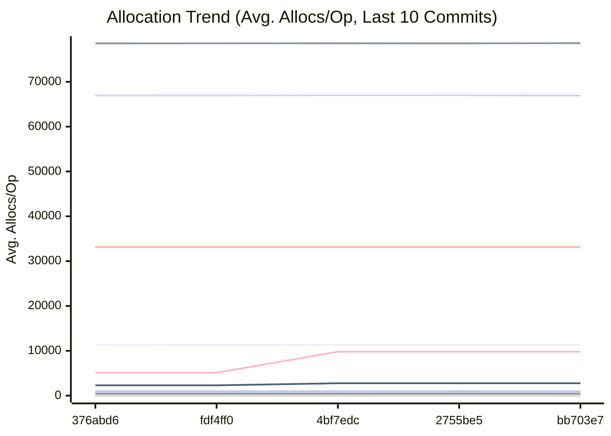

# Performance Benchmarks

This document tracks benchmark performance across commits. The section between
the `BENCHMARK_RESULTS_START/END` markers is auto-generated by the pre-commit
hook; the crypto/OPRF section below is manually maintained.

## How to Read This Document

- **Comparison with previous commit**: `benchstat` output comparing the current
  commit against the previous one. Three tables: **sec/op** (time per operation),
  **B/op** (bytes allocated), **allocs/op** (heap allocations). In each table,
  **lower is better**. `+X%` = regression, `-X%` = improvement, `~` = no
  statistically significant change. `p` is the p-value (p < 0.05 = significant).
- **Latest Benchmark Results**: Single-snapshot table of the current commit's
  averages. Lower values are better across all three columns.
- **Performance Trend plot**: X-axis = commit SHA (left = older, right = newer).
  Y-axis = avg time in ns/op. **Lower lines = faster.** Downward trends are
  improvements; upward spikes are regressions.
- **Memory Trend plot**: Same axes, but Y-axis = avg bytes allocated per op.
  **Lower lines = less memory.** Drops indicate allocation reductions.
- **Allocation Trend plot**: Same axes, but Y-axis = avg heap allocations per op.
  **Lower lines = fewer allocations.** Fewer allocs = less GC pressure.

<!-- BENCHMARK_RESULTS_START -->
## Performance

This section is automatically updated by the pre-commit hook (via .github/scripts/update_readme_with_benchmarks.sh).

### Comparison with previous commit

Each table compares the previous commit (left) to the current commit (right).
**Lower is better** in all three tables. `+X%` = regression, `-X%` = improvement,
`~` = no statistically significant change (p >= 0.05).

- **sec/op**: Time per operation (nanoseconds). Measures raw speed.
- **B/op**: Bytes allocated on the heap per operation. Measures memory usage.
- **allocs/op**: Number of heap allocations per operation. Measures GC pressure.

```
                                      │ /tmp/old_bench_filtered.txt │      /tmp/new_bench_filtered.txt      │
                                      │           sec/op            │    sec/op      vs base                │
CrushOriginal-8                                        673.4n ± ∞ ¹    696.9n ± ∞ ¹       ~ (p=1.000 n=1) ²
Placement-8                                            7.040µ ± ∞ ¹    7.327µ ± ∞ ¹       ~ (p=1.000 n=1) ²
PlacementDomainSpread-8                                7.303µ ± ∞ ¹    7.101µ ± ∞ ¹       ~ (p=1.000 n=1) ²
CrushOptimized-8                                       512.9n ± ∞ ¹    528.5n ± ∞ ¹       ~ (p=1.000 n=1) ²
LoadGlobalConfig-8                                     14.10µ ± ∞ ¹    14.53µ ± ∞ ¹       ~ (p=1.000 n=1) ²
HashBytes/1MiB-8                                       5.526m ± ∞ ¹    5.093m ± ∞ ¹       ~ (p=1.000 n=1) ²
HashBytes/64MiB-8                                      272.4m ± ∞ ¹    277.1m ± ∞ ¹       ~ (p=1.000 n=1) ²
HashBytes/256MiB-8                                      1.415 ± ∞ ¹     1.122 ± ∞ ¹       ~ (p=1.000 n=1) ²
HashFile/1MiB-8                                        4.909m ± ∞ ¹    4.510m ± ∞ ¹       ~ (p=1.000 n=1) ²
HashFile/64MiB-8                                       348.4m ± ∞ ¹    343.4m ± ∞ ¹       ~ (p=1.000 n=1) ²
HashFile/256MiB-8                                       1.762 ± ∞ ¹     1.416 ± ∞ ¹       ~ (p=1.000 n=1) ²
PadString-8                                            76.13n ± ∞ ¹    62.78n ± ∞ ¹       ~ (p=1.000 n=1) ²
SanitizeLog/Safe-8                                     423.0n ± ∞ ¹    331.8n ± ∞ ¹       ~ (p=1.000 n=1) ²
SanitizeLog/Unsafe-8                                   1.356µ ± ∞ ¹    1.050µ ± ∞ ¹       ~ (p=1.000 n=1) ²
AWSChunkedReaderSigned-8                               756.3µ ± ∞ ¹    663.6µ ± ∞ ¹       ~ (p=1.000 n=1) ²
AWSChunkedReaderUnsigned-8                             703.4µ ± ∞ ¹    611.9µ ± ∞ ¹       ~ (p=1.000 n=1) ²
LastModifiedHeader_AppendFormat-8                      440.8n ± ∞ ¹    320.2n ± ∞ ¹       ~ (p=1.000 n=1) ²
LastModifiedHeader_Format-8                            520.3n ± ∞ ¹    582.0n ± ∞ ¹       ~ (p=1.000 n=1) ²
FormatListObjectsV2XML_AppendFormat-8                  1.286m ± ∞ ¹    1.165m ± ∞ ¹       ~ (p=1.000 n=1) ²
FormatListObjectsV2XML_OldFormat-8                     720.7µ ± ∞ ¹    674.9µ ± ∞ ¹       ~ (p=1.000 n=1) ²
CheckMetricsAndSwap-8                                  12.43n ± ∞ ¹    12.82n ± ∞ ¹       ~ (p=1.000 n=1) ²
IndexSearch-8                                          4.201n ± ∞ ¹    3.936n ± ∞ ¹       ~ (p=1.000 n=1) ²
IndexDirectTracking-8                                 0.5735n ± ∞ ¹   0.6342n ± ∞ ¹       ~ (p=1.000 n=1) ²
LocalWrite/1MiB-8                                      644.9µ ± ∞ ¹    573.2µ ± ∞ ¹       ~ (p=1.000 n=1) ²
LocalWrite/64MiB-8                                     44.89m ± ∞ ¹    35.40m ± ∞ ¹       ~ (p=1.000 n=1) ²
LocalWrite/256MiB-8                                    161.2m ± ∞ ¹    126.0m ± ∞ ¹       ~ (p=1.000 n=1) ²
ReadVerify/1MiB-8                                      6.614m ± ∞ ¹    5.000m ± ∞ ¹       ~ (p=1.000 n=1) ²
ReadVerify/64MiB-8                                     297.9m ± ∞ ¹    337.1m ± ∞ ¹       ~ (p=1.000 n=1) ²
ReadVerify/256MiB-8                                     1.179 ± ∞ ¹     1.513 ± ∞ ¹       ~ (p=1.000 n=1) ²
TrustedRead/1MiB-8                                     5.111m ± ∞ ¹    5.878m ± ∞ ¹       ~ (p=1.000 n=1) ²
TrustedRead/64MiB-8                                    337.7m ± ∞ ¹    350.1m ± ∞ ¹       ~ (p=1.000 n=1) ²
TrustedRead/256MiB-8                                    1.259 ± ∞ ¹     1.168 ± ∞ ¹       ~ (p=1.000 n=1) ²
S3PutSpool/1MiB-8                                      5.336m ± ∞ ¹    5.117m ± ∞ ¹       ~ (p=1.000 n=1) ²
S3PutSpool/64MiB-8                                     404.2m ± ∞ ¹    401.7m ± ∞ ¹       ~ (p=1.000 n=1) ²
S3PutSpool/256MiB-8                                     1.781 ± ∞ ¹     1.337 ± ∞ ¹       ~ (p=1.000 n=1) ²
geomean                                                495.7µ          461.3µ        -6.94%
¹ need >= 6 samples for confidence interval at level 0.95
² need >= 4 samples to detect a difference at alpha level 0.05

                                      │ /tmp/old_bench_filtered.txt │      /tmp/new_bench_filtered.txt      │
                                      │            B/op             │     B/op       vs base                │
CrushOriginal-8                                         164.0 ± ∞ ¹     164.0 ± ∞ ¹       ~ (p=1.000 n=1) ²
Placement-8                                             352.0 ± ∞ ¹     352.0 ± ∞ ¹       ~ (p=1.000 n=1) ²
PlacementDomainSpread-8                                 352.0 ± ∞ ¹     352.0 ± ∞ ¹       ~ (p=1.000 n=1) ²
CrushOptimized-8                                        0.000 ± ∞ ¹     0.000 ± ∞ ¹       ~ (p=1.000 n=1) ²
LoadGlobalConfig-8                                    1.930Ki ± ∞ ¹   1.930Ki ± ∞ ¹       ~ (p=1.000 n=1) ²
HashBytes/1MiB-8                                        64.00 ± ∞ ¹     64.00 ± ∞ ¹       ~ (p=1.000 n=1) ²
HashBytes/64MiB-8                                       64.00 ± ∞ ¹     64.00 ± ∞ ¹       ~ (p=1.000 n=1) ²
HashBytes/256MiB-8                                      64.00 ± ∞ ¹     64.00 ± ∞ ¹       ~ (p=1.000 n=1) ²
HashFile/1MiB-8                                       32.35Ki ± ∞ ¹   32.35Ki ± ∞ ¹       ~ (p=1.000 n=1) ²
HashFile/64MiB-8                                      32.35Ki ± ∞ ¹   32.35Ki ± ∞ ¹       ~ (p=1.000 n=1) ²
HashFile/256MiB-8                                     32.35Ki ± ∞ ¹   32.35Ki ± ∞ ¹       ~ (p=1.000 n=1) ²
PadString-8                                             64.00 ± ∞ ¹     64.00 ± ∞ ¹       ~ (p=1.000 n=1) ²
SanitizeLog/Safe-8                                      0.000 ± ∞ ¹     0.000 ± ∞ ¹       ~ (p=1.000 n=1) ²
SanitizeLog/Unsafe-8                                    704.0 ± ∞ ¹     704.0 ± ∞ ¹       ~ (p=1.000 n=1) ²
AWSChunkedReaderSigned-8                              11.09Ki ± ∞ ¹   11.04Ki ± ∞ ¹       ~ (p=1.000 n=1) ³
AWSChunkedReaderUnsigned-8                            76.79Ki ± ∞ ¹   76.76Ki ± ∞ ¹       ~ (p=1.000 n=1) ³
LastModifiedHeader_AppendFormat-8                       0.000 ± ∞ ¹     0.000 ± ∞ ¹       ~ (p=1.000 n=1) ²
LastModifiedHeader_Format-8                             32.00 ± ∞ ¹     32.00 ± ∞ ¹       ~ (p=1.000 n=1) ²
FormatListObjectsV2XML_AppendFormat-8                 512.2Ki ± ∞ ¹   512.2Ki ± ∞ ¹       ~ (p=1.000 n=1) ³
FormatListObjectsV2XML_OldFormat-8                    23.44Ki ± ∞ ¹   23.44Ki ± ∞ ¹       ~ (p=1.000 n=1) ²
CheckMetricsAndSwap-8                                   0.000 ± ∞ ¹     0.000 ± ∞ ¹       ~ (p=1.000 n=1) ²
IndexSearch-8                                           0.000 ± ∞ ¹     0.000 ± ∞ ¹       ~ (p=1.000 n=1) ²
IndexDirectTracking-8                                   0.000 ± ∞ ¹     0.000 ± ∞ ¹       ~ (p=1.000 n=1) ²
LocalWrite/1MiB-8                                     65.46Ki ± ∞ ¹   65.46Ki ± ∞ ¹       ~ (p=1.000 n=1) ³
LocalWrite/64MiB-8                                    65.52Ki ± ∞ ¹   65.51Ki ± ∞ ¹       ~ (p=1.000 n=1) ³
LocalWrite/256MiB-8                                   65.91Ki ± ∞ ¹   65.85Ki ± ∞ ¹       ~ (p=1.000 n=1) ³
ReadVerify/1MiB-8                                       486.0 ± ∞ ¹     478.0 ± ∞ ¹       ~ (p=1.000 n=1) ³
ReadVerify/64MiB-8                                    2.711Ki ± ∞ ¹   2.711Ki ± ∞ ¹       ~ (p=1.000 n=1) ²
ReadVerify/256MiB-8                                   9.578Ki ± ∞ ¹   9.578Ki ± ∞ ¹       ~ (p=1.000 n=1) ²
TrustedRead/1MiB-8                                      800.0 ± ∞ ¹     800.0 ± ∞ ¹       ~ (p=1.000 n=1) ²
TrustedRead/64MiB-8                                     800.0 ± ∞ ¹     800.0 ± ∞ ¹       ~ (p=1.000 n=1) ²
TrustedRead/256MiB-8                                    800.0 ± ∞ ¹     800.0 ± ∞ ¹       ~ (p=1.000 n=1) ²
S3PutSpool/1MiB-8                                       447.0 ± ∞ ¹     447.0 ± ∞ ¹       ~ (p=1.000 n=1) ²
S3PutSpool/64MiB-8                                      448.0 ± ∞ ¹     448.0 ± ∞ ¹       ~ (p=1.000 n=1) ²
S3PutSpool/256MiB-8                                     448.0 ± ∞ ¹     448.0 ± ∞ ¹       ~ (p=1.000 n=1) ²
geomean                                                           ⁴                  -0.06%               ⁴
¹ need >= 6 samples for confidence interval at level 0.95
² all samples are equal
³ need >= 4 samples to detect a difference at alpha level 0.05
⁴ summaries must be >0 to compute geomean

                                      │ /tmp/old_bench_filtered.txt │     /tmp/new_bench_filtered.txt      │
                                      │          allocs/op          │  allocs/op    vs base                │
CrushOriginal-8                                         3.000 ± ∞ ¹    3.000 ± ∞ ¹       ~ (p=1.000 n=1) ²
Placement-8                                             6.000 ± ∞ ¹    6.000 ± ∞ ¹       ~ (p=1.000 n=1) ²
PlacementDomainSpread-8                                 6.000 ± ∞ ¹    6.000 ± ∞ ¹       ~ (p=1.000 n=1) ²
CrushOptimized-8                                        0.000 ± ∞ ¹    0.000 ± ∞ ¹       ~ (p=1.000 n=1) ²
LoadGlobalConfig-8                                      58.00 ± ∞ ¹    58.00 ± ∞ ¹       ~ (p=1.000 n=1) ²
HashBytes/1MiB-8                                        1.000 ± ∞ ¹    1.000 ± ∞ ¹       ~ (p=1.000 n=1) ²
HashBytes/64MiB-8                                       1.000 ± ∞ ¹    1.000 ± ∞ ¹       ~ (p=1.000 n=1) ²
HashBytes/256MiB-8                                      1.000 ± ∞ ¹    1.000 ± ∞ ¹       ~ (p=1.000 n=1) ²
HashFile/1MiB-8                                         6.000 ± ∞ ¹    6.000 ± ∞ ¹       ~ (p=1.000 n=1) ²
HashFile/64MiB-8                                        6.000 ± ∞ ¹    6.000 ± ∞ ¹       ~ (p=1.000 n=1) ²
HashFile/256MiB-8                                       6.000 ± ∞ ¹    6.000 ± ∞ ¹       ~ (p=1.000 n=1) ²
PadString-8                                             1.000 ± ∞ ¹    1.000 ± ∞ ¹       ~ (p=1.000 n=1) ²
SanitizeLog/Safe-8                                      0.000 ± ∞ ¹    0.000 ± ∞ ¹       ~ (p=1.000 n=1) ²
SanitizeLog/Unsafe-8                                    1.000 ± ∞ ¹    1.000 ± ∞ ¹       ~ (p=1.000 n=1) ²
AWSChunkedReaderSigned-8                                80.00 ± ∞ ¹    80.00 ± ∞ ¹       ~ (p=1.000 n=1) ²
AWSChunkedReaderUnsigned-8                              15.00 ± ∞ ¹    15.00 ± ∞ ¹       ~ (p=1.000 n=1) ²
LastModifiedHeader_AppendFormat-8                       0.000 ± ∞ ¹    0.000 ± ∞ ¹       ~ (p=1.000 n=1) ²
LastModifiedHeader_Format-8                             1.000 ± ∞ ¹    1.000 ± ∞ ¹       ~ (p=1.000 n=1) ²
FormatListObjectsV2XML_AppendFormat-8                   16.00 ± ∞ ¹    16.00 ± ∞ ¹       ~ (p=1.000 n=1) ²
FormatListObjectsV2XML_OldFormat-8                     1.000k ± ∞ ¹   1.000k ± ∞ ¹       ~ (p=1.000 n=1) ²
CheckMetricsAndSwap-8                                   0.000 ± ∞ ¹    0.000 ± ∞ ¹       ~ (p=1.000 n=1) ²
IndexSearch-8                                           0.000 ± ∞ ¹    0.000 ± ∞ ¹       ~ (p=1.000 n=1) ²
IndexDirectTracking-8                                   0.000 ± ∞ ¹    0.000 ± ∞ ¹       ~ (p=1.000 n=1) ²
LocalWrite/1MiB-8                                       18.00 ± ∞ ¹    19.00 ± ∞ ¹       ~ (p=1.000 n=1) ³
LocalWrite/64MiB-8                                      18.00 ± ∞ ¹    18.00 ± ∞ ¹       ~ (p=1.000 n=1) ²
LocalWrite/256MiB-8                                     21.00 ± ∞ ¹    20.00 ± ∞ ¹       ~ (p=1.000 n=1) ³
ReadVerify/1MiB-8                                       6.000 ± ∞ ¹    6.000 ± ∞ ¹       ~ (p=1.000 n=1) ²
ReadVerify/64MiB-8                                      7.000 ± ∞ ¹    7.000 ± ∞ ¹       ~ (p=1.000 n=1) ²
ReadVerify/256MiB-8                                     10.00 ± ∞ ¹    10.00 ± ∞ ¹       ~ (p=1.000 n=1) ²
TrustedRead/1MiB-8                                      11.00 ± ∞ ¹    11.00 ± ∞ ¹       ~ (p=1.000 n=1) ²
TrustedRead/64MiB-8                                     11.00 ± ∞ ¹    11.00 ± ∞ ¹       ~ (p=1.000 n=1) ²
TrustedRead/256MiB-8                                    11.00 ± ∞ ¹    11.00 ± ∞ ¹       ~ (p=1.000 n=1) ²
S3PutSpool/1MiB-8                                       10.00 ± ∞ ¹    10.00 ± ∞ ¹       ~ (p=1.000 n=1) ²
S3PutSpool/64MiB-8                                      10.00 ± ∞ ¹    10.00 ± ∞ ¹       ~ (p=1.000 n=1) ²
S3PutSpool/256MiB-8                                     10.00 ± ∞ ¹    10.00 ± ∞ ¹       ~ (p=1.000 n=1) ²
geomean                                                           ⁴                 +0.02%               ⁴
¹ need >= 6 samples for confidence interval at level 0.95
² all samples are equal
³ need >= 4 samples to detect a difference at alpha level 0.05
⁴ summaries must be >0 to compute geomean

                           │ /tmp/old_bench_filtered.txt │      /tmp/new_bench_filtered.txt       │
                           │             B/s             │      B/s        vs base                │
HashBytes/1MiB-8                           181.0Mi ± ∞ ¹    196.3Mi ± ∞ ¹       ~ (p=1.000 n=1) ²
HashBytes/64MiB-8                          234.9Mi ± ∞ ¹    231.0Mi ± ∞ ¹       ~ (p=1.000 n=1) ²
HashBytes/256MiB-8                         180.9Mi ± ∞ ¹    228.3Mi ± ∞ ¹       ~ (p=1.000 n=1) ²
HashFile/1MiB-8                            203.7Mi ± ∞ ¹    221.7Mi ± ∞ ¹       ~ (p=1.000 n=1) ²
HashFile/64MiB-8                           183.7Mi ± ∞ ¹    186.4Mi ± ∞ ¹       ~ (p=1.000 n=1) ²
HashFile/256MiB-8                          145.3Mi ± ∞ ¹    180.8Mi ± ∞ ¹       ~ (p=1.000 n=1) ²
AWSChunkedReaderSigned-8                   83.93Mi ± ∞ ¹    95.66Mi ± ∞ ¹       ~ (p=1.000 n=1) ²
AWSChunkedReaderUnsigned-8                 90.24Mi ± ∞ ¹   103.74Mi ± ∞ ¹       ~ (p=1.000 n=1) ²
LocalWrite/1MiB-8                          1.514Gi ± ∞ ¹    1.704Gi ± ∞ ¹       ~ (p=1.000 n=1) ²
LocalWrite/64MiB-8                         1.392Gi ± ∞ ¹    1.765Gi ± ∞ ¹       ~ (p=1.000 n=1) ²
LocalWrite/256MiB-8                        1.551Gi ± ∞ ¹    1.985Gi ± ∞ ¹       ~ (p=1.000 n=1) ²
ReadVerify/1MiB-8                          151.2Mi ± ∞ ¹    200.0Mi ± ∞ ¹       ~ (p=1.000 n=1) ²
ReadVerify/64MiB-8                         214.9Mi ± ∞ ¹    189.8Mi ± ∞ ¹       ~ (p=1.000 n=1) ²
ReadVerify/256MiB-8                        217.1Mi ± ∞ ¹    169.1Mi ± ∞ ¹       ~ (p=1.000 n=1) ²
TrustedRead/1MiB-8                         195.6Mi ± ∞ ¹    170.1Mi ± ∞ ¹       ~ (p=1.000 n=1) ²
TrustedRead/64MiB-8                        189.5Mi ± ∞ ¹    182.8Mi ± ∞ ¹       ~ (p=1.000 n=1) ²
TrustedRead/256MiB-8                       203.3Mi ± ∞ ¹    219.2Mi ± ∞ ¹       ~ (p=1.000 n=1) ²
S3PutSpool/1MiB-8                          187.4Mi ± ∞ ¹    195.4Mi ± ∞ ¹       ~ (p=1.000 n=1) ²
S3PutSpool/64MiB-8                         158.3Mi ± ∞ ¹    159.3Mi ± ∞ ¹       ~ (p=1.000 n=1) ²
S3PutSpool/256MiB-8                        143.7Mi ± ∞ ¹    191.4Mi ± ∞ ¹       ~ (p=1.000 n=1) ²
geomean                                    234.5Mi          254.3Mi        +8.47%
¹ need >= 6 samples for confidence interval at level 0.95
² need >= 4 samples to detect a difference at alpha level 0.05
```

### Latest Benchmark Results

Single-snapshot of the current commit's averages. **Lower is better** across all
three columns: time (speed), bytes (memory), allocs (GC pressure).


| Benchmark | Avg. Time/Op | Avg. Bytes/Op | Avg. Allocs/Op |
|-----------|--------------|---------------|----------------|
| BenchmarkAWSChunkedReaderSigned-8 | 663569.00 ns/op | 100.31 B/op | 11308.00 allocs/op |
| BenchmarkAWSChunkedReaderUnsigned-8 | 611889.00 ns/op | 108.78 B/op | 78600.00 allocs/op |
| BenchmarkCheckMetricsAndSwap-8 | 12.82 ns/op | 0.00 B/op | 0.00 allocs/op |
| BenchmarkCrushOptimized-8 | 528.50 ns/op | 0.00 B/op | 0.00 allocs/op |
| BenchmarkCrushOriginal-8 | 696.90 ns/op | 164.00 B/op | 3.00 allocs/op |
| BenchmarkFormatListObjectsV2XML_AppendFormat-8 | 1165434.00 ns/op | 524504.00 B/op | 16.00 allocs/op |
| BenchmarkFormatListObjectsV2XML_OldFormat-8 | 674915.00 ns/op | 24000.00 B/op | 1000.00 allocs/op |
| BenchmarkHashBytes/1MiB-8 | 5093044.00 ns/op | 205.88 B/op | 64.00 allocs/op |
| BenchmarkHashBytes/256MiB-8 | 1121544781.00 ns/op | 239.34 B/op | 64.00 allocs/op |
| BenchmarkHashBytes/64MiB-8 | 277104353.00 ns/op | 242.18 B/op | 64.00 allocs/op |
| BenchmarkHashFile/1MiB-8 | 4510294.00 ns/op | 232.49 B/op | 33128.00 allocs/op |
| BenchmarkHashFile/256MiB-8 | 1416186973.00 ns/op | 189.55 B/op | 33128.00 allocs/op |
| BenchmarkHashFile/64MiB-8 | 343417056.00 ns/op | 195.42 B/op | 33128.00 allocs/op |
| BenchmarkIndexDirectTracking-8 | 0.63 ns/op | 0.00 B/op | 0.00 allocs/op |
| BenchmarkIndexSearch-8 | 3.94 ns/op | 0.00 B/op | 0.00 allocs/op |
| BenchmarkLastModifiedHeader_AppendFormat-8 | 320.20 ns/op | 0.00 B/op | 0.00 allocs/op |
| BenchmarkLastModifiedHeader_Format-8 | 582.00 ns/op | 32.00 B/op | 1.00 allocs/op |
| BenchmarkLoadGlobalConfig-8 | 14525.00 ns/op | 1976.00 B/op | 58.00 allocs/op |
| BenchmarkLocalWrite/1MiB-8 | 573249.00 ns/op | 1829.18 B/op | 67032.00 allocs/op |
| BenchmarkLocalWrite/256MiB-8 | 125958619.00 ns/op | 2131.14 B/op | 67427.00 allocs/op |
| BenchmarkLocalWrite/64MiB-8 | 35402077.00 ns/op | 1895.62 B/op | 67081.00 allocs/op |
| BenchmarkPadString-8 | 62.78 ns/op | 64.00 B/op | 1.00 allocs/op |
| BenchmarkPlacement-8 | 7327.00 ns/op | 352.00 B/op | 6.00 allocs/op |
| BenchmarkPlacementDomainSpread-8 | 7101.00 ns/op | 352.00 B/op | 6.00 allocs/op |
| BenchmarkReadVerify/1MiB-8 | 4999715.00 ns/op | 209.73 B/op | 478.00 allocs/op |
| BenchmarkReadVerify/256MiB-8 | 1513480600.00 ns/op | 177.36 B/op | 9808.00 allocs/op |
| BenchmarkReadVerify/64MiB-8 | 337113294.00 ns/op | 199.07 B/op | 2776.00 allocs/op |
| BenchmarkS3PutSpool/1MiB-8 | 5117449.00 ns/op | 204.90 B/op | 447.00 allocs/op |
| BenchmarkS3PutSpool/256MiB-8 | 1337418784.00 ns/op | 200.71 B/op | 448.00 allocs/op |
| BenchmarkS3PutSpool/64MiB-8 | 401720115.00 ns/op | 167.05 B/op | 448.00 allocs/op |
| BenchmarkSanitizeLog/Safe-8 | 331.80 ns/op | 0.00 B/op | 0.00 allocs/op |
| BenchmarkSanitizeLog/Unsafe-8 | 1050.00 ns/op | 704.00 B/op | 1.00 allocs/op |
| BenchmarkTrustedRead/1MiB-8 | 5878450.00 ns/op | 178.38 B/op | 800.00 allocs/op |
| BenchmarkTrustedRead/256MiB-8 | 1168045663.00 ns/op | 229.82 B/op | 800.00 allocs/op |
| BenchmarkTrustedRead/64MiB-8 | 350083685.00 ns/op | 191.69 B/op | 800.00 allocs/op |


### Performance History

**Legend**

| Color | Benchmark | Description |
|---|---|---|
| 🟢 | CheckMetricsAndSwap | Evaluation of system metrics (CPU/Mem) and mode switching logic |
| 🟤 | CrushOriginal | Original Sage Weil's CRUSH placement algorithm using reflection and float math |
| ⚪ | CrushOptimized | Performance-tuned CRUSH-lite placement algorithm using bitwise shifts and integer math (Rule 19) |
| 🔵 | IndexDirectTracking | Accessing current replication mode via direct slice index (O(1)) |
| 🔴 | IndexSearch | Searching for current replication mode in the order slice using `slices.Index` |
| 🟠 | LoadGlobalConfig | Parsing and loading the `[global]` section from the INI configuration |
| 🟣 | PadString | Padding strings with null characters to a fixed protocol length |
| 🟡 | ParseReplicationOrder | Parsing the CSV-formatted replication order string into an integer slice |

#### Time per Operation (ns/op)

X-axis: commit SHA (left = older, right = newer). Y-axis: avg time in ns/op.
**Lower lines = faster code.** Downward trends are improvements; upward spikes
are regressions to investigate.


```mermaid
xychart-beta
    title "Performance Trend (Avg. Time, Last 10 Commits)"
    x-axis "Commit"
    y-axis "Avg. Time (ns/op)"
    x-axis [376abd6,fdf4ff0,4bf7edc,2755be5,bb703e7]
    line "AWSChunkedReaderSigned" [397685,535625,618041,521824,584439,539275,522839,619200,756300,663569]
    line "AWSChunkedReaderUnsigned" [405982,479460,573661,451522,611665,550355,604498,664009,703433,611889]
    line "CheckMetricsAndSwap" [7,10,10,17,10,11,10,10,12,13]
    line "CrushOptimized" [328,320,458,539,432,471,405,485,513,528]
    line "CrushOriginal" [443,407,633,730,712,650,699,646,673,697]
    line "FormatListObjectsV2XML_AppendFormat" [566690,627648,848928,1046717,799795,1039816,911991,1056478,1286421,1165434]
    line "FormatListObjectsV2XML_OldFormat" [366636,408457,535755,745142,464905,458449,554255,545961,720703,674915]
    line "HashBytes/1MiB" [3443981,3592333,5110585,4751175,5064237,4383380,5547571,5240058,5525510,5093044]
    line "HashBytes/256MiB" [880098861,925707610,1174333367,1221858506,1419279092,1145420213,1150583944,1206314796,1415065243,1121544781]
    line "HashBytes/64MiB" [209418782,242948441,297766074,317593619,355000134,315394868,341933076,357748084,272405322,277104353]
    line "HashFile/1MiB" [3842035,3350950,4950193,5129547,5747827,5999828,5183292,5520031,4909353,4510294]
    line "HashFile/256MiB" [881918242,1015211606,1319192441,1310601572,1273023822,1457159370,1166573869,1388569817,1761951053,1416186973]
    line "HashFile/64MiB" [249484580,207167851,333549904,329592825,282613785,330397537,289173153,345945889,348425613,343417056]
    line "IndexDirectTracking" [0,0,1,1,0,0,1,1,1,1]
    line "IndexSearch" [2,2,2,5,4,3,3,4,4,4]
    line "LastModifiedHeader_AppendFormat" [185,228,286,252,340,415,345,364,441,320]
    line "LastModifiedHeader_Format" [262,285,385,350,398,514,394,431,520,582]
    line "LoadGlobalConfig" [9952,8921,13356,14511,16366,13776,15095,13488,14097,14525]
    line "LocalWrite/1MiB" [445767,431598,526423,795470,552166,778898,525512,577002,644852,573249]
    line "LocalWrite/256MiB" [94142106,100079806,126435842,151118283,121284509,138380852,128601282,128702495,161190175,125958619]
    line "LocalWrite/64MiB" [24072639,25874779,32839259,53059327,32531111,36029215,35542782,33119476,44891953,35402077]
    line "PadString" [57,53,71,49,70,69,64,70,76,63]
    line "ParseReplicationOrder_NoPrealloc" [350,349,357,354,345,225,229,165,232,234]
    line "ParseReplicationOrder_Prealloc" [229,231,237,234,229,108,107,80,110,109]
    line "Placement" [5168,4621,6718,8505,7344,6922,7453,7406,7040,7327]
    line "PlacementDomainSpread" [5453,5023,6553,8563,7236,7465,7811,7868,7303,7101]
    line "ReadVerify/1MiB" [3798416,3596845,4460850,5088522,3970325,4753309,4723356,4600918,6614208,4999715]
    line "ReadVerify/256MiB" [803259188,883417974,1244837167,1337973310,1152182050,1249327431,1431247520,1374887457,1179131329,1513480600]
    line "ReadVerify/64MiB" [232435503,273582930,405518693,335223998,288365836,309264832,334268234,343492740,297878657,337113294]
    line "S3PutSpool/1MiB" [4349655,4494504,5795780,6486611,5066289,6659391,6179992,6697030,5335678,5117449]
    line "S3PutSpool/256MiB" [1054828608,1041459785,1474423367,1414994967,1327631659,1627622695,1567298391,1766547568,1781197744,1337418784]
    line "S3PutSpool/64MiB" [292024160,277039985,384356699,395378107,282251478,366146558,388891982,382189999,404192768,401720115]
    line "SanitizeLog/Safe" [233,295,361,256,386,270,283,316,423,332]
    line "SanitizeLog/Unsafe" [684,922,1091,801,1163,1016,1039,1170,1356,1050]
    line "TrustedRead/1MiB" [3390683,4063744,6459603,5688219,4848751,4607932,6032847,6124228,5111302,5878450]
    line "TrustedRead/256MiB" [864337055,941546678,1440831398,1532603475,1223453299,1410403058,1131933188,1326976357,1259207320,1168045663]
    line "TrustedRead/64MiB" [228835469,245169178,333995810,418960245,336501521,296487000,387555406,411444369,337664579,350083685]
```

#### Memory per Operation (B/op)

X-axis: commit SHA. Y-axis: avg bytes allocated per op.
**Lower lines = less memory.** Drops indicate allocation reductions.


```mermaid
xychart-beta
    title "Memory Trend (Avg. Bytes/Op, Last 10 Commits)"
    x-axis "Commit"
    y-axis "Avg. Bytes/Op"
    x-axis [376abd6,fdf4ff0,4bf7edc,2755be5,bb703e7]
    line "AWSChunkedReaderSigned" [167,124,108,128,114,123,127,107,88,100]
    line "AWSChunkedReaderUnsigned" [164,139,116,147,109,121,110,100,95,109]
    line "CheckMetricsAndSwap" [0,0,0,0,0,0,0,0,0,0]
    line "CrushOptimized" [0,0,0,0,0,0,0,0,0,0]
    line "CrushOriginal" [164,164,164,164,164,164,164,164,164,164]
    line "FormatListObjectsV2XML_AppendFormat" [524442,524446,524462,524483,524463,524491,524477,524500,524483,524504]
    line "FormatListObjectsV2XML_OldFormat" [24000,24000,24000,24000,24000,24000,24000,24000,24000,24000]
    line "HashBytes/1MiB" [304,292,205,221,207,239,189,200,190,206]
    line "HashBytes/256MiB" [305,290,229,220,189,234,233,223,190,239]
    line "HashBytes/64MiB" [320,276,225,211,189,213,196,188,246,242]
    line "HashFile/1MiB" [273,313,212,204,182,175,202,190,214,232]
    line "HashFile/256MiB" [304,264,203,205,211,184,230,193,152,190]
    line "HashFile/64MiB" [269,324,201,204,237,203,232,194,193,195]
    line "IndexDirectTracking" [0,0,0,0,0,0,0,0,0,0]
    line "IndexSearch" [0,0,0,0,0,0,0,0,0,0]
    line "LastModifiedHeader_AppendFormat" [0,0,0,0,0,0,0,0,0,0]
    line "LastModifiedHeader_Format" [32,32,32,32,32,32,32,32,32,32]
    line "LoadGlobalConfig" [1976,1976,1976,1976,1976,1976,1976,1976,1976,1976]
    line "LocalWrite/1MiB" [2352,2430,1992,1318,1899,1346,1995,1817,1626,1829]
    line "LocalWrite/256MiB" [2851,2682,2123,1776,2213,1940,2087,2086,1665,2131]
    line "LocalWrite/64MiB" [2788,2594,2044,1265,2063,1863,1888,2026,1495,1896]
    line "PadString" [64,64,64,64,64,64,64,64,64,64]
    line "ParseReplicationOrder_NoPrealloc" [408,408,408,408,408,248,248,248,248,248]
    line "ParseReplicationOrder_Prealloc" [240,240,240,240,240,80,80,80,80,80]
    line "Placement" [352,352,352,352,352,352,352,352,352,352]
    line "PlacementDomainSpread" [352,352,352,352,352,352,352,352,352,352]
    line "ReadVerify/1MiB" [276,292,235,206,264,221,222,228,159,210]
    line "ReadVerify/256MiB" [334,304,216,201,233,215,188,195,228,177]
    line "ReadVerify/64MiB" [289,245,165,200,233,217,201,195,225,199]
    line "S3PutSpool/1MiB" [241,233,181,162,207,157,170,157,197,205]
    line "S3PutSpool/256MiB" [254,258,182,190,202,165,171,152,151,201]
    line "S3PutSpool/64MiB" [230,242,175,170,238,183,173,176,166,167]
    line "SanitizeLog/Safe" [0,0,0,0,0,0,0,0,0,0]
    line "SanitizeLog/Unsafe" [704,704,704,704,704,704,704,704,704,704]
    line "TrustedRead/1MiB" [309,258,162,184,216,228,174,171,205,178]
    line "TrustedRead/256MiB" [311,285,186,175,219,190,237,202,213,230]
    line "TrustedRead/64MiB" [293,274,201,160,199,226,173,163,199,192]
```

#### Allocations per Operation (allocs/op)

X-axis: commit SHA. Y-axis: avg heap allocations per op.
**Lower lines = fewer allocations.** Fewer allocs = less GC pressure.


```mermaid
xychart-beta
    title "Allocation Trend (Avg. Allocs/Op, Last 10 Commits)"
    x-axis "Commit"
    y-axis "Avg. Allocs/Op"
    x-axis [376abd6,fdf4ff0,4bf7edc,2755be5,bb703e7]
    line "AWSChunkedReaderSigned" [11282,11307,11314,11300,11307,11302,11307,11334,11352,11308]
    line "AWSChunkedReaderUnsigned" [78569,78579,78587,78576,78613,78584,78583,78611,78631,78600]
    line "CheckMetricsAndSwap" [0,0,0,0,0,0,0,0,0,0]
    line "CrushOptimized" [0,0,0,0,0,0,0,0,0,0]
    line "CrushOriginal" [3,3,3,3,3,3,3,3,3,3]
    line "FormatListObjectsV2XML_AppendFormat" [16,16,16,16,16,16,16,16,16,16]
    line "FormatListObjectsV2XML_OldFormat" [1000,1000,1000,1000,1000,1000,1000,1000,1000,1000]
    line "HashBytes/1MiB" [64,64,64,64,64,64,64,64,64,64]
    line "HashBytes/256MiB" [64,64,64,64,64,64,64,64,64,64]
    line "HashBytes/64MiB" [64,64,64,64,64,64,64,64,64,64]
    line "HashFile/1MiB" [33128,33128,33128,33128,33128,33128,33128,33128,33128,33128]
    line "HashFile/256MiB" [33128,33128,33128,33128,33128,33128,33128,33128,33128,33128]
    line "HashFile/64MiB" [33128,33128,33128,33128,33128,33128,33128,33128,33128,33128]
    line "IndexDirectTracking" [0,0,0,0,0,0,0,0,0,0]
    line "IndexSearch" [0,0,0,0,0,0,0,0,0,0]
    line "LastModifiedHeader_AppendFormat" [0,0,0,0,0,0,0,0,0,0]
    line "LastModifiedHeader_Format" [1,1,1,1,1,1,1,1,1,1]
    line "LoadGlobalConfig" [58,58,58,58,58,58,58,58,58,58]
    line "LocalWrite/1MiB" [67028,67030,67033,67040,67026,67032,67028,67034,67036,67032]
    line "LocalWrite/256MiB" [67218,67324,67356,67435,67322,67349,67419,67379,67488,67427]
    line "LocalWrite/64MiB" [67080,67067,67089,67097,67084,67096,67074,67087,67088,67081]
    line "PadString" [1,1,1,1,1,1,1,1,1,1]
    line "ParseReplicationOrder_NoPrealloc" [6,6,6,6,6,5,5,5,5,5]
    line "ParseReplicationOrder_Prealloc" [2,2,2,2,2,1,1,1,1,1]
    line "Placement" [6,6,6,6,6,6,6,6,6,6]
    line "PlacementDomainSpread" [6,6,6,6,6,6,6,6,6,6]
    line "ReadVerify/1MiB" [466,460,436,471,463,468,467,468,486,478]
    line "ReadVerify/256MiB" [5120,5120,9808,9808,9808,9808,9808,9808,9808,9808]
    line "ReadVerify/64MiB" [2307,2307,2776,2776,2776,2776,2776,3557,2776,2776]
    line "S3PutSpool/1MiB" [447,447,447,447,447,447,447,447,447,447]
    line "S3PutSpool/256MiB" [448,448,448,448,448,448,448,448,448,448]
    line "S3PutSpool/64MiB" [448,448,448,448,448,448,448,448,448,448]
    line "SanitizeLog/Safe" [0,0,0,0,0,0,0,0,0,0]
    line "SanitizeLog/Unsafe" [1,1,1,1,1,1,1,1,1,1]
    line "TrustedRead/1MiB" [800,800,800,800,800,800,800,800,800,800]
    line "TrustedRead/256MiB" [800,800,800,848,800,800,800,800,800,800]
    line "TrustedRead/64MiB" [800,800,800,800,800,800,800,800,800,800]
```
<!-- BENCHMARK_RESULTS_END -->

### E2EE + OPRF overhead

The sections above are auto-generated and cover the hot-path benchmarks. The
crypto/OPRF work is measured separately; figures below are from `go test -bench`
on the crypto module and are intentionally placed outside the auto-managed block
so they persist.

**Lower is better** across all columns. These benchmarks run on `src/crypto` only
(not tracked in the auto-generated plots above).

| Benchmark | What it measures | Avg. Time/Op | Avg. Bytes/Op | Avg. Allocs/Op |
|-----------|------------------|--------------|---------------|----------------|
| EncryptStream | AES-GCM-256 chunked encryption (64KB input) | ~63 µs | 167 KB | 14 |
| DecryptStream | AES-GCM-256 chunked decryption (64KB input) | ~54 µs | 136 KB | 13 |
| DeriveKey | HKDF-SHA256 key derivation per tenant | ~3.5 µs | 1.3 KB | 18 |
| OPRFCombineThreshold3 | Threshold-3 OPRF combine + unblind (Ristretto255) | ~530 µs | 2.3 KB | 62 |

With `encryption_enabled`, every byte passes through AES-GCM-256 streaming at
~800-1200 MB/s (chunk-bounded memory). The streaming format is **StreamVersion
v4 (issue #824)** with a self-describing chunk size: the default 4096-byte
chunk preserves prior throughput, and the chunk size can be raised/lowered via
`SetStreamChunkSize` within `[512, 4128]` for latency/memory trade-offs without
a wire change in framing beyond the 2-byte header field (v3/v2 blobs still
decode). The threshold OPRF is evaluated **once per
upload/download**, on the dedup tag only (never per chunk):
`OPRFCombineThreshold3` measures a one-time ~0.53 ms client-side combine/unblind
for threshold-3, plus one round-trip per daemon share. This is negligible against
network/disk I/O and does not affect streaming throughput. When `oprf_enabled =
false`, the OPRF path is skipped entirely and behavior is identical to the
pre-OPRF encryption path (backward compatible).
