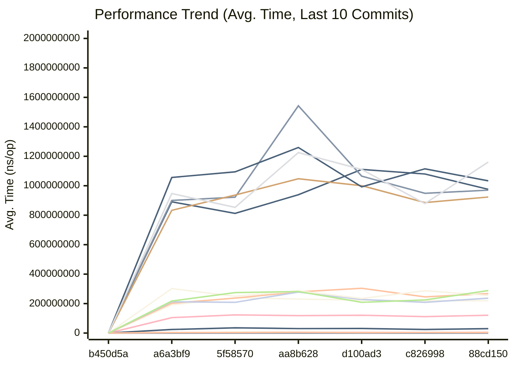
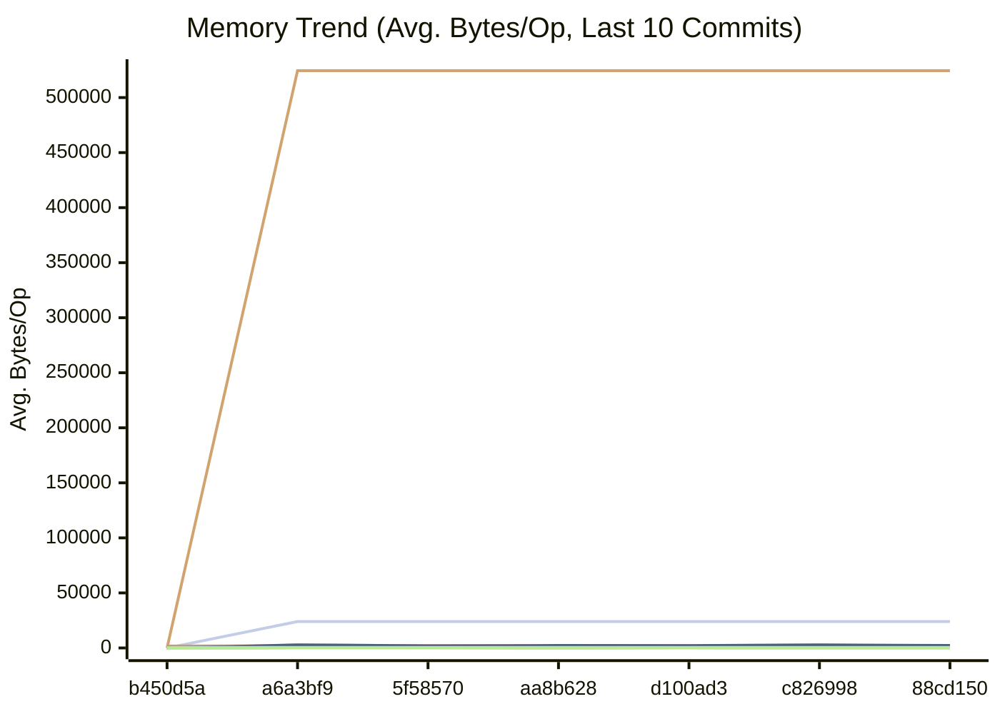
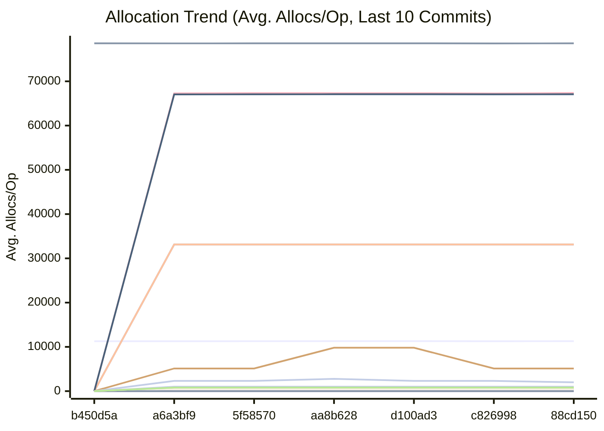

# Performance Benchmarks

This document tracks benchmark performance across commits. The section between
the `BENCHMARK_RESULTS_START/END` markers is auto-generated by the pre-commit
hook; the crypto/OPRF section below is manually maintained.

## How to Read This Document

- **Comparison with previous commit**: `benchstat` output comparing the current
  commit against the previous one. Three tables: **sec/op** (time per operation),
  **B/op** (bytes allocated), **allocs/op** (heap allocations). In each table,
  **lower is better**. `+X%` = regression, `-X%` = improvement, `~` = no
  statistically significant change. `p` is the p-value (p < 0.05 = significant).
- **Latest Benchmark Results**: Single-snapshot table of the current commit's
  averages. Lower values are better across all three columns.
- **Performance Trend plot**: X-axis = commit SHA (left = older, right = newer).
  Y-axis = avg time in ns/op. **Lower lines = faster.** Downward trends are
  improvements; upward spikes are regressions.
- **Memory Trend plot**: Same axes, but Y-axis = avg bytes allocated per op.
  **Lower lines = less memory.** Drops indicate allocation reductions.
- **Allocation Trend plot**: Same axes, but Y-axis = avg heap allocations per op.
  **Lower lines = fewer allocations.** Fewer allocs = less GC pressure.

<!-- BENCHMARK_RESULTS_START -->
## Performance

This section is automatically updated by the pre-commit hook (via .github/scripts/update_readme_with_benchmarks.sh).

### Comparison with previous commit

Each table compares the previous commit (left) to the current commit (right).
**Lower is better** in all three tables. `+X%` = regression, `-X%` = improvement,
`~` = no statistically significant change (p >= 0.05).

- **sec/op**: Time per operation (nanoseconds). Measures raw speed.
- **B/op**: Bytes allocated on the heap per operation. Measures memory usage.
- **allocs/op**: Number of heap allocations per operation. Measures GC pressure.

```
                                      │ /tmp/old_bench_filtered.txt │      /tmp/new_bench_filtered.txt      │
                                      │           sec/op            │    sec/op      vs base                │
CrushOriginal-8                                        591.3n ± ∞ ¹    678.1n ± ∞ ¹       ~ (p=1.000 n=1) ²
Placement-8                                            7.169µ ± ∞ ¹    6.982µ ± ∞ ¹       ~ (p=1.000 n=1) ²
PlacementDomainSpread-8                                7.367µ ± ∞ ¹    6.165µ ± ∞ ¹       ~ (p=1.000 n=1) ²
CrushOptimized-8                                       438.6n ± ∞ ¹    382.7n ± ∞ ¹       ~ (p=1.000 n=1) ²
LoadGlobalConfig-8                                     13.48µ ± ∞ ¹    12.59µ ± ∞ ¹       ~ (p=1.000 n=1) ²
HashBytes/1MiB-8                                       3.925m ± ∞ ¹    3.807m ± ∞ ¹       ~ (p=1.000 n=1) ²
HashBytes/64MiB-8                                      282.4m ± ∞ ¹    294.3m ± ∞ ¹       ~ (p=1.000 n=1) ²
HashBytes/256MiB-8                                      1.334 ± ∞ ¹     1.086 ± ∞ ¹       ~ (p=1.000 n=1) ²
HashFile/1MiB-8                                        4.730m ± ∞ ¹    4.356m ± ∞ ¹       ~ (p=1.000 n=1) ²
HashFile/64MiB-8                                       280.3m ± ∞ ¹    335.6m ± ∞ ¹       ~ (p=1.000 n=1) ²
HashFile/256MiB-8                                       1.110 ± ∞ ¹     1.039 ± ∞ ¹       ~ (p=1.000 n=1) ²
PadString-8                                            74.11n ± ∞ ¹    66.02n ± ∞ ¹       ~ (p=1.000 n=1) ²
SanitizeLog/Safe-8                                     331.6n ± ∞ ¹    276.8n ± ∞ ¹       ~ (p=1.000 n=1) ²
SanitizeLog/Unsafe-8                                   853.9n ± ∞ ¹   1098.0n ± ∞ ¹       ~ (p=1.000 n=1) ²
AWSChunkedReaderSigned-8                               534.3µ ± ∞ ¹    636.3µ ± ∞ ¹       ~ (p=1.000 n=1) ²
AWSChunkedReaderUnsigned-8                             593.4µ ± ∞ ¹    613.7µ ± ∞ ¹       ~ (p=1.000 n=1) ²
FormatListObjectsV2XML_AppendFormat-8                  913.6µ ± ∞ ¹    876.7µ ± ∞ ¹       ~ (p=1.000 n=1) ²
FormatListObjectsV2XML_OldFormat-8                     527.7µ ± ∞ ¹    499.2µ ± ∞ ¹       ~ (p=1.000 n=1) ²
CheckMetricsAndSwap-8                                  11.40n ± ∞ ¹    13.02n ± ∞ ¹       ~ (p=1.000 n=1) ²
IndexSearch-8                                          2.271n ± ∞ ¹    2.337n ± ∞ ¹       ~ (p=1.000 n=1) ²
IndexDirectTracking-8                                 0.6851n ± ∞ ¹   0.4475n ± ∞ ¹       ~ (p=1.000 n=1) ²
LocalWrite/1MiB-8                                      620.1µ ± ∞ ¹    533.2µ ± ∞ ¹       ~ (p=1.000 n=1) ²
LocalWrite/64MiB-8                                     34.01m ± ∞ ¹    32.93m ± ∞ ¹       ~ (p=1.000 n=1) ²
LocalWrite/256MiB-8                                    163.1m ± ∞ ¹    137.0m ± ∞ ¹       ~ (p=1.000 n=1) ²
ReadVerify/1MiB-8                                      5.894m ± ∞ ¹    4.350m ± ∞ ¹       ~ (p=1.000 n=1) ²
ReadVerify/64MiB-8                                     368.4m ± ∞ ¹    360.0m ± ∞ ¹       ~ (p=1.000 n=1) ²
ReadVerify/256MiB-8                                     1.292 ± ∞ ¹     1.528 ± ∞ ¹       ~ (p=1.000 n=1) ²
TrustedRead/1MiB-8                                     4.315m ± ∞ ¹    6.674m ± ∞ ¹       ~ (p=1.000 n=1) ²
TrustedRead/64MiB-8                                    361.3m ± ∞ ¹    408.8m ± ∞ ¹       ~ (p=1.000 n=1) ²
TrustedRead/256MiB-8                                    1.266 ± ∞ ¹     1.582 ± ∞ ¹       ~ (p=1.000 n=1) ²
S3PutSpool/1MiB-8                                      5.792m ± ∞ ¹    4.041m ± ∞ ¹       ~ (p=1.000 n=1) ²
S3PutSpool/64MiB-8                                     376.1m ± ∞ ¹    294.8m ± ∞ ¹       ~ (p=1.000 n=1) ²
S3PutSpool/256MiB-8                                     1.552 ± ∞ ¹     1.093 ± ∞ ¹       ~ (p=1.000 n=1) ²
geomean                                                665.7µ          639.6µ        -3.93%
¹ need >= 6 samples for confidence interval at level 0.95
² need >= 4 samples to detect a difference at alpha level 0.05

                                      │ /tmp/old_bench_filtered.txt │      /tmp/new_bench_filtered.txt      │
                                      │            B/op             │     B/op       vs base                │
CrushOriginal-8                                         164.0 ± ∞ ¹     164.0 ± ∞ ¹       ~ (p=1.000 n=1) ²
Placement-8                                             352.0 ± ∞ ¹     352.0 ± ∞ ¹       ~ (p=1.000 n=1) ²
PlacementDomainSpread-8                                 352.0 ± ∞ ¹     352.0 ± ∞ ¹       ~ (p=1.000 n=1) ²
CrushOptimized-8                                        0.000 ± ∞ ¹     0.000 ± ∞ ¹       ~ (p=1.000 n=1) ²
LoadGlobalConfig-8                                    1.930Ki ± ∞ ¹   1.930Ki ± ∞ ¹       ~ (p=1.000 n=1) ²
HashBytes/1MiB-8                                        64.00 ± ∞ ¹     64.00 ± ∞ ¹       ~ (p=1.000 n=1) ²
HashBytes/64MiB-8                                       64.00 ± ∞ ¹     64.00 ± ∞ ¹       ~ (p=1.000 n=1) ²
HashBytes/256MiB-8                                      64.00 ± ∞ ¹     64.00 ± ∞ ¹       ~ (p=1.000 n=1) ²
HashFile/1MiB-8                                       32.35Ki ± ∞ ¹   32.35Ki ± ∞ ¹       ~ (p=1.000 n=1) ²
HashFile/64MiB-8                                      32.35Ki ± ∞ ¹   32.35Ki ± ∞ ¹       ~ (p=1.000 n=1) ²
HashFile/256MiB-8                                     32.35Ki ± ∞ ¹   32.35Ki ± ∞ ¹       ~ (p=1.000 n=1) ²
PadString-8                                             64.00 ± ∞ ¹     64.00 ± ∞ ¹       ~ (p=1.000 n=1) ²
SanitizeLog/Safe-8                                      0.000 ± ∞ ¹     0.000 ± ∞ ¹       ~ (p=1.000 n=1) ²
SanitizeLog/Unsafe-8                                    704.0 ± ∞ ¹     704.0 ± ∞ ¹       ~ (p=1.000 n=1) ²
AWSChunkedReaderSigned-8                              11.04Ki ± ∞ ¹   11.05Ki ± ∞ ¹       ~ (p=1.000 n=1) ³
AWSChunkedReaderUnsigned-8                            76.74Ki ± ∞ ¹   76.75Ki ± ∞ ¹       ~ (p=1.000 n=1) ³
FormatListObjectsV2XML_AppendFormat-8                 512.2Ki ± ∞ ¹   512.2Ki ± ∞ ¹       ~ (p=1.000 n=1) ³
FormatListObjectsV2XML_OldFormat-8                    23.44Ki ± ∞ ¹   23.44Ki ± ∞ ¹       ~ (p=1.000 n=1) ²
CheckMetricsAndSwap-8                                   0.000 ± ∞ ¹     0.000 ± ∞ ¹       ~ (p=1.000 n=1) ²
IndexSearch-8                                           0.000 ± ∞ ¹     0.000 ± ∞ ¹       ~ (p=1.000 n=1) ²
IndexDirectTracking-8                                   0.000 ± ∞ ¹     0.000 ± ∞ ¹       ~ (p=1.000 n=1) ²
LocalWrite/1MiB-8                                     65.46Ki ± ∞ ¹   65.46Ki ± ∞ ¹       ~ (p=1.000 n=1) ³
LocalWrite/64MiB-8                                    65.52Ki ± ∞ ¹   65.53Ki ± ∞ ¹       ~ (p=1.000 n=1) ³
LocalWrite/256MiB-8                                   65.91Ki ± ∞ ¹   65.77Ki ± ∞ ¹       ~ (p=1.000 n=1) ³
ReadVerify/1MiB-8                                       437.0 ± ∞ ¹     469.0 ± ∞ ¹       ~ (p=1.000 n=1) ³
ReadVerify/64MiB-8                                    2.711Ki ± ∞ ¹   2.711Ki ± ∞ ¹       ~ (p=1.000 n=1) ²
ReadVerify/256MiB-8                                   9.578Ki ± ∞ ¹   9.578Ki ± ∞ ¹       ~ (p=1.000 n=1) ²
TrustedRead/1MiB-8                                      800.0 ± ∞ ¹     800.0 ± ∞ ¹       ~ (p=1.000 n=1) ²
TrustedRead/64MiB-8                                     800.0 ± ∞ ¹     800.0 ± ∞ ¹       ~ (p=1.000 n=1) ²
TrustedRead/256MiB-8                                    800.0 ± ∞ ¹     800.0 ± ∞ ¹       ~ (p=1.000 n=1) ²
S3PutSpool/1MiB-8                                       447.0 ± ∞ ¹     447.0 ± ∞ ¹       ~ (p=1.000 n=1) ²
S3PutSpool/64MiB-8                                      448.0 ± ∞ ¹     448.0 ± ∞ ¹       ~ (p=1.000 n=1) ²
S3PutSpool/256MiB-8                                     448.0 ± ∞ ¹     448.0 ± ∞ ¹       ~ (p=1.000 n=1) ²
geomean                                                           ⁴                  +0.21%               ⁴
¹ need >= 6 samples for confidence interval at level 0.95
² all samples are equal
³ need >= 4 samples to detect a difference at alpha level 0.05
⁴ summaries must be >0 to compute geomean

                                      │ /tmp/old_bench_filtered.txt │     /tmp/new_bench_filtered.txt      │
                                      │          allocs/op          │  allocs/op    vs base                │
CrushOriginal-8                                         3.000 ± ∞ ¹    3.000 ± ∞ ¹       ~ (p=1.000 n=1) ²
Placement-8                                             6.000 ± ∞ ¹    6.000 ± ∞ ¹       ~ (p=1.000 n=1) ²
PlacementDomainSpread-8                                 6.000 ± ∞ ¹    6.000 ± ∞ ¹       ~ (p=1.000 n=1) ²
CrushOptimized-8                                        0.000 ± ∞ ¹    0.000 ± ∞ ¹       ~ (p=1.000 n=1) ²
LoadGlobalConfig-8                                      58.00 ± ∞ ¹    58.00 ± ∞ ¹       ~ (p=1.000 n=1) ²
HashBytes/1MiB-8                                        1.000 ± ∞ ¹    1.000 ± ∞ ¹       ~ (p=1.000 n=1) ²
HashBytes/64MiB-8                                       1.000 ± ∞ ¹    1.000 ± ∞ ¹       ~ (p=1.000 n=1) ²
HashBytes/256MiB-8                                      1.000 ± ∞ ¹    1.000 ± ∞ ¹       ~ (p=1.000 n=1) ²
HashFile/1MiB-8                                         6.000 ± ∞ ¹    6.000 ± ∞ ¹       ~ (p=1.000 n=1) ²
HashFile/64MiB-8                                        6.000 ± ∞ ¹    6.000 ± ∞ ¹       ~ (p=1.000 n=1) ²
HashFile/256MiB-8                                       6.000 ± ∞ ¹    6.000 ± ∞ ¹       ~ (p=1.000 n=1) ²
PadString-8                                             1.000 ± ∞ ¹    1.000 ± ∞ ¹       ~ (p=1.000 n=1) ²
SanitizeLog/Safe-8                                      0.000 ± ∞ ¹    0.000 ± ∞ ¹       ~ (p=1.000 n=1) ²
SanitizeLog/Unsafe-8                                    1.000 ± ∞ ¹    1.000 ± ∞ ¹       ~ (p=1.000 n=1) ²
AWSChunkedReaderSigned-8                                80.00 ± ∞ ¹    80.00 ± ∞ ¹       ~ (p=1.000 n=1) ²
AWSChunkedReaderUnsigned-8                              15.00 ± ∞ ¹    15.00 ± ∞ ¹       ~ (p=1.000 n=1) ²
FormatListObjectsV2XML_AppendFormat-8                   16.00 ± ∞ ¹    16.00 ± ∞ ¹       ~ (p=1.000 n=1) ²
FormatListObjectsV2XML_OldFormat-8                     1.000k ± ∞ ¹   1.000k ± ∞ ¹       ~ (p=1.000 n=1) ²
CheckMetricsAndSwap-8                                   0.000 ± ∞ ¹    0.000 ± ∞ ¹       ~ (p=1.000 n=1) ²
IndexSearch-8                                           0.000 ± ∞ ¹    0.000 ± ∞ ¹       ~ (p=1.000 n=1) ²
IndexDirectTracking-8                                   0.000 ± ∞ ¹    0.000 ± ∞ ¹       ~ (p=1.000 n=1) ²
LocalWrite/1MiB-8                                       19.00 ± ∞ ¹    19.00 ± ∞ ¹       ~ (p=1.000 n=1) ²
LocalWrite/64MiB-8                                      18.00 ± ∞ ¹    18.00 ± ∞ ¹       ~ (p=1.000 n=1) ²
LocalWrite/256MiB-8                                     21.00 ± ∞ ¹    20.00 ± ∞ ¹       ~ (p=1.000 n=1) ³
ReadVerify/1MiB-8                                       6.000 ± ∞ ¹    6.000 ± ∞ ¹       ~ (p=1.000 n=1) ²
ReadVerify/64MiB-8                                      7.000 ± ∞ ¹    7.000 ± ∞ ¹       ~ (p=1.000 n=1) ²
ReadVerify/256MiB-8                                     10.00 ± ∞ ¹    10.00 ± ∞ ¹       ~ (p=1.000 n=1) ²
TrustedRead/1MiB-8                                      11.00 ± ∞ ¹    11.00 ± ∞ ¹       ~ (p=1.000 n=1) ²
TrustedRead/64MiB-8                                     11.00 ± ∞ ¹    11.00 ± ∞ ¹       ~ (p=1.000 n=1) ²
TrustedRead/256MiB-8                                    11.00 ± ∞ ¹    11.00 ± ∞ ¹       ~ (p=1.000 n=1) ²
S3PutSpool/1MiB-8                                       10.00 ± ∞ ¹    10.00 ± ∞ ¹       ~ (p=1.000 n=1) ²
S3PutSpool/64MiB-8                                      10.00 ± ∞ ¹    10.00 ± ∞ ¹       ~ (p=1.000 n=1) ²
S3PutSpool/256MiB-8                                     10.00 ± ∞ ¹    10.00 ± ∞ ¹       ~ (p=1.000 n=1) ²
geomean                                                           ⁴                 -0.15%               ⁴
¹ need >= 6 samples for confidence interval at level 0.95
² all samples are equal
³ need >= 4 samples to detect a difference at alpha level 0.05
⁴ summaries must be >0 to compute geomean

                           │ /tmp/old_bench_filtered.txt │      /tmp/new_bench_filtered.txt      │
                           │             B/s             │      B/s       vs base                │
HashBytes/1MiB-8                           254.8Mi ± ∞ ¹   262.7Mi ± ∞ ¹       ~ (p=1.000 n=1) ²
HashBytes/64MiB-8                          226.6Mi ± ∞ ¹   217.4Mi ± ∞ ¹       ~ (p=1.000 n=1) ²
HashBytes/256MiB-8                         191.9Mi ± ∞ ¹   235.7Mi ± ∞ ¹       ~ (p=1.000 n=1) ²
HashFile/1MiB-8                            211.4Mi ± ∞ ¹   229.6Mi ± ∞ ¹       ~ (p=1.000 n=1) ²
HashFile/64MiB-8                           228.3Mi ± ∞ ¹   190.7Mi ± ∞ ¹       ~ (p=1.000 n=1) ²
HashFile/256MiB-8                          230.6Mi ± ∞ ¹   246.3Mi ± ∞ ¹       ~ (p=1.000 n=1) ²
AWSChunkedReaderSigned-8                  118.80Mi ± ∞ ¹   99.75Mi ± ∞ ¹       ~ (p=1.000 n=1) ²
AWSChunkedReaderUnsigned-8                 107.0Mi ± ∞ ¹   103.4Mi ± ∞ ¹       ~ (p=1.000 n=1) ²
LocalWrite/1MiB-8                          1.575Gi ± ∞ ¹   1.832Gi ± ∞ ¹       ~ (p=1.000 n=1) ²
LocalWrite/64MiB-8                         1.838Gi ± ∞ ¹   1.898Gi ± ∞ ¹       ~ (p=1.000 n=1) ²
LocalWrite/256MiB-8                        1.533Gi ± ∞ ¹   1.825Gi ± ∞ ¹       ~ (p=1.000 n=1) ²
ReadVerify/1MiB-8                          169.7Mi ± ∞ ¹   229.9Mi ± ∞ ¹       ~ (p=1.000 n=1) ²
ReadVerify/64MiB-8                         173.7Mi ± ∞ ¹   177.8Mi ± ∞ ¹       ~ (p=1.000 n=1) ²
ReadVerify/256MiB-8                        198.1Mi ± ∞ ¹   167.5Mi ± ∞ ¹       ~ (p=1.000 n=1) ²
TrustedRead/1MiB-8                         231.8Mi ± ∞ ¹   149.8Mi ± ∞ ¹       ~ (p=1.000 n=1) ²
TrustedRead/64MiB-8                        177.1Mi ± ∞ ¹   156.6Mi ± ∞ ¹       ~ (p=1.000 n=1) ²
TrustedRead/256MiB-8                       202.2Mi ± ∞ ¹   161.8Mi ± ∞ ¹       ~ (p=1.000 n=1) ²
S3PutSpool/1MiB-8                          172.6Mi ± ∞ ¹   247.5Mi ± ∞ ¹       ~ (p=1.000 n=1) ²
S3PutSpool/64MiB-8                         170.1Mi ± ∞ ¹   217.1Mi ± ∞ ¹       ~ (p=1.000 n=1) ²
S3PutSpool/256MiB-8                        164.9Mi ± ∞ ¹   234.1Mi ± ∞ ¹       ~ (p=1.000 n=1) ²
geomean                                    258.3Mi         266.8Mi        +3.27%
¹ need >= 6 samples for confidence interval at level 0.95
² need >= 4 samples to detect a difference at alpha level 0.05
```

### Latest Benchmark Results

Single-snapshot of the current commit's averages. **Lower is better** across all
three columns: time (speed), bytes (memory), allocs (GC pressure).


| Benchmark | Avg. Time/Op | Avg. Bytes/Op | Avg. Allocs/Op |
|-----------|--------------|---------------|----------------|
| BenchmarkAWSChunkedReaderSigned-8 | 636346.00 ns/op | 104.60 B/op | 11317.00 allocs/op |
| BenchmarkAWSChunkedReaderUnsigned-8 | 613680.00 ns/op | 108.46 B/op | 78592.00 allocs/op |
| BenchmarkCheckMetricsAndSwap-8 | 13.02 ns/op | 0.00 B/op | 0.00 allocs/op |
| BenchmarkCrushOptimized-8 | 382.70 ns/op | 0.00 B/op | 0.00 allocs/op |
| BenchmarkCrushOriginal-8 | 678.10 ns/op | 164.00 B/op | 3.00 allocs/op |
| BenchmarkFormatListObjectsV2XML_AppendFormat-8 | 876655.00 ns/op | 524470.00 B/op | 16.00 allocs/op |
| BenchmarkFormatListObjectsV2XML_OldFormat-8 | 499237.00 ns/op | 24000.00 B/op | 1000.00 allocs/op |
| BenchmarkHashBytes/1MiB-8 | 3806841.00 ns/op | 275.45 B/op | 64.00 allocs/op |
| BenchmarkHashBytes/256MiB-8 | 1086104803.00 ns/op | 247.15 B/op | 64.00 allocs/op |
| BenchmarkHashBytes/64MiB-8 | 294324496.00 ns/op | 228.01 B/op | 64.00 allocs/op |
| BenchmarkHashFile/1MiB-8 | 4355866.00 ns/op | 240.73 B/op | 33128.00 allocs/op |
| BenchmarkHashFile/256MiB-8 | 1039461142.00 ns/op | 258.24 B/op | 33128.00 allocs/op |
| BenchmarkHashFile/64MiB-8 | 335648128.00 ns/op | 199.94 B/op | 33128.00 allocs/op |
| BenchmarkIndexDirectTracking-8 | 0.45 ns/op | 0.00 B/op | 0.00 allocs/op |
| BenchmarkIndexSearch-8 | 2.34 ns/op | 0.00 B/op | 0.00 allocs/op |
| BenchmarkLoadGlobalConfig-8 | 12586.00 ns/op | 1976.00 B/op | 58.00 allocs/op |
| BenchmarkLocalWrite/1MiB-8 | 533203.00 ns/op | 1966.56 B/op | 67030.00 allocs/op |
| BenchmarkLocalWrite/256MiB-8 | 137014284.00 ns/op | 1959.18 B/op | 67349.00 allocs/op |
| BenchmarkLocalWrite/64MiB-8 | 32925149.00 ns/op | 2038.23 B/op | 67104.00 allocs/op |
| BenchmarkPadString-8 | 66.02 ns/op | 64.00 B/op | 1.00 allocs/op |
| BenchmarkPlacement-8 | 6982.00 ns/op | 352.00 B/op | 6.00 allocs/op |
| BenchmarkPlacementDomainSpread-8 | 6165.00 ns/op | 352.00 B/op | 6.00 allocs/op |
| BenchmarkReadVerify/1MiB-8 | 4349552.00 ns/op | 241.08 B/op | 469.00 allocs/op |
| BenchmarkReadVerify/256MiB-8 | 1527966144.00 ns/op | 175.68 B/op | 9808.00 allocs/op |
| BenchmarkReadVerify/64MiB-8 | 360046306.00 ns/op | 186.39 B/op | 2776.00 allocs/op |
| BenchmarkS3PutSpool/1MiB-8 | 4040951.00 ns/op | 259.49 B/op | 447.00 allocs/op |
| BenchmarkS3PutSpool/256MiB-8 | 1093403586.00 ns/op | 245.50 B/op | 448.00 allocs/op |
| BenchmarkS3PutSpool/64MiB-8 | 294844128.00 ns/op | 227.61 B/op | 448.00 allocs/op |
| BenchmarkSanitizeLog/Safe-8 | 276.80 ns/op | 0.00 B/op | 0.00 allocs/op |
| BenchmarkSanitizeLog/Unsafe-8 | 1098.00 ns/op | 704.00 B/op | 1.00 allocs/op |
| BenchmarkTrustedRead/1MiB-8 | 6674262.00 ns/op | 157.11 B/op | 800.00 allocs/op |
| BenchmarkTrustedRead/256MiB-8 | 1581862210.00 ns/op | 169.70 B/op | 800.00 allocs/op |
| BenchmarkTrustedRead/64MiB-8 | 408809763.00 ns/op | 164.16 B/op | 800.00 allocs/op |


### Performance History

**Legend**

| Color | Benchmark | Description |
|---|---|---|
| 🟢 | CheckMetricsAndSwap | Evaluation of system metrics (CPU/Mem) and mode switching logic |
| 🟤 | CrushOriginal | Original Sage Weil's CRUSH placement algorithm using reflection and float math |
| ⚪ | CrushOptimized | Performance-tuned CRUSH-lite placement algorithm using bitwise shifts and integer math (Rule 19) |
| 🔵 | IndexDirectTracking | Accessing current replication mode via direct slice index (O(1)) |
| 🔴 | IndexSearch | Searching for current replication mode in the order slice using `slices.Index` |
| 🟠 | LoadGlobalConfig | Parsing and loading the `[global]` section from the INI configuration |
| 🟣 | PadString | Padding strings with null characters to a fixed protocol length |
| 🟡 | ParseReplicationOrder | Parsing the CSV-formatted replication order string into an integer slice |

#### Time per Operation (ns/op)

X-axis: commit SHA (left = older, right = newer). Y-axis: avg time in ns/op.
**Lower lines = faster code.** Downward trends are improvements; upward spikes
are regressions to investigate.


```mermaid
xychart-beta
    title "Performance Trend (Avg. Time, Last 10 Commits)"
    x-axis "Commit"
    y-axis "Avg. Time (ns/op)"
    x-axis [b450d5a,a6a3bf9,5f58570,aa8b628,d100ad3,c826998,88cd150]
    line "AWSChunkedReaderSigned" [465911,433775,468904,508062,513734,453907,508785,905557,534318,636346]
    line "AWSChunkedReaderUnsigned" [435995,410570,459580,513068,555370,434075,493616,894454,593403,613680]
    line "CheckMetricsAndSwap" [8,8,8,10,10,10,9,15,11,13]
    line "CrushOptimized" [313,296,324,395,388,377,359,624,439,383]
    line "CrushOriginal" [438,389,424,500,510,457,482,891,591,678]
    line "FormatListObjectsV2XML_AppendFormat" [0,585500,632895,781453,825885,607733,755798,1466071,913648,876655]
    line "FormatListObjectsV2XML_OldFormat" [0,385936,392685,437988,457438,384420,452349,876006,527726,499237]
    line "HashBytes/1MiB" [0,2943044,3455198,4083758,3234966,3413080,3456264,5810430,3924626,3806841]
    line "HashBytes/256MiB" [0,890920045,812286372,938923522,1110812216,1079738977,975610814,1722861401,1334138916,1086104803]
    line "HashBytes/64MiB" [0,191159849,239861268,230821474,223678991,219197938,219466744,396388379,282406448,294324496]
    line "HashFile/1MiB" [0,3438255,3866812,3929226,4016890,4018511,4015638,6883319,4730225,4355866]
    line "HashFile/256MiB" [0,900152012,922386758,1542681975,1065256239,948781835,970019312,1664168720,1110334520,1039461142]
    line "HashFile/64MiB" [0,202378726,236988193,279832912,304125965,245379512,268034657,434196622,280320210,335648128]
    line "IndexDirectTracking" [0,0,0,0,1,0,0,1,1,0]
    line "IndexSearch" [2,3,3,3,3,2,2,4,2,2]
    line "LoadGlobalConfig" [8987,8373,9135,11430,10521,10213,10358,20717,13477,12586]
    line "LocalWrite/1MiB" [0,386344,535333,623012,523182,386063,1014308,861821,620083,533203]
    line "LocalWrite/256MiB" [0,104739454,123322682,118227363,120742842,111644085,120805038,188719012,163107200,137014284]
    line "LocalWrite/64MiB" [0,24065226,35686954,30222165,31091015,24172266,30061816,44391316,34009604,32925149]
    line "PadString" [44,41,47,91,57,43,54,108,74,66]
    line "ParseReplicationOrder_NoPrealloc" [350,349,357,354,345,225,229,165,232,234]
    line "ParseReplicationOrder_Prealloc" [229,231,237,234,229,108,107,80,110,109]
    line "Placement" [0,4402,4818,5406,5565,5457,4982,9769,7169,6982]
    line "PlacementDomainSpread" [0,4713,5072,5712,5726,5715,5363,10254,7367,6165]
    line "ReadVerify/1MiB" [0,3322226,4158622,4423216,3880705,3695998,3063023,6669899,5893653,4349552]
    line "ReadVerify/256MiB" [0,833047448,936726754,1047336519,1000480549,885690851,923410779,1681161525,1292102083,1527966144]
    line "ReadVerify/64MiB" [0,212456699,208430448,278276063,227817182,208677144,236746582,475503443,368423405,360046306]
    line "S3PutSpool/1MiB" [0,3659136,3725511,4622411,4130137,3968364,5120338,8098804,5792248,4040951]
    line "S3PutSpool/256MiB" [0,1056311038,1094320670,1259669614,992342042,1114984906,1033132692,2014620633,1552306291,1093403586]
    line "S3PutSpool/64MiB" [0,302092155,249542876,286259711,234949006,287125834,255515959,504549456,376146327,294844128]
    line "SanitizeLog/Safe" [275,222,246,264,286,222,310,494,332,277]
    line "SanitizeLog/Unsafe" [710,674,741,900,848,591,715,1256,854,1098]
    line "TrustedRead/1MiB" [0,3530931,3629261,4639890,3222989,4353885,3601064,7771585,4314592,6674262]
    line "TrustedRead/256MiB" [0,947127786,853259220,1225064259,1110598924,879089092,1160948664,2001362379,1265914846,1581862210]
    line "TrustedRead/64MiB" [0,217573714,274674598,281874202,208613545,224760418,288480214,466675929,361331755,408809763]
```

#### Memory per Operation (B/op)

X-axis: commit SHA. Y-axis: avg bytes allocated per op.
**Lower lines = less memory.** Drops indicate allocation reductions.


```mermaid
xychart-beta
    title "Memory Trend (Avg. Bytes/Op, Last 10 Commits)"
    x-axis "Commit"
    y-axis "Avg. Bytes/Op"
    x-axis [b450d5a,a6a3bf9,5f58570,aa8b628,d100ad3,c826998,88cd150]
    line "AWSChunkedReaderSigned" [143,153,142,131,130,147,131,74,125,105]
    line "AWSChunkedReaderUnsigned" [153,162,145,130,120,153,135,74,112,108]
    line "CheckMetricsAndSwap" [0,0,0,0,0,0,0,0,0,0]
    line "CrushOptimized" [0,0,0,0,0,0,0,0,0,0]
    line "CrushOriginal" [164,164,164,164,164,164,164,164,164,164]
    line "FormatListObjectsV2XML_AppendFormat" [0,524440,524442,524457,524463,524446,524454,524505,524477,524470]
    line "FormatListObjectsV2XML_OldFormat" [0,24000,24000,24000,24000,24000,24000,24000,24000,24000]
    line "HashBytes/1MiB" [0,356,303,257,324,307,303,180,267,275]
    line "HashBytes/256MiB" [0,301,330,286,242,249,275,156,201,247]
    line "HashBytes/64MiB" [0,351,280,291,300,306,306,169,238,228]
    line "HashFile/1MiB" [0,305,271,267,261,261,261,152,222,241]
    line "HashFile/256MiB" [0,298,291,174,252,283,277,161,242,258]
    line "HashFile/64MiB" [0,332,283,240,221,273,250,155,239,200]
    line "IndexDirectTracking" [0,0,0,0,0,0,0,0,0,0]
    line "IndexSearch" [0,0,0,0,0,0,0,0,0,0]
    line "LoadGlobalConfig" [1848,1976,1976,1976,1976,1976,1976,1976,1976,1976]
    line "LocalWrite/1MiB" [0,2714,1959,1683,2004,2716,1034,1217,1691,1967]
    line "LocalWrite/256MiB" [0,2563,2177,2270,2223,2404,2222,1422,1646,1959]
    line "LocalWrite/64MiB" [0,2789,1880,2221,2158,2776,2232,1512,1973,2038]
    line "PadString" [64,64,64,64,64,64,64,64,64,64]
    line "ParseReplicationOrder_NoPrealloc" [408,408,408,408,408,248,248,248,248,248]
    line "ParseReplicationOrder_Prealloc" [240,240,240,240,240,80,80,80,80,80]
    line "Placement" [0,352,352,352,352,352,352,352,352,352]
    line "PlacementDomainSpread" [0,352,352,352,352,352,352,352,352,352]
    line "ReadVerify/1MiB" [0,316,252,237,270,284,342,157,178,241]
    line "ReadVerify/256MiB" [0,322,287,256,268,303,291,160,208,176]
    line "ReadVerify/64MiB" [0,316,322,241,295,322,283,141,182,186]
    line "S3PutSpool/1MiB" [0,287,281,227,254,264,205,129,181,259]
    line "S3PutSpool/256MiB" [0,254,245,213,271,241,260,133,173,246]
    line "S3PutSpool/64MiB" [0,222,269,234,286,234,263,133,178,228]
    line "SanitizeLog/Safe" [0,0,0,0,0,0,0,0,0,0]
    line "SanitizeLog/Unsafe" [704,704,704,704,704,704,704,704,704,704]
    line "TrustedRead/1MiB" [0,297,289,226,325,241,291,135,243,157]
    line "TrustedRead/256MiB" [0,283,315,219,242,305,231,134,212,170]
    line "TrustedRead/64MiB" [0,308,244,238,322,299,233,144,186,164]
```

#### Allocations per Operation (allocs/op)

X-axis: commit SHA. Y-axis: avg heap allocations per op.
**Lower lines = fewer allocations.** Fewer allocs = less GC pressure.


```mermaid
xychart-beta
    title "Allocation Trend (Avg. Allocs/Op, Last 10 Commits)"
    x-axis "Commit"
    y-axis "Avg. Allocs/Op"
    x-axis [b450d5a,a6a3bf9,5f58570,aa8b628,d100ad3,c826998,88cd150]
    line "AWSChunkedReaderSigned" [11273,11277,11286,11294,11299,11270,11296,11367,11304,11317]
    line "AWSChunkedReaderUnsigned" [78577,78572,78577,78583,78586,78564,78579,78745,78578,78592]
    line "CheckMetricsAndSwap" [0,0,0,0,0,0,0,0,0,0]
    line "CrushOptimized" [0,0,0,0,0,0,0,0,0,0]
    line "CrushOriginal" [3,3,3,3,3,3,3,3,3,3]
    line "FormatListObjectsV2XML_AppendFormat" [0,16,16,16,16,16,16,16,16,16]
    line "FormatListObjectsV2XML_OldFormat" [0,1000,1000,1000,1000,1000,1000,1000,1000,1000]
    line "HashBytes/1MiB" [0,64,64,64,64,64,64,64,64,64]
    line "HashBytes/256MiB" [0,64,64,64,64,64,64,64,64,64]
    line "HashBytes/64MiB" [0,64,64,64,64,64,64,64,64,64]
    line "HashFile/1MiB" [0,33128,33128,33128,33128,33128,33112,33128,33128,33128]
    line "HashFile/256MiB" [0,33128,33128,33128,33128,33128,33128,33128,33128,33128]
    line "HashFile/64MiB" [0,33128,33128,33128,33128,33128,33128,33128,33128,33128]
    line "IndexDirectTracking" [0,0,0,0,0,0,0,0,0,0]
    line "IndexSearch" [0,0,0,0,0,0,0,0,0,0]
    line "LoadGlobalConfig" [54,58,58,58,58,58,58,58,58,58]
    line "LocalWrite/1MiB" [0,67030,67032,67032,67030,67028,67031,67037,67034,67030]
    line "LocalWrite/256MiB" [0,67292,67348,67326,67317,67268,67358,67518,67492,67349]
    line "LocalWrite/64MiB" [0,67046,67073,67085,67097,67071,67089,67157,67097,67104]
    line "PadString" [1,1,1,1,1,1,1,1,1,1]
    line "ParseReplicationOrder_NoPrealloc" [6,6,6,6,6,5,5,5,5,5]
    line "ParseReplicationOrder_Prealloc" [2,2,2,2,2,1,1,1,1,1]
    line "Placement" [0,6,6,6,6,6,6,6,6,6]
    line "PlacementDomainSpread" [0,6,6,6,6,6,6,6,6,6]
    line "ReadVerify/1MiB" [0,435,464,436,459,457,458,483,437,469]
    line "ReadVerify/256MiB" [0,5120,5120,9808,9808,5120,5120,9808,9808,9808]
    line "ReadVerify/64MiB" [0,2307,2307,2776,2307,2307,1994,3557,2776,2776]
    line "S3PutSpool/1MiB" [0,447,447,447,447,447,448,448,447,447]
    line "S3PutSpool/256MiB" [0,448,448,448,448,448,448,448,448,448]
    line "S3PutSpool/64MiB" [0,448,448,448,448,448,448,448,448,448]
    line "SanitizeLog/Safe" [0,0,0,0,0,0,0,0,0,0]
    line "SanitizeLog/Unsafe" [1,1,1,1,1,1,1,1,1,1]
    line "TrustedRead/1MiB" [0,800,800,800,800,825,800,800,800,800]
    line "TrustedRead/256MiB" [0,800,800,800,800,800,800,800,800,800]
    line "TrustedRead/64MiB" [0,800,800,800,800,800,800,800,800,800]
```
<!-- BENCHMARK_RESULTS_END -->

### E2EE + OPRF overhead

The sections above are auto-generated and cover the hot-path benchmarks. The
crypto/OPRF work is measured separately; figures below are from `go test -bench`
on the crypto module and are intentionally placed outside the auto-managed block
so they persist.

**Lower is better** across all columns. These benchmarks run on `src/crypto` only
(not tracked in the auto-generated plots above).

| Benchmark | What it measures | Avg. Time/Op | Avg. Bytes/Op | Avg. Allocs/Op |
|-----------|------------------|--------------|---------------|----------------|
| EncryptStream | AES-GCM-256 chunked encryption (64KB input) | ~63 µs | 167 KB | 14 |
| DecryptStream | AES-GCM-256 chunked decryption (64KB input) | ~54 µs | 136 KB | 13 |
| DeriveKey | HKDF-SHA256 key derivation per tenant | ~3.5 µs | 1.3 KB | 18 |
| OPRFCombineThreshold3 | Threshold-3 OPRF combine + unblind (Ristretto255) | ~530 µs | 2.3 KB | 62 |

With `encryption_enabled`, every byte passes through AES-GCM-256 streaming at
~800-1200 MB/s (chunk-bounded memory). The streaming format is **StreamVersion
v4 (issue #824)** with a self-describing chunk size: the default 4096-byte
chunk preserves prior throughput, and the chunk size can be raised/lowered via
`SetStreamChunkSize` within `[512, 4128]` for latency/memory trade-offs without
a wire change in framing beyond the 2-byte header field (v3/v2 blobs still
decode). The threshold OPRF is evaluated **once per
upload/download**, on the dedup tag only (never per chunk):
`OPRFCombineThreshold3` measures a one-time ~0.53 ms client-side combine/unblind
for threshold-3, plus one round-trip per daemon share. This is negligible against
network/disk I/O and does not affect streaming throughput. When `oprf_enabled =
false`, the OPRF path is skipped entirely and behavior is identical to the
pre-OPRF encryption path (backward compatible).
