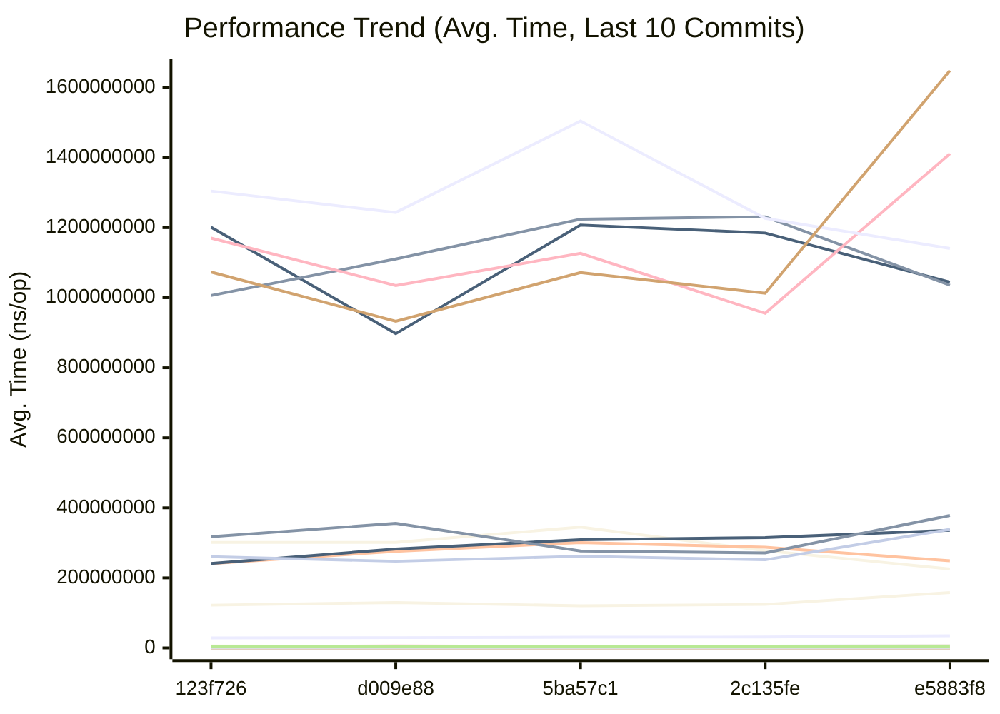
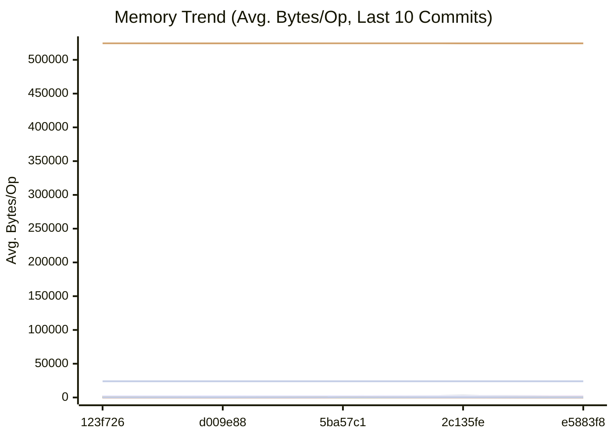

# Performance Benchmarks

This document tracks benchmark performance across commits. The section between
the `BENCHMARK_RESULTS_START/END` markers is auto-generated by the pre-commit
hook; the crypto/OPRF section below is manually maintained.

## How to Read This Document

- **Comparison with previous commit**: `benchstat` output comparing the current
  commit against the previous one. Three tables: **sec/op** (time per operation),
  **B/op** (bytes allocated), **allocs/op** (heap allocations). In each table,
  **lower is better**. `+X%` = regression, `-X%` = improvement, `~` = no
  statistically significant change. `p` is the p-value (p < 0.05 = significant).
- **Latest Benchmark Results**: Single-snapshot table of the current commit's
  averages. Lower values are better across all three columns.
- **Performance Trend plot**: X-axis = commit SHA (left = older, right = newer).
  Y-axis = avg time in ns/op. **Lower lines = faster.** Downward trends are
  improvements; upward spikes are regressions.
- **Memory Trend plot**: Same axes, but Y-axis = avg bytes allocated per op.
  **Lower lines = less memory.** Drops indicate allocation reductions.
- **Allocation Trend plot**: Same axes, but Y-axis = avg heap allocations per op.
  **Lower lines = fewer allocations.** Fewer allocs = less GC pressure.

<!-- BENCHMARK_RESULTS_START -->
## Performance

This section is automatically updated by the pre-commit hook (via .github/scripts/update_readme_with_benchmarks.sh).

### Comparison with previous commit

Each table compares the previous commit (left) to the current commit (right).
**Lower is better** in all three tables. `+X%` = regression, `-X%` = improvement,
`~` = no statistically significant change (p >= 0.05).

- **sec/op**: Time per operation (nanoseconds). Measures raw speed.
- **B/op**: Bytes allocated on the heap per operation. Measures memory usage.
- **allocs/op**: Number of heap allocations per operation. Measures GC pressure.

```
                                      │ /tmp/old_bench_filtered.txt │      /tmp/new_bench_filtered.txt      │
                                      │           sec/op            │    sec/op      vs base                │
CrushOriginal-8                                        632.8n ± ∞ ¹    730.5n ± ∞ ¹       ~ (p=1.000 n=1) ²
Placement-8                                            6.718µ ± ∞ ¹    8.505µ ± ∞ ¹       ~ (p=1.000 n=1) ²
PlacementDomainSpread-8                                6.553µ ± ∞ ¹    8.563µ ± ∞ ¹       ~ (p=1.000 n=1) ²
CrushOptimized-8                                       458.0n ± ∞ ¹    539.1n ± ∞ ¹       ~ (p=1.000 n=1) ²
LoadGlobalConfig-8                                     13.36µ ± ∞ ¹    14.51µ ± ∞ ¹       ~ (p=1.000 n=1) ²
HashBytes/1MiB-8                                       5.111m ± ∞ ¹    4.751m ± ∞ ¹       ~ (p=1.000 n=1) ²
HashBytes/64MiB-8                                      297.8m ± ∞ ¹    317.6m ± ∞ ¹       ~ (p=1.000 n=1) ²
HashBytes/256MiB-8                                      1.174 ± ∞ ¹     1.222 ± ∞ ¹       ~ (p=1.000 n=1) ²
HashFile/1MiB-8                                        4.950m ± ∞ ¹    5.130m ± ∞ ¹       ~ (p=1.000 n=1) ²
HashFile/64MiB-8                                       333.5m ± ∞ ¹    329.6m ± ∞ ¹       ~ (p=1.000 n=1) ²
HashFile/256MiB-8                                       1.319 ± ∞ ¹     1.311 ± ∞ ¹       ~ (p=1.000 n=1) ²
PadString-8                                            70.76n ± ∞ ¹    49.00n ± ∞ ¹       ~ (p=1.000 n=1) ²
SanitizeLog/Safe-8                                     360.8n ± ∞ ¹    255.8n ± ∞ ¹       ~ (p=1.000 n=1) ²
SanitizeLog/Unsafe-8                                  1091.0n ± ∞ ¹    800.8n ± ∞ ¹       ~ (p=1.000 n=1) ²
AWSChunkedReaderSigned-8                               618.0µ ± ∞ ¹    521.8µ ± ∞ ¹       ~ (p=1.000 n=1) ²
AWSChunkedReaderUnsigned-8                             573.7µ ± ∞ ¹    451.5µ ± ∞ ¹       ~ (p=1.000 n=1) ²
LastModifiedHeader_AppendFormat-8                      286.3n ± ∞ ¹    251.8n ± ∞ ¹       ~ (p=1.000 n=1) ²
LastModifiedHeader_Format-8                            384.6n ± ∞ ¹    349.9n ± ∞ ¹       ~ (p=1.000 n=1) ²
FormatListObjectsV2XML_AppendFormat-8                  848.9µ ± ∞ ¹   1046.7µ ± ∞ ¹       ~ (p=1.000 n=1) ²
FormatListObjectsV2XML_OldFormat-8                     535.8µ ± ∞ ¹    745.1µ ± ∞ ¹       ~ (p=1.000 n=1) ²
CheckMetricsAndSwap-8                                  10.50n ± ∞ ¹    16.88n ± ∞ ¹       ~ (p=1.000 n=1) ²
IndexSearch-8                                          2.025n ± ∞ ¹    4.644n ± ∞ ¹       ~ (p=1.000 n=1) ²
IndexDirectTracking-8                                 0.5073n ± ∞ ¹   0.6306n ± ∞ ¹       ~ (p=1.000 n=1) ²
LocalWrite/1MiB-8                                      526.4µ ± ∞ ¹    795.5µ ± ∞ ¹       ~ (p=1.000 n=1) ²
LocalWrite/64MiB-8                                     32.84m ± ∞ ¹    53.06m ± ∞ ¹       ~ (p=1.000 n=1) ²
LocalWrite/256MiB-8                                    126.4m ± ∞ ¹    151.1m ± ∞ ¹       ~ (p=1.000 n=1) ²
ReadVerify/1MiB-8                                      4.461m ± ∞ ¹    5.089m ± ∞ ¹       ~ (p=1.000 n=1) ²
ReadVerify/64MiB-8                                     405.5m ± ∞ ¹    335.2m ± ∞ ¹       ~ (p=1.000 n=1) ²
ReadVerify/256MiB-8                                     1.245 ± ∞ ¹     1.338 ± ∞ ¹       ~ (p=1.000 n=1) ²
TrustedRead/1MiB-8                                     6.460m ± ∞ ¹    5.688m ± ∞ ¹       ~ (p=1.000 n=1) ²
TrustedRead/64MiB-8                                    334.0m ± ∞ ¹    419.0m ± ∞ ¹       ~ (p=1.000 n=1) ²
TrustedRead/256MiB-8                                    1.441 ± ∞ ¹     1.533 ± ∞ ¹       ~ (p=1.000 n=1) ²
S3PutSpool/1MiB-8                                      5.796m ± ∞ ¹    6.487m ± ∞ ¹       ~ (p=1.000 n=1) ²
S3PutSpool/64MiB-8                                     384.4m ± ∞ ¹    395.4m ± ∞ ¹       ~ (p=1.000 n=1) ²
S3PutSpool/256MiB-8                                     1.474 ± ∞ ¹     1.415 ± ∞ ¹       ~ (p=1.000 n=1) ²
geomean                                                432.2µ          466.8µ        +8.01%
¹ need >= 6 samples for confidence interval at level 0.95
² need >= 4 samples to detect a difference at alpha level 0.05

                                      │ /tmp/old_bench_filtered.txt │      /tmp/new_bench_filtered.txt      │
                                      │            B/op             │     B/op       vs base                │
CrushOriginal-8                                         164.0 ± ∞ ¹     164.0 ± ∞ ¹       ~ (p=1.000 n=1) ²
Placement-8                                             352.0 ± ∞ ¹     352.0 ± ∞ ¹       ~ (p=1.000 n=1) ²
PlacementDomainSpread-8                                 352.0 ± ∞ ¹     352.0 ± ∞ ¹       ~ (p=1.000 n=1) ²
CrushOptimized-8                                        0.000 ± ∞ ¹     0.000 ± ∞ ¹       ~ (p=1.000 n=1) ²
LoadGlobalConfig-8                                    1.930Ki ± ∞ ¹   1.930Ki ± ∞ ¹       ~ (p=1.000 n=1) ²
HashBytes/1MiB-8                                        64.00 ± ∞ ¹     64.00 ± ∞ ¹       ~ (p=1.000 n=1) ²
HashBytes/64MiB-8                                       64.00 ± ∞ ¹     64.00 ± ∞ ¹       ~ (p=1.000 n=1) ²
HashBytes/256MiB-8                                      64.00 ± ∞ ¹     64.00 ± ∞ ¹       ~ (p=1.000 n=1) ²
HashFile/1MiB-8                                       32.35Ki ± ∞ ¹   32.35Ki ± ∞ ¹       ~ (p=1.000 n=1) ²
HashFile/64MiB-8                                      32.35Ki ± ∞ ¹   32.35Ki ± ∞ ¹       ~ (p=1.000 n=1) ²
HashFile/256MiB-8                                     32.35Ki ± ∞ ¹   32.35Ki ± ∞ ¹       ~ (p=1.000 n=1) ²
PadString-8                                             64.00 ± ∞ ¹     64.00 ± ∞ ¹       ~ (p=1.000 n=1) ²
SanitizeLog/Safe-8                                      0.000 ± ∞ ¹     0.000 ± ∞ ¹       ~ (p=1.000 n=1) ²
SanitizeLog/Unsafe-8                                    704.0 ± ∞ ¹     704.0 ± ∞ ¹       ~ (p=1.000 n=1) ²
AWSChunkedReaderSigned-8                              11.05Ki ± ∞ ¹   11.04Ki ± ∞ ¹       ~ (p=1.000 n=1) ³
AWSChunkedReaderUnsigned-8                            76.75Ki ± ∞ ¹   76.73Ki ± ∞ ¹       ~ (p=1.000 n=1) ³
LastModifiedHeader_AppendFormat-8                       0.000 ± ∞ ¹     0.000 ± ∞ ¹       ~ (p=1.000 n=1) ²
LastModifiedHeader_Format-8                             32.00 ± ∞ ¹     32.00 ± ∞ ¹       ~ (p=1.000 n=1) ²
FormatListObjectsV2XML_AppendFormat-8                 512.2Ki ± ∞ ¹   512.2Ki ± ∞ ¹       ~ (p=1.000 n=1) ³
FormatListObjectsV2XML_OldFormat-8                    23.44Ki ± ∞ ¹   23.44Ki ± ∞ ¹       ~ (p=1.000 n=1) ²
CheckMetricsAndSwap-8                                   0.000 ± ∞ ¹     0.000 ± ∞ ¹       ~ (p=1.000 n=1) ²
IndexSearch-8                                           0.000 ± ∞ ¹     0.000 ± ∞ ¹       ~ (p=1.000 n=1) ²
IndexDirectTracking-8                                   0.000 ± ∞ ¹     0.000 ± ∞ ¹       ~ (p=1.000 n=1) ²
LocalWrite/1MiB-8                                     65.46Ki ± ∞ ¹   65.47Ki ± ∞ ¹       ~ (p=1.000 n=1) ³
LocalWrite/64MiB-8                                    65.52Ki ± ∞ ¹   65.52Ki ± ∞ ¹       ~ (p=1.000 n=1) ³
LocalWrite/256MiB-8                                   65.78Ki ± ∞ ¹   65.85Ki ± ∞ ¹       ~ (p=1.000 n=1) ³
ReadVerify/1MiB-8                                       436.0 ± ∞ ¹     471.0 ± ∞ ¹       ~ (p=1.000 n=1) ³
ReadVerify/64MiB-8                                    2.711Ki ± ∞ ¹   2.711Ki ± ∞ ¹       ~ (p=1.000 n=1) ²
ReadVerify/256MiB-8                                   9.578Ki ± ∞ ¹   9.578Ki ± ∞ ¹       ~ (p=1.000 n=1) ²
TrustedRead/1MiB-8                                      800.0 ± ∞ ¹     800.0 ± ∞ ¹       ~ (p=1.000 n=1) ²
TrustedRead/64MiB-8                                     800.0 ± ∞ ¹     800.0 ± ∞ ¹       ~ (p=1.000 n=1) ²
TrustedRead/256MiB-8                                    800.0 ± ∞ ¹     848.0 ± ∞ ¹       ~ (p=1.000 n=1) ³
S3PutSpool/1MiB-8                                       447.0 ± ∞ ¹     447.0 ± ∞ ¹       ~ (p=1.000 n=1) ²
S3PutSpool/64MiB-8                                      448.0 ± ∞ ¹     448.0 ± ∞ ¹       ~ (p=1.000 n=1) ²
S3PutSpool/256MiB-8                                     448.0 ± ∞ ¹     448.0 ± ∞ ¹       ~ (p=1.000 n=1) ²
geomean                                                           ⁴                  +0.39%               ⁴
¹ need >= 6 samples for confidence interval at level 0.95
² all samples are equal
³ need >= 4 samples to detect a difference at alpha level 0.05
⁴ summaries must be >0 to compute geomean

                                      │ /tmp/old_bench_filtered.txt │     /tmp/new_bench_filtered.txt      │
                                      │          allocs/op          │  allocs/op    vs base                │
CrushOriginal-8                                         3.000 ± ∞ ¹    3.000 ± ∞ ¹       ~ (p=1.000 n=1) ²
Placement-8                                             6.000 ± ∞ ¹    6.000 ± ∞ ¹       ~ (p=1.000 n=1) ²
PlacementDomainSpread-8                                 6.000 ± ∞ ¹    6.000 ± ∞ ¹       ~ (p=1.000 n=1) ²
CrushOptimized-8                                        0.000 ± ∞ ¹    0.000 ± ∞ ¹       ~ (p=1.000 n=1) ²
LoadGlobalConfig-8                                      58.00 ± ∞ ¹    58.00 ± ∞ ¹       ~ (p=1.000 n=1) ²
HashBytes/1MiB-8                                        1.000 ± ∞ ¹    1.000 ± ∞ ¹       ~ (p=1.000 n=1) ²
HashBytes/64MiB-8                                       1.000 ± ∞ ¹    1.000 ± ∞ ¹       ~ (p=1.000 n=1) ²
HashBytes/256MiB-8                                      1.000 ± ∞ ¹    1.000 ± ∞ ¹       ~ (p=1.000 n=1) ²
HashFile/1MiB-8                                         6.000 ± ∞ ¹    6.000 ± ∞ ¹       ~ (p=1.000 n=1) ²
HashFile/64MiB-8                                        6.000 ± ∞ ¹    6.000 ± ∞ ¹       ~ (p=1.000 n=1) ²
HashFile/256MiB-8                                       6.000 ± ∞ ¹    6.000 ± ∞ ¹       ~ (p=1.000 n=1) ²
PadString-8                                             1.000 ± ∞ ¹    1.000 ± ∞ ¹       ~ (p=1.000 n=1) ²
SanitizeLog/Safe-8                                      0.000 ± ∞ ¹    0.000 ± ∞ ¹       ~ (p=1.000 n=1) ²
SanitizeLog/Unsafe-8                                    1.000 ± ∞ ¹    1.000 ± ∞ ¹       ~ (p=1.000 n=1) ²
AWSChunkedReaderSigned-8                                80.00 ± ∞ ¹    80.00 ± ∞ ¹       ~ (p=1.000 n=1) ²
AWSChunkedReaderUnsigned-8                              15.00 ± ∞ ¹    15.00 ± ∞ ¹       ~ (p=1.000 n=1) ²
LastModifiedHeader_AppendFormat-8                       0.000 ± ∞ ¹    0.000 ± ∞ ¹       ~ (p=1.000 n=1) ²
LastModifiedHeader_Format-8                             1.000 ± ∞ ¹    1.000 ± ∞ ¹       ~ (p=1.000 n=1) ²
FormatListObjectsV2XML_AppendFormat-8                   16.00 ± ∞ ¹    16.00 ± ∞ ¹       ~ (p=1.000 n=1) ²
FormatListObjectsV2XML_OldFormat-8                     1.000k ± ∞ ¹   1.000k ± ∞ ¹       ~ (p=1.000 n=1) ²
CheckMetricsAndSwap-8                                   0.000 ± ∞ ¹    0.000 ± ∞ ¹       ~ (p=1.000 n=1) ²
IndexSearch-8                                           0.000 ± ∞ ¹    0.000 ± ∞ ¹       ~ (p=1.000 n=1) ²
IndexDirectTracking-8                                   0.000 ± ∞ ¹    0.000 ± ∞ ¹       ~ (p=1.000 n=1) ²
LocalWrite/1MiB-8                                       18.00 ± ∞ ¹    18.00 ± ∞ ¹       ~ (p=1.000 n=1) ²
LocalWrite/64MiB-8                                      18.00 ± ∞ ¹    18.00 ± ∞ ¹       ~ (p=1.000 n=1) ²
LocalWrite/256MiB-8                                     20.00 ± ∞ ¹    20.00 ± ∞ ¹       ~ (p=1.000 n=1) ²
ReadVerify/1MiB-8                                       6.000 ± ∞ ¹    6.000 ± ∞ ¹       ~ (p=1.000 n=1) ²
ReadVerify/64MiB-8                                      7.000 ± ∞ ¹    7.000 ± ∞ ¹       ~ (p=1.000 n=1) ²
ReadVerify/256MiB-8                                     10.00 ± ∞ ¹    10.00 ± ∞ ¹       ~ (p=1.000 n=1) ²
TrustedRead/1MiB-8                                      11.00 ± ∞ ¹    11.00 ± ∞ ¹       ~ (p=1.000 n=1) ²
TrustedRead/64MiB-8                                     11.00 ± ∞ ¹    11.00 ± ∞ ¹       ~ (p=1.000 n=1) ²
TrustedRead/256MiB-8                                    11.00 ± ∞ ¹    12.00 ± ∞ ¹       ~ (p=1.000 n=1) ³
S3PutSpool/1MiB-8                                       10.00 ± ∞ ¹    10.00 ± ∞ ¹       ~ (p=1.000 n=1) ²
S3PutSpool/64MiB-8                                      10.00 ± ∞ ¹    10.00 ± ∞ ¹       ~ (p=1.000 n=1) ²
S3PutSpool/256MiB-8                                     10.00 ± ∞ ¹    10.00 ± ∞ ¹       ~ (p=1.000 n=1) ²
geomean                                                           ⁴                 +0.25%               ⁴
¹ need >= 6 samples for confidence interval at level 0.95
² all samples are equal
³ need >= 4 samples to detect a difference at alpha level 0.05
⁴ summaries must be >0 to compute geomean

                           │ /tmp/old_bench_filtered.txt │      /tmp/new_bench_filtered.txt      │
                           │             B/s             │      B/s       vs base                │
HashBytes/1MiB-8                           195.7Mi ± ∞ ¹   210.5Mi ± ∞ ¹       ~ (p=1.000 n=1) ²
HashBytes/64MiB-8                          214.9Mi ± ∞ ¹   201.5Mi ± ∞ ¹       ~ (p=1.000 n=1) ²
HashBytes/256MiB-8                         218.0Mi ± ∞ ¹   209.5Mi ± ∞ ¹       ~ (p=1.000 n=1) ²
HashFile/1MiB-8                            202.0Mi ± ∞ ¹   195.0Mi ± ∞ ¹       ~ (p=1.000 n=1) ²
HashFile/64MiB-8                           191.9Mi ± ∞ ¹   194.2Mi ± ∞ ¹       ~ (p=1.000 n=1) ²
HashFile/256MiB-8                          194.1Mi ± ∞ ¹   195.3Mi ± ∞ ¹       ~ (p=1.000 n=1) ²
AWSChunkedReaderSigned-8                   102.7Mi ± ∞ ¹   121.6Mi ± ∞ ¹       ~ (p=1.000 n=1) ²
AWSChunkedReaderUnsigned-8                 110.7Mi ± ∞ ¹   140.6Mi ± ∞ ¹       ~ (p=1.000 n=1) ²
LocalWrite/1MiB-8                          1.855Gi ± ∞ ¹   1.228Gi ± ∞ ¹       ~ (p=1.000 n=1) ²
LocalWrite/64MiB-8                         1.903Gi ± ∞ ¹   1.178Gi ± ∞ ¹       ~ (p=1.000 n=1) ²
LocalWrite/256MiB-8                        1.977Gi ± ∞ ¹   1.654Gi ± ∞ ¹       ~ (p=1.000 n=1) ²
ReadVerify/1MiB-8                          224.2Mi ± ∞ ¹   196.5Mi ± ∞ ¹       ~ (p=1.000 n=1) ²
ReadVerify/64MiB-8                         157.8Mi ± ∞ ¹   190.9Mi ± ∞ ¹       ~ (p=1.000 n=1) ²
ReadVerify/256MiB-8                        205.7Mi ± ∞ ¹   191.3Mi ± ∞ ¹       ~ (p=1.000 n=1) ²
TrustedRead/1MiB-8                         154.8Mi ± ∞ ¹   175.8Mi ± ∞ ¹       ~ (p=1.000 n=1) ²
TrustedRead/64MiB-8                        191.6Mi ± ∞ ¹   152.8Mi ± ∞ ¹       ~ (p=1.000 n=1) ²
TrustedRead/256MiB-8                       177.7Mi ± ∞ ¹   167.0Mi ± ∞ ¹       ~ (p=1.000 n=1) ²
S3PutSpool/1MiB-8                          172.5Mi ± ∞ ¹   154.2Mi ± ∞ ¹       ~ (p=1.000 n=1) ²
S3PutSpool/64MiB-8                         166.5Mi ± ∞ ¹   161.9Mi ± ∞ ¹       ~ (p=1.000 n=1) ²
S3PutSpool/256MiB-8                        173.6Mi ± ∞ ¹   180.9Mi ± ∞ ¹       ~ (p=1.000 n=1) ²
geomean                                    252.7Mi         240.5Mi        -4.81%
¹ need >= 6 samples for confidence interval at level 0.95
² need >= 4 samples to detect a difference at alpha level 0.05
```

### Latest Benchmark Results

Single-snapshot of the current commit's averages. **Lower is better** across all
three columns: time (speed), bytes (memory), allocs (GC pressure).


| Benchmark | Avg. Time/Op | Avg. Bytes/Op | Avg. Allocs/Op |
|-----------|--------------|---------------|----------------|
| BenchmarkAWSChunkedReaderSigned-8 | 521824.00 ns/op | 127.55 B/op | 11300.00 allocs/op |
| BenchmarkAWSChunkedReaderUnsigned-8 | 451522.00 ns/op | 147.41 B/op | 78576.00 allocs/op |
| BenchmarkCheckMetricsAndSwap-8 | 16.88 ns/op | 0.00 B/op | 0.00 allocs/op |
| BenchmarkCrushOptimized-8 | 539.10 ns/op | 0.00 B/op | 0.00 allocs/op |
| BenchmarkCrushOriginal-8 | 730.50 ns/op | 164.00 B/op | 3.00 allocs/op |
| BenchmarkFormatListObjectsV2XML_AppendFormat-8 | 1046717.00 ns/op | 524483.00 B/op | 16.00 allocs/op |
| BenchmarkFormatListObjectsV2XML_OldFormat-8 | 745142.00 ns/op | 24000.00 B/op | 1000.00 allocs/op |
| BenchmarkHashBytes/1MiB-8 | 4751175.00 ns/op | 220.70 B/op | 64.00 allocs/op |
| BenchmarkHashBytes/256MiB-8 | 1221858506.00 ns/op | 219.69 B/op | 64.00 allocs/op |
| BenchmarkHashBytes/64MiB-8 | 317593619.00 ns/op | 211.30 B/op | 64.00 allocs/op |
| BenchmarkHashFile/1MiB-8 | 5129547.00 ns/op | 204.42 B/op | 33128.00 allocs/op |
| BenchmarkHashFile/256MiB-8 | 1310601572.00 ns/op | 204.82 B/op | 33128.00 allocs/op |
| BenchmarkHashFile/64MiB-8 | 329592825.00 ns/op | 203.61 B/op | 33128.00 allocs/op |
| BenchmarkIndexDirectTracking-8 | 0.63 ns/op | 0.00 B/op | 0.00 allocs/op |
| BenchmarkIndexSearch-8 | 4.64 ns/op | 0.00 B/op | 0.00 allocs/op |
| BenchmarkLastModifiedHeader_AppendFormat-8 | 251.80 ns/op | 0.00 B/op | 0.00 allocs/op |
| BenchmarkLastModifiedHeader_Format-8 | 349.90 ns/op | 32.00 B/op | 1.00 allocs/op |
| BenchmarkLoadGlobalConfig-8 | 14511.00 ns/op | 1976.00 B/op | 58.00 allocs/op |
| BenchmarkLocalWrite/1MiB-8 | 795470.00 ns/op | 1318.18 B/op | 67040.00 allocs/op |
| BenchmarkLocalWrite/256MiB-8 | 151118283.00 ns/op | 1776.33 B/op | 67435.00 allocs/op |
| BenchmarkLocalWrite/64MiB-8 | 53059327.00 ns/op | 1264.79 B/op | 67097.00 allocs/op |
| BenchmarkPadString-8 | 49.00 ns/op | 64.00 B/op | 1.00 allocs/op |
| BenchmarkPlacement-8 | 8505.00 ns/op | 352.00 B/op | 6.00 allocs/op |
| BenchmarkPlacementDomainSpread-8 | 8563.00 ns/op | 352.00 B/op | 6.00 allocs/op |
| BenchmarkReadVerify/1MiB-8 | 5088522.00 ns/op | 206.07 B/op | 471.00 allocs/op |
| BenchmarkReadVerify/256MiB-8 | 1337973310.00 ns/op | 200.63 B/op | 9808.00 allocs/op |
| BenchmarkReadVerify/64MiB-8 | 335223998.00 ns/op | 200.19 B/op | 2776.00 allocs/op |
| BenchmarkS3PutSpool/1MiB-8 | 6486611.00 ns/op | 161.65 B/op | 447.00 allocs/op |
| BenchmarkS3PutSpool/256MiB-8 | 1414994967.00 ns/op | 189.71 B/op | 448.00 allocs/op |
| BenchmarkS3PutSpool/64MiB-8 | 395378107.00 ns/op | 169.73 B/op | 448.00 allocs/op |
| BenchmarkSanitizeLog/Safe-8 | 255.80 ns/op | 0.00 B/op | 0.00 allocs/op |
| BenchmarkSanitizeLog/Unsafe-8 | 800.80 ns/op | 704.00 B/op | 1.00 allocs/op |
| BenchmarkTrustedRead/1MiB-8 | 5688219.00 ns/op | 184.34 B/op | 800.00 allocs/op |
| BenchmarkTrustedRead/256MiB-8 | 1532603475.00 ns/op | 175.15 B/op | 848.00 allocs/op |
| BenchmarkTrustedRead/64MiB-8 | 418960245.00 ns/op | 160.18 B/op | 800.00 allocs/op |


### Performance History

**Legend**

| Color | Benchmark | Description |
|---|---|---|
| 🟢 | CheckMetricsAndSwap | Evaluation of system metrics (CPU/Mem) and mode switching logic |
| 🟤 | CrushOriginal | Original Sage Weil's CRUSH placement algorithm using reflection and float math |
| ⚪ | CrushOptimized | Performance-tuned CRUSH-lite placement algorithm using bitwise shifts and integer math (Rule 19) |
| 🔵 | IndexDirectTracking | Accessing current replication mode via direct slice index (O(1)) |
| 🔴 | IndexSearch | Searching for current replication mode in the order slice using `slices.Index` |
| 🟠 | LoadGlobalConfig | Parsing and loading the `[global]` section from the INI configuration |
| 🟣 | PadString | Padding strings with null characters to a fixed protocol length |
| 🟡 | ParseReplicationOrder | Parsing the CSV-formatted replication order string into an integer slice |

#### Time per Operation (ns/op)

X-axis: commit SHA (left = older, right = newer). Y-axis: avg time in ns/op.
**Lower lines = faster code.** Downward trends are improvements; upward spikes
are regressions to investigate.


```mermaid
xychart-beta
    title "Performance Trend (Avg. Time, Last 10 Commits)"
    x-axis "Commit"
    y-axis "Avg. Time (ns/op)"
    x-axis [123f726,d009e88,5ba57c1,2c135fe,e5883f8]
    line "AWSChunkedReaderSigned" [554800,615254,528737,564386,758672,413086,397685,535625,618041,521824]
    line "AWSChunkedReaderUnsigned" [581740,507516,587797,593238,672192,414070,405982,479460,573661,451522]
    line "CheckMetricsAndSwap" [12,11,10,13,15,8,7,10,10,17]
    line "CrushOptimized" [363,426,455,372,348,300,328,320,458,539]
    line "CrushOriginal" [647,700,629,670,500,425,443,407,633,730]
    line "FormatListObjectsV2XML_AppendFormat" [898486,862695,851540,926975,915187,583023,566690,627648,848928,1046717]
    line "FormatListObjectsV2XML_OldFormat" [503389,497195,517753,571332,678624,365879,366636,408457,535755,745142]
    line "HashBytes/1MiB" [3618889,5475294,4458201,5002278,3553145,3949669,3443981,3592333,5110585,4751175]
    line "HashBytes/256MiB" [1201286487,897333718,1207294588,1184745180,1044551719,953557308,880098861,925707610,1174333367,1221858506]
    line "HashBytes/64MiB" [301162837,301221390,345018440,277796866,225326458,239330627,209418782,242948441,297766074,317593619]
    line "HashFile/1MiB" [4760647,3647035,4734519,4310666,4389479,3364281,3842035,3350950,4950193,5129547]
    line "HashFile/256MiB" [1006415705,1110450496,1224080744,1231037862,1035601414,793044431,881918242,1015211606,1319192441,1310601572]
    line "HashFile/64MiB" [240359009,275852870,300686574,287252666,248823362,200009250,249484580,207167851,333549904,329592825]
    line "IndexDirectTracking" [0,0,1,1,1,0,0,0,1,1]
    line "IndexSearch" [2,2,2,2,3,2,2,2,2,5]
    line "LastModifiedHeader_AppendFormat" [291,280,241,335,327,200,185,228,286,252]
    line "LastModifiedHeader_Format" [345,360,407,375,540,279,262,285,385,350]
    line "LoadGlobalConfig" [12190,11396,14415,13002,10458,9205,9952,8921,13356,14511]
    line "LocalWrite/1MiB" [524282,489792,546231,429345,817681,719361,445767,431598,526423,795470]
    line "LocalWrite/256MiB" [122106179,129421555,120328176,124110973,158044809,120298309,94142106,100079806,126435842,151118283]
    line "LocalWrite/64MiB" [28590856,29289820,30438473,30969681,34833751,27951923,24072639,25874779,32839259,53059327]
    line "PadString" [66,60,55,62,58,41,57,53,71,49]
    line "ParseReplicationOrder_NoPrealloc" [350,349,357,354,345,225,229,165,232,234]
    line "ParseReplicationOrder_Prealloc" [229,231,237,234,229,108,107,80,110,109]
    line "Placement" [6141,6119,7125,6310,5825,4876,5168,4621,6718,8505]
    line "PlacementDomainSpread" [6176,5740,6962,6385,6405,5139,5453,5023,6553,8563]
    line "ReadVerify/1MiB" [3383659,5081549,5082713,4903321,6081724,3136229,3798416,3596845,4460850,5088522]
    line "ReadVerify/256MiB" [1170100253,1034709963,1126615995,955370931,1411104961,1000738329,803259188,883417974,1244837167,1337973310]
    line "ReadVerify/64MiB" [240879749,282446554,308997294,315121783,335838061,214326196,232435503,273582930,405518693,335223998]
    line "S3PutSpool/1MiB" [5587762,4022819,5065293,4750326,6562486,3791252,4349655,4494504,5795780,6486611]
    line "S3PutSpool/256MiB" [1304442018,1243287804,1504779272,1226604254,1140637754,1085496919,1054828608,1041459785,1474423367,1414994967]
    line "S3PutSpool/64MiB" [317372640,355710496,276642924,271159852,378241377,245496530,292024160,277039985,384356699,395378107]
    line "SanitizeLog/Safe" [277,263,246,286,286,227,233,295,361,256]
    line "SanitizeLog/Unsafe" [1021,917,915,1036,1495,681,684,922,1091,801]
    line "TrustedRead/1MiB" [3708543,3570428,4694929,4495398,3669866,3527534,3390683,4063744,6459603,5688219]
    line "TrustedRead/256MiB" [1073394044,932638111,1071768789,1012880474,1648511504,887056660,864337055,941546678,1440831398,1532603475]
    line "TrustedRead/64MiB" [260468873,247394092,261716002,251602823,338500502,217741152,228835469,245169178,333995810,418960245]
```

#### Memory per Operation (B/op)

X-axis: commit SHA. Y-axis: avg bytes allocated per op.
**Lower lines = less memory.** Drops indicate allocation reductions.


```mermaid
xychart-beta
    title "Memory Trend (Avg. Bytes/Op, Last 10 Commits)"
    x-axis "Commit"
    y-axis "Avg. Bytes/Op"
    x-axis [123f726,d009e88,5ba57c1,2c135fe,e5883f8]
    line "AWSChunkedReaderSigned" [120,108,126,118,88,161,167,124,108,128]
    line "AWSChunkedReaderUnsigned" [114,131,113,112,99,161,164,139,116,147]
    line "CheckMetricsAndSwap" [0,0,0,0,0,0,0,0,0,0]
    line "CrushOptimized" [0,0,0,0,0,0,0,0,0,0]
    line "CrushOriginal" [164,164,164,164,164,164,164,164,164,164]
    line "FormatListObjectsV2XML_AppendFormat" [524471,524446,524472,524454,524455,524439,524442,524446,524462,524483]
    line "FormatListObjectsV2XML_OldFormat" [24000,24000,24000,24000,24000,24000,24000,24000,24000,24000]
    line "HashBytes/1MiB" [290,192,235,210,295,265,304,292,205,221]
    line "HashBytes/256MiB" [223,299,222,227,257,282,305,290,229,220]
    line "HashBytes/64MiB" [223,223,195,242,298,280,320,276,225,211]
    line "HashFile/1MiB" [220,288,221,243,239,312,273,313,212,204]
    line "HashFile/256MiB" [267,242,219,218,259,338,304,264,203,205]
    line "HashFile/64MiB" [279,243,223,234,270,336,269,324,201,204]
    line "IndexDirectTracking" [0,0,0,0,0,0,0,0,0,0]
    line "IndexSearch" [0,0,0,0,0,0,0,0,0,0]
    line "LastModifiedHeader_AppendFormat" [0,0,0,0,0,0,0,0,0,0]
    line "LastModifiedHeader_Format" [32,32,32,32,32,32,32,32,32,32]
    line "LoadGlobalConfig" [1976,1976,1976,1976,1976,1976,1976,1976,1976,1976]
    line "LocalWrite/1MiB" [2000,2141,1920,2442,1282,1458,2352,2430,1992,1318]
    line "LocalWrite/256MiB" [2198,2074,2231,2163,1698,2231,2851,2682,2123,1776]
    line "LocalWrite/64MiB" [2347,2291,2205,2167,1927,2401,2788,2594,2044,1265]
    line "PadString" [64,64,64,64,64,64,64,64,64,64]
    line "ParseReplicationOrder_NoPrealloc" [408,408,408,408,408,248,248,248,248,248]
    line "ParseReplicationOrder_Prealloc" [240,240,240,240,240,80,80,80,80,80]
    line "Placement" [352,352,352,352,352,352,352,352,352,352]
    line "PlacementDomainSpread" [352,352,352,352,352,352,352,352,352,352]
    line "ReadVerify/1MiB" [310,206,206,214,172,334,276,292,235,206]
    line "ReadVerify/256MiB" [229,259,238,281,190,268,334,304,216,201]
    line "ReadVerify/64MiB" [279,238,217,213,200,313,289,245,165,200]
    line "S3PutSpool/1MiB" [188,261,207,221,160,277,241,233,181,162]
    line "S3PutSpool/256MiB" [206,216,178,219,235,247,254,258,182,190]
    line "S3PutSpool/64MiB" [211,189,243,247,177,273,230,242,175,170]
    line "SanitizeLog/Safe" [0,0,0,0,0,0,0,0,0,0]
    line "SanitizeLog/Unsafe" [704,704,704,704,704,704,704,704,704,704]
    line "TrustedRead/1MiB" [283,294,223,233,286,297,309,258,162,184]
    line "TrustedRead/256MiB" [250,288,250,265,163,303,311,285,186,175]
    line "TrustedRead/64MiB" [258,271,256,267,198,308,293,274,201,160]
```

#### Allocations per Operation (allocs/op)

X-axis: commit SHA. Y-axis: avg heap allocations per op.
**Lower lines = fewer allocations.** Fewer allocs = less GC pressure.


```mermaid
xychart-beta
    title "Allocation Trend (Avg. Allocs/Op, Last 10 Commits)"
    x-axis "Commit"
    y-axis "Avg. Allocs/Op"
    x-axis [123f726,d009e88,5ba57c1,2c135fe,e5883f8]
    line "AWSChunkedReaderSigned" [11300,11299,11305,11315,11352,11288,11282,11307,11314,11300]
    line "AWSChunkedReaderUnsigned" [78589,78575,78586,78603,78609,78561,78569,78579,78587,78576]
    line "CheckMetricsAndSwap" [0,0,0,0,0,0,0,0,0,0]
    line "CrushOptimized" [0,0,0,0,0,0,0,0,0,0]
    line "CrushOriginal" [3,3,3,3,3,3,3,3,3,3]
    line "FormatListObjectsV2XML_AppendFormat" [16,16,16,16,16,16,16,16,16,16]
    line "FormatListObjectsV2XML_OldFormat" [1000,1000,1000,1000,1000,1000,1000,1000,1000,1000]
    line "HashBytes/1MiB" [64,64,64,64,64,64,64,64,64,64]
    line "HashBytes/256MiB" [64,64,64,64,64,64,64,64,64,64]
    line "HashBytes/64MiB" [64,64,64,64,64,64,64,64,64,64]
    line "HashFile/1MiB" [33128,33128,33128,33128,33128,33128,33128,33128,33128,33128]
    line "HashFile/256MiB" [33128,33128,33128,33128,33128,33128,33128,33128,33128,33128]
    line "HashFile/64MiB" [33128,33128,33128,33128,33128,33128,33128,33128,33128,33128]
    line "IndexDirectTracking" [0,0,0,0,0,0,0,0,0,0]
    line "IndexSearch" [0,0,0,0,0,0,0,0,0,0]
    line "LastModifiedHeader_AppendFormat" [0,0,0,0,0,0,0,0,0,0]
    line "LastModifiedHeader_Format" [1,1,1,1,1,1,1,1,1,1]
    line "LoadGlobalConfig" [58,58,58,58,58,58,58,58,58,58]
    line "LocalWrite/1MiB" [67035,67028,67030,67029,67036,67031,67028,67030,67033,67040]
    line "LocalWrite/256MiB" [67386,67388,67358,67330,67465,67275,67218,67324,67356,67435]
    line "LocalWrite/64MiB" [67086,67077,67086,67071,67103,67070,67080,67067,67089,67097]
    line "PadString" [1,1,1,1,1,1,1,1,1,1]
    line "ParseReplicationOrder_NoPrealloc" [6,6,6,6,6,5,5,5,5,5]
    line "ParseReplicationOrder_Prealloc" [2,2,2,2,2,1,1,1,1,1]
    line "Placement" [6,6,6,6,6,6,6,6,6,6]
    line "PlacementDomainSpread" [6,6,6,6,6,6,6,6,6,6]
    line "ReadVerify/1MiB" [462,461,460,460,484,458,466,460,436,471]
    line "ReadVerify/256MiB" [9808,9808,5120,5120,9808,9808,5120,5120,9808,9808]
    line "ReadVerify/64MiB" [2307,2776,2776,2776,2776,2307,2307,2307,2776,2776]
    line "S3PutSpool/1MiB" [447,447,447,447,447,447,447,447,447,447]
    line "S3PutSpool/256MiB" [448,448,448,448,448,448,448,448,448,448]
    line "S3PutSpool/64MiB" [448,446,448,448,448,448,448,448,448,448]
    line "SanitizeLog/Safe" [0,0,0,0,0,0,0,0,0,0]
    line "SanitizeLog/Unsafe" [1,1,1,1,1,1,1,1,1,1]
    line "TrustedRead/1MiB" [800,800,800,830,800,827,800,800,800,800]
    line "TrustedRead/256MiB" [800,800,800,800,800,800,800,800,800,848]
    line "TrustedRead/64MiB" [800,800,800,800,800,800,800,800,800,800]
```
<!-- BENCHMARK_RESULTS_END -->

### E2EE + OPRF overhead

The sections above are auto-generated and cover the hot-path benchmarks. The
crypto/OPRF work is measured separately; figures below are from `go test -bench`
on the crypto module and are intentionally placed outside the auto-managed block
so they persist.

**Lower is better** across all columns. These benchmarks run on `src/crypto` only
(not tracked in the auto-generated plots above).

| Benchmark | What it measures | Avg. Time/Op | Avg. Bytes/Op | Avg. Allocs/Op |
|-----------|------------------|--------------|---------------|----------------|
| EncryptStream | AES-GCM-256 chunked encryption (64KB input) | ~63 µs | 167 KB | 14 |
| DecryptStream | AES-GCM-256 chunked decryption (64KB input) | ~54 µs | 136 KB | 13 |
| DeriveKey | HKDF-SHA256 key derivation per tenant | ~3.5 µs | 1.3 KB | 18 |
| OPRFCombineThreshold3 | Threshold-3 OPRF combine + unblind (Ristretto255) | ~530 µs | 2.3 KB | 62 |

With `encryption_enabled`, every byte passes through AES-GCM-256 streaming at
~800-1200 MB/s (chunk-bounded memory). The streaming format is **StreamVersion
v4 (issue #824)** with a self-describing chunk size: the default 4096-byte
chunk preserves prior throughput, and the chunk size can be raised/lowered via
`SetStreamChunkSize` within `[512, 4128]` for latency/memory trade-offs without
a wire change in framing beyond the 2-byte header field (v3/v2 blobs still
decode). The threshold OPRF is evaluated **once per
upload/download**, on the dedup tag only (never per chunk):
`OPRFCombineThreshold3` measures a one-time ~0.53 ms client-side combine/unblind
for threshold-3, plus one round-trip per daemon share. This is negligible against
network/disk I/O and does not affect streaming throughput. When `oprf_enabled =
false`, the OPRF path is skipped entirely and behavior is identical to the
pre-OPRF encryption path (backward compatible).
