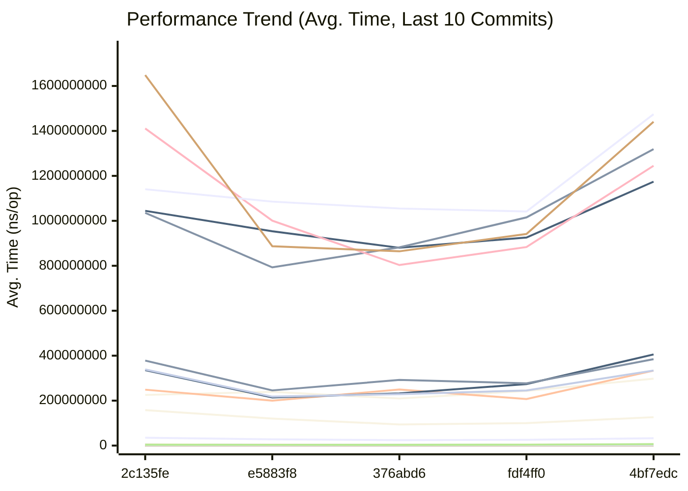
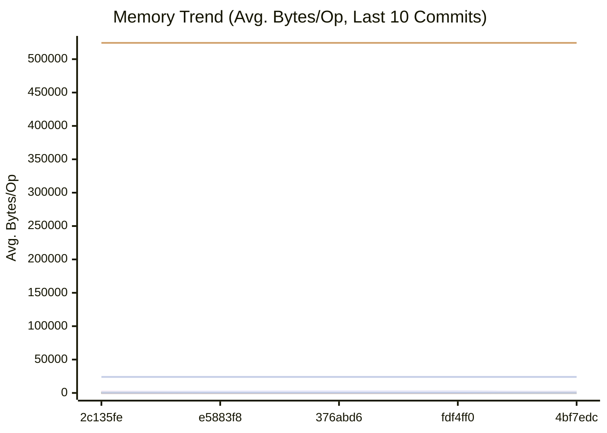
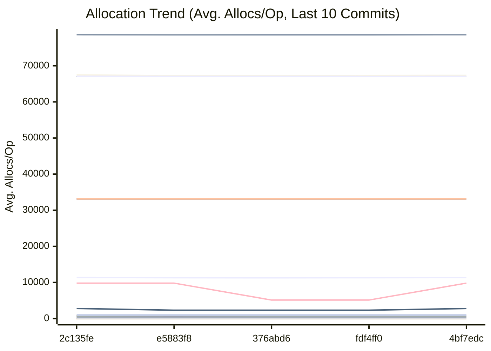

# Performance Benchmarks

This document tracks benchmark performance across commits. The section between
the `BENCHMARK_RESULTS_START/END` markers is auto-generated by the pre-commit
hook; the crypto/OPRF section below is manually maintained.

## How to Read This Document

- **Comparison with previous commit**: `benchstat` output comparing the current
  commit against the previous one. Three tables: **sec/op** (time per operation),
  **B/op** (bytes allocated), **allocs/op** (heap allocations). In each table,
  **lower is better**. `+X%` = regression, `-X%` = improvement, `~` = no
  statistically significant change. `p` is the p-value (p < 0.05 = significant).
- **Latest Benchmark Results**: Single-snapshot table of the current commit's
  averages. Lower values are better across all three columns.
- **Performance Trend plot**: X-axis = commit SHA (left = older, right = newer).
  Y-axis = avg time in ns/op. **Lower lines = faster.** Downward trends are
  improvements; upward spikes are regressions.
- **Memory Trend plot**: Same axes, but Y-axis = avg bytes allocated per op.
  **Lower lines = less memory.** Drops indicate allocation reductions.
- **Allocation Trend plot**: Same axes, but Y-axis = avg heap allocations per op.
  **Lower lines = fewer allocations.** Fewer allocs = less GC pressure.

<!-- BENCHMARK_RESULTS_START -->
## Performance

This section is automatically updated by the pre-commit hook (via .github/scripts/update_readme_with_benchmarks.sh).

### Comparison with previous commit

Each table compares the previous commit (left) to the current commit (right).
**Lower is better** in all three tables. `+X%` = regression, `-X%` = improvement,
`~` = no statistically significant change (p >= 0.05).

- **sec/op**: Time per operation (nanoseconds). Measures raw speed.
- **B/op**: Bytes allocated on the heap per operation. Measures memory usage.
- **allocs/op**: Number of heap allocations per operation. Measures GC pressure.

```
                                      │ /tmp/old_bench_filtered.txt │      /tmp/new_bench_filtered.txt      │
                                      │           sec/op            │    sec/op      vs base                │
CrushOriginal-8                                        699.4n ± ∞ ¹    646.3n ± ∞ ¹       ~ (p=1.000 n=1) ²
Placement-8                                            7.453µ ± ∞ ¹    7.406µ ± ∞ ¹       ~ (p=1.000 n=1) ²
PlacementDomainSpread-8                                7.811µ ± ∞ ¹    7.868µ ± ∞ ¹       ~ (p=1.000 n=1) ²
CrushOptimized-8                                       404.8n ± ∞ ¹    484.6n ± ∞ ¹       ~ (p=1.000 n=1) ²
LoadGlobalConfig-8                                     15.10µ ± ∞ ¹    13.49µ ± ∞ ¹       ~ (p=1.000 n=1) ²
HashBytes/1MiB-8                                       5.548m ± ∞ ¹    5.240m ± ∞ ¹       ~ (p=1.000 n=1) ²
HashBytes/64MiB-8                                      341.9m ± ∞ ¹    357.7m ± ∞ ¹       ~ (p=1.000 n=1) ²
HashBytes/256MiB-8                                      1.151 ± ∞ ¹     1.206 ± ∞ ¹       ~ (p=1.000 n=1) ²
HashFile/1MiB-8                                        5.183m ± ∞ ¹    5.520m ± ∞ ¹       ~ (p=1.000 n=1) ²
HashFile/64MiB-8                                       289.2m ± ∞ ¹    345.9m ± ∞ ¹       ~ (p=1.000 n=1) ²
HashFile/256MiB-8                                       1.167 ± ∞ ¹     1.389 ± ∞ ¹       ~ (p=1.000 n=1) ²
PadString-8                                            63.65n ± ∞ ¹    70.39n ± ∞ ¹       ~ (p=1.000 n=1) ²
SanitizeLog/Safe-8                                     282.7n ± ∞ ¹    316.2n ± ∞ ¹       ~ (p=1.000 n=1) ²
SanitizeLog/Unsafe-8                                   1.039µ ± ∞ ¹    1.170µ ± ∞ ¹       ~ (p=1.000 n=1) ²
AWSChunkedReaderSigned-8                               522.8µ ± ∞ ¹    619.2µ ± ∞ ¹       ~ (p=1.000 n=1) ²
AWSChunkedReaderUnsigned-8                             604.5µ ± ∞ ¹    664.0µ ± ∞ ¹       ~ (p=1.000 n=1) ²
LastModifiedHeader_AppendFormat-8                      344.8n ± ∞ ¹    364.1n ± ∞ ¹       ~ (p=1.000 n=1) ²
LastModifiedHeader_Format-8                            393.7n ± ∞ ¹    431.0n ± ∞ ¹       ~ (p=1.000 n=1) ²
FormatListObjectsV2XML_AppendFormat-8                  912.0µ ± ∞ ¹   1056.5µ ± ∞ ¹       ~ (p=1.000 n=1) ²
FormatListObjectsV2XML_OldFormat-8                     554.3µ ± ∞ ¹    546.0µ ± ∞ ¹       ~ (p=1.000 n=1) ²
CheckMetricsAndSwap-8                                  10.29n ± ∞ ¹    10.06n ± ∞ ¹       ~ (p=1.000 n=1) ²
IndexSearch-8                                          3.358n ± ∞ ¹    3.964n ± ∞ ¹       ~ (p=1.000 n=1) ²
IndexDirectTracking-8                                 0.5054n ± ∞ ¹   0.5319n ± ∞ ¹       ~ (p=1.000 n=1) ²
LocalWrite/1MiB-8                                      525.5µ ± ∞ ¹    577.0µ ± ∞ ¹       ~ (p=1.000 n=1) ²
LocalWrite/64MiB-8                                     35.54m ± ∞ ¹    33.12m ± ∞ ¹       ~ (p=1.000 n=1) ²
LocalWrite/256MiB-8                                    128.6m ± ∞ ¹    128.7m ± ∞ ¹       ~ (p=1.000 n=1) ²
ReadVerify/1MiB-8                                      4.723m ± ∞ ¹    4.601m ± ∞ ¹       ~ (p=1.000 n=1) ²
ReadVerify/64MiB-8                                     334.3m ± ∞ ¹    343.5m ± ∞ ¹       ~ (p=1.000 n=1) ²
ReadVerify/256MiB-8                                     1.431 ± ∞ ¹     1.375 ± ∞ ¹       ~ (p=1.000 n=1) ²
TrustedRead/1MiB-8                                     6.033m ± ∞ ¹    6.124m ± ∞ ¹       ~ (p=1.000 n=1) ²
TrustedRead/64MiB-8                                    387.6m ± ∞ ¹    411.4m ± ∞ ¹       ~ (p=1.000 n=1) ²
TrustedRead/256MiB-8                                    1.132 ± ∞ ¹     1.327 ± ∞ ¹       ~ (p=1.000 n=1) ²
S3PutSpool/1MiB-8                                      6.180m ± ∞ ¹    6.697m ± ∞ ¹       ~ (p=1.000 n=1) ²
S3PutSpool/64MiB-8                                     388.9m ± ∞ ¹    382.2m ± ∞ ¹       ~ (p=1.000 n=1) ²
S3PutSpool/256MiB-8                                     1.567 ± ∞ ¹     1.767 ± ∞ ¹       ~ (p=1.000 n=1) ²
geomean                                                441.2µ          465.9µ        +5.60%
¹ need >= 6 samples for confidence interval at level 0.95
² need >= 4 samples to detect a difference at alpha level 0.05

                                      │ /tmp/old_bench_filtered.txt │      /tmp/new_bench_filtered.txt      │
                                      │            B/op             │     B/op       vs base                │
CrushOriginal-8                                         164.0 ± ∞ ¹     164.0 ± ∞ ¹       ~ (p=1.000 n=1) ²
Placement-8                                             352.0 ± ∞ ¹     352.0 ± ∞ ¹       ~ (p=1.000 n=1) ²
PlacementDomainSpread-8                                 352.0 ± ∞ ¹     352.0 ± ∞ ¹       ~ (p=1.000 n=1) ²
CrushOptimized-8                                        0.000 ± ∞ ¹     0.000 ± ∞ ¹       ~ (p=1.000 n=1) ²
LoadGlobalConfig-8                                    1.930Ki ± ∞ ¹   1.930Ki ± ∞ ¹       ~ (p=1.000 n=1) ²
HashBytes/1MiB-8                                        64.00 ± ∞ ¹     64.00 ± ∞ ¹       ~ (p=1.000 n=1) ²
HashBytes/64MiB-8                                       64.00 ± ∞ ¹     64.00 ± ∞ ¹       ~ (p=1.000 n=1) ²
HashBytes/256MiB-8                                      64.00 ± ∞ ¹     64.00 ± ∞ ¹       ~ (p=1.000 n=1) ²
HashFile/1MiB-8                                       32.35Ki ± ∞ ¹   32.35Ki ± ∞ ¹       ~ (p=1.000 n=1) ²
HashFile/64MiB-8                                      32.35Ki ± ∞ ¹   32.35Ki ± ∞ ¹       ~ (p=1.000 n=1) ²
HashFile/256MiB-8                                     32.35Ki ± ∞ ¹   32.35Ki ± ∞ ¹       ~ (p=1.000 n=1) ²
PadString-8                                             64.00 ± ∞ ¹     64.00 ± ∞ ¹       ~ (p=1.000 n=1) ²
SanitizeLog/Safe-8                                      0.000 ± ∞ ¹     0.000 ± ∞ ¹       ~ (p=1.000 n=1) ²
SanitizeLog/Unsafe-8                                    704.0 ± ∞ ¹     704.0 ± ∞ ¹       ~ (p=1.000 n=1) ²
AWSChunkedReaderSigned-8                              11.04Ki ± ∞ ¹   11.07Ki ± ∞ ¹       ~ (p=1.000 n=1) ³
AWSChunkedReaderUnsigned-8                            76.74Ki ± ∞ ¹   76.77Ki ± ∞ ¹       ~ (p=1.000 n=1) ³
LastModifiedHeader_AppendFormat-8                       0.000 ± ∞ ¹     0.000 ± ∞ ¹       ~ (p=1.000 n=1) ²
LastModifiedHeader_Format-8                             32.00 ± ∞ ¹     32.00 ± ∞ ¹       ~ (p=1.000 n=1) ²
FormatListObjectsV2XML_AppendFormat-8                 512.2Ki ± ∞ ¹   512.2Ki ± ∞ ¹       ~ (p=1.000 n=1) ³
FormatListObjectsV2XML_OldFormat-8                    23.44Ki ± ∞ ¹   23.44Ki ± ∞ ¹       ~ (p=1.000 n=1) ²
CheckMetricsAndSwap-8                                   0.000 ± ∞ ¹     0.000 ± ∞ ¹       ~ (p=1.000 n=1) ²
IndexSearch-8                                           0.000 ± ∞ ¹     0.000 ± ∞ ¹       ~ (p=1.000 n=1) ²
IndexDirectTracking-8                                   0.000 ± ∞ ¹     0.000 ± ∞ ¹       ~ (p=1.000 n=1) ²
LocalWrite/1MiB-8                                     65.46Ki ± ∞ ¹   65.46Ki ± ∞ ¹       ~ (p=1.000 n=1) ³
LocalWrite/64MiB-8                                    65.50Ki ± ∞ ¹   65.51Ki ± ∞ ¹       ~ (p=1.000 n=1) ³
LocalWrite/256MiB-8                                   65.84Ki ± ∞ ¹   65.80Ki ± ∞ ¹       ~ (p=1.000 n=1) ³
ReadVerify/1MiB-8                                       467.0 ± ∞ ¹     468.0 ± ∞ ¹       ~ (p=1.000 n=1) ³
ReadVerify/64MiB-8                                    2.711Ki ± ∞ ¹   3.474Ki ± ∞ ¹       ~ (p=1.000 n=1) ³
ReadVerify/256MiB-8                                   9.578Ki ± ∞ ¹   9.578Ki ± ∞ ¹       ~ (p=1.000 n=1) ²
TrustedRead/1MiB-8                                      800.0 ± ∞ ¹     800.0 ± ∞ ¹       ~ (p=1.000 n=1) ²
TrustedRead/64MiB-8                                     800.0 ± ∞ ¹     800.0 ± ∞ ¹       ~ (p=1.000 n=1) ²
TrustedRead/256MiB-8                                    800.0 ± ∞ ¹     800.0 ± ∞ ¹       ~ (p=1.000 n=1) ²
S3PutSpool/1MiB-8                                       447.0 ± ∞ ¹     447.0 ± ∞ ¹       ~ (p=1.000 n=1) ²
S3PutSpool/64MiB-8                                      448.0 ± ∞ ¹     448.0 ± ∞ ¹       ~ (p=1.000 n=1) ²
S3PutSpool/256MiB-8                                     448.0 ± ∞ ¹     448.0 ± ∞ ¹       ~ (p=1.000 n=1) ²
geomean                                                           ⁴                  +0.72%               ⁴
¹ need >= 6 samples for confidence interval at level 0.95
² all samples are equal
³ need >= 4 samples to detect a difference at alpha level 0.05
⁴ summaries must be >0 to compute geomean

                                      │ /tmp/old_bench_filtered.txt │     /tmp/new_bench_filtered.txt      │
                                      │          allocs/op          │  allocs/op    vs base                │
CrushOriginal-8                                         3.000 ± ∞ ¹    3.000 ± ∞ ¹       ~ (p=1.000 n=1) ²
Placement-8                                             6.000 ± ∞ ¹    6.000 ± ∞ ¹       ~ (p=1.000 n=1) ²
PlacementDomainSpread-8                                 6.000 ± ∞ ¹    6.000 ± ∞ ¹       ~ (p=1.000 n=1) ²
CrushOptimized-8                                        0.000 ± ∞ ¹    0.000 ± ∞ ¹       ~ (p=1.000 n=1) ²
LoadGlobalConfig-8                                      58.00 ± ∞ ¹    58.00 ± ∞ ¹       ~ (p=1.000 n=1) ²
HashBytes/1MiB-8                                        1.000 ± ∞ ¹    1.000 ± ∞ ¹       ~ (p=1.000 n=1) ²
HashBytes/64MiB-8                                       1.000 ± ∞ ¹    1.000 ± ∞ ¹       ~ (p=1.000 n=1) ²
HashBytes/256MiB-8                                      1.000 ± ∞ ¹    1.000 ± ∞ ¹       ~ (p=1.000 n=1) ²
HashFile/1MiB-8                                         6.000 ± ∞ ¹    6.000 ± ∞ ¹       ~ (p=1.000 n=1) ²
HashFile/64MiB-8                                        6.000 ± ∞ ¹    6.000 ± ∞ ¹       ~ (p=1.000 n=1) ²
HashFile/256MiB-8                                       6.000 ± ∞ ¹    6.000 ± ∞ ¹       ~ (p=1.000 n=1) ²
PadString-8                                             1.000 ± ∞ ¹    1.000 ± ∞ ¹       ~ (p=1.000 n=1) ²
SanitizeLog/Safe-8                                      0.000 ± ∞ ¹    0.000 ± ∞ ¹       ~ (p=1.000 n=1) ²
SanitizeLog/Unsafe-8                                    1.000 ± ∞ ¹    1.000 ± ∞ ¹       ~ (p=1.000 n=1) ²
AWSChunkedReaderSigned-8                                80.00 ± ∞ ¹    80.00 ± ∞ ¹       ~ (p=1.000 n=1) ²
AWSChunkedReaderUnsigned-8                              15.00 ± ∞ ¹    15.00 ± ∞ ¹       ~ (p=1.000 n=1) ²
LastModifiedHeader_AppendFormat-8                       0.000 ± ∞ ¹    0.000 ± ∞ ¹       ~ (p=1.000 n=1) ²
LastModifiedHeader_Format-8                             1.000 ± ∞ ¹    1.000 ± ∞ ¹       ~ (p=1.000 n=1) ²
FormatListObjectsV2XML_AppendFormat-8                   16.00 ± ∞ ¹    16.00 ± ∞ ¹       ~ (p=1.000 n=1) ²
FormatListObjectsV2XML_OldFormat-8                     1.000k ± ∞ ¹   1.000k ± ∞ ¹       ~ (p=1.000 n=1) ²
CheckMetricsAndSwap-8                                   0.000 ± ∞ ¹    0.000 ± ∞ ¹       ~ (p=1.000 n=1) ²
IndexSearch-8                                           0.000 ± ∞ ¹    0.000 ± ∞ ¹       ~ (p=1.000 n=1) ²
IndexDirectTracking-8                                   0.000 ± ∞ ¹    0.000 ± ∞ ¹       ~ (p=1.000 n=1) ²
LocalWrite/1MiB-8                                       18.00 ± ∞ ¹    18.00 ± ∞ ¹       ~ (p=1.000 n=1) ²
LocalWrite/64MiB-8                                      18.00 ± ∞ ¹    18.00 ± ∞ ¹       ~ (p=1.000 n=1) ²
LocalWrite/256MiB-8                                     20.00 ± ∞ ¹    20.00 ± ∞ ¹       ~ (p=1.000 n=1) ²
ReadVerify/1MiB-8                                       6.000 ± ∞ ¹    6.000 ± ∞ ¹       ~ (p=1.000 n=1) ²
ReadVerify/64MiB-8                                      7.000 ± ∞ ¹    7.000 ± ∞ ¹       ~ (p=1.000 n=1) ²
ReadVerify/256MiB-8                                     10.00 ± ∞ ¹    10.00 ± ∞ ¹       ~ (p=1.000 n=1) ²
TrustedRead/1MiB-8                                      11.00 ± ∞ ¹    11.00 ± ∞ ¹       ~ (p=1.000 n=1) ²
TrustedRead/64MiB-8                                     11.00 ± ∞ ¹    11.00 ± ∞ ¹       ~ (p=1.000 n=1) ²
TrustedRead/256MiB-8                                    11.00 ± ∞ ¹    11.00 ± ∞ ¹       ~ (p=1.000 n=1) ²
S3PutSpool/1MiB-8                                       10.00 ± ∞ ¹    10.00 ± ∞ ¹       ~ (p=1.000 n=1) ²
S3PutSpool/64MiB-8                                      10.00 ± ∞ ¹    10.00 ± ∞ ¹       ~ (p=1.000 n=1) ²
S3PutSpool/256MiB-8                                     10.00 ± ∞ ¹    10.00 ± ∞ ¹       ~ (p=1.000 n=1) ²
geomean                                                           ³                 +0.00%               ³
¹ need >= 6 samples for confidence interval at level 0.95
² all samples are equal
³ summaries must be >0 to compute geomean

                           │ /tmp/old_bench_filtered.txt │      /tmp/new_bench_filtered.txt      │
                           │             B/s             │      B/s       vs base                │
HashBytes/1MiB-8                           180.3Mi ± ∞ ¹   190.8Mi ± ∞ ¹       ~ (p=1.000 n=1) ²
HashBytes/64MiB-8                          187.2Mi ± ∞ ¹   178.9Mi ± ∞ ¹       ~ (p=1.000 n=1) ²
HashBytes/256MiB-8                         222.5Mi ± ∞ ¹   212.2Mi ± ∞ ¹       ~ (p=1.000 n=1) ²
HashFile/1MiB-8                            192.9Mi ± ∞ ¹   181.2Mi ± ∞ ¹       ~ (p=1.000 n=1) ²
HashFile/64MiB-8                           221.3Mi ± ∞ ¹   185.0Mi ± ∞ ¹       ~ (p=1.000 n=1) ²
HashFile/256MiB-8                          219.4Mi ± ∞ ¹   184.4Mi ± ∞ ¹       ~ (p=1.000 n=1) ²
AWSChunkedReaderSigned-8                   121.4Mi ± ∞ ¹   102.5Mi ± ∞ ¹       ~ (p=1.000 n=1) ²
AWSChunkedReaderUnsigned-8                105.01Mi ± ∞ ¹   95.60Mi ± ∞ ¹       ~ (p=1.000 n=1) ²
LocalWrite/1MiB-8                          1.858Gi ± ∞ ¹   1.692Gi ± ∞ ¹       ~ (p=1.000 n=1) ²
LocalWrite/64MiB-8                         1.758Gi ± ∞ ¹   1.887Gi ± ∞ ¹       ~ (p=1.000 n=1) ²
LocalWrite/256MiB-8                        1.944Gi ± ∞ ¹   1.942Gi ± ∞ ¹       ~ (p=1.000 n=1) ²
ReadVerify/1MiB-8                          211.7Mi ± ∞ ¹   217.4Mi ± ∞ ¹       ~ (p=1.000 n=1) ²
ReadVerify/64MiB-8                         191.5Mi ± ∞ ¹   186.3Mi ± ∞ ¹       ~ (p=1.000 n=1) ²
ReadVerify/256MiB-8                        178.9Mi ± ∞ ¹   186.2Mi ± ∞ ¹       ~ (p=1.000 n=1) ²
TrustedRead/1MiB-8                         165.8Mi ± ∞ ¹   163.3Mi ± ∞ ¹       ~ (p=1.000 n=1) ²
TrustedRead/64MiB-8                        165.1Mi ± ∞ ¹   155.6Mi ± ∞ ¹       ~ (p=1.000 n=1) ²
TrustedRead/256MiB-8                       226.2Mi ± ∞ ¹   192.9Mi ± ∞ ¹       ~ (p=1.000 n=1) ²
S3PutSpool/1MiB-8                          161.8Mi ± ∞ ¹   149.3Mi ± ∞ ¹       ~ (p=1.000 n=1) ²
S3PutSpool/64MiB-8                         164.6Mi ± ∞ ¹   167.5Mi ± ∞ ¹       ~ (p=1.000 n=1) ²
S3PutSpool/256MiB-8                        163.3Mi ± ∞ ¹   144.9Mi ± ∞ ¹       ~ (p=1.000 n=1) ²
geomean                                    253.4Mi         239.7Mi        -5.43%
¹ need >= 6 samples for confidence interval at level 0.95
² need >= 4 samples to detect a difference at alpha level 0.05
```

### Latest Benchmark Results

Single-snapshot of the current commit's averages. **Lower is better** across all
three columns: time (speed), bytes (memory), allocs (GC pressure).


| Benchmark | Avg. Time/Op | Avg. Bytes/Op | Avg. Allocs/Op |
|-----------|--------------|---------------|----------------|
| BenchmarkAWSChunkedReaderSigned-8 | 619200.00 ns/op | 107.49 B/op | 11334.00 allocs/op |
| BenchmarkAWSChunkedReaderUnsigned-8 | 664009.00 ns/op | 100.24 B/op | 78611.00 allocs/op |
| BenchmarkCheckMetricsAndSwap-8 | 10.06 ns/op | 0.00 B/op | 0.00 allocs/op |
| BenchmarkCrushOptimized-8 | 484.60 ns/op | 0.00 B/op | 0.00 allocs/op |
| BenchmarkCrushOriginal-8 | 646.30 ns/op | 164.00 B/op | 3.00 allocs/op |
| BenchmarkFormatListObjectsV2XML_AppendFormat-8 | 1056478.00 ns/op | 524500.00 B/op | 16.00 allocs/op |
| BenchmarkFormatListObjectsV2XML_OldFormat-8 | 545961.00 ns/op | 24000.00 B/op | 1000.00 allocs/op |
| BenchmarkHashBytes/1MiB-8 | 5240058.00 ns/op | 200.11 B/op | 64.00 allocs/op |
| BenchmarkHashBytes/256MiB-8 | 1206314796.00 ns/op | 222.53 B/op | 64.00 allocs/op |
| BenchmarkHashBytes/64MiB-8 | 357748084.00 ns/op | 187.59 B/op | 64.00 allocs/op |
| BenchmarkHashFile/1MiB-8 | 5520031.00 ns/op | 189.96 B/op | 33128.00 allocs/op |
| BenchmarkHashFile/256MiB-8 | 1388569817.00 ns/op | 193.32 B/op | 33128.00 allocs/op |
| BenchmarkHashFile/64MiB-8 | 345945889.00 ns/op | 193.99 B/op | 33128.00 allocs/op |
| BenchmarkIndexDirectTracking-8 | 0.53 ns/op | 0.00 B/op | 0.00 allocs/op |
| BenchmarkIndexSearch-8 | 3.96 ns/op | 0.00 B/op | 0.00 allocs/op |
| BenchmarkLastModifiedHeader_AppendFormat-8 | 364.10 ns/op | 0.00 B/op | 0.00 allocs/op |
| BenchmarkLastModifiedHeader_Format-8 | 431.00 ns/op | 32.00 B/op | 1.00 allocs/op |
| BenchmarkLoadGlobalConfig-8 | 13488.00 ns/op | 1976.00 B/op | 58.00 allocs/op |
| BenchmarkLocalWrite/1MiB-8 | 577002.00 ns/op | 1817.28 B/op | 67034.00 allocs/op |
| BenchmarkLocalWrite/256MiB-8 | 128702495.00 ns/op | 2085.71 B/op | 67379.00 allocs/op |
| BenchmarkLocalWrite/64MiB-8 | 33119476.00 ns/op | 2026.27 B/op | 67087.00 allocs/op |
| BenchmarkPadString-8 | 70.39 ns/op | 64.00 B/op | 1.00 allocs/op |
| BenchmarkPlacement-8 | 7406.00 ns/op | 352.00 B/op | 6.00 allocs/op |
| BenchmarkPlacementDomainSpread-8 | 7868.00 ns/op | 352.00 B/op | 6.00 allocs/op |
| BenchmarkReadVerify/1MiB-8 | 4600918.00 ns/op | 227.91 B/op | 468.00 allocs/op |
| BenchmarkReadVerify/256MiB-8 | 1374887457.00 ns/op | 195.24 B/op | 9808.00 allocs/op |
| BenchmarkReadVerify/64MiB-8 | 343492740.00 ns/op | 195.37 B/op | 3557.00 allocs/op |
| BenchmarkS3PutSpool/1MiB-8 | 6697030.00 ns/op | 156.57 B/op | 447.00 allocs/op |
| BenchmarkS3PutSpool/256MiB-8 | 1766547568.00 ns/op | 151.95 B/op | 448.00 allocs/op |
| BenchmarkS3PutSpool/64MiB-8 | 382189999.00 ns/op | 175.59 B/op | 448.00 allocs/op |
| BenchmarkSanitizeLog/Safe-8 | 316.20 ns/op | 0.00 B/op | 0.00 allocs/op |
| BenchmarkSanitizeLog/Unsafe-8 | 1170.00 ns/op | 704.00 B/op | 1.00 allocs/op |
| BenchmarkTrustedRead/1MiB-8 | 6124228.00 ns/op | 171.22 B/op | 800.00 allocs/op |
| BenchmarkTrustedRead/256MiB-8 | 1326976357.00 ns/op | 202.29 B/op | 800.00 allocs/op |
| BenchmarkTrustedRead/64MiB-8 | 411444369.00 ns/op | 163.11 B/op | 800.00 allocs/op |


### Performance History

**Legend**

| Color | Benchmark | Description |
|---|---|---|
| 🟢 | CheckMetricsAndSwap | Evaluation of system metrics (CPU/Mem) and mode switching logic |
| 🟤 | CrushOriginal | Original Sage Weil's CRUSH placement algorithm using reflection and float math |
| ⚪ | CrushOptimized | Performance-tuned CRUSH-lite placement algorithm using bitwise shifts and integer math (Rule 19) |
| 🔵 | IndexDirectTracking | Accessing current replication mode via direct slice index (O(1)) |
| 🔴 | IndexSearch | Searching for current replication mode in the order slice using `slices.Index` |
| 🟠 | LoadGlobalConfig | Parsing and loading the `[global]` section from the INI configuration |
| 🟣 | PadString | Padding strings with null characters to a fixed protocol length |
| 🟡 | ParseReplicationOrder | Parsing the CSV-formatted replication order string into an integer slice |

#### Time per Operation (ns/op)

X-axis: commit SHA (left = older, right = newer). Y-axis: avg time in ns/op.
**Lower lines = faster code.** Downward trends are improvements; upward spikes
are regressions to investigate.


```mermaid
xychart-beta
    title "Performance Trend (Avg. Time, Last 10 Commits)"
    x-axis "Commit"
    y-axis "Avg. Time (ns/op)"
    x-axis [2c135fe,e5883f8,376abd6,fdf4ff0,4bf7edc]
    line "AWSChunkedReaderSigned" [758672,413086,397685,535625,618041,521824,584439,539275,522839,619200]
    line "AWSChunkedReaderUnsigned" [672192,414070,405982,479460,573661,451522,611665,550355,604498,664009]
    line "CheckMetricsAndSwap" [15,8,7,10,10,17,10,11,10,10]
    line "CrushOptimized" [348,300,328,320,458,539,432,471,405,485]
    line "CrushOriginal" [500,425,443,407,633,730,712,650,699,646]
    line "FormatListObjectsV2XML_AppendFormat" [915187,583023,566690,627648,848928,1046717,799795,1039816,911991,1056478]
    line "FormatListObjectsV2XML_OldFormat" [678624,365879,366636,408457,535755,745142,464905,458449,554255,545961]
    line "HashBytes/1MiB" [3553145,3949669,3443981,3592333,5110585,4751175,5064237,4383380,5547571,5240058]
    line "HashBytes/256MiB" [1044551719,953557308,880098861,925707610,1174333367,1221858506,1419279092,1145420213,1150583944,1206314796]
    line "HashBytes/64MiB" [225326458,239330627,209418782,242948441,297766074,317593619,355000134,315394868,341933076,357748084]
    line "HashFile/1MiB" [4389479,3364281,3842035,3350950,4950193,5129547,5747827,5999828,5183292,5520031]
    line "HashFile/256MiB" [1035601414,793044431,881918242,1015211606,1319192441,1310601572,1273023822,1457159370,1166573869,1388569817]
    line "HashFile/64MiB" [248823362,200009250,249484580,207167851,333549904,329592825,282613785,330397537,289173153,345945889]
    line "IndexDirectTracking" [1,0,0,0,1,1,0,0,1,1]
    line "IndexSearch" [3,2,2,2,2,5,4,3,3,4]
    line "LastModifiedHeader_AppendFormat" [327,200,185,228,286,252,340,415,345,364]
    line "LastModifiedHeader_Format" [540,279,262,285,385,350,398,514,394,431]
    line "LoadGlobalConfig" [10458,9205,9952,8921,13356,14511,16366,13776,15095,13488]
    line "LocalWrite/1MiB" [817681,719361,445767,431598,526423,795470,552166,778898,525512,577002]
    line "LocalWrite/256MiB" [158044809,120298309,94142106,100079806,126435842,151118283,121284509,138380852,128601282,128702495]
    line "LocalWrite/64MiB" [34833751,27951923,24072639,25874779,32839259,53059327,32531111,36029215,35542782,33119476]
    line "PadString" [58,41,57,53,71,49,70,69,64,70]
    line "ParseReplicationOrder_NoPrealloc" [350,349,357,354,345,225,229,165,232,234]
    line "ParseReplicationOrder_Prealloc" [229,231,237,234,229,108,107,80,110,109]
    line "Placement" [5825,4876,5168,4621,6718,8505,7344,6922,7453,7406]
    line "PlacementDomainSpread" [6405,5139,5453,5023,6553,8563,7236,7465,7811,7868]
    line "ReadVerify/1MiB" [6081724,3136229,3798416,3596845,4460850,5088522,3970325,4753309,4723356,4600918]
    line "ReadVerify/256MiB" [1411104961,1000738329,803259188,883417974,1244837167,1337973310,1152182050,1249327431,1431247520,1374887457]
    line "ReadVerify/64MiB" [335838061,214326196,232435503,273582930,405518693,335223998,288365836,309264832,334268234,343492740]
    line "S3PutSpool/1MiB" [6562486,3791252,4349655,4494504,5795780,6486611,5066289,6659391,6179992,6697030]
    line "S3PutSpool/256MiB" [1140637754,1085496919,1054828608,1041459785,1474423367,1414994967,1327631659,1627622695,1567298391,1766547568]
    line "S3PutSpool/64MiB" [378241377,245496530,292024160,277039985,384356699,395378107,282251478,366146558,388891982,382189999]
    line "SanitizeLog/Safe" [286,227,233,295,361,256,386,270,283,316]
    line "SanitizeLog/Unsafe" [1495,681,684,922,1091,801,1163,1016,1039,1170]
    line "TrustedRead/1MiB" [3669866,3527534,3390683,4063744,6459603,5688219,4848751,4607932,6032847,6124228]
    line "TrustedRead/256MiB" [1648511504,887056660,864337055,941546678,1440831398,1532603475,1223453299,1410403058,1131933188,1326976357]
    line "TrustedRead/64MiB" [338500502,217741152,228835469,245169178,333995810,418960245,336501521,296487000,387555406,411444369]
```

#### Memory per Operation (B/op)

X-axis: commit SHA. Y-axis: avg bytes allocated per op.
**Lower lines = less memory.** Drops indicate allocation reductions.


```mermaid
xychart-beta
    title "Memory Trend (Avg. Bytes/Op, Last 10 Commits)"
    x-axis "Commit"
    y-axis "Avg. Bytes/Op"
    x-axis [2c135fe,e5883f8,376abd6,fdf4ff0,4bf7edc]
    line "AWSChunkedReaderSigned" [88,161,167,124,108,128,114,123,127,107]
    line "AWSChunkedReaderUnsigned" [99,161,164,139,116,147,109,121,110,100]
    line "CheckMetricsAndSwap" [0,0,0,0,0,0,0,0,0,0]
    line "CrushOptimized" [0,0,0,0,0,0,0,0,0,0]
    line "CrushOriginal" [164,164,164,164,164,164,164,164,164,164]
    line "FormatListObjectsV2XML_AppendFormat" [524455,524439,524442,524446,524462,524483,524463,524491,524477,524500]
    line "FormatListObjectsV2XML_OldFormat" [24000,24000,24000,24000,24000,24000,24000,24000,24000,24000]
    line "HashBytes/1MiB" [295,265,304,292,205,221,207,239,189,200]
    line "HashBytes/256MiB" [257,282,305,290,229,220,189,234,233,223]
    line "HashBytes/64MiB" [298,280,320,276,225,211,189,213,196,188]
    line "HashFile/1MiB" [239,312,273,313,212,204,182,175,202,190]
    line "HashFile/256MiB" [259,338,304,264,203,205,211,184,230,193]
    line "HashFile/64MiB" [270,336,269,324,201,204,237,203,232,194]
    line "IndexDirectTracking" [0,0,0,0,0,0,0,0,0,0]
    line "IndexSearch" [0,0,0,0,0,0,0,0,0,0]
    line "LastModifiedHeader_AppendFormat" [0,0,0,0,0,0,0,0,0,0]
    line "LastModifiedHeader_Format" [32,32,32,32,32,32,32,32,32,32]
    line "LoadGlobalConfig" [1976,1976,1976,1976,1976,1976,1976,1976,1976,1976]
    line "LocalWrite/1MiB" [1282,1458,2352,2430,1992,1318,1899,1346,1995,1817]
    line "LocalWrite/256MiB" [1698,2231,2851,2682,2123,1776,2213,1940,2087,2086]
    line "LocalWrite/64MiB" [1927,2401,2788,2594,2044,1265,2063,1863,1888,2026]
    line "PadString" [64,64,64,64,64,64,64,64,64,64]
    line "ParseReplicationOrder_NoPrealloc" [408,408,408,408,408,248,248,248,248,248]
    line "ParseReplicationOrder_Prealloc" [240,240,240,240,240,80,80,80,80,80]
    line "Placement" [352,352,352,352,352,352,352,352,352,352]
    line "PlacementDomainSpread" [352,352,352,352,352,352,352,352,352,352]
    line "ReadVerify/1MiB" [172,334,276,292,235,206,264,221,222,228]
    line "ReadVerify/256MiB" [190,268,334,304,216,201,233,215,188,195]
    line "ReadVerify/64MiB" [200,313,289,245,165,200,233,217,201,195]
    line "S3PutSpool/1MiB" [160,277,241,233,181,162,207,157,170,157]
    line "S3PutSpool/256MiB" [235,247,254,258,182,190,202,165,171,152]
    line "S3PutSpool/64MiB" [177,273,230,242,175,170,238,183,173,176]
    line "SanitizeLog/Safe" [0,0,0,0,0,0,0,0,0,0]
    line "SanitizeLog/Unsafe" [704,704,704,704,704,704,704,704,704,704]
    line "TrustedRead/1MiB" [286,297,309,258,162,184,216,228,174,171]
    line "TrustedRead/256MiB" [163,303,311,285,186,175,219,190,237,202]
    line "TrustedRead/64MiB" [198,308,293,274,201,160,199,226,173,163]
```

#### Allocations per Operation (allocs/op)

X-axis: commit SHA. Y-axis: avg heap allocations per op.
**Lower lines = fewer allocations.** Fewer allocs = less GC pressure.


```mermaid
xychart-beta
    title "Allocation Trend (Avg. Allocs/Op, Last 10 Commits)"
    x-axis "Commit"
    y-axis "Avg. Allocs/Op"
    x-axis [2c135fe,e5883f8,376abd6,fdf4ff0,4bf7edc]
    line "AWSChunkedReaderSigned" [11352,11288,11282,11307,11314,11300,11307,11302,11307,11334]
    line "AWSChunkedReaderUnsigned" [78609,78561,78569,78579,78587,78576,78613,78584,78583,78611]
    line "CheckMetricsAndSwap" [0,0,0,0,0,0,0,0,0,0]
    line "CrushOptimized" [0,0,0,0,0,0,0,0,0,0]
    line "CrushOriginal" [3,3,3,3,3,3,3,3,3,3]
    line "FormatListObjectsV2XML_AppendFormat" [16,16,16,16,16,16,16,16,16,16]
    line "FormatListObjectsV2XML_OldFormat" [1000,1000,1000,1000,1000,1000,1000,1000,1000,1000]
    line "HashBytes/1MiB" [64,64,64,64,64,64,64,64,64,64]
    line "HashBytes/256MiB" [64,64,64,64,64,64,64,64,64,64]
    line "HashBytes/64MiB" [64,64,64,64,64,64,64,64,64,64]
    line "HashFile/1MiB" [33128,33128,33128,33128,33128,33128,33128,33128,33128,33128]
    line "HashFile/256MiB" [33128,33128,33128,33128,33128,33128,33128,33128,33128,33128]
    line "HashFile/64MiB" [33128,33128,33128,33128,33128,33128,33128,33128,33128,33128]
    line "IndexDirectTracking" [0,0,0,0,0,0,0,0,0,0]
    line "IndexSearch" [0,0,0,0,0,0,0,0,0,0]
    line "LastModifiedHeader_AppendFormat" [0,0,0,0,0,0,0,0,0,0]
    line "LastModifiedHeader_Format" [1,1,1,1,1,1,1,1,1,1]
    line "LoadGlobalConfig" [58,58,58,58,58,58,58,58,58,58]
    line "LocalWrite/1MiB" [67036,67031,67028,67030,67033,67040,67026,67032,67028,67034]
    line "LocalWrite/256MiB" [67465,67275,67218,67324,67356,67435,67322,67349,67419,67379]
    line "LocalWrite/64MiB" [67103,67070,67080,67067,67089,67097,67084,67096,67074,67087]
    line "PadString" [1,1,1,1,1,1,1,1,1,1]
    line "ParseReplicationOrder_NoPrealloc" [6,6,6,6,6,5,5,5,5,5]
    line "ParseReplicationOrder_Prealloc" [2,2,2,2,2,1,1,1,1,1]
    line "Placement" [6,6,6,6,6,6,6,6,6,6]
    line "PlacementDomainSpread" [6,6,6,6,6,6,6,6,6,6]
    line "ReadVerify/1MiB" [484,458,466,460,436,471,463,468,467,468]
    line "ReadVerify/256MiB" [9808,9808,5120,5120,9808,9808,9808,9808,9808,9808]
    line "ReadVerify/64MiB" [2776,2307,2307,2307,2776,2776,2776,2776,2776,3557]
    line "S3PutSpool/1MiB" [447,447,447,447,447,447,447,447,447,447]
    line "S3PutSpool/256MiB" [448,448,448,448,448,448,448,448,448,448]
    line "S3PutSpool/64MiB" [448,448,448,448,448,448,448,448,448,448]
    line "SanitizeLog/Safe" [0,0,0,0,0,0,0,0,0,0]
    line "SanitizeLog/Unsafe" [1,1,1,1,1,1,1,1,1,1]
    line "TrustedRead/1MiB" [800,827,800,800,800,800,800,800,800,800]
    line "TrustedRead/256MiB" [800,800,800,800,800,848,800,800,800,800]
    line "TrustedRead/64MiB" [800,800,800,800,800,800,800,800,800,800]
```
<!-- BENCHMARK_RESULTS_END -->

### E2EE + OPRF overhead

The sections above are auto-generated and cover the hot-path benchmarks. The
crypto/OPRF work is measured separately; figures below are from `go test -bench`
on the crypto module and are intentionally placed outside the auto-managed block
so they persist.

**Lower is better** across all columns. These benchmarks run on `src/crypto` only
(not tracked in the auto-generated plots above).

| Benchmark | What it measures | Avg. Time/Op | Avg. Bytes/Op | Avg. Allocs/Op |
|-----------|------------------|--------------|---------------|----------------|
| EncryptStream | AES-GCM-256 chunked encryption (64KB input) | ~63 µs | 167 KB | 14 |
| DecryptStream | AES-GCM-256 chunked decryption (64KB input) | ~54 µs | 136 KB | 13 |
| DeriveKey | HKDF-SHA256 key derivation per tenant | ~3.5 µs | 1.3 KB | 18 |
| OPRFCombineThreshold3 | Threshold-3 OPRF combine + unblind (Ristretto255) | ~530 µs | 2.3 KB | 62 |

With `encryption_enabled`, every byte passes through AES-GCM-256 streaming at
~800-1200 MB/s (chunk-bounded memory). The streaming format is **StreamVersion
v4 (issue #824)** with a self-describing chunk size: the default 4096-byte
chunk preserves prior throughput, and the chunk size can be raised/lowered via
`SetStreamChunkSize` within `[512, 4128]` for latency/memory trade-offs without
a wire change in framing beyond the 2-byte header field (v3/v2 blobs still
decode). The threshold OPRF is evaluated **once per
upload/download**, on the dedup tag only (never per chunk):
`OPRFCombineThreshold3` measures a one-time ~0.53 ms client-side combine/unblind
for threshold-3, plus one round-trip per daemon share. This is negligible against
network/disk I/O and does not affect streaming throughput. When `oprf_enabled =
false`, the OPRF path is skipped entirely and behavior is identical to the
pre-OPRF encryption path (backward compatible).
