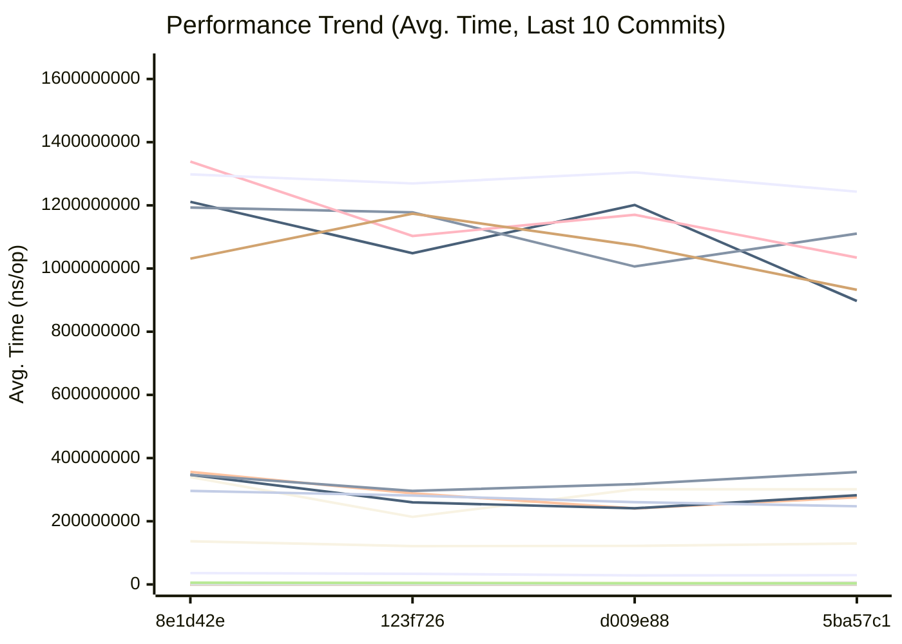
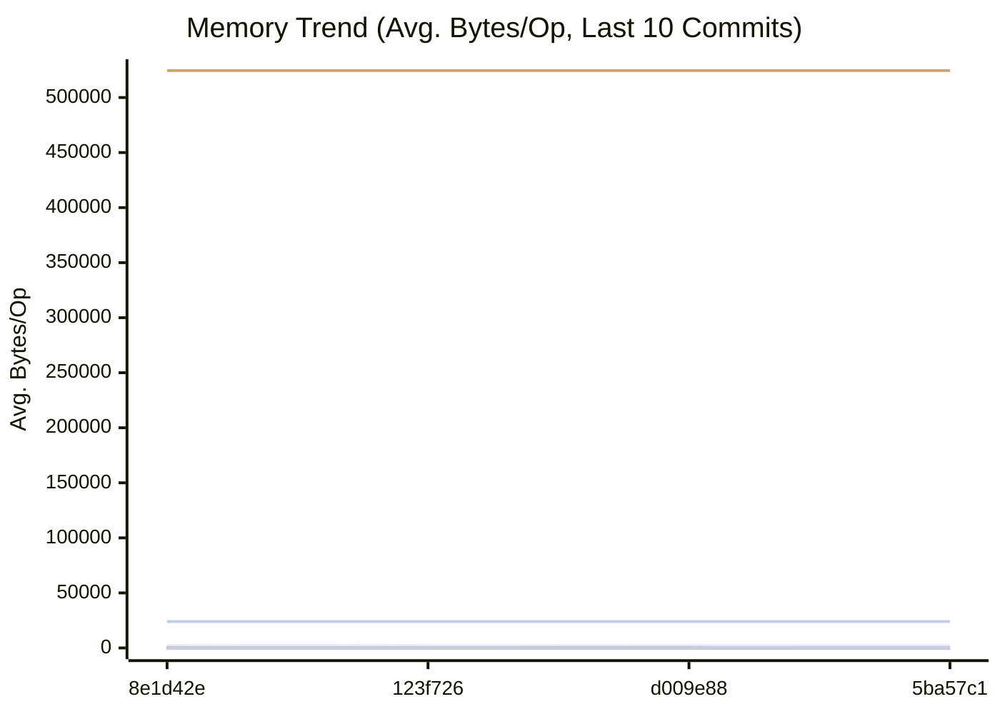
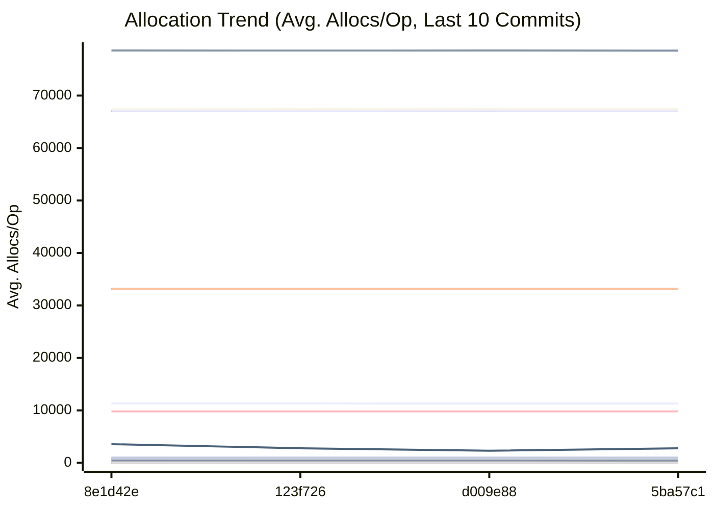

# Performance Benchmarks

This document tracks benchmark performance across commits. The section between
the `BENCHMARK_RESULTS_START/END` markers is auto-generated by the pre-commit
hook; the crypto/OPRF section below is manually maintained.

## How to Read This Document

- **Comparison with previous commit**: `benchstat` output comparing the current
  commit against the previous one. Three tables: **sec/op** (time per operation),
  **B/op** (bytes allocated), **allocs/op** (heap allocations). In each table,
  **lower is better**. `+X%` = regression, `-X%` = improvement, `~` = no
  statistically significant change. `p` is the p-value (p < 0.05 = significant).
- **Latest Benchmark Results**: Single-snapshot table of the current commit's
  averages. Lower values are better across all three columns.
- **Performance Trend plot**: X-axis = commit SHA (left = older, right = newer).
  Y-axis = avg time in ns/op. **Lower lines = faster.** Downward trends are
  improvements; upward spikes are regressions.
- **Memory Trend plot**: Same axes, but Y-axis = avg bytes allocated per op.
  **Lower lines = less memory.** Drops indicate allocation reductions.
- **Allocation Trend plot**: Same axes, but Y-axis = avg heap allocations per op.
  **Lower lines = fewer allocations.** Fewer allocs = less GC pressure.

<!-- BENCHMARK_RESULTS_START -->
## Performance

This section is automatically updated by the pre-commit hook (via .github/scripts/update_readme_with_benchmarks.sh).

### Comparison with previous commit

Each table compares the previous commit (left) to the current commit (right).
**Lower is better** in all three tables. `+X%` = regression, `-X%` = improvement,
`~` = no statistically significant change (p >= 0.05).

- **sec/op**: Time per operation (nanoseconds). Measures raw speed.
- **B/op**: Bytes allocated on the heap per operation. Measures memory usage.
- **allocs/op**: Number of heap allocations per operation. Measures GC pressure.

```
                                      │ /tmp/old_bench_filtered.txt │      /tmp/new_bench_filtered.txt      │
                                      │           sec/op            │    sec/op      vs base                │
CrushOriginal-8                                        443.3n ± ∞ ¹    407.3n ± ∞ ¹       ~ (p=1.000 n=1) ²
Placement-8                                            5.168µ ± ∞ ¹    4.621µ ± ∞ ¹       ~ (p=1.000 n=1) ²
PlacementDomainSpread-8                                5.453µ ± ∞ ¹    5.023µ ± ∞ ¹       ~ (p=1.000 n=1) ²
CrushOptimized-8                                       328.4n ± ∞ ¹    319.8n ± ∞ ¹       ~ (p=1.000 n=1) ²
LoadGlobalConfig-8                                     9.952µ ± ∞ ¹    8.921µ ± ∞ ¹       ~ (p=1.000 n=1) ²
HashBytes/1MiB-8                                       3.444m ± ∞ ¹    3.592m ± ∞ ¹       ~ (p=1.000 n=1) ²
HashBytes/64MiB-8                                      209.4m ± ∞ ¹    242.9m ± ∞ ¹       ~ (p=1.000 n=1) ²
HashBytes/256MiB-8                                     880.1m ± ∞ ¹    925.7m ± ∞ ¹       ~ (p=1.000 n=1) ²
HashFile/1MiB-8                                        3.842m ± ∞ ¹    3.351m ± ∞ ¹       ~ (p=1.000 n=1) ²
HashFile/64MiB-8                                       249.5m ± ∞ ¹    207.2m ± ∞ ¹       ~ (p=1.000 n=1) ²
HashFile/256MiB-8                                      881.9m ± ∞ ¹   1015.2m ± ∞ ¹       ~ (p=1.000 n=1) ²
PadString-8                                            57.07n ± ∞ ¹    52.93n ± ∞ ¹       ~ (p=1.000 n=1) ²
SanitizeLog/Safe-8                                     232.6n ± ∞ ¹    295.1n ± ∞ ¹       ~ (p=1.000 n=1) ²
SanitizeLog/Unsafe-8                                   684.4n ± ∞ ¹    921.7n ± ∞ ¹       ~ (p=1.000 n=1) ²
AWSChunkedReaderSigned-8                               397.7µ ± ∞ ¹    535.6µ ± ∞ ¹       ~ (p=1.000 n=1) ²
AWSChunkedReaderUnsigned-8                             406.0µ ± ∞ ¹    479.5µ ± ∞ ¹       ~ (p=1.000 n=1) ²
LastModifiedHeader_AppendFormat-8                      184.8n ± ∞ ¹    227.9n ± ∞ ¹       ~ (p=1.000 n=1) ²
LastModifiedHeader_Format-8                            261.8n ± ∞ ¹    285.4n ± ∞ ¹       ~ (p=1.000 n=1) ²
FormatListObjectsV2XML_AppendFormat-8                  566.7µ ± ∞ ¹    627.6µ ± ∞ ¹       ~ (p=1.000 n=1) ²
FormatListObjectsV2XML_OldFormat-8                     366.6µ ± ∞ ¹    408.5µ ± ∞ ¹       ~ (p=1.000 n=1) ²
CheckMetricsAndSwap-8                                  7.242n ± ∞ ¹   10.020n ± ∞ ¹       ~ (p=1.000 n=1) ²
IndexSearch-8                                          1.547n ± ∞ ¹    1.605n ± ∞ ¹       ~ (p=1.000 n=1) ²
IndexDirectTracking-8                                 0.3216n ± ∞ ¹   0.3546n ± ∞ ¹       ~ (p=1.000 n=1) ²
LocalWrite/1MiB-8                                      445.8µ ± ∞ ¹    431.6µ ± ∞ ¹       ~ (p=1.000 n=1) ²
LocalWrite/64MiB-8                                     24.07m ± ∞ ¹    25.87m ± ∞ ¹       ~ (p=1.000 n=1) ²
LocalWrite/256MiB-8                                    94.14m ± ∞ ¹   100.08m ± ∞ ¹       ~ (p=1.000 n=1) ²
ReadVerify/1MiB-8                                      3.798m ± ∞ ¹    3.597m ± ∞ ¹       ~ (p=1.000 n=1) ²
ReadVerify/64MiB-8                                     232.4m ± ∞ ¹    273.6m ± ∞ ¹       ~ (p=1.000 n=1) ²
ReadVerify/256MiB-8                                    803.3m ± ∞ ¹    883.4m ± ∞ ¹       ~ (p=1.000 n=1) ²
TrustedRead/1MiB-8                                     3.391m ± ∞ ¹    4.064m ± ∞ ¹       ~ (p=1.000 n=1) ²
TrustedRead/64MiB-8                                    228.8m ± ∞ ¹    245.2m ± ∞ ¹       ~ (p=1.000 n=1) ²
TrustedRead/256MiB-8                                   864.3m ± ∞ ¹    941.5m ± ∞ ¹       ~ (p=1.000 n=1) ²
S3PutSpool/1MiB-8                                      4.350m ± ∞ ¹    4.495m ± ∞ ¹       ~ (p=1.000 n=1) ²
S3PutSpool/64MiB-8                                     292.0m ± ∞ ¹    277.0m ± ∞ ¹       ~ (p=1.000 n=1) ²
S3PutSpool/256MiB-8                                     1.055 ± ∞ ¹     1.041 ± ∞ ¹       ~ (p=1.000 n=1) ²
geomean                                                303.5µ          322.6µ        +6.31%
¹ need >= 6 samples for confidence interval at level 0.95
² need >= 4 samples to detect a difference at alpha level 0.05

                                      │ /tmp/old_bench_filtered.txt │      /tmp/new_bench_filtered.txt      │
                                      │            B/op             │     B/op       vs base                │
CrushOriginal-8                                         164.0 ± ∞ ¹     164.0 ± ∞ ¹       ~ (p=1.000 n=1) ²
Placement-8                                             352.0 ± ∞ ¹     352.0 ± ∞ ¹       ~ (p=1.000 n=1) ²
PlacementDomainSpread-8                                 352.0 ± ∞ ¹     352.0 ± ∞ ¹       ~ (p=1.000 n=1) ²
CrushOptimized-8                                        0.000 ± ∞ ¹     0.000 ± ∞ ¹       ~ (p=1.000 n=1) ²
LoadGlobalConfig-8                                    1.930Ki ± ∞ ¹   1.930Ki ± ∞ ¹       ~ (p=1.000 n=1) ²
HashBytes/1MiB-8                                        64.00 ± ∞ ¹     64.00 ± ∞ ¹       ~ (p=1.000 n=1) ²
HashBytes/64MiB-8                                       64.00 ± ∞ ¹     64.00 ± ∞ ¹       ~ (p=1.000 n=1) ²
HashBytes/256MiB-8                                      64.00 ± ∞ ¹     64.00 ± ∞ ¹       ~ (p=1.000 n=1) ²
HashFile/1MiB-8                                       32.35Ki ± ∞ ¹   32.35Ki ± ∞ ¹       ~ (p=1.000 n=1) ²
HashFile/64MiB-8                                      32.35Ki ± ∞ ¹   32.35Ki ± ∞ ¹       ~ (p=1.000 n=1) ²
HashFile/256MiB-8                                     32.35Ki ± ∞ ¹   32.35Ki ± ∞ ¹       ~ (p=1.000 n=1) ²
PadString-8                                             64.00 ± ∞ ¹     64.00 ± ∞ ¹       ~ (p=1.000 n=1) ²
SanitizeLog/Safe-8                                      0.000 ± ∞ ¹     0.000 ± ∞ ¹       ~ (p=1.000 n=1) ²
SanitizeLog/Unsafe-8                                    704.0 ± ∞ ¹     704.0 ± ∞ ¹       ~ (p=1.000 n=1) ²
AWSChunkedReaderSigned-8                              11.02Ki ± ∞ ¹   11.04Ki ± ∞ ¹       ~ (p=1.000 n=1) ³
AWSChunkedReaderUnsigned-8                            76.73Ki ± ∞ ¹   76.74Ki ± ∞ ¹       ~ (p=1.000 n=1) ³
LastModifiedHeader_AppendFormat-8                       0.000 ± ∞ ¹     0.000 ± ∞ ¹       ~ (p=1.000 n=1) ²
LastModifiedHeader_Format-8                             32.00 ± ∞ ¹     32.00 ± ∞ ¹       ~ (p=1.000 n=1) ²
FormatListObjectsV2XML_AppendFormat-8                 512.2Ki ± ∞ ¹   512.2Ki ± ∞ ¹       ~ (p=1.000 n=1) ³
FormatListObjectsV2XML_OldFormat-8                    23.44Ki ± ∞ ¹   23.44Ki ± ∞ ¹       ~ (p=1.000 n=1) ²
CheckMetricsAndSwap-8                                   0.000 ± ∞ ¹     0.000 ± ∞ ¹       ~ (p=1.000 n=1) ²
IndexSearch-8                                           0.000 ± ∞ ¹     0.000 ± ∞ ¹       ~ (p=1.000 n=1) ²
IndexDirectTracking-8                                   0.000 ± ∞ ¹     0.000 ± ∞ ¹       ~ (p=1.000 n=1) ²
LocalWrite/1MiB-8                                     65.46Ki ± ∞ ¹   65.46Ki ± ∞ ¹       ~ (p=1.000 n=1) ³
LocalWrite/64MiB-8                                    65.51Ki ± ∞ ¹   65.50Ki ± ∞ ¹       ~ (p=1.000 n=1) ³
LocalWrite/256MiB-8                                   65.64Ki ± ∞ ¹   65.75Ki ± ∞ ¹       ~ (p=1.000 n=1) ³
ReadVerify/1MiB-8                                       466.0 ± ∞ ¹     460.0 ± ∞ ¹       ~ (p=1.000 n=1) ³
ReadVerify/64MiB-8                                    2.253Ki ± ∞ ¹   2.253Ki ± ∞ ¹       ~ (p=1.000 n=1) ²
ReadVerify/256MiB-8                                   5.000Ki ± ∞ ¹   5.000Ki ± ∞ ¹       ~ (p=1.000 n=1) ²
TrustedRead/1MiB-8                                      800.0 ± ∞ ¹     800.0 ± ∞ ¹       ~ (p=1.000 n=1) ²
TrustedRead/64MiB-8                                     800.0 ± ∞ ¹     800.0 ± ∞ ¹       ~ (p=1.000 n=1) ²
TrustedRead/256MiB-8                                    800.0 ± ∞ ¹     800.0 ± ∞ ¹       ~ (p=1.000 n=1) ²
S3PutSpool/1MiB-8                                       447.0 ± ∞ ¹     447.0 ± ∞ ¹       ~ (p=1.000 n=1) ²
S3PutSpool/64MiB-8                                      448.0 ± ∞ ¹     448.0 ± ∞ ¹       ~ (p=1.000 n=1) ²
S3PutSpool/256MiB-8                                     448.0 ± ∞ ¹     448.0 ± ∞ ¹       ~ (p=1.000 n=1) ²
geomean                                                           ⁴                  -0.03%               ⁴
¹ need >= 6 samples for confidence interval at level 0.95
² all samples are equal
³ need >= 4 samples to detect a difference at alpha level 0.05
⁴ summaries must be >0 to compute geomean

                                      │ /tmp/old_bench_filtered.txt │     /tmp/new_bench_filtered.txt      │
                                      │          allocs/op          │  allocs/op    vs base                │
CrushOriginal-8                                         3.000 ± ∞ ¹    3.000 ± ∞ ¹       ~ (p=1.000 n=1) ²
Placement-8                                             6.000 ± ∞ ¹    6.000 ± ∞ ¹       ~ (p=1.000 n=1) ²
PlacementDomainSpread-8                                 6.000 ± ∞ ¹    6.000 ± ∞ ¹       ~ (p=1.000 n=1) ²
CrushOptimized-8                                        0.000 ± ∞ ¹    0.000 ± ∞ ¹       ~ (p=1.000 n=1) ²
LoadGlobalConfig-8                                      58.00 ± ∞ ¹    58.00 ± ∞ ¹       ~ (p=1.000 n=1) ²
HashBytes/1MiB-8                                        1.000 ± ∞ ¹    1.000 ± ∞ ¹       ~ (p=1.000 n=1) ²
HashBytes/64MiB-8                                       1.000 ± ∞ ¹    1.000 ± ∞ ¹       ~ (p=1.000 n=1) ²
HashBytes/256MiB-8                                      1.000 ± ∞ ¹    1.000 ± ∞ ¹       ~ (p=1.000 n=1) ²
HashFile/1MiB-8                                         6.000 ± ∞ ¹    6.000 ± ∞ ¹       ~ (p=1.000 n=1) ²
HashFile/64MiB-8                                        6.000 ± ∞ ¹    6.000 ± ∞ ¹       ~ (p=1.000 n=1) ²
HashFile/256MiB-8                                       6.000 ± ∞ ¹    6.000 ± ∞ ¹       ~ (p=1.000 n=1) ²
PadString-8                                             1.000 ± ∞ ¹    1.000 ± ∞ ¹       ~ (p=1.000 n=1) ²
SanitizeLog/Safe-8                                      0.000 ± ∞ ¹    0.000 ± ∞ ¹       ~ (p=1.000 n=1) ²
SanitizeLog/Unsafe-8                                    1.000 ± ∞ ¹    1.000 ± ∞ ¹       ~ (p=1.000 n=1) ²
AWSChunkedReaderSigned-8                                80.00 ± ∞ ¹    80.00 ± ∞ ¹       ~ (p=1.000 n=1) ²
AWSChunkedReaderUnsigned-8                              15.00 ± ∞ ¹    15.00 ± ∞ ¹       ~ (p=1.000 n=1) ²
LastModifiedHeader_AppendFormat-8                       0.000 ± ∞ ¹    0.000 ± ∞ ¹       ~ (p=1.000 n=1) ²
LastModifiedHeader_Format-8                             1.000 ± ∞ ¹    1.000 ± ∞ ¹       ~ (p=1.000 n=1) ²
FormatListObjectsV2XML_AppendFormat-8                   16.00 ± ∞ ¹    16.00 ± ∞ ¹       ~ (p=1.000 n=1) ²
FormatListObjectsV2XML_OldFormat-8                     1.000k ± ∞ ¹   1.000k ± ∞ ¹       ~ (p=1.000 n=1) ²
CheckMetricsAndSwap-8                                   0.000 ± ∞ ¹    0.000 ± ∞ ¹       ~ (p=1.000 n=1) ²
IndexSearch-8                                           0.000 ± ∞ ¹    0.000 ± ∞ ¹       ~ (p=1.000 n=1) ²
IndexDirectTracking-8                                   0.000 ± ∞ ¹    0.000 ± ∞ ¹       ~ (p=1.000 n=1) ²
LocalWrite/1MiB-8                                       19.00 ± ∞ ¹    19.00 ± ∞ ¹       ~ (p=1.000 n=1) ²
LocalWrite/64MiB-8                                      18.00 ± ∞ ¹    18.00 ± ∞ ¹       ~ (p=1.000 n=1) ²
LocalWrite/256MiB-8                                     19.00 ± ∞ ¹    20.00 ± ∞ ¹       ~ (p=1.000 n=1) ³
ReadVerify/1MiB-8                                       6.000 ± ∞ ¹    6.000 ± ∞ ¹       ~ (p=1.000 n=1) ²
ReadVerify/64MiB-8                                      6.000 ± ∞ ¹    6.000 ± ∞ ¹       ~ (p=1.000 n=1) ²
ReadVerify/256MiB-8                                     8.000 ± ∞ ¹    8.000 ± ∞ ¹       ~ (p=1.000 n=1) ²
TrustedRead/1MiB-8                                      11.00 ± ∞ ¹    11.00 ± ∞ ¹       ~ (p=1.000 n=1) ²
TrustedRead/64MiB-8                                     11.00 ± ∞ ¹    11.00 ± ∞ ¹       ~ (p=1.000 n=1) ²
TrustedRead/256MiB-8                                    11.00 ± ∞ ¹    11.00 ± ∞ ¹       ~ (p=1.000 n=1) ²
S3PutSpool/1MiB-8                                       10.00 ± ∞ ¹    10.00 ± ∞ ¹       ~ (p=1.000 n=1) ²
S3PutSpool/64MiB-8                                      10.00 ± ∞ ¹    10.00 ± ∞ ¹       ~ (p=1.000 n=1) ²
S3PutSpool/256MiB-8                                     10.00 ± ∞ ¹    10.00 ± ∞ ¹       ~ (p=1.000 n=1) ²
geomean                                                           ⁴                 +0.15%               ⁴
¹ need >= 6 samples for confidence interval at level 0.95
² all samples are equal
³ need >= 4 samples to detect a difference at alpha level 0.05
⁴ summaries must be >0 to compute geomean

                           │ /tmp/old_bench_filtered.txt │      /tmp/new_bench_filtered.txt      │
                           │             B/s             │      B/s       vs base                │
HashBytes/1MiB-8                           290.4Mi ± ∞ ¹   278.4Mi ± ∞ ¹       ~ (p=1.000 n=1) ²
HashBytes/64MiB-8                          305.6Mi ± ∞ ¹   263.4Mi ± ∞ ¹       ~ (p=1.000 n=1) ²
HashBytes/256MiB-8                         290.9Mi ± ∞ ¹   276.5Mi ± ∞ ¹       ~ (p=1.000 n=1) ²
HashFile/1MiB-8                            260.3Mi ± ∞ ¹   298.4Mi ± ∞ ¹       ~ (p=1.000 n=1) ²
HashFile/64MiB-8                           256.5Mi ± ∞ ¹   308.9Mi ± ∞ ¹       ~ (p=1.000 n=1) ²
HashFile/256MiB-8                          290.3Mi ± ∞ ¹   252.2Mi ± ∞ ¹       ~ (p=1.000 n=1) ²
AWSChunkedReaderSigned-8                   159.6Mi ± ∞ ¹   118.5Mi ± ∞ ¹       ~ (p=1.000 n=1) ²
AWSChunkedReaderUnsigned-8                 156.4Mi ± ∞ ¹   132.4Mi ± ∞ ¹       ~ (p=1.000 n=1) ²
LocalWrite/1MiB-8                          2.191Gi ± ∞ ¹   2.263Gi ± ∞ ¹       ~ (p=1.000 n=1) ²
LocalWrite/64MiB-8                         2.596Gi ± ∞ ¹   2.415Gi ± ∞ ¹       ~ (p=1.000 n=1) ²
LocalWrite/256MiB-8                        2.656Gi ± ∞ ¹   2.498Gi ± ∞ ¹       ~ (p=1.000 n=1) ²
ReadVerify/1MiB-8                          263.3Mi ± ∞ ¹   278.0Mi ± ∞ ¹       ~ (p=1.000 n=1) ²
ReadVerify/64MiB-8                         275.3Mi ± ∞ ¹   233.9Mi ± ∞ ¹       ~ (p=1.000 n=1) ²
ReadVerify/256MiB-8                        318.7Mi ± ∞ ¹   289.8Mi ± ∞ ¹       ~ (p=1.000 n=1) ²
TrustedRead/1MiB-8                         294.9Mi ± ∞ ¹   246.1Mi ± ∞ ¹       ~ (p=1.000 n=1) ²
TrustedRead/64MiB-8                        279.7Mi ± ∞ ¹   261.0Mi ± ∞ ¹       ~ (p=1.000 n=1) ²
TrustedRead/256MiB-8                       296.2Mi ± ∞ ¹   271.9Mi ± ∞ ¹       ~ (p=1.000 n=1) ²
S3PutSpool/1MiB-8                          229.9Mi ± ∞ ¹   222.5Mi ± ∞ ¹       ~ (p=1.000 n=1) ²
S3PutSpool/64MiB-8                         219.2Mi ± ∞ ¹   231.0Mi ± ∞ ¹       ~ (p=1.000 n=1) ²
S3PutSpool/256MiB-8                        242.7Mi ± ∞ ¹   245.8Mi ± ∞ ¹       ~ (p=1.000 n=1) ²
geomean                                    360.8Mi         341.0Mi        -5.50%
¹ need >= 6 samples for confidence interval at level 0.95
² need >= 4 samples to detect a difference at alpha level 0.05
```

### Latest Benchmark Results

Single-snapshot of the current commit's averages. **Lower is better** across all
three columns: time (speed), bytes (memory), allocs (GC pressure).


| Benchmark | Avg. Time/Op | Avg. Bytes/Op | Avg. Allocs/Op |
|-----------|--------------|---------------|----------------|
| BenchmarkAWSChunkedReaderSigned-8 | 535625.00 ns/op | 124.27 B/op | 11307.00 allocs/op |
| BenchmarkAWSChunkedReaderUnsigned-8 | 479460.00 ns/op | 138.82 B/op | 78579.00 allocs/op |
| BenchmarkCheckMetricsAndSwap-8 | 10.02 ns/op | 0.00 B/op | 0.00 allocs/op |
| BenchmarkCrushOptimized-8 | 319.80 ns/op | 0.00 B/op | 0.00 allocs/op |
| BenchmarkCrushOriginal-8 | 407.30 ns/op | 164.00 B/op | 3.00 allocs/op |
| BenchmarkFormatListObjectsV2XML_AppendFormat-8 | 627648.00 ns/op | 524446.00 B/op | 16.00 allocs/op |
| BenchmarkFormatListObjectsV2XML_OldFormat-8 | 408457.00 ns/op | 24000.00 B/op | 1000.00 allocs/op |
| BenchmarkHashBytes/1MiB-8 | 3592333.00 ns/op | 291.89 B/op | 64.00 allocs/op |
| BenchmarkHashBytes/256MiB-8 | 925707610.00 ns/op | 289.98 B/op | 64.00 allocs/op |
| BenchmarkHashBytes/64MiB-8 | 242948441.00 ns/op | 276.23 B/op | 64.00 allocs/op |
| BenchmarkHashFile/1MiB-8 | 3350950.00 ns/op | 312.92 B/op | 33128.00 allocs/op |
| BenchmarkHashFile/256MiB-8 | 1015211606.00 ns/op | 264.41 B/op | 33128.00 allocs/op |
| BenchmarkHashFile/64MiB-8 | 207167851.00 ns/op | 323.93 B/op | 33128.00 allocs/op |
| BenchmarkIndexDirectTracking-8 | 0.35 ns/op | 0.00 B/op | 0.00 allocs/op |
| BenchmarkIndexSearch-8 | 1.60 ns/op | 0.00 B/op | 0.00 allocs/op |
| BenchmarkLastModifiedHeader_AppendFormat-8 | 227.90 ns/op | 0.00 B/op | 0.00 allocs/op |
| BenchmarkLastModifiedHeader_Format-8 | 285.40 ns/op | 32.00 B/op | 1.00 allocs/op |
| BenchmarkLoadGlobalConfig-8 | 8921.00 ns/op | 1976.00 B/op | 58.00 allocs/op |
| BenchmarkLocalWrite/1MiB-8 | 431598.00 ns/op | 2429.52 B/op | 67030.00 allocs/op |
| BenchmarkLocalWrite/256MiB-8 | 100079806.00 ns/op | 2682.21 B/op | 67324.00 allocs/op |
| BenchmarkLocalWrite/64MiB-8 | 25874779.00 ns/op | 2593.60 B/op | 67067.00 allocs/op |
| BenchmarkPadString-8 | 52.93 ns/op | 64.00 B/op | 1.00 allocs/op |
| BenchmarkPlacement-8 | 4621.00 ns/op | 352.00 B/op | 6.00 allocs/op |
| BenchmarkPlacementDomainSpread-8 | 5023.00 ns/op | 352.00 B/op | 6.00 allocs/op |
| BenchmarkReadVerify/1MiB-8 | 3596845.00 ns/op | 291.53 B/op | 460.00 allocs/op |
| BenchmarkReadVerify/256MiB-8 | 883417974.00 ns/op | 303.86 B/op | 5120.00 allocs/op |
| BenchmarkReadVerify/64MiB-8 | 273582930.00 ns/op | 245.30 B/op | 2307.00 allocs/op |
| BenchmarkS3PutSpool/1MiB-8 | 4494504.00 ns/op | 233.30 B/op | 447.00 allocs/op |
| BenchmarkS3PutSpool/256MiB-8 | 1041459785.00 ns/op | 257.75 B/op | 448.00 allocs/op |
| BenchmarkS3PutSpool/64MiB-8 | 277039985.00 ns/op | 242.24 B/op | 448.00 allocs/op |
| BenchmarkSanitizeLog/Safe-8 | 295.10 ns/op | 0.00 B/op | 0.00 allocs/op |
| BenchmarkSanitizeLog/Unsafe-8 | 921.70 ns/op | 704.00 B/op | 1.00 allocs/op |
| BenchmarkTrustedRead/1MiB-8 | 4063744.00 ns/op | 258.03 B/op | 800.00 allocs/op |
| BenchmarkTrustedRead/256MiB-8 | 941546678.00 ns/op | 285.10 B/op | 800.00 allocs/op |
| BenchmarkTrustedRead/64MiB-8 | 245169178.00 ns/op | 273.72 B/op | 800.00 allocs/op |


### Performance History

**Legend**

| Color | Benchmark | Description |
|---|---|---|
| 🟢 | CheckMetricsAndSwap | Evaluation of system metrics (CPU/Mem) and mode switching logic |
| 🟤 | CrushOriginal | Original Sage Weil's CRUSH placement algorithm using reflection and float math |
| ⚪ | CrushOptimized | Performance-tuned CRUSH-lite placement algorithm using bitwise shifts and integer math (Rule 19) |
| 🔵 | IndexDirectTracking | Accessing current replication mode via direct slice index (O(1)) |
| 🔴 | IndexSearch | Searching for current replication mode in the order slice using `slices.Index` |
| 🟠 | LoadGlobalConfig | Parsing and loading the `[global]` section from the INI configuration |
| 🟣 | PadString | Padding strings with null characters to a fixed protocol length |
| 🟡 | ParseReplicationOrder | Parsing the CSV-formatted replication order string into an integer slice |

#### Time per Operation (ns/op)

X-axis: commit SHA (left = older, right = newer). Y-axis: avg time in ns/op.
**Lower lines = faster code.** Downward trends are improvements; upward spikes
are regressions to investigate.


```mermaid
xychart-beta
    title "Performance Trend (Avg. Time, Last 10 Commits)"
    x-axis "Commit"
    y-axis "Avg. Time (ns/op)"
    x-axis [8e1d42e,123f726,d009e88,5ba57c1]
    line "AWSChunkedReaderSigned" [596016,541759,554800,615254,528737,564386,758672,413086,397685,535625]
    line "AWSChunkedReaderUnsigned" [624951,521049,581740,507516,587797,593238,672192,414070,405982,479460]
    line "CheckMetricsAndSwap" [13,11,12,11,10,13,15,8,7,10]
    line "CrushOptimized" [487,522,363,426,455,372,348,300,328,320]
    line "CrushOriginal" [697,658,647,700,629,670,500,425,443,407]
    line "FormatListObjectsV2XML_AppendFormat" [928365,977381,898486,862695,851540,926975,915187,583023,566690,627648]
    line "FormatListObjectsV2XML_OldFormat" [521514,565611,503389,497195,517753,571332,678624,365879,366636,408457]
    line "HashBytes/1MiB" [4965423,4315588,3618889,5475294,4458201,5002278,3553145,3949669,3443981,3592333]
    line "HashBytes/256MiB" [1211052717,1048575116,1201286487,897333718,1207294588,1184745180,1044551719,953557308,880098861,925707610]
    line "HashBytes/64MiB" [339981640,213869807,301162837,301221390,345018440,277796866,225326458,239330627,209418782,242948441]
    line "HashFile/1MiB" [5039192,3960989,4760647,3647035,4734519,4310666,4389479,3364281,3842035,3350950]
    line "HashFile/256MiB" [1193078064,1177833636,1006415705,1110450496,1224080744,1231037862,1035601414,793044431,881918242,1015211606]
    line "HashFile/64MiB" [356293580,288277413,240359009,275852870,300686574,287252666,248823362,200009250,249484580,207167851]
    line "IndexDirectTracking" [0,0,0,0,1,1,1,0,0,0]
    line "IndexSearch" [2,2,2,2,2,2,3,2,2,2]
    line "LastModifiedHeader_AppendFormat" [411,306,291,280,241,335,327,200,185,228]
    line "LastModifiedHeader_Format" [418,381,345,360,407,375,540,279,262,285]
    line "LoadGlobalConfig" [15639,12955,12190,11396,14415,13002,10458,9205,9952,8921]
    line "LocalWrite/1MiB" [620492,558337,524282,489792,546231,429345,817681,719361,445767,431598]
    line "LocalWrite/256MiB" [136595670,121311016,122106179,129421555,120328176,124110973,158044809,120298309,94142106,100079806]
    line "LocalWrite/64MiB" [35901035,33613673,28590856,29289820,30438473,30969681,34833751,27951923,24072639,25874779]
    line "PadString" [64,59,66,60,55,62,58,41,57,53]
    line "ParseReplicationOrder_NoPrealloc" [350,349,357,354,345,225,229,165,232,234]
    line "ParseReplicationOrder_Prealloc" [229,231,237,234,229,108,107,80,110,109]
    line "Placement" [7054,7086,6141,6119,7125,6310,5825,4876,5168,4621]
    line "PlacementDomainSpread" [7666,6917,6176,5740,6962,6385,6405,5139,5453,5023]
    line "ReadVerify/1MiB" [4787467,3900770,3383659,5081549,5082713,4903321,6081724,3136229,3798416,3596845]
    line "ReadVerify/256MiB" [1338425672,1103105249,1170100253,1034709963,1126615995,955370931,1411104961,1000738329,803259188,883417974]
    line "ReadVerify/64MiB" [347180139,259882135,240879749,282446554,308997294,315121783,335838061,214326196,232435503,273582930]
    line "S3PutSpool/1MiB" [5304842,5592080,5587762,4022819,5065293,4750326,6562486,3791252,4349655,4494504]
    line "S3PutSpool/256MiB" [1298058993,1269281522,1304442018,1243287804,1504779272,1226604254,1140637754,1085496919,1054828608,1041459785]
    line "S3PutSpool/64MiB" [347153910,296132654,317372640,355710496,276642924,271159852,378241377,245496530,292024160,277039985]
    line "SanitizeLog/Safe" [341,309,277,263,246,286,286,227,233,295]
    line "SanitizeLog/Unsafe" [1000,1005,1021,917,915,1036,1495,681,684,922]
    line "TrustedRead/1MiB" [5638483,4655498,3708543,3570428,4694929,4495398,3669866,3527534,3390683,4063744]
    line "TrustedRead/256MiB" [1031346576,1173571296,1073394044,932638111,1071768789,1012880474,1648511504,887056660,864337055,941546678]
    line "TrustedRead/64MiB" [296255358,281349472,260468873,247394092,261716002,251602823,338500502,217741152,228835469,245169178]
```

#### Memory per Operation (B/op)

X-axis: commit SHA. Y-axis: avg bytes allocated per op.
**Lower lines = less memory.** Drops indicate allocation reductions.


```mermaid
xychart-beta
    title "Memory Trend (Avg. Bytes/Op, Last 10 Commits)"
    x-axis "Commit"
    y-axis "Avg. Bytes/Op"
    x-axis [8e1d42e,123f726,d009e88,5ba57c1]
    line "AWSChunkedReaderSigned" [112,123,120,108,126,118,88,161,167,124]
    line "AWSChunkedReaderUnsigned" [106,128,114,131,113,112,99,161,164,139]
    line "CheckMetricsAndSwap" [0,0,0,0,0,0,0,0,0,0]
    line "CrushOptimized" [0,0,0,0,0,0,0,0,0,0]
    line "CrushOriginal" [164,164,164,164,164,164,164,164,164,164]
    line "FormatListObjectsV2XML_AppendFormat" [524456,524462,524471,524446,524472,524454,524455,524439,524442,524446]
    line "FormatListObjectsV2XML_OldFormat" [24000,24000,24000,24000,24000,24000,24000,24000,24000,24000]
    line "HashBytes/1MiB" [211,243,290,192,235,210,295,265,304,292]
    line "HashBytes/256MiB" [222,256,223,299,222,227,257,282,305,290]
    line "HashBytes/64MiB" [197,314,223,223,195,242,298,280,320,276]
    line "HashFile/1MiB" [208,265,220,288,221,243,239,312,273,313]
    line "HashFile/256MiB" [225,228,267,242,219,218,259,338,304,264]
    line "HashFile/64MiB" [188,233,279,243,223,234,270,336,269,324]
    line "IndexDirectTracking" [0,0,0,0,0,0,0,0,0,0]
    line "IndexSearch" [0,0,0,0,0,0,0,0,0,0]
    line "LastModifiedHeader_AppendFormat" [0,0,0,0,0,0,0,0,0,0]
    line "LastModifiedHeader_Format" [32,32,32,32,32,32,32,32,32,32]
    line "LoadGlobalConfig" [1976,1976,1976,1976,1976,1976,1976,1976,1976,1976]
    line "LocalWrite/1MiB" [1690,1878,2000,2141,1920,2442,1282,1458,2352,2430]
    line "LocalWrite/256MiB" [1965,2213,2198,2074,2231,2163,1698,2231,2851,2682]
    line "LocalWrite/64MiB" [1869,1996,2347,2291,2205,2167,1927,2401,2788,2594]
    line "PadString" [64,64,64,64,64,64,64,64,64,64]
    line "ParseReplicationOrder_NoPrealloc" [408,408,408,408,408,248,248,248,248,248]
    line "ParseReplicationOrder_Prealloc" [240,240,240,240,240,80,80,80,80,80]
    line "Placement" [352,352,352,352,352,352,352,352,352,352]
    line "PlacementDomainSpread" [352,352,352,352,352,352,352,352,352,352]
    line "ReadVerify/1MiB" [219,269,310,206,206,214,172,334,276,292]
    line "ReadVerify/256MiB" [201,243,229,259,238,281,190,268,334,304]
    line "ReadVerify/64MiB" [193,258,279,238,217,213,200,313,289,245]
    line "S3PutSpool/1MiB" [198,188,188,261,207,221,160,277,241,233]
    line "S3PutSpool/256MiB" [207,211,206,216,178,219,235,247,254,258]
    line "S3PutSpool/64MiB" [193,227,211,189,243,247,177,273,230,242]
    line "SanitizeLog/Safe" [0,0,0,0,0,0,0,0,0,0]
    line "SanitizeLog/Unsafe" [704,704,704,704,704,704,704,704,704,704]
    line "TrustedRead/1MiB" [186,225,283,294,223,233,286,297,309,258]
    line "TrustedRead/256MiB" [260,229,250,288,250,265,163,303,311,285]
    line "TrustedRead/64MiB" [227,239,258,271,256,267,198,308,293,274]
```

#### Allocations per Operation (allocs/op)

X-axis: commit SHA. Y-axis: avg heap allocations per op.
**Lower lines = fewer allocations.** Fewer allocs = less GC pressure.


```mermaid
xychart-beta
    title "Allocation Trend (Avg. Allocs/Op, Last 10 Commits)"
    x-axis "Commit"
    y-axis "Avg. Allocs/Op"
    x-axis [8e1d42e,123f726,d009e88,5ba57c1]
    line "AWSChunkedReaderSigned" [11316,11313,11300,11299,11305,11315,11352,11288,11282,11307]
    line "AWSChunkedReaderUnsigned" [78588,78582,78589,78575,78586,78603,78609,78561,78569,78579]
    line "CheckMetricsAndSwap" [0,0,0,0,0,0,0,0,0,0]
    line "CrushOptimized" [0,0,0,0,0,0,0,0,0,0]
    line "CrushOriginal" [3,3,3,3,3,3,3,3,3,3]
    line "FormatListObjectsV2XML_AppendFormat" [16,16,16,16,16,16,16,16,16,16]
    line "FormatListObjectsV2XML_OldFormat" [1000,1000,1000,1000,1000,1000,1000,1000,1000,1000]
    line "HashBytes/1MiB" [64,64,64,64,64,64,64,64,64,64]
    line "HashBytes/256MiB" [64,64,64,64,64,64,64,64,64,64]
    line "HashBytes/64MiB" [64,64,64,64,64,64,64,64,64,64]
    line "HashFile/1MiB" [33128,33128,33128,33128,33128,33128,33128,33128,33128,33128]
    line "HashFile/256MiB" [33128,33128,33128,33128,33128,33128,33128,33128,33128,33128]
    line "HashFile/64MiB" [33128,33128,33128,33128,33128,33128,33128,33128,33128,33128]
    line "IndexDirectTracking" [0,0,0,0,0,0,0,0,0,0]
    line "IndexSearch" [0,0,0,0,0,0,0,0,0,0]
    line "LastModifiedHeader_AppendFormat" [0,0,0,0,0,0,0,0,0,0]
    line "LastModifiedHeader_Format" [1,1,1,1,1,1,1,1,1,1]
    line "LoadGlobalConfig" [58,58,58,58,58,58,58,58,58,58]
    line "LocalWrite/1MiB" [67032,67034,67035,67028,67030,67029,67036,67031,67028,67030]
    line "LocalWrite/256MiB" [67369,67393,67386,67388,67358,67330,67465,67275,67218,67324]
    line "LocalWrite/64MiB" [67107,67056,67086,67077,67086,67071,67103,67070,67080,67067]
    line "PadString" [1,1,1,1,1,1,1,1,1,1]
    line "ParseReplicationOrder_NoPrealloc" [6,6,6,6,6,5,5,5,5,5]
    line "ParseReplicationOrder_Prealloc" [2,2,2,2,2,1,1,1,1,1]
    line "Placement" [6,6,6,6,6,6,6,6,6,6]
    line "PlacementDomainSpread" [6,6,6,6,6,6,6,6,6,6]
    line "ReadVerify/1MiB" [467,465,462,461,460,460,484,458,466,460]
    line "ReadVerify/256MiB" [9808,9808,9808,9808,5120,5120,9808,9808,5120,5120]
    line "ReadVerify/64MiB" [3557,2776,2307,2776,2776,2776,2776,2307,2307,2307]
    line "S3PutSpool/1MiB" [447,447,447,447,447,447,447,447,447,447]
    line "S3PutSpool/256MiB" [448,448,448,448,448,448,448,448,448,448]
    line "S3PutSpool/64MiB" [448,448,448,446,448,448,448,448,448,448]
    line "SanitizeLog/Safe" [0,0,0,0,0,0,0,0,0,0]
    line "SanitizeLog/Unsafe" [1,1,1,1,1,1,1,1,1,1]
    line "TrustedRead/1MiB" [834,800,800,800,800,830,800,827,800,800]
    line "TrustedRead/256MiB" [800,800,800,800,800,800,800,800,800,800]
    line "TrustedRead/64MiB" [800,800,800,800,800,800,800,800,800,800]
```
<!-- BENCHMARK_RESULTS_END -->

### E2EE + OPRF overhead

The sections above are auto-generated and cover the hot-path benchmarks. The
crypto/OPRF work is measured separately; figures below are from `go test -bench`
on the crypto module and are intentionally placed outside the auto-managed block
so they persist.

**Lower is better** across all columns. These benchmarks run on `src/crypto` only
(not tracked in the auto-generated plots above).

| Benchmark | What it measures | Avg. Time/Op | Avg. Bytes/Op | Avg. Allocs/Op |
|-----------|------------------|--------------|---------------|----------------|
| EncryptStream | AES-GCM-256 chunked encryption (64KB input) | ~63 µs | 167 KB | 14 |
| DecryptStream | AES-GCM-256 chunked decryption (64KB input) | ~54 µs | 136 KB | 13 |
| DeriveKey | HKDF-SHA256 key derivation per tenant | ~3.5 µs | 1.3 KB | 18 |
| OPRFCombineThreshold3 | Threshold-3 OPRF combine + unblind (Ristretto255) | ~530 µs | 2.3 KB | 62 |

With `encryption_enabled`, every byte passes through AES-GCM-256 streaming at
~800-1200 MB/s (chunk-bounded memory). The streaming format is **StreamVersion
v4 (issue #824)** with a self-describing chunk size: the default 4096-byte
chunk preserves prior throughput, and the chunk size can be raised/lowered via
`SetStreamChunkSize` within `[512, 4128]` for latency/memory trade-offs without
a wire change in framing beyond the 2-byte header field (v3/v2 blobs still
decode). The threshold OPRF is evaluated **once per
upload/download**, on the dedup tag only (never per chunk):
`OPRFCombineThreshold3` measures a one-time ~0.53 ms client-side combine/unblind
for threshold-3, plus one round-trip per daemon share. This is negligible against
network/disk I/O and does not affect streaming throughput. When `oprf_enabled =
false`, the OPRF path is skipped entirely and behavior is identical to the
pre-OPRF encryption path (backward compatible).
