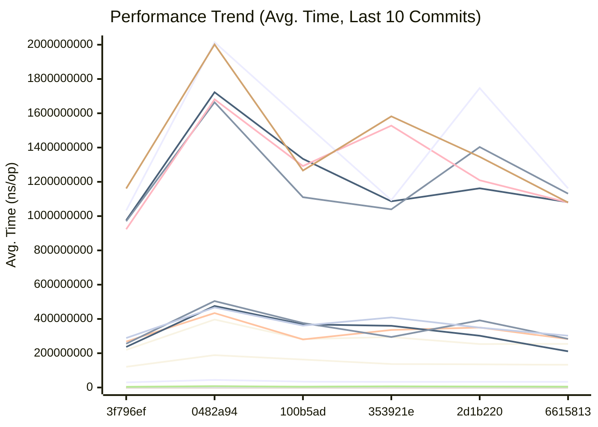
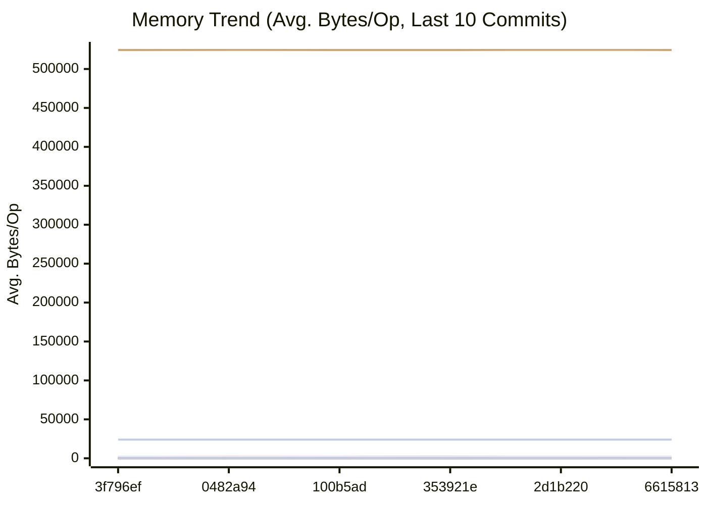
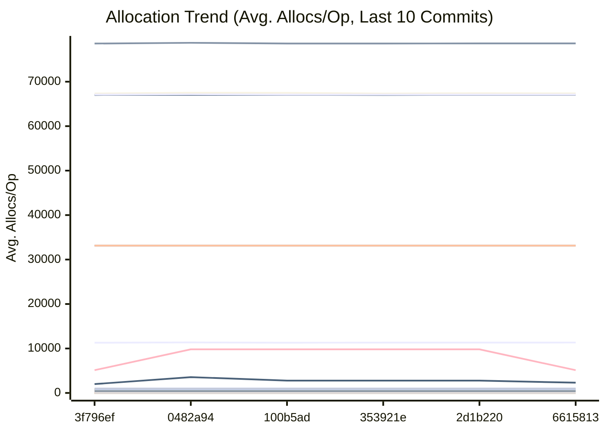

# Performance Benchmarks

This document tracks benchmark performance across commits. The section between
the `BENCHMARK_RESULTS_START/END` markers is auto-generated by the pre-commit
hook; the crypto/OPRF section below is manually maintained.

## How to Read This Document

- **Comparison with previous commit**: `benchstat` output comparing the current
  commit against the previous one. Three tables: **sec/op** (time per operation),
  **B/op** (bytes allocated), **allocs/op** (heap allocations). In each table,
  **lower is better**. `+X%` = regression, `-X%` = improvement, `~` = no
  statistically significant change. `p` is the p-value (p < 0.05 = significant).
- **Latest Benchmark Results**: Single-snapshot table of the current commit's
  averages. Lower values are better across all three columns.
- **Performance Trend plot**: X-axis = commit SHA (left = older, right = newer).
  Y-axis = avg time in ns/op. **Lower lines = faster.** Downward trends are
  improvements; upward spikes are regressions.
- **Memory Trend plot**: Same axes, but Y-axis = avg bytes allocated per op.
  **Lower lines = less memory.** Drops indicate allocation reductions.
- **Allocation Trend plot**: Same axes, but Y-axis = avg heap allocations per op.
  **Lower lines = fewer allocations.** Fewer allocs = less GC pressure.

<!-- BENCHMARK_RESULTS_START -->
## Performance

This section is automatically updated by the pre-commit hook (via .github/scripts/update_readme_with_benchmarks.sh).

### Comparison with previous commit

Each table compares the previous commit (left) to the current commit (right).
**Lower is better** in all three tables. `+X%` = regression, `-X%` = improvement,
`~` = no statistically significant change (p >= 0.05).

- **sec/op**: Time per operation (nanoseconds). Measures raw speed.
- **B/op**: Bytes allocated on the heap per operation. Measures memory usage.
- **allocs/op**: Number of heap allocations per operation. Measures GC pressure.

```
                                      │ /tmp/old_bench_filtered.txt │      /tmp/new_bench_filtered.txt       │
                                      │           sec/op            │    sec/op      vs base                 │
CrushOriginal-8                                        715.1n ± ∞ ¹    640.7n ± ∞ ¹        ~ (p=1.000 n=1) ²
Placement-8                                            7.421µ ± ∞ ¹    7.230µ ± ∞ ¹        ~ (p=1.000 n=1) ²
PlacementDomainSpread-8                                8.867µ ± ∞ ¹    7.769µ ± ∞ ¹        ~ (p=1.000 n=1) ²
CrushOptimized-8                                       531.9n ± ∞ ¹    483.9n ± ∞ ¹        ~ (p=1.000 n=1) ²
LoadGlobalConfig-8                                     16.79µ ± ∞ ¹    14.34µ ± ∞ ¹        ~ (p=1.000 n=1) ²
HashBytes/1MiB-8                                       3.995m ± ∞ ¹    4.596m ± ∞ ¹        ~ (p=1.000 n=1) ²
HashBytes/64MiB-8                                      308.2m ± ∞ ¹    336.9m ± ∞ ¹        ~ (p=1.000 n=1) ²
HashBytes/256MiB-8                                      1.284 ± ∞ ¹     1.366 ± ∞ ¹        ~ (p=1.000 n=1) ²
HashFile/1MiB-8                                        5.430m ± ∞ ¹    4.961m ± ∞ ¹        ~ (p=1.000 n=1) ²
HashFile/64MiB-8                                       355.3m ± ∞ ¹    397.3m ± ∞ ¹        ~ (p=1.000 n=1) ²
HashFile/256MiB-8                                       1.441 ± ∞ ¹     1.317 ± ∞ ¹        ~ (p=1.000 n=1) ²
PadString-8                                            96.66n ± ∞ ¹    85.38n ± ∞ ¹        ~ (p=1.000 n=1) ²
SanitizeLog/Safe-8                                     387.8n ± ∞ ¹    301.2n ± ∞ ¹        ~ (p=1.000 n=1) ²
SanitizeLog/Unsafe-8                                   1.274µ ± ∞ ¹    1.021µ ± ∞ ¹        ~ (p=1.000 n=1) ²
AWSChunkedReaderSigned-8                               721.9µ ± ∞ ¹    582.8µ ± ∞ ¹        ~ (p=1.000 n=1) ²
AWSChunkedReaderUnsigned-8                             695.4µ ± ∞ ¹    580.7µ ± ∞ ¹        ~ (p=1.000 n=1) ²
FormatListObjectsV2XML_AppendFormat-8                 1080.3µ ± ∞ ¹    993.6µ ± ∞ ¹        ~ (p=1.000 n=1) ²
FormatListObjectsV2XML_OldFormat-8                     671.0µ ± ∞ ¹    530.6µ ± ∞ ¹        ~ (p=1.000 n=1) ²
CheckMetricsAndSwap-8                                 14.190n ± ∞ ¹    9.292n ± ∞ ¹        ~ (p=1.000 n=1) ²
IndexSearch-8                                          2.636n ± ∞ ¹    2.486n ± ∞ ¹        ~ (p=1.000 n=1) ²
IndexDirectTracking-8                                 0.6480n ± ∞ ¹   0.5576n ± ∞ ¹        ~ (p=1.000 n=1) ²
LocalWrite/1MiB-8                                      627.8µ ± ∞ ¹    515.2µ ± ∞ ¹        ~ (p=1.000 n=1) ²
LocalWrite/64MiB-8                                     39.56m ± ∞ ¹    34.59m ± ∞ ¹        ~ (p=1.000 n=1) ²
LocalWrite/256MiB-8                                    141.2m ± ∞ ¹    133.1m ± ∞ ¹        ~ (p=1.000 n=1) ²
ReadVerify/1MiB-8                                      5.836m ± ∞ ¹    3.976m ± ∞ ¹        ~ (p=1.000 n=1) ²
ReadVerify/64MiB-8                                     341.9m ± ∞ ¹    317.7m ± ∞ ¹        ~ (p=1.000 n=1) ²
ReadVerify/256MiB-8                                     1.423 ± ∞ ¹     1.250 ± ∞ ¹        ~ (p=1.000 n=1) ²
TrustedRead/1MiB-8                                     5.334m ± ∞ ¹    5.277m ± ∞ ¹        ~ (p=1.000 n=1) ²
TrustedRead/64MiB-8                                    306.4m ± ∞ ¹    291.1m ± ∞ ¹        ~ (p=1.000 n=1) ²
TrustedRead/256MiB-8                                    1.290 ± ∞ ¹     1.112 ± ∞ ¹        ~ (p=1.000 n=1) ²
S3PutSpool/1MiB-8                                      6.589m ± ∞ ¹    5.573m ± ∞ ¹        ~ (p=1.000 n=1) ²
S3PutSpool/64MiB-8                                     389.7m ± ∞ ¹    272.5m ± ∞ ¹        ~ (p=1.000 n=1) ²
S3PutSpool/256MiB-8                                     1.439 ± ∞ ¹     1.076 ± ∞ ¹        ~ (p=1.000 n=1) ²
LastModifiedHeader_AppendFormat-8                                      273.3n ± ∞ ¹
LastModifiedHeader_Format-8                                            359.2n ± ∞ ¹
geomean                                                745.0µ          423.2µ        -12.07%
¹ need >= 6 samples for confidence interval at level 0.95
² need >= 4 samples to detect a difference at alpha level 0.05

                                      │ /tmp/old_bench_filtered.txt │      /tmp/new_bench_filtered.txt      │
                                      │            B/op             │     B/op       vs base                │
CrushOriginal-8                                         164.0 ± ∞ ¹     164.0 ± ∞ ¹       ~ (p=1.000 n=1) ²
Placement-8                                             352.0 ± ∞ ¹     352.0 ± ∞ ¹       ~ (p=1.000 n=1) ²
PlacementDomainSpread-8                                 352.0 ± ∞ ¹     352.0 ± ∞ ¹       ~ (p=1.000 n=1) ²
CrushOptimized-8                                        0.000 ± ∞ ¹     0.000 ± ∞ ¹       ~ (p=1.000 n=1) ²
LoadGlobalConfig-8                                    1.930Ki ± ∞ ¹   1.930Ki ± ∞ ¹       ~ (p=1.000 n=1) ²
HashBytes/1MiB-8                                        64.00 ± ∞ ¹     64.00 ± ∞ ¹       ~ (p=1.000 n=1) ²
HashBytes/64MiB-8                                       64.00 ± ∞ ¹     64.00 ± ∞ ¹       ~ (p=1.000 n=1) ²
HashBytes/256MiB-8                                      64.00 ± ∞ ¹     64.00 ± ∞ ¹       ~ (p=1.000 n=1) ²
HashFile/1MiB-8                                       32.35Ki ± ∞ ¹   32.35Ki ± ∞ ¹       ~ (p=1.000 n=1) ²
HashFile/64MiB-8                                      32.35Ki ± ∞ ¹   32.35Ki ± ∞ ¹       ~ (p=1.000 n=1) ²
HashFile/256MiB-8                                     32.35Ki ± ∞ ¹   32.35Ki ± ∞ ¹       ~ (p=1.000 n=1) ²
PadString-8                                             64.00 ± ∞ ¹     64.00 ± ∞ ¹       ~ (p=1.000 n=1) ²
SanitizeLog/Safe-8                                      0.000 ± ∞ ¹     0.000 ± ∞ ¹       ~ (p=1.000 n=1) ²
SanitizeLog/Unsafe-8                                    704.0 ± ∞ ¹     704.0 ± ∞ ¹       ~ (p=1.000 n=1) ²
AWSChunkedReaderSigned-8                              11.07Ki ± ∞ ¹   11.06Ki ± ∞ ¹       ~ (p=1.000 n=1) ³
AWSChunkedReaderUnsigned-8                            76.81Ki ± ∞ ¹   76.76Ki ± ∞ ¹       ~ (p=1.000 n=1) ³
FormatListObjectsV2XML_AppendFormat-8                 512.2Ki ± ∞ ¹   512.2Ki ± ∞ ¹       ~ (p=1.000 n=1) ³
FormatListObjectsV2XML_OldFormat-8                    23.44Ki ± ∞ ¹   23.44Ki ± ∞ ¹       ~ (p=1.000 n=1) ²
CheckMetricsAndSwap-8                                   0.000 ± ∞ ¹     0.000 ± ∞ ¹       ~ (p=1.000 n=1) ²
IndexSearch-8                                           0.000 ± ∞ ¹     0.000 ± ∞ ¹       ~ (p=1.000 n=1) ²
IndexDirectTracking-8                                   0.000 ± ∞ ¹     0.000 ± ∞ ¹       ~ (p=1.000 n=1) ²
LocalWrite/1MiB-8                                     65.46Ki ± ∞ ¹   65.46Ki ± ∞ ¹       ~ (p=1.000 n=1) ³
LocalWrite/64MiB-8                                    65.52Ki ± ∞ ¹   65.53Ki ± ∞ ¹       ~ (p=1.000 n=1) ³
LocalWrite/256MiB-8                                   65.83Ki ± ∞ ¹   65.81Ki ± ∞ ¹       ~ (p=1.000 n=1) ³
ReadVerify/1MiB-8                                       473.0 ± ∞ ¹     468.0 ± ∞ ¹       ~ (p=1.000 n=1) ³
ReadVerify/64MiB-8                                    2.711Ki ± ∞ ¹   2.711Ki ± ∞ ¹       ~ (p=1.000 n=1) ²
ReadVerify/256MiB-8                                   9.578Ki ± ∞ ¹   9.578Ki ± ∞ ¹       ~ (p=1.000 n=1) ²
TrustedRead/1MiB-8                                      839.0 ± ∞ ¹     840.0 ± ∞ ¹       ~ (p=1.000 n=1) ³
TrustedRead/64MiB-8                                     800.0 ± ∞ ¹     800.0 ± ∞ ¹       ~ (p=1.000 n=1) ²
TrustedRead/256MiB-8                                    800.0 ± ∞ ¹     800.0 ± ∞ ¹       ~ (p=1.000 n=1) ²
S3PutSpool/1MiB-8                                       447.0 ± ∞ ¹     447.0 ± ∞ ¹       ~ (p=1.000 n=1) ²
S3PutSpool/64MiB-8                                      448.0 ± ∞ ¹     448.0 ± ∞ ¹       ~ (p=1.000 n=1) ²
S3PutSpool/256MiB-8                                     448.0 ± ∞ ¹     448.0 ± ∞ ¹       ~ (p=1.000 n=1) ²
LastModifiedHeader_AppendFormat-8                                       0.000 ± ∞ ¹
LastModifiedHeader_Format-8                                             32.00 ± ∞ ¹
geomean                                                           ⁴                  -0.03%               ⁴
¹ need >= 6 samples for confidence interval at level 0.95
² all samples are equal
³ need >= 4 samples to detect a difference at alpha level 0.05
⁴ summaries must be >0 to compute geomean

                                      │ /tmp/old_bench_filtered.txt │     /tmp/new_bench_filtered.txt      │
                                      │          allocs/op          │  allocs/op    vs base                │
CrushOriginal-8                                         3.000 ± ∞ ¹    3.000 ± ∞ ¹       ~ (p=1.000 n=1) ²
Placement-8                                             6.000 ± ∞ ¹    6.000 ± ∞ ¹       ~ (p=1.000 n=1) ²
PlacementDomainSpread-8                                 6.000 ± ∞ ¹    6.000 ± ∞ ¹       ~ (p=1.000 n=1) ²
CrushOptimized-8                                        0.000 ± ∞ ¹    0.000 ± ∞ ¹       ~ (p=1.000 n=1) ²
LoadGlobalConfig-8                                      58.00 ± ∞ ¹    58.00 ± ∞ ¹       ~ (p=1.000 n=1) ²
HashBytes/1MiB-8                                        1.000 ± ∞ ¹    1.000 ± ∞ ¹       ~ (p=1.000 n=1) ²
HashBytes/64MiB-8                                       1.000 ± ∞ ¹    1.000 ± ∞ ¹       ~ (p=1.000 n=1) ²
HashBytes/256MiB-8                                      1.000 ± ∞ ¹    1.000 ± ∞ ¹       ~ (p=1.000 n=1) ²
HashFile/1MiB-8                                         6.000 ± ∞ ¹    6.000 ± ∞ ¹       ~ (p=1.000 n=1) ²
HashFile/64MiB-8                                        6.000 ± ∞ ¹    6.000 ± ∞ ¹       ~ (p=1.000 n=1) ²
HashFile/256MiB-8                                       6.000 ± ∞ ¹    6.000 ± ∞ ¹       ~ (p=1.000 n=1) ²
PadString-8                                             1.000 ± ∞ ¹    1.000 ± ∞ ¹       ~ (p=1.000 n=1) ²
SanitizeLog/Safe-8                                      0.000 ± ∞ ¹    0.000 ± ∞ ¹       ~ (p=1.000 n=1) ²
SanitizeLog/Unsafe-8                                    1.000 ± ∞ ¹    1.000 ± ∞ ¹       ~ (p=1.000 n=1) ²
AWSChunkedReaderSigned-8                                80.00 ± ∞ ¹    80.00 ± ∞ ¹       ~ (p=1.000 n=1) ²
AWSChunkedReaderUnsigned-8                              15.00 ± ∞ ¹    15.00 ± ∞ ¹       ~ (p=1.000 n=1) ²
FormatListObjectsV2XML_AppendFormat-8                   16.00 ± ∞ ¹    16.00 ± ∞ ¹       ~ (p=1.000 n=1) ²
FormatListObjectsV2XML_OldFormat-8                     1.000k ± ∞ ¹   1.000k ± ∞ ¹       ~ (p=1.000 n=1) ²
CheckMetricsAndSwap-8                                   0.000 ± ∞ ¹    0.000 ± ∞ ¹       ~ (p=1.000 n=1) ²
IndexSearch-8                                           0.000 ± ∞ ¹    0.000 ± ∞ ¹       ~ (p=1.000 n=1) ²
IndexDirectTracking-8                                   0.000 ± ∞ ¹    0.000 ± ∞ ¹       ~ (p=1.000 n=1) ²
LocalWrite/1MiB-8                                       18.00 ± ∞ ¹    18.00 ± ∞ ¹       ~ (p=1.000 n=1) ²
LocalWrite/64MiB-8                                      18.00 ± ∞ ¹    18.00 ± ∞ ¹       ~ (p=1.000 n=1) ²
LocalWrite/256MiB-8                                     20.00 ± ∞ ¹    20.00 ± ∞ ¹       ~ (p=1.000 n=1) ²
ReadVerify/1MiB-8                                       6.000 ± ∞ ¹    6.000 ± ∞ ¹       ~ (p=1.000 n=1) ²
ReadVerify/64MiB-8                                      7.000 ± ∞ ¹    7.000 ± ∞ ¹       ~ (p=1.000 n=1) ²
ReadVerify/256MiB-8                                     10.00 ± ∞ ¹    10.00 ± ∞ ¹       ~ (p=1.000 n=1) ²
TrustedRead/1MiB-8                                      11.00 ± ∞ ¹    11.00 ± ∞ ¹       ~ (p=1.000 n=1) ²
TrustedRead/64MiB-8                                     11.00 ± ∞ ¹    11.00 ± ∞ ¹       ~ (p=1.000 n=1) ²
TrustedRead/256MiB-8                                    11.00 ± ∞ ¹    11.00 ± ∞ ¹       ~ (p=1.000 n=1) ²
S3PutSpool/1MiB-8                                       10.00 ± ∞ ¹    10.00 ± ∞ ¹       ~ (p=1.000 n=1) ²
S3PutSpool/64MiB-8                                      10.00 ± ∞ ¹    10.00 ± ∞ ¹       ~ (p=1.000 n=1) ²
S3PutSpool/256MiB-8                                     10.00 ± ∞ ¹    10.00 ± ∞ ¹       ~ (p=1.000 n=1) ²
LastModifiedHeader_AppendFormat-8                                      0.000 ± ∞ ¹
LastModifiedHeader_Format-8                                            1.000 ± ∞ ¹
geomean                                                           ³                 +0.00%               ³
¹ need >= 6 samples for confidence interval at level 0.95
² all samples are equal
³ summaries must be >0 to compute geomean

                           │ /tmp/old_bench_filtered.txt │       /tmp/new_bench_filtered.txt       │
                           │             B/s             │      B/s        vs base                 │
HashBytes/1MiB-8                           250.3Mi ± ∞ ¹    217.6Mi ± ∞ ¹        ~ (p=1.000 n=1) ²
HashBytes/64MiB-8                          207.7Mi ± ∞ ¹    190.0Mi ± ∞ ¹        ~ (p=1.000 n=1) ²
HashBytes/256MiB-8                         199.4Mi ± ∞ ¹    187.4Mi ± ∞ ¹        ~ (p=1.000 n=1) ²
HashFile/1MiB-8                            184.2Mi ± ∞ ¹    201.6Mi ± ∞ ¹        ~ (p=1.000 n=1) ²
HashFile/64MiB-8                           180.1Mi ± ∞ ¹    161.1Mi ± ∞ ¹        ~ (p=1.000 n=1) ²
HashFile/256MiB-8                          177.6Mi ± ∞ ¹    194.4Mi ± ∞ ¹        ~ (p=1.000 n=1) ²
AWSChunkedReaderSigned-8                   87.93Mi ± ∞ ¹   108.92Mi ± ∞ ¹        ~ (p=1.000 n=1) ²
AWSChunkedReaderUnsigned-8                 91.29Mi ± ∞ ¹   109.32Mi ± ∞ ¹        ~ (p=1.000 n=1) ²
LocalWrite/1MiB-8                          1.556Gi ± ∞ ¹    1.895Gi ± ∞ ¹        ~ (p=1.000 n=1) ²
LocalWrite/64MiB-8                         1.580Gi ± ∞ ¹    1.807Gi ± ∞ ¹        ~ (p=1.000 n=1) ²
LocalWrite/256MiB-8                        1.770Gi ± ∞ ¹    1.878Gi ± ∞ ¹        ~ (p=1.000 n=1) ²
ReadVerify/1MiB-8                          171.3Mi ± ∞ ¹    251.5Mi ± ∞ ¹        ~ (p=1.000 n=1) ²
ReadVerify/64MiB-8                         187.2Mi ± ∞ ¹    201.5Mi ± ∞ ¹        ~ (p=1.000 n=1) ²
ReadVerify/256MiB-8                        179.9Mi ± ∞ ¹    204.8Mi ± ∞ ¹        ~ (p=1.000 n=1) ²
TrustedRead/1MiB-8                         187.5Mi ± ∞ ¹    189.5Mi ± ∞ ¹        ~ (p=1.000 n=1) ²
TrustedRead/64MiB-8                        208.9Mi ± ∞ ¹    219.9Mi ± ∞ ¹        ~ (p=1.000 n=1) ²
TrustedRead/256MiB-8                       198.4Mi ± ∞ ¹    230.1Mi ± ∞ ¹        ~ (p=1.000 n=1) ²
S3PutSpool/1MiB-8                          151.8Mi ± ∞ ¹    179.4Mi ± ∞ ¹        ~ (p=1.000 n=1) ²
S3PutSpool/64MiB-8                         164.2Mi ± ∞ ¹    234.8Mi ± ∞ ¹        ~ (p=1.000 n=1) ²
S3PutSpool/256MiB-8                        177.9Mi ± ∞ ¹    238.0Mi ± ∞ ¹        ~ (p=1.000 n=1) ²
geomean                                    241.5Mi          269.3Mi        +11.50%
¹ need >= 6 samples for confidence interval at level 0.95
² need >= 4 samples to detect a difference at alpha level 0.05
```

### Latest Benchmark Results

Single-snapshot of the current commit's averages. **Lower is better** across all
three columns: time (speed), bytes (memory), allocs (GC pressure).


| Benchmark | Avg. Time/Op | Avg. Bytes/Op | Avg. Allocs/Op |
|-----------|--------------|---------------|----------------|
| BenchmarkAWSChunkedReaderSigned-8 | 582789.00 ns/op | 114.21 B/op | 11329.00 allocs/op |
| BenchmarkAWSChunkedReaderUnsigned-8 | 580668.00 ns/op | 114.63 B/op | 78603.00 allocs/op |
| BenchmarkCheckMetricsAndSwap-8 | 9.29 ns/op | 0.00 B/op | 0.00 allocs/op |
| BenchmarkCrushOptimized-8 | 483.90 ns/op | 0.00 B/op | 0.00 allocs/op |
| BenchmarkCrushOriginal-8 | 640.70 ns/op | 164.00 B/op | 3.00 allocs/op |
| BenchmarkFormatListObjectsV2XML_AppendFormat-8 | 993577.00 ns/op | 524459.00 B/op | 16.00 allocs/op |
| BenchmarkFormatListObjectsV2XML_OldFormat-8 | 530555.00 ns/op | 24000.00 B/op | 1000.00 allocs/op |
| BenchmarkHashBytes/1MiB-8 | 4596495.00 ns/op | 228.13 B/op | 64.00 allocs/op |
| BenchmarkHashBytes/256MiB-8 | 1365990323.00 ns/op | 196.51 B/op | 64.00 allocs/op |
| BenchmarkHashBytes/64MiB-8 | 336895373.00 ns/op | 199.20 B/op | 64.00 allocs/op |
| BenchmarkHashFile/1MiB-8 | 4960660.00 ns/op | 211.38 B/op | 33128.00 allocs/op |
| BenchmarkHashFile/256MiB-8 | 1316970291.00 ns/op | 203.83 B/op | 33128.00 allocs/op |
| BenchmarkHashFile/64MiB-8 | 397283922.00 ns/op | 168.92 B/op | 33128.00 allocs/op |
| BenchmarkIndexDirectTracking-8 | 0.56 ns/op | 0.00 B/op | 0.00 allocs/op |
| BenchmarkIndexSearch-8 | 2.49 ns/op | 0.00 B/op | 0.00 allocs/op |
| BenchmarkLastModifiedHeader_AppendFormat-8 | 273.30 ns/op | 0.00 B/op | 0.00 allocs/op |
| BenchmarkLastModifiedHeader_Format-8 | 359.20 ns/op | 32.00 B/op | 1.00 allocs/op |
| BenchmarkLoadGlobalConfig-8 | 14343.00 ns/op | 1976.00 B/op | 58.00 allocs/op |
| BenchmarkLocalWrite/1MiB-8 | 515217.00 ns/op | 2035.21 B/op | 67030.00 allocs/op |
| BenchmarkLocalWrite/256MiB-8 | 133129249.00 ns/op | 2016.35 B/op | 67386.00 allocs/op |
| BenchmarkLocalWrite/64MiB-8 | 34587683.00 ns/op | 1940.25 B/op | 67102.00 allocs/op |
| BenchmarkPadString-8 | 85.38 ns/op | 64.00 B/op | 1.00 allocs/op |
| BenchmarkPlacement-8 | 7230.00 ns/op | 352.00 B/op | 6.00 allocs/op |
| BenchmarkPlacementDomainSpread-8 | 7769.00 ns/op | 352.00 B/op | 6.00 allocs/op |
| BenchmarkReadVerify/1MiB-8 | 3976066.00 ns/op | 263.72 B/op | 468.00 allocs/op |
| BenchmarkReadVerify/256MiB-8 | 1249941171.00 ns/op | 214.76 B/op | 9808.00 allocs/op |
| BenchmarkReadVerify/64MiB-8 | 317667291.00 ns/op | 211.26 B/op | 2776.00 allocs/op |
| BenchmarkS3PutSpool/1MiB-8 | 5572982.00 ns/op | 188.15 B/op | 447.00 allocs/op |
| BenchmarkS3PutSpool/256MiB-8 | 1075603816.00 ns/op | 249.57 B/op | 448.00 allocs/op |
| BenchmarkS3PutSpool/64MiB-8 | 272526470.00 ns/op | 246.25 B/op | 448.00 allocs/op |
| BenchmarkSanitizeLog/Safe-8 | 301.20 ns/op | 0.00 B/op | 0.00 allocs/op |
| BenchmarkSanitizeLog/Unsafe-8 | 1021.00 ns/op | 704.00 B/op | 1.00 allocs/op |
| BenchmarkTrustedRead/1MiB-8 | 5277115.00 ns/op | 198.70 B/op | 840.00 allocs/op |
| BenchmarkTrustedRead/256MiB-8 | 1112381854.00 ns/op | 241.32 B/op | 800.00 allocs/op |
| BenchmarkTrustedRead/64MiB-8 | 291068280.00 ns/op | 230.56 B/op | 800.00 allocs/op |


### Performance History

**Legend**

| Color | Benchmark | Description |
|---|---|---|
| 🟢 | CheckMetricsAndSwap | Evaluation of system metrics (CPU/Mem) and mode switching logic |
| 🟤 | CrushOriginal | Original Sage Weil's CRUSH placement algorithm using reflection and float math |
| ⚪ | CrushOptimized | Performance-tuned CRUSH-lite placement algorithm using bitwise shifts and integer math (Rule 19) |
| 🔵 | IndexDirectTracking | Accessing current replication mode via direct slice index (O(1)) |
| 🔴 | IndexSearch | Searching for current replication mode in the order slice using `slices.Index` |
| 🟠 | LoadGlobalConfig | Parsing and loading the `[global]` section from the INI configuration |
| 🟣 | PadString | Padding strings with null characters to a fixed protocol length |
| 🟡 | ParseReplicationOrder | Parsing the CSV-formatted replication order string into an integer slice |

#### Time per Operation (ns/op)

X-axis: commit SHA (left = older, right = newer). Y-axis: avg time in ns/op.
**Lower lines = faster code.** Downward trends are improvements; upward spikes
are regressions to investigate.


```mermaid
xychart-beta
    title "Performance Trend (Avg. Time, Last 10 Commits)"
    x-axis "Commit"
    y-axis "Avg. Time (ns/op)"
    x-axis [3f796ef,0482a94,100b5ad,353921e,2d1b220,6615813]
    line "AWSChunkedReaderSigned" [508785,905557,534318,636346,690357,622918,512707,501241,721946,582789]
    line "AWSChunkedReaderUnsigned" [493616,894454,593403,613680,684347,616129,457742,556893,695362,580668]
    line "CheckMetricsAndSwap" [9,15,11,13,14,14,10,10,14,9]
    line "CrushOptimized" [359,624,439,383,433,463,354,433,532,484]
    line "CrushOriginal" [482,891,591,678,598,642,502,597,715,641]
    line "FormatListObjectsV2XML_AppendFormat" [755798,1466071,913648,876655,1035620,900618,648718,775274,1080271,993577]
    line "FormatListObjectsV2XML_OldFormat" [452349,876006,527726,499237,554225,498654,406141,479265,671030,530555]
    line "HashBytes/1MiB" [3456264,5810430,3924626,3806841,4997033,4520322,3555390,4784039,3995457,4596495]
    line "HashBytes/256MiB" [975610814,1722861401,1334138916,1086104803,1161959394,1081431052,798133130,1113482493,1284091050,1365990323]
    line "HashBytes/64MiB" [219466744,396388379,282406448,294324496,253497415,254442334,225124511,298951068,308162718,336895373]
    line "HashFile/1MiB" [4015638,6883319,4730225,4355866,5020414,4836717,3959247,3915050,5430358,4960660]
    line "HashFile/256MiB" [970019312,1664168720,1110334520,1039461142,1402967574,1130963414,1055197690,1258679744,1441073207,1316970291]
    line "HashFile/64MiB" [268034657,434196622,280320210,335648128,350050718,282645449,218474314,322488540,355303054,397283922]
    line "IndexDirectTracking" [0,1,1,0,1,1,0,1,1,1]
    line "IndexSearch" [2,4,2,2,3,2,2,2,3,2]
    line "LastModifiedHeader_AppendFormat" [0,0,0,0,0,0,0,0,0,273]
    line "LastModifiedHeader_Format" [0,0,0,0,0,0,0,0,0,359]
    line "LoadGlobalConfig" [10358,20717,13477,12586,12915,11283,9939,13465,16787,14343]
    line "LocalWrite/1MiB" [1014308,861821,620083,533203,606315,575526,474416,479322,627788,515217]
    line "LocalWrite/256MiB" [120805038,188719012,163107200,137014284,135157963,132539343,118094125,126110483,141240477,133129249]
    line "LocalWrite/64MiB" [30061816,44391316,34009604,32925149,33266024,33235605,33404598,32661319,39561620,34587683]
    line "PadString" [54,108,74,66,65,63,47,69,97,85]
    line "ParseReplicationOrder_NoPrealloc" [350,349,357,354,345,225,229,165,232,234]
    line "ParseReplicationOrder_Prealloc" [229,231,237,234,229,108,107,80,110,109]
    line "Placement" [4982,9769,7169,6982,6435,6648,4864,6529,7421,7230]
    line "PlacementDomainSpread" [5363,10254,7367,6165,7125,6936,5246,8024,8867,7769]
    line "ReadVerify/1MiB" [3063023,6669899,5893653,4349552,4844958,4821081,3882918,3731377,5836051,3976066]
    line "ReadVerify/256MiB" [923410779,1681161525,1292102083,1527966144,1208865206,1079520105,1058504265,1020754000,1422892660,1249941171]
    line "ReadVerify/64MiB" [236746582,475503443,368423405,360046306,301883250,211152290,244603172,284251269,341875566,317667291]
    line "S3PutSpool/1MiB" [5120338,8098804,5792248,4040951,5594802,4971787,5964641,5931927,6588614,5572982]
    line "S3PutSpool/256MiB" [1033132692,2014620633,1552306291,1093403586,1746985899,1161989262,1392397511,1157791795,1438649885,1075603816]
    line "S3PutSpool/64MiB" [255515959,504549456,376146327,294844128,391765533,283817898,367879613,355148274,389689212,272526470]
    line "SanitizeLog/Safe" [310,494,332,277,365,264,226,242,388,301]
    line "SanitizeLog/Unsafe" [715,1256,854,1098,1183,1013,768,930,1274,1021]
    line "TrustedRead/1MiB" [3601064,7771585,4314592,6674262,5737318,4407789,4777459,4326085,5334409,5277115]
    line "TrustedRead/256MiB" [1160948664,2001362379,1265914846,1581862210,1346158360,1079106743,1430194708,1367894050,1290238092,1112381854]
    line "TrustedRead/64MiB" [288480214,466675929,361331755,408809763,349215436,302381501,362734452,260957497,306360304,291068280]
```

#### Memory per Operation (B/op)

X-axis: commit SHA. Y-axis: avg bytes allocated per op.
**Lower lines = less memory.** Drops indicate allocation reductions.


```mermaid
xychart-beta
    title "Memory Trend (Avg. Bytes/Op, Last 10 Commits)"
    x-axis "Commit"
    y-axis "Avg. Bytes/Op"
    x-axis [3f796ef,0482a94,100b5ad,353921e,2d1b220,6615813]
    line "AWSChunkedReaderSigned" [131,74,125,105,96,107,130,133,92,114]
    line "AWSChunkedReaderUnsigned" [135,74,112,108,97,108,145,120,96,115]
    line "CheckMetricsAndSwap" [0,0,0,0,0,0,0,0,0,0]
    line "CrushOptimized" [0,0,0,0,0,0,0,0,0,0]
    line "CrushOriginal" [164,164,164,164,164,164,164,164,164,164]
    line "FormatListObjectsV2XML_AppendFormat" [524454,524505,524477,524470,524490,524474,524448,524456,524497,524459]
    line "FormatListObjectsV2XML_OldFormat" [24000,24000,24000,24000,24000,24000,24000,24000,24000,24000]
    line "HashBytes/1MiB" [303,180,267,275,210,232,295,219,262,228]
    line "HashBytes/256MiB" [275,156,201,247,231,248,336,241,209,197]
    line "HashBytes/64MiB" [306,169,238,228,265,264,298,224,218,199]
    line "HashFile/1MiB" [261,152,222,241,209,217,265,268,193,211]
    line "HashFile/256MiB" [277,161,242,258,191,237,254,213,186,204]
    line "HashFile/64MiB" [250,155,239,200,192,237,307,208,189,169]
    line "IndexDirectTracking" [0,0,0,0,0,0,0,0,0,0]
    line "IndexSearch" [0,0,0,0,0,0,0,0,0,0]
    line "LastModifiedHeader_AppendFormat" [0,0,0,0,0,0,0,0,0,0]
    line "LastModifiedHeader_Format" [0,0,0,0,0,0,0,0,0,32]
    line "LoadGlobalConfig" [1976,1976,1976,1976,1976,1976,1976,1976,1976,1976]
    line "LocalWrite/1MiB" [1034,1217,1691,1967,1729,1822,2210,2188,1670,2035]
    line "LocalWrite/256MiB" [2222,1422,1646,1959,1986,2025,2273,2129,1901,2016]
    line "LocalWrite/64MiB" [2232,1512,1973,2038,2017,2019,2009,2055,1696,1940]
    line "PadString" [64,64,64,64,64,64,64,64,64,64]
    line "ParseReplicationOrder_NoPrealloc" [408,408,408,408,408,248,248,248,248,248]
    line "ParseReplicationOrder_Prealloc" [240,240,240,240,240,80,80,80,80,80]
    line "Placement" [352,352,352,352,352,352,352,352,352,352]
    line "PlacementDomainSpread" [352,352,352,352,352,352,352,352,352,352]
    line "ReadVerify/1MiB" [342,157,178,241,216,218,270,281,180,264]
    line "ReadVerify/256MiB" [291,160,208,176,222,249,254,263,189,215]
    line "ReadVerify/64MiB" [283,141,182,186,222,318,274,236,196,211]
    line "S3PutSpool/1MiB" [205,129,181,259,187,211,176,177,159,188]
    line "S3PutSpool/256MiB" [260,133,173,246,154,231,193,232,187,250]
    line "S3PutSpool/64MiB" [263,133,178,228,171,236,182,189,172,246]
    line "SanitizeLog/Safe" [0,0,0,0,0,0,0,0,0,0]
    line "SanitizeLog/Unsafe" [704,704,704,704,704,704,704,704,704,704]
    line "TrustedRead/1MiB" [291,135,243,157,183,238,219,242,197,199]
    line "TrustedRead/256MiB" [231,134,212,170,199,249,188,196,208,241]
    line "TrustedRead/64MiB" [233,144,186,164,192,222,185,257,219,231]
```

#### Allocations per Operation (allocs/op)

X-axis: commit SHA. Y-axis: avg heap allocations per op.
**Lower lines = fewer allocations.** Fewer allocs = less GC pressure.


```mermaid
xychart-beta
    title "Allocation Trend (Avg. Allocs/Op, Last 10 Commits)"
    x-axis "Commit"
    y-axis "Avg. Allocs/Op"
    x-axis [3f796ef,0482a94,100b5ad,353921e,2d1b220,6615813]
    line "AWSChunkedReaderSigned" [11296,11367,11304,11317,11324,11331,11296,11287,11338,11329]
    line "AWSChunkedReaderUnsigned" [78579,78745,78578,78592,78605,78609,78579,78582,78651,78603]
    line "CheckMetricsAndSwap" [0,0,0,0,0,0,0,0,0,0]
    line "CrushOptimized" [0,0,0,0,0,0,0,0,0,0]
    line "CrushOriginal" [3,3,3,3,3,3,3,3,3,3]
    line "FormatListObjectsV2XML_AppendFormat" [16,16,16,16,16,16,16,16,16,16]
    line "FormatListObjectsV2XML_OldFormat" [1000,1000,1000,1000,1000,1000,1000,1000,1000,1000]
    line "HashBytes/1MiB" [64,64,64,64,64,64,64,64,64,64]
    line "HashBytes/256MiB" [64,64,64,64,64,64,64,64,64,64]
    line "HashBytes/64MiB" [64,64,64,64,64,64,64,64,64,64]
    line "HashFile/1MiB" [33112,33128,33128,33128,33128,33128,33128,33128,33128,33128]
    line "HashFile/256MiB" [33128,33128,33128,33128,33128,33128,33128,33128,33128,33128]
    line "HashFile/64MiB" [33128,33128,33128,33128,33128,33128,33137,33128,33128,33128]
    line "IndexDirectTracking" [0,0,0,0,0,0,0,0,0,0]
    line "IndexSearch" [0,0,0,0,0,0,0,0,0,0]
    line "LastModifiedHeader_AppendFormat" [0,0,0,0,0,0,0,0,0,0]
    line "LastModifiedHeader_Format" [0,0,0,0,0,0,0,0,0,1]
    line "LoadGlobalConfig" [58,58,58,58,58,58,58,58,58,58]
    line "LocalWrite/1MiB" [67031,67037,67034,67030,67036,67036,67029,67028,67031,67030]
    line "LocalWrite/256MiB" [67358,67518,67492,67349,67409,67379,67372,67383,67413,67386]
    line "LocalWrite/64MiB" [67089,67157,67097,67104,67086,67092,67077,67052,67096,67102]
    line "PadString" [1,1,1,1,1,1,1,1,1,1]
    line "ParseReplicationOrder_NoPrealloc" [6,6,6,6,6,5,5,5,5,5]
    line "ParseReplicationOrder_Prealloc" [2,2,2,2,2,1,1,1,1,1]
    line "Placement" [6,6,6,6,6,6,6,6,6,6]
    line "PlacementDomainSpread" [6,6,6,6,6,6,6,6,6,6]
    line "ReadVerify/1MiB" [458,483,437,469,466,470,460,462,473,468]
    line "ReadVerify/256MiB" [5120,9808,9808,9808,9808,5120,9808,5120,9808,9808]
    line "ReadVerify/64MiB" [1994,3557,2776,2776,2776,2307,2307,2776,2776,2776]
    line "S3PutSpool/1MiB" [448,448,447,447,448,447,447,447,447,447]
    line "S3PutSpool/256MiB" [448,448,448,448,448,448,448,448,448,448]
    line "S3PutSpool/64MiB" [448,448,448,448,448,448,448,448,448,448]
    line "SanitizeLog/Safe" [0,0,0,0,0,0,0,0,0,0]
    line "SanitizeLog/Unsafe" [1,1,1,1,1,1,1,1,1,1]
    line "TrustedRead/1MiB" [800,800,800,800,800,800,800,800,839,840]
    line "TrustedRead/256MiB" [800,800,800,800,800,800,800,800,800,800]
    line "TrustedRead/64MiB" [800,800,800,800,800,800,800,800,800,800]
```
<!-- BENCHMARK_RESULTS_END -->

### E2EE + OPRF overhead

The sections above are auto-generated and cover the hot-path benchmarks. The
crypto/OPRF work is measured separately; figures below are from `go test -bench`
on the crypto module and are intentionally placed outside the auto-managed block
so they persist.

**Lower is better** across all columns. These benchmarks run on `src/crypto` only
(not tracked in the auto-generated plots above).

| Benchmark | What it measures | Avg. Time/Op | Avg. Bytes/Op | Avg. Allocs/Op |
|-----------|------------------|--------------|---------------|----------------|
| EncryptStream | AES-GCM-256 chunked encryption (64KB input) | ~63 µs | 167 KB | 14 |
| DecryptStream | AES-GCM-256 chunked decryption (64KB input) | ~54 µs | 136 KB | 13 |
| DeriveKey | HKDF-SHA256 key derivation per tenant | ~3.5 µs | 1.3 KB | 18 |
| OPRFCombineThreshold3 | Threshold-3 OPRF combine + unblind (Ristretto255) | ~530 µs | 2.3 KB | 62 |

With `encryption_enabled`, every byte passes through AES-GCM-256 streaming at
~800-1200 MB/s (chunk-bounded memory). The streaming format is **StreamVersion
v4 (issue #824)** with a self-describing chunk size: the default 4096-byte
chunk preserves prior throughput, and the chunk size can be raised/lowered via
`SetStreamChunkSize` within `[512, 4128]` for latency/memory trade-offs without
a wire change in framing beyond the 2-byte header field (v3/v2 blobs still
decode). The threshold OPRF is evaluated **once per
upload/download**, on the dedup tag only (never per chunk):
`OPRFCombineThreshold3` measures a one-time ~0.53 ms client-side combine/unblind
for threshold-3, plus one round-trip per daemon share. This is negligible against
network/disk I/O and does not affect streaming throughput. When `oprf_enabled =
false`, the OPRF path is skipped entirely and behavior is identical to the
pre-OPRF encryption path (backward compatible).
