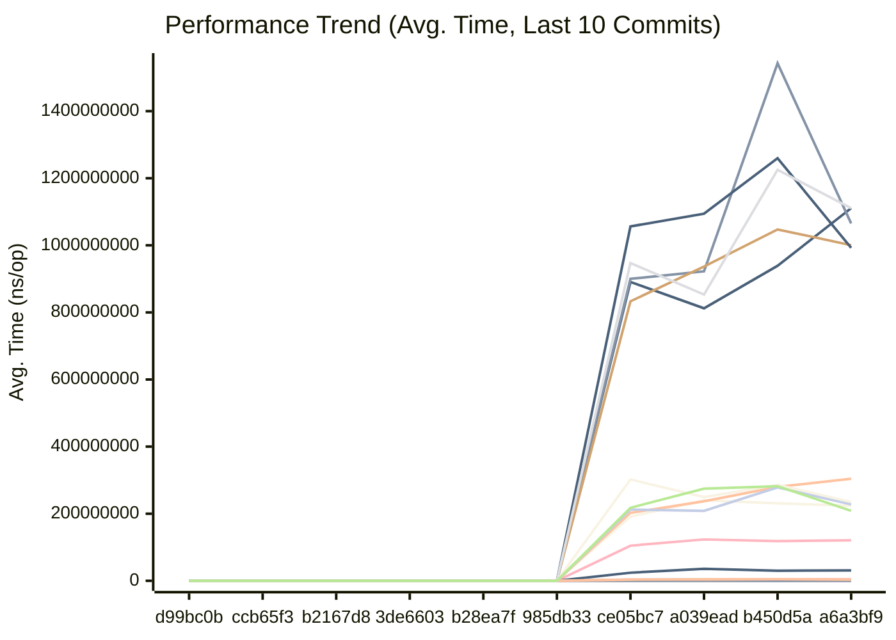
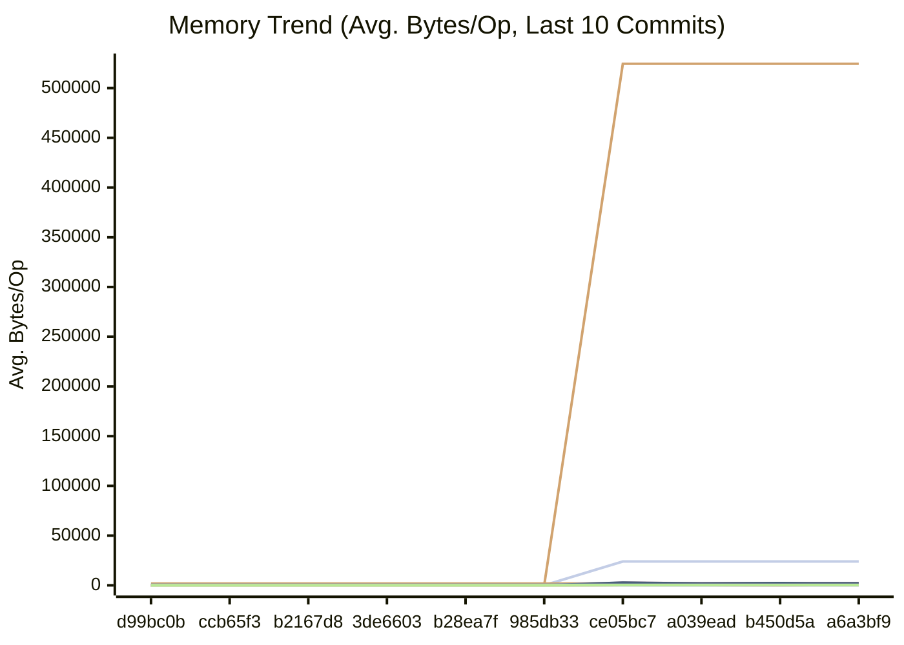
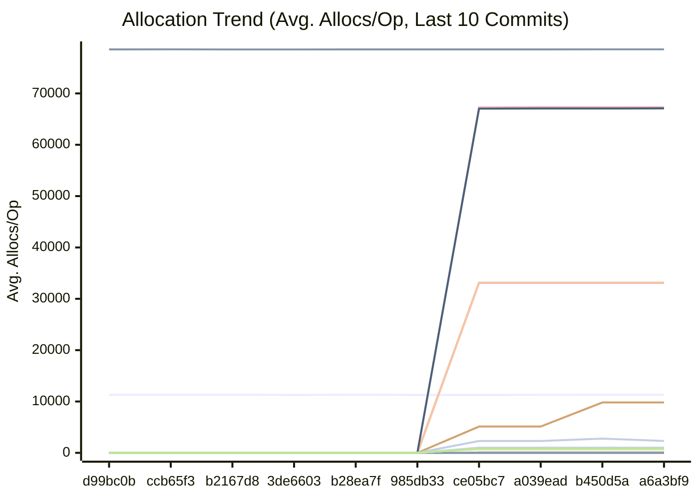

# Performance Benchmarks

This document tracks benchmark performance across commits. The section between
the `BENCHMARK_RESULTS_START/END` markers is auto-generated by the pre-commit
hook; the crypto/OPRF section below is manually maintained.

## How to Read This Document

- **Comparison with previous commit**: `benchstat` output comparing the current
  commit against the previous one. Three tables: **sec/op** (time per operation),
  **B/op** (bytes allocated), **allocs/op** (heap allocations). In each table,
  **lower is better**. `+X%` = regression, `-X%` = improvement, `~` = no
  statistically significant change. `p` is the p-value (p < 0.05 = significant).
- **Latest Benchmark Results**: Single-snapshot table of the current commit's
  averages. Lower values are better across all three columns.
- **Performance Trend plot**: X-axis = commit SHA (left = older, right = newer).
  Y-axis = avg time in ns/op. **Lower lines = faster.** Downward trends are
  improvements; upward spikes are regressions.
- **Memory Trend plot**: Same axes, but Y-axis = avg bytes allocated per op.
  **Lower lines = less memory.** Drops indicate allocation reductions.
- **Allocation Trend plot**: Same axes, but Y-axis = avg heap allocations per op.
  **Lower lines = fewer allocations.** Fewer allocs = less GC pressure.

<!-- BENCHMARK_RESULTS_START -->
## Performance

This section is automatically updated by our GitHub Actions workflow.

### Comparison with previous commit

Each table compares the previous commit (left) to the current commit (right).
**Lower is better** in all three tables. `+X%` = regression, `-X%` = improvement,
`~` = no statistically significant change (p >= 0.05).

- **sec/op**: Time per operation (nanoseconds). Measures raw speed.
- **B/op**: Bytes allocated on the heap per operation. Measures memory usage.
- **allocs/op**: Number of heap allocations per operation. Measures GC pressure.

```
                                      │ /tmp/old_bench_filtered.txt │      /tmp/new_bench_filtered.txt      │
                                      │           sec/op            │    sec/op      vs base                │
CrushOriginal-8                                        499.5n ± ∞ ¹    510.0n ± ∞ ¹       ~ (p=1.000 n=1) ²
Placement-8                                            5.406µ ± ∞ ¹    5.565µ ± ∞ ¹       ~ (p=1.000 n=1) ²
PlacementDomainSpread-8                                5.712µ ± ∞ ¹    5.726µ ± ∞ ¹       ~ (p=1.000 n=1) ²
CrushOptimized-8                                       395.2n ± ∞ ¹    387.6n ± ∞ ¹       ~ (p=1.000 n=1) ²
LoadGlobalConfig-8                                     11.43µ ± ∞ ¹    10.52µ ± ∞ ¹       ~ (p=1.000 n=1) ²
HashBytes/1MiB-8                                       4.084m ± ∞ ¹    3.235m ± ∞ ¹       ~ (p=1.000 n=1) ²
HashBytes/64MiB-8                                      230.8m ± ∞ ¹    223.7m ± ∞ ¹       ~ (p=1.000 n=1) ²
HashBytes/256MiB-8                                     938.9m ± ∞ ¹   1110.8m ± ∞ ¹       ~ (p=1.000 n=1) ²
HashFile/1MiB-8                                        3.929m ± ∞ ¹    4.017m ± ∞ ¹       ~ (p=1.000 n=1) ²
HashFile/64MiB-8                                       279.8m ± ∞ ¹    304.1m ± ∞ ¹       ~ (p=1.000 n=1) ²
HashFile/256MiB-8                                       1.543 ± ∞ ¹     1.065 ± ∞ ¹       ~ (p=1.000 n=1) ²
PadString-8                                            90.76n ± ∞ ¹    56.56n ± ∞ ¹       ~ (p=1.000 n=1) ²
SanitizeLog/Safe-8                                     263.8n ± ∞ ¹    286.0n ± ∞ ¹       ~ (p=1.000 n=1) ²
SanitizeLog/Unsafe-8                                   900.3n ± ∞ ¹    848.5n ± ∞ ¹       ~ (p=1.000 n=1) ²
AWSChunkedReaderSigned-8                               508.1µ ± ∞ ¹    513.7µ ± ∞ ¹       ~ (p=1.000 n=1) ²
AWSChunkedReaderUnsigned-8                             513.1µ ± ∞ ¹    555.4µ ± ∞ ¹       ~ (p=1.000 n=1) ²
FormatListObjectsV2XML_AppendFormat-8                  781.5µ ± ∞ ¹    825.9µ ± ∞ ¹       ~ (p=1.000 n=1) ²
FormatListObjectsV2XML_OldFormat-8                     438.0µ ± ∞ ¹    457.4µ ± ∞ ¹       ~ (p=1.000 n=1) ²
CheckMetricsAndSwap-8                                  10.01n ± ∞ ¹    10.44n ± ∞ ¹       ~ (p=1.000 n=1) ²
IndexSearch-8                                          2.889n ± ∞ ¹    3.266n ± ∞ ¹       ~ (p=1.000 n=1) ²
IndexDirectTracking-8                                 0.4619n ± ∞ ¹   0.5147n ± ∞ ¹       ~ (p=1.000 n=1) ²
LocalWrite/1MiB-8                                      623.0µ ± ∞ ¹    523.2µ ± ∞ ¹       ~ (p=1.000 n=1) ²
LocalWrite/64MiB-8                                     30.22m ± ∞ ¹    31.09m ± ∞ ¹       ~ (p=1.000 n=1) ²
LocalWrite/256MiB-8                                    118.2m ± ∞ ¹    120.7m ± ∞ ¹       ~ (p=1.000 n=1) ²
ReadVerify/1MiB-8                                      4.423m ± ∞ ¹    3.881m ± ∞ ¹       ~ (p=1.000 n=1) ²
ReadVerify/64MiB-8                                     278.3m ± ∞ ¹    227.8m ± ∞ ¹       ~ (p=1.000 n=1) ²
ReadVerify/256MiB-8                                     1.047 ± ∞ ¹     1.000 ± ∞ ¹       ~ (p=1.000 n=1) ²
TrustedRead/1MiB-8                                     4.640m ± ∞ ¹    3.223m ± ∞ ¹       ~ (p=1.000 n=1) ²
TrustedRead/64MiB-8                                    281.9m ± ∞ ¹    208.6m ± ∞ ¹       ~ (p=1.000 n=1) ²
TrustedRead/256MiB-8                                    1.225 ± ∞ ¹     1.111 ± ∞ ¹       ~ (p=1.000 n=1) ²
S3PutSpool/1MiB-8                                      4.622m ± ∞ ¹    4.130m ± ∞ ¹       ~ (p=1.000 n=1) ²
S3PutSpool/64MiB-8                                     286.3m ± ∞ ¹    234.9m ± ∞ ¹       ~ (p=1.000 n=1) ²
S3PutSpool/256MiB-8                                   1259.7m ± ∞ ¹    992.3m ± ∞ ¹       ~ (p=1.000 n=1) ²
geomean                                                584.9µ          546.9µ        -6.49%
¹ need >= 6 samples for confidence interval at level 0.95
² need >= 4 samples to detect a difference at alpha level 0.05

                                      │ /tmp/old_bench_filtered.txt │      /tmp/new_bench_filtered.txt      │
                                      │            B/op             │     B/op       vs base                │
CrushOriginal-8                                         164.0 ± ∞ ¹     164.0 ± ∞ ¹       ~ (p=1.000 n=1) ²
Placement-8                                             352.0 ± ∞ ¹     352.0 ± ∞ ¹       ~ (p=1.000 n=1) ²
PlacementDomainSpread-8                                 352.0 ± ∞ ¹     352.0 ± ∞ ¹       ~ (p=1.000 n=1) ²
CrushOptimized-8                                        0.000 ± ∞ ¹     0.000 ± ∞ ¹       ~ (p=1.000 n=1) ²
LoadGlobalConfig-8                                    1.930Ki ± ∞ ¹   1.930Ki ± ∞ ¹       ~ (p=1.000 n=1) ²
HashBytes/1MiB-8                                        64.00 ± ∞ ¹     64.00 ± ∞ ¹       ~ (p=1.000 n=1) ²
HashBytes/64MiB-8                                       64.00 ± ∞ ¹     64.00 ± ∞ ¹       ~ (p=1.000 n=1) ²
HashBytes/256MiB-8                                      64.00 ± ∞ ¹     64.00 ± ∞ ¹       ~ (p=1.000 n=1) ²
HashFile/1MiB-8                                       32.35Ki ± ∞ ¹   32.35Ki ± ∞ ¹       ~ (p=1.000 n=1) ²
HashFile/64MiB-8                                      32.35Ki ± ∞ ¹   32.35Ki ± ∞ ¹       ~ (p=1.000 n=1) ²
HashFile/256MiB-8                                     32.35Ki ± ∞ ¹   32.35Ki ± ∞ ¹       ~ (p=1.000 n=1) ²
PadString-8                                             64.00 ± ∞ ¹     64.00 ± ∞ ¹       ~ (p=1.000 n=1) ²
SanitizeLog/Safe-8                                      0.000 ± ∞ ¹     0.000 ± ∞ ¹       ~ (p=1.000 n=1) ²
SanitizeLog/Unsafe-8                                    704.0 ± ∞ ¹     704.0 ± ∞ ¹       ~ (p=1.000 n=1) ²
AWSChunkedReaderSigned-8                              11.03Ki ± ∞ ¹   11.03Ki ± ∞ ¹       ~ (p=1.000 n=1) ³
AWSChunkedReaderUnsigned-8                            76.74Ki ± ∞ ¹   76.74Ki ± ∞ ¹       ~ (p=1.000 n=1) ³
FormatListObjectsV2XML_AppendFormat-8                 512.2Ki ± ∞ ¹   512.2Ki ± ∞ ¹       ~ (p=1.000 n=1) ³
FormatListObjectsV2XML_OldFormat-8                    23.44Ki ± ∞ ¹   23.44Ki ± ∞ ¹       ~ (p=1.000 n=1) ²
CheckMetricsAndSwap-8                                   0.000 ± ∞ ¹     0.000 ± ∞ ¹       ~ (p=1.000 n=1) ²
IndexSearch-8                                           0.000 ± ∞ ¹     0.000 ± ∞ ¹       ~ (p=1.000 n=1) ²
IndexDirectTracking-8                                   0.000 ± ∞ ¹     0.000 ± ∞ ¹       ~ (p=1.000 n=1) ²
LocalWrite/1MiB-8                                     65.46Ki ± ∞ ¹   65.46Ki ± ∞ ¹       ~ (p=1.000 n=1) ³
LocalWrite/64MiB-8                                    65.51Ki ± ∞ ¹   65.52Ki ± ∞ ¹       ~ (p=1.000 n=1) ³
LocalWrite/256MiB-8                                   65.75Ki ± ∞ ¹   65.74Ki ± ∞ ¹       ~ (p=1.000 n=1) ³
ReadVerify/1MiB-8                                       436.0 ± ∞ ¹     459.0 ± ∞ ¹       ~ (p=1.000 n=1) ³
ReadVerify/64MiB-8                                    2.711Ki ± ∞ ¹   2.253Ki ± ∞ ¹       ~ (p=1.000 n=1) ³
ReadVerify/256MiB-8                                   9.578Ki ± ∞ ¹   9.578Ki ± ∞ ¹       ~ (p=1.000 n=1) ²
TrustedRead/1MiB-8                                      800.0 ± ∞ ¹     800.0 ± ∞ ¹       ~ (p=1.000 n=1) ²
TrustedRead/64MiB-8                                     800.0 ± ∞ ¹     800.0 ± ∞ ¹       ~ (p=1.000 n=1) ²
TrustedRead/256MiB-8                                    800.0 ± ∞ ¹     800.0 ± ∞ ¹       ~ (p=1.000 n=1) ²
S3PutSpool/1MiB-8                                       447.0 ± ∞ ¹     447.0 ± ∞ ¹       ~ (p=1.000 n=1) ²
S3PutSpool/64MiB-8                                      448.0 ± ∞ ¹     448.0 ± ∞ ¹       ~ (p=1.000 n=1) ²
S3PutSpool/256MiB-8                                     448.0 ± ∞ ¹     448.0 ± ∞ ¹       ~ (p=1.000 n=1) ²
geomean                                                           ⁴                  -0.40%               ⁴
¹ need >= 6 samples for confidence interval at level 0.95
² all samples are equal
³ need >= 4 samples to detect a difference at alpha level 0.05
⁴ summaries must be >0 to compute geomean

                                      │ /tmp/old_bench_filtered.txt │     /tmp/new_bench_filtered.txt      │
                                      │          allocs/op          │  allocs/op    vs base                │
CrushOriginal-8                                         3.000 ± ∞ ¹    3.000 ± ∞ ¹       ~ (p=1.000 n=1) ²
Placement-8                                             6.000 ± ∞ ¹    6.000 ± ∞ ¹       ~ (p=1.000 n=1) ²
PlacementDomainSpread-8                                 6.000 ± ∞ ¹    6.000 ± ∞ ¹       ~ (p=1.000 n=1) ²
CrushOptimized-8                                        0.000 ± ∞ ¹    0.000 ± ∞ ¹       ~ (p=1.000 n=1) ²
LoadGlobalConfig-8                                      58.00 ± ∞ ¹    58.00 ± ∞ ¹       ~ (p=1.000 n=1) ²
HashBytes/1MiB-8                                        1.000 ± ∞ ¹    1.000 ± ∞ ¹       ~ (p=1.000 n=1) ²
HashBytes/64MiB-8                                       1.000 ± ∞ ¹    1.000 ± ∞ ¹       ~ (p=1.000 n=1) ²
HashBytes/256MiB-8                                      1.000 ± ∞ ¹    1.000 ± ∞ ¹       ~ (p=1.000 n=1) ²
HashFile/1MiB-8                                         6.000 ± ∞ ¹    6.000 ± ∞ ¹       ~ (p=1.000 n=1) ²
HashFile/64MiB-8                                        6.000 ± ∞ ¹    6.000 ± ∞ ¹       ~ (p=1.000 n=1) ²
HashFile/256MiB-8                                       6.000 ± ∞ ¹    6.000 ± ∞ ¹       ~ (p=1.000 n=1) ²
PadString-8                                             1.000 ± ∞ ¹    1.000 ± ∞ ¹       ~ (p=1.000 n=1) ²
SanitizeLog/Safe-8                                      0.000 ± ∞ ¹    0.000 ± ∞ ¹       ~ (p=1.000 n=1) ²
SanitizeLog/Unsafe-8                                    1.000 ± ∞ ¹    1.000 ± ∞ ¹       ~ (p=1.000 n=1) ²
AWSChunkedReaderSigned-8                                80.00 ± ∞ ¹    80.00 ± ∞ ¹       ~ (p=1.000 n=1) ²
AWSChunkedReaderUnsigned-8                              15.00 ± ∞ ¹    15.00 ± ∞ ¹       ~ (p=1.000 n=1) ²
FormatListObjectsV2XML_AppendFormat-8                   16.00 ± ∞ ¹    16.00 ± ∞ ¹       ~ (p=1.000 n=1) ²
FormatListObjectsV2XML_OldFormat-8                     1.000k ± ∞ ¹   1.000k ± ∞ ¹       ~ (p=1.000 n=1) ²
CheckMetricsAndSwap-8                                   0.000 ± ∞ ¹    0.000 ± ∞ ¹       ~ (p=1.000 n=1) ²
IndexSearch-8                                           0.000 ± ∞ ¹    0.000 ± ∞ ¹       ~ (p=1.000 n=1) ²
IndexDirectTracking-8                                   0.000 ± ∞ ¹    0.000 ± ∞ ¹       ~ (p=1.000 n=1) ²
LocalWrite/1MiB-8                                       19.00 ± ∞ ¹    18.00 ± ∞ ¹       ~ (p=1.000 n=1) ³
LocalWrite/64MiB-8                                      18.00 ± ∞ ¹    18.00 ± ∞ ¹       ~ (p=1.000 n=1) ²
LocalWrite/256MiB-8                                     20.00 ± ∞ ¹    20.00 ± ∞ ¹       ~ (p=1.000 n=1) ²
ReadVerify/1MiB-8                                       6.000 ± ∞ ¹    6.000 ± ∞ ¹       ~ (p=1.000 n=1) ²
ReadVerify/64MiB-8                                      7.000 ± ∞ ¹    6.000 ± ∞ ¹       ~ (p=1.000 n=1) ³
ReadVerify/256MiB-8                                     10.00 ± ∞ ¹    10.00 ± ∞ ¹       ~ (p=1.000 n=1) ²
TrustedRead/1MiB-8                                      11.00 ± ∞ ¹    11.00 ± ∞ ¹       ~ (p=1.000 n=1) ²
TrustedRead/64MiB-8                                     11.00 ± ∞ ¹    11.00 ± ∞ ¹       ~ (p=1.000 n=1) ²
TrustedRead/256MiB-8                                    11.00 ± ∞ ¹    11.00 ± ∞ ¹       ~ (p=1.000 n=1) ²
S3PutSpool/1MiB-8                                       10.00 ± ∞ ¹    10.00 ± ∞ ¹       ~ (p=1.000 n=1) ²
S3PutSpool/64MiB-8                                      10.00 ± ∞ ¹    10.00 ± ∞ ¹       ~ (p=1.000 n=1) ²
S3PutSpool/256MiB-8                                     10.00 ± ∞ ¹    10.00 ± ∞ ¹       ~ (p=1.000 n=1) ²
geomean                                                           ⁴                 -0.63%               ⁴
¹ need >= 6 samples for confidence interval at level 0.95
² all samples are equal
³ need >= 4 samples to detect a difference at alpha level 0.05
⁴ summaries must be >0 to compute geomean

                           │ /tmp/old_bench_filtered.txt │      /tmp/new_bench_filtered.txt       │
                           │             B/s             │      B/s       vs base                 │
HashBytes/1MiB-8                           244.9Mi ± ∞ ¹   309.1Mi ± ∞ ¹        ~ (p=1.000 n=1) ²
HashBytes/64MiB-8                          277.3Mi ± ∞ ¹   286.1Mi ± ∞ ¹        ~ (p=1.000 n=1) ²
HashBytes/256MiB-8                         272.7Mi ± ∞ ¹   230.5Mi ± ∞ ¹        ~ (p=1.000 n=1) ²
HashFile/1MiB-8                            254.5Mi ± ∞ ¹   248.9Mi ± ∞ ¹        ~ (p=1.000 n=1) ²
HashFile/64MiB-8                           228.7Mi ± ∞ ¹   210.4Mi ± ∞ ¹        ~ (p=1.000 n=1) ²
HashFile/256MiB-8                          165.9Mi ± ∞ ¹   240.3Mi ± ∞ ¹        ~ (p=1.000 n=1) ²
AWSChunkedReaderSigned-8                   124.9Mi ± ∞ ¹   123.6Mi ± ∞ ¹        ~ (p=1.000 n=1) ²
AWSChunkedReaderUnsigned-8                 123.7Mi ± ∞ ¹   114.3Mi ± ∞ ¹        ~ (p=1.000 n=1) ²
LocalWrite/1MiB-8                          1.567Gi ± ∞ ¹   1.867Gi ± ∞ ¹        ~ (p=1.000 n=1) ²
LocalWrite/64MiB-8                         2.068Gi ± ∞ ¹   2.010Gi ± ∞ ¹        ~ (p=1.000 n=1) ²
LocalWrite/256MiB-8                        2.115Gi ± ∞ ¹   2.071Gi ± ∞ ¹        ~ (p=1.000 n=1) ²
ReadVerify/1MiB-8                          226.1Mi ± ∞ ¹   257.7Mi ± ∞ ¹        ~ (p=1.000 n=1) ²
ReadVerify/64MiB-8                         230.0Mi ± ∞ ¹   280.9Mi ± ∞ ¹        ~ (p=1.000 n=1) ²
ReadVerify/256MiB-8                        244.4Mi ± ∞ ¹   255.9Mi ± ∞ ¹        ~ (p=1.000 n=1) ²
TrustedRead/1MiB-8                         215.5Mi ± ∞ ¹   310.3Mi ± ∞ ¹        ~ (p=1.000 n=1) ²
TrustedRead/64MiB-8                        227.1Mi ± ∞ ¹   306.8Mi ± ∞ ¹        ~ (p=1.000 n=1) ²
TrustedRead/256MiB-8                       209.0Mi ± ∞ ¹   230.5Mi ± ∞ ¹        ~ (p=1.000 n=1) ²
S3PutSpool/1MiB-8                          216.3Mi ± ∞ ¹   242.1Mi ± ∞ ¹        ~ (p=1.000 n=1) ²
S3PutSpool/64MiB-8                         223.6Mi ± ∞ ¹   272.4Mi ± ∞ ¹        ~ (p=1.000 n=1) ²
S3PutSpool/256MiB-8                        203.2Mi ± ∞ ¹   258.0Mi ± ∞ ¹        ~ (p=1.000 n=1) ²
geomean                                    295.6Mi         328.1Mi        +10.99%
¹ need >= 6 samples for confidence interval at level 0.95
² need >= 4 samples to detect a difference at alpha level 0.05
```

### Latest Benchmark Results

Single-snapshot of the current commit's averages. **Lower is better** across all
three columns: time (speed), bytes (memory), allocs (GC pressure).


| Benchmark | Avg. Time/Op | Avg. Bytes/Op | Avg. Allocs/Op |
|-----------|--------------|---------------|----------------|
| BenchmarkAWSChunkedReaderSigned-8 | 513734.00 ns/op | 129.56 B/op | 11299.00 allocs/op |
| BenchmarkAWSChunkedReaderUnsigned-8 | 555370.00 ns/op | 119.85 B/op | 78586.00 allocs/op |
| BenchmarkCheckMetricsAndSwap-8 | 10.44 ns/op | 0.00 B/op | 0.00 allocs/op |
| BenchmarkCrushOptimized-8 | 387.60 ns/op | 0.00 B/op | 0.00 allocs/op |
| BenchmarkCrushOriginal-8 | 510.00 ns/op | 164.00 B/op | 3.00 allocs/op |
| BenchmarkFormatListObjectsV2XML_AppendFormat-8 | 825885.00 ns/op | 524463.00 B/op | 16.00 allocs/op |
| BenchmarkFormatListObjectsV2XML_OldFormat-8 | 457438.00 ns/op | 24000.00 B/op | 1000.00 allocs/op |
| BenchmarkHashBytes/1MiB-8 | 3234966.00 ns/op | 324.14 B/op | 64.00 allocs/op |
| BenchmarkHashBytes/256MiB-8 | 1110812216.00 ns/op | 241.66 B/op | 64.00 allocs/op |
| BenchmarkHashBytes/64MiB-8 | 223678991.00 ns/op | 300.02 B/op | 64.00 allocs/op |
| BenchmarkHashFile/1MiB-8 | 4016890.00 ns/op | 261.04 B/op | 33128.00 allocs/op |
| BenchmarkHashFile/256MiB-8 | 1065256239.00 ns/op | 251.99 B/op | 33128.00 allocs/op |
| BenchmarkHashFile/64MiB-8 | 304125965.00 ns/op | 220.66 B/op | 33128.00 allocs/op |
| BenchmarkIndexDirectTracking-8 | 0.51 ns/op | 0.00 B/op | 0.00 allocs/op |
| BenchmarkIndexSearch-8 | 3.27 ns/op | 0.00 B/op | 0.00 allocs/op |
| BenchmarkLoadGlobalConfig-8 | 10521.00 ns/op | 1976.00 B/op | 58.00 allocs/op |
| BenchmarkLocalWrite/1MiB-8 | 523182.00 ns/op | 2004.23 B/op | 67030.00 allocs/op |
| BenchmarkLocalWrite/256MiB-8 | 120742842.00 ns/op | 2223.20 B/op | 67317.00 allocs/op |
| BenchmarkLocalWrite/64MiB-8 | 31091015.00 ns/op | 2158.46 B/op | 67097.00 allocs/op |
| BenchmarkPadString-8 | 56.56 ns/op | 64.00 B/op | 1.00 allocs/op |
| BenchmarkPlacement-8 | 5565.00 ns/op | 352.00 B/op | 6.00 allocs/op |
| BenchmarkPlacementDomainSpread-8 | 5726.00 ns/op | 352.00 B/op | 6.00 allocs/op |
| BenchmarkReadVerify/1MiB-8 | 3880705.00 ns/op | 270.20 B/op | 459.00 allocs/op |
| BenchmarkReadVerify/256MiB-8 | 1000480549.00 ns/op | 268.31 B/op | 9808.00 allocs/op |
| BenchmarkReadVerify/64MiB-8 | 227817182.00 ns/op | 294.57 B/op | 2307.00 allocs/op |
| BenchmarkS3PutSpool/1MiB-8 | 4130137.00 ns/op | 253.88 B/op | 447.00 allocs/op |
| BenchmarkS3PutSpool/256MiB-8 | 992342042.00 ns/op | 270.51 B/op | 448.00 allocs/op |
| BenchmarkS3PutSpool/64MiB-8 | 234949006.00 ns/op | 285.63 B/op | 448.00 allocs/op |
| BenchmarkSanitizeLog/Safe-8 | 286.00 ns/op | 0.00 B/op | 0.00 allocs/op |
| BenchmarkSanitizeLog/Unsafe-8 | 848.50 ns/op | 704.00 B/op | 1.00 allocs/op |
| BenchmarkTrustedRead/1MiB-8 | 3222989.00 ns/op | 325.34 B/op | 800.00 allocs/op |
| BenchmarkTrustedRead/256MiB-8 | 1110598924.00 ns/op | 241.70 B/op | 800.00 allocs/op |
| BenchmarkTrustedRead/64MiB-8 | 208613545.00 ns/op | 321.69 B/op | 800.00 allocs/op |


### Performance History

**Legend**

| Color | Benchmark | Description |
|---|---|---|
| 🟢 | CheckMetricsAndSwap | Evaluation of system metrics (CPU/Mem) and mode switching logic |
| 🟤 | CrushOriginal | Original Sage Weil's CRUSH placement algorithm using reflection and float math |
| ⚪ | CrushOptimized | Performance-tuned CRUSH-lite placement algorithm using bitwise shifts and integer math (Rule 19) |
| 🔵 | IndexDirectTracking | Accessing current replication mode via direct slice index (O(1)) |
| 🔴 | IndexSearch | Searching for current replication mode in the order slice using `slices.Index` |
| 🟠 | LoadGlobalConfig | Parsing and loading the `[global]` section from the INI configuration |
| 🟣 | PadString | Padding strings with null characters to a fixed protocol length |
| 🟡 | ParseReplicationOrder | Parsing the CSV-formatted replication order string into an integer slice |

#### Time per Operation (ns/op)

X-axis: commit SHA (left = older, right = newer). Y-axis: avg time in ns/op.
**Lower lines = faster code.** Downward trends are improvements; upward spikes
are regressions to investigate.


```mermaid
xychart-beta
    title "Performance Trend (Avg. Time, Last 10 Commits)"
    x-axis "Commit"
    y-axis "Avg. Time (ns/op)"
    x-axis [d99bc0b,ccb65f3,b2167d8,3de6603,b28ea7f,985db33,ce05bc7,a039ead,b450d5a,a6a3bf9]
    line "AWSChunkedReaderSigned" [454201,498260,437140,488574,498069,465911,433775,468904,508062,513734]
    line "AWSChunkedReaderUnsigned" [472936,515178,422333,429659,468690,435995,410570,459580,513068,555370]
    line "CheckMetricsAndSwap" [11,10,8,8,11,8,8,8,10,10]
    line "CrushOptimized" [327,392,318,363,314,313,296,324,395,388]
    line "CrushOriginal" [473,508,433,434,468,438,389,424,500,510]
    line "FormatListObjectsV2XML_AppendFormat" [0,0,0,0,0,0,585500,632895,781453,825885]
    line "FormatListObjectsV2XML_OldFormat" [0,0,0,0,0,0,385936,392685,437988,457438]
    line "HashBytes/1MiB" [0,0,0,0,0,0,2943044,3455198,4083758,3234966]
    line "HashBytes/256MiB" [0,0,0,0,0,0,890920045,812286372,938923522,1110812216]
    line "HashBytes/64MiB" [0,0,0,0,0,0,191159849,239861268,230821474,223678991]
    line "HashFile/1MiB" [0,0,0,0,0,0,3438255,3866812,3929226,4016890]
    line "HashFile/256MiB" [0,0,0,0,0,0,900152012,922386758,1542681975,1065256239]
    line "HashFile/64MiB" [0,0,0,0,0,0,202378726,236988193,279832912,304125965]
    line "IndexDirectTracking" [0,0,0,0,0,0,0,0,0,1]
    line "IndexSearch" [3,3,3,2,2,2,3,3,3,3]
    line "LoadGlobalConfig" [9369,9892,8516,8353,9052,8987,8373,9135,11430,10521]
    line "LocalWrite/1MiB" [0,0,0,0,0,0,386344,535333,623012,523182]
    line "LocalWrite/256MiB" [0,0,0,0,0,0,104739454,123322682,118227363,120742842]
    line "LocalWrite/64MiB" [0,0,0,0,0,0,24065226,35686954,30222165,31091015]
    line "PadString" [55,47,40,42,47,44,41,47,91,57]
    line "ParseReplicationOrder_NoPrealloc" [350,349,357,354,345,225,229,165,232,234]
    line "ParseReplicationOrder_Prealloc" [229,231,237,234,229,108,107,80,110,109]
    line "Placement" [0,0,0,0,0,0,4402,4818,5406,5565]
    line "PlacementDomainSpread" [0,0,0,0,0,0,4713,5072,5712,5726]
    line "ReadVerify/1MiB" [0,0,0,0,0,0,3322226,4158622,4423216,3880705]
    line "ReadVerify/256MiB" [0,0,0,0,0,0,833047448,936726754,1047336519,1000480549]
    line "ReadVerify/64MiB" [0,0,0,0,0,0,212456699,208430448,278276063,227817182]
    line "S3PutSpool/1MiB" [0,0,0,0,0,0,3659136,3725511,4622411,4130137]
    line "S3PutSpool/256MiB" [0,0,0,0,0,0,1056311038,1094320670,1259669614,992342042]
    line "S3PutSpool/64MiB" [0,0,0,0,0,0,302092155,249542876,286259711,234949006]
    line "SanitizeLog/Safe" [236,244,225,243,248,275,222,246,264,286]
    line "SanitizeLog/Unsafe" [809,898,695,698,749,710,674,741,900,848]
    line "TrustedRead/1MiB" [0,0,0,0,0,0,3530931,3629261,4639890,3222989]
    line "TrustedRead/256MiB" [0,0,0,0,0,0,947127786,853259220,1225064259,1110598924]
    line "TrustedRead/64MiB" [0,0,0,0,0,0,217573714,274674598,281874202,208613545]
```

#### Memory per Operation (B/op)

X-axis: commit SHA. Y-axis: avg bytes allocated per op.
**Lower lines = less memory.** Drops indicate allocation reductions.


```mermaid
xychart-beta
    title "Memory Trend (Avg. Bytes/Op, Last 10 Commits)"
    x-axis "Commit"
    y-axis "Avg. Bytes/Op"
    x-axis [d99bc0b,ccb65f3,b2167d8,3de6603,b28ea7f,985db33,ce05bc7,a039ead,b450d5a,a6a3bf9]
    line "AWSChunkedReaderSigned" [147,134,152,136,134,143,153,142,131,130]
    line "AWSChunkedReaderUnsigned" [141,129,158,155,142,153,162,145,130,120]
    line "CheckMetricsAndSwap" [0,0,0,0,0,0,0,0,0,0]
    line "CrushOptimized" [0,0,0,0,0,0,0,0,0,0]
    line "CrushOriginal" [164,164,164,164,164,164,164,164,164,164]
    line "FormatListObjectsV2XML_AppendFormat" [0,0,0,0,0,0,524440,524442,524457,524463]
    line "FormatListObjectsV2XML_OldFormat" [0,0,0,0,0,0,24000,24000,24000,24000]
    line "HashBytes/1MiB" [0,0,0,0,0,0,356,303,257,324]
    line "HashBytes/256MiB" [0,0,0,0,0,0,301,330,286,242]
    line "HashBytes/64MiB" [0,0,0,0,0,0,351,280,291,300]
    line "HashFile/1MiB" [0,0,0,0,0,0,305,271,267,261]
    line "HashFile/256MiB" [0,0,0,0,0,0,298,291,174,252]
    line "HashFile/64MiB" [0,0,0,0,0,0,332,283,240,221]
    line "IndexDirectTracking" [0,0,0,0,0,0,0,0,0,0]
    line "IndexSearch" [0,0,0,0,0,0,0,0,0,0]
    line "LoadGlobalConfig" [1848,1848,1848,1848,1848,1848,1976,1976,1976,1976]
    line "LocalWrite/1MiB" [0,0,0,0,0,0,2714,1959,1683,2004]
    line "LocalWrite/256MiB" [0,0,0,0,0,0,2563,2177,2270,2223]
    line "LocalWrite/64MiB" [0,0,0,0,0,0,2789,1880,2221,2158]
    line "PadString" [64,64,64,64,64,64,64,64,64,64]
    line "ParseReplicationOrder_NoPrealloc" [408,408,408,408,408,248,248,248,248,248]
    line "ParseReplicationOrder_Prealloc" [240,240,240,240,240,80,80,80,80,80]
    line "Placement" [0,0,0,0,0,0,352,352,352,352]
    line "PlacementDomainSpread" [0,0,0,0,0,0,352,352,352,352]
    line "ReadVerify/1MiB" [0,0,0,0,0,0,316,252,237,270]
    line "ReadVerify/256MiB" [0,0,0,0,0,0,322,287,256,268]
    line "ReadVerify/64MiB" [0,0,0,0,0,0,316,322,241,295]
    line "S3PutSpool/1MiB" [0,0,0,0,0,0,287,281,227,254]
    line "S3PutSpool/256MiB" [0,0,0,0,0,0,254,245,213,271]
    line "S3PutSpool/64MiB" [0,0,0,0,0,0,222,269,234,286]
    line "SanitizeLog/Safe" [0,0,0,0,0,0,0,0,0,0]
    line "SanitizeLog/Unsafe" [704,704,704,704,704,704,704,704,704,704]
    line "TrustedRead/1MiB" [0,0,0,0,0,0,297,289,226,325]
    line "TrustedRead/256MiB" [0,0,0,0,0,0,283,315,219,242]
    line "TrustedRead/64MiB" [0,0,0,0,0,0,308,244,238,322]
```

#### Allocations per Operation (allocs/op)

X-axis: commit SHA. Y-axis: avg heap allocations per op.
**Lower lines = fewer allocations.** Fewer allocs = less GC pressure.


```mermaid
xychart-beta
    title "Allocation Trend (Avg. Allocs/Op, Last 10 Commits)"
    x-axis "Commit"
    y-axis "Avg. Allocs/Op"
    x-axis [d99bc0b,ccb65f3,b2167d8,3de6603,b28ea7f,985db33,ce05bc7,a039ead,b450d5a,a6a3bf9]
    line "AWSChunkedReaderSigned" [11294,11296,11294,11282,11296,11273,11277,11286,11294,11299]
    line "AWSChunkedReaderUnsigned" [78574,78587,78561,78563,78568,78577,78572,78577,78583,78586]
    line "CheckMetricsAndSwap" [0,0,0,0,0,0,0,0,0,0]
    line "CrushOptimized" [0,0,0,0,0,0,0,0,0,0]
    line "CrushOriginal" [3,3,3,3,3,3,3,3,3,3]
    line "FormatListObjectsV2XML_AppendFormat" [0,0,0,0,0,0,16,16,16,16]
    line "FormatListObjectsV2XML_OldFormat" [0,0,0,0,0,0,1000,1000,1000,1000]
    line "HashBytes/1MiB" [0,0,0,0,0,0,64,64,64,64]
    line "HashBytes/256MiB" [0,0,0,0,0,0,64,64,64,64]
    line "HashBytes/64MiB" [0,0,0,0,0,0,64,64,64,64]
    line "HashFile/1MiB" [0,0,0,0,0,0,33128,33128,33128,33128]
    line "HashFile/256MiB" [0,0,0,0,0,0,33128,33128,33128,33128]
    line "HashFile/64MiB" [0,0,0,0,0,0,33128,33128,33128,33128]
    line "IndexDirectTracking" [0,0,0,0,0,0,0,0,0,0]
    line "IndexSearch" [0,0,0,0,0,0,0,0,0,0]
    line "LoadGlobalConfig" [54,54,54,54,54,54,58,58,58,58]
    line "LocalWrite/1MiB" [0,0,0,0,0,0,67030,67032,67032,67030]
    line "LocalWrite/256MiB" [0,0,0,0,0,0,67292,67348,67326,67317]
    line "LocalWrite/64MiB" [0,0,0,0,0,0,67046,67073,67085,67097]
    line "PadString" [1,1,1,1,1,1,1,1,1,1]
    line "ParseReplicationOrder_NoPrealloc" [6,6,6,6,6,5,5,5,5,5]
    line "ParseReplicationOrder_Prealloc" [2,2,2,2,2,1,1,1,1,1]
    line "Placement" [0,0,0,0,0,0,6,6,6,6]
    line "PlacementDomainSpread" [0,0,0,0,0,0,6,6,6,6]
    line "ReadVerify/1MiB" [0,0,0,0,0,0,435,464,436,459]
    line "ReadVerify/256MiB" [0,0,0,0,0,0,5120,5120,9808,9808]
    line "ReadVerify/64MiB" [0,0,0,0,0,0,2307,2307,2776,2307]
    line "S3PutSpool/1MiB" [0,0,0,0,0,0,447,447,447,447]
    line "S3PutSpool/256MiB" [0,0,0,0,0,0,448,448,448,448]
    line "S3PutSpool/64MiB" [0,0,0,0,0,0,448,448,448,448]
    line "SanitizeLog/Safe" [0,0,0,0,0,0,0,0,0,0]
    line "SanitizeLog/Unsafe" [1,1,1,1,1,1,1,1,1,1]
    line "TrustedRead/1MiB" [0,0,0,0,0,0,800,800,800,800]
    line "TrustedRead/256MiB" [0,0,0,0,0,0,800,800,800,800]
    line "TrustedRead/64MiB" [0,0,0,0,0,0,800,800,800,800]
```
<!-- BENCHMARK_RESULTS_END -->

### E2EE + OPRF overhead

The sections above are auto-generated and cover the hot-path benchmarks. The
crypto/OPRF work is measured separately; figures below are from `go test -bench`
on the crypto module and are intentionally placed outside the auto-managed block
so they persist.

**Lower is better** across all columns. These benchmarks run on `src/crypto` only
(not tracked in the auto-generated plots above).

| Benchmark | What it measures | Avg. Time/Op | Avg. Bytes/Op | Avg. Allocs/Op |
|-----------|------------------|--------------|---------------|----------------|
| EncryptStream | AES-GCM-256 chunked encryption (64KB input) | ~63 µs | 167 KB | 14 |
| DecryptStream | AES-GCM-256 chunked decryption (64KB input) | ~54 µs | 136 KB | 13 |
| DeriveKey | HKDF-SHA256 key derivation per tenant | ~3.5 µs | 1.3 KB | 18 |
| OPRFCombineThreshold3 | Threshold-3 OPRF combine + unblind (Ristretto255) | ~530 µs | 2.3 KB | 62 |

With `encryption_enabled`, every byte passes through AES-GCM-256 streaming at
~800-1200 MB/s (chunk-bounded memory). The streaming format is **StreamVersion
v4 (issue #824)** with a self-describing chunk size: the default 4096-byte
chunk preserves prior throughput, and the chunk size can be raised/lowered via
`SetStreamChunkSize` within `[512, 4096]` for latency/memory trade-offs without
a wire change in framing beyond the 2-byte header field (v3/v2 blobs still
decode). The threshold OPRF is evaluated **once per
upload/download**, on the dedup tag only (never per chunk):
`OPRFCombineThreshold3` measures a one-time ~0.53 ms client-side combine/unblind
for threshold-3, plus one round-trip per daemon share. This is negligible against
network/disk I/O and does not affect streaming throughput. When `oprf_enabled =
false`, the OPRF path is skipped entirely and behavior is identical to the
pre-OPRF encryption path (backward compatible).
