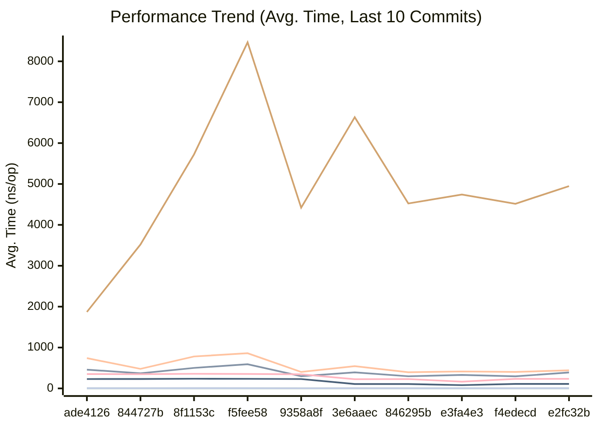
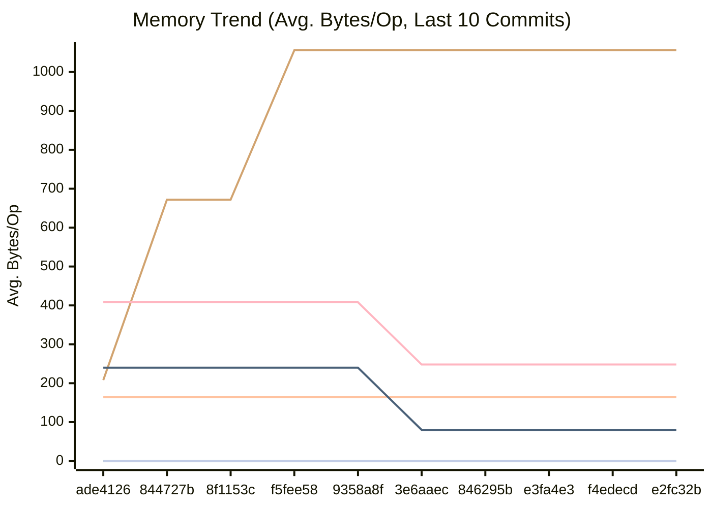
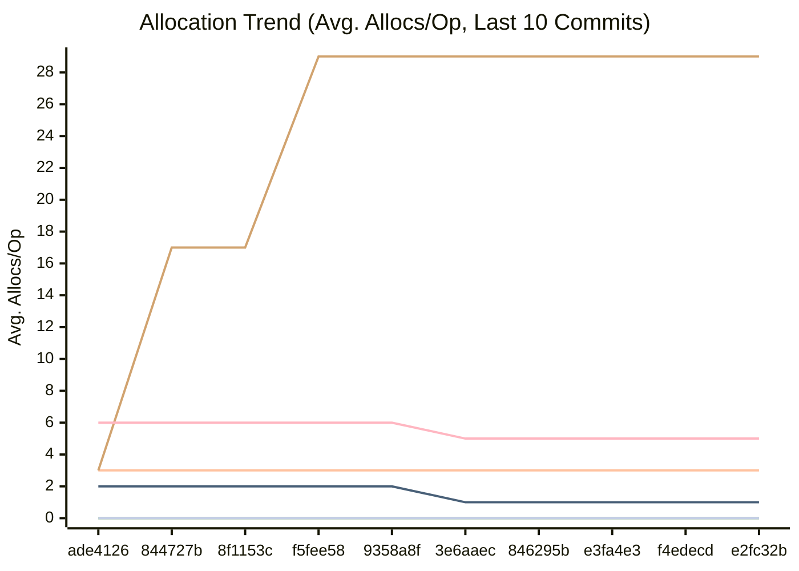

<!-- BENCHMARK_RESULTS_START -->
## Performance

This section is automatically updated by our GitHub Actions workflow.

### Comparison with previous commit

```
                      │ /tmp/old_bench_filtered.txt │      /tmp/new_bench_filtered.txt       │
                      │           sec/op            │    sec/op      vs base                 │
CrushOriginal-8                        402.7n ± ∞ ¹    441.6n ± ∞ ¹        ~ (p=1.000 n=1) ²
CrushOptimized-8                       294.6n ± ∞ ¹    388.6n ± ∞ ¹        ~ (p=1.000 n=1) ²
LoadGlobalConfig-8                     4.516µ ± ∞ ¹    4.948µ ± ∞ ¹        ~ (p=1.000 n=1) ²
PadString-8                            1.913n ± ∞ ¹    2.289n ± ∞ ¹        ~ (p=1.000 n=1) ²
CheckMetricsAndSwap-8                  8.540n ± ∞ ¹   13.320n ± ∞ ¹        ~ (p=1.000 n=1) ²
IndexSearch-8                          1.777n ± ∞ ¹    2.046n ± ∞ ¹        ~ (p=1.000 n=1) ²
IndexDirectTracking-8                 0.3374n ± ∞ ¹   0.3519n ± ∞ ¹        ~ (p=1.000 n=1) ²
geomean                                24.47n          29.32n        +19.85%
¹ need >= 6 samples for confidence interval at level 0.95
² need >= 4 samples to detect a difference at alpha level 0.05

                      │ /tmp/old_bench_filtered.txt │      /tmp/new_bench_filtered.txt      │
                      │            B/op             │     B/op       vs base                │
CrushOriginal-8                         164.0 ± ∞ ¹     164.0 ± ∞ ¹       ~ (p=1.000 n=1) ²
CrushOptimized-8                        0.000 ± ∞ ¹     0.000 ± ∞ ¹       ~ (p=1.000 n=1) ²
LoadGlobalConfig-8                    1.031Ki ± ∞ ¹   1.031Ki ± ∞ ¹       ~ (p=1.000 n=1) ²
PadString-8                             0.000 ± ∞ ¹     0.000 ± ∞ ¹       ~ (p=1.000 n=1) ²
CheckMetricsAndSwap-8                   0.000 ± ∞ ¹     0.000 ± ∞ ¹       ~ (p=1.000 n=1) ²
IndexSearch-8                           0.000 ± ∞ ¹     0.000 ± ∞ ¹       ~ (p=1.000 n=1) ²
IndexDirectTracking-8                   0.000 ± ∞ ¹     0.000 ± ∞ ¹       ~ (p=1.000 n=1) ²
geomean                                           ³                  +0.00%               ³
¹ need >= 6 samples for confidence interval at level 0.95
² all samples are equal
³ summaries must be >0 to compute geomean

                      │ /tmp/old_bench_filtered.txt │     /tmp/new_bench_filtered.txt     │
                      │          allocs/op          │  allocs/op   vs base                │
CrushOriginal-8                         3.000 ± ∞ ¹   3.000 ± ∞ ¹       ~ (p=1.000 n=1) ²
CrushOptimized-8                        0.000 ± ∞ ¹   0.000 ± ∞ ¹       ~ (p=1.000 n=1) ²
LoadGlobalConfig-8                      29.00 ± ∞ ¹   29.00 ± ∞ ¹       ~ (p=1.000 n=1) ²
PadString-8                             0.000 ± ∞ ¹   0.000 ± ∞ ¹       ~ (p=1.000 n=1) ²
CheckMetricsAndSwap-8                   0.000 ± ∞ ¹   0.000 ± ∞ ¹       ~ (p=1.000 n=1) ²
IndexSearch-8                           0.000 ± ∞ ¹   0.000 ± ∞ ¹       ~ (p=1.000 n=1) ²
IndexDirectTracking-8                   0.000 ± ∞ ¹   0.000 ± ∞ ¹       ~ (p=1.000 n=1) ²
geomean                                           ³                +0.00%               ³
¹ need >= 6 samples for confidence interval at level 0.95
² all samples are equal
³ summaries must be >0 to compute geomean
```

### Latest Benchmark Results


| Benchmark | Avg. Time/Op | Avg. Bytes/Op | Avg. Allocs/Op |
|-----------|--------------|---------------|----------------|
| BenchmarkCheckMetricsAndSwap-8 | 13.32 ns/op | 0.00 B/op | 0.00 allocs/op |
| BenchmarkCrushOptimized-8 | 388.60 ns/op | 0.00 B/op | 0.00 allocs/op |
| BenchmarkCrushOriginal-8 | 441.60 ns/op | 164.00 B/op | 3.00 allocs/op |
| BenchmarkIndexDirectTracking-8 | 0.35 ns/op | 0.00 B/op | 0.00 allocs/op |
| BenchmarkIndexSearch-8 | 2.05 ns/op | 0.00 B/op | 0.00 allocs/op |
| BenchmarkLoadGlobalConfig-8 | 4948.00 ns/op | 1056.00 B/op | 29.00 allocs/op |
| BenchmarkPadString-8 | 2.29 ns/op | 0.00 B/op | 0.00 allocs/op |


### Performance History

**Legend**

| Color | Benchmark | Description |
|---|---|---|
| 🟢 | CheckMetricsAndSwap | Evaluation of system metrics (CPU/Mem) and mode switching logic |
| 🟤 | CrushOriginal | Original Sage Weil's CRUSH placement algorithm using reflection and float math |
| ⚪ | CrushOptimized | Performance-tuned CRUSH-lite placement algorithm using bitwise shifts and integer math (Rule 19) |
| 🔵 | IndexDirectTracking | Accessing current replication mode via direct slice index (O(1)) |
| 🔴 | IndexSearch | Searching for current replication mode in the order slice using `slices.Index` |
| 🟠 | LoadGlobalConfig | Parsing and loading the `[global]` section from the INI configuration |
| 🟣 | PadString | Padding strings with null characters to a fixed protocol length |
| 🟡 | ParseReplicationOrder | Parsing the CSV-formatted replication order string into an integer slice |


```mermaid
xychart-beta
    title "Performance Trend (Avg. Time, Last 10 Commits)"
    x-axis "Commit"
    y-axis "Avg. Time (ns/op)"
    x-axis [ade4126,844727b,8f1153c,f5fee58,9358a8f,3e6aaec,846295b,e3fa4e3,f4edecd,e2fc32b]
    line "CheckMetricsAndSwap" [13,10,15,14,8,11,8,8,9,13]
    line "CrushOptimized" [458,370,501,592,298,393,297,329,295,389]
    line "CrushOriginal" [740,478,781,860,403,545,396,415,403,442]
    line "IndexDirectTracking" [1,0,1,1,0,0,0,0,0,0]
    line "IndexSearch" [2,2,3,3,2,2,2,2,2,2]
    line "LoadGlobalConfig" [1870,3519,5724,8465,4420,6633,4524,4742,4516,4948]
    line "PadString" [3,2,3,3,2,3,2,2,2,2]
    line "ParseReplicationOrder_NoPrealloc" [350,349,357,354,345,225,229,165,232,234]
    line "ParseReplicationOrder_Prealloc" [229,231,237,234,229,108,107,80,110,109]
```


```mermaid
xychart-beta
    title "Memory Trend (Avg. Bytes/Op, Last 10 Commits)"
    x-axis "Commit"
    y-axis "Avg. Bytes/Op"
    x-axis [ade4126,844727b,8f1153c,f5fee58,9358a8f,3e6aaec,846295b,e3fa4e3,f4edecd,e2fc32b]
    line "CheckMetricsAndSwap" [0,0,0,0,0,0,0,0,0,0]
    line "CrushOptimized" [0,0,0,0,0,0,0,0,0,0]
    line "CrushOriginal" [164,164,164,164,164,164,164,164,164,164]
    line "IndexDirectTracking" [0,0,0,0,0,0,0,0,0,0]
    line "IndexSearch" [0,0,0,0,0,0,0,0,0,0]
    line "LoadGlobalConfig" [208,672,672,1056,1056,1056,1056,1056,1056,1056]
    line "PadString" [0,0,0,0,0,0,0,0,0,0]
    line "ParseReplicationOrder_NoPrealloc" [408,408,408,408,408,248,248,248,248,248]
    line "ParseReplicationOrder_Prealloc" [240,240,240,240,240,80,80,80,80,80]
```


```mermaid
xychart-beta
    title "Allocation Trend (Avg. Allocs/Op, Last 10 Commits)"
    x-axis "Commit"
    y-axis "Avg. Allocs/Op"
    x-axis [ade4126,844727b,8f1153c,f5fee58,9358a8f,3e6aaec,846295b,e3fa4e3,f4edecd,e2fc32b]
    line "CheckMetricsAndSwap" [0,0,0,0,0,0,0,0,0,0]
    line "CrushOptimized" [0,0,0,0,0,0,0,0,0,0]
    line "CrushOriginal" [3,3,3,3,3,3,3,3,3,3]
    line "IndexDirectTracking" [0,0,0,0,0,0,0,0,0,0]
    line "IndexSearch" [0,0,0,0,0,0,0,0,0,0]
    line "LoadGlobalConfig" [3,17,17,29,29,29,29,29,29,29]
    line "PadString" [0,0,0,0,0,0,0,0,0,0]
    line "ParseReplicationOrder_NoPrealloc" [6,6,6,6,6,5,5,5,5,5]
    line "ParseReplicationOrder_Prealloc" [2,2,2,2,2,1,1,1,1,1]
```
<!-- BENCHMARK_RESULTS_END -->
