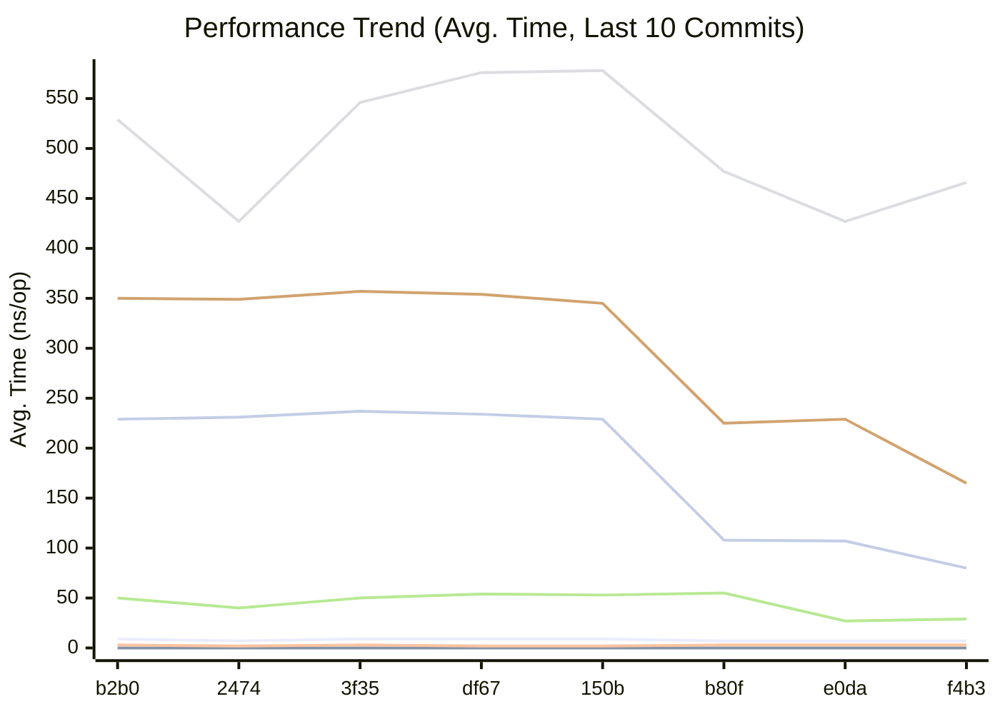
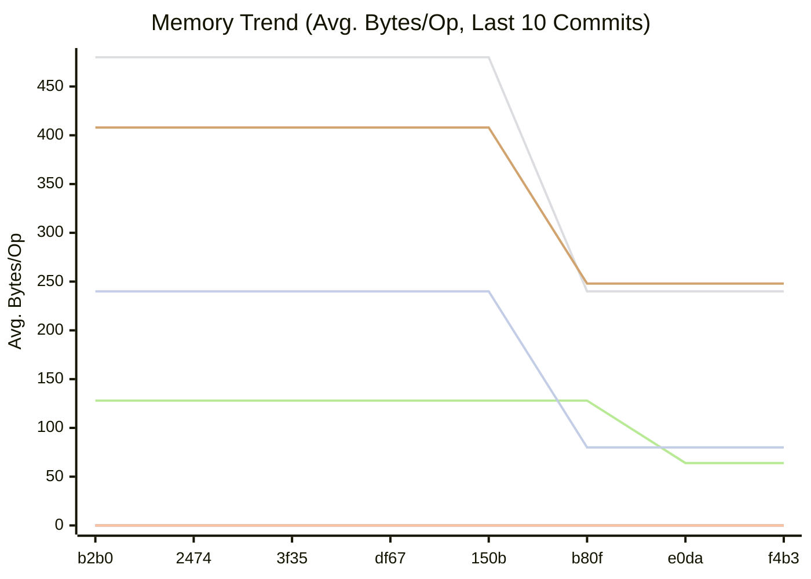
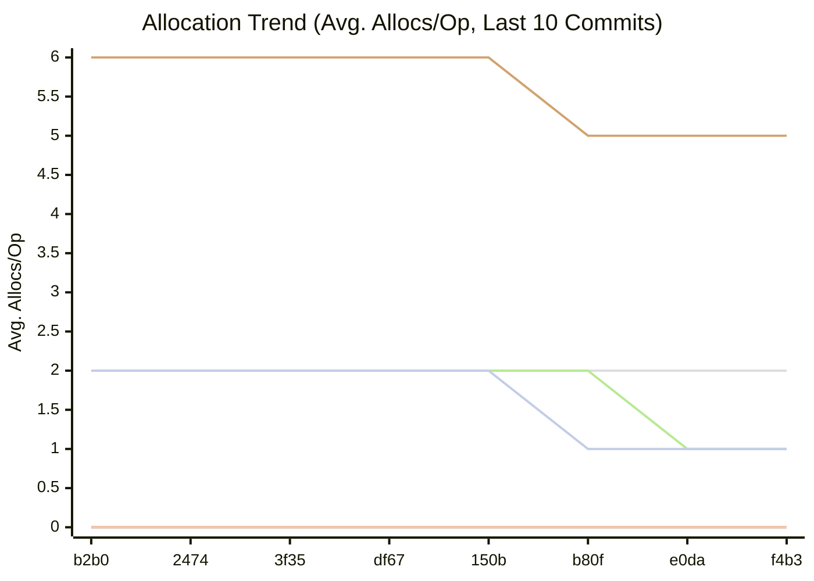

# Momo

Momo is a high-performance, transport-agnostic file replication playground written in Go. It demonstrates several replication strategies and a simple, metrics‑driven controller that can switch strategies at runtime (a “polymorphic” system), optimized with zero-allocation techniques. It fully supports both legacy TCP (`momo-tcp`) and modern QUIC (`momo-quic`) transports.

This document explains the architecture, configuration, wire protocol, replication modes, and how to run the client and servers.

## Key Performance & Security Features (⚡ Bolt & 🛡️ Sentinel)

- **Pluggable Transport Layer**: Communicate seamlessly over raw TCP, encrypted QUIC streams, or upcoming **S3 compatibility** layers (tracking in [#131](https://github.com/alsotoes/momo/issues/131) and [#133](https://github.com/alsotoes/momo/issues/133)) via the modular `ProtocolFactory`.
- **Automated AI Governance**: Integrated **Gemini AI Reviewer** to automatically enforce architectural patterns (⚡ Bolt, 🛡️ Sentinel) and project steering rules on every Pull Request.

- **Zero-Allocation Hashing & Encoding**: SHA-256 sums and hex encoding use stack-allocated buffers to eliminate heap escapes.
- **Phased Absolute Deadlines**: Continuous protection against Slowloris attacks with strict bounds for handshake (10s), metadata (60s), and dynamic transfer phases.
- **Bitwise Deadline Amortization**: Reduces `SetDeadline` system calls by ~98% in hot paths.
- **Consolidated Network I/O**: Merges authentication tokens, timestamps, and payloads into unified writes to minimize syscalls and Nagle delays.
- **Security Hardening**: Mandatory 64-byte AuthToken validation, CRLF log injection protection, and comprehensive `AUDIT:` logging for all sensitive operations.

## Repository Layout

- `.github/scripts/`: Automation and governance scripts.
  - `ai_reviewer.py`: Python-based Gemini AI code review engine.
  - `test-e2e.sh`: End-to-end integration test runner.
  - `update_readme_with_benchmarks.sh`: Automated documentation updater.
- `src/momo.go`: Entry point (client/server runner and metrics bootstrap).
- `src/transport/`: Pluggable communication layers and protocol implementations.
  - `communicator.go`: Central `Communicator` and `MomoListener` interfaces.
  - `factory.go`: `ProtocolFactory` for instantiating transports.
  - `momo_tcp.go`: Legacy TCP implementation.
  - `momo_quic.go`: Modern QUIC implementation using `quic-go`.
  - `s3_communicator.go`: S3-compatible REST API mapping.
- `src/client/`: Client-side logic for cluster replication and file forwarding.
  - `client.go`: Main cluster connection and parallel file transmission logic.
- `src/common/`: Agnostic, shared utilities.
  - `config.go`: Optimized INI configuration loader.
  - `hash.go`: Optimized file SHA-256 hashing.
  - `log.go`: Secure logging with CRLF sanitization.
  - `string.go`: Performance-tuned string padding.
  - `constants.go`: Shared system-wide protocol constants.
- `src/server/`: Server daemon and file reception logic.
  - `server.go`: Core Daemon loop utilizing pluggable transports.
  - `file.go`: Secure metadata parsing and file writing.
  - `replication.go`: Dynamic replication mode control server.
- `src/metrics/`: Performance monitoring and polymorphic control loop.
- `conf/momo.conf`: Secure configuration example.

## Replication Modes

Constants (see `src/common/constants.go`):

- `1`: **Chain Replication**: Data follows an ordered path (A -> B -> C) determined by the CRUSH placement list.
- `2`: **Splay Replication**: The primary forwards data to all other nodes in the CRUSH list concurrently.
- `3`: **Primary-Splay Replication**: The client uploads to all nodes in the CRUSH list simultaneously.
- `4`: **No Replication**: Standalone storage on the selected primary node.

## Data Flow

Handshake and transfer overview:

1. **Secure Handshake**: Client opens a network connection (TCP, QUIC, or S3) and sends a combined **84-byte packet** (64-byte AuthToken + 19-byte Timestamp + 1-byte RequestedMode).
2. **Replication Negotiation**: Server validates token and acknowledges the mode. If the client is external, the server selects the mode based on its polymorphic metrics.
3. **Metadata & Deduplication**: Client sends metadata (Hash, Name, Size). Server queries its local **Bbolt** index and responds with a status code. If the hash exists, the payload phase is skipped (**CAS Deduplication**).
4. **Streamed Payload**: Client streams file bytes until EOF.
5. **Validation & ACK**: Server writes to disk via `io.TeeReader` (simultaneous hashing), validates integrity, and replies with `ACK{serverId}`.

## Configuration

File: `conf/momo.conf`. Ensure the `auth_token` matches on all nodes and is exactly 64 bytes for maximum entropy.

## Building and Running

Ensure Go 1.25+ is installed.

```bash
# Build binary
make build

# Start a node
./bin/momo -imp server -id 0
```

## Performance & Monitoring

Momo includes a built-in benchmarking suite and performance history tracking. Refer to the [Performance](#performance) section below for the latest metrics.

<!-- BENCHMARK_RESULTS_START -->
## Performance

This section is automatically updated by our GitHub Actions workflow.

### Comparison with previous commit

```
                      │ /tmp/old_bench_filtered.txt │     /tmp/new_bench_filtered.txt     │
                      │           sec/op            │    sec/op      vs base              │
LoadGlobalConfig-4                     421.7n ± ∞ ¹    430.8n ± ∞ ¹  +2.16% (p=0.008 n=5)
PadString-4                            1.249n ± ∞ ¹    1.249n ± ∞ ¹       ~ (p=0.913 n=5)
CheckMetricsAndSwap-4                  6.883n ± ∞ ¹    6.869n ± ∞ ¹       ~ (p=0.310 n=5)
IndexSearch-4                          2.185n ± ∞ ¹    2.189n ± ∞ ¹       ~ (p=0.452 n=5)
IndexDirectTracking-4                 0.3125n ± ∞ ¹   0.3119n ± ∞ ¹       ~ (p=0.333 n=5)
geomean                                4.772n          4.791n        +0.39%
¹ need >= 6 samples for confidence interval at level 0.95

                      │ /tmp/old_bench_filtered.txt │     /tmp/new_bench_filtered.txt     │
                      │            B/op             │    B/op      vs base                │
LoadGlobalConfig-4                      160.0 ± ∞ ¹   160.0 ± ∞ ¹       ~ (p=1.000 n=5) ²
PadString-4                             0.000 ± ∞ ¹   0.000 ± ∞ ¹       ~ (p=1.000 n=5) ²
CheckMetricsAndSwap-4                   0.000 ± ∞ ¹   0.000 ± ∞ ¹       ~ (p=1.000 n=5) ²
IndexSearch-4                           0.000 ± ∞ ¹   0.000 ± ∞ ¹       ~ (p=1.000 n=5) ²
IndexDirectTracking-4                   0.000 ± ∞ ¹   0.000 ± ∞ ¹       ~ (p=1.000 n=5) ²
geomean                                           ³                +0.00%               ³
¹ need >= 6 samples for confidence interval at level 0.95
² all samples are equal
³ summaries must be >0 to compute geomean

                      │ /tmp/old_bench_filtered.txt │     /tmp/new_bench_filtered.txt     │
                      │          allocs/op          │  allocs/op   vs base                │
LoadGlobalConfig-4                      1.000 ± ∞ ¹   1.000 ± ∞ ¹       ~ (p=1.000 n=5) ²
PadString-4                             0.000 ± ∞ ¹   0.000 ± ∞ ¹       ~ (p=1.000 n=5) ²
CheckMetricsAndSwap-4                   0.000 ± ∞ ¹   0.000 ± ∞ ¹       ~ (p=1.000 n=5) ²
IndexSearch-4                           0.000 ± ∞ ¹   0.000 ± ∞ ¹       ~ (p=1.000 n=5) ²
IndexDirectTracking-4                   0.000 ± ∞ ¹   0.000 ± ∞ ¹       ~ (p=1.000 n=5) ²
geomean                                           ³                +0.00%               ³
¹ need >= 6 samples for confidence interval at level 0.95
² all samples are equal
³ summaries must be >0 to compute geomean
```

### Latest Benchmark Results


| Benchmark | Avg. Time/Op | Avg. Bytes/Op | Avg. Allocs/Op |
|-----------|--------------|---------------|----------------|
| BenchmarkCheckMetricsAndSwap-4 | 6.87 ns/op | 0.00 B/op | 0.00 allocs/op |
| BenchmarkIndexDirectTracking-4 | 0.31 ns/op | 0.00 B/op | 0.00 allocs/op |
| BenchmarkIndexSearch-4 | 2.19 ns/op | 0.00 B/op | 0.00 allocs/op |
| BenchmarkLoadGlobalConfig-4 | 431.16 ns/op | 160.00 B/op | 1.00 allocs/op |
| BenchmarkPadString-4 | 1.25 ns/op | 0.00 B/op | 0.00 allocs/op |


### Performance History

**Legend**

| Color | Benchmark | Description |
|---|---|---|
| 🟢 | CheckMetricsAndSwap | Evaluation of system metrics (CPU/Mem) and mode switching logic |
| 🔵 | IndexDirectTracking | Accessing current replication mode via direct slice index (O(1)) |
| 🔴 | IndexSearch | Searching for current replication mode in the order slice using `slices.Index` |
| 🟠 | LoadGlobalConfig | Parsing and loading the `[global]` section from the INI configuration |
| 🟣 | PadString | Padding strings with null characters to a fixed protocol length |
| 🟡 | ParseReplicationOrder | Parsing the CSV-formatted replication order string into an integer slice |






<!-- BENCHMARK_RESULTS_END -->
