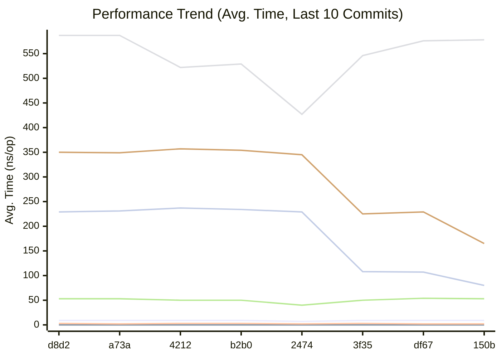
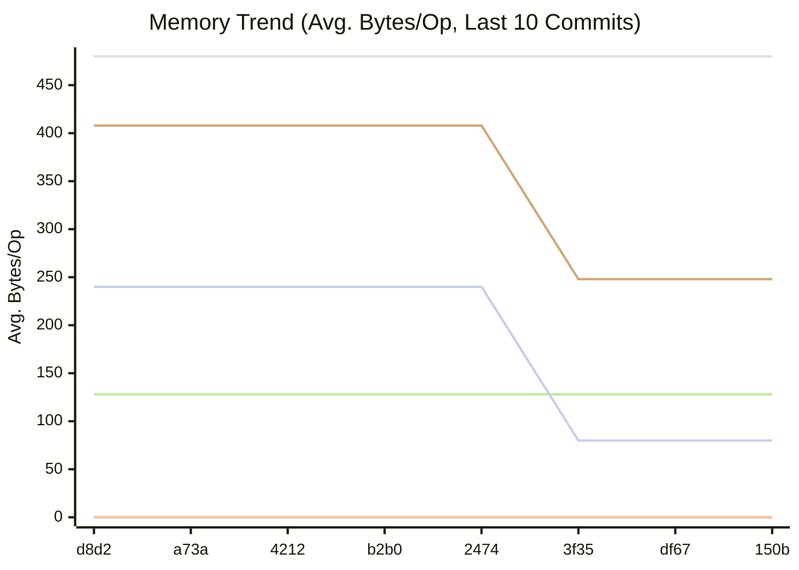
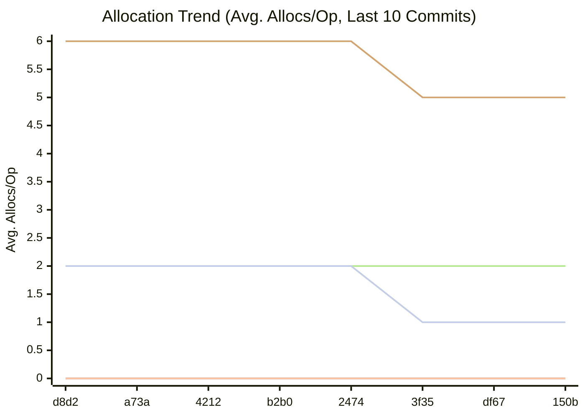

# Momo

Momo is a high-performance, transport-agnostic file replication playground written in Go. It demonstrates several replication strategies and a simple, metrics‑driven controller that can switch strategies at runtime (a “polymorphic” system), optimized with zero-allocation techniques. It fully supports both legacy TCP (`momo-tcp`) and modern QUIC (`momo-quic`) transports.

This document explains the architecture, configuration, wire protocol, replication modes, and how to run the client and servers.

## Key Performance & Security Features (⚡ Bolt & 🛡️ Sentinel)

- **Pluggable Transport Layer**: Communicate seamlessly over raw TCP or encrypted QUIC streams via the modular `ProtocolFactory`.

- **Zero-Allocation Hashing & Encoding**: SHA-256 sums and hex encoding use stack-allocated buffers to eliminate heap escapes.
- **Phased Absolute Deadlines**: Continuous protection against Slowloris attacks with strict bounds for handshake (10s), metadata (60s), and dynamic transfer phases.
- **Bitwise Deadline Amortization**: Reduces `SetDeadline` system calls by ~98% in hot paths.
- **Consolidated Network I/O**: Merges authentication tokens, timestamps, and payloads into unified writes to minimize syscalls and Nagle delays.
- **Security Hardening**: Mandatory 64-byte AuthToken validation, CRLF log injection protection, and comprehensive `AUDIT:` logging for all sensitive operations.

## Repository Layout

- `src/momo.go`: Entry point (client/server runner and metrics bootstrap).
- `src/common/`: Shared types, config loader, logging, helpers, constants.
  - `constants.go`: Wire/field lengths and replication constants.
  - `config.go`: INI configuration loader (`conf/momo.conf`).
  - `struct.go`: Config and metadata structs.
  - `hash.go`: Optimized file SHA-256 hashing.
  - `log.go`: Secure logging with CRLF sanitization.
  - `net.go`: High-performance `IdleTimeoutConn` with bitwise amortization.
- `src/server/`: Server daemon, file receive, and replication control server.
  - `server.go`: Optimized TCP server with phased deadlines and audit logging.
  - `file.go`: High-performance metadata parsing and secure file reception.
  - `replication.go`: Replication control server with secure authentication.
- `src/metrics/`: Metrics loop and push of replication changes.
  - `metrics.go`: Optimized CPU/mem sampling and mode switching.
- `conf/momo.conf`: Secure configuration example.

## Replication Modes

Constants (see `src/common/constants.go`):

- `1`: Chain Replication (0 -> 1 -> 2)
- `2`: Splay Replication (0 -> 1, 0 -> 2)
- `3`: Primary-Splay Replication (Client -> 0, 1, 2)
- `4`: No Replication (Standalone)

## Data Flow

Handshake and transfer overview:

1. **Secure Handshake**: Client opens a TCP connection and sends a combined 83-byte packet (64-byte AuthToken + 19-byte Timestamp).
2. **Replication Negotiation**: Server validates token, decides the mode, and responds with a single ASCII mode code.
3. **Metadata Exchange**: Client sends metadata: 64-byte hex SHA-256, 64-byte name, and 64-byte size (null-padded).
4. **Streamed Payload**: Client streams file bytes until EOF.
5. **Validation & ACK**: Server writes to disk via `io.TeeReader` (simultaneous hashing), validates integrity, and replies with `ACK{serverId}`.

## Configuration

File: `conf/momo.conf`. Ensure the `auth_token` matches on all nodes and is exactly 64 bytes for maximum entropy.

## Building and Running

Ensure Go 1.20+ is installed.

```bash
# Build binary
make build

# Start a node
./bin/momo -imp server -id 0
```

## Performance & Monitoring

Momo includes a built-in benchmarking suite and performance history tracking. Refer to the [Performance](#performance) section below for the latest metrics.

<!-- BENCHMARK_RESULTS_START -->
## Performance

This section is automatically updated by our GitHub Actions workflow.

### Comparison with previous commit

```
                      │ old_bench_filtered.txt │        new_bench_filtered.txt        │
                      │         sec/op         │    sec/op      vs base               │
LoadGlobalConfig-4                426.8n ± ∞ ¹    426.7n ± ∞ ¹        ~ (p=0.937 n=5)
PadString-4                       51.45n ± ∞ ¹    26.78n ± ∞ ¹  -47.95% (p=0.008 n=5)
CheckMetricsAndSwap-4             6.307n ± ∞ ¹    6.856n ± ∞ ¹   +8.70% (p=0.016 n=5)
IndexSearch-4                     3.881n ± ∞ ¹    2.707n ± ∞ ¹  -30.25% (p=0.008 n=5)
IndexDirectTracking-4            0.3530n ± ∞ ¹   0.3529n ± ∞ ¹        ~ (p=0.841 n=5)
geomean                           11.37n          9.437n        -16.98%
¹ need >= 6 samples for confidence interval at level 0.95

                      │ old_bench_filtered.txt │        new_bench_filtered.txt        │
                      │          B/op          │    B/op      vs base                 │
LoadGlobalConfig-4                 240.0 ± ∞ ¹   240.0 ± ∞ ¹        ~ (p=1.000 n=5) ²
PadString-4                       128.00 ± ∞ ¹   64.00 ± ∞ ¹  -50.00% (p=0.008 n=5)
CheckMetricsAndSwap-4              0.000 ± ∞ ¹   0.000 ± ∞ ¹        ~ (p=1.000 n=5) ²
IndexSearch-4                      0.000 ± ∞ ¹   0.000 ± ∞ ¹        ~ (p=1.000 n=5) ²
IndexDirectTracking-4              0.000 ± ∞ ¹   0.000 ± ∞ ¹        ~ (p=1.000 n=5) ²
geomean                                      ³                -12.94%               ³
¹ need >= 6 samples for confidence interval at level 0.95
² all samples are equal
³ summaries must be >0 to compute geomean

                      │ old_bench_filtered.txt │        new_bench_filtered.txt        │
                      │       allocs/op        │  allocs/op   vs base                 │
LoadGlobalConfig-4                 2.000 ± ∞ ¹   2.000 ± ∞ ¹        ~ (p=1.000 n=5) ²
PadString-4                        2.000 ± ∞ ¹   1.000 ± ∞ ¹  -50.00% (p=0.008 n=5)
CheckMetricsAndSwap-4              0.000 ± ∞ ¹   0.000 ± ∞ ¹        ~ (p=1.000 n=5) ²
IndexSearch-4                      0.000 ± ∞ ¹   0.000 ± ∞ ¹        ~ (p=1.000 n=5) ²
IndexDirectTracking-4              0.000 ± ∞ ¹   0.000 ± ∞ ¹        ~ (p=1.000 n=5) ²
geomean                                      ³                -12.94%               ³
¹ need >= 6 samples for confidence interval at level 0.95
² all samples are equal
³ summaries must be >0 to compute geomean
```

### Latest Benchmark Results


| Benchmark | Avg. Time/Op | Avg. Bytes/Op | Avg. Allocs/Op |
|-----------|--------------|---------------|----------------|
| BenchmarkCheckMetricsAndSwap-4 | 6.77 ns/op | 0.00 B/op | 0.00 allocs/op |
| BenchmarkIndexDirectTracking-4 | 0.35 ns/op | 0.00 B/op | 0.00 allocs/op |
| BenchmarkIndexSearch-4 | 2.65 ns/op | 0.00 B/op | 0.00 allocs/op |
| BenchmarkLoadGlobalConfig-4 | 427.40 ns/op | 240.00 B/op | 2.00 allocs/op |
| BenchmarkPadString-4 | 27.11 ns/op | 64.00 B/op | 1.00 allocs/op |


### Performance History

**Legend**

| Color | Benchmark | Description |
|---|---|---|
| 🟢 | CheckMetricsAndSwap | Evaluation of system metrics (CPU/Mem) and mode switching logic |
| 🔵 | IndexDirectTracking | Accessing current replication mode via direct slice index (O(1)) |
| 🔴 | IndexSearch | Searching for current replication mode in the order slice using `slices.Index` |
| 🟠 | LoadGlobalConfig | Parsing and loading the `[global]` section from the INI configuration |
| 🟣 | PadString | Padding strings with null characters to a fixed protocol length |
| 🟡 | ParseReplicationOrder | Parsing the CSV-formatted replication order string into an integer slice |






<!-- BENCHMARK_RESULTS_END -->
